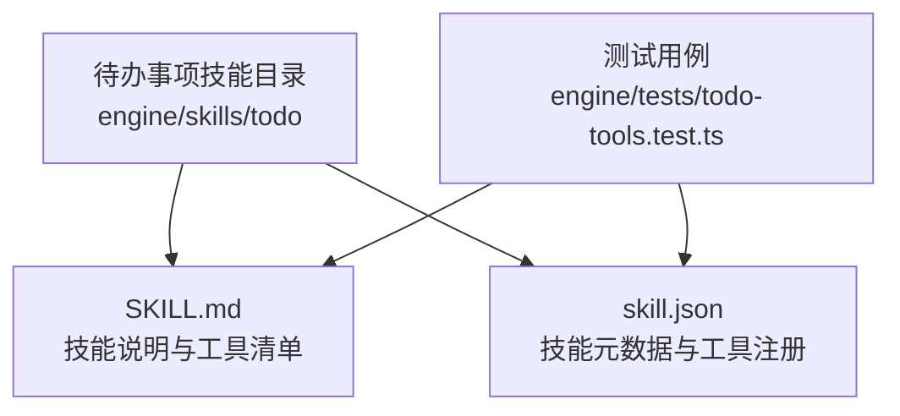
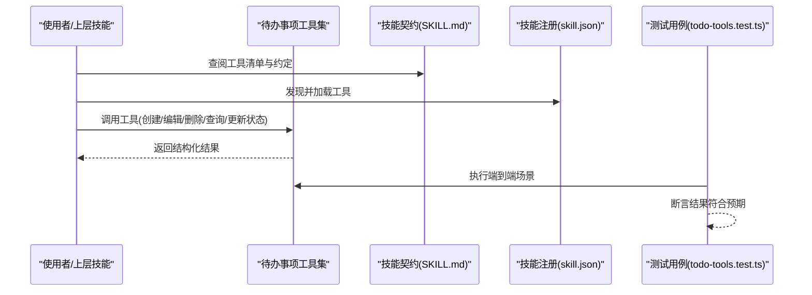
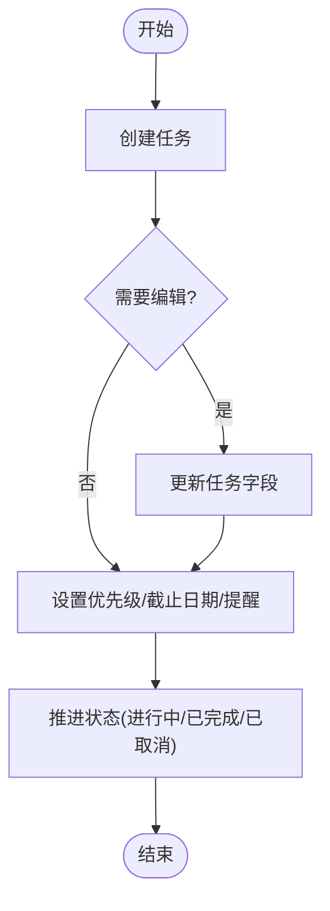
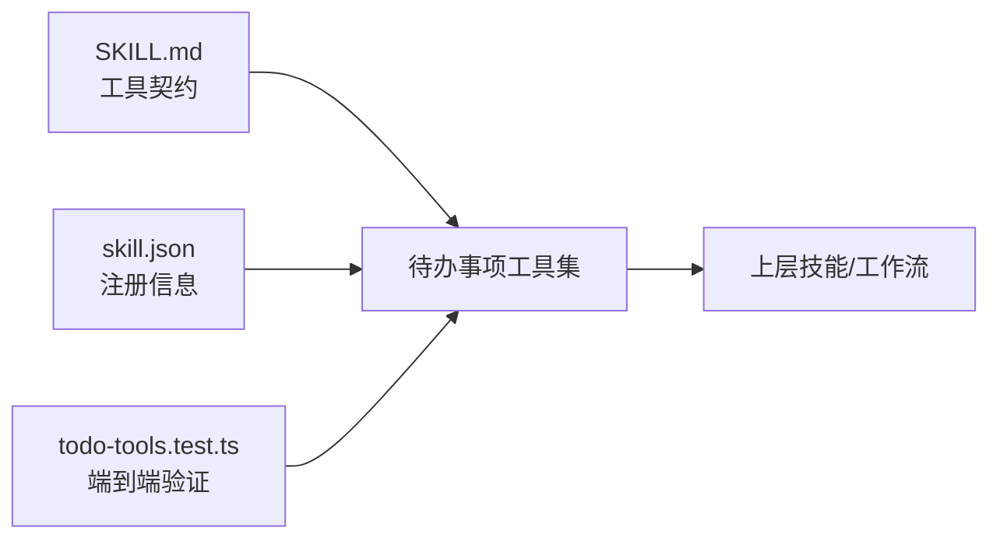

# 待办事项技能

<cite>
**本文引用的文件**   
- [engine/skills/todo/SKILL.md](file://engine/skills/todo/SKILL.md)
- [engine/skills/todo/skill.json](file://engine/skills/todo/skill.json)
- [engine/tests/todo-tools.test.ts](file://engine/tests/todo-tools.test.ts)
</cite>

## 目录
1. [简介](#简介)
2. [项目结构](#项目结构)
3. [核心组件](#核心组件)
4. [架构总览](#架构总览)
5. [详细组件分析](#详细组件分析)
6. [依赖分析](#依赖分析)
7. [性能考虑](#性能考虑)
8. [故障排查指南](#故障排查指南)
9. [结论](#结论)
10. [附录](#附录)

## 简介
本文件为“待办事项技能”的权威使用文档，面向个人与团队用户，覆盖任务管理、优先级排序、进度跟踪、分类与标签、搜索过滤、提醒与截止日期、与其他技能的集成（如代码审查、调试建议、重构任务自动入队）、团队协作的任务分配与同步机制，以及最佳实践和时间管理技巧。内容基于仓库中待办事项技能的定义与测试用例进行梳理，确保与实际实现保持一致。

## 项目结构
待办事项技能位于 engine/skills/todo 目录下，包含能力描述与工具清单：
- SKILL.md：技能说明、可用工具、使用约定与示例
- skill.json：技能元数据与工具注册信息

此外，tests/todo-tools.test.ts 提供了该技能的端到端行为验证，有助于理解工具的输入输出与交互流程。

图表来源
- [engine/skills/todo/SKILL.md](file://engine/skills/todo/SKILL.md)
- [engine/skills/todo/skill.json](file://engine/skills/todo/skill.json)
- [engine/tests/todo-tools.test.ts](file://engine/tests/todo-tools.test.ts)

章节来源
- [engine/skills/todo/SKILL.md](file://engine/skills/todo/SKILL.md)
- [engine/skills/todo/skill.json](file://engine/skills/todo/skill.json)
- [engine/tests/todo-tools.test.ts](file://engine/tests/todo-tools.test.ts)

## 核心组件
- 任务模型与状态
  - 任务具备标题、描述、状态、优先级、截止日期、提醒、分类/标签等属性；支持创建、编辑、删除、查询、更新状态等操作。
- 工具集
  - 提供一组工具用于任务的增删改查、状态推进、筛选与统计等。
- 规则与约定
  - 在 SKILL.md 中定义了工具调用约定、参数约束、错误处理与返回格式。

章节来源
- [engine/skills/todo/SKILL.md](file://engine/skills/todo/SKILL.md)
- [engine/skills/todo/skill.json](file://engine/skills/todo/skill.json)

## 架构总览
待办事项技能以“工具+技能契约”的方式暴露能力，上层技能或工作流通过标准协议调用这些工具完成任务管理。测试用例展示了典型调用序列与结果校验方式。

图表来源
- [engine/skills/todo/SKILL.md](file://engine/skills/todo/SKILL.md)
- [engine/skills/todo/skill.json](file://engine/skills/todo/skill.json)
- [engine/tests/todo-tools.test.ts](file://engine/tests/todo-tools.test.ts)

## 详细组件分析

### 任务生命周期与状态管理
- 典型状态流转：新建 → 进行中 → 已完成/已取消
- 关键操作：
  - 创建任务：设置标题、描述、优先级、截止日期、提醒、分类/标签
  - 编辑任务：修改任意可编辑字段
  - 删除任务：物理或软删除（依实现）
  - 状态推进：从“新建”到“进行中”，再到“已完成/已取消”
- 进度跟踪：通过状态与可选的子任务/检查点体现

章节来源
- [engine/skills/todo/SKILL.md](file://engine/skills/todo/SKILL.md)
- [engine/tests/todo-tools.test.ts](file://engine/tests/todo-tools.test.ts)

### 优先级、提醒与截止日期
- 优先级：高/中/低（或数值等级），影响排序与视图展示
- 截止日期：用于时间管理与到期提醒
- 提醒：可在指定时间点触发通知或提示
- 组合策略：按优先级与截止日期共同排序，优先处理“高优先级且即将到期”的任务

章节来源
- [engine/skills/todo/SKILL.md](file://engine/skills/todo/SKILL.md)

### 分类、标签与搜索过滤
- 分类：用于宏观组织（如“开发”、“运维”、“学习”）
- 标签：细粒度标记（如“bug”、“feature”、“refactor”）
- 搜索与过滤：支持按关键词、分类、标签、状态、日期范围等多维度筛选

章节来源
- [engine/skills/todo/SKILL.md](file://engine/skills/todo/SKILL.md)

### 与其他技能的集成
- 代码审查：将审查意见转化为待办项，附带来源链接与严重级别
- 调试建议：将定位到的问题与建议修复步骤写入待办
- 重构任务：将识别出的重构点自动加入待办列表，便于后续排期
- 集成方式：由上游技能生成结构化任务数据，调用待办事项工具入库

章节来源
- [engine/skills/todo/SKILL.md](file://engine/skills/todo/SKILL.md)

### 团队协作：任务分配与同步
- 任务分配：为任务指定负责人或协作成员
- 同步机制：多人协作时保持状态一致，避免冲突
- 变更可见性：记录关键变更历史，便于追溯

章节来源
- [engine/skills/todo/SKILL.md](file://engine/skills/todo/SKILL.md)

### 使用示例（个人与团队）
- 个人任务组织
  - 创建每日任务清单，设置优先级与截止时间
  - 使用标签区分“紧急”、“重要”、“可延后”
  - 利用搜索快速定位特定主题任务
- 团队任务协同
  - 将代码审查结果批量转为待办，指派给相关成员
  - 将调试建议与重构任务纳入迭代计划
  - 定期同步状态，清理已完成项

章节来源
- [engine/skills/todo/SKILL.md](file://engine/skills/todo/SKILL.md)
- [engine/tests/todo-tools.test.ts](file://engine/tests/todo-tools.test.ts)

## 依赖分析
- 内部依赖
  - 工具清单与契约：由 SKILL.md 定义
  - 注册与发现：由 skill.json 提供
  - 行为验证：由 tests/todo-tools.test.ts 覆盖
- 外部依赖
  - 上层技能或工作流通过统一接口调用待办事项工具

图表来源
- [engine/skills/todo/SKILL.md](file://engine/skills/todo/SKILL.md)
- [engine/skills/todo/skill.json](file://engine/skills/todo/skill.json)
- [engine/tests/todo-tools.test.ts](file://engine/tests/todo-tools.test.ts)

章节来源
- [engine/skills/todo/SKILL.md](file://engine/skills/todo/SKILL.md)
- [engine/skills/todo/skill.json](file://engine/skills/todo/skill.json)
- [engine/tests/todo-tools.test.ts](file://engine/tests/todo-tools.test.ts)

## 性能考虑
- 批量操作：合并多次更新以减少往返开销
- 索引与筛选：合理设计分类/标签/状态字段以提升查询效率
- 分页与限流：对大规模任务列表采用分页与限制返回条数
- 缓存热点：对常用筛选条件进行短期缓存

[本节为通用指导，不直接分析具体文件]

## 故障排查指南
- 常见问题
  - 工具未找到：确认 skill.json 是否正确注册
  - 参数校验失败：核对必填字段与类型约束
  - 状态不一致：检查并发更新与同步机制
- 定位方法
  - 参考测试用例中的断言与错误路径
  - 查看工具返回的错误码与消息
  - 复现最小化用例，逐步缩小范围

章节来源
- [engine/tests/todo-tools.test.ts](file://engine/tests/todo-tools.test.ts)

## 结论
待办事项技能通过清晰的工具契约与注册机制，为个人与团队提供完整的任务管理能力。结合优先级、提醒、截止日期、分类与标签，以及与其他技能的自动化集成，能够显著提升开发与协作效率。遵循本文的最佳实践与时间管理技巧，可进一步优化产出与节奏。

[本节为总结性内容，不直接分析具体文件]

## 附录
- 术语表
  - 任务：可执行的最小工作单元
  - 状态：任务当前所处阶段
  - 优先级：任务的重要程度
  - 截止日期：期望完成的时间点
  - 提醒：在指定时间触发通知
  - 分类/标签：用于组织与检索的元数据
- 最佳实践
  - 明确任务边界，避免过大任务
  - 设定合理的优先级与截止日期
  - 及时归档已完成任务
  - 使用标签与分类建立一致的命名规范
  - 定期回顾与清理，保持清单精简

[本节为补充信息，不直接分析具体文件]