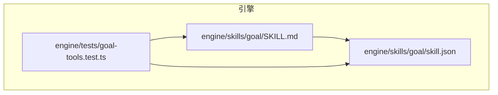
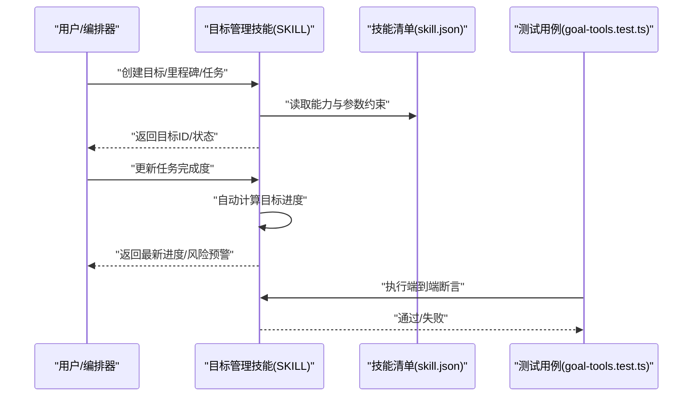
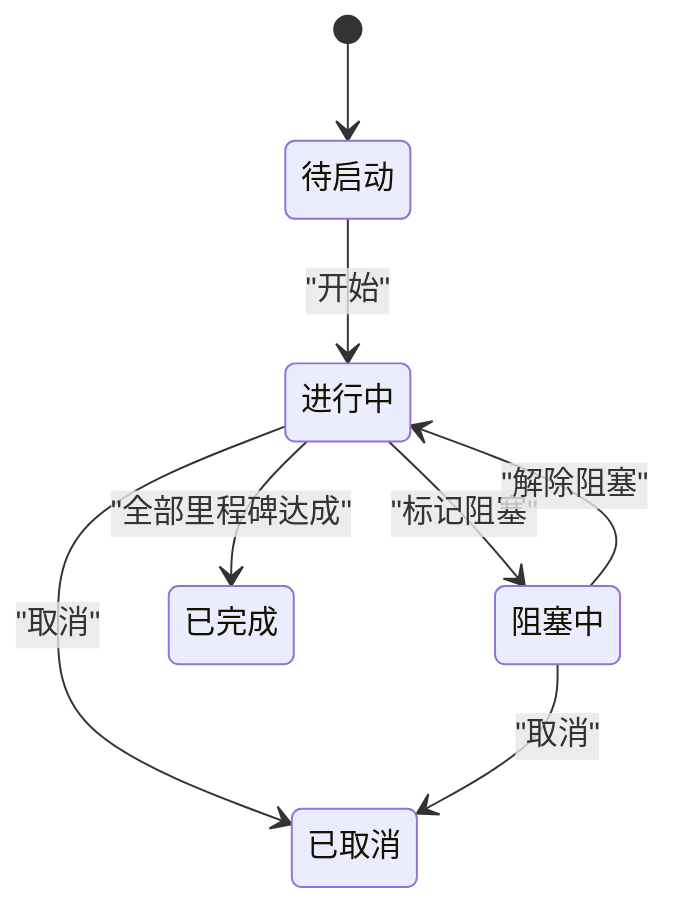
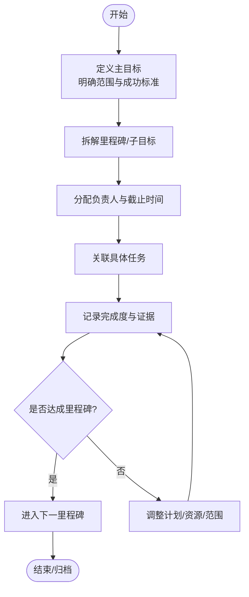
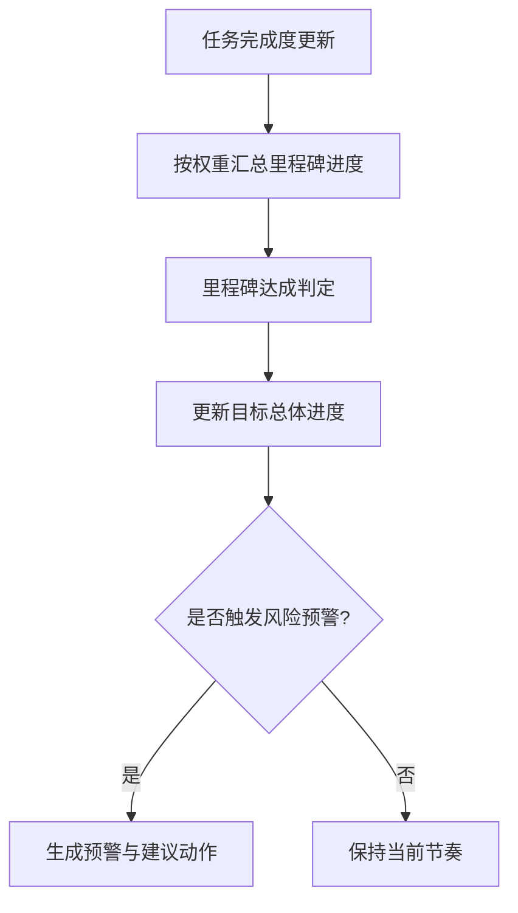
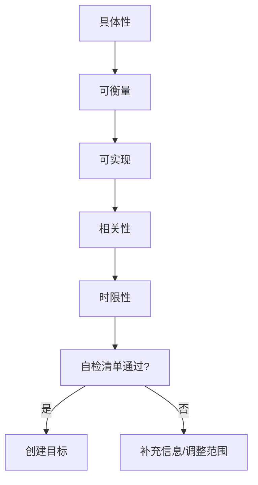
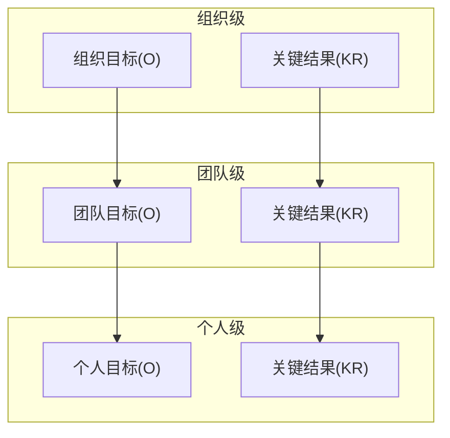
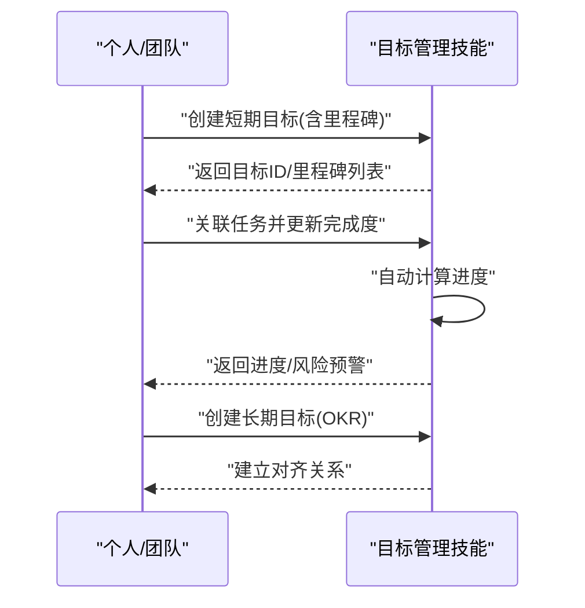
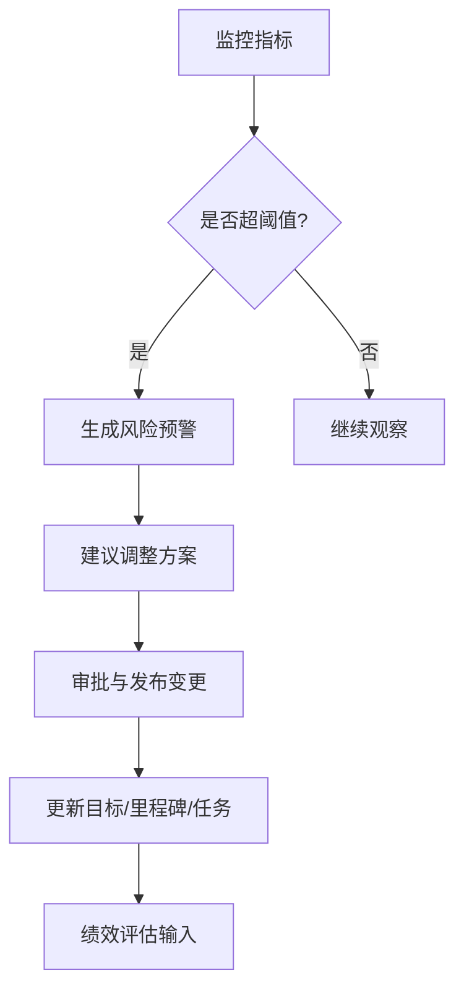
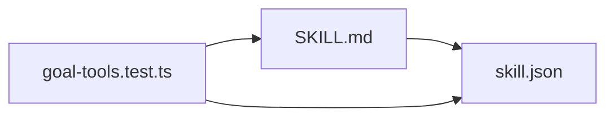

# 目标管理技能

<cite>
**本文引用的文件**   
- [SKILL.md](file://engine/skills/goal/SKILL.md)
- [skill.json](file://engine/skills/goal/skill.json)
- [goal-tools.test.ts](file://engine/tests/goal-tools.test.ts)
</cite>

## 目录
1. [简介](#简介)
2. [项目结构](#项目结构)
3. [核心组件](#核心组件)
4. [架构总览](#架构总览)
5. [详细组件分析](#详细组件分析)
6. [依赖分析](#依赖分析)
7. [性能考虑](#性能考虑)
8. [故障排查指南](#故障排查指南)
9. [结论](#结论)
10. [附录](#附录)

## 简介
本文件为目标管理技能的使用文档，聚焦以下能力：
- 目标设定与里程碑规划
- 成果追踪与自动进度计算
- SMART 目标制定方法与 OKR 框架集成
- 短期/长期目标、子目标分解与完成度跟踪
- 目标与任务的关联机制
- 与项目管理工具集成及团队目标对齐
- 目标调整、风险预警与绩效评估
- 最佳实践与持续改进方法论

该技能通过“技能定义 + 测试用例”的方式提供能力契约与行为验证，确保在工程化环境中可被可靠调用与集成。

## 项目结构
目标管理技能位于 engine/skills/goal 目录下，包含技能说明与元数据；相关行为由 tests/goal-tools.test.ts 进行验证。



图表来源
- [SKILL.md:1-200](file://engine/skills/goal/SKILL.md#L1-L200)
- [skill.json:1-200](file://engine/skills/goal/skill.json#L1-L200)
- [goal-tools.test.ts:1-200](file://engine/tests/goal-tools.test.ts#L1-L200)

章节来源
- [SKILL.md:1-200](file://engine/skills/goal/SKILL.md#L1-L200)
- [skill.json:1-200](file://engine/skills/goal/skill.json#L1-L200)
- [goal-tools.test.ts:1-200](file://engine/tests/goal-tools.test.ts#L1-L200)

## 核心组件
- 技能描述（SKILL.md）：定义目标管理的职责边界、输入输出约定、使用流程与示例场景，指导如何设定目标、拆解里程碑、关联任务并追踪结果。
- 技能清单（skill.json）：声明技能的标识、版本、能力项、参数约束与依赖关系，供运行时加载与校验。
- 行为验证（goal-tools.test.ts）：覆盖关键路径的断言，包括目标创建、里程碑更新、任务关联、进度计算、状态流转等。

章节来源
- [SKILL.md:1-200](file://engine/skills/goal/SKILL.md#L1-L200)
- [skill.json:1-200](file://engine/skills/goal/skill.json#L1-L200)
- [goal-tools.test.ts:1-200](file://engine/tests/goal-tools.test.ts#L1-L200)

## 架构总览
目标管理技能以“技能契约 + 测试驱动”的方式运行：
- 上层应用或编排器根据 SKILL.md 的约定调用目标管理接口
- skill.json 提供能力清单与参数约束，用于加载期校验
- 测试用例保障关键逻辑（如进度计算、状态机）的正确性



图表来源
- [SKILL.md:1-200](file://engine/skills/goal/SKILL.md#L1-L200)
- [skill.json:1-200](file://engine/skills/goal/skill.json#L1-L200)
- [goal-tools.test.ts:1-200](file://engine/tests/goal-tools.test.ts#L1-L200)

## 详细组件分析

### 目标生命周期与状态机
- 典型状态：待启动、进行中、已完成、已取消、阻塞中
- 触发事件：创建、开始、暂停、恢复、完成、取消、阻塞/解除阻塞
- 规则要点：
  - 只有“进行中”的目标允许推进任务完成度
  - “阻塞中”时禁止变更关键里程碑时间
  - 完成需满足所有关键里程碑达成条件



图表来源
- [SKILL.md:1-200](file://engine/skills/goal/SKILL.md#L1-L200)
- [goal-tools.test.ts:1-200](file://engine/tests/goal-tools.test.ts#L1-L200)

章节来源
- [SKILL.md:1-200](file://engine/skills/goal/SKILL.md#L1-L200)
- [goal-tools.test.ts:1-200](file://engine/tests/goal-tools.test.ts#L1-L200)

### 里程碑与子目标分解
- 里程碑类型：关键交付物、评审点、验收标准
- 子目标：将大目标拆分为可独立交付的子目标，便于并行推进与责任到人
- 建议：每个里程碑至少绑定一个可度量指标（如覆盖率、缺陷密度、上线成功率）



图表来源
- [SKILL.md:1-200](file://engine/skills/goal/SKILL.md#L1-L200)

章节来源
- [SKILL.md:1-200](file://engine/skills/goal/SKILL.md#L1-L200)

### 目标与任务的关联机制与自动进度计算
- 关联方式：任务作为里程碑的原子单元，支持多任务聚合到同一里程碑
- 自动进度：基于任务完成比例与权重加权计算里程碑与目标整体进度
- 权重策略：可按业务重要性配置权重，避免“数量多但价值低”的任务拉高进度



图表来源
- [SKILL.md:1-200](file://engine/skills/goal/SKILL.md#L1-L200)
- [goal-tools.test.ts:1-200](file://engine/tests/goal-tools.test.ts#L1-L200)

章节来源
- [SKILL.md:1-200](file://engine/skills/goal/SKILL.md#L1-L200)
- [goal-tools.test.ts:1-200](file://engine/tests/goal-tools.test.ts#L1-L200)

### SMART 目标制定方法
- 具体性（Specific）：明确要达成的结果与边界
- 可衡量（Measurable）：定义量化指标与阈值
- 可实现（Achievable）：结合资源与约束评估可行性
- 相关性（Relevant）：与业务战略/上级目标对齐
- 时限性（Time-bound）：规定起止时间与关键节点



图表来源
- [SKILL.md:1-200](file://engine/skills/goal/SKILL.md#L1-L200)

章节来源
- [SKILL.md:1-200](file://engine/skills/goal/SKILL.md#L1-L200)

### OKR 框架集成
- O（目标）：方向性、鼓舞人心的定性描述
- KR（关键结果）：支撑 O 的可量化指标集合
- 对齐方式：自上而下分解（公司→部门→个人），自下而上支撑（个人→团队→组织）
- 周期管理：季度/月度滚动复盘，动态调整 KR 权重与基线



图表来源
- [SKILL.md:1-200](file://engine/skills/goal/SKILL.md#L1-L200)

章节来源
- [SKILL.md:1-200](file://engine/skills/goal/SKILL.md#L1-L200)

### 使用示例：短期与长期目标、子目标与进度跟踪
- 短期目标（周/月）：聚焦快速交付与反馈，适合用任务粒度细化的里程碑
- 长期目标（季度/半年）：强调方向与关键结果，适合用 OKR 对齐与阶段性复盘
- 子目标：将复杂问题切分为可独立验证的小目标，降低不确定性
- 进度跟踪：以任务完成度为输入，自动汇总至里程碑与目标层级



图表来源
- [SKILL.md:1-200](file://engine/skills/goal/SKILL.md#L1-L200)
- [goal-tools.test.ts:1-200](file://engine/tests/goal-tools.test.ts#L1-L200)

章节来源
- [SKILL.md:1-200](file://engine/skills/goal/SKILL.md#L1-L200)
- [goal-tools.test.ts:1-200](file://engine/tests/goal-tools.test.ts#L1-L200)

### 与项目管理工具集成与团队目标对齐
- 集成点：任务系统、看板、CI/CD、代码仓库、文档库
- 同步策略：双向同步（本地目标↔外部工具），冲突以权威源为准
- 对齐机制：通过 OKR 树形结构实现跨团队可见性与一致性

```mermaid
graph TB
subgraph "内部"
Goal["目标管理技能"]
Mile["里程碑/子目标"]
Task["任务"]
end
subgraph "外部工具"
PM["项目管理工具"]
CI["CI/CD"]
Repo["代码仓库"]
Wiki["文档库"]
end
Goal --> Mile
Mile --> Task
Task < --> PM
Mile < --> CI
Mile < --> Repo
Mile < --> Wiki
```

图表来源
- [SKILL.md:1-200](file://engine/skills/goal/SKILL.md#L1-L200)

章节来源
- [SKILL.md:1-200](file://engine/skills/goal/SKILL.md#L1-L200)

### 目标调整、风险预警与绩效评估
- 目标调整：范围、权重、截止时间的变更需记录审计日志并通知相关方
- 风险预警：基于进度偏差、阻塞时长、依赖延迟等信号触发
- 绩效评估：结合目标达成率、质量指标、协作贡献进行综合评分



图表来源
- [SKILL.md:1-200](file://engine/skills/goal/SKILL.md#L1-L200)

章节来源
- [SKILL.md:1-200](file://engine/skills/goal/SKILL.md#L1-L200)

### 最佳实践与持续改进方法论
- 目标分层：组织→团队→个人，保持上下对齐与横向协同
- 指标先行：先定义成功标准，再设计任务与里程碑
- 小步快跑：短周期迭代，频繁复盘与校准
- 可视化透明：看板公开、进度实时、风险前置
- 持续改进：PDCA 循环（计划-执行-检查-行动），沉淀模板与经验

[本节为通用方法论，不直接分析具体文件]

## 依赖分析
- 技能描述与清单：SKILL.md 与 skill.json 共同构成能力契约
- 行为验证：tests/goal-tools.test.ts 对关键路径进行断言，保障契约落地



图表来源
- [SKILL.md:1-200](file://engine/skills/goal/SKILL.md#L1-L200)
- [skill.json:1-200](file://engine/skills/goal/skill.json#L1-L200)
- [goal-tools.test.ts:1-200](file://engine/tests/goal-tools.test.ts#L1-L200)

章节来源
- [SKILL.md:1-200](file://engine/skills/goal/SKILL.md#L1-L200)
- [skill.json:1-200](file://engine/skills/goal/skill.json#L1-L200)
- [goal-tools.test.ts:1-200](file://engine/tests/goal-tools.test.ts#L1-L200)

## 性能考虑
- 批量更新：合并多次任务完成度更新，减少重复计算
- 增量计算：仅重算受影响里程碑与目标
- 缓存策略：对稳定指标（如历史达成率）做缓存
- 异步处理：对耗时操作（如外部工具同步）采用异步队列

[本节为通用指导，不直接分析具体文件]

## 故障排查指南
- 常见问题
  - 进度未更新：检查任务与里程碑的关联是否正确
  - 权重异常：确认权重总和与业务重要性匹配
  - 状态不一致：核对状态机转换是否合法
  - 外部同步失败：查看错误码与重试策略
- 定位步骤
  - 查看最近一次变更与审计日志
  - 复现最小用例并比对测试断言
  - 隔离外部依赖，逐步缩小范围

章节来源
- [goal-tools.test.ts:1-200](file://engine/tests/goal-tools.test.ts#L1-L200)

## 结论
目标管理技能通过清晰的契约与严格的测试保障，实现了从目标设定、里程碑规划到成果追踪的闭环。结合 SMART 与 OKR 方法，可在个人与团队层面提升目标清晰度与执行效率。建议在实践中持续沉淀模板与经验，推动组织级目标对齐与持续改进。

[本节为总结性内容，不直接分析具体文件]

## 附录
- 术语表
  - 目标：期望达成的结果与成功标准
  - 里程碑：阶段性的关键交付或评审点
  - 子目标：可独立交付的最小目标单元
  - 关键结果：支撑目标的量化指标
- 参考路径
  - 技能说明：[SKILL.md](file://engine/skills/goal/SKILL.md)
  - 技能清单：[skill.json](file://engine/skills/goal/skill.json)
  - 行为验证：[goal-tools.test.ts](file://engine/tests/goal-tools.test.ts)