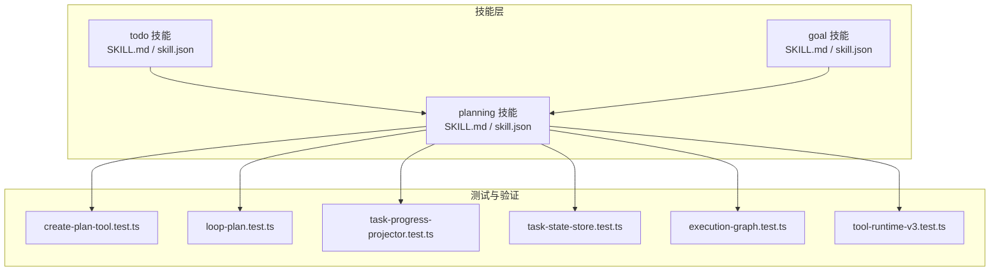
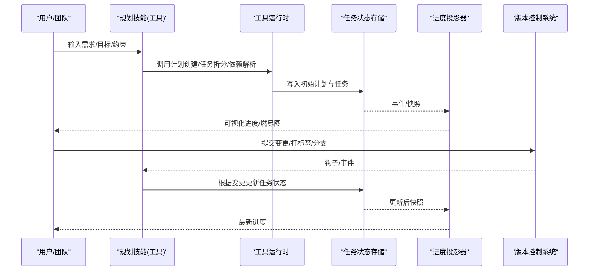
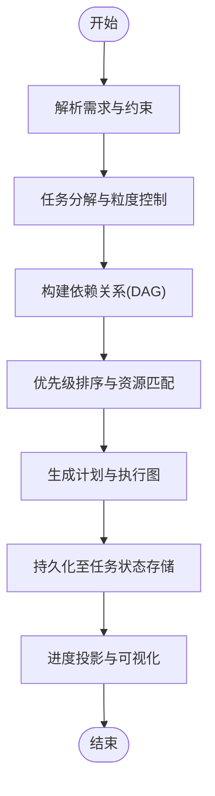
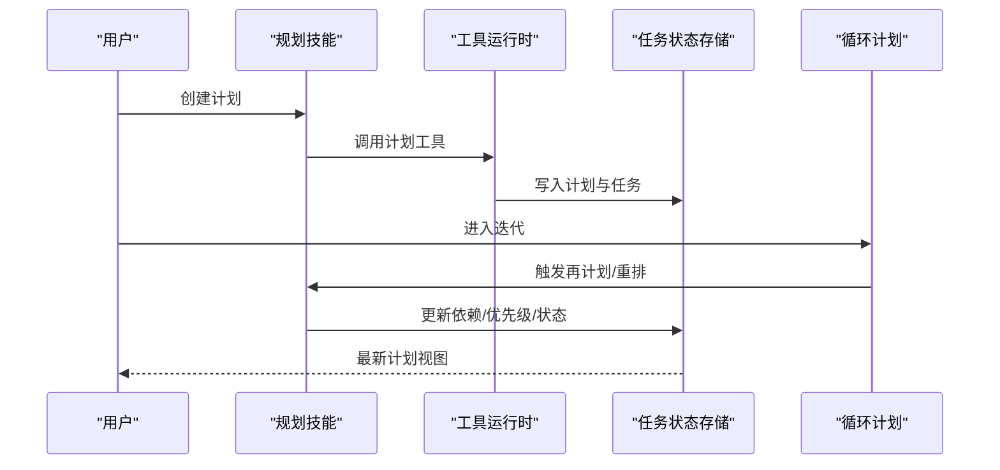
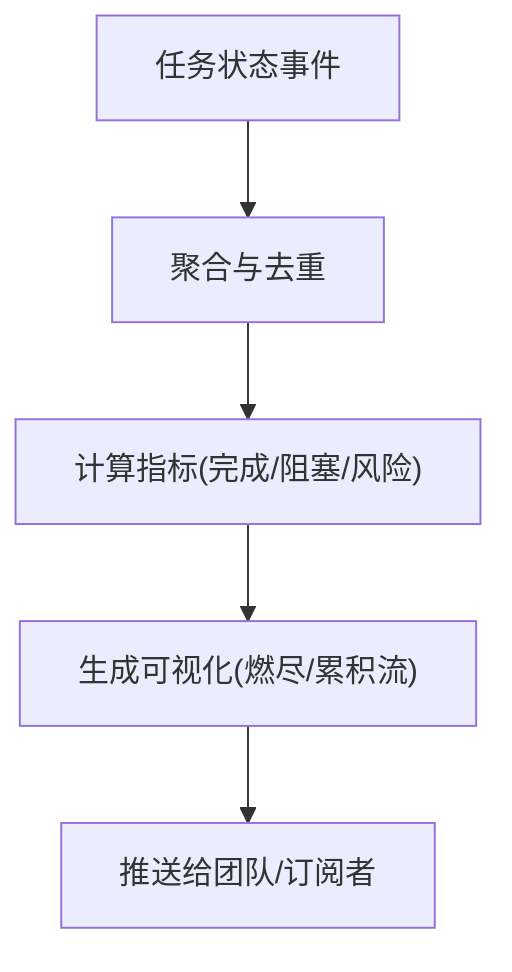
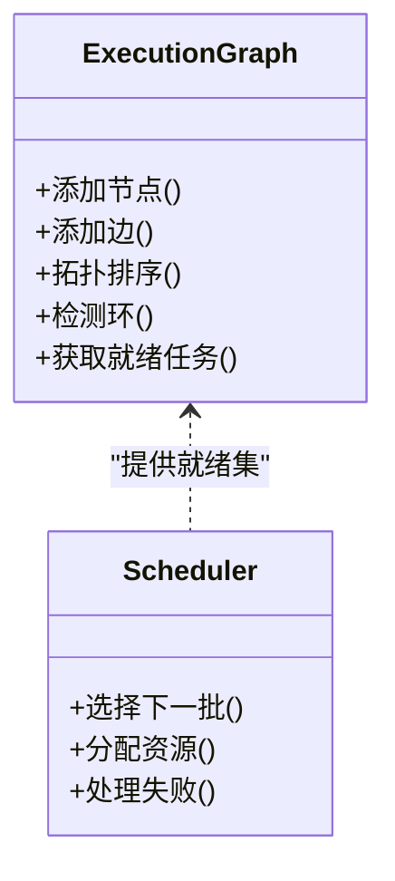
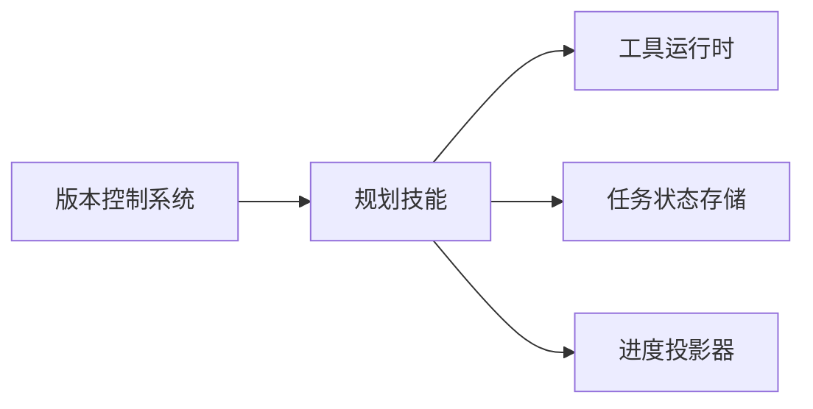

# 规划技能

<cite>
**本文引用的文件**   
- [engine/skills/planning/SKILL.md](file://engine/skills/planning/SKILL.md)
- [engine/skills/planning/skill.json](file://engine/skills/planning/skill.json)
- [engine/skills/todo/SKILL.md](file://engine/skills/todo/SKILL.md)
- [engine/skills/todo/skill.json](file://engine/skills/todo/skill.json)
- [engine/skills/goal/SKILL.md](file://engine/skills/goal/SKILL.md)
- [engine/skills/goal/skill.json](file://engine/skills/goal/skill.json)
- [engine/tests/create-plan-tool.test.ts](file://engine/tests/create-plan-tool.test.ts)
- [engine/tests/loop-plan.test.ts](file://engine/tests/loop-plan.test.ts)
- [engine/tests/task-progress-projector.test.ts](file://engine/tests/task-progress-projector.test.ts)
- [engine/tests/task-state-store.test.ts](file://engine/tests/task-state-store.test.ts)
- [engine/tests/execution-graph.test.ts](file://engine/tests/execution-graph.test.ts)
- [engine/tests/tool-runtime-v3.test.ts](file://engine/tests/tool-runtime-v3.test.ts)
</cite>

## 目录
1. [简介](#简介)
2. [项目结构](#项目结构)
3. [核心组件](#核心组件)
4. [架构总览](#架构总览)
5. [详细组件分析](#详细组件分析)
6. [依赖关系分析](#依赖关系分析)
7. [性能与可扩展性](#性能与可扩展性)
8. [故障排查指南](#故障排查指南)
9. [结论](#结论)
10. [附录](#附录)

## 简介
本文件为“规划技能”的完整使用文档，聚焦以下能力：
- 任务分解：将复杂需求拆解为可执行的技术任务
- 依赖管理：显式表达任务间的前置、并行与条件依赖
- 进度跟踪：从计划到执行的端到端状态追踪与可视化
- 智能推荐：基于上下文与历史数据的优先级排序与资源分配建议
- 版本控制集成：与 Git 工作流联动，自动更新任务状态
- 敏捷协作：支持迭代、看板、站会等实践
- 大型项目策略：分层规划、风险识别与缓解

## 项目结构
规划相关能力由“技能定义 + 工具实现 + 测试用例”三部分构成：
- 技能定义：位于 engine/skills/planning，包含 SKILL.md（使用说明）与 skill.json（元数据与工具清单）
- 配套技能：todo、goal 等用于目标对齐与待办落地
- 测试与验证：engine/tests 下覆盖计划创建、循环计划、进度投影、任务状态存储、执行图与工具运行时等关键路径

图表来源
- [engine/skills/planning/SKILL.md](file://engine/skills/planning/SKILL.md)
- [engine/skills/planning/skill.json](file://engine/skills/planning/skill.json)
- [engine/skills/todo/SKILL.md](file://engine/skills/todo/SKILL.md)
- [engine/skills/todo/skill.json](file://engine/skills/todo/skill.json)
- [engine/skills/goal/SKILL.md](file://engine/skills/goal/SKILL.md)
- [engine/skills/goal/skill.json](file://engine/skills/goal/skill.json)
- [engine/tests/create-plan-tool.test.ts](file://engine/tests/create-plan-tool.test.ts)
- [engine/tests/loop-plan.test.ts](file://engine/tests/loop-plan.test.ts)
- [engine/tests/task-progress-projector.test.ts](file://engine/tests/task-progress-projector.test.ts)
- [engine/tests/task-state-store.test.ts](file://engine/tests/task-state-store.test.ts)
- [engine/tests/execution-graph.test.ts](file://engine/tests/execution-graph.test.ts)
- [engine/tests/tool-runtime-v3.test.ts](file://engine/tests/tool-runtime-v3.test.ts)

章节来源
- [engine/skills/planning/SKILL.md](file://engine/skills/planning/SKILL.md)
- [engine/skills/planning/skill.json](file://engine/skills/planning/skill.json)
- [engine/skills/todo/SKILL.md](file://engine/skills/todo/SKILL.md)
- [engine/skills/todo/skill.json](file://engine/skills/todo/skill.json)
- [engine/skills/goal/SKILL.md](file://engine/skills/goal/SKILL.md)
- [engine/skills/goal/skill.json](file://engine/skills/goal/skill.json)
- [engine/tests/create-plan-tool.test.ts](file://engine/tests/create-plan-tool.test.ts)
- [engine/tests/loop-plan.test.ts](file://engine/tests/loop-plan.test.ts)
- [engine/tests/task-progress-projector.test.ts](file://engine/tests/task-progress-projector.test.ts)
- [engine/tests/task-state-store.test.ts](file://engine/tests/task-state-store.test.ts)
- [engine/tests/execution-graph.test.ts](file://engine/tests/execution-graph.test.ts)
- [engine/tests/tool-runtime-v3.test.ts](file://engine/tests/tool-runtime-v3.test.ts)

## 核心组件
- 规划技能（planning）
  - 职责：提供创建计划、拆分任务、设置依赖、排期与优先级、生成执行图、同步进度的工具与方法
  - 入口：通过 skill.json 暴露的工具集合与 SKILL.md 中的交互流程
- 待办技能（todo）
  - 职责：承接规划输出，维护细粒度待办项，支撑日常推进与复盘
- 目标技能（goal）
  - 职责：对齐业务目标与里程碑，确保计划与目标一致

章节来源
- [engine/skills/planning/SKILL.md](file://engine/skills/planning/SKILL.md)
- [engine/skills/planning/skill.json](file://engine/skills/planning/skill.json)
- [engine/skills/todo/SKILL.md](file://engine/skills/todo/SKILL.md)
- [engine/skills/todo/skill.json](file://engine/skills/todo/skill.json)
- [engine/skills/goal/SKILL.md](file://engine/skills/goal/SKILL.md)
- [engine/skills/goal/skill.json](file://engine/skills/goal/skill.json)

## 架构总览
规划技能在“用户意图 → 计划生成 → 任务编排 → 执行与观测”的闭环中发挥作用。下图展示典型调用链路与关键组件交互。

图表来源
- [engine/tests/create-plan-tool.test.ts](file://engine/tests/create-plan-tool.test.ts)
- [engine/tests/loop-plan.test.ts](file://engine/tests/loop-plan.test.ts)
- [engine/tests/task-progress-projector.test.ts](file://engine/tests/task-progress-projector.test.ts)
- [engine/tests/task-state-store.test.ts](file://engine/tests/task-state-store.test.ts)
- [engine/tests/tool-runtime-v3.test.ts](file://engine/tests/tool-runtime-v3.test.ts)

## 详细组件分析

### 规划技能（planning）
- 功能要点
  - 任务分解：按领域/模块/阶段切分，产出原子化可执行任务
  - 依赖建模：前置依赖、并行组、条件依赖
  - 优先级与排期：结合影响面、阻塞度、资源可用性与交付窗口
  - 执行图：有向无环图（DAG）表示任务拓扑，驱动调度
  - 进度跟踪：状态机驱动，持久化与投影
- 关键交互
  - 与工具运行时对接，完成参数校验、幂等执行与错误恢复
  - 与任务状态存储交互，保证计划与执行一致性
  - 与进度投影器协作，生成燃尽图、阻塞报告与风险预警

图表来源
- [engine/tests/create-plan-tool.test.ts](file://engine/tests/create-plan-tool.test.ts)
- [engine/tests/execution-graph.test.ts](file://engine/tests/execution-graph.test.ts)
- [engine/tests/task-state-store.test.ts](file://engine/tests/task-state-store.test.ts)
- [engine/tests/task-progress-projector.test.ts](file://engine/tests/task-progress-projector.test.ts)

章节来源
- [engine/skills/planning/SKILL.md](file://engine/skills/planning/SKILL.md)
- [engine/skills/planning/skill.json](file://engine/skills/planning/skill.json)
- [engine/tests/create-plan-tool.test.ts](file://engine/tests/create-plan-tool.test.ts)
- [engine/tests/execution-graph.test.ts](file://engine/tests/execution-graph.test.ts)
- [engine/tests/task-state-store.test.ts](file://engine/tests/task-state-store.test.ts)
- [engine/tests/task-progress-projector.test.ts](file://engine/tests/task-progress-projector.test.ts)

### 待办技能（todo）
- 功能要点
  - 承接规划输出的任务，细化到可操作的最小单元
  - 支持每日站会、看板流转、WIP 限制
  - 与规划技能双向同步，保持“计划-待办”一致性
- 最佳实践
  - 每个待办具备明确验收标准与预估工时
  - 通过标签/分类关联模块与风险等级

章节来源
- [engine/skills/todo/SKILL.md](file://engine/skills/todo/SKILL.md)
- [engine/skills/todo/skill.json](file://engine/skills/todo/skill.json)

### 目标技能（goal）
- 功能要点
  - 将业务目标映射为阶段性里程碑
  - 与规划技能对齐，确保任务服务于目标达成
- 最佳实践
  - 目标需可度量、可追踪、可复盘
  - 定期回顾目标与计划的偏差并纠偏

章节来源
- [engine/skills/goal/SKILL.md](file://engine/skills/goal/SKILL.md)
- [engine/skills/goal/skill.json](file://engine/skills/goal/skill.json)

### 计划创建与循环计划
- 计划创建
  - 输入：需求描述、范围边界、约束条件
  - 输出：任务列表、依赖图、优先级、里程碑
- 循环计划
  - 在迭代周期内持续滚动优化计划，处理新增需求与变更
  - 通过“计划-执行-反馈-再计划”的闭环提升可预测性

图表来源
- [engine/tests/create-plan-tool.test.ts](file://engine/tests/create-plan-tool.test.ts)
- [engine/tests/loop-plan.test.ts](file://engine/tests/loop-plan.test.ts)
- [engine/tests/tool-runtime-v3.test.ts](file://engine/tests/tool-runtime-v3.test.ts)

章节来源
- [engine/tests/create-plan-tool.test.ts](file://engine/tests/create-plan-tool.test.ts)
- [engine/tests/loop-plan.test.ts](file://engine/tests/loop-plan.test.ts)
- [engine/tests/tool-runtime-v3.test.ts](file://engine/tests/tool-runtime-v3.test.ts)

### 进度跟踪与可视化
- 进度投影
  - 从任务状态事件流中计算累计完成量、阻塞时长、风险指数
  - 输出燃尽图、累积流图、阻塞报告
- 状态存储
  - 以不可变事件或快照形式持久化，支持回放与审计
- 可视化
  - 面向团队的仪表盘与看板视图，支持按人/模块/风险筛选

图表来源
- [engine/tests/task-progress-projector.test.ts](file://engine/tests/task-progress-projector.test.ts)
- [engine/tests/task-state-store.test.ts](file://engine/tests/task-state-store.test.ts)

章节来源
- [engine/tests/task-progress-projector.test.ts](file://engine/tests/task-progress-projector.test.ts)
- [engine/tests/task-state-store.test.ts](file://engine/tests/task-state-store.test.ts)

### 执行图与调度
- 执行图
  - 以 DAG 表示任务拓扑，检测环与冲突
  - 支持并行执行与资源池隔离
- 调度策略
  - 基于依赖就绪度、优先级、资源可用性选择下一批任务
  - 失败重试与熔断保护

图表来源
- [engine/tests/execution-graph.test.ts](file://engine/tests/execution-graph.test.ts)

章节来源
- [engine/tests/execution-graph.test.ts](file://engine/tests/execution-graph.test.ts)

### 与版本控制集成
- 自动化联动
  - 监听提交、分支合并、标签发布等事件
  - 自动更新任务状态（如“已合入”、“已发布”）
- 最佳实践
  - 在提交信息中引用任务 ID，便于追溯
  - 通过分支策略与标签规范保障计划与代码的一致性

章节来源
- [engine/skills/planning/SKILL.md](file://engine/skills/planning/SKILL.md)
- [engine/skills/planning/skill.json](file://engine/skills/planning/skill.json)

### 智能推荐机制
- 推荐维度
  - 任务影响面、阻塞度、技术债务、历史速率、资源负载
- 推荐输出
  - 优先级建议、资源分配建议、风险预警与替代方案
- 反馈闭环
  - 基于实际完成时间与偏差修正推荐模型

章节来源
- [engine/skills/planning/SKILL.md](file://engine/skills/planning/SKILL.md)
- [engine/skills/planning/skill.json](file://engine/skills/planning/skill.json)

## 依赖关系分析
- 组件耦合
  - 规划技能依赖工具运行时进行参数校验与执行
  - 与任务状态存储强耦合，保证计划与执行一致性
  - 与进度投影器松耦合，通过事件/快照解耦
- 外部集成
  - 版本控制系统通过事件/钩子接入，避免直接侵入核心逻辑

图表来源
- [engine/tests/tool-runtime-v3.test.ts](file://engine/tests/tool-runtime-v3.test.ts)
- [engine/tests/task-state-store.test.ts](file://engine/tests/task-state-store.test.ts)
- [engine/tests/task-progress-projector.test.ts](file://engine/tests/task-progress-projector.test.ts)

章节来源
- [engine/tests/tool-runtime-v3.test.ts](file://engine/tests/tool-runtime-v3.test.ts)
- [engine/tests/task-state-store.test.ts](file://engine/tests/task-state-store.test.ts)
- [engine/tests/task-progress-projector.test.ts](file://engine/tests/task-progress-projector.test.ts)

## 性能与可扩展性
- 批量操作
  - 对大规模任务采用批量写入与增量更新，降低 I/O 压力
- 并发控制
  - 基于资源池与令牌桶限制并发，避免过载
- 缓存与索引
  - 对常用查询（如就绪任务、阻塞任务）建立索引与缓存
- 可观测性
  - 记录关键指标（吞吐、延迟、失败率），配合告警与降级策略

[本节为通用指导，不直接分析具体文件]

## 故障排查指南
- 常见问题
  - 计划无法生成：检查输入约束是否自洽、依赖是否存在环
  - 任务不推进：确认前置依赖是否满足、资源是否被占用
  - 进度不一致：核对状态存储事件顺序与幂等性
- 定位方法
  - 查看任务状态存储的事件回放
  - 检查执行图的拓扑与就绪集
  - 审查工具运行时的错误日志与重试策略

章节来源
- [engine/tests/task-state-store.test.ts](file://engine/tests/task-state-store.test.ts)
- [engine/tests/execution-graph.test.ts](file://engine/tests/execution-graph.test.ts)
- [engine/tests/tool-runtime-v3.test.ts](file://engine/tests/tool-runtime-v3.test.ts)

## 结论
规划技能通过“目标对齐—任务分解—依赖建模—智能推荐—执行调度—进度跟踪—版本联动”的闭环，帮助团队高效应对复杂需求与不确定性。建议在大型项目中采用分层规划与风险管理策略，并结合敏捷实践持续提升可预测性与交付质量。

[本节为总结性内容，不直接分析具体文件]

## 附录
- 使用示例（步骤指引）
  - 创建项目计划：输入需求与约束，生成任务与依赖图，设定里程碑
  - 管理依赖关系：显式声明前置依赖，利用并行组提升吞吐
  - 跟踪开发进度：通过进度投影器观察燃尽图与阻塞情况
  - 与 Git 集成：在提交信息引用任务 ID，自动更新任务状态
- 团队协作最佳实践
  - 每日站会聚焦阻塞与风险
  - 看板可视化 WIP 与瓶颈
  - 迭代回顾沉淀改进措施
- 大型项目规划策略
  - 分层规划：战略→战术→执行
  - 风险登记与缓解预案
  - 容量规划与缓冲设计

[本节为概念性内容，不直接分析具体文件]