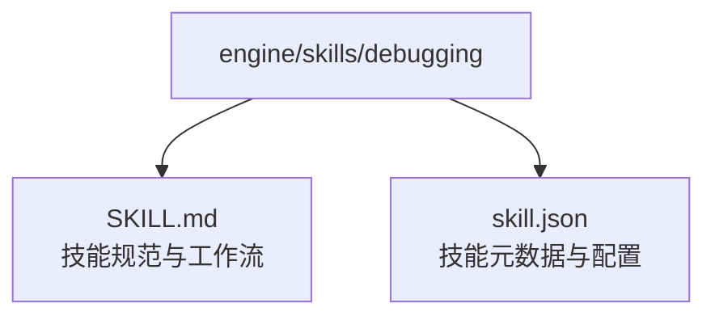
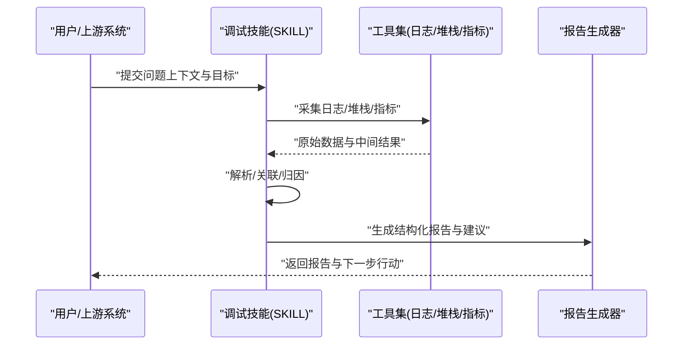
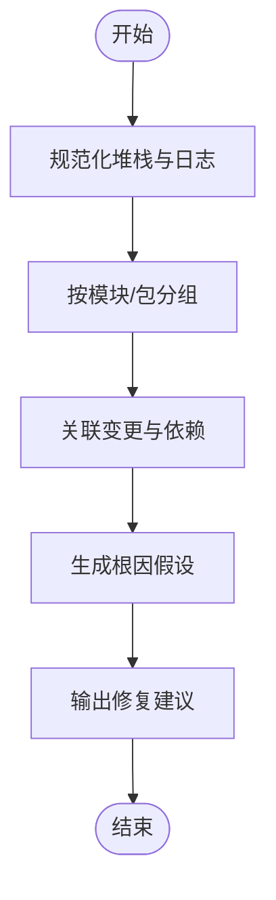
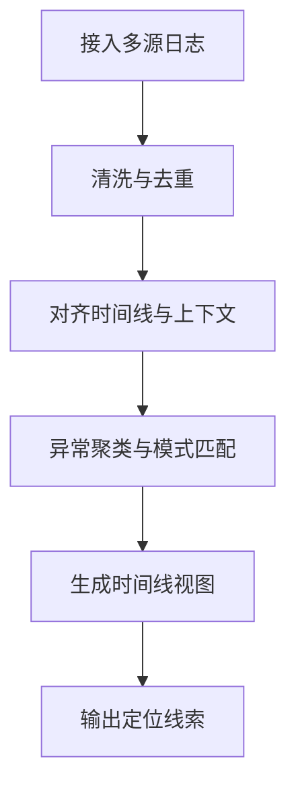
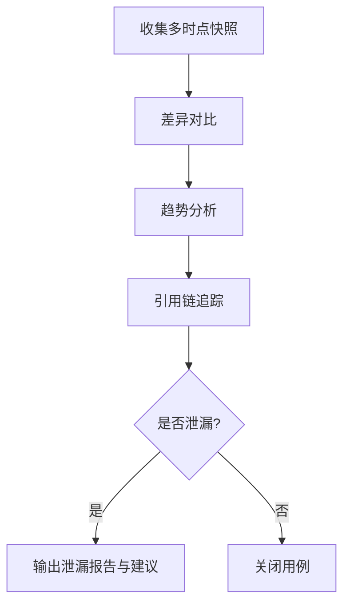
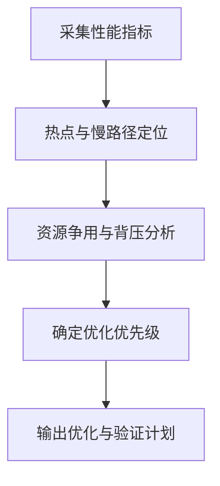
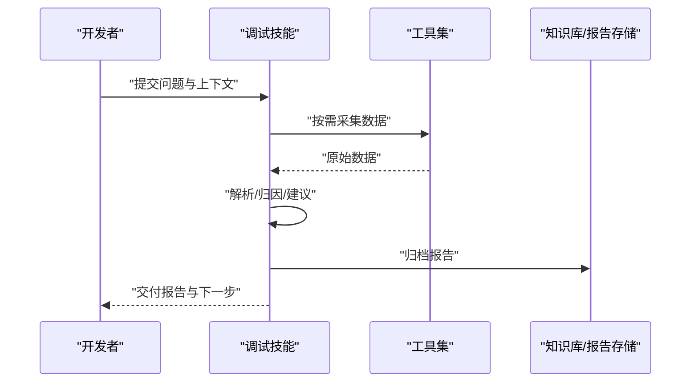
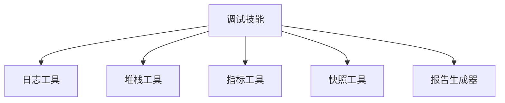

# 调试技能

<cite>
**本文引用的文件**   
- [SKILL.md](file://engine/skills/debugging/SKILL.md)
- [skill.json](file://engine/skills/debugging/skill.json)
</cite>

## 目录
1. [简介](#简介)
2. [项目结构](#项目结构)
3. [核心组件](#核心组件)
4. [架构总览](#架构总览)
5. [详细组件分析](#详细组件分析)
6. [依赖分析](#依赖分析)
7. [性能考虑](#性能考虑)
8. [故障排除指南](#故障排除指南)
9. [结论](#结论)
10. [附录](#附录)

## 简介
本文件为“调试技能”的权威使用文档，聚焦于在 JavaScript/TypeScript 与 Node.js 环境中进行问题定位与修复。内容覆盖错误堆栈分析、日志智能解析、内存泄漏检测、性能瓶颈识别，以及从问题报告到修复建议的完整工作流程。同时提供常见场景示例、调试报告格式说明、CI/CD 集成方式与复杂场景排障技巧，帮助团队将调试能力标准化、自动化与可操作化。

## 项目结构
调试技能位于 engine/skills/debugging 目录下，由以下两部分组成：
- SKILL.md：定义技能的职责范围、输入输出约定、工作流与最佳实践。
- skill.json：描述技能的元数据（名称、版本、入口、工具绑定等），供运行时加载与编排。

图表来源
- [SKILL.md:1-200](file://engine/skills/debugging/SKILL.md#L1-L200)
- [skill.json:1-200](file://engine/skills/debugging/skill.json#L1-L200)

章节来源
- [SKILL.md:1-200](file://engine/skills/debugging/SKILL.md#L1-L200)
- [skill.json:1-200](file://engine/skills/debugging/skill.json#L1-L200)

## 核心组件
- 技能定义与契约
  - 通过 SKILL.md 明确输入（错误上下文、日志片段、堆栈、指标）、处理流程（采集、解析、诊断、建议）与输出（结构化报告、修复建议、验证步骤）。
  - 通过 skill.json 声明技能标识、版本、可用工具与执行约束，确保在引擎中可被正确发现与调用。
- 关键能力
  - 错误堆栈分析：定位异常类型、调用链、最近变更点与根因假设。
  - 日志智能解析：按时间线聚合、去噪、关联请求/会话、提取关键字段。
  - 内存泄漏检测：基于快照对比、对象增长趋势、引用链追踪与可疑分配点。
  - 性能瓶颈识别：热点函数、I/O 等待、事件循环阻塞、GC 压力与资源争用。
- 输出产物
  - 调试报告：包含问题摘要、证据清单、根因推断、修复建议、回归测试与监控指标。
  - 可操作建议：最小改动方案、回滚策略、灰度发布与观测计划。

章节来源
- [SKILL.md:1-200](file://engine/skills/debugging/SKILL.md#L1-L200)
- [skill.json:1-200](file://engine/skills/debugging/skill.json#L1-L200)

## 架构总览
调试技能作为“能力单元”嵌入引擎，接收来自上层（如 Agent、CLI、Web UI）的诊断任务，协调内部工具完成数据采集、分析与报告生成。

图表来源
- [SKILL.md:1-200](file://engine/skills/debugging/SKILL.md#L1-L200)
- [skill.json:1-200](file://engine/skills/debugging/skill.json#L1-L200)

## 详细组件分析

### 错误堆栈分析
- 输入
  - 异常消息、堆栈文本、触发路径、运行环境信息。
- 处理逻辑
  - 规范化堆栈格式，过滤噪声帧；按模块/包分组；结合变更历史与依赖关系定位可疑点。
  - 对异步链路进行跨帧关联，还原调用时序。
- 输出
  - 根因假设、相关代码位置、复现条件与最小修复建议。

图表来源
- [SKILL.md:1-200](file://engine/skills/debugging/SKILL.md#L1-L200)

章节来源
- [SKILL.md:1-200](file://engine/skills/debugging/SKILL.md#L1-L200)

### 日志智能解析
- 输入
  - 多源日志（应用、网关、数据库、第三方服务），时间戳、级别、请求ID、上下文键值。
- 处理逻辑
  - 去重与降噪；按请求/会话聚合；抽取关键字段并构建时间线；匹配错误模式与告警规则。
- 输出
  - 可读的时间线视图、异常聚类、关联事件与定位线索。

图表来源
- [SKILL.md:1-200](file://engine/skills/debugging/SKILL.md#L1-L200)

章节来源
- [SKILL.md:1-200](file://engine/skills/debugging/SKILL.md#L1-L200)

### 内存泄漏检测
- 输入
  - 进程快照、对象计数、分配热点、GC 统计、外部资源句柄数。
- 处理逻辑
  - 对比不同时间点快照，识别持续增长的对象集合；回溯引用链，定位持有者；结合业务语义判断是否为预期增长。
- 输出
  - 可疑泄漏点、增长曲线、影响面评估与修复建议（释放时机、缓存上限、订阅清理等）。

图表来源
- [SKILL.md:1-200](file://engine/skills/debugging/SKILL.md#L1-L200)

章节来源
- [SKILL.md:1-200](file://engine/skills/debugging/SKILL.md#L1-L200)

### 性能瓶颈识别
- 输入
  - CPU/内存/IO 指标、事件循环延迟、慢查询、网络耗时、并发与队列长度。
- 处理逻辑
  - 识别热点路径与资源争用；区分计算密集与 I/O 等待；评估 GC 停顿与背压现象。
- 输出
  - 瓶颈清单、优化优先级、实验性调优建议与回归验证指标。

图表来源
- [SKILL.md:1-200](file://engine/skills/debugging/SKILL.md#L1-L200)

章节来源
- [SKILL.md:1-200](file://engine/skills/debugging/SKILL.md#L1-L200)

### 调试工作流程（端到端）
- 阶段
  - 问题上报：收集必要上下文（环境、版本、复现步骤、日志/堆栈片段、指标）。
  - 自动采集：技能根据上下文自动拉取更多数据（日志、快照、指标）。
  - 诊断分析：解析、关联、归因，形成根因假设与修复建议。
  - 验证与回归：给出最小复现实验与回归测试建议。
  - 闭环归档：沉淀报告与知识条目，便于后续检索与复盘。
- 角色
  - 使用者：提供问题与期望目标。
  - 调试技能：编排工具、执行分析、产出报告。
  - 工具集：日志、堆栈、指标、快照等采集与分析能力。

图表来源
- [SKILL.md:1-200](file://engine/skills/debugging/SKILL.md#L1-L200)

章节来源
- [SKILL.md:1-200](file://engine/skills/debugging/SKILL.md#L1-L200)

### 调试报告格式与可操作性
- 报告结构
  - 摘要：问题现象、影响面、严重等级。
  - 证据：关键日志片段、堆栈、指标截图或链接。
  - 分析：时间线、关联关系、根因假设与置信度。
  - 建议：最小修复方案、替代方案、回滚策略。
  - 验证：复现步骤、回归测试、监控指标阈值。
  - 附录：相关变更、依赖版本、环境信息。
- 可操作性
  - 每个建议附带风险与收益评估、所需权限与依赖、预计工作量与验收标准。

章节来源
- [SKILL.md:1-200](file://engine/skills/debugging/SKILL.md#L1-L200)

### 常见场景示例（JavaScript/TypeScript 与 Node.js）
- 同步/异步混用导致的竞态
  - 现象：偶发失败、顺序错乱。
  - 排查：关注 Promise 链路与回调嵌套，检查未 await 的调用与错误传播。
  - 建议：统一 async/await，增加超时与重试，完善错误边界。
- 事件循环阻塞
  - 现象：响应抖动、心跳丢失。
  - 排查：定位长耗时同步计算、大对象序列化、频繁 GC。
  - 建议：拆分任务、引入 Worker、批处理与节流。
- 内存泄漏
  - 现象：RSS 持续上升、OOM。
  - 排查：对比快照、追踪全局/闭包持有、定时器/监听器未清理。
  - 建议：显式释放、设置上限、生命周期管理。
- 第三方依赖异常
  - 现象：间歇性超时、协议不兼容。
  - 排查：核对版本矩阵、降级策略、熔断与重试。
  - 建议：锁定版本、增加健康检查与快速失败。

章节来源
- [SKILL.md:1-200](file://engine/skills/debugging/SKILL.md#L1-L200)

### CI/CD 集成与自动化
- 集成点
  - 在构建/测试阶段注入日志与指标采集；在失败分支自动生成调试报告。
- 流水线建议
  - 预检：静态检查与依赖安全扫描。
  - 运行：带观测的测试套件（含慢路径与边界用例）。
  - 诊断：失败自动触发调试技能，产出报告并上传工件。
  - 发布：仅当报告无高危项或通过人工复核后放行。
- 可观测性
  - 将关键指标暴露给监控系统，设置告警阈值与看板。

章节来源
- [SKILL.md:1-200](file://engine/skills/debugging/SKILL.md#L1-L200)

### 复杂场景调试技巧
- 分布式链路
  - 使用请求 ID 串联上下游日志，定位跨服务异常与延迟。
- 容器与云原生
  - 关注节点资源限制、镜像层变更、环境变量与挂载卷。
- 高并发与背压
  - 观察队列堆积、消费者速率与背压信号，避免雪崩。
- 冷启动与预热
  - 区分首次与后续请求行为，合理设置预热与懒加载。

章节来源
- [SKILL.md:1-200](file://engine/skills/debugging/SKILL.md#L1-L200)

## 依赖分析
- 内部依赖
  - 调试技能依赖引擎提供的工具集（日志、堆栈、指标、快照等）与报告生成能力。
- 外部依赖
  - 运行时环境（Node.js/浏览器）、第三方库与基础设施（数据库、消息队列、对象存储）。
- 耦合与内聚
  - 技能以“输入-处理-输出”契约为核心，尽量保持低耦合与高内聚，便于替换工具实现与扩展新能力。

图表来源
- [SKILL.md:1-200](file://engine/skills/debugging/SKILL.md#L1-L200)
- [skill.json:1-200](file://engine/skills/debugging/skill.json#L1-L200)

章节来源
- [SKILL.md:1-200](file://engine/skills/debugging/SKILL.md#L1-L200)
- [skill.json:1-200](file://engine/skills/debugging/skill.json#L1-L200)

## 性能考虑
- 采样与降采样：在高吞吐环境下采用采样策略降低开销。
- 增量分析：对大规模日志与快照进行增量比对，减少重复计算。
- 并行与批处理：充分利用并发能力缩短诊断时延。
- 资源隔离：将重型分析任务放入独立进程/Worker，避免影响主业务。

[本节为通用指导，无需特定文件来源]

## 故障排除指南
- 常见问题
  - 无法采集日志：检查权限、路径与轮转策略。
  - 堆栈不可读：确认 SourceMap 与编译产物一致性。
  - 指标缺失：校验埋点与导出链路。
  - 报告不完整：补充必要上下文与重试采集。
- 自助排障
  - 逐步缩小范围：最小复现、二分法定位。
  - 交叉验证：在不同环境与版本下重复。
  - 记录与复盘：沉淀经验与检查清单。

章节来源
- [SKILL.md:1-200](file://engine/skills/debugging/SKILL.md#L1-L200)

## 结论
调试技能通过标准化的输入输出契约与可编排的工具集，将问题定位过程系统化、自动化与可追溯。配合完善的报告格式与 CI/CD 集成，团队可在保证质量的同时显著提升排障效率与稳定性。

[本节为总结性内容，无需特定文件来源]

## 附录
- 术语表
  - 根因假设：基于证据的最可能原因解释。
  - 背压：下游处理能力不足导致上游积压的现象。
  - 快照：某一时刻的系统状态样本，用于对比分析。
- 参考
  - 技能规范与元数据详见对应文件。

章节来源
- [SKILL.md:1-200](file://engine/skills/debugging/SKILL.md#L1-L200)
- [skill.json:1-200](file://engine/skills/debugging/skill.json#L1-L200)