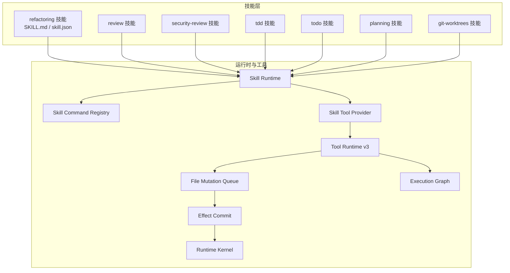
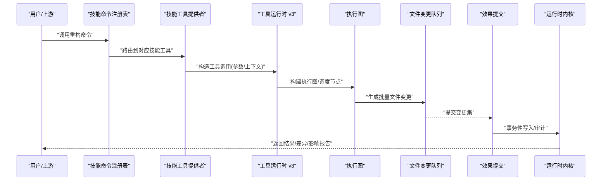
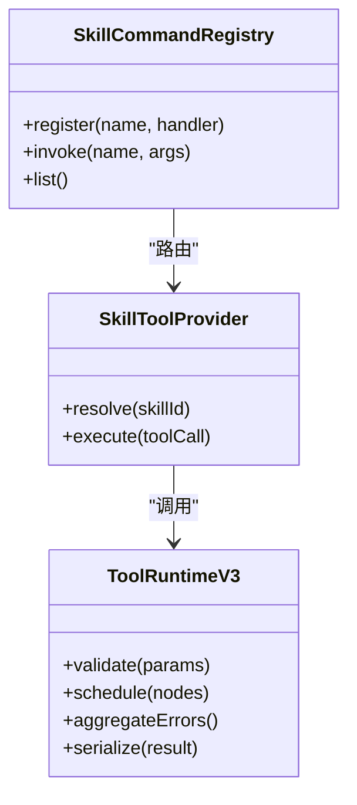
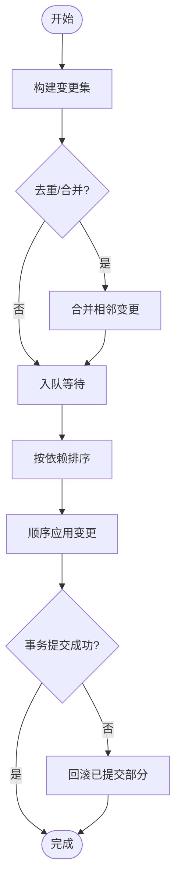
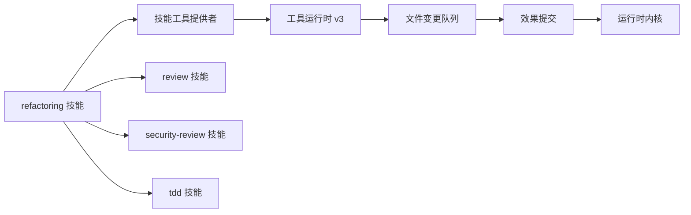

# 重构技能

<cite>
**本文引用的文件**   
- [engine/skills/refactoring/SKILL.md](file://engine/skills/refactoring/SKILL.md)
- [engine/skills/refactoring/skill.json](file://engine/skills/refactoring/skill.json)
- [engine/skills/review/SKILL.md](file://engine/skills/review/SKILL.md)
- [engine/skills/security-review/SKILL.md](file://engine/skills/security-review/SKILL.md)
- [engine/skills/code-review/SKILL.md](file://engine/skills/code-review/SKILL.md)
- [engine/skills/tdd/SKILL.md](file://engine/skills/tdd/SKILL.md)
- [engine/skills/tdd/tdd-cycle.md](file://engine/skills/tdd/tdd-cycle.md)
- [engine/skills/todo/SKILL.md](file://engine/skills/todo/SKILL.md)
- [engine/skills/planning/SKILL.md](file://engine/skills/planning/SKILL.md)
- [engine/skills/git-worktrees/SKILL.md](file://engine/skills/git-worktrees/SKILL.md)
- [engine/tests/builtin-skills.test.ts](file://engine/tests/builtin-skills.test.ts)
- [engine/tests/skill-command-registry.test.ts](file://engine/tests/skill-command-registry.test.ts)
- [engine/tests/skill-runtime.test.ts](file://engine/tests/skill-runtime.test.ts)
- [engine/tests/skill-tool-provider.test.ts](file://engine/tests/skill-tool-provider.test.ts)
- [engine/tests/tool-runtime-v3.test.ts](file://engine/tests/tool-runtime-v3.test.ts)
- [engine/tests/file-mutation-queue.test.ts](file://engine/tests/file-mutation-queue.test.ts)
- [engine/tests/effect-commit.test.ts](file://engine/tests/effect-commit.test.ts)
- [engine/tests/execution-graph.test.ts](file://engine/tests/execution-graph.test.ts)
- [engine/tests/runtime-kernel.test.ts](file://engine/tests/runtime-kernel.test.ts)
</cite>

## 目录
1. [简介](#简介)
2. [项目结构](#项目结构)
3. [核心组件](#核心组件)
4. [架构总览](#架构总览)
5. [详细组件分析](#详细组件分析)
6. [依赖分析](#依赖分析)
7. [性能考虑](#性能考虑)
8. [故障排查指南](#故障排查指南)
9. [结论](#结论)
10. [附录](#附录)

## 简介
本文件面向使用“重构技能”的工程师与团队，系统性说明其重构模式、安全检查、批量处理能力、支持的重构类型（函数提取、类重组、命名优化、代码结构改进）、安全预览与影响分析、版本控制集成与回滚机制、规则与安全阈值配置、大规模代码库的重构策略与渐进式改进方法，以及重构后的测试验证与质量保证流程。文档同时提供可视化图示与可追溯的来源定位，帮助读者快速上手并安全落地。

## 项目结构
仓库采用多包工作区组织，技能定义位于 engine/skills 下，每个技能包含 SKILL.md 与 skill.json；运行时与工具链位于 engine/packages 与 engine/tests。重构技能作为内置技能之一，通过命令注册表与运行时加载，并与工具提供者、效果提交、文件变更队列等子系统协作完成安全的批量重构。

图表来源
- [engine/skills/refactoring/skill.json](file://engine/skills/refactoring/skill.json)
- [engine/skills/refactoring/SKILL.md](file://engine/skills/refactoring/SKILL.md)
- [engine/tests/skill-command-registry.test.ts](file://engine/tests/skill-command-registry.test.ts)
- [engine/tests/skill-tool-provider.test.ts](file://engine/tests/skill-tool-provider.test.ts)
- [engine/tests/tool-runtime-v3.test.ts](file://engine/tests/tool-runtime-v3.test.ts)
- [engine/tests/file-mutation-queue.test.ts](file://engine/tests/file-mutation-queue.test.ts)
- [engine/tests/effect-commit.test.ts](file://engine/tests/effect-commit.test.ts)
- [engine/tests/execution-graph.test.ts](file://engine/tests/execution-graph.test.ts)
- [engine/tests/runtime-kernel.test.ts](file://engine/tests/runtime-kernel.test.ts)

章节来源
- [engine/skills/refactoring/SKILL.md](file://engine/skills/refactoring/SKILL.md)
- [engine/skills/refactoring/skill.json](file://engine/skills/refactoring/skill.json)
- [engine/tests/builtin-skills.test.ts](file://engine/tests/builtin-skills.test.ts)
- [engine/tests/skill-command-registry.test.ts](file://engine/tests/skill-command-registry.test.ts)
- [engine/tests/skill-tool-provider.test.ts](file://engine/tests/skill-tool-provider.test.ts)
- [engine/tests/tool-runtime-v3.test.ts](file://engine/tests/tool-runtime-v3.test.ts)
- [engine/tests/file-mutation-queue.test.ts](file://engine/tests/file-mutation-queue.test.ts)
- [engine/tests/effect-commit.test.ts](file://engine/tests/effect-commit.test.ts)
- [engine/tests/execution-graph.test.ts](file://engine/tests/execution-graph.test.ts)
- [engine/tests/runtime-kernel.test.ts](file://engine/tests/runtime-kernel.test.ts)

## 核心组件
- 重构技能定义：包含能力描述、可用命令、参数约定、输出格式与约束条件，供运行时解析与编排。
- 技能命令注册表：将技能暴露为可执行的命令入口，统一生命周期管理。
- 技能工具提供者：将技能逻辑封装为工具调用，供上层编排器按需执行。
- 工具运行时 v3：负责参数校验、并发控制、错误聚合与结果序列化。
- 文件变更队列：对大量文件修改进行排队、去重、合并与顺序化提交，避免锁竞争与状态不一致。
- 效果提交：以事务性方式持久化变更，支持原子提交与回滚。
- 执行图：将复杂任务分解为有向无环图节点，便于并行调度与失败重试。
- 运行时内核：提供资源隔离、权限控制、审计与观测点。

章节来源
- [engine/skills/refactoring/SKILL.md](file://engine/skills/refactoring/SKILL.md)
- [engine/skills/refactoring/skill.json](file://engine/skills/refactoring/skill.json)
- [engine/tests/skill-command-registry.test.ts](file://engine/tests/skill-command-registry.test.ts)
- [engine/tests/skill-tool-provider.test.ts](file://engine/tests/skill-tool-provider.test.ts)
- [engine/tests/tool-runtime-v3.test.ts](file://engine/tests/tool-runtime-v3.test.ts)
- [engine/tests/file-mutation-queue.test.ts](file://engine/tests/file-mutation-queue.test.ts)
- [engine/tests/effect-commit.test.ts](file://engine/tests/effect-commit.test.ts)
- [engine/tests/execution-graph.test.ts](file://engine/tests/execution-graph.test.ts)
- [engine/tests/runtime-kernel.test.ts](file://engine/tests/runtime-kernel.test.ts)

## 架构总览
下图展示了从用户触发到最终落盘的关键路径：命令注册表分发请求至技能工具提供者，经由工具运行时 v3 编排执行图，利用文件变更队列批量处理，并通过效果提交确保一致性。

图表来源
- [engine/tests/skill-command-registry.test.ts](file://engine/tests/skill-command-registry.test.ts)
- [engine/tests/skill-tool-provider.test.ts](file://engine/tests/skill-tool-provider.test.ts)
- [engine/tests/tool-runtime-v3.test.ts](file://engine/tests/tool-runtime-v3.test.ts)
- [engine/tests/execution-graph.test.ts](file://engine/tests/execution-graph.test.ts)
- [engine/tests/file-mutation-queue.test.ts](file://engine/tests/file-mutation-queue.test.ts)
- [engine/tests/effect-commit.test.ts](file://engine/tests/effect-commit.test.ts)
- [engine/tests/runtime-kernel.test.ts](file://engine/tests/runtime-kernel.test.ts)

## 详细组件分析

### 重构技能定义与能力边界
- 能力范围：函数提取、类重组、命名优化、代码结构改进、跨文件引用更新、批量应用与预览。
- 输入约定：目标范围（文件/符号/AST片段）、操作类型、约束条件（如保留注释/测试兼容）、阈值与开关（最大变更数、并发度）。
- 输出产物：变更清单、影响分析报告、预览差异、回滚快照。
- 安全约束：禁止破坏性重写未校验范围；默认开启最小变更原则；敏感区域需显式放行。

章节来源
- [engine/skills/refactoring/SKILL.md](file://engine/skills/refactoring/SKILL.md)
- [engine/skills/refactoring/skill.json](file://engine/skills/refactoring/skill.json)

### 命令注册与工具编排
- 命令注册表负责发现、校验与分发技能命令，保证统一的鉴权与审计。
- 工具提供者将技能逻辑包装为可复用的工具接口，屏蔽底层实现细节。
- 工具运行时 v3 提供参数校验、并发控制、错误聚合与幂等保障。

图表来源
- [engine/tests/skill-command-registry.test.ts](file://engine/tests/skill-command-registry.test.ts)
- [engine/tests/skill-tool-provider.test.ts](file://engine/tests/skill-tool-provider.test.ts)
- [engine/tests/tool-runtime-v3.test.ts](file://engine/tests/tool-runtime-v3.test.ts)

章节来源
- [engine/tests/skill-command-registry.test.ts](file://engine/tests/skill-command-registry.test.ts)
- [engine/tests/skill-tool-provider.test.ts](file://engine/tests/skill-tool-provider.test.ts)
- [engine/tests/tool-runtime-v3.test.ts](file://engine/tests/tool-runtime-v3.test.ts)

### 批量文件变更与事务提交
- 文件变更队列对大量修改进行排序、去重与批量化，降低 I/O 压力与锁冲突。
- 效果提交以事务形式写入，支持原子性与回滚；失败时自动恢复中间状态。
- 执行图用于拆分复杂重构步骤，提升吞吐与可观测性。

图表来源
- [engine/tests/file-mutation-queue.test.ts](file://engine/tests/file-mutation-queue.test.ts)
- [engine/tests/effect-commit.test.ts](file://engine/tests/effect-commit.test.ts)
- [engine/tests/execution-graph.test.ts](file://engine/tests/execution-graph.test.ts)

章节来源
- [engine/tests/file-mutation-queue.test.ts](file://engine/tests/file-mutation-queue.test.ts)
- [engine/tests/effect-commit.test.ts](file://engine/tests/effect-commit.test.ts)
- [engine/tests/execution-graph.test.ts](file://engine/tests/execution-graph.test.ts)

### 安全检查与影响分析
- 安全检查：结合 review 与 security-review 技能，在重构前后进行静态检查、风险扫描与合规校验。
- 影响分析：基于 AST/符号表与引用关系，生成受影响文件与调用链清单，辅助决策是否放行。
- 阈值控制：限制单次变更规模、并发度与耗时，防止长尾任务阻塞流水线。

章节来源
- [engine/skills/review/SKILL.md](file://engine/skills/review/SKILL.md)
- [engine/skills/security-review/SKILL.md](file://engine/skills/security-review/SKILL.md)
- [engine/skills/refactoring/SKILL.md](file://engine/skills/refactoring/SKILL.md)

### 版本控制集成与回滚机制
- 分支与工作树：借助 git-worktrees 技能创建独立工作树，隔离重构实验与主分支。
- 提交粒度：以功能为单位生成小步提交，便于审查与回滚。
- 回滚策略：基于效果提交的快照与变更清单，一键回滚到指定点或撤销最近一批变更。

章节来源
- [engine/skills/git-worktrees/SKILL.md](file://engine/skills/git-worktrees/SKILL.md)
- [engine/tests/effect-commit.test.ts](file://engine/tests/effect-commit.test.ts)

### 测试驱动与质量保障
- TDD 循环：在重构前补充或修复测试用例，确保行为不变；重构后回归验证。
- 自动化验证：将单元测试、集成测试与静态检查纳入流水线，失败则阻断发布。
- 覆盖率与门禁：设定最低覆盖率与关键路径通过率，保障重构质量。

章节来源
- [engine/skills/tdd/SKILL.md](file://engine/skills/tdd/SKILL.md)
- [engine/skills/tdd/tdd-cycle.md](file://engine/skills/tdd/tdd-cycle.md)

### 计划与待办协同
- 规划技能：将大型重构拆分为里程碑与子任务，明确依赖与验收标准。
- 待办跟踪：记录变更项、风险点与责任人，形成可追踪的交付物。

章节来源
- [engine/skills/planning/SKILL.md](file://engine/skills/planning/SKILL.md)
- [engine/skills/todo/SKILL.md](file://engine/skills/todo/SKILL.md)

## 依赖分析
- 内聚与耦合：重构技能通过工具提供者与运行时解耦具体实现；变更队列与效果提交抽象了 I/O 与事务语义，降低耦合。
- 外部依赖：Git 工作树、测试框架与静态分析工具通过命令/脚本接入，保持松耦合。
- 潜在环路：通过执行图与队列化解串行依赖，避免循环调用导致的死锁。

图表来源
- [engine/skills/refactoring/skill.json](file://engine/skills/refactoring/skill.json)
- [engine/tests/skill-tool-provider.test.ts](file://engine/tests/skill-tool-provider.test.ts)
- [engine/tests/tool-runtime-v3.test.ts](file://engine/tests/tool-runtime-v3.test.ts)
- [engine/tests/file-mutation-queue.test.ts](file://engine/tests/file-mutation-queue.test.ts)
- [engine/tests/effect-commit.test.ts](file://engine/tests/effect-commit.test.ts)
- [engine/tests/runtime-kernel.test.ts](file://engine/tests/runtime-kernel.test.ts)

章节来源
- [engine/tests/builtin-skills.test.ts](file://engine/tests/builtin-skills.test.ts)
- [engine/tests/skill-command-registry.test.ts](file://engine/tests/skill-command-registry.test.ts)
- [engine/tests/skill-tool-provider.test.ts](file://engine/tests/skill-tool-provider.test.ts)
- [engine/tests/tool-runtime-v3.test.ts](file://engine/tests/tool-runtime-v3.test.ts)
- [engine/tests/file-mutation-queue.test.ts](file://engine/tests/file-mutation-queue.test.ts)
- [engine/tests/effect-commit.test.ts](file://engine/tests/effect-commit.test.ts)
- [engine/tests/execution-graph.test.ts](file://engine/tests/execution-graph.test.ts)
- [engine/tests/runtime-kernel.test.ts](file://engine/tests/runtime-kernel.test.ts)

## 性能考虑
- 分批与限流：通过变更队列与执行图控制并发度与批次大小，避免内存峰值与磁盘抖动。
- 增量计算：优先选择局部 AST 分析与符号引用更新，减少全量扫描。
- 缓存与复用：对重复的模式匹配与转换结果进行缓存，缩短二次运行时间。
- 监控与告警：在关键阶段埋点，观察耗时、失败率与资源占用，及时调优阈值。

[本节为通用指导，不直接分析具体文件]

## 故障排查指南
- 常见症状
  - 批量变更卡住：检查变更队列积压与锁争用，确认排序与去重逻辑。
  - 提交失败：查看效果提交的事务日志与回滚快照，定位失败节点。
  - 工具调用超时：调整工具运行时 v3 的并发与超时参数，必要时拆分执行图。
- 诊断步骤
  - 启用更详细的日志与审计信息，聚焦失败前后的变更集。
  - 缩小范围：先对单文件或单模块试运行，逐步扩大。
  - 回滚验证：使用快照恢复到上一稳定点，确认问题是否在重构引入。
- 参考测试用例
  - 命令注册、工具提供、运行时编排、变更队列、效果提交、执行图等均有覆盖用例，可作为排障对照。

章节来源
- [engine/tests/skill-command-registry.test.ts](file://engine/tests/skill-command-registry.test.ts)
- [engine/tests/skill-tool-provider.test.ts](file://engine/tests/skill-tool-provider.test.ts)
- [engine/tests/tool-runtime-v3.test.ts](file://engine/tests/tool-runtime-v3.test.ts)
- [engine/tests/file-mutation-queue.test.ts](file://engine/tests/file-mutation-queue.test.ts)
- [engine/tests/effect-commit.test.ts](file://engine/tests/effect-commit.test.ts)
- [engine/tests/execution-graph.test.ts](file://engine/tests/execution-graph.test.ts)

## 结论
重构技能通过清晰的职责划分与强一致性的变更提交流程，实现了安全、可控且可扩展的代码重构能力。配合安全检查、影响分析、版本控制集成与测试驱动的质量保障体系，可在大规模代码库中稳健推进渐进式改进。建议在生产环境严格遵循阈值与门禁策略，并以小步快跑的方式持续演进。

[本节为总结性内容，不直接分析具体文件]

## 附录

### 典型使用示例（步骤级）
- 函数提取
  - 选择目标代码块，声明新函数签名与可见性。
  - 生成调用点替换与导入更新。
  - 预览变更并运行相关测试，通过后提交。
- 类重组
  - 识别职责边界，拆分或合并类与方法。
  - 更新继承与组合关系，修正引用。
  - 运行影响分析与回归测试，确认无退化。
- 命名优化
  - 基于语义与上下文推断更清晰名称。
  - 全局替换并校验编译与测试。
  - 生成变更摘要与影响报告。
- 代码结构改进
  - 抽取公共模块、消除重复、规范化目录结构。
  - 分阶段迁移，保持向后兼容。
  - 逐步清理遗留依赖，完成收尾。

[本节为概念性示例，不直接分析具体文件]

### 配置项与阈值建议
- 变更规模：限制单次最大文件数与行数，避免一次性过大变更。
- 并发度：根据机器资源与磁盘 I/O 设置合理并发上限。
- 超时与重试：为工具调用设置超时与重试次数，增强鲁棒性。
- 安全阈值：对高风险操作（如删除 API、修改核心契约）要求人工审批。
- 测试门禁：设定最低覆盖率与关键用例通过率，未达标则阻断。

[本节为通用配置建议，不直接分析具体文件]

### 大规模重构策略与渐进式改进
- 分层推进：按模块/领域逐步重构，降低耦合面。
- 特性开关：通过开关控制新旧实现共存，灰度切换。
- 影子运行：在预发环境并行运行新旧逻辑，对比结果。
- 指标驱动：以缺陷密度、构建时长、测试通过率等指标评估改进成效。

[本节为通用策略建议，不直接分析具体文件]