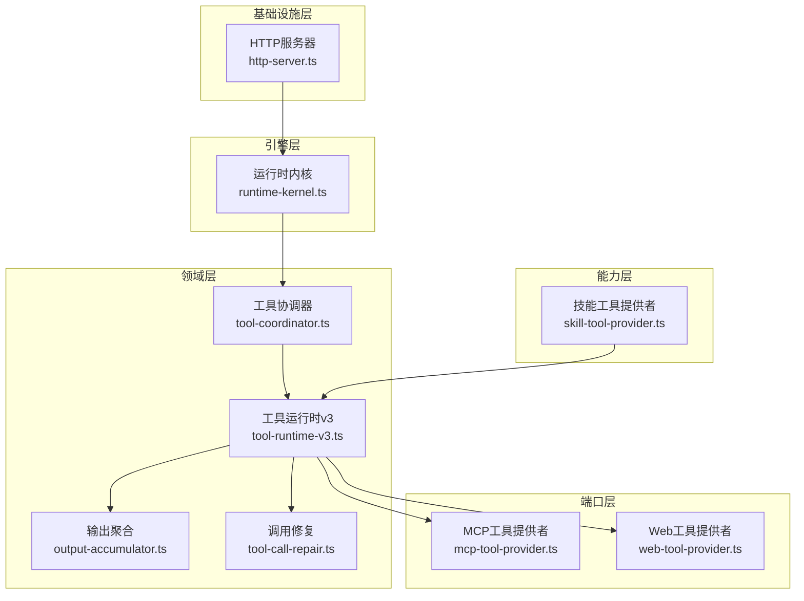
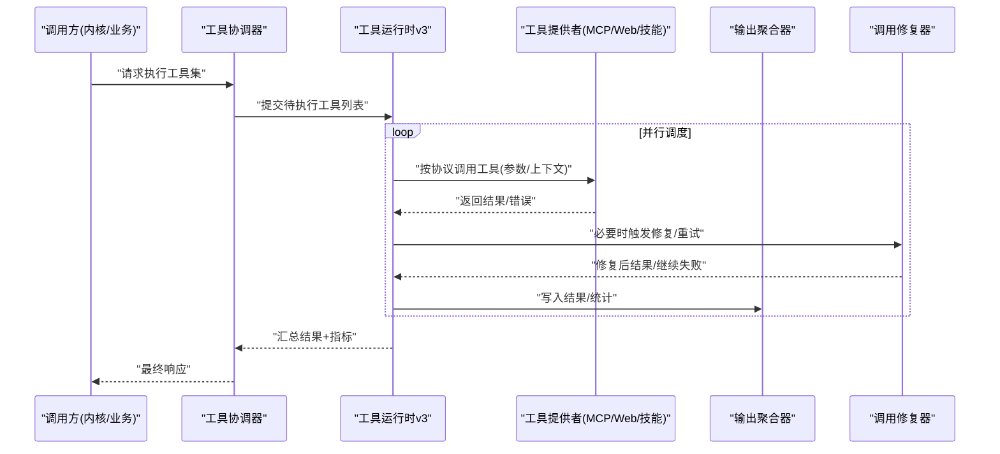
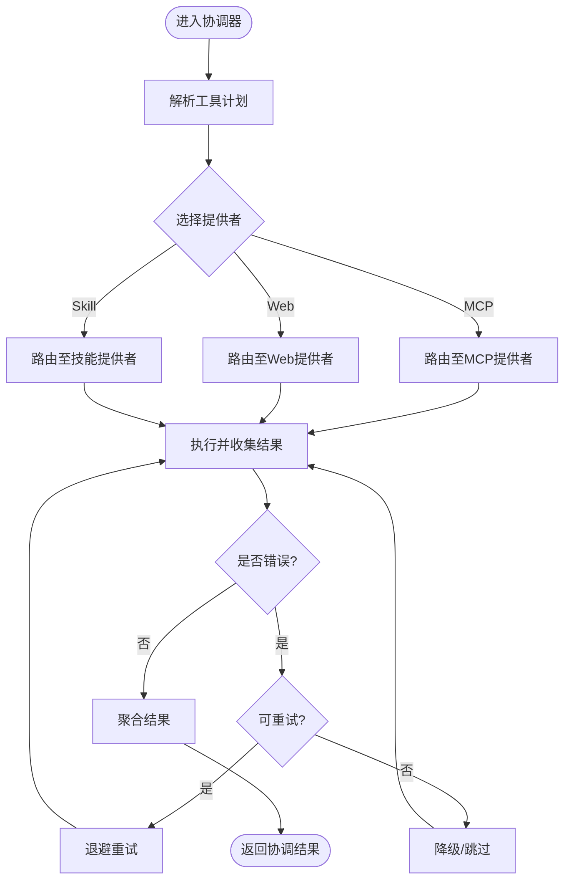
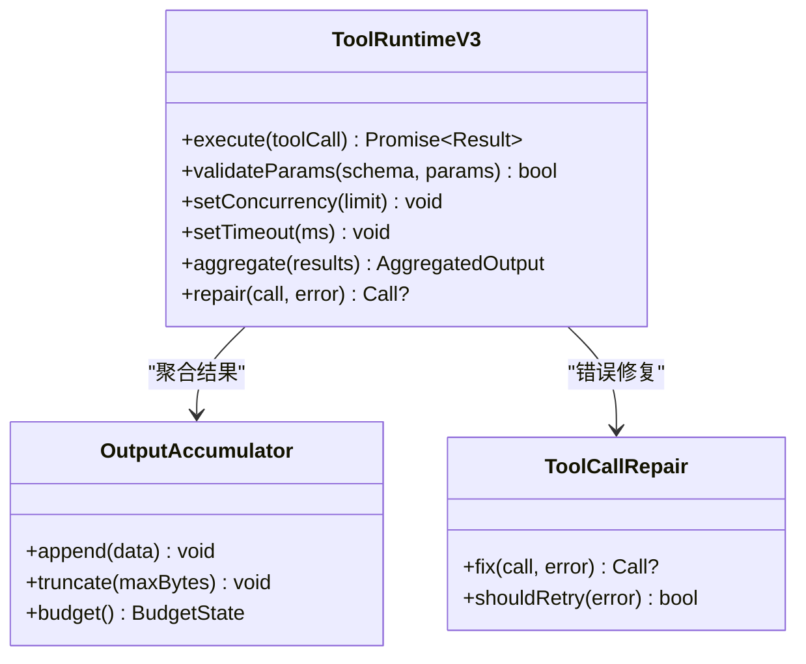
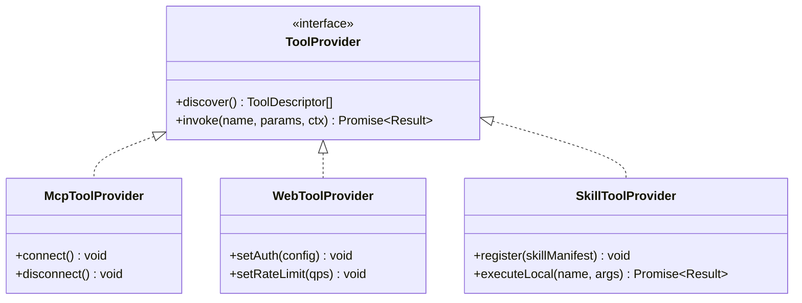
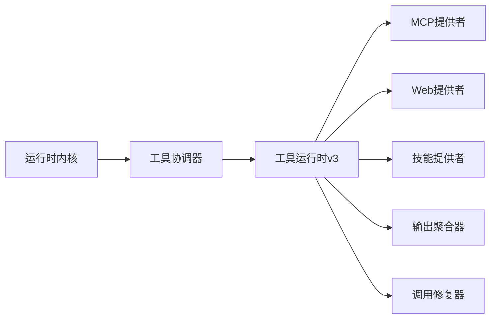

# 技能工具集成

<cite>
**本文引用的文件**   
- [engine/packages/domain-layer/src/tool-coordinator.ts](file://engine/packages/domain-layer/src/tool-coordinator.ts)
- [engine/packages/domain-layer/src/tool-runtime-v3.ts](file://engine/packages/domain-layer/src/tool-runtime-v3.ts)
- [engine/packages/ports-layer/src/mcp-tool-provider.ts](file://engine/packages/ports-layer/src/mcp-tool-provider.ts)
- [engine/packages/ports-layer/src/web-tool-provider.ts](file://engine/packages/ports-layer/src/web-tool-provider.ts)
- [engine/packages/capabilities/src/skill-tool-provider.ts](file://engine/packages/capabilities/src/skill-tool-provider.ts)
- [engine/packages/engine/src/runtime-kernel.ts](file://engine/packages/engine/src/runtime-kernel.ts)
- [engine/packages/foundation/src/tool-call-repair.ts](file://engine/packages/foundation/src/tool-call-repair.ts)
- [engine/packages/foundation/src/output-accumulator.ts](file://engine/packages/foundation/src/output-accumulator.ts)
- [engine/packages/infrastructure/src/http-server.ts](file://engine/packages/infrastructure/src/http-server.ts)
- [engine/tests/tool-coordinator-runtime.test.ts](file://engine/tests/tool-coordinator-runtime.test.ts)
- [engine/tests/tool-dispatch-errors.test.ts](file://engine/tests/tool-dispatch-errors.test.ts)
- [engine/tests/tool-result-budget.test.ts](file://engine/tests/tool-result-budget.test.ts)
- [engine/tests/tool-storm-breaker.test.ts](file://engine/tests/tool-storm-breaker.test.ts)
- [engine/tests/tool-runtime-v3.test.ts](file://engine/tests/tool-runtime-v3.test.ts)
- [engine/tests/builtin-tools.test.ts](file://engine/tests/builtin-tools.test.ts)
- [engine/tests/skill-command-registry.test.ts](file://engine/tests/skill-command-registry.test.ts)
- [engine/tests/skill-mcp-bridge.test.ts](file://engine/tests/skill-mcp-bridge.test.ts)
- [engine/tests/skill-tool-provider.test.ts](file://engine/tests/skill-tool-provider.test.ts)
- [engine/tests/mcp-tool-provider.test.ts](file://engine/tests/mcp-tool-provider.test.ts)
- [engine/tests/web-tool-provider.test.ts](file://engine/tests/web-tool-provider.test.ts)
- [engine/tests/http-server-test-harness.ts](file://engine/tests/http-server-test-harness.ts)
</cite>

## 目录
1. [简介](#简介)
2. [项目结构](#项目结构)
3. [核心组件](#核心组件)
4. [架构总览](#架构总览)
5. [详细组件分析](#详细组件分析)
6. [依赖关系分析](#依赖关系分析)
7. [性能考量](#性能考量)
8. [故障排除指南](#故障排除指南)
9. [结论](#结论)
10. [附录：API与开发示例](#附录api与开发示例)

## 简介
本文件面向KCoder的技能工具集成，系统性阐述“技能—工具”的集成架构与实现要点。内容覆盖：
- 工具提供者模式、调用协议与参数传递机制
- 工具协调器（调度、负载均衡、错误恢复）
- 生命周期管理与资源池化策略
- 异步处理与结果聚合
- 错误处理与重试机制
- 性能监控与度量收集
- 安全沙箱与执行环境隔离
- API接口文档与开发示例
- 性能优化与故障排除建议

## 项目结构
围绕“技能工具集成”，仓库中关键代码分布在以下包与测试中：
- 领域层：工具协调器、运行时v3、输出聚合、调用修复
- 端口层：MCP工具提供者、Web工具提供者
- 能力层：技能工具桥接
- 引擎层：运行时内核（编排与治理）
- 基础设施层：HTTP服务（可观测性、遥测）
- 测试：覆盖协调器、分发错误、预算控制、风暴熔断、运行时v3、内置工具、技能命令注册、MCP桥接、Web提供者等

图表来源
- [engine/packages/domain-layer/src/tool-coordinator.ts](file://engine/packages/domain-layer/src/tool-coordinator.ts)
- [engine/packages/domain-layer/src/tool-runtime-v3.ts](file://engine/packages/domain-layer/src/tool-runtime-v3.ts)
- [engine/packages/ports-layer/src/mcp-tool-provider.ts](file://engine/packages/ports-layer/src/mcp-tool-provider.ts)
- [engine/packages/ports-layer/src/web-tool-provider.ts](file://engine/packages/ports-layer/src/web-tool-provider.ts)
- [engine/packages/capabilities/src/skill-tool-provider.ts](file://engine/packages/capabilities/src/skill-tool-provider.ts)
- [engine/packages/engine/src/runtime-kernel.ts](file://engine/packages/engine/src/runtime-kernel.ts)
- [engine/packages/foundation/src/output-accumulator.ts](file://engine/packages/foundation/src/output-accumulator.ts)
- [engine/packages/foundation/src/tool-call-repair.ts](file://engine/packages/foundation/src/tool-call-repair.ts)
- [engine/packages/infrastructure/src/http-server.ts](file://engine/packages/infrastructure/src/http-server.ts)

章节来源
- [engine/packages/domain-layer/src/tool-coordinator.ts](file://engine/packages/domain-layer/src/tool-coordinator.ts)
- [engine/packages/domain-layer/src/tool-runtime-v3.ts](file://engine/packages/domain-layer/src/tool-runtime-v3.ts)
- [engine/packages/ports-layer/src/mcp-tool-provider.ts](file://engine/packages/ports-layer/src/mcp-tool-provider.ts)
- [engine/packages/ports-layer/src/web-tool-provider.ts](file://engine/packages/ports-layer/src/web-tool-provider.ts)
- [engine/packages/capabilities/src/skill-tool-provider.ts](file://engine/packages/capabilities/src/skill-tool-provider.ts)
- [engine/packages/engine/src/runtime-kernel.ts](file://engine/packages/engine/src/runtime-kernel.ts)
- [engine/packages/foundation/src/output-accumulator.ts](file://engine/packages/foundation/src/output-accumulator.ts)
- [engine/packages/foundation/src/tool-call-repair.ts](file://engine/packages/foundation/src/tool-call-repair.ts)
- [engine/packages/infrastructure/src/http-server.ts](file://engine/packages/infrastructure/src/http-server.ts)

## 核心组件
- 工具协调器：负责工具发现、选择、调度、并发控制与结果汇聚，屏蔽底层提供者差异。
- 工具运行时v3：统一工具调用协议、参数校验与序列化、异步执行、超时与限流、错误分类与修复、结果聚合。
- 工具提供者：抽象出MCP、Web、技能内嵌等多种后端，提供一致的调用接口。
- 输出聚合器：对多路异步结果进行合并、截断与预算控制。
- 调用修复器：在失败或异常时尝试自动修复（如参数修正、降级策略）。
- 运行时内核：将工具编排纳入任务/回合级工作流，结合治理策略（预算、熔断、审计）。
- HTTP服务器：暴露遥测与可观测性端点，支撑监控与诊断。

章节来源
- [engine/packages/domain-layer/src/tool-coordinator.ts](file://engine/packages/domain-layer/src/tool-coordinator.ts)
- [engine/packages/domain-layer/src/tool-runtime-v3.ts](file://engine/packages/domain-layer/src/tool-runtime-v3.ts)
- [engine/packages/foundation/src/output-accumulator.ts](file://engine/packages/foundation/src/output-accumulator.ts)
- [engine/packages/foundation/src/tool-call-repair.ts](file://engine/packages/foundation/src/tool-call-repair.ts)
- [engine/packages/engine/src/runtime-kernel.ts](file://engine/packages/engine/src/runtime-kernel.ts)
- [engine/packages/infrastructure/src/http-server.ts](file://engine/packages/infrastructure/src/http-server.ts)

## 架构总览
下图展示了从上层调用到具体工具执行的端到端流程，包括协调器、运行时、提供者、聚合与修复路径。

图表来源
- [engine/packages/domain-layer/src/tool-coordinator.ts](file://engine/packages/domain-layer/src/tool-coordinator.ts)
- [engine/packages/domain-layer/src/tool-runtime-v3.ts](file://engine/packages/domain-layer/src/tool-runtime-v3.ts)
- [engine/packages/ports-layer/src/mcp-tool-provider.ts](file://engine/packages/ports-layer/src/mcp-tool-provider.ts)
- [engine/packages/ports-layer/src/web-tool-provider.ts](file://engine/packages/ports-layer/src/web-tool-provider.ts)
- [engine/packages/capabilities/src/skill-tool-provider.ts](file://engine/packages/capabilities/src/skill-tool-provider.ts)
- [engine/packages/foundation/src/output-accumulator.ts](file://engine/packages/foundation/src/output-accumulator.ts)
- [engine/packages/foundation/src/tool-call-repair.ts](file://engine/packages/foundation/src/tool-call-repair.ts)

## 详细组件分析

### 工具协调器（调度、负载均衡、错误恢复）
- 职责
  - 接收来自内核的任务/回合中的工具调用计划
  - 根据策略选择目标提供者（MCP/Web/技能），支持按标签/权重/亲和度路由
  - 并发控制与背压，避免过载
  - 错误分类与恢复（重试、降级、熔断）
  - 结果聚合与预算控制
- 设计要点
  - 分层调度：先选提供者类型，再选实例；支持健康检查与动态权重
  - 容错：区分可重试错误（网络抖动、瞬时失败）与不可重试错误（参数非法、权限不足）
  - 可观测：记录耗时、吞吐、错误率、预算消耗

图表来源
- [engine/packages/domain-layer/src/tool-coordinator.ts](file://engine/packages/domain-layer/src/tool-coordinator.ts)
- [engine/packages/ports-layer/src/mcp-tool-provider.ts](file://engine/packages/ports-layer/src/mcp-tool-provider.ts)
- [engine/packages/ports-layer/src/web-tool-provider.ts](file://engine/packages/ports-layer/src/web-tool-provider.ts)
- [engine/packages/capabilities/src/skill-tool-provider.ts](file://engine/packages/capabilities/src/skill-tool-provider.ts)

章节来源
- [engine/packages/domain-layer/src/tool-coordinator.ts](file://engine/packages/domain-layer/src/tool-coordinator.ts)
- [engine/tests/tool-coordinator-runtime.test.ts](file://engine/tests/tool-coordinator-runtime.test.ts)

### 工具运行时v3（调用协议、参数传递、异步与聚合）
- 调用协议
  - 统一的工具描述与参数Schema，支持强类型校验与默认值注入
  - 上下文透传（会话、权限、租户、追踪ID）
- 异步与并发
  - 基于Promise的异步执行，支持并发上限与队列
  - 超时控制与取消传播
- 结果聚合
  - 使用输出聚合器进行增量写入、大小限制与预算扣减
- 错误修复
  - 自动检测常见错误（如字段缺失、类型不匹配），尝试修复并重试一次

图表来源
- [engine/packages/domain-layer/src/tool-runtime-v3.ts](file://engine/packages/domain-layer/src/tool-runtime-v3.ts)
- [engine/packages/foundation/src/output-accumulator.ts](file://engine/packages/foundation/src/output-accumulator.ts)
- [engine/packages/foundation/src/tool-call-repair.ts](file://engine/packages/foundation/src/tool-call-repair.ts)

章节来源
- [engine/packages/domain-layer/src/tool-runtime-v3.ts](file://engine/packages/domain-layer/src/tool-runtime-v3.ts)
- [engine/packages/foundation/src/output-accumulator.ts](file://engine/packages/foundation/src/output-accumulator.ts)
- [engine/packages/foundation/src/tool-call-repair.ts](file://engine/packages/foundation/src/tool-call-repair.ts)
- [engine/tests/tool-runtime-v3.test.ts](file://engine/tests/tool-runtime-v3.test.ts)

### 工具提供者（MCP、Web、技能）
- MCP工具提供者
  - 通过MCP协议与外部工具服务通信，支持发现、订阅与批量调用
  - 具备连接池、重试与熔断
- Web工具提供者
  - 基于HTTP/HTTPS调用第三方REST工具，支持鉴权、签名与速率限制
- 技能工具提供者
  - 将技能声明的工具映射为运行时可调用的工具，支持本地执行与沙箱隔离

图表来源
- [engine/packages/ports-layer/src/mcp-tool-provider.ts](file://engine/packages/ports-layer/src/mcp-tool-provider.ts)
- [engine/packages/ports-layer/src/web-tool-provider.ts](file://engine/packages/ports-layer/src/web-tool-provider.ts)
- [engine/packages/capabilities/src/skill-tool-provider.ts](file://engine/packages/capabilities/src/skill-tool-provider.ts)

章节来源
- [engine/packages/ports-layer/src/mcp-tool-provider.ts](file://engine/packages/ports-layer/src/mcp-tool-provider.ts)
- [engine/packages/ports-layer/src/web-tool-provider.ts](file://engine/packages/ports-layer/src/web-tool-provider.ts)
- [engine/packages/capabilities/src/skill-tool-provider.ts](file://engine/packages/capabilities/src/skill-tool-provider.ts)
- [engine/tests/mcp-tool-provider.test.ts](file://engine/tests/mcp-tool-provider.test.ts)
- [engine/tests/web-tool-provider.test.ts](file://engine/tests/web-tool-provider.test.ts)
- [engine/tests/skill-tool-provider.test.ts](file://engine/tests/skill-tool-provider.test.ts)

### 运行时内核（编排与治理）
- 将工具调用嵌入任务/回合工作流，结合预算、熔断、审计与回放
- 与协调器协作，确保跨步骤的一致性与幂等

章节来源
- [engine/packages/engine/src/runtime-kernel.ts](file://engine/packages/engine/src/runtime-kernel.ts)

### 可观测性与HTTP服务
- 暴露遥测端点，采集延迟、吞吐、错误率、预算消耗、熔断状态等
- 支持导出到外部监控系统

章节来源
- [engine/packages/infrastructure/src/http-server.ts](file://engine/packages/infrastructure/src/http-server.ts)
- [engine/tests/http-server-test-harness.ts](file://engine/tests/http-server-test-harness.ts)

## 依赖关系分析
- 低耦合：运行时v3仅依赖抽象的提供者接口，便于替换与扩展
- 高内聚：协调器集中管理调度策略与错误恢复，降低上层复杂度
- 可插拔：新增提供者只需实现统一接口并在注册表中声明
- 潜在循环：应避免在提供者中反向依赖运行时内核，防止循环引用

图表来源
- [engine/packages/engine/src/runtime-kernel.ts](file://engine/packages/engine/src/runtime-kernel.ts)
- [engine/packages/domain-layer/src/tool-coordinator.ts](file://engine/packages/domain-layer/src/tool-coordinator.ts)
- [engine/packages/domain-layer/src/tool-runtime-v3.ts](file://engine/packages/domain-layer/src/tool-runtime-v3.ts)
- [engine/packages/ports-layer/src/mcp-tool-provider.ts](file://engine/packages/ports-layer/src/mcp-tool-provider.ts)
- [engine/packages/ports-layer/src/web-tool-provider.ts](file://engine/packages/ports-layer/src/web-tool-provider.ts)
- [engine/packages/capabilities/src/skill-tool-provider.ts](file://engine/packages/capabilities/src/skill-tool-provider.ts)
- [engine/packages/foundation/src/output-accumulator.ts](file://engine/packages/foundation/src/output-accumulator.ts)
- [engine/packages/foundation/src/tool-call-repair.ts](file://engine/packages/foundation/src/tool-call-repair.ts)

章节来源
- [engine/packages/engine/src/runtime-kernel.ts](file://engine/packages/engine/src/runtime-kernel.ts)
- [engine/packages/domain-layer/src/tool-coordinator.ts](file://engine/packages/domain-layer/src/tool-coordinator.ts)
- [engine/packages/domain-layer/src/tool-runtime-v3.ts](file://engine/packages/domain-layer/src/tool-runtime-v3.ts)
- [engine/packages/ports-layer/src/mcp-tool-provider.ts](file://engine/packages/ports-layer/src/mcp-tool-provider.ts)
- [engine/packages/ports-layer/src/web-tool-provider.ts](file://engine/packages/ports-layer/src/web-tool-provider.ts)
- [engine/packages/capabilities/src/skill-tool-provider.ts](file://engine/packages/capabilities/src/skill-tool-provider.ts)
- [engine/packages/foundation/src/output-accumulator.ts](file://engine/packages/foundation/src/output-accumulator.ts)
- [engine/packages/foundation/src/tool-call-repair.ts](file://engine/packages/foundation/src/tool-call-repair.ts)

## 性能考量
- 并发与背压
  - 合理设置并发上限，避免下游提供者过载
  - 使用队列与令牌桶控制突发流量
- 超时与熔断
  - 短超时快速失败，配合指数退避重试
  - 熔断器保护不稳定提供者，避免雪崩
- 结果聚合与预算
  - 大结果分片聚合，及时截断，控制内存占用
  - 预算驱动的结果裁剪，保证整体成本可控
- 缓存与复用
  - 对读多写少的工具结果做短期缓存
  - 提供者连接池复用，减少握手开销

[本节为通用指导，无需源码引用]

## 故障排除指南
- 常见问题定位
  - 分发错误：检查参数Schema、权限与提供者可达性
  - 结果预算超限：调整聚合阈值或启用压缩/分页
  - 风暴熔断：观察错误率与延迟，临时降配或切换提供者
- 调试手段
  - 开启详细日志与追踪ID，关联上下游调用链
  - 使用HTTP服务端点拉取实时指标
- 回归验证
  - 参考相关测试用例复现与验证修复效果

章节来源
- [engine/tests/tool-dispatch-errors.test.ts](file://engine/tests/tool-dispatch-errors.test.ts)
- [engine/tests/tool-result-budget.test.ts](file://engine/tests/tool-result-budget.test.ts)
- [engine/tests/tool-storm-breaker.test.ts](file://engine/tests/tool-storm-breaker.test.ts)
- [engine/tests/http-server-test-harness.ts](file://engine/tests/http-server-test-harness.ts)

## 结论
KCoder的技能工具集成以“协调器+运行时v3+多提供者”为核心，形成可扩展、可观测、可治理的工具执行体系。通过统一的调用协议、完善的错误修复与重试、严格的预算与熔断控制，以及丰富的可观测性能力，能够在复杂工程场景中稳定高效地运行。

[本节为总结，无需源码引用]

## 附录：API与开发示例

### 统一工具调用协议（概念说明）
- 输入
  - 工具名、参数对象（遵循Schema）、上下文（会话/权限/追踪ID）
- 输出
  - 成功：结构化结果（可能为流式/分片）
  - 失败：错误码、消息、是否可重试、修复建议
- 元数据
  - 耗时、字节数、预算消耗、提供者标识

[本节为概念说明，无需源码引用]

### 开发者接入清单
- 实现自定义工具提供者
  - 实现统一接口（发现、调用）
  - 注册到提供者表，配置权重与健康检查
- 在技能中声明工具
  - 定义工具描述与参数Schema
  - 绑定到技能命令注册表
- 使用运行时v3
  - 设置并发、超时、预算
  - 启用输出聚合与调用修复
- 接入可观测性
  - 启用HTTP服务端点，采集指标
  - 对接外部监控平台

章节来源
- [engine/tests/skill-command-registry.test.ts](file://engine/tests/skill-command-registry.test.ts)
- [engine/tests/skill-mcp-bridge.test.ts](file://engine/tests/skill-mcp-bridge.test.ts)
- [engine/tests/builtin-tools.test.ts](file://engine/tests/builtin-tools.test.ts)
- [engine/tests/mcp-tool-provider.test.ts](file://engine/tests/mcp-tool-provider.test.ts)
- [engine/tests/web-tool-provider.test.ts](file://engine/tests/web-tool-provider.test.ts)
- [engine/tests/tool-runtime-v3.test.ts](file://engine/tests/tool-runtime-v3.test.ts)
- [engine/tests/tool-coordinator-runtime.test.ts](file://engine/tests/tool-coordinator-runtime.test.ts)