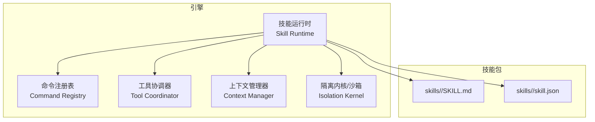
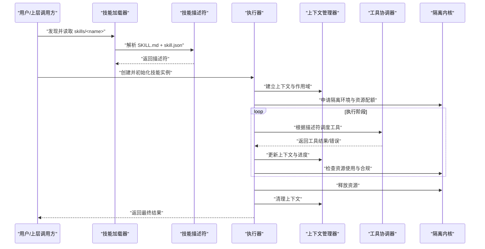
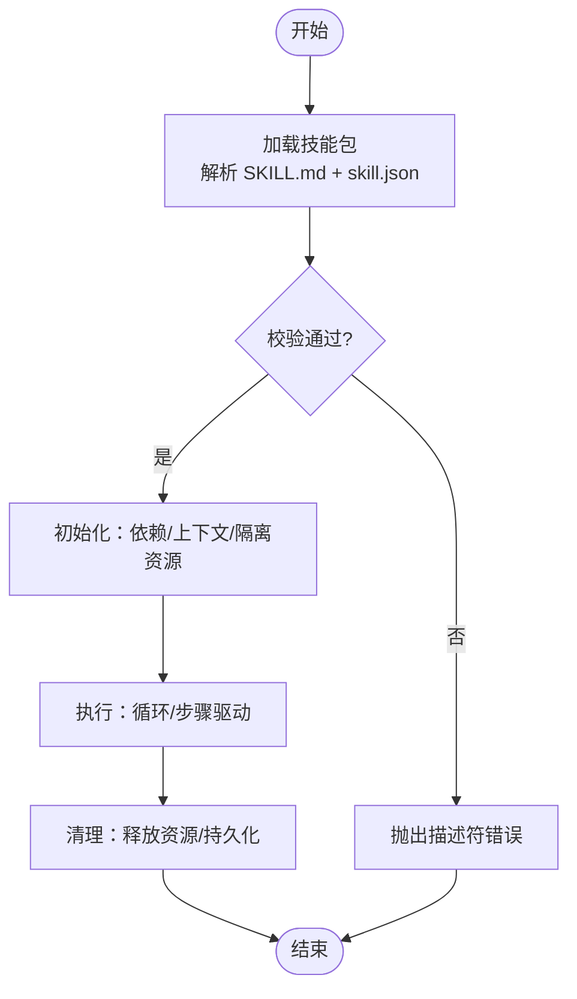
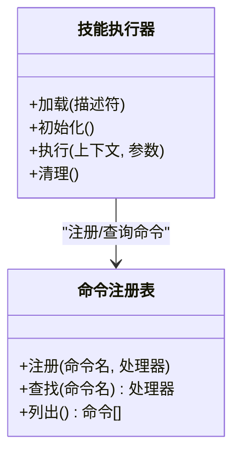
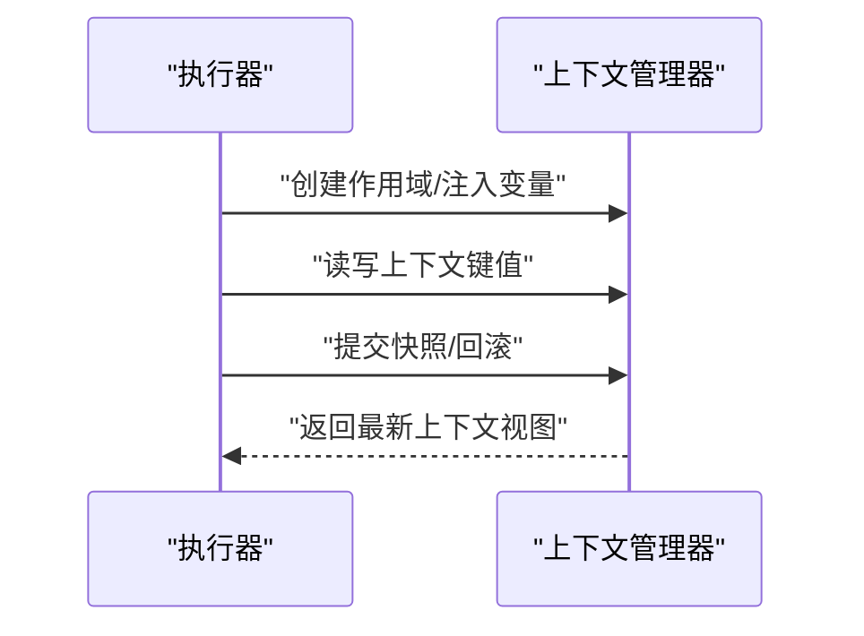
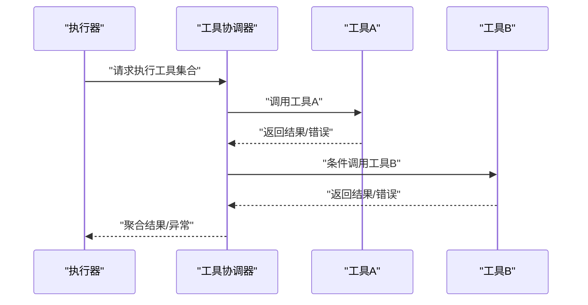
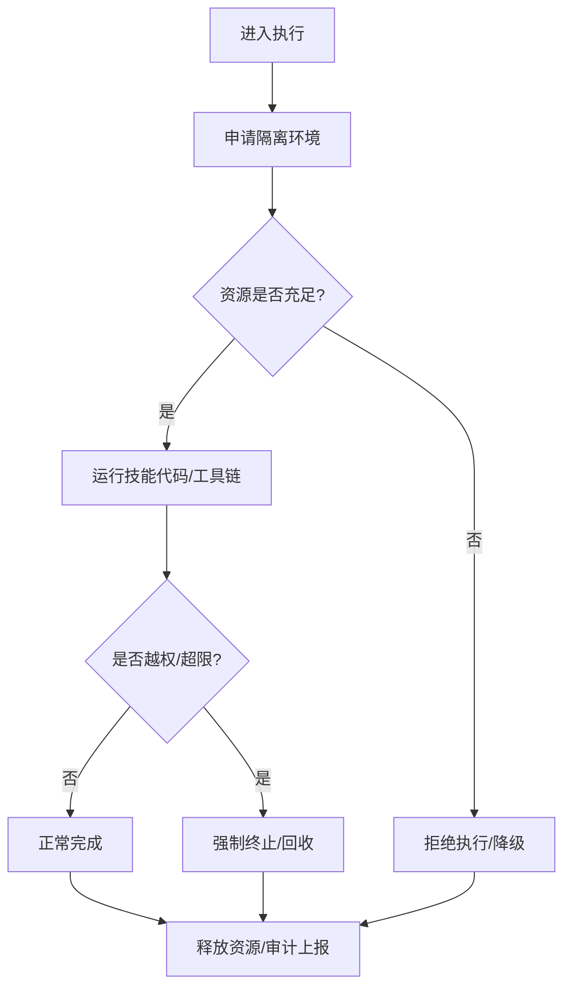
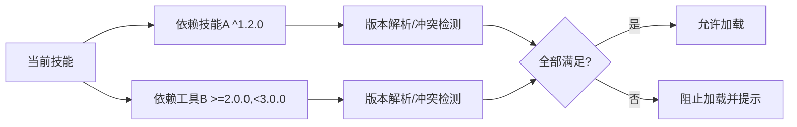
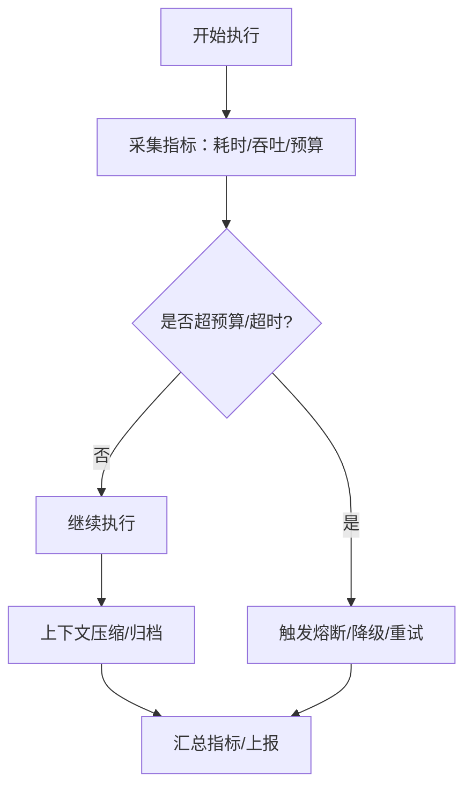

# 技能架构设计

<cite>
**本文引用的文件**   
- [engine/skills/code-review/SKILL.md](file://engine/skills/code-review/SKILL.md)
- [engine/skills/code-review/skill.json](file://engine/skills/code-review/skill.json)
- [engine/skills/debugging/SKILL.md](file://engine/skills/debugging/SKILL.md)
- [engine/skills/debugging/skill.json](file://engine/skills/debugging/skill.json)
- [engine/skills/tdd/SKILL.md](file://engine/skills/tdd/SKILL.md)
- [engine/skills/tdd/skill.json](file://engine/skills/tdd/skill.json)
- [engine/tests/builtin-skills.test.ts](file://engine/tests/builtin-skills.test.ts)
- [engine/tests/skill-runtime.test.ts](file://engine/tests/skill-runtime.test.ts)
- [engine/tests/skill-command-registry.test.ts](file://engine/tests/skill-command-registry.test.ts)
- [engine/tests/tool-coordinator-runtime.test.ts](file://engine/tests/tool-coordinator-runtime.test.ts)
- [engine/tests/runtime-kernel-isolation.test.ts](file://engine/tests/runtime-kernel-isolation.test.ts)
- [engine/tests/loop-runner.test.ts](file://engine/tests/loop-runner.test.ts)
- [engine/tests/execution-graph.test.ts](file://engine/tests/execution-graph.test.ts)
- [engine/tests/tool-dispatch-errors.test.ts](file://engine/tests/tool-dispatch-errors.test.ts)
- [engine/tests/tool-result-budget.test.ts](file://engine/tests/tool-result-budget.test.ts)
- [engine/tests/compaction-governor.test.ts](file://engine/tests/compaction-governor.test.ts)
- [engine/tests/marketplace.test.ts](file://engine/tests/marketplace.test.ts)
- [engine/tests/provider-compatibility.test.ts](file://engine/tests/provider-compatibility.test.ts)
</cite>

## 目录
1. [简介](#简介)
2. [项目结构](#项目结构)
3. [核心组件](#核心组件)
4. [架构总览](#架构总览)
5. [详细组件分析](#详细组件分析)
6. [依赖关系与版本兼容](#依赖关系与版本兼容)
7. [安全沙箱与资源限制](#安全沙箱与资源限制)
8. [性能监控与错误处理](#性能监控与错误处理)
9. [故障排查指南](#故障排查指南)
10. [结论](#结论)
11. [附录：技能定义格式规范](#附录技能定义格式规范)

## 简介
本文件面向KCoder的技能系统，系统性阐述技能的定义、生命周期、执行环境隔离、核心组件（描述符、执行器、上下文管理器、工具协调器）、依赖管理与版本兼容性、安全沙箱与资源限制、以及性能监控与错误处理。文档以仓库中的内置技能与测试用例为依据，提供架构图与数据流图，帮助读者快速理解并扩展技能体系。

## 项目结构
KCoder引擎将“技能”作为一等公民进行编排。每个技能由一组声明式文件组成，并通过运行时加载、初始化、执行与清理。关键位置如下：
- 内置技能目录：engine/skills/<skill-name>/SKILL.md 与 skill.json
- 技能相关测试：engine/tests/*-skill*.test.ts、tool-*-runtime.test.ts、*isolation*.test.ts 等

图表来源
- [engine/tests/skill-runtime.test.ts](file://engine/tests/skill-runtime.test.ts)
- [engine/tests/skill-command-registry.test.ts](file://engine/tests/skill-command-registry.test.ts)
- [engine/tests/tool-coordinator-runtime.test.ts](file://engine/tests/tool-coordinator-runtime.test.ts)
- [engine/tests/runtime-kernel-isolation.test.ts](file://engine/tests/runtime-kernel-isolation.test.ts)

章节来源
- [engine/tests/builtin-skills.test.ts](file://engine/tests/builtin-skills.test.ts)
- [engine/tests/skill-runtime.test.ts](file://engine/tests/skill-runtime.test.ts)
- [engine/tests/skill-command-registry.test.ts](file://engine/tests/skill-command-registry.test.ts)
- [engine/tests/tool-coordinator-runtime.test.ts](file://engine/tests/tool-coordinator-runtime.test.ts)
- [engine/tests/runtime-kernel-isolation.test.ts](file://engine/tests/runtime-kernel-isolation.test.ts)

## 核心组件
- 技能描述符（Descriptor）
  - 职责：承载技能的元信息、能力声明、参数契约、依赖与版本约束、入口与工具映射等。
  - 来源：来自每个技能的 skill.json 与 SKILL.md 的解析结果。
- 执行器（Executor）
  - 职责：负责加载、初始化、执行与清理；驱动循环执行与状态推进。
  - 来源：通过技能运行时与命令注册表协同工作。
- 上下文管理器（Context Manager）
  - 职责：维护任务级/会话级上下文、变量与作用域、持久化快照与恢复。
- 工具协调器（Tool Coordinator）
  - 职责：统一调度工具调用、结果聚合、预算与配额控制、错误修复与重试。
- 隔离内核（Isolation Kernel）
  - 职责：为技能执行提供进程/线程级或容器级隔离、资源限制与权限裁剪。

章节来源
- [engine/tests/skill-runtime.test.ts](file://engine/tests/skill-runtime.test.ts)
- [engine/tests/skill-command-registry.test.ts](file://engine/tests/skill-command-registry.test.ts)
- [engine/tests/tool-coordinator-runtime.test.ts](file://engine/tests/tool-coordinator-runtime.test.ts)
- [engine/tests/runtime-kernel-isolation.test.ts](file://engine/tests/runtime-kernel-isolation.test.ts)

## 架构总览
下图展示从“技能包”到“执行内核”的整体交互：

图表来源
- [engine/tests/skill-runtime.test.ts](file://engine/tests/skill-runtime.test.ts)
- [engine/tests/tool-coordinator-runtime.test.ts](file://engine/tests/tool-coordinator-runtime.test.ts)
- [engine/tests/runtime-kernel-isolation.test.ts](file://engine/tests/runtime-kernel-isolation.test.ts)

## 详细组件分析

### 技能描述符与定义格式
- 定义位置
  - 每个技能包含 SKILL.md 与 skill.json，前者用于人类可读说明与行为约定，后者用于机器可解析的结构化元数据。
- 关键字段（示例参考路径）
  - 名称、版本、描述、作者、许可证
  - 能力声明（capabilities）、输入输出契约（schema）
  - 依赖列表（dependencies）、版本范围（version ranges）
  - 入口点（entry）、工具映射（tools）、环境变量与配置项
- 校验与合并
  - 加载时进行字段完整性校验、类型校验与语义校验（如必填字段、枚举值、依赖版本范围）。
  - 多源合并策略：默认值、覆盖规则与冲突检测。

章节来源
- [engine/skills/code-review/SKILL.md](file://engine/skills/code-review/SKILL.md)
- [engine/skills/code-review/skill.json](file://engine/skills/code-review/skill.json)
- [engine/skills/debugging/SKILL.md](file://engine/skills/debugging/SKILL.md)
- [engine/skills/debugging/skill.json](file://engine/skills/debugging/skill.json)
- [engine/skills/tdd/SKILL.md](file://engine/skills/tdd/SKILL.md)
- [engine/skills/tdd/skill.json](file://engine/skills/tdd/skill.json)

### 生命周期管理
- 阶段划分
  - 加载：扫描目录、解析 SKILL.md 与 skill.json、构建描述符
  - 初始化：校验依赖、准备上下文、预热工具、申请隔离资源
  - 执行：按步骤/循环执行，驱动工具协调器，更新上下文
  - 清理：释放资源、持久化中间态、记录审计日志
- 状态推进
  - 基于事件与状态机推进，支持中断、恢复与重放。

图表来源
- [engine/tests/skill-runtime.test.ts](file://engine/tests/skill-runtime.test.ts)
- [engine/tests/loop-runner.test.ts](file://engine/tests/loop-runner.test.ts)
- [engine/tests/execution-graph.test.ts](file://engine/tests/execution-graph.test.ts)

章节来源
- [engine/tests/skill-runtime.test.ts](file://engine/tests/skill-runtime.test.ts)
- [engine/tests/loop-runner.test.ts](file://engine/tests/loop-runner.test.ts)
- [engine/tests/execution-graph.test.ts](file://engine/tests/execution-graph.test.ts)

### 执行器与命令注册表
- 执行器
  - 负责生命周期编排、错误边界、超时与重试、指标采集。
- 命令注册表
  - 将技能暴露的命令/动作注册到全局命名空间，供上层路由与UI触发。

图表来源
- [engine/tests/skill-command-registry.test.ts](file://engine/tests/skill-command-registry.test.ts)
- [engine/tests/skill-runtime.test.ts](file://engine/tests/skill-runtime.test.ts)

章节来源
- [engine/tests/skill-command-registry.test.ts](file://engine/tests/skill-command-registry.test.ts)
- [engine/tests/skill-runtime.test.ts](file://engine/tests/skill-runtime.test.ts)

### 上下文管理器
- 作用域与可见性
  - 任务级/会话级/技能级作用域，变量注入与遮蔽规则。
- 持久化与恢复
  - 中间状态落盘、断点续跑、回放一致性。
- 变更追踪
  - 对上下文变更进行审计与快照对比。

图表来源
- [engine/tests/skill-runtime.test.ts](file://engine/tests/skill-runtime.test.ts)

章节来源
- [engine/tests/skill-runtime.test.ts](file://engine/tests/skill-runtime.test.ts)

### 工具协调器
- 工具发现与绑定
  - 依据描述符的工具映射，动态绑定可用工具集。
- 调度与编排
  - 串行/并行调用、幂等与去重、熔断与退避。
- 结果与预算治理
  - 结果大小限制、令牌/费用预算、配额与告警。
- 错误修复与重试
  - 自动修复常见错误、重试策略与降级路径。

图表来源
- [engine/tests/tool-coordinator-runtime.test.ts](file://engine/tests/tool-coordinator-runtime.test.ts)
- [engine/tests/tool-dispatch-errors.test.ts](file://engine/tests/tool-dispatch-errors.test.ts)
- [engine/tests/tool-result-budget.test.ts](file://engine/tests/tool-result-budget.test.ts)

章节来源
- [engine/tests/tool-coordinator-runtime.test.ts](file://engine/tests/tool-coordinator-runtime.test.ts)
- [engine/tests/tool-dispatch-errors.test.ts](file://engine/tests/tool-dispatch-errors.test.ts)
- [engine/tests/tool-result-budget.test.ts](file://engine/tests/tool-result-budget.test.ts)

### 隔离内核与安全沙箱
- 隔离维度
  - 进程/线程/容器级隔离，文件系统只读挂载、网络访问白名单、系统调用裁剪。
- 资源限制
  - CPU/内存/IO/时间上限，超限熔断与优雅退出。
- 权限模型
  - 最小权限原则，按需授权与动态撤销。

图表来源
- [engine/tests/runtime-kernel-isolation.test.ts](file://engine/tests/runtime-kernel-isolation.test.ts)

章节来源
- [engine/tests/runtime-kernel-isolation.test.ts](file://engine/tests/runtime-kernel-isolation.test.ts)

## 依赖关系与版本兼容
- 依赖声明
  - 在 skill.json 中声明对其他技能、工具或外部能力的依赖及版本范围。
- 解析与校验
  - 加载期解析依赖树，计算满足的版本区间，检测冲突与环依赖。
- 市场与分发
  - 通过市场机制发布、检索与安装技能，附带签名与校验。
- 提供者兼容
  - 针对底层模型/工具提供者的能力矩阵与兼容性检查。

图表来源
- [engine/tests/marketplace.test.ts](file://engine/tests/marketplace.test.ts)
- [engine/tests/provider-compatibility.test.ts](file://engine/tests/provider-compatibility.test.ts)

章节来源
- [engine/tests/marketplace.test.ts](file://engine/tests/marketplace.test.ts)
- [engine/tests/provider-compatibility.test.ts](file://engine/tests/provider-compatibility.test.ts)

## 安全沙箱与资源限制
- 沙箱策略
  - 默认拒绝所有系统调用，仅开放必要API；文件与网络访问需显式授权。
- 资源配额
  - 单技能CPU/内存/IO/时长上限；跨技能共享配额与抢占策略。
- 审计与取证
  - 全链路审计日志、操作轨迹与快照留存，便于事后追溯。

章节来源
- [engine/tests/runtime-kernel-isolation.test.ts](file://engine/tests/runtime-kernel-isolation.test.ts)

## 性能监控与错误处理
- 指标采集
  - 启动耗时、执行步数、工具调用延迟、结果大小、预算消耗、失败率。
- 压缩与治理
  - 长上下文压缩策略、窗口滑动与摘要生成，降低后续成本。
- 错误分类与自愈
  - 区分网络/权限/参数/业务错误；自动重试、降级与补偿。
- 观测与告警
  - 结构化日志、分布式追踪与阈值告警。

图表来源
- [engine/tests/compaction-governor.test.ts](file://engine/tests/compaction-governor.test.ts)
- [engine/tests/tool-result-budget.test.ts](file://engine/tests/tool-result-budget.test.ts)

章节来源
- [engine/tests/compaction-governor.test.ts](file://engine/tests/compaction-governor.test.ts)
- [engine/tests/tool-result-budget.test.ts](file://engine/tests/tool-result-budget.test.ts)

## 故障排查指南
- 常见问题定位
  - 描述符解析失败：检查 SKILL.md 与 skill.json 字段完整性与类型。
  - 依赖不满足：查看版本范围与冲突报告，调整依赖声明。
  - 工具调用失败：核对工具权限、网络可达性与参数契约。
  - 资源超限：检查CPU/内存/IO/时长配额，优化算法或拆分任务。
- 诊断手段
  - 启用详细日志与追踪；导出快照与审计日志；复现最小用例。
- 恢复策略
  - 利用快照恢复；回滚到稳定版本；启用降级模式。

章节来源
- [engine/tests/builtin-skills.test.ts](file://engine/tests/builtin-skills.test.ts)
- [engine/tests/tool-dispatch-errors.test.ts](file://engine/tests/tool-dispatch-errors.test.ts)

## 结论
KCoder 的技能架构以“描述符驱动+执行器编排+工具协调+隔离沙箱”为核心，形成高内聚、低耦合的可插拔体系。通过严格的依赖与版本管理、完善的资源限制与审计、以及健壮的监控与错误处理，技能可在复杂环境中安全、稳定、高效地运行。建议在新技能开发中遵循既定定义格式与最佳实践，充分利用上下文与工具生态，持续提升交付质量与可维护性。

## 附录：技能定义格式规范
- 文件清单
  - SKILL.md：人类可读说明、行为约定、使用示例与注意事项。
  - skill.json：机器可读元数据，包含名称、版本、能力、依赖、入口、工具映射、参数契约等。
- 推荐字段
  - 标识：id、name、version、description
  - 能力：capabilities、permissions、env
  - 依赖：dependencies（含版本范围）
  - 入口：entry、steps、loops
  - 工具：tools（映射至实现）
  - 契约：input/output schema、错误码
- 校验流程
  - 语法校验 → 语义校验 → 依赖解析 → 兼容性检查 → 加载成功

章节来源
- [engine/skills/code-review/SKILL.md](file://engine/skills/code-review/SKILL.md)
- [engine/skills/code-review/skill.json](file://engine/skills/code-review/skill.json)
- [engine/skills/debugging/SKILL.md](file://engine/skills/debugging/SKILL.md)
- [engine/skills/debugging/skill.json](file://engine/skills/debugging/skill.json)
- [engine/skills/tdd/SKILL.md](file://engine/skills/tdd/SKILL.md)
- [engine/skills/tdd/skill.json](file://engine/skills/tdd/skill.json)