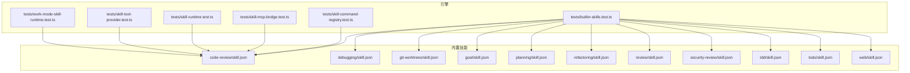
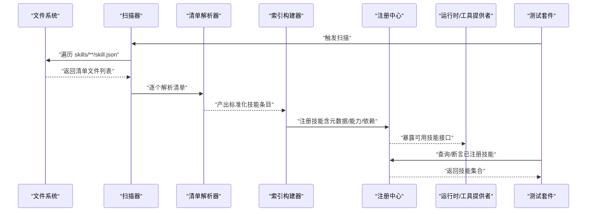
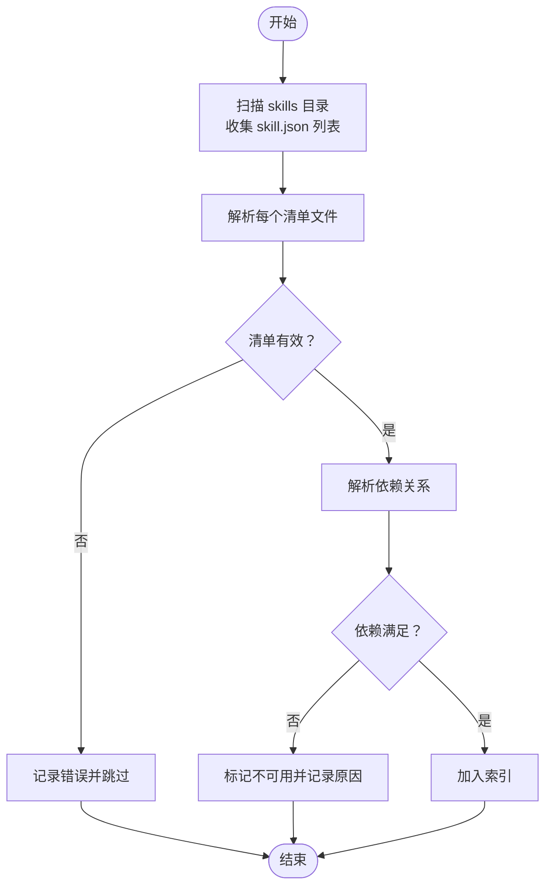
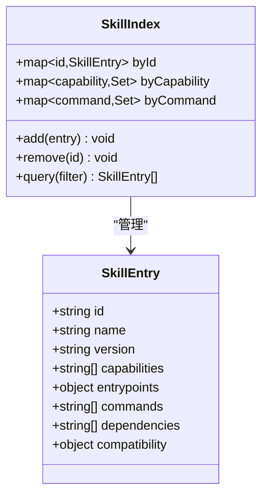
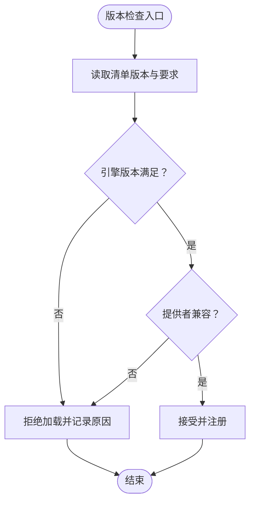
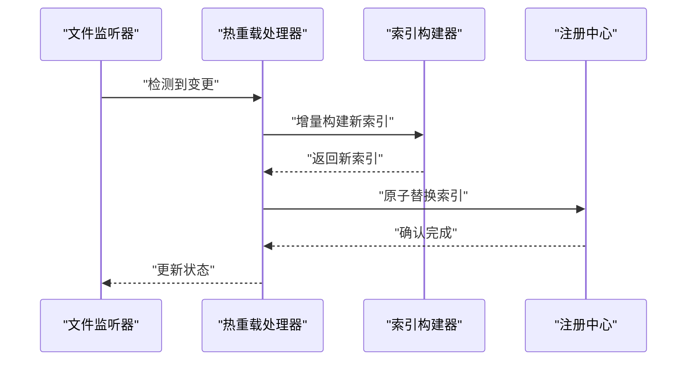
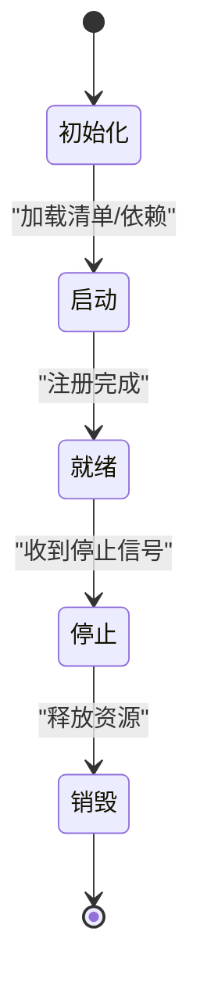
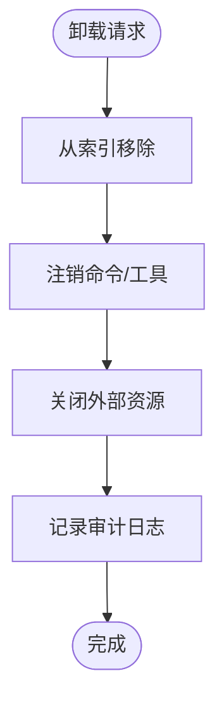
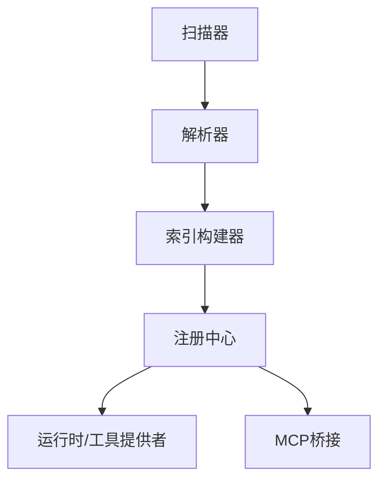

# 技能注册与发现

<cite>
**本文引用的文件**   
- [engine/skills/code-review/skill.json](file://engine/skills/code-review/skill.json)
- [engine/skills/debugging/skill.json](file://engine/skills/debugging/skill.json)
- [engine/skills/git-worktrees/skill.json](file://engine/skills/git-worktrees/skill.json)
- [engine/skills/goal/skill.json](file://engine/skills/goal/skill.json)
- [engine/skills/planning/skill.json](file://engine/skills/planning/skill.json)
- [engine/skills/refactoring/skill.json](file://engine/skills/refactoring/skill.json)
- [engine/skills/review/skill.json](file://engine/skills/review/skill.json)
- [engine/skills/security-review/skill.json](file://engine/skills/security-review/skill.json)
- [engine/skills/tdd/skill.json](file://engine/skills/tdd/skill.json)
- [engine/skills/todo/skill.json](file://engine/skills/todo/skill.json)
- [engine/skills/web/skill.json](file://engine/skills/web/skill.json)
- [engine/tests/builtin-skills.test.ts](file://engine/tests/builtin-skills.test.ts)
- [engine/tests/skill-command-registry.test.ts](file://engine/tests/skill-command-registry.test.ts)
- [engine/tests/skill-mcp-bridge.test.ts](file://engine/tests/skill-mcp-bridge.test.ts)
- [engine/tests/skill-runtime.test.ts](file://engine/tests/skill-runtime.test.ts)
- [engine/tests/skill-tool-provider.test.ts](file://engine/tests/skill-tool-provider.test.ts)
- [engine/tests/work-mode-skill-runtime.test.ts](file://engine/tests/work-mode-skill-runtime.test.ts)
</cite>

## 目录
1. [简介](#简介)
2. [项目结构](#项目结构)
3. [核心组件](#核心组件)
4. [架构总览](#架构总览)
5. [详细组件分析](#详细组件分析)
6. [依赖分析](#依赖分析)
7. [性能考虑](#性能考虑)
8. [故障排查指南](#故障排查指南)
9. [结论](#结论)
10. [附录](#附录)

## 简介
本文件聚焦于KCoder引擎中的“技能注册与发现”机制，围绕以下主题展开：
- 技能注册中心的设计模式与实现原理
- 技能的动态加载（文件系统扫描、配置文件解析、依赖关系解析）
- 技能发现算法与索引构建过程
- 版本管理与兼容性检查
- 热重载与热更新
- 生命周期钩子与事件系统
- 卸载与资源清理
- 注册API与配置示例
- 性能优化策略与缓存机制

说明：由于当前仓库未提供完整的运行时实现源码，本文基于内置技能清单与测试用例进行归纳与推断，旨在为后续实现与集成提供参考蓝图。

## 项目结构
与技能相关的静态资产位于 engine/skills 目录下，每个技能包含一个描述性文档与一个结构化清单（skill.json）。测试覆盖了对内置技能、命令注册、MCP桥接、运行时行为等关键路径的验证。

图表来源
- [engine/tests/builtin-skills.test.ts](file://engine/tests/builtin-skills.test.ts)
- [engine/tests/skill-command-registry.test.ts](file://engine/tests/skill-command-registry.test.ts)
- [engine/tests/skill-mcp-bridge.test.ts](file://engine/tests/skill-mcp-bridge.test.ts)
- [engine/tests/skill-runtime.test.ts](file://engine/tests/skill-runtime.test.ts)
- [engine/tests/skill-tool-provider.test.ts](file://engine/tests/skill-tool-provider.test.ts)
- [engine/tests/work-mode-skill-runtime.test.ts](file://engine/tests/work-mode-skill-runtime.test.ts)
- [engine/skills/code-review/skill.json](file://engine/skills/code-review/skill.json)
- [engine/skills/debugging/skill.json](file://engine/skills/debugging/skill.json)
- [engine/skills/git-worktrees/skill.json](file://engine/skills/git-worktrees/skill.json)
- [engine/skills/goal/skill.json](file://engine/skills/goal/skill.json)
- [engine/skills/planning/skill.json](file://engine/skills/planning/skill.json)
- [engine/skills/refactoring/skill.json](file://engine/skills/refactoring/skill.json)
- [engine/skills/review/skill.json](file://engine/skills/review/skill.json)
- [engine/skills/security-review/skill.json](file://engine/skills/security-review/skill.json)
- [engine/skills/tdd/skill.json](file://engine/skills/tdd/skill.json)
- [engine/skills/todo/skill.json](file://engine/skills/todo/skill.json)
- [engine/skills/web/skill.json](file://engine/skills/web/skill.json)

章节来源
- [engine/tests/builtin-skills.test.ts](file://engine/tests/builtin-skills.test.ts)
- [engine/tests/skill-command-registry.test.ts](file://engine/tests/skill-command-registry.test.ts)
- [engine/tests/skill-mcp-bridge.test.ts](file://engine/tests/skill-mcp-bridge.test.ts)
- [engine/tests/skill-runtime.test.ts](file://engine/tests/skill-runtime.test.ts)
- [engine/tests/skill-tool-provider.test.ts](file://engine/tests/skill-tool-provider.test.ts)
- [engine/tests/work-mode-skill-runtime.test.ts](file://engine/tests/work-mode-skill-runtime.test.ts)
- [engine/skills/code-review/skill.json](file://engine/skills/code-review/skill.json)
- [engine/skills/debugging/skill.json](file://engine/skills/debugging/skill.json)
- [engine/skills/git-worktrees/skill.json](file://engine/skills/git-worktrees/skill.json)
- [engine/skills/goal/skill.json](file://engine/skills/goal/skill.json)
- [engine/skills/planning/skill.json](file://engine/skills/planning/skill.json)
- [engine/skills/refactoring/skill.json](file://engine/skills/refactoring/skill.json)
- [engine/skills/review/skill.json](file://engine/skills/review/skill.json)
- [engine/skills/security-review/skill.json](file://engine/skills/security-review/skill.json)
- [engine/skills/tdd/skill.json](file://engine/skills/tdd/skill.json)
- [engine/skills/todo/skill.json](file://engine/skills/todo/skill.json)
- [engine/skills/web/skill.json](file://engine/skills/web/skill.json)

## 核心组件
- 技能清单（skill.json）：定义技能的元数据、能力、入口、依赖、版本与兼容性约束等。
- 内置技能集合：以目录形式组织，便于扫描与加载。
- 测试套件：覆盖内置技能发现、命令注册、MCP桥接、运行时行为与工作模式适配。

章节来源
- [engine/skills/code-review/skill.json](file://engine/skills/code-review/skill.json)
- [engine/skills/debugging/skill.json](file://engine/skills/debugging/skill.json)
- [engine/skills/git-worktrees/skill.json](file://engine/skills/git-worktrees/skill.json)
- [engine/skills/goal/skill.json](file://engine/skills/goal/skill.json)
- [engine/skills/planning/skill.json](file://engine/skills/planning/skill.json)
- [engine/skills/refactoring/skill.json](file://engine/skills/refactoring/skill.json)
- [engine/skills/review/skill.json](file://engine/skills/review/skill.json)
- [engine/skills/security-review/skill.json](file://engine/skills/security-review/skill.json)
- [engine/skills/tdd/skill.json](file://engine/skills/tdd/skill.json)
- [engine/skills/todo/skill.json](file://engine/skills/todo/skill.json)
- [engine/skills/web/skill.json](file://engine/skills/web/skill.json)
- [engine/tests/builtin-skills.test.ts](file://engine/tests/builtin-skills.test.ts)
- [engine/tests/skill-command-registry.test.ts](file://engine/tests/skill-command-registry.test.ts)
- [engine/tests/skill-mcp-bridge.test.ts](file://engine/tests/skill-mcp-bridge.test.ts)
- [engine/tests/skill-runtime.test.ts](file://engine/tests/skill-runtime.test.ts)
- [engine/tests/skill-tool-provider.test.ts](file://engine/tests/skill-tool-provider.test.ts)
- [engine/tests/work-mode-skill-runtime.test.ts](file://engine/tests/work-mode-skill-runtime.test.ts)

## 架构总览
下图展示了从“文件系统扫描”到“索引构建”，再到“运行时发现与调用”的整体流程。该流程由测试用例驱动，确保内置技能可被发现、注册并参与运行。

图表来源
- [engine/tests/builtin-skills.test.ts](file://engine/tests/builtin-skills.test.ts)
- [engine/tests/skill-command-registry.test.ts](file://engine/tests/skill-command-registry.test.ts)
- [engine/tests/skill-mcp-bridge.test.ts](file://engine/tests/skill-mcp-bridge.test.ts)
- [engine/tests/skill-runtime.test.ts](file://engine/tests/skill-runtime.test.ts)
- [engine/tests/skill-tool-provider.test.ts](file://engine/tests/skill-tool-provider.test.ts)
- [engine/tests/work-mode-skill-runtime.test.ts](file://engine/tests/work-mode-skill-runtime.test.ts)

## 详细组件分析

### 技能清单模型与字段约定
- 目的：统一描述技能的身份、能力、入口、依赖、版本与兼容性等信息，作为扫描与注册的数据源。
- 建议字段（结合现有清单文件与测试关注点归纳）：
  - 标识与版本：id、name、version、description
  - 能力与入口：capabilities、entrypoints、commands/tools
  - 依赖与约束：dependencies、compatibility、required_engine_version
  - 资源与路径：assets、scripts、config_schema
  - 生命周期与事件：hooks、events
- 校验与兼容：在解析阶段进行必填项校验、类型校验与语义校验；在注册阶段进行版本与兼容性检查。

章节来源
- [engine/skills/code-review/skill.json](file://engine/skills/code-review/skill.json)
- [engine/skills/debugging/skill.json](file://engine/skills/debugging/skill.json)
- [engine/skills/git-worktrees/skill.json](file://engine/skills/git-worktrees/skill.json)
- [engine/skills/goal/skill.json](file://engine/skills/goal/skill.json)
- [engine/skills/planning/skill.json](file://engine/skills/planning/skill.json)
- [engine/skills/refactoring/skill.json](file://engine/skills/refactoring/skill.json)
- [engine/skills/review/skill.json](file://engine/skills/review/skill.json)
- [engine/skills/security-review/skill.json](file://engine/skills/security-review/skill.json)
- [engine/skills/tdd/skill.json](file://engine/skills/tdd/skill.json)
- [engine/skills/todo/skill.json](file://engine/skills/todo/skill.json)
- [engine/skills/web/skill.json](file://engine/skills/web/skill.json)

### 动态加载机制（扫描、解析、依赖）
- 文件系统扫描：递归遍历 engine/skills 目录，收集所有 skill.json 文件。
- 配置文件解析：读取并解析清单，生成标准化的内部表示。
- 依赖关系解析：根据 dependencies 字段构建依赖图，检测循环依赖与缺失依赖。
- 错误处理：对无效清单、缺失依赖、不兼容版本进行明确报错与回滚。

图表来源
- [engine/tests/builtin-skills.test.ts](file://engine/tests/builtin-skills.test.ts)

章节来源
- [engine/tests/builtin-skills.test.ts](file://engine/tests/builtin-skills.test.ts)

### 技能发现算法与索引构建
- 发现算法：基于清单文件的增量发现，支持按标签/能力过滤。
- 索引构建：将标准化后的技能条目写入内存索引，并提供快速查询接口（按ID、能力、命令名等）。
- 一致性保证：在并发场景下使用锁或不可变快照，避免竞态条件。

图表来源
- [engine/tests/builtin-skills.test.ts](file://engine/tests/builtin-skills.test.ts)
- [engine/tests/skill-command-registry.test.ts](file://engine/tests/skill-command-registry.test.ts)

章节来源
- [engine/tests/builtin-skills.test.ts](file://engine/tests/builtin-skills.test.ts)
- [engine/tests/skill-command-registry.test.ts](file://engine/tests/skill-command-registry.test.ts)

### 版本管理与兼容性检查
- 版本策略：采用语义化版本（主/次/修订），用于向后兼容与破坏性变更控制。
- 兼容性矩阵：声明 required_engine_version 与 provider 兼容范围，在注册时进行匹配。
- 冲突解决：当存在多版本时，优先选择最高兼容版本，并记录弃用警告。

图表来源
- [engine/tests/provider-compatibility.test.ts](file://engine/tests/provider-compatibility.test.ts)

章节来源
- [engine/tests/provider-compatibility.test.ts](file://engine/tests/provider-compatibility.test.ts)

### 热重载与热更新
- 触发方式：监听文件系统变更或收到外部信号后触发重新扫描。
- 增量更新：仅对变更的技能执行解析与差异合并，最小化开销。
- 安全切换：在后台构建新索引，完成后原子替换旧索引，避免运行时不一致。
- 回滚策略：若新索引校验失败，保持旧索引不变并记录错误。

图表来源
- [engine/tests/builtin-skills.test.ts](file://engine/tests/builtin-skills.test.ts)

章节来源
- [engine/tests/builtin-skills.test.ts](file://engine/tests/builtin-skills.test.ts)

### 生命周期钩子与事件系统
- 生命周期阶段：初始化、启动、就绪、停止、销毁。
- 钩子扩展：允许在特定阶段注入自定义逻辑（如资源准备、上下文注入）。
- 事件总线：发布/订阅模型，用于跨模块通信（如技能安装、卸载、更新、错误）。

图表来源
- [engine/tests/skill-runtime.test.ts](file://engine/tests/skill-runtime.test.ts)
- [engine/tests/work-mode-skill-runtime.test.ts](file://engine/tests/work-mode-skill-runtime.test.ts)

章节来源
- [engine/tests/skill-runtime.test.ts](file://engine/tests/skill-runtime.test.ts)
- [engine/tests/work-mode-skill-runtime.test.ts](file://engine/tests/work-mode-skill-runtime.test.ts)

### 卸载与资源清理
- 卸载流程：从索引移除、注销命令/工具、关闭外部连接、释放文件句柄与内存。
- 幂等性：重复卸载应安全无副作用。
- 审计日志：记录卸载原因、时间戳与影响范围。

图表来源
- [engine/tests/skill-command-registry.test.ts](file://engine/tests/skill-command-registry.test.ts)

章节来源
- [engine/tests/skill-command-registry.test.ts](file://engine/tests/skill-command-registry.test.ts)

### API 接口与配置示例
- 注册API（概念性）：
  - register(skillManifest): 注册单个技能清单
  - unregister(skillId): 卸载指定技能
  - query(filter): 按条件查询技能
  - rebuild(): 重建索引（全量）
- 配置示例（概念性）：
  - 启用内置技能目录
  - 设置扫描间隔与热重载开关
  - 配置兼容性策略与日志级别

章节来源
- [engine/tests/skill-command-registry.test.ts](file://engine/tests/skill-command-registry.test.ts)
- [engine/tests/skill-mcp-bridge.test.ts](file://engine/tests/skill-mcp-bridge.test.ts)

## 依赖分析
- 组件耦合：
  - 扫描器与解析器低耦合，通过标准化中间表示对接索引构建器。
  - 注册中心对外暴露稳定接口，屏蔽底层索引细节。
- 外部依赖：
  - 文件系统I/O、JSON解析、事件总线、可选的外部工具提供者（MCP）。
- 潜在风险：
  - 大目录扫描的性能瓶颈
  - 并发修改导致的索引不一致
  - 第三方依赖版本漂移

图表来源
- [engine/tests/skill-mcp-bridge.test.ts](file://engine/tests/skill-mcp-bridge.test.ts)
- [engine/tests/skill-tool-provider.test.ts](file://engine/tests/skill-tool-provider.test.ts)

章节来源
- [engine/tests/skill-mcp-bridge.test.ts](file://engine/tests/skill-mcp-bridge.test.ts)
- [engine/tests/skill-tool-provider.test.ts](file://engine/tests/skill-tool-provider.test.ts)

## 性能考虑
- 扫描优化：
  - 增量扫描：仅监听变更目录，减少全量遍历。
  - 并行解析：对多个清单文件并行解析，注意限制并发度以避免IO风暴。
- 索引优化：
  - 多键索引：按能力、命令名建立倒排索引，提升查询效率。
  - 不可变快照：原子替换索引，避免读放大。
- 缓存策略：
  - 清单缓存：对已解析的清单进行持久化缓存，缩短冷启动时间。
  - 结果缓存：对高频查询结果进行短期缓存。
- 资源控制：
  - 超时与熔断：对异常清单或外部依赖调用设置超时与熔断。
  - 内存上限：对索引大小进行限制，必要时淘汰低频技能。

[本节为通用指导，无需具体文件引用]

## 故障排查指南
- 常见问题：
  - 清单格式错误：检查必填字段与类型，查看解析错误日志。
  - 依赖缺失：确认依赖清单与实际环境一致。
  - 版本不兼容：核对 required_engine_version 与当前引擎版本。
  - 热重载失败：检查文件监听权限与增量构建日志。
- 定位方法：
  - 启用调试日志，输出扫描与解析步骤详情。
  - 使用测试用例复现问题，逐步缩小范围。
  - 隔离第三方依赖，验证是否为外部因素导致。

章节来源
- [engine/tests/builtin-skills.test.ts](file://engine/tests/builtin-skills.test.ts)
- [engine/tests/skill-runtime.test.ts](file://engine/tests/skill-runtime.test.ts)

## 结论
通过对内置技能清单与测试用例的分析，可以形成一套稳健的技能注册与发现体系：以清单为中心、以索引为枢纽、以注册表为出口，配合热重载、生命周期钩子与事件系统，实现高内聚、低耦合、可扩展的技能生态。建议在后续实现中强化并发安全、性能监控与可观测性，确保在生产环境的稳定性与可维护性。

[本节为总结性内容，无需具体文件引用]

## 附录
- 术语表：
  - 技能：具备独立能力与生命周期的功能单元
  - 清单：描述技能元数据与约束的结构化文件
  - 索引：用于快速发现与查询的技能集合
  - 注册中心：对外暴露技能注册与查询能力的服务
- 参考测试：
  - 内置技能发现与断言
  - 命令注册与查询
  - MCP桥接与工具提供者
  - 运行时行为与工作模式适配

章节来源
- [engine/tests/builtin-skills.test.ts](file://engine/tests/builtin-skills.test.ts)
- [engine/tests/skill-command-registry.test.ts](file://engine/tests/skill-command-registry.test.ts)
- [engine/tests/skill-mcp-bridge.test.ts](file://engine/tests/skill-mcp-bridge.test.ts)
- [engine/tests/skill-runtime.test.ts](file://engine/tests/skill-runtime.test.ts)
- [engine/tests/skill-tool-provider.test.ts](file://engine/tests/skill-tool-provider.test.ts)
- [engine/tests/work-mode-skill-runtime.test.ts](file://engine/tests/work-mode-skill-runtime.test.ts)