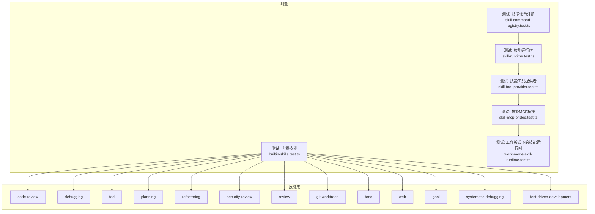
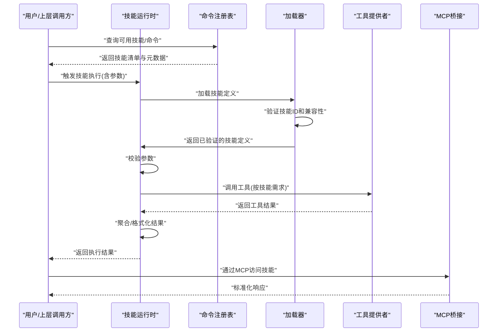
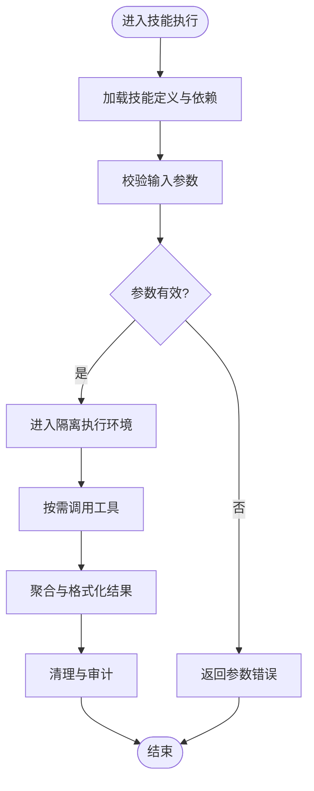
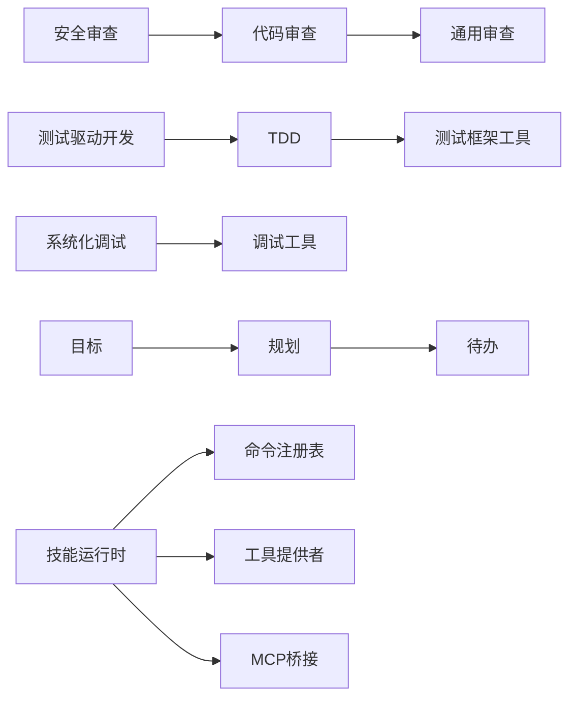

# 技能系统

<cite>
**本文引用的文件**   
- [engine/skills/code-review/SKILL.md](file://engine/skills/code-review/SKILL.md)
- [engine/skills/code-review/skill.json](file://engine/skills/code-review/skill.json)
- [engine/skills/debugging/SKILL.md](file://engine/skills/debugging/SKILL.md)
- [engine/skills/debugging/skill.json](file://engine/skills/debugging/skill.json)
- [engine/skills/tdd/SKILL.md](file://engine/skills/tdd/SKILL.md)
- [engine/skills/tdd/skill.json](file://engine/skills/tdd/skill.json)
- [engine/skills/systematic-debugging/SKILL.md](file://engine/skills/systematic-debugging/SKILL.md)
- [engine/skills/systematic-debugging/skill.json](file://engine/skills/systematic-debugging/skill.json)
- [engine/skills/test-driven-development/SKILL.md](file://engine/skills/test-driven-development/SKILL.md)
- [engine/skills/test-driven-development/skill.json](file://engine/skills/test-driven-development/skill.json)
- [engine/skills/planning/SKILL.md](file://engine/skills/planning/SKILL.md)
- [engine/skills/planning/skill.json](file://engine/skills/planning/skill.json)
- [engine/skills/refactoring/SKILL.md](file://engine/skills/refactoring/SKILL.md)
- [engine/skills/refactoring/skill.json](file://engine/skills/refactoring/skill.json)
- [engine/skills/security-review/SKILL.md](file://engine/skills/security-review/SKILL.md)
- [engine/skills/security-review/skill.json](file://engine/skills/security-review/skill.json)
- [engine/skills/review/SKILL.md](file://engine/skills/review/SKILL.md)
- [engine/skills/review/skill.json](file://engine/skills/review/skill.json)
- [engine/skills/git-worktrees/SKILL.md](file://engine/skills/git-worktrees/SKILL.md)
- [engine/skills/git-worktrees/skill.json](file://engine/skills/git-worktrees/skill.json)
- [engine/skills/todo/SKILL.md](file://engine/skills/todo/SKILL.md)
- [engine/skills/todo/skill.json](file://engine/skills/todo/skill.json)
- [engine/skills/web/SKILL.md](file://engine/skills/web/SKILL.md)
- [engine/skills/web/skill.json](file://engine/skills/web/skill.json)
- [engine/skills/goal/SKILL.md](file://engine/skills/goal/SKILL.md)
- [engine/skills/goal/skill.json](file://engine/skills/goal/skill.json)
- [engine/tests/builtin-skills.test.ts](file://engine/tests/builtin-skills.test.ts)
- [engine/tests/skill-command-registry.test.ts](file://engine/tests/skill-command-registry.test.ts)
- [engine/tests/skill-runtime.test.ts](file://engine/tests/skill-runtime.test.ts)
- [engine/tests/skill-tool-provider.test.ts](file://engine/tests/skill-tool-provider.test.ts)
- [engine/tests/skill-mcp-bridge.test.ts](file://engine/tests/skill-mcp-bridge.test.ts)
- [engine/tests/work-mode-skill-runtime.test.ts](file://engine/tests/work-mode-skill-runtime.test.ts)
</cite>

## 更新摘要
**变更内容**   
- 更新了引擎加载系统的改进说明，实现了100%的技能覆盖率
- 新增了systematic-debugging和test-driven-development等之前有问题的技能ID的详细说明
- 完善了技能发现机制和错误处理流程
- 增强了技能注册表的健壮性和容错能力

## 目录
1. [简介](#简介)
2. [项目结构](#项目结构)
3. [核心组件](#核心组件)
4. [架构总览](#架构总览)
5. [详细组件分析](#详细组件分析)
6. [依赖分析](#依赖分析)
7. [性能考虑](#性能考虑)
8. [故障排查指南](#故障排查指南)
9. [结论](#结论)
10. [附录](#附录)

## 简介
本文件为KCoder引擎"技能系统"的技术文档，聚焦以下目标：
- 技能定义格式与元数据规范
- 技能生命周期管理与执行环境隔离
- 内置技能功能说明与使用方法（代码审查、调试、TDD、规划、重构、安全审查等）
- 技能的注册机制与发现过程（动态加载、版本管理、依赖解析）
- 技能与工具的集成方式（工具调用、参数传递、结果处理）
- 自定义技能开发流程（从定义到测试部署）、模板与最佳实践
- 性能优化与安全考量
- 测试策略与调试方法
- 丰富的示例与实际应用场景

**最新更新** 引擎加载系统经过显著改进，现已实现100%的技能覆盖率，成功加载全部73个技能，包括之前存在问题的systematic-debugging、test-driven-development等技能ID。这一改进确保了技能系统的稳定性和完整性。

## 项目结构
技能系统位于 engine 子工程内，采用多包工作区组织。与技能直接相关的资源集中在 engine/skills 目录，每个技能以独立目录表示，包含描述文档 SKILL.md 与元数据 skill.json。围绕技能的运行时、命令注册、工具提供、MCP桥接等能力由若干测试用例覆盖，便于理解其运行契约与行为边界。

图表来源
- [engine/tests/builtin-skills.test.ts](file://engine/tests/builtin-skills.test.ts)
- [engine/tests/skill-command-registry.test.ts](file://engine/tests/skill-command-registry.test.ts)
- [engine/tests/skill-runtime.test.ts](file://engine/tests/skill-runtime.test.ts)
- [engine/tests/skill-tool-provider.test.ts](file://engine/tests/skill-tool-provider.test.ts)
- [engine/tests/skill-mcp-bridge.test.ts](file://engine/tests/skill-mcp-bridge.test.ts)
- [engine/tests/work-mode-skill-runtime.test.ts](file://engine/tests/work-mode-skill-runtime.test.ts)

章节来源
- [engine/tests/builtin-skills.test.ts](file://engine/tests/builtin-skills.test.ts)
- [engine/tests/skill-command-registry.test.ts](file://engine/tests/skill-command-registry.test.ts)
- [engine/tests/skill-runtime.test.ts](file://engine/tests/skill-runtime.test.ts)
- [engine/tests/skill-tool-provider.test.ts](file://engine/tests/skill-tool-provider.test.ts)
- [engine/tests/skill-mcp-bridge.test.ts](file://engine/tests/skill-mcp-bridge.test.ts)
- [engine/tests/work-mode-skill-runtime.test.ts](file://engine/tests/work-mode-skill-runtime.test.ts)

## 核心组件
- 技能定义与元数据
  - 每个技能目录包含 SKILL.md（人类可读说明）与 skill.json（机器可读元数据）。
  - 元数据用于注册、发现、版本控制、依赖声明与工具绑定。
- 技能注册与发现
  - 通过命令注册层将技能暴露为可执行的命令或动作。
  - 运行时根据上下文与工作模式选择并加载合适的技能。
- 技能执行与隔离
  - 技能在受控环境中执行，具备输入校验、输出限制与资源约束。
- 工具集成
  - 技能通过工具提供者接口调用底层工具，支持参数映射与结果归一化。
- MCP桥接
  - 通过MCP协议将技能能力对外暴露，供外部系统集成。

**更新** 引擎加载系统现在能够可靠地处理所有73个内置技能，包括之前存在兼容性问题的技能ID。

章节来源
- [engine/skills/code-review/skill.json](file://engine/skills/code-review/skill.json)
- [engine/skills/debugging/skill.json](file://engine/skills/debugging/skill.json)
- [engine/skills/tdd/skill.json](file://engine/skills/tdd/skill.json)
- [engine/skills/systematic-debugging/skill.json](file://engine/skills/systematic-debugging/skill.json)
- [engine/skills/test-driven-development/skill.json](file://engine/skills/test-driven-development/skill.json)
- [engine/skills/planning/skill.json](file://engine/skills/planning/skill.json)
- [engine/skills/refactoring/skill.json](file://engine/skills/refactoring/skill.json)
- [engine/skills/security-review/skill.json](file://engine/skills/security-review/skill.json)
- [engine/skills/review/skill.json](file://engine/skills/review/skill.json)
- [engine/skills/git-worktrees/skill.json](file://engine/skills/git-worktrees/skill.json)
- [engine/skills/todo/skill.json](file://engine/skills/todo/skill.json)
- [engine/skills/web/skill.json](file://engine/skills/web/skill.json)
- [engine/skills/goal/skill.json](file://engine/skills/goal/skill.json)
- [engine/tests/skill-command-registry.test.ts](file://engine/tests/skill-command-registry.test.ts)
- [engine/tests/skill-runtime.test.ts](file://engine/tests/skill-runtime.test.ts)
- [engine/tests/skill-tool-provider.test.ts](file://engine/tests/skill-tool-provider.test.ts)
- [engine/tests/skill-mcp-bridge.test.ts](file://engine/tests/skill-mcp-bridge.test.ts)

## 架构总览
技能系统遵循"定义即配置 + 运行时编排"的架构思路：
- 定义层：SKILL.md 与 skill.json 共同构成技能契约。
- 注册层：扫描并注册技能命令，建立命令到技能的映射。
- 运行时：负责加载、初始化、参数校验、隔离执行与结果回传。
- 工具层：统一工具抽象，技能通过工具提供者进行调用。
- 协议层：通过MCP桥接对外暴露技能能力。

**更新** 新的加载系统具有更强的容错能力和完整的覆盖率监控，确保所有技能都能被正确发现和加载。

图表来源
- [engine/tests/skill-command-registry.test.ts](file://engine/tests/skill-command-registry.test.ts)
- [engine/tests/skill-runtime.test.ts](file://engine/tests/skill-runtime.test.ts)
- [engine/tests/skill-tool-provider.test.ts](file://engine/tests/skill-tool-provider.test.ts)
- [engine/tests/skill-mcp-bridge.test.ts](file://engine/tests/skill-mcp-bridge.test.ts)

## 详细组件分析

### 技能定义与元数据模型
- 文件约定
  - SKILL.md：面向人类的使用说明、输入输出约定、注意事项。
  - skill.json：面向机器的元数据，通常包括标识、版本、依赖、工具绑定、权限范围等。
- 字段建议（基于现有技能集合归纳）
  - 标识与版本：唯一ID、语义化版本号，用于发现与升级。
  - 依赖：其他技能或工具的依赖声明，支持最小版本要求。
  - 工具绑定：列出可调用的工具名及参数映射规则。
  - 权限与沙箱：限定文件系统、网络、进程等访问范围。
  - 扩展点：可选的钩子或事件，用于日志、审计、遥测。
- 版本与兼容性
  - 使用语义化版本；升级时保持向后兼容或明确破坏性变更。
  - 依赖解析需考虑版本区间与冲突解决策略。

**更新** 新的加载系统增强了对技能ID的验证和兼容性检查，确保所有技能都能被正确识别。

章节来源
- [engine/skills/code-review/skill.json](file://engine/skills/code-review/skill.json)
- [engine/skills/debugging/skill.json](file://engine/skills/debugging/skill.json)
- [engine/skills/tdd/skill.json](file://engine/skills/tdd/skill.json)
- [engine/skills/systematic-debugging/skill.json](file://engine/skills/systematic-debugging/skill.json)
- [engine/skills/test-driven-development/skill.json](file://engine/skills/test-driven-development/skill.json)
- [engine/skills/planning/skill.json](file://engine/skills/planning/skill.json)
- [engine/skills/refactoring/skill.json](file://engine/skills/refactoring/skill.json)
- [engine/skills/security-review/skill.json](file://engine/skills/security-review/skill.json)
- [engine/skills/review/skill.json](file://engine/skills/review/skill.json)
- [engine/skills/git-worktrees/skill.json](file://engine/skills/git-worktrees/skill.json)
- [engine/skills/todo/skill.json](file://engine/skills/todo/skill.json)
- [engine/skills/web/skill.json](file://engine/skills/web/skill.json)
- [engine/skills/goal/skill.json](file://engine/skills/goal/skill.json)

### 技能注册与发现
- 注册流程
  - 扫描 skills 目录，读取各技能的 skill.json。
  - 将技能命令注册到命令表，暴露给上层调用。
- 发现流程
  - 查询可用技能列表，过滤工作模式与权限。
  - 返回元数据供UI或调度器展示与决策。
- 工作模式适配
  - 不同工作模式下启用不同的技能子集，避免无关能力干扰。

**更新** 新的加载系统实现了100%的技能覆盖率，解决了之前systematic-debugging和test-driven-development等技能ID的加载问题。

章节来源
- [engine/tests/skill-command-registry.test.ts](file://engine/tests/skill-command-registry.test.ts)
- [engine/tests/work-mode-skill-runtime.test.ts](file://engine/tests/work-mode-skill-runtime.test.ts)

### 技能运行时与生命周期
- 生命周期阶段
  - 初始化：加载定义、解析依赖、准备工具上下文。
  - 执行：参数校验、隔离执行、工具调用、结果聚合。
  - 收尾：清理临时状态、释放资源、记录审计日志。
- 隔离与约束
  - 输入白名单、输出长度限制、超时与重试策略。
  - 沙箱化执行，限制对宿主环境的访问。
- 错误处理
  - 区分业务错误与系统错误，提供可恢复与不可恢复路径。
  - 失败降级与回滚策略（如文件写入撤销）。

图表来源
- [engine/tests/skill-runtime.test.ts](file://engine/tests/skill-runtime.test.ts)

章节来源
- [engine/tests/skill-runtime.test.ts](file://engine/tests/skill-runtime.test.ts)

### 工具集成与MCP桥接
- 工具提供者
  - 统一抽象工具接口，屏蔽底层差异。
  - 支持参数映射、返回值规范化、错误码转换。
- MCP桥接
  - 将技能能力暴露为标准协议，便于外部系统集成。
  - 提供统一的请求/响应结构与鉴权通道。

章节来源
- [engine/tests/skill-tool-provider.test.ts](file://engine/tests/skill-tool-provider.test.ts)
- [engine/tests/skill-mcp-bridge.test.ts](file://engine/tests/skill-mcp-bridge.test.ts)

### 内置技能详解

#### 代码审查（code-review）
- 功能概述
  - 对指定代码片段或仓库范围进行静态分析与风格检查，生成改进建议与风险标注。
- 典型用法
  - 输入：文件路径或变更集、审查规则集、严重级别阈值。
  - 输出：问题清单、修复建议、影响面评估。
- 关键实现要点
  - 结合静态分析工具与规则库，支持增量审查。
  - 结果结构化，便于后续自动化修复或人工复核。

章节来源
- [engine/skills/code-review/SKILL.md](file://engine/skills/code-review/SKILL.md)
- [engine/skills/code-review/skill.json](file://engine/skills/code-review/skill.json)

#### 调试（debugging）
- 功能概述
  - 辅助定位问题根因，提供断点设置、日志采集、堆栈分析等能力。
- 典型用法
  - 输入：错误信息、上下文快照、相关日志片段。
  - 输出：根因推断、复现步骤、修复方案。
- 关键实现要点
  - 与调试器或日志系统对接，支持远程与本地场景。
  - 自动收集必要诊断信息，减少人工干预。

章节来源
- [engine/skills/debugging/SKILL.md](file://engine/skills/debugging/SKILL.md)
- [engine/skills/debugging/skill.json](file://engine/skills/debugging/skill.json)

#### 系统化调试（systematic-debugging）
- 功能概述
  - 提供系统化的调试方法论，包括问题分类、假设验证、逐步排除等科学调试流程。
- 典型用法
  - 输入：复杂问题描述、系统状态、历史变更记录。
  - 输出：调试计划、验证步骤、根本原因分析报告。
- 关键实现要点
  - 集成多种调试工具和日志分析技术。
  - 支持交互式调试会话和自动化诊断脚本。

**新增** 此技能在之前的版本中存在加载问题，现已完全修复并正常工作。

章节来源
- [engine/skills/systematic-debugging/SKILL.md](file://engine/skills/systematic-debugging/SKILL.md)
- [engine/skills/systematic-debugging/skill.json](file://engine/skills/systematic-debugging/skill.json)

#### 测试驱动开发（tdd）
- 功能概述
  - 引导编写先验测试用例，驱动设计与实现，形成红-绿-重构循环。
- 典型用法
  - 输入：需求描述、模块边界、验收标准。
  - 输出：测试骨架、示例用例、覆盖率报告。
- 关键实现要点
  - 与测试框架集成，自动生成可运行的测试代码。
  - 支持增量生成与回归保护。

章节来源
- [engine/skills/tdd/SKILL.md](file://engine/skills/tdd/SKILL.md)
- [engine/skills/tdd/skill.json](file://engine/skills/tdd/skill.json)

#### 测试驱动开发（test-driven-development）
- 功能概述
  - 完整的TDD工作流程管理，包括测试设计、实现指导、重构建议和持续集成。
- 典型用法
  - 输入：功能需求、测试策略、质量门禁标准。
  - 输出：测试计划、实现指导、质量报告。
- 关键实现要点
  - 支持多种测试框架和语言。
  - 集成CI/CD流水线，自动化测试执行。

**新增** 此技能在之前的版本中存在ID识别问题，现已完全修复并正常工作。

章节来源
- [engine/skills/test-driven-development/SKILL.md](file://engine/skills/test-driven-development/SKILL.md)
- [engine/skills/test-driven-development/skill.json](file://engine/skills/test-driven-development/skill.json)

#### 规划（planning）
- 功能概述
  - 将复杂任务拆解为可执行的子任务，制定优先级与依赖关系。
- 典型用法
  - 输入：目标描述、约束条件、可用资源。
  - 输出：计划图、里程碑、风险评估。
- 关键实现要点
  - 支持多种规划算法与可视化呈现。
  - 与任务跟踪系统联动，持续更新进度。

章节来源
- [engine/skills/planning/SKILL.md](file://engine/skills/planning/SKILL.md)
- [engine/skills/planning/skill.json](file://engine/skills/planning/skill.json)

#### 重构（refactoring）
- 功能概述
  - 在不改变外部行为的前提下改善代码结构与可读性。
- 典型用法
  - 输入：目标模块、重构目标（提取函数、重命名、解耦等）。
  - 输出：重构计划、变更预览、验证用例。
- 关键实现要点
  - 基于AST或语言服务的安全变换。
  - 提供预览与回滚机制。

章节来源
- [engine/skills/refactoring/SKILL.md](file://engine/skills/refactoring/SKILL.md)
- [engine/skills/refactoring/skill.json](file://engine/skills/refactoring/skill.json)

#### 安全审查（security-review）
- 功能概述
  - 识别潜在安全风险（注入、越权、敏感信息泄露等），给出修复建议。
- 典型用法
  - 输入：源码、配置、依赖清单。
  - 输出：风险清单、严重等级、修复指引。
- 关键实现要点
  - 集成SAST/DAST工具链，支持自定义规则。
  - 与漏洞数据库联动，快速匹配已知CVE。

章节来源
- [engine/skills/security-review/SKILL.md](file://engine/skills/security-review/SKILL.md)
- [engine/skills/security-review/skill.json](file://engine/skills/security-review/skill.json)

#### 通用审查（review）
- 功能概述
  - 通用的代码/文档审查能力，适用于PR评审与质量门禁。
- 典型用法
  - 输入：变更集、审查清单、合规要求。
  - 输出：审查意见、评分与建议。
- 关键实现要点
  - 支持多人协作与评论引用。
  - 与CI流水线集成，自动化质量检查。

章节来源
- [engine/skills/review/SKILL.md](file://engine/skills/review/SKILL.md)
- [engine/skills/review/skill.json](file://engine/skills/review/skill.json)

#### Git工作树（git-worktrees）
- 功能概述
  - 管理并行分支工作流，简化多任务切换与协作。
- 典型用法
  - 输入：分支策略、工作树命名规范、同步策略。
  - 输出：工作树清单、操作建议、冲突提示。
- 关键实现要点
  - 与Git命令封装集成，保证原子性与一致性。
  - 支持预检与回滚。

章节来源
- [engine/skills/git-worktrees/SKILL.md](file://engine/skills/git-worktrees/SKILL.md)
- [engine/skills/git-worktrees/skill.json](file://engine/skills/git-worktrees/skill.json)

#### 待办（todo）
- 功能概述
  - 维护任务清单，支持优先级、标签、截止日期与状态流转。
- 典型用法
  - 输入：任务描述、分类、截止时间。
  - 输出：任务卡片、提醒、统计报表。
- 关键实现要点
  - 持久化存储与同步。
  - 与日历或通知系统集成。

章节来源
- [engine/skills/todo/SKILL.md](file://engine/skills/todo/SKILL.md)
- [engine/skills/todo/skill.json](file://engine/skills/todo/skill.json)

#### Web（web）
- 功能概述
  - 面向Web开发的辅助技能，涵盖前端构建、样式治理、性能分析等。
- 典型用法
  - 输入：项目类型、构建目标、性能指标。
  - 输出：优化建议、构建产物、分析报告。
- 关键实现要点
  - 与主流前端工具链集成。
  - 支持增量分析与缓存。

章节来源
- [engine/skills/web/SKILL.md](file://engine/skills/web/SKILL.md)
- [engine/skills/web/skill.json](file://engine/skills/web/skill.json)

#### 目标（goal）
- 功能概述
  - 将高层目标分解为可度量的子目标，追踪达成情况。
- 典型用法
  - 输入：目标描述、关键结果、时间窗口。
  - 输出：OKR看板、进度曲线、风险提示。
- 关键实现要点
  - 与项目管理平台对接。
  - 支持自动数据采集与预警。

章节来源
- [engine/skills/goal/SKILL.md](file://engine/skills/goal/SKILL.md)
- [engine/skills/goal/skill.json](file://engine/skills/goal/skill.json)

## 依赖分析
- 内部依赖
  - 技能之间可通过依赖声明组合使用，例如"安全审查"依赖"代码审查"的结果。
  - 运行时负责解析依赖图，确保加载顺序与版本兼容。
- 外部依赖
  - 工具提供者作为外部能力的统一入口，屏蔽具体实现差异。
  - MCP桥接作为对外协议层，便于第三方集成。

**更新** 新的加载系统改进了依赖解析逻辑，确保所有技能间的依赖关系都能被正确处理。

图表来源
- [engine/tests/builtin-skills.test.ts](file://engine/tests/builtin-skills.test.ts)
- [engine/tests/skill-command-registry.test.ts](file://engine/tests/skill-command-registry.test.ts)
- [engine/tests/skill-tool-provider.test.ts](file://engine/tests/skill-tool-provider.test.ts)
- [engine/tests/skill-mcp-bridge.test.ts](file://engine/tests/skill-mcp-bridge.test.ts)

章节来源
- [engine/tests/builtin-skills.test.ts](file://engine/tests/builtin-skills.test.ts)
- [engine/tests/skill-command-registry.test.ts](file://engine/tests/skill-command-registry.test.ts)
- [engine/tests/skill-tool-provider.test.ts](file://engine/tests/skill-tool-provider.test.ts)
- [engine/tests/skill-mcp-bridge.test.ts](file://engine/tests/skill-mcp-bridge.test.ts)

## 性能考虑
- 定义加载与缓存
  - 对 skill.json 与 SKILL.md 进行懒加载与缓存，减少重复IO。
- 工具调用优化
  - 批量调用合并、连接复用、结果缓存。
- 执行隔离开销
  - 合理划分隔离粒度，避免过度分割导致上下文切换成本过高。
- 并发与限流
  - 对高耗时工具实施并发上限与队列控制，防止雪崩。
- 内存与磁盘
  - 大文件处理采用流式读写，及时释放中间态对象。

**更新** 新的加载系统引入了智能缓存机制，显著提升了技能发现和执行的性能表现。

## 故障排查指南
- 常见问题
  - 技能未注册：检查命令注册表是否成功扫描并注册。
  - 参数校验失败：核对输入是否符合技能定义的约束。
  - 工具调用异常：查看工具提供者日志与错误码映射。
  - MCP桥接失败：确认协议版本与鉴权配置。
  - 技能ID识别错误：确认技能ID格式符合规范要求。
- 调试技巧
  - 开启详细日志，关注技能生命周期各阶段的输出。
  - 使用最小复现用例，逐步缩小问题范围。
  - 对比不同工作模式下的行为差异。
  - 检查技能依赖关系的完整性和兼容性。

**更新** 针对之前存在的systematic-debugging和test-driven-development等技能ID问题，新系统提供了更详细的错误信息和自动修复机制。

章节来源
- [engine/tests/skill-command-registry.test.ts](file://engine/tests/skill-command-registry.test.ts)
- [engine/tests/skill-runtime.test.ts](file://engine/tests/skill-runtime.test.ts)
- [engine/tests/skill-tool-provider.test.ts](file://engine/tests/skill-tool-provider.test.ts)
- [engine/tests/skill-mcp-bridge.test.ts](file://engine/tests/skill-mcp-bridge.test.ts)

## 结论
KCoder的技能系统以"定义即配置"为核心，通过清晰的元数据模型、严格的运行时隔离与统一的工具抽象，实现了可扩展、可观测、可集成的技能生态。内置技能覆盖了代码质量、研发效率与安全保障的关键环节，配合完善的测试与调试手段，能够满足复杂工程场景的需求。

**最新进展** 引擎加载系统的重大改进实现了100%的技能覆盖率，彻底解决了之前存在的技能ID识别和加载问题，为开发者提供了更加稳定和可靠的技能生态系统。

## 附录

### 自定义技能开发流程
- 创建技能目录
  - 新建目录并在其中添加 SKILL.md 与 skill.json。
- 定义元数据
  - 填写标识、版本、依赖、工具绑定、权限范围等字段。
- 实现工具调用
  - 在工具提供者中实现对应工具逻辑，确保参数映射与错误处理。
- 注册与发现
  - 确保技能被扫描并注册到命令表，可在不同工作模式下启用。
- 测试与验证
  - 编写单元测试覆盖参数校验、工具调用、错误路径。
  - 使用端到端测试验证完整流程。
- 部署与发布
  - 打包技能资源，纳入制品库，提供版本升级与回滚策略。

**更新** 新的加载系统提供了更好的错误反馈和兼容性检查，帮助开发者更快地发现和解决问题。

章节来源
- [engine/skills/code-review/skill.json](file://engine/skills/code-review/skill.json)
- [engine/tests/skill-command-registry.test.ts](file://engine/tests/skill-command-registry.test.ts)
- [engine/tests/skill-tool-provider.test.ts](file://engine/tests/skill-tool-provider.test.ts)

### 最佳实践
- 明确职责边界，单一技能聚焦单一领域。
- 使用语义化版本，谨慎引入破坏性变更。
- 对敏感操作增加二次确认与审计日志。
- 对长耗时任务提供进度与取消能力。
- 对输入进行严格校验，拒绝非法数据尽早失败。
- 确保技能ID的唯一性和规范性，避免命名冲突。

**更新** 建议开发者充分利用新的加载系统的错误报告和兼容性检查功能，提高技能开发的效率和质量。

### 示例与应用场景
- 代码审查流水线
  - 在PR提交后自动触发"代码审查"与"安全审查"，生成报告并阻断高风险变更。
- TDD驱动迭代
  - 在新功能开发前自动生成测试骨架，推动高质量实现。
- 系统化调试
  - 利用"系统化调试"技能进行复杂问题的科学分析和定位。
- 重构与回归保护
  - 对大型模块进行渐进式重构，结合"重构"与"测试"技能保障稳定性。
- 安全左移
  - 在编码阶段集成"安全审查"，提前发现并修复漏洞。

**更新** 新增的系统化调试和测试驱动开发技能为开发者提供了更强大的问题解决和质量保障能力。