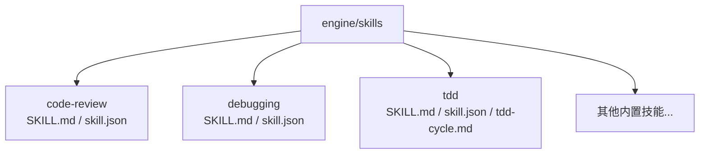
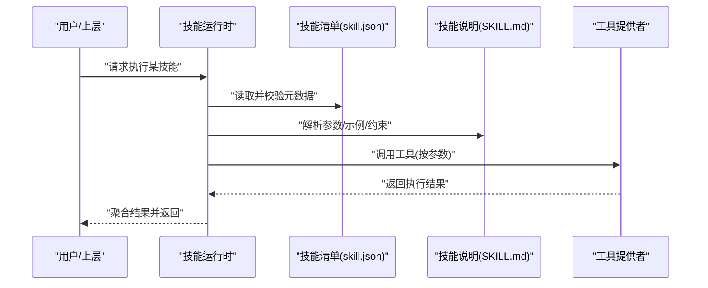
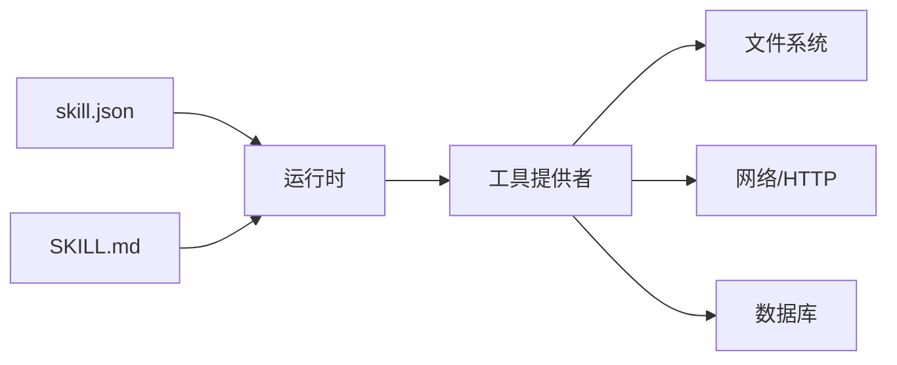

# 自定义技能开发

<cite>
**本文引用的文件**   
- [engine/skills/code-review/SKILL.md](file://engine/skills/code-review/SKILL.md)
- [engine/skills/code-review/skill.json](file://engine/skills/code-review/skill.json)
- [engine/skills/debugging/SKILL.md](file://engine/skills/debugging/SKILL.md)
- [engine/skills/debugging/skill.json](file://engine/skills/debugging/skill.json)
- [engine/skills/tdd/SKILL.md](file://engine/skills/tdd/SKILL.md)
- [engine/skills/tdd/skill.json](file://engine/skills/tdd/skill.json)
- [engine/skills/tdd/tdd-cycle.md](file://engine/skills/tdd/tdd-cycle.md)
- [engine/tests/builtin-skills.test.ts](file://engine/tests/builtin-skills.test.ts)
- [engine/tests/skill-command-registry.test.ts](file://engine/tests/skill-command-registry.test.ts)
- [engine/tests/skill-mcp-bridge.test.ts](file://engine/tests/skill-mcp-bridge.test.ts)
- [engine/tests/skill-runtime.test.ts](file://engine/tests/skill-runtime.test.ts)
- [engine/tests/skill-tool-provider.test.ts](file://engine/tests/skill-tool-provider.test.ts)
- [engine/tests/work-mode-skill-runtime.test.ts](file://engine/tests/work-mode-skill-runtime.test.ts)
</cite>

## 目录
1. [简介](#简介)
2. [项目结构](#项目结构)
3. [核心组件](#核心组件)
4. [架构总览](#架构总览)
5. [详细组件分析](#详细组件分析)
6. [依赖分析](#依赖分析)
7. [性能考虑](#性能考虑)
8. [故障排查指南](#故障排查指南)
9. [结论](#结论)
10. [附录](#附录)

## 简介
本指南面向希望在 KCoder 中开发“自定义技能”的工程师，提供从项目初始化到部署发布的完整流程说明。文档聚焦于以下目标：
- 明确技能目录结构与文件组织规范
- 详解 SKILL.md 编写规范（描述、参数、示例）
- 详解 skill.json 配置项与验证规则
- 总结最佳实践与设计模式
- 提供模板与脚手架使用建议
- 指导单元测试与集成测试编写
- 给出调试技巧与常见问题排查
- 说明打包、签名与分发流程
- 约定代码规范与提交要求

## 项目结构
仓库采用多包工作区组织，技能位于 engine/skills 目录下，每个技能一个子目录，包含 SKILL.md 与 skill.json 两个必需文件；部分技能还包含辅助文档或资源。

**图表来源**
- [engine/skills/code-review/SKILL.md](file://engine/skills/code-review/SKILL.md)
- [engine/skills/code-review/skill.json](file://engine/skills/code-review/skill.json)
- [engine/skills/debugging/SKILL.md](file://engine/skills/debugging/SKILL.md)
- [engine/skills/debugging/skill.json](file://engine/skills/debugging/skill.json)
- [engine/skills/tdd/SKILL.md](file://engine/skills/tdd/SKILL.md)
- [engine/skills/tdd/skill.json](file://engine/skills/tdd/skill.json)
- [engine/skills/tdd/tdd-cycle.md](file://engine/skills/tdd/tdd-cycle.md)

**章节来源**
- [engine/skills/code-review/SKILL.md](file://engine/skills/code-review/SKILL.md)
- [engine/skills/code-review/skill.json](file://engine/skills/code-review/skill.json)
- [engine/skills/debugging/SKILL.md](file://engine/skills/debugging/SKILL.md)
- [engine/skills/debugging/skill.json](file://engine/skills/debugging/skill.json)
- [engine/skills/tdd/SKILL.md](file://engine/skills/tdd/SKILL.md)
- [engine/skills/tdd/skill.json](file://engine/skills/tdd/skill.json)
- [engine/skills/tdd/tdd-cycle.md](file://engine/skills/tdd/tdd-cycle.md)

## 核心组件
- 技能清单与元数据：skill.json 定义技能的标识、版本、能力边界、工具绑定等元信息，供运行时加载与校验。
- 技能行为说明：SKILL.md 以自然语言描述技能用途、输入参数、输出格式、使用示例与注意事项，驱动模型理解与编排。
- 辅助文档：如 tdd-cycle.md 用于补充复杂流程说明，便于人类阅读与模型参考。

上述文件共同构成“可发现、可解释、可执行”的技能契约。

**章节来源**
- [engine/skills/code-review/skill.json](file://engine/skills/code-review/skill.json)
- [engine/skills/code-review/SKILL.md](file://engine/skills/code-review/SKILL.md)
- [engine/skills/debugging/skill.json](file://engine/skills/debugging/skill.json)
- [engine/skills/debugging/SKILL.md](file://engine/skills/debugging/SKILL.md)
- [engine/skills/tdd/skill.json](file://engine/skills/tdd/skill.json)
- [engine/skills/tdd/SKILL.md](file://engine/skills/tdd/SKILL.md)
- [engine/skills/tdd/tdd-cycle.md](file://engine/skills/tdd/tdd-cycle.md)

## 架构总览
下图展示技能在运行时的关键交互路径：引擎加载技能清单与说明，解析参数与工具，调用工具提供者执行具体动作，并将结果回传给上层。

[此图为概念性流程图，不直接映射具体源码文件]

## 详细组件分析

### 技能清单 schema（skill.json）
- 作用：声明技能标识、版本、能力范围、工具绑定、权限与安全策略等元数据，是运行时加载与校验的依据。
- 关键字段（基于现有内置技能推断）：
  - 标识与版本：唯一 ID、版本号、名称、摘要
  - 能力与工具：绑定的工具列表、触发条件、上下文需求
  - 安全与权限：访问范围、敏感操作白名单
  - 兼容性与环境：最低运行时版本、平台限制
- 验证规则（由测试覆盖）：
  - 必填字段完整性检查
  - 类型与枚举值校验
  - 依赖关系与循环引用检测
  - 与工具注册表的一致性校验

为了解其具体字段与校验逻辑，请参考以下测试用例：
- [engine/tests/builtin-skills.test.ts](file://engine/tests/builtin-skills.test.ts)
- [engine/tests/skill-command-registry.test.ts](file://engine/tests/skill-command-registry.test.ts)

**章节来源**
- [engine/tests/builtin-skills.test.ts](file://engine/tests/builtin-skills.test.ts)
- [engine/tests/skill-command-registry.test.ts](file://engine/tests/skill-command-registry.test.ts)

### 技能说明文档（SKILL.md）
- 作用：以人类可读的方式描述技能的目标、输入参数、输出格式、使用示例、注意事项与边界条件，帮助模型正确编排与调用。
- 推荐结构：
  - 标题与一句话描述
  - 适用场景与前置条件
  - 参数定义（名称、类型、是否必填、默认值、取值范围）
  - 输出格式（结构化字段说明）
  - 使用示例（至少一个端到端示例）
  - 错误处理与重试策略
  - 与其他技能的协作方式
- 编写要点：
  - 参数命名清晰、类型明确、避免歧义
  - 示例贴近真实使用场景，覆盖常见分支
  - 对副作用与权限要求进行显式说明

可参考以下内置技能的 SKILL.md 作为模板：
- [engine/skills/code-review/SKILL.md](file://engine/skills/code-review/SKILL.md)
- [engine/skills/debugging/SKILL.md](file://engine/skills/debugging/SKILL.md)
- [engine/skills/tdd/SKILL.md](file://engine/skills/tdd/SKILL.md)

**章节来源**
- [engine/skills/code-review/SKILL.md](file://engine/skills/code-review/SKILL.md)
- [engine/skills/debugging/SKILL.md](file://engine/skills/debugging/SKILL.md)
- [engine/skills/tdd/SKILL.md](file://engine/skills/tdd/SKILL.md)

### 辅助文档（可选）
- 对于复杂流程（如 TDD 循环），可在技能目录内附加辅助文档，增强可读性与可维护性。
- 示例：
  - [engine/skills/tdd/tdd-cycle.md](file://engine/skills/tdd/tdd-cycle.md)

**章节来源**
- [engine/skills/tdd/tdd-cycle.md](file://engine/skills/tdd/tdd-cycle.md)

### 运行时与桥接（技能如何被调用）
- 运行时负责加载技能清单与说明、解析参数、调度工具、管理上下文与生命周期。
- MCP 桥接层将技能暴露为可远程调用的工具接口，支持跨进程/跨服务调用。
- 工具提供者实现具体业务逻辑，包括文件系统、网络、外部服务等。

相关测试覆盖了运行时、命令注册、MCP 桥接与工具提供者：
- [engine/tests/skill-runtime.test.ts](file://engine/tests/skill-runtime.test.ts)
- [engine/tests/skill-mcp-bridge.test.ts](file://engine/tests/skill-mcp-bridge.test.ts)
- [engine/tests/skill-tool-provider.test.ts](file://engine/tests/skill-tool-provider.test.ts)
- [engine/tests/work-mode-skill-runtime.test.ts](file://engine/tests/work-mode-skill-runtime.test.ts)

**章节来源**
- [engine/tests/skill-runtime.test.ts](file://engine/tests/skill-runtime.test.ts)
- [engine/tests/skill-mcp-bridge.test.ts](file://engine/tests/skill-mcp-bridge.test.ts)
- [engine/tests/skill-tool-provider.test.ts](file://engine/tests/skill-tool-provider.test.ts)
- [engine/tests/work-mode-skill-runtime.test.ts](file://engine/tests/work-mode-skill-runtime.test.ts)

## 依赖分析
- 低耦合：技能通过 skill.json 声明依赖，运行时根据清单动态装配，降低硬编码耦合。
- 高内聚：每个技能目录自包含清单、说明与必要资源，便于独立开发与测试。
- 外部依赖：工具提供者可能依赖文件系统、网络、数据库等，需在清单中显式声明权限与范围。

[此图为概念性依赖图，不直接映射具体源码文件]

## 性能考虑
- 清单与说明缓存：首次加载后缓存，减少重复 I/O 与解析开销。
- 参数预校验：在调用前完成类型与范围校验，尽早失败，避免无效调用。
- 工具调用批量化：合并多次小工具调用，降低上下文切换与序列化成本。
- 超时与重试：对网络与外部服务设置合理超时与退避策略，提升鲁棒性。
- 资源隔离：不同技能运行在隔离上下文中，防止相互干扰。

[本节为通用建议，无需特定文件来源]

## 故障排查指南
- 清单校验失败：检查必填字段、类型与枚举值，确保与工具注册表一致。
  - 参考：[engine/tests/builtin-skills.test.ts](file://engine/tests/builtin-skills.test.ts)
- 命令注册异常：确认命令名唯一、路由无冲突、权限声明正确。
  - 参考：[engine/tests/skill-command-registry.test.ts](file://engine/tests/skill-command-registry.test.ts)
- MCP 桥接问题：检查端口、协议版本、鉴权配置与消息格式。
  - 参考：[engine/tests/skill-mcp-bridge.test.ts](file://engine/tests/skill-mcp-bridge.test.ts)
- 运行时异常：关注上下文丢失、状态不一致、并发竞争等问题。
  - 参考：[engine/tests/skill-runtime.test.ts](file://engine/tests/skill-runtime.test.ts)
- 工具提供者错误：定位具体工具的错误码与日志，区分上游依赖与内部逻辑错误。
  - 参考：[engine/tests/skill-tool-provider.test.ts](file://engine/tests/skill-tool-provider.test.ts)
- 工作模式差异：不同模式下行为可能不同，需分别验证。
  - 参考：[engine/tests/work-mode-skill-runtime.test.ts](file://engine/tests/work-mode-skill-runtime.test.ts)

**章节来源**
- [engine/tests/builtin-skills.test.ts](file://engine/tests/builtin-skills.test.ts)
- [engine/tests/skill-command-registry.test.ts](file://engine/tests/skill-command-registry.test.ts)
- [engine/tests/skill-mcp-bridge.test.ts](file://engine/tests/skill-mcp-bridge.test.ts)
- [engine/tests/skill-runtime.test.ts](file://engine/tests/skill-runtime.test.ts)
- [engine/tests/skill-tool-provider.test.ts](file://engine/tests/skill-tool-provider.test.ts)
- [engine/tests/work-mode-skill-runtime.test.ts](file://engine/tests/work-mode-skill-runtime.test.ts)

## 结论
通过统一的清单与说明契约、严格的运行时校验与完善的测试体系，KCoder 使技能具备高可发现性、强可解释性与稳定可执行性。遵循本文档的结构与规范，可快速构建高质量、易维护、可扩展的自定义技能。

[本节为总结性内容，无需特定文件来源]

## 附录

### 从零开始：技能开发全流程
- 初始化
  - 在 engine/skills 下创建新目录，命名为技能标识（全小写、短横线分隔）。
  - 复制内置技能目录中的 SKILL.md 与 skill.json 作为起点。
- 编写 SKILL.md
  - 明确目标、参数、输出、示例与注意事项。
  - 参考：
    - [engine/skills/code-review/SKILL.md](file://engine/skills/code-review/SKILL.md)
    - [engine/skills/debugging/SKILL.md](file://engine/skills/debugging/SKILL.md)
    - [engine/skills/tdd/SKILL.md](file://engine/skills/tdd/SKILL.md)
- 完善 skill.json
  - 填写标识、版本、能力与工具绑定、权限与安全策略。
  - 参考：
    - [engine/skills/code-review/skill.json](file://engine/skills/code-review/skill.json)
    - [engine/skills/debugging/skill.json](file://engine/skills/debugging/skill.json)
    - [engine/skills/tdd/skill.json](file://engine/skills/tdd/skill.json)
- 本地验证
  - 运行内置技能测试套件，确保清单与说明通过校验。
  - 参考：
    - [engine/tests/builtin-skills.test.ts](file://engine/tests/builtin-skills.test.ts)
    - [engine/tests/skill-command-registry.test.ts](file://engine/tests/skill-command-registry.test.ts)
- 单元测试
  - 针对工具提供者与业务逻辑编写单测，覆盖正常与异常路径。
  - 参考：
    - [engine/tests/skill-tool-provider.test.ts](file://engine/tests/skill-tool-provider.test.ts)
- 集成测试
  - 模拟运行时与 MCP 桥接，端到端验证技能调用链路。
  - 参考：
    - [engine/tests/skill-runtime.test.ts](file://engine/tests/skill-runtime.test.ts)
    - [engine/tests/skill-mcp-bridge.test.ts](file://engine/tests/skill-mcp-bridge.test.ts)
    - [engine/tests/work-mode-skill-runtime.test.ts](file://engine/tests/work-mode-skill-runtime.test.ts)
- 调试技巧
  - 开启详细日志，定位参数解析、工具调用与结果聚合阶段的问题。
  - 使用最小复现用例，逐步缩小问题范围。
- 打包与发布
  - 将技能目录纳入制品，附带清单与说明，进行签名与完整性校验。
  - 通过分发渠道安装至目标环境，并在运行时加载验证。
- 代码规范与提交
  - 统一命名与注释风格，保持清单与说明同步更新。
  - 提交时附带变更说明与测试覆盖情况。

[本节为流程性指导，未直接分析具体源码文件]