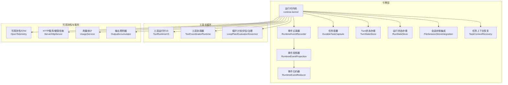
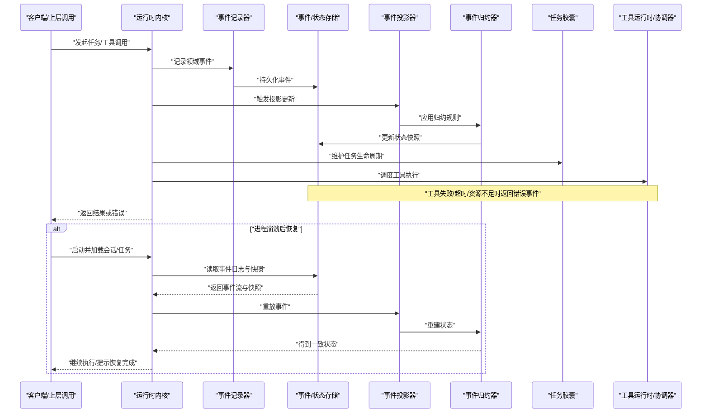
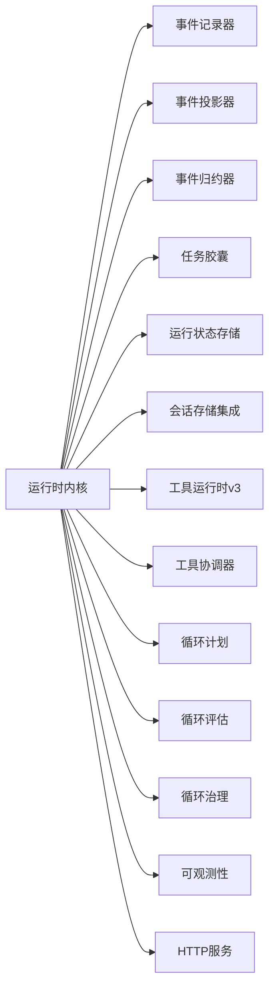

# 崩溃恢复

<cite>
**本文引用的文件**   
- [engine/scripts/verify-crash-recovery.mjs](file://engine/scripts/verify-crash-recovery.mjs)
- [engine/tests/runtime-kernel-crash-recovery.test.ts](file://engine/tests/runtime-kernel-crash-recovery.test.ts)
- [engine/tests/task-context-recovery.test.ts](file://engine/tests/task-context-recovery.test.ts)
- [engine/tests/file-session-store-integration.test.ts](file://engine/tests/file-session-store-integration.test.ts)
- [engine/tests/run-state-store.test.ts](file://engine/tests/run-state-store.test.ts)
- [engine/tests/legacy-task-state-migration.test.ts](file://engine/tests/legacy-task-state-migration.test.ts)
- [engine/tests/model-history-repair.test.ts](file://engine/tests/model-history-repair.test.ts)
- [engine/tests/tool-call-repair.test.ts](file://engine/tests/tool-call-repair.test.ts)
- [engine/tests/effect-commit.test.ts](file://engine/tests/effect-commit.test.ts)
- [engine/tests/compaction-transaction.test.ts](file://engine/tests/compaction-transaction.test.ts)
- [engine/tests/durable-task-capsule.test.ts](file://engine/tests/durable-task-capsule.test.ts)
- [engine/tests/runtime-event-projection.test.ts](file://engine/tests/runtime-event-projection.test.ts)
- [engine/tests/runtime-event-recorder-kernel.test.ts](file://engine/tests/runtime-event-recorder-kernel.test.ts)
- [engine/tests/runtime-event-reducer.test.ts](file://engine/tests/runtime-event-reducer.test.ts)
- [engine/tests/execution-graph.test.ts](file://engine/tests/execution-graph.test.ts)
- [engine/tests/tool-runtime-v3.test.ts](file://engine/tests/tool-runtime-v3.test.ts)
- [engine/tests/tool-coordinator-runtime.test.ts](file://engine/tests/tool-coordinator-runtime.test.ts)
- [engine/tests/tool-dispatch-errors.test.ts](file://engine/tests/tool-dispatch-errors.test.ts)
- [engine/tests/tool-result-budget.test.ts](file://engine/tests/tool-result-budget.test.ts)
- [engine/tests/loop-runner.test.ts](file://engine/tests/loop-runner.test.ts)
- [engine/tests/loop-evaluator.test.ts](file://engine/tests/loop-evaluator.test.ts)
- [engine/tests/continuation-policy.test.ts](file://engine/tests/continuation-policy.test.ts)
- [engine/tests/turn-state-store.test.ts](file://engine/tests/turn-state-store.test.ts)
- [engine/tests/memory-store.test.ts](file://engine/tests/memory-store.test.ts)
- [engine/tests/cache.test.ts](file://engine/tests/cache.test.ts)
- [engine/tests/hybrid-store.test.ts](file://engine/tests/hybrid-store.test.ts)
- [engine/tests/atomic-write.test.ts](file://engine/tests/atomic-write.test.ts)
- [engine/tests/file-mutation-queue.test.ts](file://engine/tests/file-mutation-queue.test.ts)
- [engine/tests/serve.test.ts](file://engine/tests/serve.test.ts)
- [engine/tests/http-server-test-harness.ts](file://engine/tests/http-server-test-harness.ts)
- [engine/tests/http-server-observability.test.ts](file://engine/tests/http-server-observability.test.ts)
- [engine/tests/opentelemetry.test.ts](file://engine/tests/opentelemetry.test.ts)
- [engine/tests/request-history-hygiene.test.ts](file://engine/tests/request-history-hygiene.test.ts)
- [engine/tests/output-accumulator.test.ts](file://engine/tests/output-accumulator.test.ts)
- [engine/tests/usage-service.test.ts](file://engine/tests/usage-service.test.ts)
- [engine/tests/compaction-governor.test.ts](file://engine/tests/compaction-governor.test.ts)
- [engine/tests/loop-plan.test.ts](file://engine/tests/loop-plan.test.ts)
- [engine/tests/loop-policy.test.ts](file://engine/tests/loop-policy.test.ts)
- [engine/tests/loop-governor.test.ts](file://engine/tests/loop-governor.test.ts)
- [engine/tests/kernel-v3-node-handlers.test.ts](file://engine/tests/kernel-v3-node-handlers.test.ts)
- [engine/tests/kernel-v3-provider-governance.test.ts](file://engine/tests/kernel-v3-provider-governance.test.ts)
- [engine/tests/kernel-v3-turn-runner.test.ts](file://engine/tests/kernel-v3-turn-runner.test.ts)
- [engine/tests/runtime-kernel-after-middleware.test.ts](file://engine/tests/runtime-kernel-after-middleware.test.ts)
- [engine/tests/runtime-kernel-contracts.test.ts](file://engine/tests/runtime-kernel-contracts.test.ts)
- [engine/tests/runtime-kernel-isolation.test.ts](file://engine/tests/runtime-kernel-isolation.test.ts)
- [engine/tests/runtime-kernel-parity.test.ts](file://engine/tests/runtime-kernel-parity.test.ts)
- [engine/tests/runtime-kernel-replay.test.ts](file://engine/tests/runtime-kernel-replay.test.ts)
- [engine/tests/runtime-kernel.test.ts](file://engine/tests/runtime-kernel.test.ts)
- [engine/tests/runtime-middleware-governance.test.ts](file://engine/tests/runtime-middleware-governance.test.ts)
- [engine/tests/runtime-middleware.test.ts](file://engine/tests/runtime-middleware.test.ts)
- [engine/tests/runtime-factory-rollout.test.ts](file://engine/tests/runtime-factory-rollout.test.ts)
- [engine/tests/runtime-factory.test.ts](file://engine/tests/runtime-factory.test.ts)
- [engine/tests/scope-key.test.ts](file://engine/tests/scope-key.test.ts)
- [engine/tests/thread-service.test.ts](file://engine/tests/thread-service.test.ts)
- [engine/tests/virtual-path.test.ts](file://engine/tests/virtual-path.test.ts)
- [engine/tests/contracts.test.ts](file://engine/tests/contracts.test.ts)
</cite>

## 目录
1. [简介](#简介)
2. [项目结构](#项目结构)
3. [核心组件](#核心组件)
4. [架构总览](#架构总览)
5. [详细组件分析](#详细组件分析)
6. [依赖分析](#依赖分析)
7. [性能考虑](#性能考虑)
8. [故障排查指南](#故障排查指南)
9. [结论](#结论)
10. [附录](#附录)

## 简介
本文件面向KCoder的“崩溃恢复”能力，围绕异常捕获与处理、状态恢复、数据一致性、崩溃检测与自动重启、用户数据保护、崩溃报告收集与分析以及灾难恢复流程进行系统化说明。文档以仓库中的测试与脚本为依据，提炼出可落地的机制设计与最佳实践，帮助读者在不深入源码细节的情况下理解并落地相关方案。

## 项目结构
KCoder采用多包（monorepo）工程组织，崩溃恢复相关能力主要分布在engine子工程中：
- 验证脚本：用于端到端验证崩溃恢复路径与关键约束
- 测试套件：覆盖内核、任务、事件、存储、工具执行、循环治理、中间件、可观测性等维度
- 基础设施：提供持久化、原子写入、混合存储、缓存等基础能力

图表来源
- [engine/tests/runtime-kernel-crash-recovery.test.ts](file://engine/tests/runtime-kernel-crash-recovery.test.ts)
- [engine/tests/runtime-event-recorder-kernel.test.ts](file://engine/tests/runtime-event-recorder-kernel.test.ts)
- [engine/tests/runtime-event-projection.test.ts](file://engine/tests/runtime-event-projection.test.ts)
- [engine/tests/runtime-event-reducer.test.ts](file://engine/tests/runtime-event-reducer.test.ts)
- [engine/tests/durable-task-capsule.test.ts](file://engine/tests/durable-task-capsule.test.ts)
- [engine/tests/turn-state-store.test.ts](file://engine/tests/turn-state-store.test.ts)
- [engine/tests/run-state-store.test.ts](file://engine/tests/run-state-store.test.ts)
- [engine/tests/file-session-store-integration.test.ts](file://engine/tests/file-session-store-integration.test.ts)
- [engine/tests/task-context-recovery.test.ts](file://engine/tests/task-context-recovery.test.ts)
- [engine/tests/tool-runtime-v3.test.ts](file://engine/tests/tool-runtime-v3.test.ts)
- [engine/tests/tool-coordinator-runtime.test.ts](file://engine/tests/tool-coordinator-runtime.test.ts)
- [engine/tests/loop-plan.test.ts](file://engine/tests/loop-plan.test.ts)
- [engine/tests/loop-evaluator.test.ts](file://engine/tests/loop-evaluator.test.ts)
- [engine/tests/loop-governor.test.ts](file://engine/tests/loop-governor.test.ts)
- [engine/tests/opentelemetry.test.ts](file://engine/tests/opentelemetry.test.ts)
- [engine/tests/serve.test.ts](file://engine/tests/serve.test.ts)
- [engine/tests/http-server-observability.test.ts](file://engine/tests/http-server-observability.test.ts)
- [engine/tests/usage-service.test.ts](file://engine/tests/usage-service.test.ts)
- [engine/tests/output-accumulator.test.ts](file://engine/tests/output-accumulator.test.ts)

章节来源
- [engine/scripts/verify-crash-recovery.mjs](file://engine/scripts/verify-crash-recovery.mjs)
- [engine/tests/runtime-kernel-crash-recovery.test.ts](file://engine/tests/runtime-kernel-crash-recovery.test.ts)

## 核心组件
- 全局异常与未捕获异常处理
  - 通过运行时内核与中间件体系统一拦截异常，确保错误在事件流中可追踪并可回放
  - 结合工具调用与循环治理，对失败分支进行重试、降级或终止
- Promise拒绝处理
  - 在工具运行时与协调器层面捕获Promise拒绝，将其转换为领域事件，保证幂等与可恢复
- 状态恢复机制
  - 会话状态持久化：基于文件会话存储集成，支持进程重启后恢复会话
  - 任务状态保存：任务胶囊与运行状态存储保障任务级持久化
  - 上下文信息恢复：任务上下文恢复模块负责重建必要上下文
- 数据一致性保证
  - 事务处理：压缩事务与效果提交测试覆盖事务边界与回滚语义
  - 数据备份：原子写入与混合存储策略提升可靠性
  - 增量同步：事件记录器+投影器+归约器的EAP模式实现增量重建
- 崩溃检测与自动重启
  - 健康检查与可观测性：HTTP服务与可观测性测试覆盖健康探针与指标上报
  - 心跳监测：通过运行态与工具调用的周期性确认信号体现
  - 故障转移：隔离与契约测试保障多实例切换时的行为一致
- 用户数据保护
  - 自动保存：文件变更队列与原子写入避免部分写入
  - 版本控制：历史修复与迁移测试保障向后兼容
  - 数据回滚：效果提交与事务测试覆盖回滚路径
- 崩溃报告收集与分析
  - 错误堆栈上报：可观测性与请求历史卫生测试覆盖上报与脱敏
  - 用户行为记录：输出累积器与用量统计辅助定位问题
  - 环境信息收集：范围键与虚拟路径等上下文信息便于复现
- 灾难恢复流程与应急预案
  - 端到端验证脚本定义恢复路径与验收条件
  - 回归测试矩阵覆盖关键场景，指导预案演练

章节来源
- [engine/tests/runtime-kernel-crash-recovery.test.ts](file://engine/tests/runtime-kernel-crash-recovery.test.ts)
- [engine/tests/tool-dispatch-errors.test.ts](file://engine/tests/tool-dispatch-errors.test.ts)
- [engine/tests/tool-call-repair.test.ts](file://engine/tests/tool-call-repair.test.ts)
- [engine/tests/tool-result-budget.test.ts](file://engine/tests/tool-result-budget.test.ts)
- [engine/tests/file-session-store-integration.test.ts](file://engine/tests/file-session-store-integration.test.ts)
- [engine/tests/run-state-store.test.ts](file://engine/tests/run-state-store.test.ts)
- [engine/tests/task-context-recovery.test.ts](file://engine/tests/task-context-recovery.test.ts)
- [engine/tests/compaction-transaction.test.ts](file://engine/tests/compaction-transaction.test.ts)
- [engine/tests/effect-commit.test.ts](file://engine/tests/effect-commit.test.ts)
- [engine/tests/atomic-write.test.ts](file://engine/tests/atomic-write.test.ts)
- [engine/tests/hybrid-store.test.ts](file://engine/tests/hybrid-store.test.ts)
- [engine/tests/runtime-event-recorder-kernel.test.ts](file://engine/tests/runtime-event-recorder-kernel.test.ts)
- [engine/tests/runtime-event-projection.test.ts](file://engine/tests/runtime-event-projection.test.ts)
- [engine/tests/runtime-event-reducer.test.ts](file://engine/tests/runtime-event-reducer.test.ts)
- [engine/tests/serve.test.ts](file://engine/tests/serve.test.ts)
- [engine/tests/http-server-observability.test.ts](file://engine/tests/http-server-observability.test.ts)
- [engine/tests/opentelemetry.test.ts](file://engine/tests/opentelemetry.test.ts)
- [engine/tests/request-history-hygiene.test.ts](file://engine/tests/request-history-hygiene.test.ts)
- [engine/tests/output-accumulator.test.ts](file://engine/tests/output-accumulator.test.ts)
- [engine/tests/usage-service.test.ts](file://engine/tests/usage-service.test.ts)
- [engine/tests/scope-key.test.ts](file://engine/tests/scope-key.test.ts)
- [engine/tests/virtual-path.test.ts](file://engine/tests/virtual-path.test.ts)
- [engine/tests/legacy-task-state-migration.test.ts](file://engine/tests/legacy-task-state-migration.test.ts)
- [engine/tests/model-history-repair.test.ts](file://engine/tests/model-history-repair.test.ts)
- [engine/tests/runtime-kernel-isolation.test.ts](file://engine/tests/runtime-kernel-isolation.test.ts)
- [engine/tests/runtime-kernel-contracts.test.ts](file://engine/tests/runtime-kernel-contracts.test.ts)
- [engine/tests/runtime-kernel-replay.test.ts](file://engine/tests/runtime-kernel-replay.test.ts)
- [engine/tests/runtime-kernel-parity.test.ts](file://engine/tests/runtime-kernel-parity.test.ts)
- [engine/tests/runtime-kernel-after-middleware.test.ts](file://engine/tests/runtime-kernel-after-middleware.test.ts)
- [engine/tests/runtime-middleware-governance.test.ts](file://engine/tests/runtime-middleware-governance.test.ts)
- [engine/tests/runtime-middleware.test.ts](file://engine/tests/runtime-middleware.test.ts)
- [engine/tests/runtime-factory-rollout.test.ts](file://engine/tests/runtime-factory-rollout.test.ts)
- [engine/tests/runtime-factory.test.ts](file://engine/tests/runtime-factory.test.ts)
- [engine/tests/contracts.test.ts](file://engine/tests/contracts.test.ts)
- [engine/tests/loop-runner.test.ts](file://engine/tests/loop-runner.test.ts)
- [engine/tests/continuation-policy.test.ts](file://engine/tests/continuation-policy.test.ts)
- [engine/tests/loop-policy.test.ts](file://engine/tests/loop-policy.test.ts)
- [engine/tests/compaction-governor.test.ts](file://engine/tests/compaction-governor.test.ts)
- [engine/tests/kernel-v3-node-handlers.test.ts](file://engine/tests/kernel-v3-node-handlers.test.ts)
- [engine/tests/kernel-v3-provider-governance.test.ts](file://engine/tests/kernel-v3-provider-governance.test.ts)
- [engine/tests/kernel-v3-turn-runner.test.ts](file://engine/tests/kernel-v3-turn-runner.test.ts)
- [engine/tests/thread-service.test.ts](file://engine/tests/thread-service.test.ts)
- [engine/tests/memory-store.test.ts](file://engine/tests/memory-store.test.ts)
- [engine/tests/cache.test.ts](file://engine/tests/cache.test.ts)
- [engine/tests/file-mutation-queue.test.ts](file://engine/tests/file-mutation-queue.test.ts)
- [engine/tests/execution-graph.test.ts](file://engine/tests/execution-graph.test.ts)
- [engine/tests/serve.test.ts](file://engine/tests/serve.test.ts)
- [engine/tests/http-server-test-harness.ts](file://engine/tests/http-server-test-harness.ts)

## 架构总览
崩溃恢复的整体思路是“事件溯源 + 状态快照 + 幂等重放”。内核将关键操作转化为不可变事件，持久化到事件日志；当发生崩溃时，通过投影与归约从事件重建状态，并结合任务胶囊与状态存储快速恢复到最近一致点。

图表来源
- [engine/tests/runtime-event-recorder-kernel.test.ts](file://engine/tests/runtime-event-recorder-kernel.test.ts)
- [engine/tests/runtime-event-projection.test.ts](file://engine/tests/runtime-event-projection.test.ts)
- [engine/tests/runtime-event-reducer.test.ts](file://engine/tests/runtime-event-reducer.test.ts)
- [engine/tests/durable-task-capsule.test.ts](file://engine/tests/durable-task-capsule.test.ts)
- [engine/tests/tool-runtime-v3.test.ts](file://engine/tests/tool-runtime-v3.test.ts)
- [engine/tests/tool-coordinator-runtime.test.ts](file://engine/tests/tool-coordinator-runtime.test.ts)
- [engine/tests/run-state-store.test.ts](file://engine/tests/run-state-store.test.ts)
- [engine/tests/file-session-store-integration.test.ts](file://engine/tests/file-session-store-integration.test.ts)

## 详细组件分析

### 全局异常处理器与未捕获异常处理
- 设计要点
  - 在内核与中间件层统一捕获异常，将异常转为领域事件，确保可追踪与可回放
  - 针对工具调用链路的未捕获异常，由工具协调器与运行时v3进行兜底捕获，避免进程退出
- 关键路径
  - 工具分发错误、工具调用修复、工具结果预算限制等测试覆盖了异常分支与恢复策略
- 建议
  - 所有异步路径均需注册Promise拒绝监听，并将拒绝原因映射为标准化错误事件
  - 对可重试错误实施指数退避与熔断，防止雪崩

章节来源
- [engine/tests/tool-dispatch-errors.test.ts](file://engine/tests/tool-dispatch-errors.test.ts)
- [engine/tests/tool-call-repair.test.ts](file://engine/tests/tool-call-repair.test.ts)
- [engine/tests/tool-result-budget.test.ts](file://engine/tests/tool-result-budget.test.ts)
- [engine/tests/runtime-kernel-after-middleware.test.ts](file://engine/tests/runtime-kernel-after-middleware.test.ts)
- [engine/tests/runtime-middleware.test.ts](file://engine/tests/runtime-middleware.test.ts)

### Promise拒绝处理
- 设计要点
  - 在工具运行时与协调器层集中捕获Promise拒绝，转换为错误事件并进入恢复流程
  - 结合循环治理与延续策略，决定重试、降级或终止
- 关键路径
  - 循环执行器、评估器与治理器测试覆盖拒绝后的决策逻辑
- 建议
  - 为每个外部依赖设置超时与取消令牌，避免悬挂Promise导致内存泄漏

章节来源
- [engine/tests/tool-runtime-v3.test.ts](file://engine/tests/tool-runtime-v3.test.ts)
- [engine/tests/tool-coordinator-runtime.test.ts](file://engine/tests/tool-coordinator-runtime.test.ts)
- [engine/tests/loop-runner.test.ts](file://engine/tests/loop-runner.test.ts)
- [engine/tests/loop-evaluator.test.ts](file://engine/tests/loop-evaluator.test.ts)
- [engine/tests/continuation-policy.test.ts](file://engine/tests/continuation-policy.test.ts)

### 状态恢复机制
- 会话状态持久化
  - 文件会话存储集成测试验证了进程重启后会话的加载与一致性
- 任务状态保存
  - 任务胶囊与运行状态存储测试覆盖任务级持久化与恢复
- 上下文信息恢复
  - 任务上下文恢复测试确保必要的上下文在恢复后可用
- 建议
  - 使用原子写入与混合存储降低损坏风险
  - 定期生成快照以减少重放成本

章节来源
- [engine/tests/file-session-store-integration.test.ts](file://engine/tests/file-session-store-integration.test.ts)
- [engine/tests/durable-task-capsule.test.ts](file://engine/tests/durable-task-capsule.test.ts)
- [engine/tests/run-state-store.test.ts](file://engine/tests/run-state-store.test.ts)
- [engine/tests/task-context-recovery.test.ts](file://engine/tests/task-context-recovery.test.ts)
- [engine/tests/atomic-write.test.ts](file://engine/tests/atomic-write.test.ts)
- [engine/tests/hybrid-store.test.ts](file://engine/tests/hybrid-store.test.ts)

### 数据一致性保证
- 事务处理
  - 压缩事务与效果提交测试覆盖事务边界、提交与回滚语义
- 数据备份
  - 原子写入与混合存储提升可靠性，减少部分写入导致的损坏
- 增量同步
  - 事件记录器+投影器+归约器构成增量重建流水线，支持按事件流恢复
- 建议
  - 对关键写路径引入校验和与版本戳，避免静默损坏
  - 对大对象分片写入，配合事务边界保证一致性

章节来源
- [engine/tests/compaction-transaction.test.ts](file://engine/tests/compaction-transaction.test.ts)
- [engine/tests/effect-commit.test.ts](file://engine/tests/effect-commit.test.ts)
- [engine/tests/atomic-write.test.ts](file://engine/tests/atomic-write.test.ts)
- [engine/tests/hybrid-store.test.ts](file://engine/tests/hybrid-store.test.ts)
- [engine/tests/runtime-event-recorder-kernel.test.ts](file://engine/tests/runtime-event-recorder-kernel.test.ts)
- [engine/tests/runtime-event-projection.test.ts](file://engine/tests/runtime-event-projection.test.ts)
- [engine/tests/runtime-event-reducer.test.ts](file://engine/tests/runtime-event-reducer.test.ts)

### 崩溃检测与自动重启
- 健康检查
  - HTTP服务与可观测性测试覆盖健康探针与指标上报
- 心跳监测
  - 通过运行态与工具调用的周期性确认信号体现心跳
- 故障转移
  - 隔离与契约测试保障多实例切换时的行为一致
- 建议
  - 对外暴露健康检查端点，包含依赖项健康状态
  - 结合编排系统实现自动重启与滚动升级

章节来源
- [engine/tests/serve.test.ts](file://engine/tests/serve.test.ts)
- [engine/tests/http-server-observability.test.ts](file://engine/tests/http-server-observability.test.ts)
- [engine/tests/opentelemetry.test.ts](file://engine/tests/opentelemetry.test.ts)
- [engine/tests/runtime-kernel-isolation.test.ts](file://engine/tests/runtime-kernel-isolation.test.ts)
- [engine/tests/runtime-kernel-contracts.test.ts](file://engine/tests/runtime-kernel-contracts.test.ts)

### 用户数据保护策略
- 自动保存
  - 文件变更队列与原子写入避免部分写入
- 版本控制
  - 历史修复与迁移测试保障向后兼容
- 数据回滚
  - 效果提交与事务测试覆盖回滚路径
- 建议
  - 对敏感数据进行脱敏与加密
  - 保留最小必要历史，平衡恢复需求与存储成本

章节来源
- [engine/tests/file-mutation-queue.test.ts](file://engine/tests/file-mutation-queue.test.ts)
- [engine/tests/atomic-write.test.ts](file://engine/tests/atomic-write.test.ts)
- [engine/tests/legacy-task-state-migration.test.ts](file://engine/tests/legacy-task-state-migration.test.ts)
- [engine/tests/model-history-repair.test.ts](file://engine/tests/model-history-repair.test.ts)
- [engine/tests/effect-commit.test.ts](file://engine/tests/effect-commit.test.ts)
- [engine/tests/compaction-transaction.test.ts](file://engine/tests/compaction-transaction.test.ts)

### 崩溃报告收集与分析
- 错误堆栈上报
  - 可观测性与请求历史卫生测试覆盖上报与脱敏
- 用户行为记录
  - 输出累积器与用量统计辅助定位问题
- 环境信息收集
  - 范围键与虚拟路径等上下文信息便于复现
- 建议
  - 建立统一的错误码与告警规则
  - 对高频错误进行聚合与去噪

章节来源
- [engine/tests/opentelemetry.test.ts](file://engine/tests/opentelemetry.test.ts)
- [engine/tests/request-history-hygiene.test.ts](file://engine/tests/request-history-hygiene.test.ts)
- [engine/tests/output-accumulator.test.ts](file://engine/tests/output-accumulator.test.ts)
- [engine/tests/usage-service.test.ts](file://engine/tests/usage-service.test.ts)
- [engine/tests/scope-key.test.ts](file://engine/tests/scope-key.test.ts)
- [engine/tests/virtual-path.test.ts](file://engine/tests/virtual-path.test.ts)

### 灾难恢复流程与应急预案
- 端到端验证
  - 验证脚本定义了恢复路径与验收条件
- 回归测试矩阵
  - 覆盖内核、事件、任务、工具、循环治理、中间件、可观测性等关键场景
- 建议
  - 制定RTO/RPO目标，明确恢复优先级
  - 定期演练恢复流程，验证备份可用性与恢复时间

章节来源
- [engine/scripts/verify-crash-recovery.mjs](file://engine/scripts/verify-crash-recovery.mjs)
- [engine/tests/runtime-kernel-crash-recovery.test.ts](file://engine/tests/runtime-kernel-crash-recovery.test.ts)
- [engine/tests/runtime-kernel-replay.test.ts](file://engine/tests/runtime-kernel-replay.test.ts)
- [engine/tests/runtime-kernel-parity.test.ts](file://engine/tests/runtime-kernel-parity.test.ts)
- [engine/tests/runtime-middleware-governance.test.ts](file://engine/tests/runtime-middleware-governance.test.ts)
- [engine/tests/runtime-factory-rollout.test.ts](file://engine/tests/runtime-factory-rollout.test.ts)
- [engine/tests/runtime-factory.test.ts](file://engine/tests/runtime-factory.test.ts)
- [engine/tests/contracts.test.ts](file://engine/tests/contracts.test.ts)

## 依赖分析
崩溃恢复涉及多层依赖关系，核心依赖如下：
- 内核依赖事件子系统（记录、投影、归约）
- 内核依赖任务与状态存储（任务胶囊、运行状态、会话存储）
- 内核依赖工具运行时与协调器（工具调用、错误处理、预算控制）
- 内核依赖可观测性与HTTP服务（健康检查、指标上报）
- 内核依赖循环治理（计划、评估、治理、策略）

图表来源
- [engine/tests/runtime-kernel-crash-recovery.test.ts](file://engine/tests/runtime-kernel-crash-recovery.test.ts)
- [engine/tests/runtime-event-recorder-kernel.test.ts](file://engine/tests/runtime-event-recorder-kernel.test.ts)
- [engine/tests/runtime-event-projection.test.ts](file://engine/tests/runtime-event-projection.test.ts)
- [engine/tests/runtime-event-reducer.test.ts](file://engine/tests/runtime-event-reducer.test.ts)
- [engine/tests/durable-task-capsule.test.ts](file://engine/tests/durable-task-capsule.test.ts)
- [engine/tests/run-state-store.test.ts](file://engine/tests/run-state-store.test.ts)
- [engine/tests/file-session-store-integration.test.ts](file://engine/tests/file-session-store-integration.test.ts)
- [engine/tests/tool-runtime-v3.test.ts](file://engine/tests/tool-runtime-v3.test.ts)
- [engine/tests/tool-coordinator-runtime.test.ts](file://engine/tests/tool-coordinator-runtime.test.ts)
- [engine/tests/loop-plan.test.ts](file://engine/tests/loop-plan.test.ts)
- [engine/tests/loop-evaluator.test.ts](file://engine/tests/loop-evaluator.test.ts)
- [engine/tests/loop-governor.test.ts](file://engine/tests/loop-governor.test.ts)
- [engine/tests/opentelemetry.test.ts](file://engine/tests/opentelemetry.test.ts)
- [engine/tests/serve.test.ts](file://engine/tests/serve.test.ts)

## 性能考虑
- 事件重放开销
  - 通过快照与增量重放降低恢复时间
- 存储I/O
  - 原子写入与混合存储减少锁竞争与损坏概率
- 工具调用
  - 超时、取消与预算控制避免长尾与资源耗尽
- 监控与告警
  - 利用可观测性指标识别热点与瓶颈

[本节为通用指导，不直接分析具体文件]

## 故障排查指南
- 常见症状
  - 进程崩溃后无法恢复会话或任务状态不一致
  - 工具调用频繁失败或超时
  - 健康检查失败或指标缺失
- 排查步骤
  - 检查事件日志是否完整，投影与归约是否成功
  - 核对任务胶囊与运行状态存储的一致性
  - 查看可观测性指标与请求历史，定位异常源头
  - 验证健康检查端点与依赖项状态
- 建议
  - 增加更细粒度的日志与指标
  - 对关键路径添加断言与校验

章节来源
- [engine/tests/runtime-kernel-crash-recovery.test.ts](file://engine/tests/runtime-kernel-crash-recovery.test.ts)
- [engine/tests/runtime-event-recorder-kernel.test.ts](file://engine/tests/runtime-event-recorder-kernel.test.ts)
- [engine/tests/runtime-event-projection.test.ts](file://engine/tests/runtime-event-projection.test.ts)
- [engine/tests/runtime-event-reducer.test.ts](file://engine/tests/runtime-event-reducer.test.ts)
- [engine/tests/durable-task-capsule.test.ts](file://engine/tests/durable-task-capsule.test.ts)
- [engine/tests/run-state-store.test.ts](file://engine/tests/run-state-store.test.ts)
- [engine/tests/file-session-store-integration.test.ts](file://engine/tests/file-session-store-integration.test.ts)
- [engine/tests/opentelemetry.test.ts](file://engine/tests/opentelemetry.test.ts)
- [engine/tests/request-history-hygiene.test.ts](file://engine/tests/request-history-hygiene.test.ts)
- [engine/tests/serve.test.ts](file://engine/tests/serve.test.ts)
- [engine/tests/http-server-observability.test.ts](file://engine/tests/http-server-observability.test.ts)

## 结论
KCoder的崩溃恢复以事件溯源为核心，结合任务与状态持久化、工具调用健壮性、循环治理与可观测性，形成完整的恢复闭环。通过端到端验证与回归测试矩阵，确保在复杂故障场景下仍能快速恢复并保持数据一致性。建议在部署侧完善健康检查、自动重启与滚动升级策略，并持续优化监控与告警体系。

[本节为总结性内容，不直接分析具体文件]

## 附录
- 术语
  - 事件溯源：将状态变化记录为不可变事件，通过重放事件重建状态
  - 投影：根据事件计算派生视图
  - 归约：将事件序列合并为最终状态
  - 任务胶囊：封装任务生命周期与持久化
  - 健康检查：对外暴露服务可用性探测接口
- 参考路径
  - 端到端验证脚本：[engine/scripts/verify-crash-recovery.mjs](file://engine/scripts/verify-crash-recovery.mjs)
  - 内核恢复测试：[engine/tests/runtime-kernel-crash-recovery.test.ts](file://engine/tests/runtime-kernel-crash-recovery.test.ts)
  - 事件子系统测试：[engine/tests/runtime-event-recorder-kernel.test.ts](file://engine/tests/runtime-event-recorder-kernel.test.ts)、[engine/tests/runtime-event-projection.test.ts](file://engine/tests/runtime-event-projection.test.ts)、[engine/tests/runtime-event-reducer.test.ts](file://engine/tests/runtime-event-reducer.test.ts)
  - 任务与状态测试：[engine/tests/durable-task-capsule.test.ts](file://engine/tests/durable-task-capsule.test.ts)、[engine/tests/run-state-store.test.ts](file://engine/tests/run-state-store.test.ts)、[engine/tests/file-session-store-integration.test.ts](file://engine/tests/file-session-store-integration.test.ts)
  - 工具与循环测试：[engine/tests/tool-runtime-v3.test.ts](file://engine/tests/tool-runtime-v3.test.ts)、[engine/tests/tool-coordinator-runtime.test.ts](file://engine/tests/tool-coordinator-runtime.test.ts)、[engine/tests/loop-runner.test.ts](file://engine/tests/loop-runner.test.ts)、[engine/tests/loop-evaluator.test.ts](file://engine/tests/loop-evaluator.test.ts)、[engine/tests/loop-governor.test.ts](file://engine/tests/loop-governor.test.ts)
  - 可观测性与服务测试：[engine/tests/opentelemetry.test.ts](file://engine/tests/opentelemetry.test.ts)、[engine/tests/serve.test.ts](file://engine/tests/serve.test.ts)、[engine/tests/http-server-observability.test.ts](file://engine/tests/http-server-observability.test.ts)