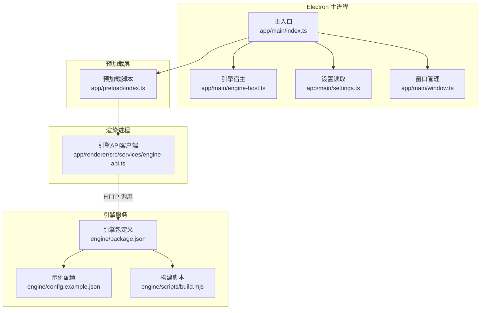
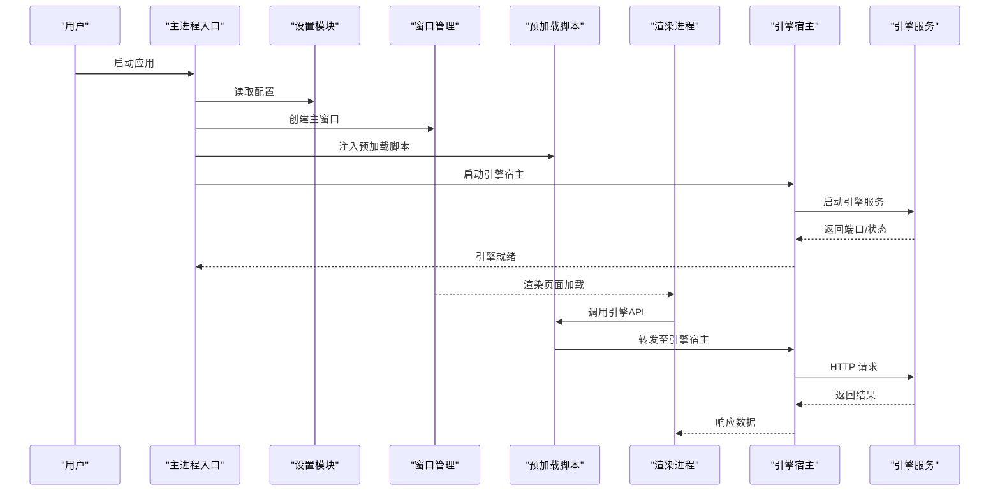
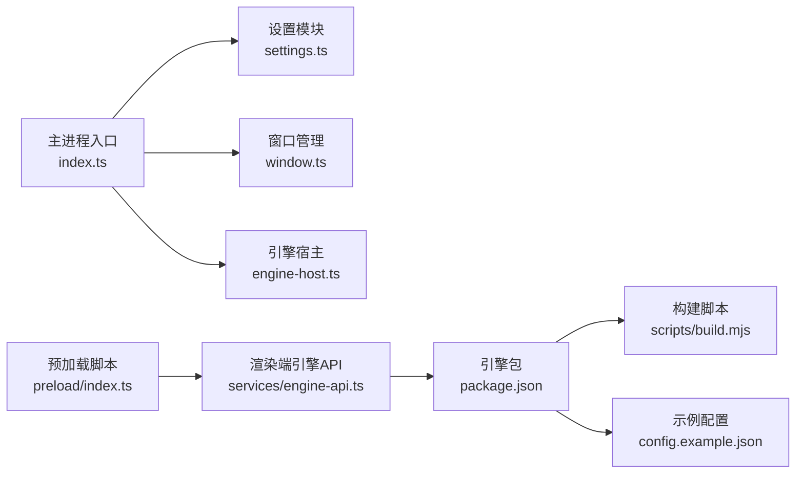
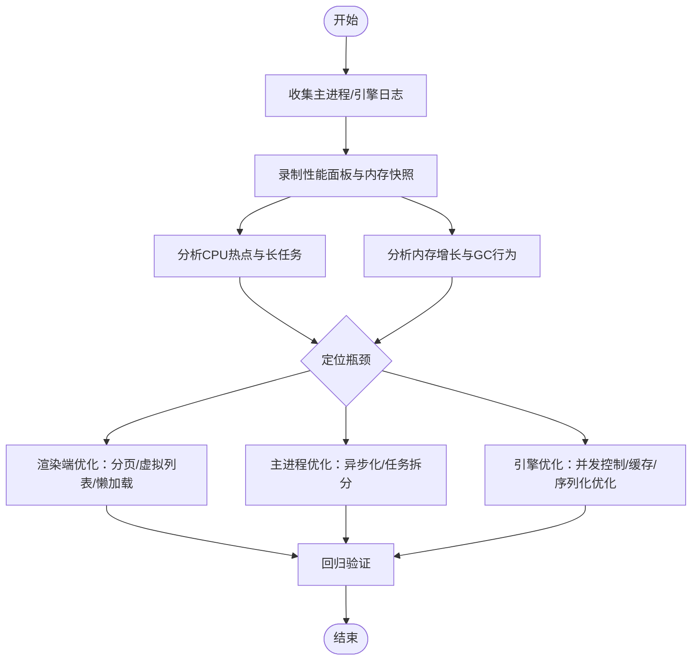

# 常见问题诊断

<cite>
**本文引用的文件**   
- [app/main/index.ts](file://app/main/index.ts)
- [app/main/engine-host.ts](file://app/main/engine-host.ts)
- [app/main/settings.ts](file://app/main/settings.ts)
- [app/main/window.ts](file://app/main/window.ts)
- [app/preload/index.ts](file://app/preload/index.ts)
- [app/renderer/src/services/engine-api.ts](file://app/renderer/src/services/engine-api.ts)
- [engine/package.json](file://engine/package.json)
- [engine/config.example.json](file://engine/config.example.json)
- [engine/scripts/build.mjs](file://engine/scripts/build.mjs)
</cite>

## 目录
1. [简介](#简介)
2. [项目结构](#项目结构)
3. [核心组件](#核心组件)
4. [架构总览](#架构总览)
5. [详细组件分析](#详细组件分析)
6. [依赖关系分析](#依赖关系分析)
7. [性能注意事项](#性能注意事项)
8. [故障排查指南](#故障排查指南)
9. [结论](#结论)
10. [附录](#附录)

## 简介
本指南面向KCoder用户与开发者，聚焦“启动失败、连接错误、性能问题”三类高频问题的定位与解决。内容覆盖Electron主进程启动异常、引擎初始化失败、端口冲突、AI模型API连接失败、本地服务通信异常、网络请求超时、内存泄漏检测、CPU占用过高、响应延迟等场景，并提供错误代码对照表与环境配置/依赖版本兼容性检查方法。

## 项目结构
KCoder采用Electron多进程架构：
- 主进程（app/main）负责应用生命周期、窗口管理、设置读取、引擎宿主（Engine Host）的启动与通信桥接。
- 渲染进程（app/renderer）提供UI与交互逻辑，通过预加载脚本与主进程安全通信，并调用引擎API服务。
- 引擎（engine）为独立可执行服务，提供HTTP接口供渲染进程访问。

**图表来源**
- [app/main/index.ts](file://app/main/index.ts)
- [app/main/engine-host.ts](file://app/main/engine-host.ts)
- [app/main/settings.ts](file://app/main/settings.ts)
- [app/main/window.ts](file://app/main/window.ts)
- [app/preload/index.ts](file://app/preload/index.ts)
- [app/renderer/src/services/engine-api.ts](file://app/renderer/src/services/engine-api.ts)
- [engine/package.json](file://engine/package.json)
- [engine/config.example.json](file://engine/config.example.json)
- [engine/scripts/build.mjs](file://engine/scripts/build.mjs)

**章节来源**
- [app/main/index.ts](file://app/main/index.ts)
- [app/main/engine-host.ts](file://app/main/engine-host.ts)
- [app/main/settings.ts](file://app/main/settings.ts)
- [app/main/window.ts](file://app/main/window.ts)
- [app/preload/index.ts](file://app/preload/index.ts)
- [app/renderer/src/services/engine-api.ts](file://app/renderer/src/services/engine-api.ts)
- [engine/package.json](file://engine/package.json)
- [engine/config.example.json](file://engine/config.example.json)
- [engine/scripts/build.mjs](file://engine/scripts/build.mjs)

## 核心组件
- 主进程入口：负责初始化应用、加载设置、创建窗口、启动引擎宿主并与预加载脚本建立IPC通道。
- 引擎宿主：封装引擎服务的生命周期管理（启动、停止、健康检查）、端口分配与错误上报。
- 设置模块：集中读取应用与引擎相关配置项，包括端口、代理、超时、日志级别等。
- 窗口管理：创建主窗口、处理窗口事件、注入预加载脚本。
- 预加载脚本：暴露安全的API给渲染进程，转发到主进程或直接访问受限能力。
- 渲染端引擎API：封装对引擎HTTP服务的调用，统一错误码与重试策略。
- 引擎包与配置：定义可执行入口、依赖、默认配置样例与构建流程。

**章节来源**
- [app/main/index.ts](file://app/main/index.ts)
- [app/main/engine-host.ts](file://app/main/engine-host.ts)
- [app/main/settings.ts](file://app/main/settings.ts)
- [app/main/window.ts](file://app/main/window.ts)
- [app/preload/index.ts](file://app/preload/index.ts)
- [app/renderer/src/services/engine-api.ts](file://app/renderer/src/services/engine-api.ts)
- [engine/package.json](file://engine/package.json)
- [engine/config.example.json](file://engine/config.example.json)
- [engine/scripts/build.mjs](file://engine/scripts/build.mjs)

## 架构总览
下图展示从应用启动到引擎就绪的关键路径，以及渲染进程发起一次典型请求的时序。

**图表来源**
- [app/main/index.ts](file://app/main/index.ts)
- [app/main/settings.ts](file://app/main/settings.ts)
- [app/main/window.ts](file://app/main/window.ts)
- [app/preload/index.ts](file://app/preload/index.ts)
- [app/renderer/src/services/engine-api.ts](file://app/renderer/src/services/engine-api.ts)
- [app/main/engine-host.ts](file://app/main/engine-host.ts)

## 详细组件分析

### 启动失败诊断（Electron主进程与引擎初始化）
- 常见原因
  - 主进程初始化顺序错误：未正确加载设置或窗口创建失败。
  - 引擎宿主启动失败：端口被占用、引擎二进制不可用、配置文件缺失或格式错误。
  - 预加载脚本注入失败：权限或沙箱限制导致渲染进程无法访问必要API。
- 定位步骤
  - 检查主进程日志输出与错误堆栈，确认设置加载与窗口创建是否成功。
  - 验证引擎宿主是否能绑定目标端口，若失败则切换可用端口或释放占用进程。
  - 核对引擎配置样例与实际配置的一致性，确保必填字段存在且类型正确。
  - 在渲染进程控制台观察预加载脚本暴露的API是否可用。
- 快速修复
  - 修改端口配置后重启应用；必要时以管理员权限运行以获取端口绑定权限。
  - 清理残留的引擎进程后再启动。
  - 使用示例配置作为基线，逐项对比差异。

**章节来源**
- [app/main/index.ts](file://app/main/index.ts)
- [app/main/engine-host.ts](file://app/main/engine-host.ts)
- [app/main/settings.ts](file://app/main/settings.ts)
- [app/main/window.ts](file://app/main/window.ts)
- [app/preload/index.ts](file://app/preload/index.ts)
- [engine/config.example.json](file://engine/config.example.json)

### 连接错误诊断（AI模型API、本地服务通信、网络超时）
- 常见原因
  - AI模型API密钥无效、域名不可达、代理配置错误。
  - 渲染进程与引擎服务之间HTTP通信失败（地址/端口不匹配、跨域限制）。
  - 网络不稳定导致请求超时或重试耗尽。
- 定位步骤
  - 在渲染端捕获并记录HTTP错误码与响应体摘要，区分服务端错误与网络错误。
  - 校验引擎服务是否处于监听状态，尝试通过命令行工具直接访问其HTTP接口。
  - 检查系统代理与防火墙规则，确认出站流量未被拦截。
  - 调整超时与重试参数进行对比测试，判断是否为瞬时抖动。
- 快速修复
  - 修正API密钥与域名，必要时更换DNS或使用可信代理。
  - 统一渲染端与服务端的协议与端口，避免硬编码不一致。
  - 根据网络环境调大超时阈值，启用指数退避重试。

**章节来源**
- [app/renderer/src/services/engine-api.ts](file://app/renderer/src/services/engine-api.ts)
- [app/preload/index.ts](file://app/preload/index.ts)
- [app/main/engine-host.ts](file://app/main/engine-host.ts)

### 性能问题识别（内存泄漏、CPU占用高、响应延迟）
- 识别方法
  - 使用浏览器DevTools的性能面板录制会话，关注长任务、频繁GC与内存增长曲线。
  - 在主进程与引擎侧开启结构化日志，统计关键路径耗时与错误率。
  - 监控引擎HTTP接口的P95/P99延迟与吞吐，结合负载测试定位瓶颈。
- 定位技巧
  - 渲染端：检查消息列表渲染、虚拟滚动、图片/代码块懒加载是否合理。
  - 主进程：避免阻塞事件循环，将重型任务下沉到引擎或Worker。
  - 引擎：优化I/O并发度、缓存热点数据、减少不必要的序列化开销。
- 优化建议
  - 引入增量更新与批处理，降低UI重排与重绘频率。
  - 对长耗时操作增加进度反馈与取消机制，提升用户体验。
  - 对外部API调用实施熔断与降级策略，保障核心功能可用。

[本节为通用性能指导，不直接分析具体文件]

## 依赖关系分析
- 主进程依赖设置模块与窗口管理，并通过引擎宿主协调引擎服务。
- 渲染进程通过预加载脚本访问受限能力，再调用引擎API服务。
- 引擎包定义可执行入口与依赖，构建脚本用于打包与分发。

**图表来源**
- [app/main/index.ts](file://app/main/index.ts)
- [app/main/settings.ts](file://app/main/settings.ts)
- [app/main/window.ts](file://app/main/window.ts)
- [app/main/engine-host.ts](file://app/main/engine-host.ts)
- [app/preload/index.ts](file://app/preload/index.ts)
- [app/renderer/src/services/engine-api.ts](file://app/renderer/src/services/engine-api.ts)
- [engine/package.json](file://engine/package.json)
- [engine/scripts/build.mjs](file://engine/scripts/build.mjs)
- [engine/config.example.json](file://engine/config.example.json)

**章节来源**
- [app/main/index.ts](file://app/main/index.ts)
- [app/main/settings.ts](file://app/main/settings.ts)
- [app/main/window.ts](file://app/main/window.ts)
- [app/main/engine-host.ts](file://app/main/engine-host.ts)
- [app/preload/index.ts](file://app/preload/index.ts)
- [app/renderer/src/services/engine-api.ts](file://app/renderer/src/services/engine-api.ts)
- [engine/package.json](file://engine/package.json)
- [engine/scripts/build.mjs](file://engine/scripts/build.mjs)
- [engine/config.example.json](file://engine/config.example.json)

## 性能注意事项
- 控制渲染端消息渲染规模，采用分页与虚拟列表。
- 主进程避免长时间阻塞事件循环，拆分任务与异步化。
- 引擎侧对I/O密集操作进行并发控制与缓存优化。
- 对外部API调用增加超时、重试与熔断，防止雪崩效应。

[本节为通用性能指导，不直接分析具体文件]

## 故障排查指南

### 启动失败快速清单
- 检查主进程日志，确认设置加载与窗口创建成功。
- 验证引擎端口是否可用，释放占用进程或更换端口。
- 核对引擎配置样例与实际配置一致性，补齐必填字段。
- 确认预加载脚本已注入，渲染端能访问必要API。

**章节来源**
- [app/main/index.ts](file://app/main/index.ts)
- [app/main/settings.ts](file://app/main/settings.ts)
- [app/main/window.ts](file://app/main/window.ts)
- [app/preload/index.ts](file://app/preload/index.ts)
- [app/main/engine-host.ts](file://app/main/engine-host.ts)
- [engine/config.example.json](file://engine/config.example.json)

### 连接错误排查步骤
- 在渲染端记录HTTP错误码与响应摘要，区分服务端错误与网络错误。
- 直接访问引擎HTTP接口，验证服务可用性。
- 检查代理与防火墙设置，确认出站流量可达。
- 调整超时与重试参数进行对比测试。

**章节来源**
- [app/renderer/src/services/engine-api.ts](file://app/renderer/src/services/engine-api.ts)
- [app/preload/index.ts](file://app/preload/index.ts)
- [app/main/engine-host.ts](file://app/main/engine-host.ts)

### 性能问题定位流程

[此图为概念性流程图，无需图表来源]

### 错误代码对照表与快速解决方案
- 端口占用（如EADDRINUSE）
  - 现象：引擎宿主无法绑定端口，应用启动失败。
  - 解决：释放占用进程或更改端口配置后重启。
- 引擎不可用（HTTP 5xx）
  - 现象：渲染端收到服务端错误。
  - 解决：检查引擎日志与配置，必要时重启引擎服务。
- 网络超时（ETIMEDOUT）
  - 现象：请求长时间无响应。
  - 解决：增大超时阈值、检查代理与网络连通性。
- 认证失败（401/403）
  - 现象：AI模型API拒绝访问。
  - 解决：校验密钥与权限范围，更新配置并重试。
- 预加载API不可用（运行时错误）
  - 现象：渲染端调用预加载暴露的方法报错。
  - 解决：确认预加载脚本注入成功，检查权限与沙箱限制。

[本节为通用错误对照，不直接分析具体文件]

### 环境配置与依赖版本兼容性检查
- 环境要求
  - Node.js与pnpm版本需满足工作区与引擎包的最低要求。
  - 操作系统网络策略允许应用访问外部API与本地端口。
- 依赖检查
  - 使用pnpm安装依赖后，核对引擎包中的可执行入口是否存在。
  - 对比引擎包与主进程的依赖版本矩阵，避免ABI不兼容。
- 配置校验
  - 以示例配置为基线，逐项比对必填字段与取值范围。
  - 针对代理、超时、日志级别等参数进行最小化验证。

**章节来源**
- [engine/package.json](file://engine/package.json)
- [engine/config.example.json](file://engine/config.example.json)
- [engine/scripts/build.mjs](file://engine/scripts/build.mjs)

## 结论
通过分层定位（主进程—预加载—渲染端—引擎服务），结合日志、性能面板与网络抓包，能够快速识别并解决KCoder的启动失败、连接错误与性能问题。建议在发布前完成环境配置与依赖版本的兼容性校验，并在生产环境中启用结构化日志与指标采集，以便持续改进稳定性与性能。

## 附录
- 常用命令
  - 安装依赖：在项目根目录与工作区分别执行依赖安装。
  - 构建引擎：使用引擎构建脚本生成可执行产物。
  - 启动应用：先启动引擎服务，再启动Electron主进程。
- 参考文件
  - 引擎包定义与示例配置位于引擎目录，便于快速对齐配置项。
  - 渲染端引擎API封装了统一的错误处理与重试策略，可作为二次开发参考。

**章节来源**
- [engine/package.json](file://engine/package.json)
- [engine/config.example.json](file://engine/config.example.json)
- [engine/scripts/build.mjs](file://engine/scripts/build.mjs)
- [app/renderer/src/services/engine-api.ts](file://app/renderer/src/services/engine-api.ts)