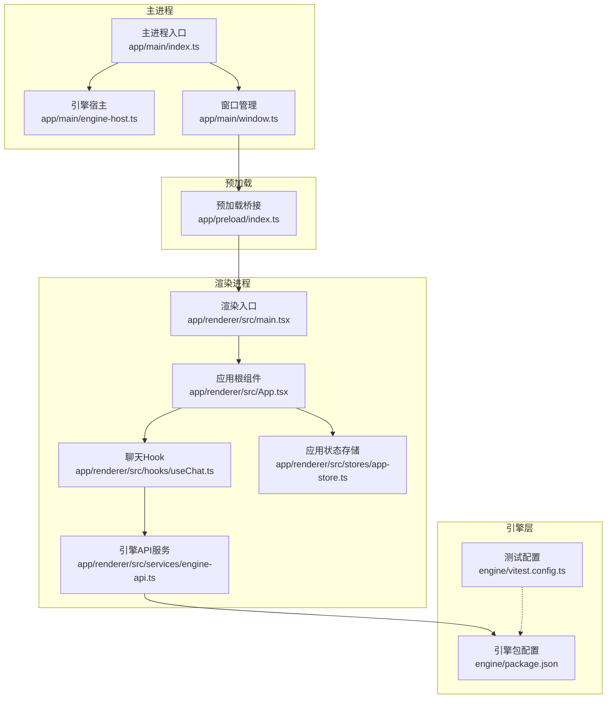
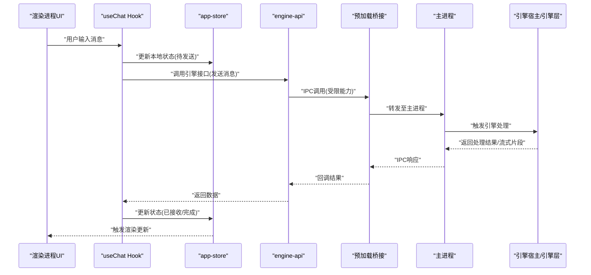
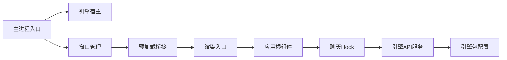

# 性能调优

<cite>
**本文引用的文件**   
- [app/main/index.ts](file://app/main/index.ts)
- [app/main/engine-host.ts](file://app/main/engine-host.ts)
- [app/main/window.ts](file://app/main/window.ts)
- [app/preload/index.ts](file://app/preload/index.ts)
- [app/renderer/src/main.tsx](file://app/renderer/src/main.tsx)
- [app/renderer/src/App.tsx](file://app/renderer/src/App.tsx)
- [app/renderer/src/hooks/useChat.ts](file://app/renderer/src/hooks/useChat.ts)
- [app/renderer/src/services/engine-api.ts](file://app/renderer/src/services/engine-api.ts)
- [app/renderer/src/stores/app-store.ts](file://app/renderer/src/stores/app-store.ts)
- [engine/package.json](file://engine/package.json)
- [engine/vitest.config.ts](file://engine/vitest.config.ts)
</cite>

## 目录
1. [简介](#简介)
2. [项目结构](#项目结构)
3. [核心组件](#核心组件)
4. [架构总览](#架构总览)
5. [详细组件分析](#详细组件分析)
6. [依赖分析](#依赖分析)
7. [性能考虑](#性能考虑)
8. [故障排查指南](#故障排查指南)
9. [结论](#结论)
10. [附录](#附录)

## 简介
本指南面向KCoder项目的性能调优，覆盖内存泄漏检测、CPU使用优化、网络请求优化、数据库性能调优、前端渲染与状态管理优化、监控指标设定与性能测试策略。文档结合仓库中的Electron主进程、预加载脚本、渲染进程以及引擎层（engine）的入口与关键模块，给出可落地的优化建议与验证方法。

## 项目结构
KCoder采用Electron多进程架构：
- 主进程负责应用生命周期、窗口管理与引擎宿主协调
- 预加载桥接主进程能力到渲染进程
- 渲染进程基于React构建UI，通过服务层调用引擎API
- 引擎层提供核心执行能力，包含HTTP、领域、基础设施等包

图表来源
- [app/main/index.ts](file://app/main/index.ts)
- [app/main/engine-host.ts](file://app/main/engine-host.ts)
- [app/main/window.ts](file://app/main/window.ts)
- [app/preload/index.ts](file://app/preload/index.ts)
- [app/renderer/src/main.tsx](file://app/renderer/src/main.tsx)
- [app/renderer/src/App.tsx](file://app/renderer/src/App.tsx)
- [app/renderer/src/hooks/useChat.ts](file://app/renderer/src/hooks/useChat.ts)
- [app/renderer/src/services/engine-api.ts](file://app/renderer/src/services/engine-api.ts)
- [engine/package.json](file://engine/package.json)
- [engine/vitest.config.ts](file://engine/vitest.config.ts)

章节来源
- [app/main/index.ts](file://app/main/index.ts)
- [app/main/engine-host.ts](file://app/main/engine-host.ts)
- [app/main/window.ts](file://app/main/window.ts)
- [app/preload/index.ts](file://app/preload/index.ts)
- [app/renderer/src/main.tsx](file://app/renderer/src/main.tsx)
- [app/renderer/src/App.tsx](file://app/renderer/src/App.tsx)
- [app/renderer/src/hooks/useChat.ts](file://app/renderer/src/hooks/useChat.ts)
- [app/renderer/src/services/engine-api.ts](file://app/renderer/src/services/engine-api.ts)
- [engine/package.json](file://engine/package.json)
- [engine/vitest.config.ts](file://engine/vitest.config.ts)

## 核心组件
- 主进程入口与引擎宿主：负责启动引擎、管理进程间通信、资源隔离与生命周期控制
- 窗口管理：创建与销毁渲染窗口，绑定预加载脚本，控制渲染上下文
- 预加载桥接：暴露安全的能力给渲染进程，限制直接访问Node/Electron API
- 渲染入口与根组件：初始化React应用、挂载路由与全局状态
- Hook与服务层：封装业务逻辑与远程调用，统一错误处理与重试策略
- 状态存储：集中式状态管理，避免过度重渲染
- 引擎层：提供HTTP、领域模型、持久化、任务调度等能力

章节来源
- [app/main/index.ts](file://app/main/index.ts)
- [app/main/engine-host.ts](file://app/main/engine-host.ts)
- [app/main/window.ts](file://app/main/window.ts)
- [app/preload/index.ts](file://app/preload/index.ts)
- [app/renderer/src/main.tsx](file://app/renderer/src/main.tsx)
- [app/renderer/src/App.tsx](file://app/renderer/src/App.tsx)
- [app/renderer/src/hooks/useChat.ts](file://app/renderer/src/hooks/useChat.ts)
- [app/renderer/src/services/engine-api.ts](file://app/renderer/src/services/engine-api.ts)
- [engine/package.json](file://engine/package.json)

## 架构总览
下图展示从渲染进程发起聊天消息到引擎处理的端到端流程，包括状态更新与结果回传。

图表来源
- [app/renderer/src/hooks/useChat.ts](file://app/renderer/src/hooks/useChat.ts)
- [app/renderer/src/services/engine-api.ts](file://app/renderer/src/services/engine-api.ts)
- [app/preload/index.ts](file://app/preload/index.ts)
- [app/main/index.ts](file://app/main/index.ts)
- [app/main/engine-host.ts](file://app/main/engine-host.ts)
- [app/renderer/src/stores/app-store.ts](file://app/renderer/src/stores/app-store.ts)

## 详细组件分析

### 主进程与引擎宿主
- 职责：初始化引擎、注册IPC通道、管理引擎实例生命周期、错误恢复与重启
- 性能要点：
  - 避免在主线程进行阻塞I/O；将耗时操作下沉到引擎或Worker
  - 合理设置引擎进程的内存上限与崩溃回收策略
  - 复用引擎连接，减少频繁创建/销毁带来的开销

章节来源
- [app/main/index.ts](file://app/main/index.ts)
- [app/main/engine-host.ts](file://app/main/engine-host.ts)

### 窗口管理与预加载桥接
- 职责：创建渲染窗口、注入预加载脚本、控制窗口可见性与资源释放
- 性能要点：
  - 按需创建窗口，及时销毁未使用的窗口实例
  - 预加载仅暴露必要能力，降低渲染进程的安全面与复杂度
  - 监听窗口关闭事件，清理定时器与事件监听器，防止内存泄漏

章节来源
- [app/main/window.ts](file://app/main/window.ts)
- [app/preload/index.ts](file://app/preload/index.ts)

### 渲染入口与根组件
- 职责：初始化React应用、挂载根组件、配置全局样式与路由
- 性能要点：
  - 延迟加载非首屏资源，提升首屏时间
  - 拆分大组件为小模块，按需引入
  - 避免在根组件中执行重型计算

章节来源
- [app/renderer/src/main.tsx](file://app/renderer/src/main.tsx)
- [app/renderer/src/App.tsx](file://app/renderer/src/App.tsx)

### Hook与服务层
- 职责：封装聊天业务逻辑、调用引擎API、处理错误与重试
- 性能要点：
  - 合并高频请求，使用防抖/节流减少重复调用
  - 对长时任务采用分片与进度上报，避免阻塞UI
  - 缓存热点数据，减少不必要的远程调用

章节来源
- [app/renderer/src/hooks/useChat.ts](file://app/renderer/src/hooks/useChat.ts)
- [app/renderer/src/services/engine-api.ts](file://app/renderer/src/services/engine-api.ts)

### 状态存储
- 职责：集中管理应用状态，提供订阅与更新机制
- 性能要点：
  - 细粒度选择器，避免全量订阅导致的重渲染
  - 批量更新状态，减少多次setState带来的抖动
  - 持久化关键状态，缩短冷启动时间

章节来源
- [app/renderer/src/stores/app-store.ts](file://app/renderer/src/stores/app-store.ts)

### 引擎层
- 职责：提供HTTP、领域、基础设施、任务调度等核心能力
- 性能要点：
  - 连接池与并发控制，避免资源耗尽
  - 异步流水线与背压，保证高负载下的稳定性
  - 可观测性埋点，便于定位瓶颈

章节来源
- [engine/package.json](file://engine/package.json)

## 依赖分析
- 主进程依赖引擎宿主与窗口管理，形成稳定的上层编排
- 渲染进程通过预加载桥接与主进程通信，服务层屏蔽IPC细节
- 引擎层作为独立包，提供跨进程的核心能力，测试配置位于engine目录

图表来源
- [app/main/index.ts](file://app/main/index.ts)
- [app/main/engine-host.ts](file://app/main/engine-host.ts)
- [app/main/window.ts](file://app/main/window.ts)
- [app/preload/index.ts](file://app/preload/index.ts)
- [app/renderer/src/main.tsx](file://app/renderer/src/main.tsx)
- [app/renderer/src/App.tsx](file://app/renderer/src/App.tsx)
- [app/renderer/src/hooks/useChat.ts](file://app/renderer/src/hooks/useChat.ts)
- [app/renderer/src/services/engine-api.ts](file://app/renderer/src/services/engine-api.ts)
- [engine/package.json](file://engine/package.json)

章节来源
- [app/main/index.ts](file://app/main/index.ts)
- [app/main/engine-host.ts](file://app/main/engine-host.ts)
- [app/main/window.ts](file://app/main/window.ts)
- [app/preload/index.ts](file://app/preload/index.ts)
- [app/renderer/src/main.tsx](file://app/renderer/src/main.tsx)
- [app/renderer/src/App.tsx](file://app/renderer/src/App.tsx)
- [app/renderer/src/hooks/useChat.ts](file://app/renderer/src/hooks/useChat.ts)
- [app/renderer/src/services/engine-api.ts](file://app/renderer/src/services/engine-api.ts)
- [engine/package.json](file://engine/package.json)

## 性能考虑

### 内存泄漏检测方法
- 内存快照对比
  - 在典型操作流程前后采集堆快照，比较对象数量与大小变化，识别持续增长的对象类型
  - 关注DOM节点、事件监听器、定时器、闭包引用导致的残留
- 垃圾回收分析
  - 强制GC后观察堆增长是否回落，若仍增长则存在强引用链
  - 使用采样分析定位热点分配路径
- 对象生命周期追踪
  - 为关键对象添加创建/销毁日志，核对生命周期是否符合预期
  - 检查异步回调与Promise链是否被意外持有

章节来源
- [app/main/window.ts](file://app/main/window.ts)
- [app/preload/index.ts](file://app/preload/index.ts)
- [app/renderer/src/hooks/useChat.ts](file://app/renderer/src/hooks/useChat.ts)
- [app/renderer/src/services/engine-api.ts](file://app/renderer/src/services/engine-api.ts)

### CPU使用优化技巧
- 算法复杂度优化
  - 对大数据集采用增量计算与懒加载，避免一次性处理
  - 使用合适的数据结构与查找表，降低时间复杂度
- 异步处理优化
  - 将阻塞操作移至后台线程或引擎侧，保持UI线程流畅
  - 使用队列与背压控制，避免瞬时峰值导致卡顿
- 计算密集型任务处理策略
  - 分片执行与进度上报，允许中断与恢复
  - 利用Web Worker或引擎Worker并行计算，减轻主线程压力

章节来源
- [app/renderer/src/hooks/useChat.ts](file://app/renderer/src/hooks/useChat.ts)
- [app/renderer/src/services/engine-api.ts](file://app/renderer/src/services/engine-api.ts)
- [engine/package.json](file://engine/package.json)

### 网络请求优化方法
- 请求合并
  - 对短时间内的重复请求进行去重与合并，减少带宽占用
- 缓存策略
  - 针对静态资源与热点数据实施强缓存与协商缓存
  - 区分读写路径，写操作失效相关缓存
- 连接池配置
  - 合理设置最大连接数与空闲超时，避免连接泄露
  - 启用Keep-Alive，减少握手开销
- 带宽使用优化
  - 压缩传输内容，按需加载图片与媒体资源
  - 分页与增量拉取，避免一次性下载大量数据

章节来源
- [app/renderer/src/services/engine-api.ts](file://app/renderer/src/services/engine-api.ts)
- [engine/package.json](file://engine/package.json)

### 数据库性能调优
- 索引优化
  - 根据查询模式建立复合索引，避免全表扫描
  - 定期分析慢查询，调整索引策略
- 查询优化
  - 避免SELECT *，只选取必要字段
  - 使用EXPLAIN分析执行计划，消除N+1问题
- 连接池配置
  - 根据并发与负载设置最小/最大连接数与超时
  - 监控连接等待时间与活跃连接数，动态扩容

章节来源
- [engine/package.json](file://engine/package.json)

### 前端性能优化
- React组件渲染优化
  - 使用memo与useMemo避免不必要的重渲染
  - 列表虚拟化，仅渲染可视区域
- 状态管理优化
  - 细粒度选择器，局部订阅
  - 批量更新与惰性初始化
- 资源加载优化
  - 代码分割与懒加载，减少首屏体积
  - 预加载关键资源，提升交互响应速度

章节来源
- [app/renderer/src/App.tsx](file://app/renderer/src/App.tsx)
- [app/renderer/src/hooks/useChat.ts](file://app/renderer/src/hooks/useChat.ts)
- [app/renderer/src/stores/app-store.ts](file://app/renderer/src/stores/app-store.ts)

### 性能监控指标的设定与分析方法
- 关键指标
  - 首屏时间、交互延迟、帧率、内存峰值、GC频率、CPU占用、网络吞吐与错误率
- 分析方法
  - 基线对比：版本发布前后指标对比，识别回归
  - 热点定位：结合火焰图与堆快照，定位瓶颈
  - 趋势分析：长期监控，发现缓慢增长的异常

章节来源
- [engine/vitest.config.ts](file://engine/vitest.config.ts)
- [engine/package.json](file://engine/package.json)

### 性能测试的实施策略
- 基准测试
  - 对核心路径建立基准用例，自动化回归
- 负载测试
  - 模拟高并发场景，评估系统稳定性与资源消耗
- 混沌工程
  - 注入延迟与失败，验证容错与恢复能力

章节来源
- [engine/vitest.config.ts](file://engine/vitest.config.ts)
- [engine/package.json](file://engine/package.json)

## 故障排查指南
- 常见内存泄漏症状
  - 长时间运行后内存持续上升，GC无法回收
  - 窗口关闭后仍有对象存活
- 排查步骤
  - 采集前后堆快照，对比差异对象
  - 检查事件监听器与定时器是否在正确时机移除
  - 审查异步回调与Promise链是否存在循环引用
- 工具与方法
  - 使用浏览器/DevTools的内存面板进行采样与对比
  - 在关键路径添加日志，辅助定位泄漏点

章节来源
- [app/main/window.ts](file://app/main/window.ts)
- [app/preload/index.ts](file://app/preload/index.ts)
- [app/renderer/src/hooks/useChat.ts](file://app/renderer/src/hooks/useChat.ts)
- [app/renderer/src/services/engine-api.ts](file://app/renderer/src/services/engine-api.ts)

## 结论
通过对主进程、渲染进程与引擎层的系统性优化，结合严格的内存与CPU监控、网络与数据库调优、前端渲染与状态管理改进，以及完善的性能测试与监控体系，KCoder可在高负载下保持稳定与高效。建议将上述实践纳入CI/CD流程，持续度量与回归，确保性能不随迭代退化。

## 附录
- 术语说明
  - IPC：进程间通信
  - GC：垃圾回收
  - 背压：在高负载下控制生产速率以避免过载
- 参考配置
  - 引擎包与测试配置文件用于定位依赖与测试环境

章节来源
- [engine/package.json](file://engine/package.json)
- [engine/vitest.config.ts](file://engine/vitest.config.ts)