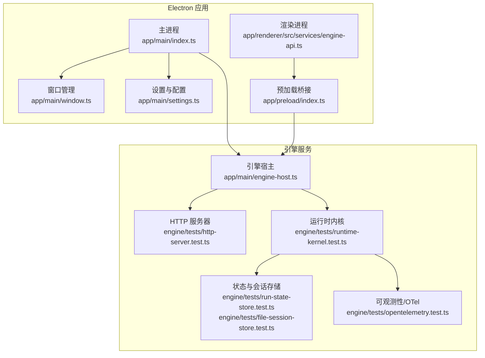
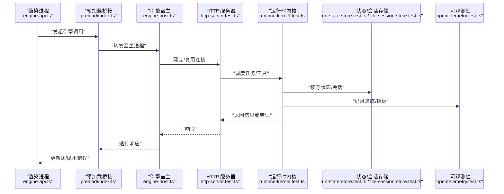
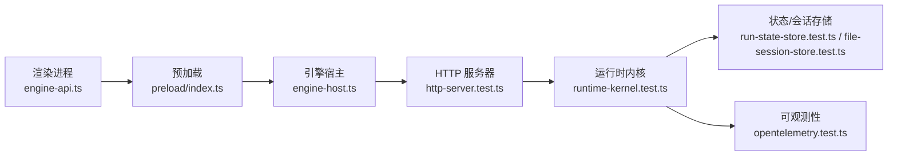

# 故障排除

<cite>
**本文引用的文件**   
- [app/main/index.ts](file://app/main/index.ts)
- [app/main/engine-host.ts](file://app/main/engine-host.ts)
- [app/main/window.ts](file://app/main/window.ts)
- [app/main/settings.ts](file://app/main/settings.ts)
- [app/preload/index.ts](file://app/preload/index.ts)
- [app/renderer/src/services/engine-api.ts](file://app/renderer/src/services/engine-api.ts)
- [app/renderer/src/stores/app-store.ts](file://app/renderer/src/stores/app-store.ts)
- [engine/scripts/verify-crash-recovery.mjs](file://engine/scripts/verify-crash-recovery.mjs)
- [engine/tests/runtime-kernel-crash-recovery.test.ts](file://engine/tests/runtime-kernel-crash-recovery.test.ts)
- [engine/tests/http-server.test.ts](file://engine/tests/http-server.test.ts)
- [engine/tests/opentelemetry.test.ts](file://engine/tests/opentelemetry.test.ts)
- [engine/tests/tool-call-repair.test.ts](file://engine/tests/tool-call-repair.test.ts)
- [engine/tests/tool-dispatch-errors.test.ts](file://engine/tests/tool-dispatch-errors.test.ts)
- [engine/tests/task-state-builder.test.ts](file://engine/tests/task-state-builder.test.ts)
- [engine/tests/file-session-store.test.ts](file://engine/tests/file-session-store.test.ts)
- [engine/tests/run-state-store.test.ts](file://engine/tests/run-state-store.test.ts)
- [engine/tests/compaction-governor.test.ts](file://engine/tests/compaction-governor.test.ts)
- [engine/tests/loop-runner.test.ts](file://engine/tests/loop-runner.test.ts)
- [engine/tests/model-history-repair.test.ts](file://engine/tests/model-history-repair.test.ts)
- [engine/tests/request-history-hygiene.test.ts](file://engine/tests/request-history-hygiene.test.ts)
- [engine/tests/http-artifacts.test.ts](file://engine/tests/http-artifacts.test.ts)
- [engine/tests/mcp-config.test.ts](file://engine/tests/mcp-config.test.ts)
- [engine/tests/mcp-tool-provider.test.ts](file://engine/tests/mcp-tool-provider.test.ts)
- [engine/tests/skill-mcp-bridge.test.ts](file://engine/tests/skill-mcp-bridge.test.ts)
- [engine/tests/delegation-runtime.test.ts](file://engine/tests/delegation-runtime.test.ts)
- [engine/tests/tool-coordinator-runtime.test.ts](file://engine/tests/tool-coordinator-runtime.test.ts)
- [engine/tests/tool-runtime-v3.test.ts](file://engine/tests/tool-runtime-v3.test.ts)
- [engine/tests/execution-graph.test.ts](file://engine/tests/execution-graph.test.ts)
- [engine/tests/context-compactor.test.ts](file://engine/tests/context-compactor.test.ts)
- [engine/tests/memory-store.test.ts](file://engine/tests/memory-store.test.ts)
- [engine/tests/cache.test.ts](file://engine/tests/cache.test.ts)
- [engine/tests/usage-service.test.ts](file://engine/tests/usage-service.test.ts)
- [engine/tests/turn-event-bus.test.ts](file://engine/tests/turn-event-bus.test.ts)
- [engine/tests/turn-state-store.test.ts](file://engine/tests/turn-state-store.test.ts)
- [engine/tests/evented-loop.test.ts](file://engine/tests/evented-loop.test.ts)
- [engine/tests/continuation-policy.test.ts](file://engine/tests/continuation-policy.test.ts)
- [engine/tests/legacy-task-state-migration.test.ts](file://engine/tests/legacy-task-state-migration.test.ts)
- [engine/tests/task-context-recovery.test.ts](file://engine/tests/task-context-recovery.test.ts)
- [engine/tests/task-continuity-production-path.test.ts](file://engine/tests/task-continuity-production-path.test.ts)
- [engine/tests/durable-task-capsule.test.ts](file://engine/tests/durable-task-capsule.test.ts)
- [engine/tests/effect-commit.test.ts](file://engine/tests/effect-commit.test.ts)
- [engine/tests/effect-result-store.test.ts](file://engine/tests/effect-result-store.test.ts)
- [engine/tests/compaction-transaction.test.ts](file://engine/tests/compaction-transaction.test.ts)
- [engine/tests/ports.test.ts](file://engine/tests/ports.test.ts)
- [engine/tests/kernel-v3-node-handlers.test.ts](file://engine/tests/kernel-v3-node-handlers.test.ts)
- [engine/tests/kernel-v3-provider-governance.test.ts](file://engine/tests/kernel-v3-provider-governance.test.ts)
- [engine/tests/runtime-kernel-e2e.test.ts](file://engine/tests/runtime-kernel-e2e.test.ts)
- [engine/tests/runtime-kernel-isolation.test.ts](file://engine/tests/runtime-kernel-isolation.test.ts)
- [engine/tests/runtime-kernel-parity.test.ts](file://engine/tests/runtime-kernel-parity.test.ts)
- [engine/tests/runtime-kernel-provider-matrix.test.ts](file://engine/tests/runtime-kernel-provider-matrix.test.ts)
- [engine/tests/runtime-kernel-replay.test.ts](file://engine/tests/runtime-kernel-replay.test.ts)
- [engine/tests/runtime-kernel.test.ts](file://engine/tests/runtime-kernel.test.ts)
- [engine/tests/runtime-middleware-governance.test.ts](file://engine/tests/runtime-middleware-governance.test.ts)
- [engine/tests/runtime-middleware.test.ts](file://engine/tests/runtime-middleware.test.ts)
- [engine/tests/runtime-rollout.test.ts](file://engine/tests/runtime-rollout.test.ts)
- [engine/tests/runtime-factory.test.ts](file://engine/tests/runtime-factory.test.ts)
- [engine/tests/runtime-factory-rollout.test.ts](file://engine/tests/runtime-factory-rollout.test.ts)
- [engine/tests/serve.test.ts](file://engine/tests/serve.test.ts)
- [engine/tests/thread-service.test.ts](file://engine/tests/thread-service.test.ts)
- [engine/tests/web-tool-provider.test.ts](file://engine/tests/web-tool-provider.test.ts)
- [engine/tests/work-mode-skill-runtime.test.ts](file://engine/tests/work-mode-skill-runtime.test.ts)
</cite>

## 目录
1. [简介](#简介)
2. [项目结构](#项目结构)
3. [核心组件](#核心组件)
4. [架构总览](#架构总览)
5. [详细组件分析](#详细组件分析)
6. [依赖分析](#依赖分析)
7. [性能考虑](#性能考虑)
8. [故障排除指南](#故障排除指南)
9. [结论](#结论)
10. [附录](#附录)

## 简介
本指南面向KCoder的运维与开发者，聚焦于“如何快速定位并解决问题”。内容覆盖启动失败、连接错误、性能问题等典型症状的诊断方法；日志分析与调试工具使用；崩溃恢复机制与错误处理策略；系统健康检查与监控指标解读；以及紧急情况处理流程与社区支持渠道。文档中的实践建议均基于仓库内现有实现与测试用例进行归纳总结。

## 项目结构
KCoder采用Electron多进程架构：主进程负责应用生命周期、窗口管理与引擎宿主；预加载桥接渲染进程与主进程；渲染进程提供UI与业务交互；引擎为独立的可插拔服务层，提供任务执行、工具编排、持久化与可观测性能力。

图表来源
- [app/main/index.ts](file://app/main/index.ts)
- [app/main/window.ts](file://app/main/window.ts)
- [app/main/settings.ts](file://app/main/settings.ts)
- [app/main/engine-host.ts](file://app/main/engine-host.ts)
- [app/preload/index.ts](file://app/preload/index.ts)
- [app/renderer/src/services/engine-api.ts](file://app/renderer/src/services/engine-api.ts)
- [engine/tests/http-server.test.ts](file://engine/tests/http-server.test.ts)
- [engine/tests/runtime-kernel.test.ts](file://engine/tests/runtime-kernel.test.ts)
- [engine/tests/run-state-store.test.ts](file://engine/tests/run-state-store.test.ts)
- [engine/tests/file-session-store.test.ts](file://engine/tests/file-session-store.test.ts)
- [engine/tests/opentelemetry.test.ts](file://engine/tests/opentelemetry.test.ts)

章节来源
- [app/main/index.ts](file://app/main/index.ts)
- [app/main/engine-host.ts](file://app/main/engine-host.ts)
- [app/main/window.ts](file://app/main/window.ts)
- [app/main/settings.ts](file://app/main/settings.ts)
- [app/preload/index.ts](file://app/preload/index.ts)
- [app/renderer/src/services/engine-api.ts](file://app/renderer/src/services/engine-api.ts)

## 核心组件
- 主进程与应用入口：负责初始化窗口、菜单、设置与引擎宿主，统一异常捕获与退出逻辑。
- 引擎宿主：在应用内启动或连接引擎服务，暴露稳定的IPC接口给渲染进程。
- 渲染进程API：封装对引擎的调用（如聊天、任务执行），处理网络与重试。
- 引擎服务：包含HTTP服务器、运行时内核、状态与会话存储、可观测性等子系统。

章节来源
- [app/main/index.ts](file://app/main/index.ts)
- [app/main/engine-host.ts](file://app/main/engine-host.ts)
- [app/renderer/src/services/engine-api.ts](file://app/renderer/src/services/engine-api.ts)
- [engine/tests/http-server.test.ts](file://engine/tests/http-server.test.ts)
- [engine/tests/runtime-kernel.test.ts](file://engine/tests/runtime-kernel.test.ts)

## 架构总览
下图展示了从渲染进程到引擎服务的请求链路，包括错误传播与可观测性埋点位置。

图表来源
- [app/renderer/src/services/engine-api.ts](file://app/renderer/src/services/engine-api.ts)
- [app/preload/index.ts](file://app/preload/index.ts)
- [app/main/engine-host.ts](file://app/main/engine-host.ts)
- [engine/tests/http-server.test.ts](file://engine/tests/http-server.test.ts)
- [engine/tests/runtime-kernel.test.ts](file://engine/tests/runtime-kernel.test.ts)
- [engine/tests/run-state-store.test.ts](file://engine/tests/run-state-store.test.ts)
- [engine/tests/file-session-store.test.ts](file://engine/tests/file-session-store.test.ts)
- [engine/tests/opentelemetry.test.ts](file://engine/tests/opentelemetry.test.ts)

## 详细组件分析

### 启动失败诊断
常见症状
- 应用无法打开或闪退
- 引擎服务未就绪导致功能不可用
- 端口占用或权限不足

排查步骤
- 确认主进程是否成功创建窗口与菜单，检查异常捕获与日志输出。
- 验证引擎宿主是否能正确启动或连接引擎服务，关注HTTP服务器监听与握手。
- 检查设置与配置文件路径、权限与格式是否正确。
- 若涉及外部依赖（模型提供商、MCP工具等），确认网络连通性与凭据有效性。

相关实现参考
- 主进程初始化与异常处理
- 引擎宿主启动与连接逻辑
- 窗口与设置模块

章节来源
- [app/main/index.ts](file://app/main/index.ts)
- [app/main/engine-host.ts](file://app/main/engine-host.ts)
- [app/main/window.ts](file://app/main/window.ts)
- [app/main/settings.ts](file://app/main/settings.ts)

### 连接错误诊断
常见症状
- 渲染进程无法与引擎通信
- HTTP请求超时或拒绝连接
- 跨进程消息丢失或类型不匹配

排查步骤
- 检查预加载桥接是否正确暴露IPC通道，确保渲染进程调用路径完整。
- 校验引擎HTTP服务器的地址、端口与路由，必要时通过测试用例复现。
- 查看引擎内核与中间件是否抛出连接或协议错误，结合可观测性数据定位。
- 针对MCP工具或服务，检查配置与注册表，确保工具可用。

相关实现参考
- 预加载桥接与渲染API
- HTTP服务器与内核调度
- MCP配置与工具提供者

章节来源
- [app/preload/index.ts](file://app/preload/index.ts)
- [app/renderer/src/services/engine-api.ts](file://app/renderer/src/services/engine-api.ts)
- [engine/tests/http-server.test.ts](file://engine/tests/http-server.test.ts)
- [engine/tests/runtime-kernel.test.ts](file://engine/tests/runtime-kernel.test.ts)
- [engine/tests/mcp-config.test.ts](file://engine/tests/mcp-config.test.ts)
- [engine/tests/mcp-tool-provider.test.ts](file://engine/tests/mcp-tool-provider.test.ts)

### 性能问题诊断
常见症状
- 界面卡顿或响应缓慢
- CPU占用高或内存持续增长
- 大量I/O或网络请求阻塞

排查步骤
- 使用Chrome DevTools的性能面板录制用户操作，识别热点函数与长任务。
- 在Electron中启用主进程与渲染进程的CPU/内存采样，定位泄漏源。
- 结合引擎的可观测性（OpenTelemetry）查看分布式追踪与指标，定位慢调用。
- 检查上下文压缩、缓存与会话存储策略，避免过大状态频繁序列化。

相关实现参考
- 可观测性埋点与指标收集
- 上下文压缩与事务
- 缓存与会话存储

章节来源
- [engine/tests/opentelemetry.test.ts](file://engine/tests/opentelemetry.test.ts)
- [engine/tests/context-compactor.test.ts](file://engine/tests/context-compactor.test.ts)
- [engine/tests/compaction-transaction.test.ts](file://engine/tests/compaction-transaction.test.ts)
- [engine/tests/cache.test.ts](file://engine/tests/cache.test.ts)
- [engine/tests/file-session-store.test.ts](file://engine/tests/file-session-store.test.ts)

### 崩溃恢复机制
关键要点
- 异常捕获：在主进程与引擎内核层集中捕获未处理异常，防止级联崩溃。
- 状态恢复：利用运行态与任务上下文持久化，重启后重建工作流。
- 数据一致性：通过事务与效果提交保证状态变更的原子性与可重放。

诊断与验证
- 使用崩溃恢复脚本与测试用例模拟异常场景，验证恢复路径与最终一致性。
- 检查任务状态构建器与会话存储的一致性约束。
- 观察历史修复与事件回放机制是否按预期工作。

相关实现参考
- 崩溃恢复脚本与端到端测试
- 运行内核与任务状态存储
- 效果提交与事务

章节来源
- [engine/scripts/verify-crash-recovery.mjs](file://engine/scripts/verify-crash-recovery.mjs)
- [engine/tests/runtime-kernel-crash-recovery.test.ts](file://engine/tests/runtime-kernel-crash-recovery.test.ts)
- [engine/tests/task-state-builder.test.ts](file://engine/tests/task-state-builder.test.ts)
- [engine/tests/run-state-store.test.ts](file://engine/tests/run-state-store.test.ts)
- [engine/tests/effect-commit.test.ts](file://engine/tests/effect-commit.test.ts)
- [engine/tests/effect-result-store.test.ts](file://engine/tests/effect-result-store.test.ts)
- [engine/tests/compaction-transaction.test.ts](file://engine/tests/compaction-transaction.test.ts)

### 错误处理策略
分类与重试
- 将错误分为网络类、协议类、工具执行类与资源限制类，分别制定重试与降级策略。
- 对幂等操作实施指数退避重试，非幂等操作需人工确认或补偿。
- 对工具调用失败进行修复尝试（如参数修正、回退到备用工具）。

降级与隔离
- 当上游服务不可用时，切换到只读模式或本地缓存。
- 使用隔离与治理中间件限制影响面，避免雪崩。

相关实现参考
- 工具调用修复与分发错误
- 中间件治理与隔离
- 循环与计划治理

章节来源
- [engine/tests/tool-call-repair.test.ts](file://engine/tests/tool-call-repair.test.ts)
- [engine/tests/tool-dispatch-errors.test.ts](file://engine/tests/tool-dispatch-errors.test.ts)
- [engine/tests/runtime-middleware-governance.test.ts](file://engine/tests/runtime-middleware-governance.test.ts)
- [engine/tests/runtime-kernel-isolation.test.ts](file://engine/tests/runtime-kernel-isolation.test.ts)
- [engine/tests/loop-runner.test.ts](file://engine/tests/loop-runner.test.ts)
- [engine/tests/compaction-governor.test.ts](file://engine/tests/compaction-governor.test.ts)

### 系统健康检查
方法
- 通过HTTP探针检查引擎服务存活与路由可用性。
- 检查运行内核、线程服务与事件总线是否正常。
- 校验MCP工具与服务发现是否完成。

工具
- 使用内置测试套件作为健康检查基线，自动化验证关键路径。

相关实现参考
- HTTP服务器与健康检查
- 线程服务与事件总线
- MCP桥接与工具提供者

章节来源
- [engine/tests/http-server.test.ts](file://engine/tests/http-server.test.ts)
- [engine/tests/thread-service.test.ts](file://engine/tests/thread-service.test.ts)
- [engine/tests/turn-event-bus.test.ts](file://engine/tests/turn-event-bus.test.ts)
- [engine/tests/skill-mcp-bridge.test.ts](file://engine/tests/skill-mcp-bridge.test.ts)
- [engine/tests/web-tool-provider.test.ts](file://engine/tests/web-tool-provider.test.ts)

### 监控指标的解读与分析
重点指标
- 请求延迟分布、错误率与吞吐
- 任务执行步数、循环次数与预算消耗
- 上下文大小与压缩比率
- 缓存命中率与存储写入量

分析方法
- 结合OpenTelemetry追踪ID串联前端、主进程与引擎服务。
- 对比不同版本或配置的指标差异，定位回归问题。
- 关联使用量服务与计费统计，评估成本与效率。

相关实现参考
- OpenTelemetry集成
- 使用量服务
- 事件记录与投影

章节来源
- [engine/tests/opentelemetry.test.ts](file://engine/tests/opentelemetry.test.ts)
- [engine/tests/usage-service.test.ts](file://engine/tests/usage-service.test.ts)
- [engine/tests/runtime-event-projection.test.ts](file://engine/tests/runtime-event-projection.test.ts)

### 紧急情况处理流程与应急预案
流程
- 快速止血：暂停受影响的任务或工具，切换至降级模式。
- 定位根因：通过追踪与日志聚合，锁定异常节点与输入。
- 恢复服务：利用状态恢复与事件回放重建一致状态。
- 复盘改进：补充测试用例与监控告警，完善预案。

应急工具
- 崩溃恢复脚本与演练
- 生产路径连续性测试
- 迁移与兼容性校验

章节来源
- [engine/scripts/verify-crash-recovery.mjs](file://engine/scripts/verify-crash-recovery.mjs)
- [engine/tests/task-continuity-production-path.test.ts](file://engine/tests/task-continuity-production-path.test.ts)
- [engine/tests/legacy-task-state-migration.test.ts](file://engine/tests/legacy-task-state-migration.test.ts)

### 社区支持与获取帮助
- 查阅仓库README与示例配置，了解官方支持的模型与工具链。
- 参考测试用例与脚本，复现问题并准备最小可复现场景。
- 提交Issue时附上追踪ID、关键日志片段与复现步骤。

章节来源
- [engine/README.md](file://engine/README.md)
- [engine/config.example.json](file://engine/config.example.json)

## 依赖分析
KCoder的关键依赖关系如下：渲染进程通过预加载桥接与主进程通信，主进程托管引擎宿主，引擎内部由HTTP服务器、运行时内核、存储与可观测性组成。测试覆盖了从HTTP到内核再到存储的全链路。

图表来源
- [app/renderer/src/services/engine-api.ts](file://app/renderer/src/services/engine-api.ts)
- [app/preload/index.ts](file://app/preload/index.ts)
- [app/main/engine-host.ts](file://app/main/engine-host.ts)
- [engine/tests/http-server.test.ts](file://engine/tests/http-server.test.ts)
- [engine/tests/runtime-kernel.test.ts](file://engine/tests/runtime-kernel.test.ts)
- [engine/tests/run-state-store.test.ts](file://engine/tests/run-state-store.test.ts)
- [engine/tests/file-session-store.test.ts](file://engine/tests/file-session-store.test.ts)
- [engine/tests/opentelemetry.test.ts](file://engine/tests/opentelemetry.test.ts)

章节来源
- [app/renderer/src/services/engine-api.ts](file://app/renderer/src/services/engine-api.ts)
- [app/preload/index.ts](file://app/preload/index.ts)
- [app/main/engine-host.ts](file://app/main/engine-host.ts)
- [engine/tests/http-server.test.ts](file://engine/tests/http-server.test.ts)
- [engine/tests/runtime-kernel.test.ts](file://engine/tests/runtime-kernel.test.ts)
- [engine/tests/run-state-store.test.ts](file://engine/tests/run-state-store.test.ts)
- [engine/tests/file-session-store.test.ts](file://engine/tests/file-session-store.test.ts)
- [engine/tests/opentelemetry.test.ts](file://engine/tests/opentelemetry.test.ts)

## 性能考虑
- 减少大对象序列化：控制上下文大小，启用上下文压缩与事务。
- 合理缓存：对高频读取的数据使用缓存与会话存储，降低I/O压力。
- 限流与预算：通过治理与预算控制，避免无限循环与过度调用。
- 异步与批处理：合并小请求，提升吞吐并降低锁竞争。

章节来源
- [engine/tests/context-compactor.test.ts](file://engine/tests/context-compactor.test.ts)
- [engine/tests/compaction-transaction.test.ts](file://engine/tests/compaction-transaction.test.ts)
- [engine/tests/cache.test.ts](file://engine/tests/cache.test.ts)
- [engine/tests/file-session-store.test.ts](file://engine/tests/file-session-store.test.ts)
- [engine/tests/loop-runner.test.ts](file://engine/tests/loop-runner.test.ts)
- [engine/tests/compaction-governor.test.ts](file://engine/tests/compaction-governor.test.ts)

## 故障排除指南

### 启动失败
- 现象：应用无法启动或引擎未就绪。
- 诊断：
  - 检查主进程初始化与异常捕获。
  - 验证引擎宿主启动与HTTP服务器监听。
  - 核对设置与配置文件路径与权限。
- 参考实现：
  - 主进程入口与窗口管理
  - 引擎宿主与HTTP服务器
  - 设置模块

章节来源
- [app/main/index.ts](file://app/main/index.ts)
- [app/main/window.ts](file://app/main/window.ts)
- [app/main/engine-host.ts](file://app/main/engine-host.ts)
- [app/main/settings.ts](file://app/main/settings.ts)
- [engine/tests/http-server.test.ts](file://engine/tests/http-server.test.ts)

### 连接错误
- 现象：渲染进程无法与引擎通信，HTTP请求失败。
- 诊断：
  - 检查预加载桥接与IPC通道。
  - 校验HTTP服务器地址、端口与路由。
  - 查看内核与中间件错误信息。
  - 验证MCP配置与工具提供者。
- 参考实现：
  - 预加载桥接与渲染API
  - HTTP服务器与内核
  - MCP配置与工具提供者

章节来源
- [app/preload/index.ts](file://app/preload/index.ts)
- [app/renderer/src/services/engine-api.ts](file://app/renderer/src/services/engine-api.ts)
- [engine/tests/http-server.test.ts](file://engine/tests/http-server.test.ts)
- [engine/tests/runtime-kernel.test.ts](file://engine/tests/runtime-kernel.test.ts)
- [engine/tests/mcp-config.test.ts](file://engine/tests/mcp-config.test.ts)
- [engine/tests/mcp-tool-provider.test.ts](file://engine/tests/mcp-tool-provider.test.ts)

### 性能问题
- 现象：界面卡顿、CPU/内存占用高。
- 诊断：
  - 使用DevTools与Electron调试采集性能数据。
  - 结合OpenTelemetry追踪慢调用。
  - 检查上下文压缩、缓存与会话存储策略。
- 参考实现：
  - 可观测性、上下文压缩、缓存与会话存储

章节来源
- [engine/tests/opentelemetry.test.ts](file://engine/tests/opentelemetry.test.ts)
- [engine/tests/context-compactor.test.ts](file://engine/tests/context-compactor.test.ts)
- [engine/tests/cache.test.ts](file://engine/tests/cache.test.ts)
- [engine/tests/file-session-store.test.ts](file://engine/tests/file-session-store.test.ts)

### 崩溃恢复
- 现象：异常导致任务中断或状态不一致。
- 诊断：
  - 使用崩溃恢复脚本与测试用例验证恢复路径。
  - 检查任务状态构建器与会话存储一致性。
  - 观察历史修复与事件回放。
- 参考实现：
  - 崩溃恢复脚本、运行内核、效果提交与事务

章节来源
- [engine/scripts/verify-crash-recovery.mjs](file://engine/scripts/verify-crash-recovery.mjs)
- [engine/tests/runtime-kernel-crash-recovery.test.ts](file://engine/tests/runtime-kernel-crash-recovery.test.ts)
- [engine/tests/task-state-builder.test.ts](file://engine/tests/task-state-builder.test.ts)
- [engine/tests/run-state-store.test.ts](file://engine/tests/run-state-store.test.ts)
- [engine/tests/effect-commit.test.ts](file://engine/tests/effect-commit.test.ts)
- [engine/tests/effect-result-store.test.ts](file://engine/tests/effect-result-store.test.ts)
- [engine/tests/compaction-transaction.test.ts](file://engine/tests/compaction-transaction.test.ts)

### 错误处理策略
- 分类与重试：区分错误类型，实施幂等重试与非幂等补偿。
- 降级与隔离：切换降级模式，使用中间件限制影响面。
- 工具修复：自动修复参数或回退到备用工具。
- 参考实现：
  - 工具调用修复与分发错误
  - 中间件治理与隔离
  - 循环与计划治理

章节来源
- [engine/tests/tool-call-repair.test.ts](file://engine/tests/tool-call-repair.test.ts)
- [engine/tests/tool-dispatch-errors.test.ts](file://engine/tests/tool-dispatch-errors.test.ts)
- [engine/tests/runtime-middleware-governance.test.ts](file://engine/tests/runtime-middleware-governance.test.ts)
- [engine/tests/runtime-kernel-isolation.test.ts](file://engine/tests/runtime-kernel-isolation.test.ts)
- [engine/tests/loop-runner.test.ts](file://engine/tests/loop-runner.test.ts)
- [engine/tests/compaction-governor.test.ts](file://engine/tests/compaction-governor.test.ts)

### 系统健康检查
- 方法：HTTP探针、内核与线程服务检查、事件总线与MCP工具可用性。
- 工具：内置测试套件作为健康检查基线。
- 参考实现：
  - HTTP服务器、线程服务、事件总线、MCP桥接与工具提供者

章节来源
- [engine/tests/http-server.test.ts](file://engine/tests/http-server.test.ts)
- [engine/tests/thread-service.test.ts](file://engine/tests/thread-service.test.ts)
- [engine/tests/turn-event-bus.test.ts](file://engine/tests/turn-event-bus.test.ts)
- [engine/tests/skill-mcp-bridge.test.ts](file://engine/tests/skill-mcp-bridge.test.ts)
- [engine/tests/web-tool-provider.test.ts](file://engine/tests/web-tool-provider.test.ts)

### 监控指标解读
- 重点指标：延迟、错误率、吞吐、任务步数、上下文大小、压缩比、缓存命中率、存储写入量。
- 分析方法：追踪ID串联、版本对比、使用量与成本评估。
- 参考实现：
  - OpenTelemetry、使用量服务、事件记录与投影

章节来源
- [engine/tests/opentelemetry.test.ts](file://engine/tests/opentelemetry.test.ts)
- [engine/tests/usage-service.test.ts](file://engine/tests/usage-service.test.ts)
- [engine/tests/runtime-event-projection.test.ts](file://engine/tests/runtime-event-projection.test.ts)

### 紧急情况处理流程
- 快速止血：暂停任务/工具，切换降级模式。
- 定位根因：追踪与日志聚合，锁定异常节点。
- 恢复服务：状态恢复与事件回放重建一致性。
- 复盘改进：补充测试与监控告警，完善预案。
- 参考实现：
  - 崩溃恢复脚本、生产路径连续性测试、迁移与兼容性校验

章节来源
- [engine/scripts/verify-crash-recovery.mjs](file://engine/scripts/verify-crash-recovery.mjs)
- [engine/tests/task-continuity-production-path.test.ts](file://engine/tests/task-continuity-production-path.test.ts)
- [engine/tests/legacy-task-state-migration.test.ts](file://engine/tests/legacy-task-state-migration.test.ts)

### 调试工具使用指南
- Chrome DevTools：在渲染进程中开启性能与内存面板，录制用户操作，识别热点与泄漏。
- Electron调试：启用主进程与渲染进程调试，附加调试器查看IPC与引擎调用。
- 引擎调试：结合OpenTelemetry追踪与测试套件，复现与验证问题。

章节来源
- [engine/tests/opentelemetry.test.ts](file://engine/tests/opentelemetry.test.ts)
- [engine/tests/http-server.test.ts](file://engine/tests/http-server.test.ts)
- [engine/tests/runtime-kernel.test.ts](file://engine/tests/runtime-kernel.test.ts)

## 结论
通过系统化的诊断流程、完善的日志与可观测性、健壮的崩溃恢复与错误处理策略，KCoder能够在复杂环境中保持稳定与高效。建议在日常运维中持续完善健康检查与监控告警，并结合测试套件进行回归验证，以降低故障风险与恢复时间。

## 附录

### 日志分析方法
- 日志级别设置：根据环境调整日志级别，生产环境以警告与错误为主，开发环境增加调试信息。
- 关键日志识别：关注引擎启动、HTTP握手、内核调度、存储读写与异常堆栈。
- 分析方法：结合追踪ID与时间戳，关联前后事件，定位瓶颈与异常路径。

章节来源
- [engine/tests/opentelemetry.test.ts](file://engine/tests/opentelemetry.test.ts)
- [engine/tests/http-server.test.ts](file://engine/tests/http-server.test.ts)
- [engine/tests/runtime-kernel.test.ts](file://engine/tests/runtime-kernel.test.ts)

### 性能调优清单
- 内存泄漏检测：使用DevTools与Electron内存快照对比，定位未释放引用。
- CPU使用优化：减少同步阻塞，拆分长任务，启用批处理与并发控制。
- 网络请求优化：连接复用、超时与重试策略、缓存命中提升。

章节来源
- [engine/tests/context-compactor.test.ts](file://engine/tests/context-compactor.test.ts)
- [engine/tests/cache.test.ts](file://engine/tests/cache.test.ts)
- [engine/tests/file-session-store.test.ts](file://engine/tests/file-session-store.test.ts)
- [engine/tests/loop-runner.test.ts](file://engine/tests/loop-runner.test.ts)

### 状态恢复与数据一致性
- 状态恢复：利用运行态与任务上下文持久化，重启后重建工作流。
- 数据一致性：通过事务与效果提交保证原子性与可重放。
- 参考实现：
  - 运行内核、任务状态构建器、效果提交与事务

章节来源
- [engine/tests/runtime-kernel.test.ts](file://engine/tests/runtime-kernel.test.ts)
- [engine/tests/task-state-builder.test.ts](file://engine/tests/task-state-builder.test.ts)
- [engine/tests/effect-commit.test.ts](file://engine/tests/effect-commit.test.ts)
- [engine/tests/effect-result-store.test.ts](file://engine/tests/effect-result-store.test.ts)
- [engine/tests/compaction-transaction.test.ts](file://engine/tests/compaction-transaction.test.ts)

### 常见问题速查
- 启动失败：检查主进程、引擎宿主与设置。
- 连接错误：检查预加载桥接、HTTP服务器与MCP配置。
- 性能问题：检查上下文压缩、缓存与会话存储。
- 崩溃恢复：使用恢复脚本与测试用例验证。
- 错误处理：分类错误、实施重试与降级。
- 健康检查：HTTP探针、内核与线程服务、事件总线与MCP工具。
- 监控指标：延迟、错误率、吞吐、上下文大小与压缩比。

章节来源
- [app/main/index.ts](file://app/main/index.ts)
- [app/main/engine-host.ts](file://app/main/engine-host.ts)
- [app/preload/index.ts](file://app/preload/index.ts)
- [app/renderer/src/services/engine-api.ts](file://app/renderer/src/services/engine-api.ts)
- [engine/tests/http-server.test.ts](file://engine/tests/http-server.test.ts)
- [engine/tests/runtime-kernel.test.ts](file://engine/tests/runtime-kernel.test.ts)
- [engine/tests/opentelemetry.test.ts](file://engine/tests/opentelemetry.test.ts)
- [engine/tests/context-compactor.test.ts](file://engine/tests/context-compactor.test.ts)
- [engine/tests/cache.test.ts](file://engine/tests/cache.test.ts)
- [engine/tests/file-session-store.test.ts](file://engine/tests/file-session-store.test.ts)
- [engine/tests/loop-runner.test.ts](file://engine/tests/loop-runner.test.ts)
- [engine/tests/runtime-kernel-crash-recovery.test.ts](file://engine/tests/runtime-kernel-crash-recovery.test.ts)
- [engine/tests/tool-call-repair.test.ts](file://engine/tests/tool-call-repair.test.ts)
- [engine/tests/tool-dispatch-errors.test.ts](file://engine/tests/tool-dispatch-errors.test.ts)
- [engine/tests/runtime-middleware-governance.test.ts](file://engine/tests/runtime-middleware-governance.test.ts)
- [engine/tests/runtime-kernel-isolation.test.ts](file://engine/tests/runtime-kernel-isolation.test.ts)
- [engine/tests/compaction-governor.test.ts](file://engine/tests/compaction-governor.test.ts)
- [engine/tests/thread-service.test.ts](file://engine/tests/thread-service.test.ts)
- [engine/tests/turn-event-bus.test.ts](file://engine/tests/turn-event-bus.test.ts)
- [engine/tests/skill-mcp-bridge.test.ts](file://engine/tests/skill-mcp-bridge.test.ts)
- [engine/tests/web-tool-provider.test.ts](file://engine/tests/web-tool-provider.test.ts)
- [engine/tests/usage-service.test.ts](file://engine/tests/usage-service.test.ts)
- [engine/tests/runtime-event-projection.test.ts](file://engine/tests/runtime-event-projection.test.ts)
- [engine/scripts/verify-crash-recovery.mjs](file://engine/scripts/verify-crash-recovery.mjs)
- [engine/tests/task-continuity-production-path.test.ts](file://engine/tests/task-continuity-production-path.test.ts)
- [engine/tests/legacy-task-state-migration.test.ts](file://engine/tests/legacy-task-state-migration.test.ts)