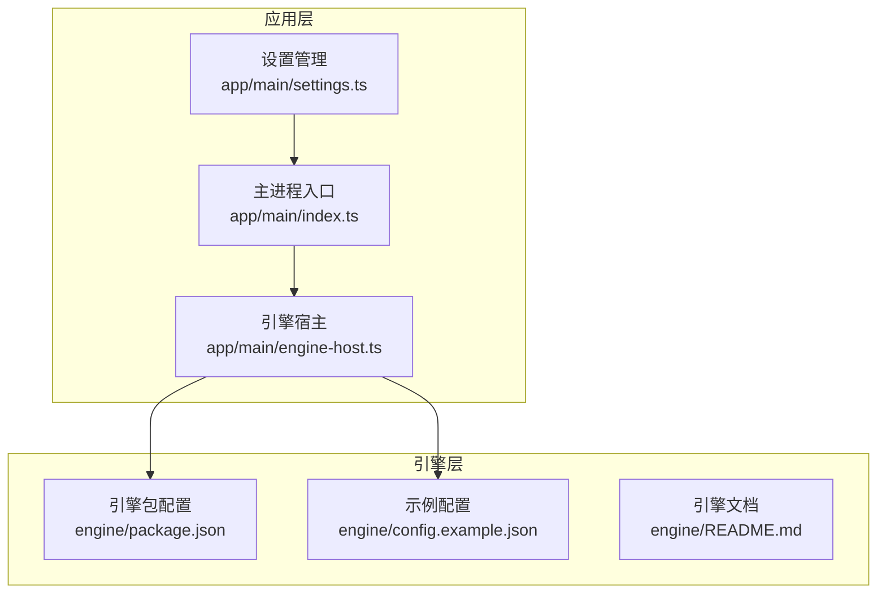
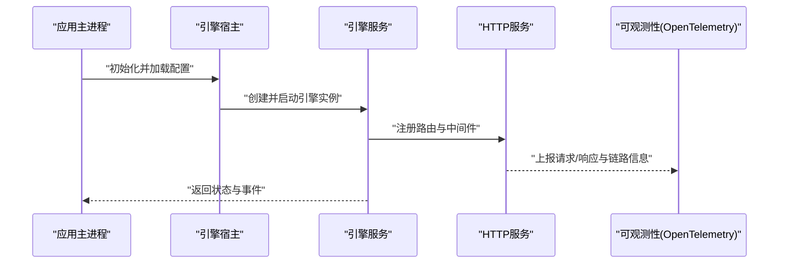
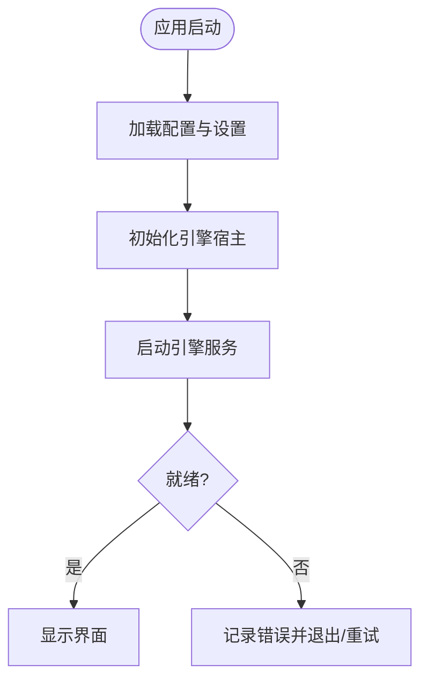
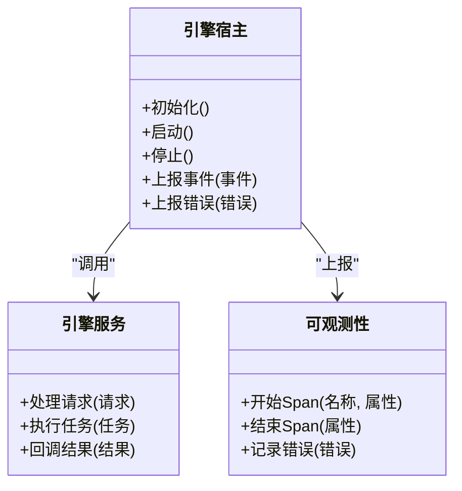
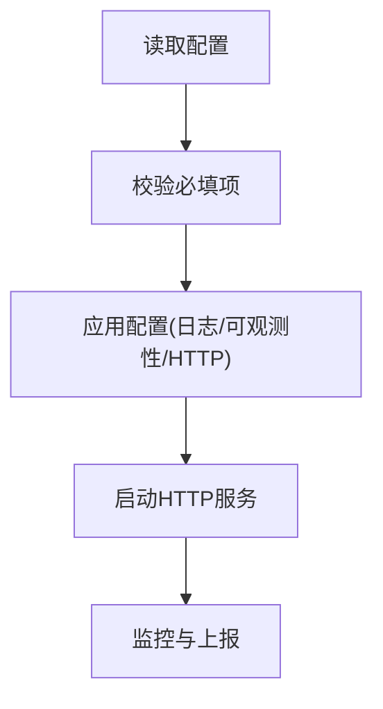
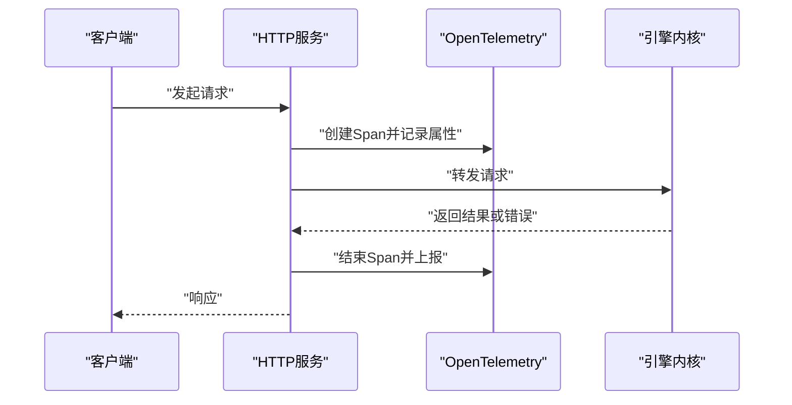
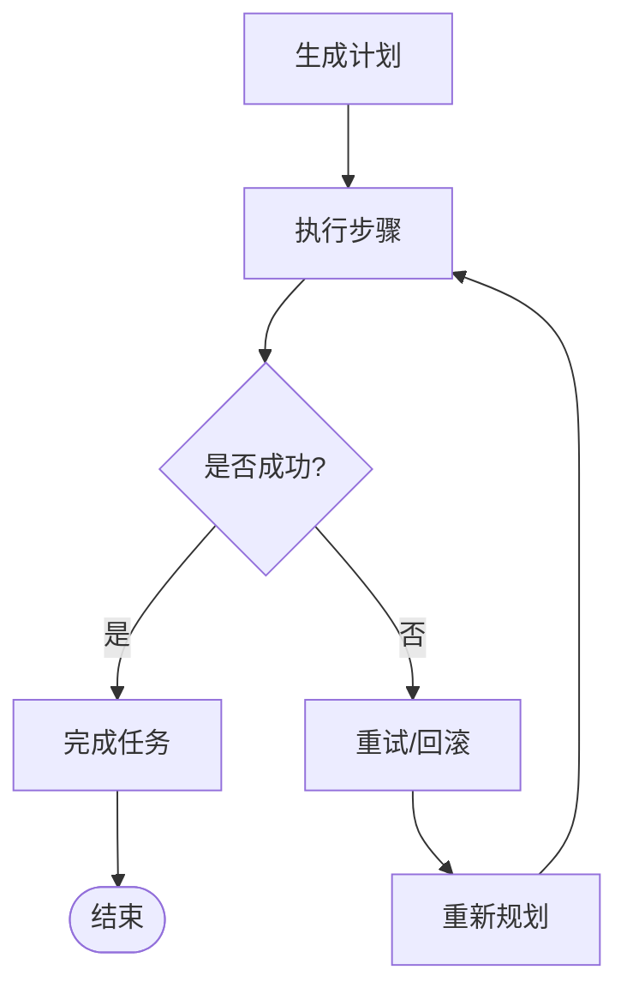
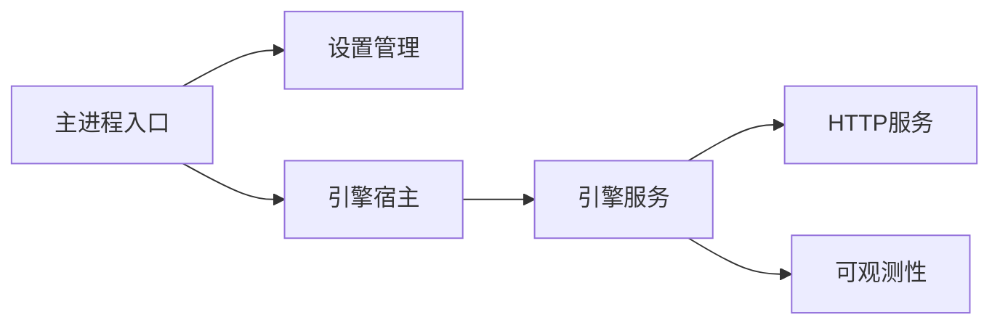

# 日志分析

<cite>
**本文引用的文件**   
- [app/main/index.ts](file://app/main/index.ts)
- [app/main/engine-host.ts](file://app/main/engine-host.ts)
- [app/main/settings.ts](file://app/main/settings.ts)
- [engine/package.json](file://engine/package.json)
- [engine/config.example.json](file://engine/config.example.json)
- [engine/README.md](file://engine/README.md)
- [engine/tests/http-server.test.ts](file://engine/tests/http-server.test.ts)
- [engine/tests/opentelemetry.test.ts](file://engine/tests/opentelemetry.test.ts)
- [engine/tests/runtime-kernel-e2e.test.ts](file://engine/tests/runtime-kernel-e2e.test.ts)
</cite>

## 目录
1. [简介](#简介)
2. [项目结构](#项目结构)
3. [核心组件](#核心组件)
4. [架构总览](#架构总览)
5. [详细组件分析](#详细组件分析)
6. [依赖分析](#依赖分析)
7. [性能考虑](#性能考虑)
8. [故障排查指南](#故障排查指南)
9. [结论](#结论)
10. [附录](#附录)

## 简介
本指南面向KCoder项目的开发与运维人员，系统化说明如何配置与使用日志能力，包括：
- 日志级别设置（调试模式、输出格式、组件级开关）
- 关键日志识别（引擎启动、AI模型调用、文件操作、错误堆栈）
- 分析方法论（时间序列、错误模式、性能指标）
- 存储位置与轮转策略
- 常用查询命令与分析工具示例
- 典型错误场景的日志特征与解决方案

## 项目结构
KCoder由前端应用（Electron主进程/渲染进程）与后端引擎（Node.js服务）组成。日志相关的关键入口与配置集中在以下位置：
- 应用主进程入口：负责初始化、加载配置、启动引擎宿主
- 引擎宿主：桥接应用与引擎，承载运行时与可观测性
- 引擎包与配置：定义运行参数、可观测性与HTTP服务行为
- 测试用例：覆盖HTTP服务可观测性、OpenTelemetry集成、端到端流程等

**图示来源** 
- [app/main/index.ts](file://app/main/index.ts)
- [app/main/engine-host.ts](file://app/main/engine-host.ts)
- [app/main/settings.ts](file://app/main/settings.ts)
- [engine/package.json](file://engine/package.json)
- [engine/config.example.json](file://engine/config.example.json)
- [engine/README.md](file://engine/README.md)

**章节来源**
- [app/main/index.ts](file://app/main/index.ts)
- [app/main/engine-host.ts](file://app/main/engine-host.ts)
- [app/main/settings.ts](file://app/main/settings.ts)
- [engine/package.json](file://engine/package.json)
- [engine/config.example.json](file://engine/config.example.json)
- [engine/README.md](file://engine/README.md)

## 核心组件
- 主进程入口：负责应用生命周期、加载配置、启动引擎宿主与窗口
- 引擎宿主：封装引擎实例化、通信通道、事件总线与可观测性接入点
- 设置管理：提供用户偏好与系统配置的读取与合并
- 引擎包与配置：包含运行参数、HTTP服务、可观测性（如OpenTelemetry）与日志相关选项
- 测试用例：验证HTTP服务可观测性、链路追踪、端到端流程中的日志与指标

**章节来源**
- [app/main/index.ts](file://app/main/index.ts)
- [app/main/engine-host.ts](file://app/main/engine-host.ts)
- [app/main/settings.ts](file://app/main/settings.ts)
- [engine/package.json](file://engine/package.json)
- [engine/config.example.json](file://engine/config.example.json)
- [engine/tests/http-server.test.ts](file://engine/tests/http-server.test.ts)
- [engine/tests/opentelemetry.test.ts](file://engine/tests/opentelemetry.test.ts)
- [engine/tests/runtime-kernel-e2e.test.ts](file://engine/tests/runtime-kernel-e2e.test.ts)

## 架构总览
下图展示了从应用到引擎的日志与可观测性路径：应用通过设置加载配置，主进程启动引擎宿主；引擎内部暴露HTTP接口并集成可观测性（如OpenTelemetry），用于采集请求、任务与错误信息。

**图示来源** 
- [app/main/index.ts](file://app/main/index.ts)
- [app/main/engine-host.ts](file://app/main/engine-host.ts)
- [engine/tests/http-server.test.ts](file://engine/tests/http-server.test.ts)
- [engine/tests/opentelemetry.test.ts](file://engine/tests/opentelemetry.test.ts)

## 详细组件分析

### 组件A：主进程入口（应用启动与配置加载）
- 职责
  - 初始化应用环境
  - 加载用户设置与系统配置
  - 启动引擎宿主与UI窗口
- 日志相关要点
  - 在启动阶段记录关键里程碑（初始化完成、引擎启动成功/失败）
  - 将设置变更事件写入日志，便于追踪配置生效时机
- 建议
  - 为启动阶段增加结构化字段（如阶段、耗时、错误码）
  - 对异常进行捕获并输出完整堆栈

**图示来源** 
- [app/main/index.ts](file://app/main/index.ts)
- [app/main/engine-host.ts](file://app/main/engine-host.ts)
- [app/main/settings.ts](file://app/main/settings.ts)

**章节来源**
- [app/main/index.ts](file://app/main/index.ts)
- [app/main/engine-host.ts](file://app/main/engine-host.ts)
- [app/main/settings.ts](file://app/main/settings.ts)

### 组件B：引擎宿主（运行时与可观测性桥接）
- 职责
  - 管理引擎生命周期
  - 处理应用与引擎之间的消息与事件
  - 接入可观测性（如OpenTelemetry）以采集请求、任务与错误
- 日志相关要点
  - 记录引擎启动、停止、重启事件
  - 记录与外部服务交互的关键步骤（如HTTP调用、模型调用）
  - 统一错误上报与堆栈收集
- 建议
  - 为每个关键操作添加traceId/spanId以便跨组件关联
  - 对长时间运行的任务记录进度与阶段性结果

**图示来源** 
- [app/main/engine-host.ts](file://app/main/engine-host.ts)
- [engine/tests/opentelemetry.test.ts](file://engine/tests/opentelemetry.test.ts)

**章节来源**
- [app/main/engine-host.ts](file://app/main/engine-host.ts)
- [engine/tests/opentelemetry.test.ts](file://engine/tests/opentelemetry.test.ts)

### 组件C：引擎包与配置（运行参数与可观测性）
- 职责
  - 定义引擎运行参数（端口、超时、并发、缓存等）
  - 集成可观测性（如OpenTelemetry）与HTTP服务
  - 提供示例配置文件与文档说明
- 日志相关要点
  - 通过配置控制日志级别、输出目标与采样率
  - 在HTTP层记录请求/响应摘要与错误
  - 在任务执行层记录关键步骤与耗时
- 建议
  - 区分开发/测试/生产环境的配置差异
  - 对敏感信息进行脱敏后再落盘或上报

**图示来源** 
- [engine/package.json](file://engine/package.json)
- [engine/config.example.json](file://engine/config.example.json)
- [engine/README.md](file://engine/README.md)
- [engine/tests/http-server.test.ts](file://engine/tests/http-server.test.ts)

**章节来源**
- [engine/package.json](file://engine/package.json)
- [engine/config.example.json](file://engine/config.example.json)
- [engine/README.md](file://engine/README.md)
- [engine/tests/http-server.test.ts](file://engine/tests/http-server.test.ts)

### 组件D：HTTP服务与可观测性（请求链路追踪）
- 职责
  - 暴露REST/内部API
  - 记录请求/响应、错误与性能指标
  - 集成OpenTelemetry生成Trace/Span
- 日志相关要点
  - 为每个请求分配唯一标识，贯穿上下游
  - 记录关键业务事件（如模型调用、文件读写）
  - 对异常进行结构化记录（错误码、上下文、堆栈）
- 建议
  - 使用统一的中间件进行日志与度量采集
  - 对高频日志进行采样以降低开销

**图示来源** 
- [engine/tests/http-server.test.ts](file://engine/tests/http-server.test.ts)
- [engine/tests/opentelemetry.test.ts](file://engine/tests/opentelemetry.test.ts)

**章节来源**
- [engine/tests/http-server.test.ts](file://engine/tests/http-server.test.ts)
- [engine/tests/opentelemetry.test.ts](file://engine/tests/opentelemetry.test.ts)

### 组件E：端到端流程（任务执行与日志）
- 职责
  - 模拟真实任务流，涵盖计划、执行、回滚与恢复
  - 记录任务状态转换与关键事件
- 日志相关要点
  - 记录任务ID、阶段、耗时与错误
  - 在失败路径记录恢复尝试与最终状态
- 建议
  - 为长任务分阶段记录，避免单条日志过长
  - 对关键决策点记录原因与依据

**图示来源** 
- [engine/tests/runtime-kernel-e2e.test.ts](file://engine/tests/runtime-kernel-e2e.test.ts)

**章节来源**
- [engine/tests/runtime-kernel-e2e.test.ts](file://engine/tests/runtime-kernel-e2e.test.ts)

## 依赖分析
- 组件耦合
  - 主进程入口依赖设置管理与引擎宿主
  - 引擎宿主依赖引擎服务与可观测性模块
  - HTTP服务与可观测性紧密耦合，用于采集请求与链路信息
- 外部依赖
  - OpenTelemetry用于分布式追踪与指标采集
  - 文件系统用于持久化日志与数据（需关注轮转策略）
- 潜在风险
  - 循环依赖应尽量避免
  - 高吞吐场景下需评估日志I/O与网络上报的性能影响

**图示来源** 
- [app/main/index.ts](file://app/main/index.ts)
- [app/main/engine-host.ts](file://app/main/engine-host.ts)
- [engine/tests/http-server.test.ts](file://engine/tests/http-server.test.ts)
- [engine/tests/opentelemetry.test.ts](file://engine/tests/opentelemetry.test.ts)

**章节来源**
- [app/main/index.ts](file://app/main/index.ts)
- [app/main/engine-host.ts](file://app/main/engine-host.ts)
- [engine/tests/http-server.test.ts](file://engine/tests/http-server.test.ts)
- [engine/tests/opentelemetry.test.ts](file://engine/tests/opentelemetry.test.ts)

## 性能考虑
- 日志级别与采样
  - 在生产环境降低默认级别，启用关键路径的详细日志
  - 对高频操作采用采样策略，避免I/O瓶颈
- 结构化与去重
  - 使用结构化字段提升检索效率
  - 对重复错误进行去重与聚合
- 异步与批处理
  - 日志写入采用异步队列与批量提交
  - 合理设置缓冲区大小与刷新间隔
- 资源隔离
  - 将日志与业务线程解耦，避免阻塞主流程
  - 对大对象进行裁剪与脱敏

[本节为通用指导，不直接分析具体文件]

## 故障排查指南
- 常见错误场景与日志特征
  - 引擎启动失败：检查启动阶段的错误码与堆栈，确认配置项是否缺失或无效
  - HTTP服务不可用：查看端口占用、权限与网络配置，确认中间件是否正确注册
  - 模型调用超时：定位对应Span与请求ID，检查上游依赖与网络状况
  - 文件操作异常：核对路径权限、磁盘空间与锁竞争情况
- 定位方法
  - 使用traceId串联跨组件日志
  - 按时间窗口筛选关键事件，结合错误堆栈快速定位根因
  - 对比正常与异常路径的差异，聚焦最近变更
- 解决建议
  - 完善错误分类与告警规则
  - 补充必要上下文字段（如用户、租户、版本）
  - 建立标准SOP与自动化脚本辅助复现与修复

**章节来源**
- [engine/tests/http-server.test.ts](file://engine/tests/http-server.test.ts)
- [engine/tests/opentelemetry.test.ts](file://engine/tests/opentelemetry.test.ts)
- [engine/tests/runtime-kernel-e2e.test.ts](file://engine/tests/runtime-kernel-e2e.test.ts)

## 结论
通过合理的日志级别、结构化输出与可观测性集成，KCoder能够在复杂的多组件环境中实现高效的故障定位与性能优化。建议在开发、测试与生产各阶段统一日志规范，并结合自动化分析工具持续提升排障效率。

[本节为总结性内容，不直接分析具体文件]

## 附录

### 日志级别设置方法
- 调试模式启用
  - 在开发环境提高日志级别，开启详细输出
  - 通过环境变量或配置文件切换调试模式
- 日志输出格式配置
  - 使用JSON结构化格式，便于机器解析
  - 固定关键字段（时间戳、级别、组件、traceId、spanId、消息）
- 不同组件的日志开关控制
  - 按模块或功能域设置独立开关
  - 支持动态调整而不重启服务

**章节来源**
- [engine/config.example.json](file://engine/config.example.json)
- [engine/README.md](file://engine/README.md)

### 关键日志识别方法
- 引擎启动日志
  - 关注初始化阶段、配置加载、依赖检查与启动成功/失败事件
- AI模型调用日志
  - 记录请求ID、模型名称、输入摘要、耗时与错误码
- 文件操作日志
  - 记录路径、操作类型（读/写/删）、权限与结果
- 错误堆栈解读技巧
  - 优先定位根因异常，忽略包装异常
  - 结合traceId与上下文字段还原调用链

**章节来源**
- [engine/tests/http-server.test.ts](file://engine/tests/http-server.test.ts)
- [engine/tests/opentelemetry.test.ts](file://engine/tests/opentelemetry.test.ts)
- [engine/tests/runtime-kernel-e2e.test.ts](file://engine/tests/runtime-kernel-e2e.test.ts)

### 日志分析方法论
- 时间序列分析
  - 按分钟/小时聚合错误数与延迟分布，识别峰值与回归
- 错误模式识别
  - 基于错误码与消息模板聚类，发现共性根因
- 性能指标提取
  - 从Span中提取P50/P95/P99延迟、吞吐与错误率

[本节为方法论概述，不直接分析具体文件]

### 日志文件存储位置与轮转策略
- 存储位置
  - 本地磁盘目录（区分应用与引擎）
  - 集中式日志平台（如ELK/Loki）
- 轮转策略
  - 按大小与时间双维度轮转
  - 保留周期与压缩归档
  - 注意权限与备份策略

[本节为通用实践，不直接分析具体文件]

### 常用日志查询命令与分析工具示例
- 命令行示例
  - 过滤特定级别与关键词
  - 按时间范围与traceId检索
  - 统计错误TopN与热点路径
- 工具建议
  - 文本分析与可视化（如Grep/AWK/Logstash/Kibana）
  - 链路追踪平台（如Jaeger/Zipkin）
  - 指标采集与告警（如Prometheus/Grafana）

[本节为工具使用建议，不直接分析具体文件]

### 典型错误场景与解决方案
- 引擎启动失败
  - 特征：启动阶段出现致命错误与堆栈
  - 方案：检查配置项、依赖服务与权限
- HTTP服务不可用
  - 特征：端口冲突或中间件注册失败
  - 方案：释放端口、修正路由与中间件顺序
- 模型调用超时
  - 特征：Span中显示超时与上游错误
  - 方案：调整超时阈值、重试与降级策略
- 文件操作异常
  - 特征：路径不存在或权限不足
  - 方案：创建目录、修正权限与清理锁文件

**章节来源**
- [engine/tests/http-server.test.ts](file://engine/tests/http-server.test.ts)
- [engine/tests/opentelemetry.test.ts](file://engine/tests/opentelemetry.test.ts)
- [engine/tests/runtime-kernel-e2e.test.ts](file://engine/tests/runtime-kernel-e2e.test.ts)