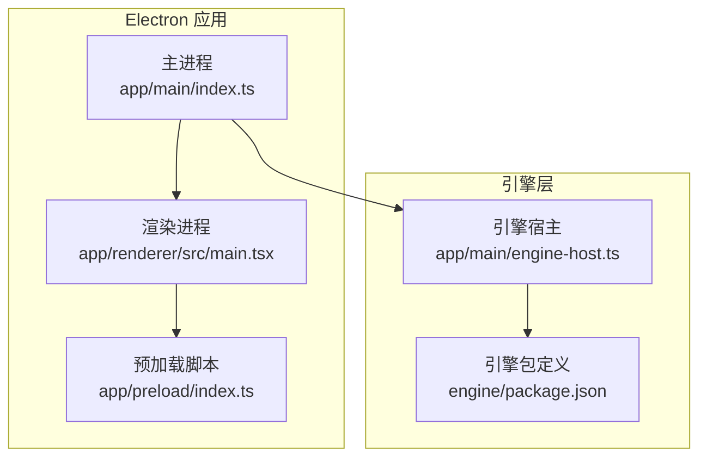
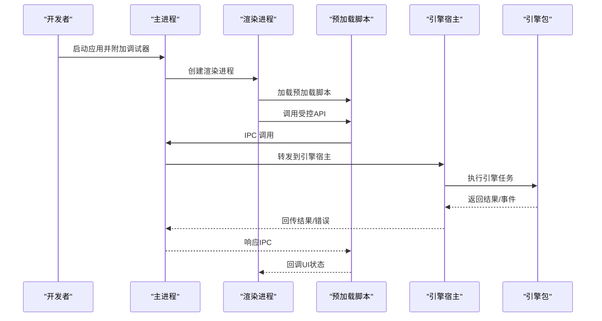
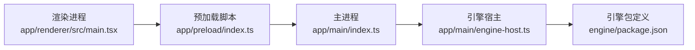

# 调试工具

<cite>
**本文引用的文件**   
- [app/main/index.ts](file://app/main/index.ts)
- [app/main/engine-host.ts](file://app/main/engine-host.ts)
- [app/preload/index.ts](file://app/preload/index.ts)
- [app/renderer/src/main.tsx](file://app/renderer/src/main.tsx)
- [app/electron.vite.config.ts](file://app/electron.vite.config.ts)
- [engine/package.json](file://engine/package.json)
</cite>

## 目录
1. [简介](#简介)
2. [项目结构](#项目结构)
3. [核心组件](#核心组件)
4. [架构总览](#架构总览)
5. [详细组件分析](#详细组件分析)
6. [依赖分析](#依赖分析)
7. [性能考虑](#性能考虑)
8. [故障排查指南](#故障排查指南)
9. [结论](#结论)
10. [附录](#附录)

## 简介
本指南面向KCoder项目的开发者与测试人员，提供一套完整的调试实践手册。内容覆盖：
- Chrome DevTools在渲染进程中的使用（渲染、网络、性能、内存）
- Electron主/渲染/子进程调试与IPC通信调试
- 引擎侧Node.js调试器使用（断点、变量、调用栈）
- VS Code调试配置示例（launch.json、tasks.json）
- 性能分析（内存泄漏检测、CPU性能分析、网络性能监控）
- 最佳实践与常见问题排查流程

## 项目结构
KCoder采用Electron + Vite构建的前端应用，结合独立的引擎模块。关键入口与调试相关位置如下：
- 主进程入口位于 app/main/index.ts
- 引擎宿主与集成逻辑位于 app/main/engine-host.ts
- 预加载脚本位于 app/preload/index.ts
- 渲染进程入口位于 app/renderer/src/main.tsx
- Vite与Electron集成配置位于 app/electron.vite.config.ts
- 引擎工作区根包定义位于 engine/package.json

图表来源
- [app/main/index.ts](file://app/main/index.ts)
- [app/main/engine-host.ts](file://app/main/engine-host.ts)
- [app/preload/index.ts](file://app/preload/index.ts)
- [app/renderer/src/main.tsx](file://app/renderer/src/main.tsx)
- [engine/package.json](file://engine/package.json)

章节来源
- [app/main/index.ts](file://app/main/index.ts)
- [app/main/engine-host.ts](file://app/main/engine-host.ts)
- [app/preload/index.ts](file://app/preload/index.ts)
- [app/renderer/src/main.tsx](file://app/renderer/src/main.tsx)
- [app/electron.vite.config.ts](file://app/electron.vite.config.ts)
- [engine/package.json](file://engine/package.json)

## 核心组件
- 主进程（Main）
  - 负责创建窗口、生命周期管理、与引擎宿主交互、IPC通道建立等。
  - 调试要点：启动参数、环境变量、端口监听、错误捕获与日志输出。
- 引擎宿主（Engine Host）
  - 封装对引擎的调用、协议适配、资源隔离与错误传播。
  - 调试要点：进程间通信、外部命令执行、日志与异常堆栈。
- 预加载脚本（Preload）
  - 暴露安全API给渲染进程，桥接主进程能力。
  - 调试要点：上下文隔离、API可用性、错误边界。
- 渲染进程（Renderer）
  - UI与用户交互逻辑，通过预加载脚本与主进程通信。
  - 调试要点：React/Vite热更新、状态管理、网络请求、性能指标。
- 引擎包（Engine Package）
  - Node.js工程，包含可独立调试的脚本与模块。
  - 调试要点：npm scripts、调试端口、断点与日志。

章节来源
- [app/main/index.ts](file://app/main/index.ts)
- [app/main/engine-host.ts](file://app/main/engine-host.ts)
- [app/preload/index.ts](file://app/preload/index.ts)
- [app/renderer/src/main.tsx](file://app/renderer/src/main.tsx)
- [engine/package.json](file://engine/package.json)

## 架构总览
下图展示了KCoder在调试视角下的进程关系与数据流：主进程作为协调者，连接渲染进程与引擎宿主；预加载脚本为渲染进程提供受控API；引擎宿主与引擎包进行交互。

图表来源
- [app/main/index.ts](file://app/main/index.ts)
- [app/main/engine-host.ts](file://app/main/engine-host.ts)
- [app/preload/index.ts](file://app/preload/index.ts)
- [app/renderer/src/main.tsx](file://app/renderer/src/main.tsx)
- [engine/package.json](file://engine/package.json)

## 详细组件分析

### Chrome DevTools 使用指南（渲染进程）
- 打开DevTools
  - 快捷键：Windows/Linux Ctrl+Shift+I，macOS Cmd+Option+I
  - 在Electron中可通过菜单或代码启用“始终显示DevTools”
- 渲染进程调试
  - Sources面板设置断点，查看调用栈与变量
  - Console面板执行表达式、打印日志
  - React DevTools（如已安装）用于组件树与状态检查
- 网络请求监控
  - Network面板过滤XHR/Fetch，查看请求头、响应体、耗时
  - 使用“Preserve log”保留跨页面请求记录
- 性能分析
  - Performance面板录制时间线，定位重排重绘与长任务
  - Memory面板拍摄快照，比较差异，查找未释放引用
- 内存快照分析
  - 拍摄Heap Snapshot，按对象类型筛选，追踪引用链
  - 使用“Comparison”对比两次快照，识别增长对象

章节来源
- [app/renderer/src/main.tsx](file://app/renderer/src/main.tsx)
- [app/preload/index.ts](file://app/preload/index.ts)

### Electron 调试技巧（主进程、IPC、多进程）
- 主进程调试
  - 使用VS Code或Node.js调试器附加到主进程
  - 在入口文件设置断点，观察窗口创建、事件循环、错误处理
- IPC通信调试
  - 在主进程与渲染进程两端分别打点，记录消息内容与耗时
  - 使用Channel名称与事件名作为关键字搜索日志
- 多进程调试
  - 为每个渲染进程开启独立DevTools实例
  - 使用进程标签页切换，避免混淆上下文
- 常用开关与环境变量
  - 启用开发模式、调试端口、日志级别等

章节来源
- [app/main/index.ts](file://app/main/index.ts)
- [app/preload/index.ts](file://app/preload/index.ts)

### 引擎调试方法（Node.js调试器）
- 启动引擎调试
  - 通过package.json的scripts添加调试命令，暴露调试端口
  - 使用VS Code“Node.js: 附加到本地进程”或命令行node --inspect
- 断点与变量查看
  - 在关键函数入口设置断点，逐步执行，检查输入输出
  - 使用Watch面板跟踪复杂数据结构变化
- 调用栈分析
  - 在异常抛出处查看完整调用栈，定位上游调用方
  - 结合日志上下文（traceId、任务ID）关联问题

章节来源
- [engine/package.json](file://engine/package.json)

### VS Code 调试配置示例
- launch.json（主进程与引擎）
  - 主进程：指定程序路径、工作目录、环境变量、调试端口
  - 引擎：使用Node.js调试器附加或内嵌运行脚本
- tasks.json（构建与预热）
  - 构建前端资源、准备引擎依赖、生成调试所需产物
- 推荐配置项
  - console: integratedTerminal
  - envFile: .env.development
  - runtimeArgs: ["--inspect", "--remote-debugging-port=9229"]

章节来源
- [app/main/index.ts](file://app/main/index.ts)
- [engine/package.json](file://engine/package.json)

### 性能分析工具使用
- 内存泄漏检测
  - 使用Chrome Memory面板拍摄多次快照，比较对象数量与大小
  - 关注长期存活对象与闭包引用
- CPU性能分析
  - 录制Performance，识别热点函数与阻塞调用
  - 结合Flame Graph分析调用开销
- 网络性能监控
  - 使用Network面板查看TTFB、下载时长、缓存命中
  - 针对大文件或频繁请求优化策略（分页、压缩、缓存）

章节来源
- [app/renderer/src/main.tsx](file://app/renderer/src/main.tsx)
- [app/main/engine-host.ts](file://app/main/engine-host.ts)

## 依赖分析
KCoder的关键依赖关系包括：
- 主进程依赖引擎宿主以完成业务逻辑
- 渲染进程通过预加载脚本访问受限API
- 引擎包由主进程间接驱动，形成跨进程协作

图表来源
- [app/main/index.ts](file://app/main/index.ts)
- [app/main/engine-host.ts](file://app/main/engine-host.ts)
- [app/preload/index.ts](file://app/preload/index.ts)
- [app/renderer/src/main.tsx](file://app/renderer/src/main.tsx)
- [engine/package.json](file://engine/package.json)

章节来源
- [app/main/index.ts](file://app/main/index.ts)
- [app/main/engine-host.ts](file://app/main/engine-host.ts)
- [app/preload/index.ts](file://app/preload/index.ts)
- [app/renderer/src/main.tsx](file://app/renderer/src/main.tsx)
- [engine/package.json](file://engine/package.json)

## 性能考虑
- 减少不必要的重渲染：合理使用React.memo、useMemo、useCallback
- 控制IPC频率：批量消息、节流与去抖
- 引擎任务异步化：避免阻塞主线程，使用队列与超时保护
- 资源清理：及时释放定时器、事件监听器与文件句柄
- 日志采样：生产环境降低日志级别，避免IO瓶颈

[本节为通用指导，不直接分析具体文件]

## 故障排查指南
- 渲染进程崩溃
  - 使用DevTools控制台查看错误堆栈
  - 检查预加载脚本API调用是否越界
- 主进程无响应
  - 确认事件循环未被长时间阻塞
  - 检查IPC通道是否死锁或未正确关闭
- 引擎执行失败
  - 查看引擎日志与返回码
  - 使用调试器进入关键函数，验证输入参数
- 内存持续增长
  - 对比多个Heap Snapshot，定位新增对象
  - 审查闭包与全局变量引用
- 网络请求异常
  - 检查代理与证书配置
  - 分析响应状态码与错误信息

章节来源
- [app/main/index.ts](file://app/main/index.ts)
- [app/main/engine-host.ts](file://app/main/engine-host.ts)
- [app/preload/index.ts](file://app/preload/index.ts)
- [app/renderer/src/main.tsx](file://app/renderer/src/main.tsx)

## 结论
通过系统化的调试方法与工具组合，可以快速定位KCoder在Electron与引擎层的各类问题。建议将调试配置纳入开发规范，配合性能分析与日志策略，持续提升稳定性与可维护性。

[本节为总结性内容，不直接分析具体文件]

## 附录
- 常用快捷键
  - 打开DevTools：Ctrl/Cmd + Shift + I
  - 重启应用：Cmd/Ctrl + R
- 参考入口与配置文件
  - 主进程入口：[app/main/index.ts](file://app/main/index.ts)
  - 引擎宿主：[app/main/engine-host.ts](file://app/main/engine-host.ts)
  - 预加载脚本：[app/preload/index.ts](file://app/preload/index.ts)
  - 渲染入口：[app/renderer/src/main.tsx](file://app/renderer/src/main.tsx)
  - Vite/Electron配置：[app/electron.vite.config.ts](file://app/electron.vite.config.ts)
  - 引擎包定义：[engine/package.json](file://engine/package.json)