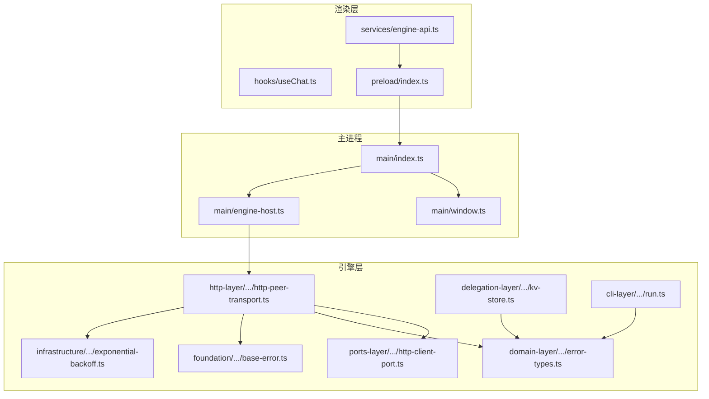
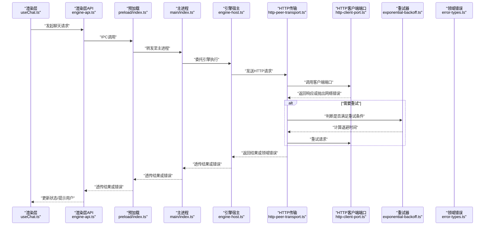
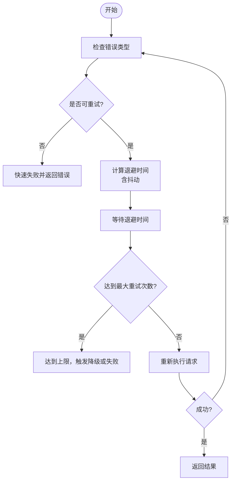
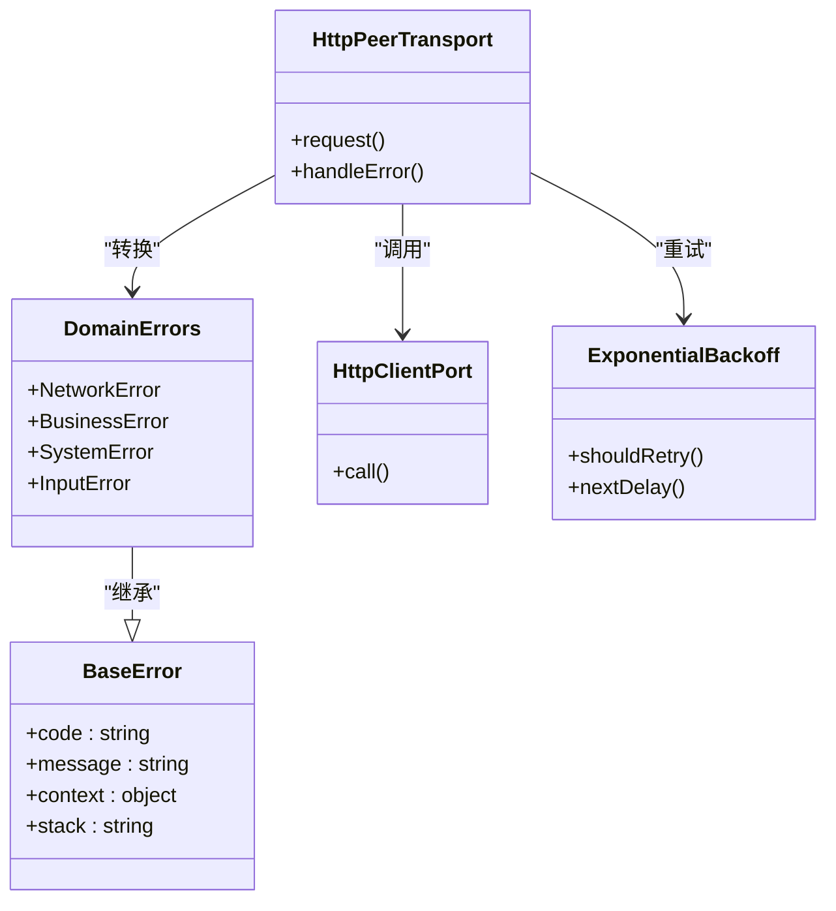
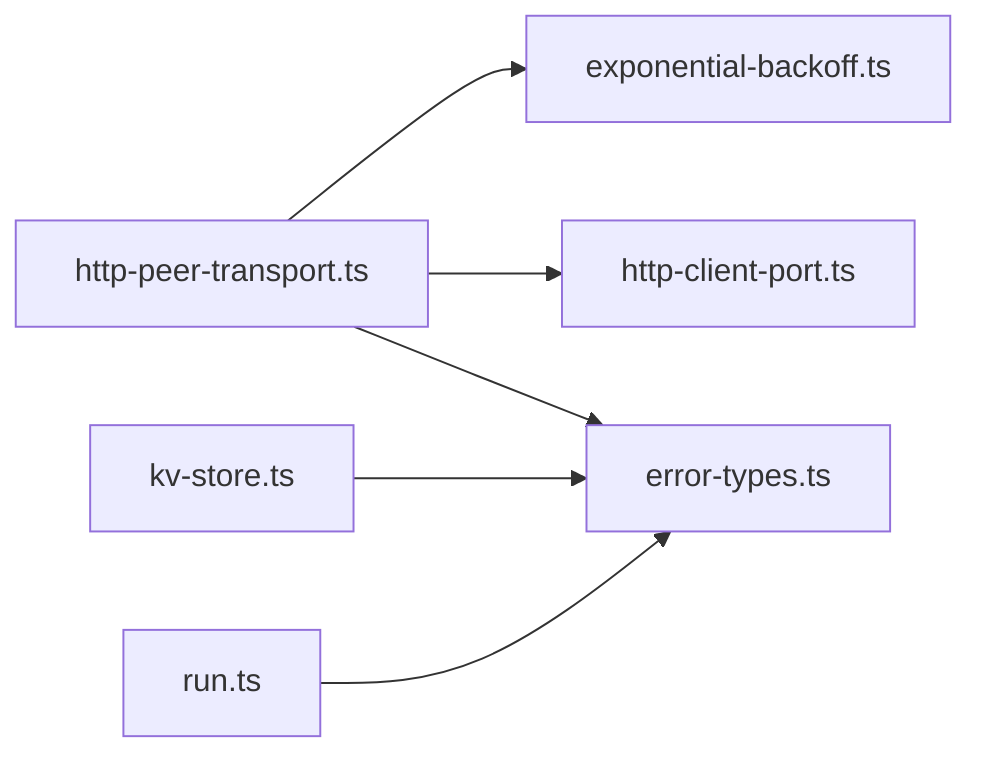

# 错误处理

<cite>
**本文引用的文件**   
- [app/main/index.ts](file://app/main/index.ts)
- [app/main/engine-host.ts](file://app/main/engine-host.ts)
- [app/main/window.ts](file://app/main/window.ts)
- [app/preload/index.ts](file://app/preload/index.ts)
- [app/renderer/src/services/engine-api.ts](file://app/renderer/src/services/engine-api.ts)
- [app/renderer/src/hooks/useChat.ts](file://app/renderer/src/hooks/useChat.ts)
- [engine/packages/http-layer/src/transport/http-peer-transport.ts](file://engine/packages/http-layer/src/transport/http-peer-transport.ts)
- [engine/packages/domain-layer/src/errors/error-types.ts](file://engine/packages/domain-layer/src/errors/error-types.ts)
- [engine/packages/foundation/src/errors/base-error.ts](file://engine/packages/foundation/src/errors/base-error.ts)
- [engine/packages/infrastructure/src/retry/exponential-backoff.ts](file://engine/packages/infrastructure/src/retry/exponential-backoff.ts)
- [engine/packages/ports-layer/src/ports/http-client-port.ts](file://engine/packages/ports-layer/src/ports/http-client-port.ts)
- [engine/packages/delegation-layer/src/runtime/kv-store.ts](file://engine/packages/delegation-layer/src/runtime/kv-store.ts)
- [engine/packages/cli-layer/src/commands/run.ts](file://engine/packages/cli-layer/src/commands/run.ts)
</cite>

## 目录
1. [简介](#简介)
2. [项目结构](#项目结构)
3. [核心组件](#核心组件)
4. [架构总览](#架构总览)
5. [详细组件分析](#详细组件分析)
6. [依赖关系分析](#依赖关系分析)
7. [性能考量](#性能考量)
8. [故障排查指南](#故障排查指南)
9. [结论](#结论)
10. [附录](#附录)

## 简介
本指南面向KCoder项目的错误处理体系，覆盖错误分类、重试与退避、降级策略、错误传播与包装、错误码与消息规范、用户友好提示以及监控告警配置。文档以仓库中实际存在的模块为依据，结合分层架构（渲染层、主进程、引擎层）给出可落地的实践建议与可视化图示，帮助开发者在复杂交互与远程调用场景下构建稳定、可观测且用户体验良好的错误处理机制。

## 项目结构
KCoder采用Electron多进程架构与Engine微内核分层：
- 渲染层负责UI与用户交互，通过预加载脚本与主进程通信，并调用引擎API服务。
- 主进程管理窗口、菜单、设置以及与引擎宿主进程的集成。
- Engine层按领域分层组织，包含HTTP传输、端口适配、领域错误类型、基础设施重试等能力。

图表来源
- [app/renderer/src/services/engine-api.ts](file://app/renderer/src/services/engine-api.ts)
- [app/preload/index.ts](file://app/preload/index.ts)
- [app/main/index.ts](file://app/main/index.ts)
- [app/main/window.ts](file://app/main/window.ts)
- [app/main/engine-host.ts](file://app/main/engine-host.ts)
- [engine/packages/http-layer/src/transport/http-peer-transport.ts](file://engine/packages/http-layer/src/transport/http-peer-transport.ts)
- [engine/packages/ports-layer/src/ports/http-client-port.ts](file://engine/packages/ports-layer/src/ports/http-client-port.ts)
- [engine/packages/domain-layer/src/errors/error-types.ts](file://engine/packages/domain-layer/src/errors/error-types.ts)
- [engine/packages/foundation/src/errors/base-error.ts](file://engine/packages/foundation/src/errors/base-error.ts)
- [engine/packages/infrastructure/src/retry/exponential-backoff.ts](file://engine/packages/infrastructure/src/retry/exponential-backoff.ts)
- [engine/packages/delegation-layer/src/runtime/kv-store.ts](file://engine/packages/delegation-layer/src/runtime/kv-store.ts)
- [engine/packages/cli-layer/src/commands/run.ts](file://engine/packages/cli-layer/src/commands/run.ts)

章节来源
- [app/main/index.ts](file://app/main/index.ts)
- [app/main/engine-host.ts](file://app/main/engine-host.ts)
- [app/main/window.ts](file://app/main/window.ts)
- [app/preload/index.ts](file://app/preload/index.ts)
- [app/renderer/src/services/engine-api.ts](file://app/renderer/src/services/engine-api.ts)
- [engine/packages/http-layer/src/transport/http-peer-transport.ts](file://engine/packages/http-layer/src/transport/http-peer-transport.ts)
- [engine/packages/domain-layer/src/errors/error-types.ts](file://engine/packages/domain-layer/src/errors/error-types.ts)
- [engine/packages/foundation/src/errors/base-error.ts](file://engine/packages/foundation/src/errors/base-error.ts)
- [engine/packages/infrastructure/src/retry/exponential-backoff.ts](file://engine/packages/infrastructure/src/retry/exponential-backoff.ts)
- [engine/packages/ports-layer/src/ports/http-client-port.ts](file://engine/packages/ports-layer/src/ports/http-client-port.ts)
- [engine/packages/delegation-layer/src/runtime/kv-store.ts](file://engine/packages/delegation-layer/src/runtime/kv-store.ts)
- [engine/packages/cli-layer/src/commands/run.ts](file://engine/packages/cli-layer/src/commands/run.ts)

## 核心组件
- 错误基类与类型定义
  - 基础错误类型提供统一的结构化字段（如错误码、上下文、堆栈），便于跨层传递与展示。
  - 领域错误类型对业务域的错误进行细分，支撑上层分类与策略选择。
- HTTP传输与客户端端口
  - HTTP传输封装网络请求、响应解析与异常转换，将底层网络错误映射为领域错误。
  - 客户端端口抽象HTTP调用契约，屏蔽具体实现差异，利于测试与替换。
- 指数退避重试
  - 基于指数退避算法的重试器，支持最大重试次数、抖动因子与可判定条件。
- KV存储与CLI运行入口
  - KV存储用于持久化关键状态，失败时触发降级或回退逻辑。
  - CLI运行命令作为外部入口，负责捕获顶层异常并输出结构化结果。

章节来源
- [engine/packages/foundation/src/errors/base-error.ts](file://engine/packages/foundation/src/errors/base-error.ts)
- [engine/packages/domain-layer/src/errors/error-types.ts](file://engine/packages/domain-layer/src/errors/error-types.ts)
- [engine/packages/http-layer/src/transport/http-peer-transport.ts](file://engine/packages/http-layer/src/transport/http-peer-transport.ts)
- [engine/packages/ports-layer/src/ports/http-client-port.ts](file://engine/packages/ports-layer/src/ports/http-client-port.ts)
- [engine/packages/infrastructure/src/retry/exponential-backoff.ts](file://engine/packages/infrastructure/src/retry/exponential-backoff.ts)
- [engine/packages/delegation-layer/src/runtime/kv-store.ts](file://engine/packages/delegation-layer/src/runtime/kv-store.ts)
- [engine/packages/cli-layer/src/commands/run.ts](file://engine/packages/cli-layer/src/commands/run.ts)

## 架构总览
下图展示了从渲染层到引擎层的错误传播路径，包括网络层异常转换为领域错误、重试与降级的介入点，以及最终向用户呈现的反馈。

图表来源
- [app/renderer/src/hooks/useChat.ts](file://app/renderer/src/hooks/useChat.ts)
- [app/renderer/src/services/engine-api.ts](file://app/renderer/src/services/engine-api.ts)
- [app/preload/index.ts](file://app/preload/index.ts)
- [app/main/index.ts](file://app/main/index.ts)
- [app/main/engine-host.ts](file://app/main/engine-host.ts)
- [engine/packages/http-layer/src/transport/http-peer-transport.ts](file://engine/packages/http-layer/src/transport/http-peer-transport.ts)
- [engine/packages/ports-layer/src/ports/http-client-port.ts](file://engine/packages/ports-layer/src/ports/http-client-port.ts)
- [engine/packages/infrastructure/src/retry/exponential-backoff.ts](file://engine/packages/infrastructure/src/retry/exponential-backoff.ts)
- [engine/packages/domain-layer/src/errors/error-types.ts](file://engine/packages/domain-layer/src/errors/error-types.ts)

## 详细组件分析

### 错误分类体系与处理策略
- 网络错误
  - 来源：HTTP传输与客户端端口层。
  - 典型表现：连接超时、DNS解析失败、证书校验失败、服务端不可达。
  - 处理策略：进入重试流程；若超过最大重试次数则降级或返回离线模式；记录诊断信息（URL、方法、状态码）。
- 业务逻辑错误
  - 来源：领域层错误类型。
  - 典型表现：权限不足、资源不存在、参数不合法、工作流状态非法。
  - 处理策略：直接向上抛出领域错误；由上层决定是提示用户还是自动修复；避免将内部细节暴露给用户。
- 系统错误
  - 来源：基础设施与运行时（KV存储、序列化、文件系统）。
  - 典型表现：磁盘写入失败、内存不足、进程崩溃恢复。
  - 处理策略：触发降级（如只读模式）、清理临时状态、上报监控并尝试恢复。
- 用户输入错误
  - 来源：渲染层表单与校验。
  - 典型表现：必填项缺失、格式不正确、超出长度限制。
  - 处理策略：即时校验并提示；阻止无效请求；提供修正建议与帮助链接。

章节来源
- [engine/packages/http-layer/src/transport/http-peer-transport.ts](file://engine/packages/http-layer/src/transport/http-peer-transport.ts)
- [engine/packages/domain-layer/src/errors/error-types.ts](file://engine/packages/domain-layer/src/errors/error-types.ts)
- [engine/packages/delegation-layer/src/runtime/kv-store.ts](file://engine/packages/delegation-layer/src/runtime/kv-store.ts)
- [app/renderer/src/hooks/useChat.ts](file://app/renderer/src/hooks/useChat.ts)

### 重试机制与指数退避
- 指数退避算法
  - 基本思想：每次重试间隔按指数增长，加入随机抖动以避免雪崩。
  - 关键参数：初始延迟、最大延迟、抖动系数、最大重试次数。
- 最大重试次数
  - 依据错误类型与服务端SLA设定；网络瞬断可多试几次，业务错误通常不重试。
- 重试条件判断
  - 仅对可重试错误（如超时、5xx、限流）进行重试；对确定性错误（如4xx中的认证失败）立即失败。
- 流程图

图表来源
- [engine/packages/infrastructure/src/retry/exponential-backoff.ts](file://engine/packages/infrastructure/src/retry/exponential-backoff.ts)
- [engine/packages/http-layer/src/transport/http-peer-transport.ts](file://engine/packages/http-layer/src/transport/http-peer-transport.ts)

章节来源
- [engine/packages/infrastructure/src/retry/exponential-backoff.ts](file://engine/packages/infrastructure/src/retry/exponential-backoff.ts)
- [engine/packages/http-layer/src/transport/http-peer-transport.ts](file://engine/packages/http-layer/src/transport/http-peer-transport.ts)

### 降级处理策略
- 功能降级
  - 当远端服务不可用时，切换到本地缓存或离线模式；保留核心功能可用。
- 数据降级
  - 优先使用最近一次成功的数据；若不可用则显示占位内容并引导用户刷新。
- 用户体验降级
  - 减少动画与实时同步；提供“稍后重试”按钮与进度反馈；隐藏非关键信息。

章节来源
- [engine/packages/delegation-layer/src/runtime/kv-store.ts](file://engine/packages/delegation-layer/src/runtime/kv-store.ts)
- [app/renderer/src/hooks/useChat.ts](file://app/renderer/src/hooks/useChat.ts)

### 错误传播与冒泡机制
- 错误边界
  - 在渲染层设置错误边界，捕获未处理的异常，防止整个应用崩溃。
- 错误包装
  - 在各层入口处包装原始错误，附加上下文（请求ID、时间戳、操作路径），便于追踪。
- 错误转换
  - 将底层网络错误转换为领域错误，保持上层语义一致；避免泄露实现细节。

图表来源
- [engine/packages/foundation/src/errors/base-error.ts](file://engine/packages/foundation/src/errors/base-error.ts)
- [engine/packages/domain-layer/src/errors/error-types.ts](file://engine/packages/domain-layer/src/errors/error-types.ts)
- [engine/packages/http-layer/src/transport/http-peer-transport.ts](file://engine/packages/http-layer/src/transport/http-peer-transport.ts)
- [engine/packages/ports-layer/src/ports/http-client-port.ts](file://engine/packages/ports-layer/src/ports/http-client-port.ts)
- [engine/packages/infrastructure/src/retry/exponential-backoff.ts](file://engine/packages/infrastructure/src/retry/exponential-backoff.ts)

章节来源
- [engine/packages/foundation/src/errors/base-error.ts](file://engine/packages/foundation/src/errors/base-error.ts)
- [engine/packages/domain-layer/src/errors/error-types.ts](file://engine/packages/domain-layer/src/errors/error-types.ts)
- [engine/packages/http-layer/src/transport/http-peer-transport.ts](file://engine/packages/http-layer/src/transport/http-peer-transport.ts)
- [engine/packages/ports-layer/src/ports/http-client-port.ts](file://engine/packages/ports-layer/src/ports/http-client-port.ts)
- [engine/packages/infrastructure/src/retry/exponential-backoff.ts](file://engine/packages/infrastructure/src/retry/exponential-backoff.ts)

### 错误码规范与错误消息设计原则
- 错误码规范
  - 采用分层前缀+唯一编号，例如NET_XXX、BUS_XXX、SYS_XXX、INP_XXX。
  - 错误码需具备可读性与稳定性，避免频繁变更。
- 错误消息设计原则
  - 对用户可见的消息应简洁、明确、可操作；不包含敏感信息。
  - 对开发者可见的诊断信息应包含上下文与堆栈，便于定位问题。
  - 提供帮助链接与反馈渠道，提升自助排障效率。

章节来源
- [engine/packages/domain-layer/src/errors/error-types.ts](file://engine/packages/domain-layer/src/errors/error-types.ts)
- [engine/packages/foundation/src/errors/base-error.ts](file://engine/packages/foundation/src/errors/base-error.ts)

### 用户友好的错误提示设计
- 错误信息本地化
  - 根据语言环境切换提示文案；确保术语一致。
- 帮助链接
  - 在错误弹窗中嵌入帮助文档链接，引导用户自助解决常见问题。
- 反馈渠道
  - 提供一键反馈按钮，附带错误码与必要上下文，便于客服与研发协作。

章节来源
- [app/renderer/src/hooks/useChat.ts](file://app/renderer/src/hooks/useChat.ts)

### 错误监控与告警系统配置
- 采集范围
  - 网络错误、业务错误、系统错误、用户输入错误均需上报。
- 上报时机
  - 在错误边界捕获后立即上报；重试失败后再追加一次汇总上报。
- 告警规则
  - 针对高频错误、关键路径失败、重试失败率阈值设置告警。
- 日志关联
  - 使用请求ID串联上下游日志，便于端到端追踪。

章节来源
- [engine/packages/cli-layer/src/commands/run.ts](file://engine/packages/cli-layer/src/commands/run.ts)
- [engine/packages/http-layer/src/transport/http-peer-transport.ts](file://engine/packages/http-layer/src/transport/http-peer-transport.ts)

## 依赖关系分析
- 耦合与内聚
  - HTTP传输与客户端端口解耦，便于替换实现与单元测试。
  - 领域错误类型独立于传输层，保证上层语义一致性。
- 循环依赖
  - 各层之间单向依赖，避免循环引用。
- 外部依赖
  - 网络库、KV存储、CLI框架等外部依赖通过端口与适配器隔离。

图表来源
- [engine/packages/http-layer/src/transport/http-peer-transport.ts](file://engine/packages/http-layer/src/transport/http-peer-transport.ts)
- [engine/packages/ports-layer/src/ports/http-client-port.ts](file://engine/packages/ports-layer/src/ports/http-client-port.ts)
- [engine/packages/domain-layer/src/errors/error-types.ts](file://engine/packages/domain-layer/src/errors/error-types.ts)
- [engine/packages/infrastructure/src/retry/exponential-backoff.ts](file://engine/packages/infrastructure/src/retry/exponential-backoff.ts)
- [engine/packages/delegation-layer/src/runtime/kv-store.ts](file://engine/packages/delegation-layer/src/runtime/kv-store.ts)
- [engine/packages/cli-layer/src/commands/run.ts](file://engine/packages/cli-layer/src/commands/run.ts)

章节来源
- [engine/packages/http-layer/src/transport/http-peer-transport.ts](file://engine/packages/http-layer/src/transport/http-peer-transport.ts)
- [engine/packages/ports-layer/src/ports/http-client-port.ts](file://engine/packages/ports-layer/src/ports/http-client-port.ts)
- [engine/packages/domain-layer/src/errors/error-types.ts](file://engine/packages/domain-layer/src/errors/error-types.ts)
- [engine/packages/infrastructure/src/retry/exponential-backoff.ts](file://engine/packages/infrastructure/src/retry/exponential-backoff.ts)
- [engine/packages/delegation-layer/src/runtime/kv-store.ts](file://engine/packages/delegation-layer/src/runtime/kv-store.ts)
- [engine/packages/cli-layer/src/commands/run.ts](file://engine/packages/cli-layer/src/commands/run.ts)

## 性能考量
- 重试风暴控制
  - 引入抖动与随机化，避免集中重试导致雪崩。
- 超时与熔断
  - 合理设置超时时间与熔断阈值，保护后端服务。
- 降级与缓存
  - 利用KV存储缓存热点数据，降低网络压力。
- 日志与监控开销
  - 采样上报与批量聚合，减少I/O开销。

[本节为通用指导，无需特定文件来源]

## 故障排查指南
- 快速定位
  - 查看错误码与上下文，确认是否为网络、业务或系统错误。
- 重试与退避
  - 检查重试条件与退避参数是否符合预期。
- 降级验证
  - 验证KV存储是否可用，离线模式是否生效。
- 日志与追踪
  - 使用请求ID串联日志，定位上下游问题。

章节来源
- [engine/packages/http-layer/src/transport/http-peer-transport.ts](file://engine/packages/http-layer/src/transport/http-peer-transport.ts)
- [engine/packages/delegation-layer/src/runtime/kv-store.ts](file://engine/packages/delegation-layer/src/runtime/kv-store.ts)
- [engine/packages/cli-layer/src/commands/run.ts](file://engine/packages/cli-layer/src/commands/run.ts)

## 结论
通过统一的错误分类、清晰的重试与降级策略、严格的错误传播与包装、规范的错误码与消息设计，以及完善的监控告警，KCoder能够在复杂网络与业务环境下保持稳定与良好体验。建议在后续迭代中持续完善错误边界、细化错误码、优化重试参数，并加强用户反馈闭环。

[本节为总结性内容，无需特定文件来源]

## 附录
- 术语表
  - 指数退避：重试间隔按指数增长的策略。
  - 降级：在部分功能不可用时，提供替代方案以保持核心可用性。
  - 错误边界：捕获未处理异常的机制，防止应用崩溃。
- 参考实现路径
  - 基础错误类型：[engine/packages/foundation/src/errors/base-error.ts](file://engine/packages/foundation/src/errors/base-error.ts)
  - 领域错误类型：[engine/packages/domain-layer/src/errors/error-types.ts](file://engine/packages/domain-layer/src/errors/error-types.ts)
  - HTTP传输：[engine/packages/http-layer/src/transport/http-peer-transport.ts](file://engine/packages/http-layer/src/transport/http-peer-transport.ts)
  - 客户端端口：[engine/packages/ports-layer/src/ports/http-client-port.ts](file://engine/packages/ports-layer/src/ports/http-client-port.ts)
  - 指数退避：[engine/packages/infrastructure/src/retry/exponential-backoff.ts](file://engine/packages/infrastructure/src/retry/exponential-backoff.ts)
  - KV存储：[engine/packages/delegation-layer/src/runtime/kv-store.ts](file://engine/packages/delegation-layer/src/runtime/kv-store.ts)
  - CLI运行：[engine/packages/cli-layer/src/commands/run.ts](file://engine/packages/cli-layer/src/commands/run.ts)