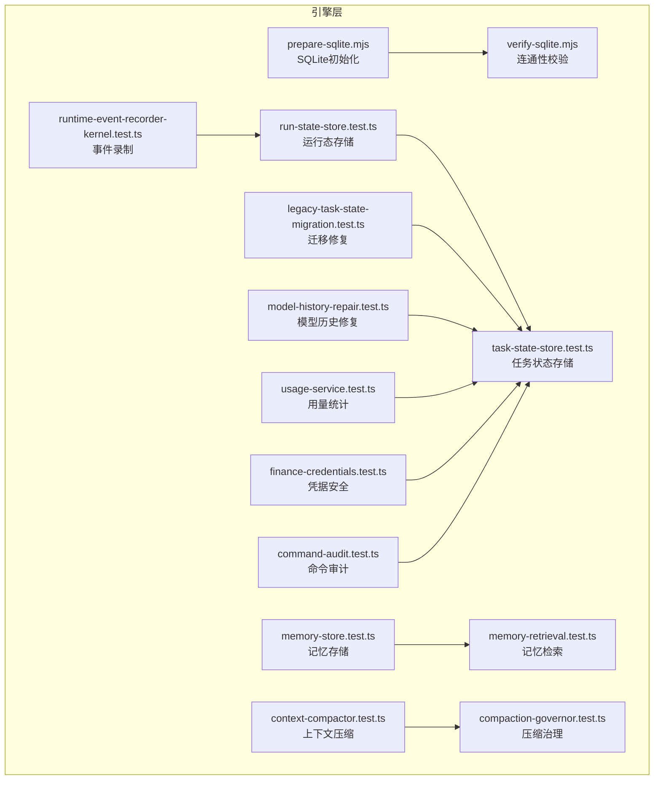
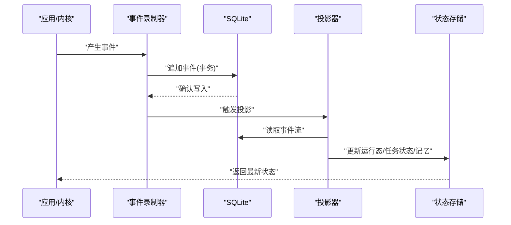
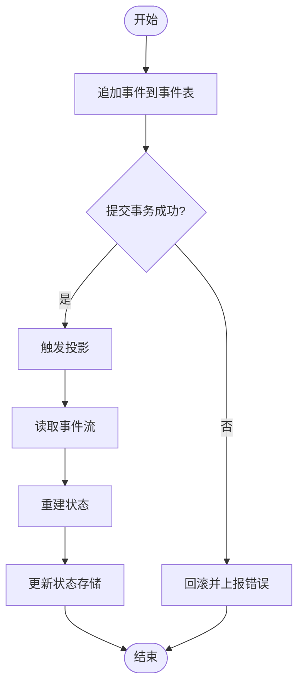
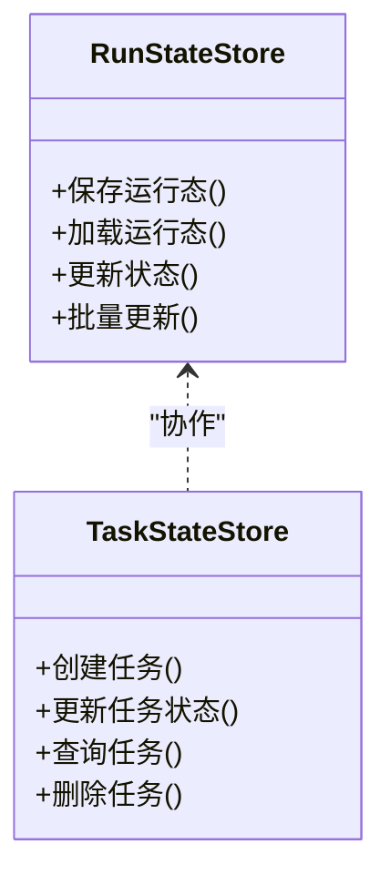
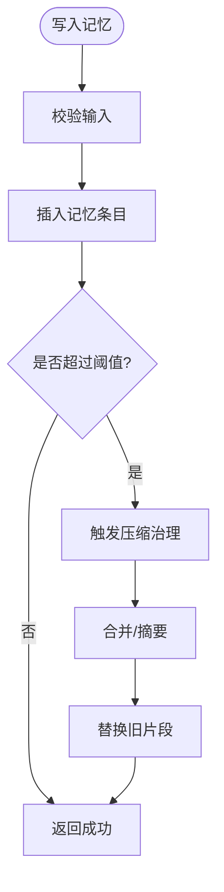
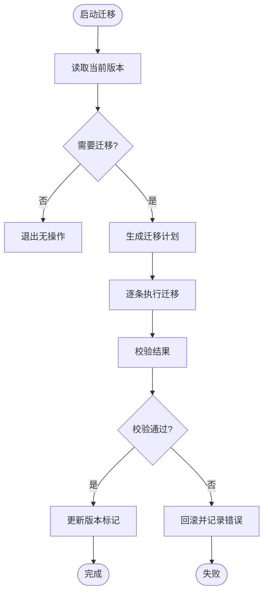
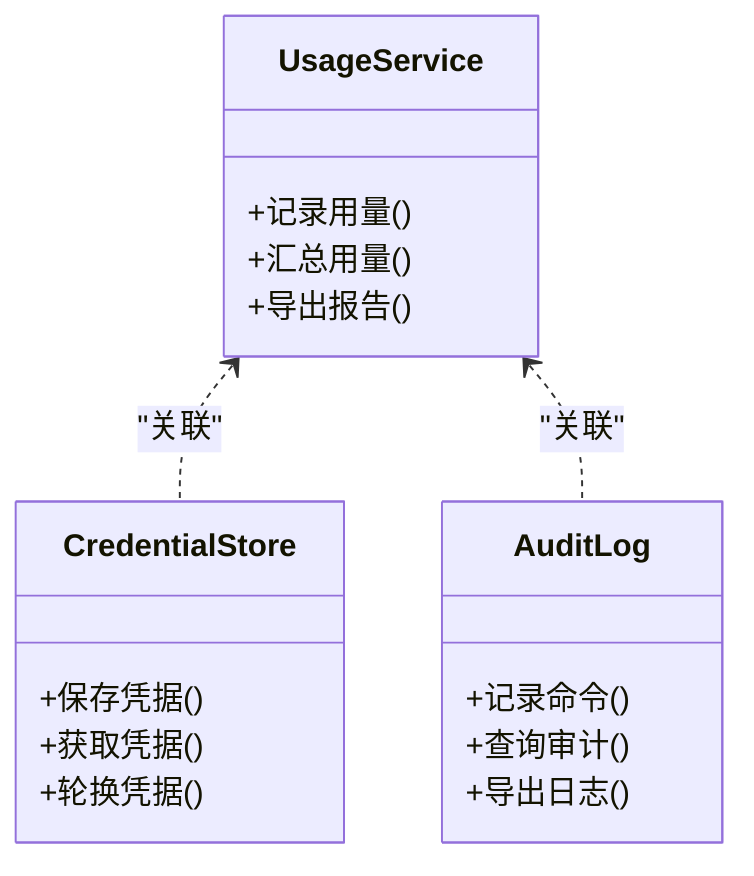
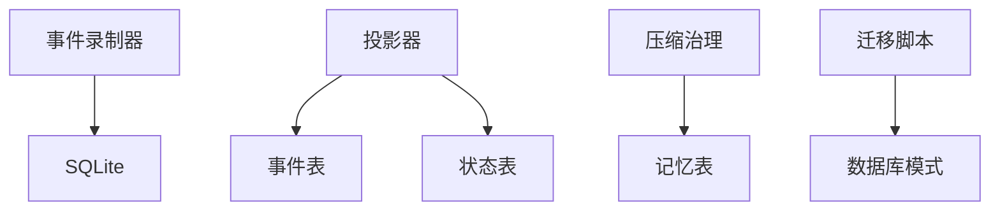

# 数据库设计

<cite>
**本文引用的文件**   
- [engine/scripts/prepare-sqlite.mjs](file://engine/scripts/prepare-sqlite.mjs)
- [engine/scripts/verify-sqlite.mjs](file://engine/scripts/verify-sqlite.mjs)
- [engine/tests/memory-store.test.ts](file://engine/tests/memory-store.test.ts)
- [engine/tests/file-session-store.test.ts](file://engine/tests/file-session-store.test.ts)
- [engine/tests/hybrid-store.test.ts](file://engine/tests/hybrid-store.test.ts)
- [engine/tests/run-state-store.test.ts](file://engine/tests/run-state-store.test.ts)
- [engine/tests/task-state-store.test.ts](file://engine/tests/task-state-store.test.ts)
- [engine/tests/memory-retrieval.test.ts](file://engine/tests/memory-retrieval.test.ts)
- [engine/tests/legacy-task-state-migration.test.ts](file://engine/tests/legacy-task-state-migration.test.ts)
- [engine/tests/runtime-event-projection.test.ts](file://engine/tests/runtime-event-projection.test.ts)
- [engine/tests/runtime-event-recorder-kernel.test.ts](file://engine/tests/runtime-event-recorder-kernel.test.ts)
- [engine/tests/evented-loop.test.ts](file://engine/tests/evented-loop.test.ts)
- [engine/tests/tool-call-repair.test.ts](file://engine/tests/tool-call-repair.test.ts)
- [engine/tests/durable-task-capsule.test.ts](file://engine/tests/durable-task-capsule.test.ts)
- [engine/tests/context-compactor.test.ts](file://engine/tests/context-compactor.test.ts)
- [engine/tests/compaction-governor.test.ts](file://engine/tests/compaction-governor.test.ts)
- [engine/tests/compaction-transaction.test.ts](file://engine/tests/compaction-transaction.test.ts)
- [engine/tests/model-history-repair.test.ts](file://engine/tests/model-history-repair.test.ts)
- [engine/tests/usage-service.test.ts](file://engine/tests/usage-service.test.ts)
- [engine/tests/finance-credentials.test.ts](file://engine/tests/finance-credentials.test.ts)
- [engine/tests/command-audit.test.ts](file://engine/tests/command-audit.test.ts)
</cite>

## 目录
1. [引言](#引言)
2. [项目结构](#项目结构)
3. [核心组件](#核心组件)
4. [架构总览](#架构总览)
5. [详细组件分析](#详细组件分析)
6. [依赖关系分析](#依赖关系分析)
7. [性能考虑](#性能考虑)
8. [故障排除指南](#故障排除指南)
9. [结论](#结论)
10. [附录](#附录)

## 引言
本技术文档围绕KCoder的数据库设计与实现展开，重点说明：
- 数据库选型与SQLite优势
- 表结构设计（会话、任务、记忆、配置等）
- 索引优化策略（查询优化、读写分离、缓存）
- 数据迁移机制（版本管理、增量更新、回滚）
- 数据访问模式（ORM使用、查询构建、事务管理）
- 数据生命周期管理（清理、归档、备份恢复）
- 性能监控与优化
- 数据安全（加密存储、访问控制、审计日志）
- 维护与排障最佳实践

## 项目结构
从仓库结构看，数据库相关能力集中在engine子工程内，包含脚本与测试用例，用于验证SQLite准备、运行态事件记录、状态持久化、记忆检索、迁移修复等。关键入口与验证点包括：
- SQLite初始化与校验脚本
- 运行态事件记录与投影
- 任务与会话状态存储
- 记忆检索与压缩治理
- 历史修复与用量统计
- 凭据与命令审计

图表来源
- [engine/scripts/prepare-sqlite.mjs](file://engine/scripts/prepare-sqlite.mjs)
- [engine/scripts/verify-sqlite.mjs](file://engine/scripts/verify-sqlite.mjs)
- [engine/tests/runtime-event-recorder-kernel.test.ts](file://engine/tests/runtime-event-recorder-kernel.test.ts)
- [engine/tests/run-state-store.test.ts](file://engine/tests/run-state-store.test.ts)
- [engine/tests/task-state-store.test.ts](file://engine/tests/task-state-store.test.ts)
- [engine/tests/memory-store.test.ts](file://engine/tests/memory-store.test.ts)
- [engine/tests/memory-retrieval.test.ts](file://engine/tests/memory-retrieval.test.ts)
- [engine/tests/context-compactor.test.ts](file://engine/tests/context-compactor.test.ts)
- [engine/tests/compaction-governor.test.ts](file://engine/tests/compaction-governor.test.ts)
- [engine/tests/legacy-task-state-migration.test.ts](file://engine/tests/legacy-task-state-migration.test.ts)
- [engine/tests/model-history-repair.test.ts](file://engine/tests/model-history-repair.test.ts)
- [engine/tests/usage-service.test.ts](file://engine/tests/usage-service.test.ts)
- [engine/tests/finance-credentials.test.ts](file://engine/tests/finance-credentials.test.ts)
- [engine/tests/command-audit.test.ts](file://engine/tests/command-audit.test.ts)

章节来源
- [engine/scripts/prepare-sqlite.mjs](file://engine/scripts/prepare-sqlite.mjs)
- [engine/scripts/verify-sqlite.mjs](file://engine/scripts/verify-sqlite.mjs)
- [engine/tests/runtime-event-recorder-kernel.test.ts](file://engine/tests/runtime-event-recorder-kernel.test.ts)
- [engine/tests/run-state-store.test.ts](file://engine/tests/run-state-store.test.ts)
- [engine/tests/task-state-store.test.ts](file://engine/tests/task-state-store.test.ts)
- [engine/tests/memory-store.test.ts](file://engine/tests/memory-store.test.ts)
- [engine/tests/memory-retrieval.test.ts](file://engine/tests/memory-retrieval.test.ts)
- [engine/tests/context-compactor.test.ts](file://engine/tests/context-compactor.test.ts)
- [engine/tests/compaction-governor.test.ts](file://engine/tests/compaction-governor.test.ts)
- [engine/tests/legacy-task-state-migration.test.ts](file://engine/tests/legacy-task-state-migration.test.ts)
- [engine/tests/model-history-repair.test.ts](file://engine/tests/model-history-repair.test.ts)
- [engine/tests/usage-service.test.ts](file://engine/tests/usage-service.test.ts)
- [engine/tests/finance-credentials.test.ts](file://engine/tests/finance-credentials.test.ts)
- [engine/tests/command-audit.test.ts](file://engine/tests/command-audit.test.ts)

## 核心组件
- SQLite初始化与校验
  - 负责创建或准备SQLite数据库文件、建立必要对象、执行连通性检查。
  - 参考路径：[engine/scripts/prepare-sqlite.mjs](file://engine/scripts/prepare-sqlite.mjs)、[engine/scripts/verify-sqlite.mjs](file://engine/scripts/verify-sqlite.mjs)
- 运行态事件记录与投影
  - 将内核事件持久化为事件流，并支持按时间线回放与投影到当前状态。
  - 参考路径：[engine/tests/runtime-event-recorder-kernel.test.ts](file://engine/tests/runtime-event-recorder-kernel.test.ts)、[engine/tests/runtime-event-projection.test.ts](file://engine/tests/runtime-event-projection.test.ts)
- 运行态与任务状态存储
  - 提供任务生命周期状态、运行态快照的持久化与一致性保障。
  - 参考路径：[engine/tests/run-state-store.test.ts](file://engine/tests/run-state-store.test.ts)、[engine/tests/task-state-store.test.ts](file://engine/tests/task-state-store.test.ts)
- 记忆存储与检索
  - 提供会话记忆的写入、检索与压缩治理，确保上下文长度可控。
  - 参考路径：[engine/tests/memory-store.test.ts](file://engine/tests/memory-store.test.ts)、[engine/tests/memory-retrieval.test.ts](file://engine/tests/memory-retrieval.test.ts)、[engine/tests/context-compactor.test.ts](file://engine/tests/context-compactor.test.ts)、[engine/tests/compaction-governor.test.ts](file://engine/tests/compaction-governor.test.ts)
- 迁移与修复
  - 处理旧版任务状态迁移、模型历史修复，保证升级平滑。
  - 参考路径：[engine/tests/legacy-task-state-migration.test.ts](file://engine/tests/legacy-task-state-migration.test.ts)、[engine/tests/model-history-repair.test.ts](file://engine/tests/model-history-repair.test.ts)
- 用量统计与安全审计
  - 统计资源使用量、记录敏感凭据与命令审计信息。
  - 参考路径：[engine/tests/usage-service.test.ts](file://engine/tests/usage-service.test.ts)、[engine/tests/finance-credentials.test.ts](file://engine/tests/finance-credentials.test.ts)、[engine/tests/command-audit.test.ts](file://engine/tests/command-audit.test.ts)

章节来源
- [engine/scripts/prepare-sqlite.mjs](file://engine/scripts/prepare-sqlite.mjs)
- [engine/scripts/verify-sqlite.mjs](file://engine/scripts/verify-sqlite.mjs)
- [engine/tests/runtime-event-recorder-kernel.test.ts](file://engine/tests/runtime-event-recorder-kernel.test.ts)
- [engine/tests/runtime-event-projection.test.ts](file://engine/tests/runtime-event-projection.test.ts)
- [engine/tests/run-state-store.test.ts](file://engine/tests/run-state-store.test.ts)
- [engine/tests/task-state-store.test.ts](file://engine/tests/task-state-store.test.ts)
- [engine/tests/memory-store.test.ts](file://engine/tests/memory-store.test.ts)
- [engine/tests/memory-retrieval.test.ts](file://engine/tests/memory-retrieval.test.ts)
- [engine/tests/context-compactor.test.ts](file://engine/tests/context-compactor.test.ts)
- [engine/tests/compaction-governor.test.ts](file://engine/tests/compaction-governor.test.ts)
- [engine/tests/legacy-task-state-migration.test.ts](file://engine/tests/legacy-task-state-migration.test.ts)
- [engine/tests/model-history-repair.test.ts](file://engine/tests/model-history-repair.test.ts)
- [engine/tests/usage-service.test.ts](file://engine/tests/usage-service.test.ts)
- [engine/tests/finance-credentials.test.ts](file://engine/tests/finance-credentials.test.ts)
- [engine/tests/command-audit.test.ts](file://engine/tests/command-audit.test.ts)

## 架构总览
整体采用“事件溯源 + 状态投影”的持久化模式：
- 事件流作为事实源，按时间顺序追加写入
- 通过投影器将事件流还原为当前状态（运行态、任务状态、记忆摘要等）
- 压缩治理在必要时对长上下文进行压缩，保持上下文窗口稳定
- 迁移与修复脚本保障跨版本兼容

图表来源
- [engine/tests/runtime-event-recorder-kernel.test.ts](file://engine/tests/runtime-event-recorder-kernel.test.ts)
- [engine/tests/runtime-event-projection.test.ts](file://engine/tests/runtime-event-projection.test.ts)
- [engine/tests/run-state-store.test.ts](file://engine/tests/run-state-store.test.ts)
- [engine/tests/task-state-store.test.ts](file://engine/tests/task-state-store.test.ts)
- [engine/tests/memory-store.test.ts](file://engine/tests/memory-store.test.ts)

## 详细组件分析

### 事件录制与投影
- 职责
  - 将内核产生的事件以不可变方式追加到事件表
  - 基于事件流重建当前状态，支撑崩溃恢复与回放
- 关键点
  - 事件写入需事务保护，确保原子性与一致性
  - 投影过程可幂等，避免重复事件导致状态漂移
  - 大事件建议分片或压缩存储，降低I/O压力

图表来源
- [engine/tests/runtime-event-recorder-kernel.test.ts](file://engine/tests/runtime-event-recorder-kernel.test.ts)
- [engine/tests/runtime-event-projection.test.ts](file://engine/tests/runtime-event-projection.test.ts)

章节来源
- [engine/tests/runtime-event-recorder-kernel.test.ts](file://engine/tests/runtime-event-recorder-kernel.test.ts)
- [engine/tests/runtime-event-projection.test.ts](file://engine/tests/runtime-event-projection.test.ts)

### 运行态与任务状态存储
- 职责
  - 持久化任务生命周期状态、运行态快照
  - 提供状态查询、更新与一致性保障
- 关键点
  - 状态更新应包裹在事务中，避免部分更新
  - 针对高频查询字段建立索引（如任务ID、状态、时间戳）
  - 支持断点续跑与恢复

图表来源
- [engine/tests/run-state-store.test.ts](file://engine/tests/run-state-store.test.ts)
- [engine/tests/task-state-store.test.ts](file://engine/tests/task-state-store.test.ts)

章节来源
- [engine/tests/run-state-store.test.ts](file://engine/tests/run-state-store.test.ts)
- [engine/tests/task-state-store.test.ts](file://engine/tests/task-state-store.test.ts)

### 记忆存储与检索
- 职责
  - 会话记忆的增删改查、相似度检索、上下文压缩
- 关键点
  - 记忆条目含元数据（会话ID、时间戳、类型、权重等）
  - 检索支持过滤条件与分页
  - 压缩治理根据阈值触发，保留关键片段

图表来源
- [engine/tests/memory-store.test.ts](file://engine/tests/memory-store.test.ts)
- [engine/tests/memory-retrieval.test.ts](file://engine/tests/memory-retrieval.test.ts)
- [engine/tests/context-compactor.test.ts](file://engine/tests/context-compactor.test.ts)
- [engine/tests/compaction-governor.test.ts](file://engine/tests/compaction-governor.test.ts)

章节来源
- [engine/tests/memory-store.test.ts](file://engine/tests/memory-store.test.ts)
- [engine/tests/memory-retrieval.test.ts](file://engine/tests/memory-retrieval.test.ts)
- [engine/tests/context-compactor.test.ts](file://engine/tests/context-compactor.test.ts)
- [engine/tests/compaction-governor.test.ts](file://engine/tests/compaction-governor.test.ts)

### 迁移与修复
- 职责
  - 处理旧版任务状态迁移、模型历史修复
- 关键点
  - 迁移脚本需幂等，支持回滚
  - 增量更新策略：按版本号顺序执行
  - 失败时保留原数据并提供修复入口

图表来源
- [engine/tests/legacy-task-state-migration.test.ts](file://engine/tests/legacy-task-state-migration.test.ts)
- [engine/tests/model-history-repair.test.ts](file://engine/tests/model-history-repair.test.ts)

章节来源
- [engine/tests/legacy-task-state-migration.test.ts](file://engine/tests/legacy-task-state-migration.test.ts)
- [engine/tests/model-history-repair.test.ts](file://engine/tests/model-history-repair.test.ts)

### 用量统计与安全审计
- 职责
  - 统计资源使用量（令牌、调用次数等）
  - 记录敏感凭据与命令审计日志
- 关键点
  - 用量统计需聚合与去重
  - 凭据存储需加密或脱敏
  - 审计日志不可篡改，便于追溯

图表来源
- [engine/tests/usage-service.test.ts](file://engine/tests/usage-service.test.ts)
- [engine/tests/finance-credentials.test.ts](file://engine/tests/finance-credentials.test.ts)
- [engine/tests/command-audit.test.ts](file://engine/tests/command-audit.test.ts)

章节来源
- [engine/tests/usage-service.test.ts](file://engine/tests/usage-service.test.ts)
- [engine/tests/finance-credentials.test.ts](file://engine/tests/finance-credentials.test.ts)
- [engine/tests/command-audit.test.ts](file://engine/tests/command-audit.test.ts)

## 依赖关系分析
- 组件耦合
  - 事件录制器依赖SQLite底层驱动
  - 投影器依赖事件流与状态存储
  - 压缩治理依赖记忆存储与阈值策略
- 外部依赖
  - SQLite作为嵌入式数据库，具备零配置、单文件、ACID特性
  - 测试套件覆盖关键路径，保障稳定性

图表来源
- [engine/tests/runtime-event-recorder-kernel.test.ts](file://engine/tests/runtime-event-recorder-kernel.test.ts)
- [engine/tests/runtime-event-projection.test.ts](file://engine/tests/runtime-event-projection.test.ts)
- [engine/tests/context-compactor.test.ts](file://engine/tests/context-compactor.test.ts)
- [engine/tests/legacy-task-state-migration.test.ts](file://engine/tests/legacy-task-state-migration.test.ts)

章节来源
- [engine/tests/runtime-event-recorder-kernel.test.ts](file://engine/tests/runtime-event-recorder-kernel.test.ts)
- [engine/tests/runtime-event-projection.test.ts](file://engine/tests/runtime-event-projection.test.ts)
- [engine/tests/context-compactor.test.ts](file://engine/tests/context-compactor.test.ts)
- [engine/tests/legacy-task-state-migration.test.ts](file://engine/tests/legacy-task-state-migration.test.ts)

## 性能考虑
- 索引优化
  - 为高频查询字段建立索引（如任务ID、状态、时间戳、会话ID）
  - 复合索引用于多条件过滤（如会话+时间范围）
- 读写分离
  - 事件追加写为主，投影读为辅；必要时引入只读副本
- 缓存策略
  - 热点状态（最近任务、活跃会话）加入内存缓存
  - 记忆检索结果短期缓存，减少重复计算
- 事务与批处理
  - 批量写入事件与状态更新，减少事务开销
  - 大事务拆分，避免锁竞争
- 压缩与归档
  - 对长上下文进行压缩，降低存储与I/O
  - 冷数据归档至历史表或外部存储

[本节为通用指导，不直接分析具体文件]

## 故障排除指南
- 常见问题
  - 数据库锁定：检查并发事务与锁等待，适当拆分事务
  - 事件丢失：核对事务提交与投影幂等性
  - 迁移失败：查看迁移日志，执行回滚并修复数据
- 诊断步骤
  - 使用校验脚本验证连通性与基本功能
  - 检查事件流完整性与状态一致性
  - 审查压缩治理阈值与日志输出
- 恢复策略
  - 基于事件流重建状态
  - 使用备份恢复最近一致点
  - 对损坏数据进行修复脚本处理

章节来源
- [engine/scripts/verify-sqlite.mjs](file://engine/scripts/verify-sqlite.mjs)
- [engine/tests/runtime-event-recorder-kernel.test.ts](file://engine/tests/runtime-event-recorder-kernel.test.ts)
- [engine/tests/legacy-task-state-migration.test.ts](file://engine/tests/legacy-task-state-migration.test.ts)

## 结论
KCoder的数据库设计以SQLite为核心，结合事件溯源与状态投影，实现了高可靠、易恢复的数据持久化方案。通过合理的索引、事务与压缩治理策略，系统在性能与一致性之间取得平衡。迁移与修复机制保障了跨版本平滑升级，用量统计与安全审计提升了可观测性与安全性。

[本节为总结，不直接分析具体文件]

## 附录

### 数据库选型与SQLite优势
- 零配置、单文件部署，适合桌面与边缘场景
- ACID事务保障强一致性
- 低延迟、小体积，适合本地优先的应用
- 生态成熟，工具链完善

[本节为概念性内容，不直接分析具体文件]

### 表结构设计要点
- 事件表：事件ID、时间戳、类型、载荷、序列号
- 任务表：任务ID、状态、创建/更新时间、元数据
- 记忆表：会话ID、时间戳、类型、权重、摘要
- 配置表：键值对、版本、生效时间
- 用量表：实体ID、指标、数值、时间戳
- 凭据表：实体ID、加密凭据、更新时间
- 审计表：用户/进程、动作、时间戳、详情

[本节为概念性内容，不直接分析具体文件]

### 索引优化策略
- 单列索引：任务ID、会话ID、时间戳
- 复合索引：会话ID+时间范围、任务状态+更新时间
- 全文索引：记忆摘要检索（视需求启用）
- 定期分析统计信息，调整索引策略

[本节为概念性内容，不直接分析具体文件]

### 数据迁移机制
- 版本管理：维护schema版本与迁移脚本清单
- 增量更新：按版本号顺序执行，幂等设计
- 回滚处理：提供反向迁移脚本与数据校验

[本节为概念性内容，不直接分析具体文件]

### 数据访问模式
- ORM使用：统一抽象层封装SQL，提升可移植性
- 查询构建：参数化查询，防止注入
- 事务管理：短事务、批处理、重试与超时控制

[本节为概念性内容，不直接分析具体文件]

### 数据生命周期管理
- 清理：定时清理过期事件与临时状态
- 归档：冷数据归档至历史表或外部存储
- 备份恢复：定期全量与增量备份，演练恢复流程

[本节为概念性内容，不直接分析具体文件]

### 数据安全考虑
- 加密存储：凭据与敏感字段加密
- 访问控制：最小权限原则，限制数据库文件访问
- 审计日志：不可篡改，留存周期合规

[本节为概念性内容，不直接分析具体文件]

### 维护与排障最佳实践
- 监控：事件写入延迟、投影耗时、锁等待
- 告警：事务失败、迁移异常、磁盘空间不足
- 演练：定期执行恢复演练与压测

[本节为概念性内容，不直接分析具体文件]