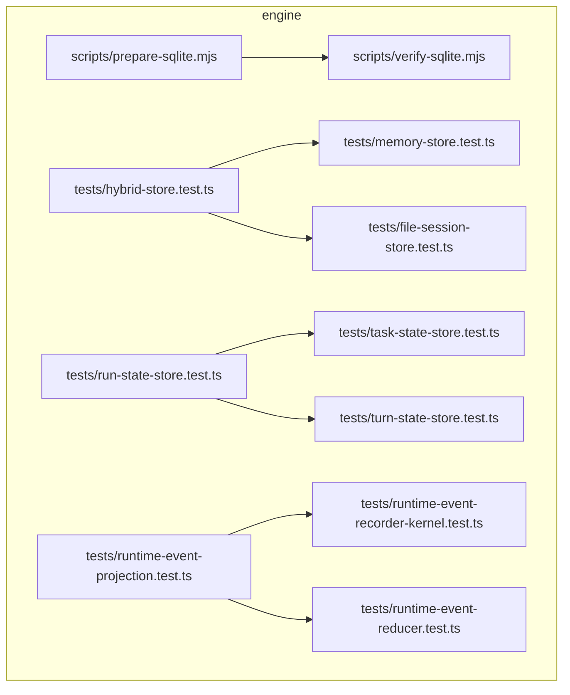
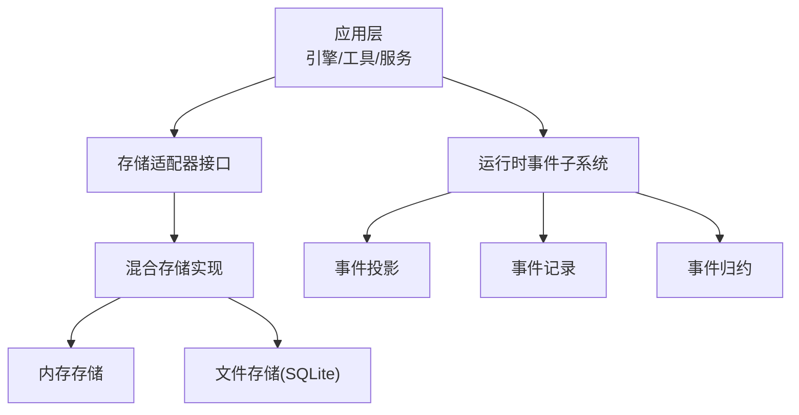
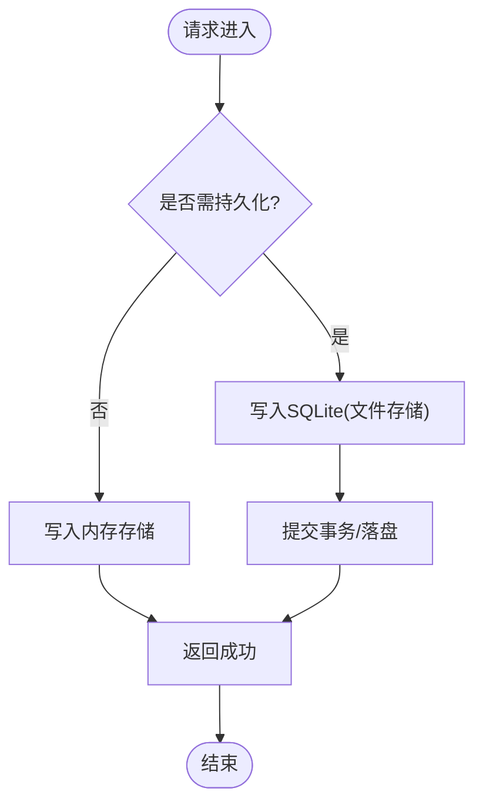
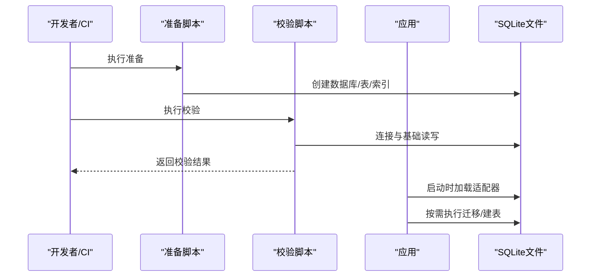
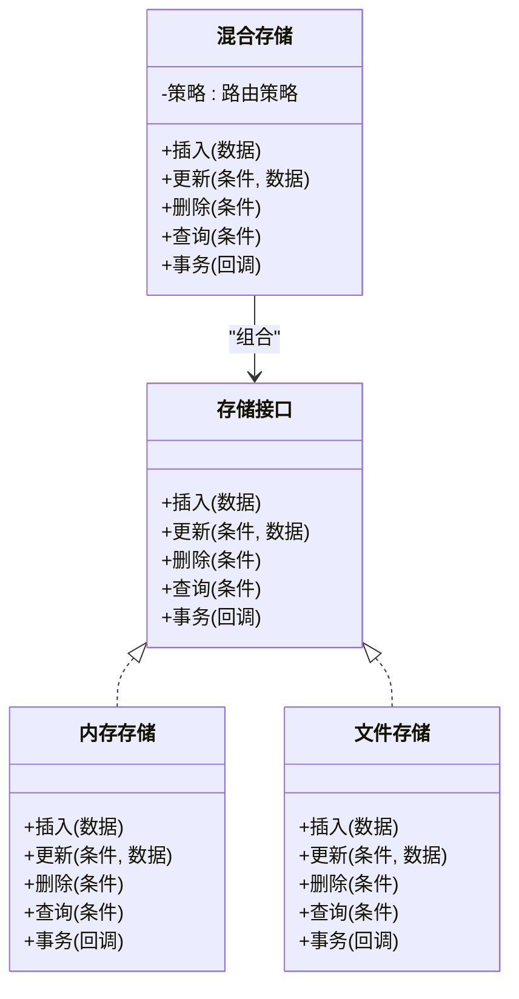
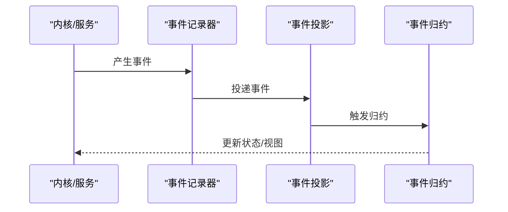
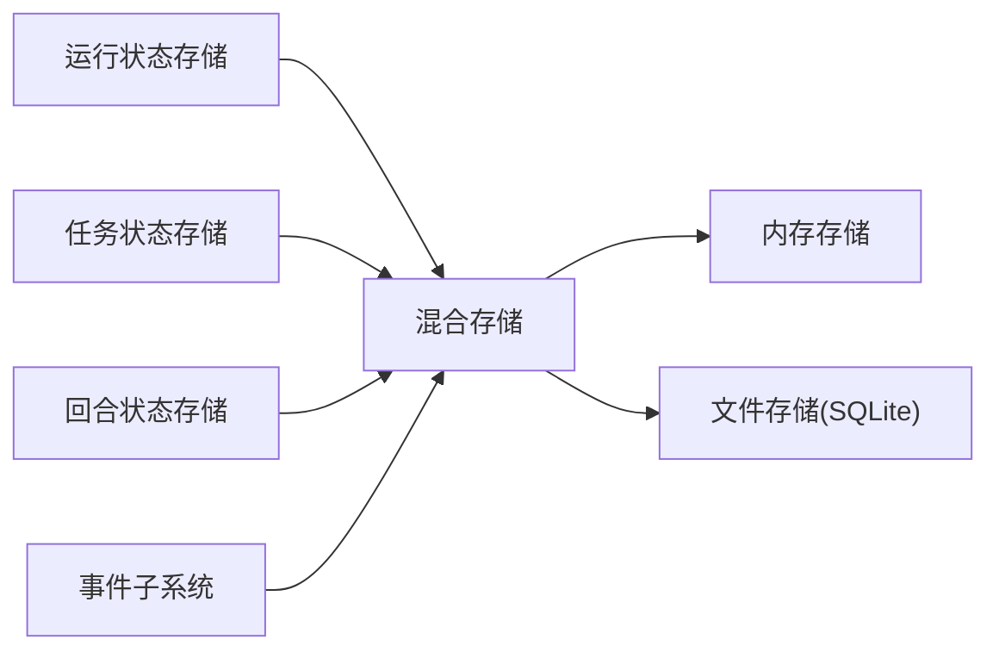

# 数据库选型

<cite>
**本文引用的文件**   
- [engine/scripts/prepare-sqlite.mjs](file://engine/scripts/prepare-sqlite.mjs)
- [engine/scripts/verify-sqlite.mjs](file://engine/scripts/verify-sqlite.mjs)
- [engine/tests/hybrid-store.test.ts](file://engine/tests/hybrid-store.test.ts)
- [engine/tests/memory-store.test.ts](file://engine/tests/memory-store.test.ts)
- [engine/tests/file-session-store.test.ts](file://engine/tests/file-session-store.test.ts)
- [engine/tests/run-state-store.test.ts](file://engine/tests/run-state-store.test.ts)
- [engine/tests/task-state-store.test.ts](file://engine/tests/task-state-store.test.ts)
- [engine/tests/turn-state-store.test.ts](file://engine/tests/turn-state-store.test.ts)
- [engine/tests/runtime-event-projection.test.ts](file://engine/tests/runtime-event-projection.test.ts)
- [engine/tests/runtime-event-recorder-kernel.test.ts](file://engine/tests/runtime-event-recorder-kernel.test.ts)
- [engine/tests/runtime-event-reducer.test.ts](file://engine/tests/runtime-event-reducer.test.ts)
</cite>

## 目录
1. [引言](#引言)
2. [项目结构](#项目结构)
3. [核心组件](#核心组件)
4. [架构总览](#架构总览)
5. [详细组件分析](#详细组件分析)
6. [依赖分析](#依赖分析)
7. [性能考量](#性能考量)
8. [故障排查指南](#故障排查指南)
9. [结论](#结论)
10. [附录](#附录)

## 引言
本文件面向KCoder的数据库选型与落地方案，重点解释为何选择SQLite作为主要数据库，并给出内存存储与文件存储的选择策略、混合存储架构设计原理、初始化流程、存储适配器抽象设计与切换机制，以及决策树与最佳实践。文档以仓库中现有脚本与测试为依据，确保内容可追溯、可验证。

## 项目结构
围绕数据库相关能力，仓库中与SQLite和存储实现最相关的代码集中在engine子工程：
- 初始化与校验脚本：用于准备SQLite环境、验证SQLite可用性
- 测试用例：覆盖混合存储、内存存储、文件会话存储、运行状态存储、任务状态存储、回合状态存储、运行时事件投影与记录等

图表来源
- [engine/scripts/prepare-sqlite.mjs](file://engine/scripts/prepare-sqlite.mjs)
- [engine/scripts/verify-sqlite.mjs](file://engine/scripts/verify-sqlite.mjs)
- [engine/tests/hybrid-store.test.ts](file://engine/tests/hybrid-store.test.ts)
- [engine/tests/memory-store.test.ts](file://engine/tests/memory-store.test.ts)
- [engine/tests/file-session-store.test.ts](file://engine/tests/file-session-store.test.ts)
- [engine/tests/run-state-store.test.ts](file://engine/tests/run-state-store.test.ts)
- [engine/tests/task-state-store.test.ts](file://engine/tests/task-state-store.test.ts)
- [engine/tests/turn-state-store.test.ts](file://engine/tests/turn-state-store.test.ts)
- [engine/tests/runtime-event-projection.test.ts](file://engine/tests/runtime-event-projection.test.ts)
- [engine/tests/runtime-event-recorder-kernel.test.ts](file://engine/tests/runtime-event-recorder-kernel.test.ts)
- [engine/tests/runtime-event-reducer.test.ts](file://engine/tests/runtime-event-reducer.test.ts)

章节来源
- [engine/scripts/prepare-sqlite.mjs](file://engine/scripts/prepare-sqlite.mjs)
- [engine/scripts/verify-sqlite.mjs](file://engine/scripts/verify-sqlite.mjs)
- [engine/tests/hybrid-store.test.ts](file://engine/tests/hybrid-store.test.ts)
- [engine/tests/memory-store.test.ts](file://engine/tests/memory-store.test.ts)
- [engine/tests/file-session-store.test.ts](file://engine/tests/file-session-store.test.ts)
- [engine/tests/run-state-store.test.ts](file://engine/tests/run-state-store.test.ts)
- [engine/tests/task-state-store.test.ts](file://engine/tests/task-state-store.test.ts)
- [engine/tests/turn-state-store.test.ts](file://engine/tests/turn-state-store.test.ts)
- [engine/tests/runtime-event-projection.test.ts](file://engine/tests/runtime-event-projection.test.ts)
- [engine/tests/runtime-event-recorder-kernel.test.ts](file://engine/tests/runtime-event-recorder-kernel.test.ts)
- [engine/tests/runtime-event-reducer.test.ts](file://engine/tests/runtime-event-reducer.test.ts)

## 核心组件
- SQLite初始化与校验
  - 通过准备脚本完成SQLite环境的初始化（如创建数据库文件、表结构与索引）
  - 通过校验脚本验证SQLite可用性与基本读写能力
- 混合存储适配层
  - 提供统一的存储接口，支持在内存与持久化后端之间切换
  - 测试覆盖混合存储在不同场景下的行为一致性
- 具体存储实现
  - 内存存储：适用于短生命周期、高性能读写的临时数据
  - 文件会话存储：基于文件的会话级持久化
  - 运行/任务/回合状态存储：针对不同类型状态的持久化或半持久化策略
- 运行时事件子系统
  - 事件投影、记录与归约，支撑可观测性与回放能力

章节来源
- [engine/scripts/prepare-sqlite.mjs](file://engine/scripts/prepare-sqlite.mjs)
- [engine/scripts/verify-sqlite.mjs](file://engine/scripts/verify-sqlite.mjs)
- [engine/tests/hybrid-store.test.ts](file://engine/tests/hybrid-store.test.ts)
- [engine/tests/memory-store.test.ts](file://engine/tests/memory-store.test.ts)
- [engine/tests/file-session-store.test.ts](file://engine/tests/file-session-store.test.ts)
- [engine/tests/run-state-store.test.ts](file://engine/tests/run-state-store.test.ts)
- [engine/tests/task-state-store.test.ts](file://engine/tests/task-state-store.test.ts)
- [engine/tests/turn-state-store.test.ts](file://engine/tests/turn-state-store.test.ts)
- [engine/tests/runtime-event-projection.test.ts](file://engine/tests/runtime-event-projection.test.ts)
- [engine/tests/runtime-event-recorder-kernel.test.ts](file://engine/tests/runtime-event-recorder-kernel.test.ts)
- [engine/tests/runtime-event-reducer.test.ts](file://engine/tests/runtime-event-reducer.test.ts)

## 架构总览
下图展示了KCoder在数据存储层面的整体架构：上层业务通过统一存储接口访问数据；底层由SQLite驱动的文件存储与内存存储共同组成混合存储；同时，运行时事件子系统对关键事件进行记录、投影与归约，为调试与恢复提供支撑。

图表来源
- [engine/tests/hybrid-store.test.ts](file://engine/tests/hybrid-store.test.ts)
- [engine/tests/memory-store.test.ts](file://engine/tests/memory-store.test.ts)
- [engine/tests/file-session-store.test.ts](file://engine/tests/file-session-store.test.ts)
- [engine/tests/runtime-event-projection.test.ts](file://engine/tests/runtime-event-projection.test.ts)
- [engine/tests/runtime-event-recorder-kernel.test.ts](file://engine/tests/runtime-event-recorder-kernel.test.ts)
- [engine/tests/runtime-event-reducer.test.ts](file://engine/tests/runtime-event-reducer.test.ts)

## 详细组件分析

### 为什么选择SQLite
- 零配置与单文件部署：无需独立数据库进程，便于打包与分发
- 事务与ACID：保证写入一致性与崩溃恢复能力
- 轻量与低开销：适合桌面端与嵌入式场景，资源占用小
- 丰富的生态与语言绑定：在Node.js环境中具备成熟驱动与工具链
- 与现有工程契合：仓库提供了SQLite准备与校验脚本，表明已将其纳入构建与验证流程

章节来源
- [engine/scripts/prepare-sqlite.mjs](file://engine/scripts/prepare-sqlite.mjs)
- [engine/scripts/verify-sqlite.mjs](file://engine/scripts/verify-sqlite.mjs)

### 内存存储与文件存储的选择策略
- 使用内存存储的场景
  - 短生命周期数据（如会话内缓存、中间结果）
  - 高并发读、写不要求跨进程持久化的场景
  - 单元测试与快速迭代路径
- 使用文件存储（SQLite）的场景
  - 需要跨进程/重启保留的状态（如任务、运行、会话上下文）
  - 需要事务保障与查询能力的结构化数据
- 混合存储策略
  - 热路径优先走内存，冷路径落盘到SQLite
  - 通过适配器统一暴露接口，按策略路由到不同后端

章节来源
- [engine/tests/hybrid-store.test.ts](file://engine/tests/hybrid-store.test.ts)
- [engine/tests/memory-store.test.ts](file://engine/tests/memory-store.test.ts)
- [engine/tests/file-session-store.test.ts](file://engine/tests/file-session-store.test.ts)

### 混合存储架构的设计原理
- 统一接口：对外暴露一致的增删改查与事务语义
- 策略路由：根据数据类型、生命周期、一致性需求选择后端
- 降级与回退：当持久化不可用时自动回退到内存
- 可观测性：结合事件子系统记录关键操作，便于诊断与回放

图表来源
- [engine/tests/hybrid-store.test.ts](file://engine/tests/hybrid-store.test.ts)

### 数据库初始化流程
- 准备阶段
  - 执行准备脚本，创建SQLite数据库文件、必要的表结构与索引
- 校验阶段
  - 执行校验脚本，验证连接、基本读写与事务能力
- 启动阶段
  - 应用启动时加载适配器，按需执行迁移或建表逻辑（若未存在）
- 运行阶段
  - 业务调用通过适配器访问数据，遵循事务与一致性约束

图表来源
- [engine/scripts/prepare-sqlite.mjs](file://engine/scripts/prepare-sqlite.mjs)
- [engine/scripts/verify-sqlite.mjs](file://engine/scripts/verify-sqlite.mjs)

### 存储适配器的抽象设计与切换机制
- 接口定义
  - 统一方法：插入、更新、删除、查询、事务封装
  - 可选能力：批量操作、分页、条件过滤、索引提示
- 实现类
  - 内存实现：基于内存数据结构，速度快但不持久
  - 文件实现：基于SQLite，持久化且支持复杂查询
- 切换机制
  - 通过配置或环境变量选择后端
  - 运行时可按策略动态切换（例如按数据类型路由）
  - 失败回退：当文件存储不可用时自动切换到内存

图表来源
- [engine/tests/hybrid-store.test.ts](file://engine/tests/hybrid-store.test.ts)
- [engine/tests/memory-store.test.ts](file://engine/tests/memory-store.test.ts)
- [engine/tests/file-session-store.test.ts](file://engine/tests/file-session-store.test.ts)

### 运行时事件子系统与持久化
- 事件记录：捕获关键运行事件，便于追踪与审计
- 事件投影：将事件流转换为可读视图，提升查询效率
- 事件归约：聚合事件生成最终状态，支撑恢复与回放

图表来源
- [engine/tests/runtime-event-projection.test.ts](file://engine/tests/runtime-event-projection.test.ts)
- [engine/tests/runtime-event-recorder-kernel.test.ts](file://engine/tests/runtime-event-recorder-kernel.test.ts)
- [engine/tests/runtime-event-reducer.test.ts](file://engine/tests/runtime-event-reducer.test.ts)

## 依赖分析
- 内部依赖
  - 混合存储依赖内存与文件两种后端实现
  - 各类状态存储（运行、任务、回合）复用统一适配器
  - 事件子系统与存储解耦，通过事件总线交互
- 外部依赖
  - SQLite驱动与相关工具（由准备与校验脚本引入）

图表来源
- [engine/tests/hybrid-store.test.ts](file://engine/tests/hybrid-store.test.ts)
- [engine/tests/run-state-store.test.ts](file://engine/tests/run-state-store.test.ts)
- [engine/tests/task-state-store.test.ts](file://engine/tests/task-state-store.test.ts)
- [engine/tests/turn-state-store.test.ts](file://engine/tests/turn-state-store.test.ts)

## 性能考量
- 内存存储
  - 优势：极低延迟、极高吞吐，适合热点数据与中间计算
  - 限制：进程退出后数据丢失，不适合长期保存
- 文件存储（SQLite）
  - 优势：事务一致、查询能力强、单文件易管理
  - 限制：在高并发写入下可能成为瓶颈，需合理设计索引与批处理
- 混合策略
  - 读多写少：优先内存缓存，定期落盘
  - 写多读少：直接落盘，必要时加索引与批提交
  - 一致性要求高：使用事务包裹关键路径，避免部分写入

[本节为通用指导，不直接分析具体文件]

## 故障排查指南
- 初始化失败
  - 检查准备脚本是否成功创建数据库文件与表结构
  - 确认权限与磁盘空间
- 连接与读写异常
  - 运行校验脚本定位问题（连接、锁、损坏）
  - 查看日志中的错误码与堆栈
- 性能问题
  - 分析慢查询，补充必要索引
  - 评估事务粒度与批处理大小
- 数据不一致
  - 核对事务边界与回滚逻辑
  - 利用事件投影与归约结果进行比对

章节来源
- [engine/scripts/prepare-sqlite.mjs](file://engine/scripts/prepare-sqlite.mjs)
- [engine/scripts/verify-sqlite.mjs](file://engine/scripts/verify-sqlite.mjs)

## 结论
KCoder选择SQLite作为主要数据库，结合内存存储形成混合架构，既满足高性能与低延迟的短期数据处理需求，又保证了关键状态的持久化与一致性。通过统一的存储适配器与事件子系统，系统具备良好的可扩展性与可观测性。建议在生产环境中严格遵循事务与索引优化原则，并结合事件回放能力完善恢复机制。

[本节为总结性内容，不直接分析具体文件]

## 附录

### 数据库选型决策树
- 是否需要跨进程/重启保留？
  - 是 → 使用SQLite（文件存储）
  - 否 → 进入下一步
- 是否要求强一致与事务？
  - 是 → 使用SQLite（文件存储）
  - 否 → 进入下一步
- 是否对延迟极度敏感且数据可丢弃？
  - 是 → 使用内存存储
  - 否 → 使用SQLite（文件存储）

[本节为概念性内容，不直接分析具体文件]

### 最佳实践清单
- 明确数据生命周期：区分热数据与冷数据
- 合理使用事务：缩小事务范围，避免长事务
- 索引先行：根据查询模式设计索引
- 批处理写入：合并小写入，降低锁竞争
- 监控与告警：关注锁等待、慢查询与磁盘IO
- 备份与恢复：定期导出SQLite文件，建立恢复演练

[本节为通用指导，不直接分析具体文件]