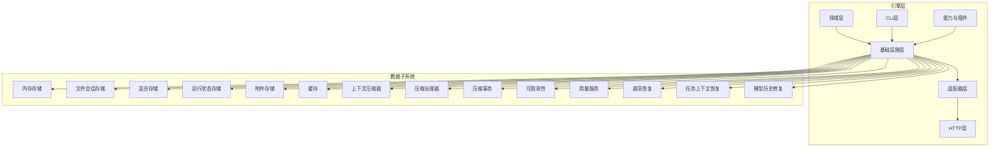
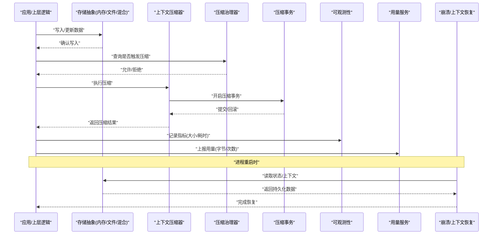
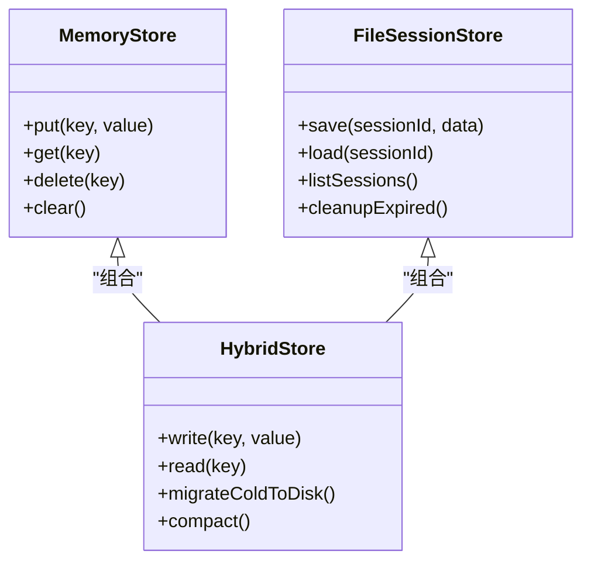
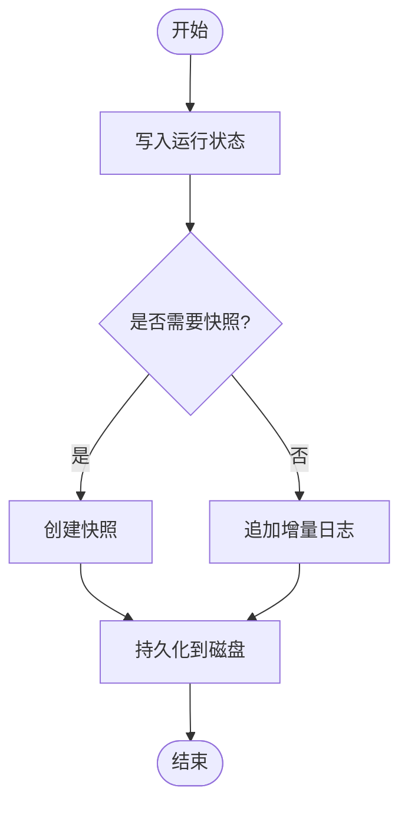
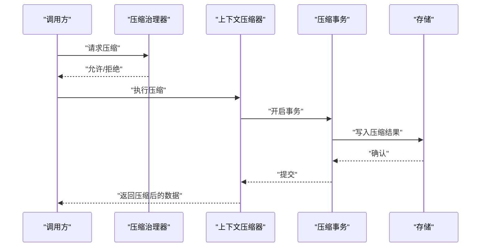
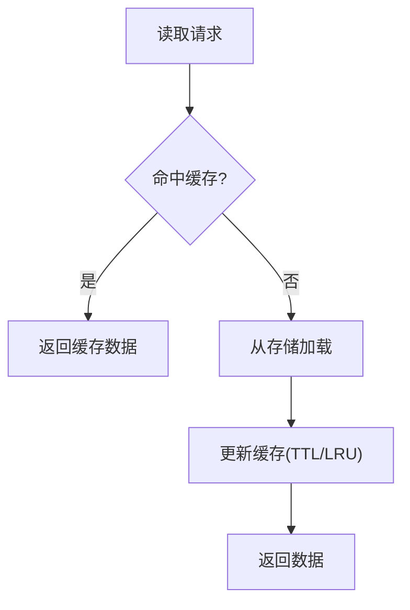
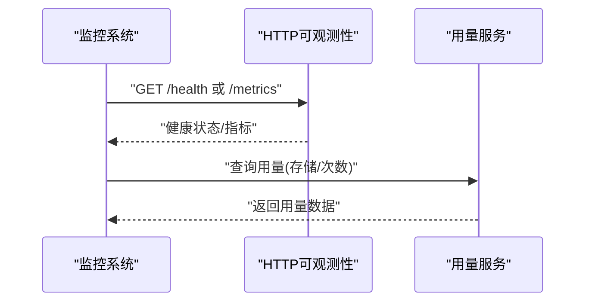
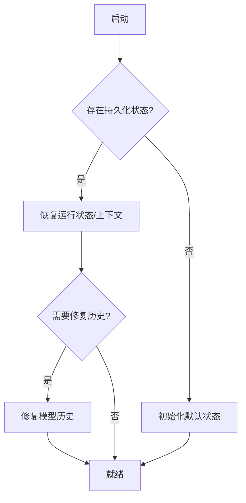
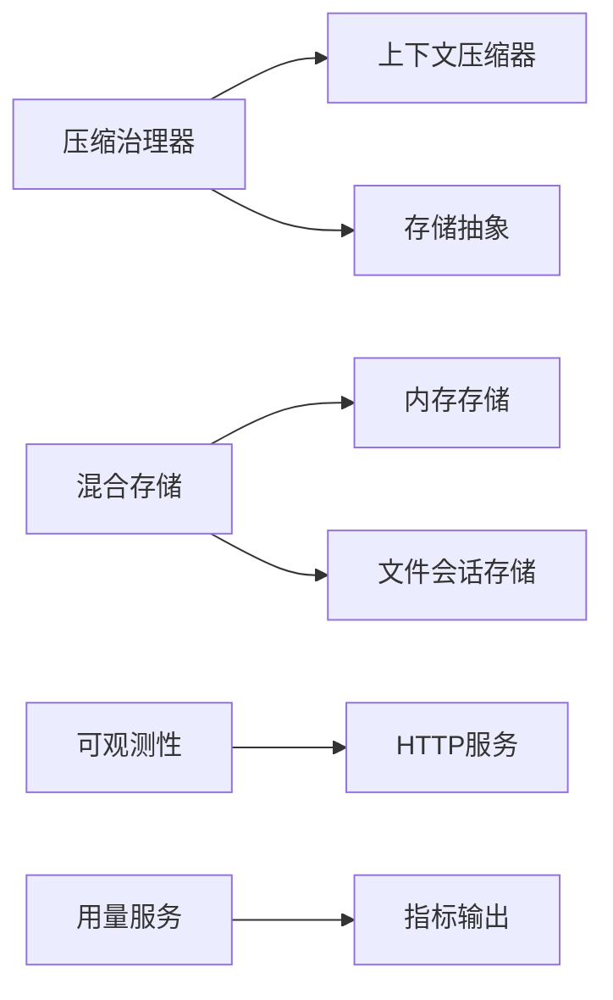

# 数据生命周期管理

<cite>
**本文引用的文件**   
- [engine/README.md](file://engine/README.md)
- [engine/config.example.json](file://engine/config.example.json)
- [engine/scripts/prepare-sqlite.mjs](file://engine/scripts/prepare-sqlite.mjs)
- [engine/tests/run-state-store.test.ts](file://engine/tests/run-state-store.test.ts)
- [engine/tests/file-session-store.test.ts](file://engine/tests/file-session-store.test.ts)
- [engine/tests/hybrid-store.test.ts](file://engine/tests/hybrid-store.test.ts)
- [engine/tests/memory-store.test.ts](file://engine/tests/memory-store.test.ts)
- [engine/tests/cache.test.ts](file://engine/tests/cache.test.ts)
- [engine/tests/attachment-store.test.ts](file://engine/tests/attachment-store.test.ts)
- [engine/tests/http-server-observability.test.ts](file://engine/tests/http-server-observability.test.ts)
- [engine/tests/runtime-kernel-crash-recovery.test.ts](file://engine/tests/runtime-kernel-crash-recovery.test.ts)
- [engine/tests/task-context-recovery.test.ts](file://engine/tests/task-context-recovery.test.ts)
- [engine/tests/model-history-repair.test.ts](file://engine/tests/model-history-repair.test.ts)
- [engine/tests/compaction-governor.test.ts](file://engine/tests/compaction-governor.test.ts)
- [engine/tests/compaction-transaction.test.ts](file://engine/tests/compaction-transaction.test.ts)
- [engine/tests/context-compactor.test.ts](file://engine/tests/context-compactor.test.ts)
- [engine/tests/usage-service.test.ts](file://engine/tests/usage-service.test.ts)
</cite>

## 目录
1. [简介](#简介)
2. [项目结构](#项目结构)
3. [核心组件](#核心组件)
4. [架构总览](#架构总览)
5. [详细组件分析](#详细组件分析)
6. [依赖关系分析](#依赖关系分析)
7. [性能考量](#性能考量)
8. [故障排查指南](#故障排查指南)
9. [结论](#结论)
10. [附录](#附录)

## 简介
本技术文档围绕KCoder的数据生命周期管理展开，覆盖数据的创建、更新、归档、清理与销毁等阶段；并深入阐述数据清理策略（过期数据处理、存储空间回收、垃圾回收机制）、数据归档机制（历史数据存储、压缩策略、归档格式）、备份恢复策略（定期备份、增量备份、灾难恢复）、数据压缩与去重（重复数据检测、压缩算法选择、存储优化），以及数据监控与告警（存储使用率监控、性能指标收集、异常告警）。同时提供数据治理最佳实践与合规要求建议。

## 项目结构
KCoder采用多包工程组织，引擎层位于 engine 目录，包含领域层、基础设施层、适配器层、HTTP层、CLI层、能力注册与插件体系等。数据生命周期相关的关键实现主要分布在：
- 持久化与缓存：内存存储、文件会话存储、混合存储、运行状态存储、附件存储、缓存模块
- 压缩与上下文管理：上下文压缩器、压缩治理器、压缩事务
- 可观测性与监控：HTTP服务可观测性测试、用量服务
- 恢复与一致性：崩溃恢复、任务上下文恢复、模型历史修复
- 配置与初始化：示例配置、SQLite准备脚本

[此图为概念性结构示意，不直接映射具体源文件]

## 核心组件
- 存储抽象与实现
  - 内存存储：用于快速读写与测试场景
  - 文件会话存储：以文件系统为后端，保存会话级数据
  - 混合存储：结合内存与持久化，兼顾性能与可靠性
  - 运行状态存储：保存任务/运行态关键状态，支持恢复
  - 附件存储：管理大对象或二进制附件
- 压缩与归档
  - 上下文压缩器：对长上下文进行压缩，降低存储与传输开销
  - 压缩治理器：控制压缩触发条件与频率
  - 压缩事务：保证压缩操作的原子性与一致性
- 可观测性与用量
  - HTTP服务可观测性：暴露健康检查、指标端点
  - 用量服务：统计资源使用量，辅助容量规划与计费
- 恢复与一致性
  - 崩溃恢复：进程重启后恢复运行状态
  - 任务上下文恢复：从持久化中重建任务上下文
  - 模型历史修复：修复不一致的模型调用历史

章节来源
- [engine/tests/memory-store.test.ts](file://engine/tests/memory-store.test.ts)
- [engine/tests/file-session-store.test.ts](file://engine/tests/file-session-store.test.ts)
- [engine/tests/hybrid-store.test.ts](file://engine/tests/hybrid-store.test.ts)
- [engine/tests/run-state-store.test.ts](file://engine/tests/run-state-store.test.ts)
- [engine/tests/attachment-store.test.ts](file://engine/tests/attachment-store.test.ts)
- [engine/tests/cache.test.ts](file://engine/tests/cache.test.ts)
- [engine/tests/context-compactor.test.ts](file://engine/tests/context-compactor.test.ts)
- [engine/tests/compaction-governor.test.ts](file://engine/tests/compaction-governor.test.ts)
- [engine/tests/compaction-transaction.test.ts](file://engine/tests/compaction-transaction.test.ts)
- [engine/tests/http-server-observability.test.ts](file://engine/tests/http-server-observability.test.ts)
- [engine/tests/usage-service.test.ts](file://engine/tests/usage-service.test.ts)
- [engine/tests/runtime-kernel-crash-recovery.test.ts](file://engine/tests/runtime-kernel-crash-recovery.test.ts)
- [engine/tests/task-context-recovery.test.ts](file://engine/tests/task-context-recovery.test.ts)
- [engine/tests/model-history-repair.test.ts](file://engine/tests/model-history-repair.test.ts)

## 架构总览
下图展示了数据在KCoder中的端到端生命周期流转，包括写入、压缩、归档、清理与恢复路径。

图表来源
- [engine/tests/hybrid-store.test.ts](file://engine/tests/hybrid-store.test.ts)
- [engine/tests/context-compactor.test.ts](file://engine/tests/context-compactor.test.ts)
- [engine/tests/compaction-governor.test.ts](file://engine/tests/compaction-governor.test.ts)
- [engine/tests/compaction-transaction.test.ts](file://engine/tests/compaction-transaction.test.ts)
- [engine/tests/http-server-observability.test.ts](file://engine/tests/http-server-observability.test.ts)
- [engine/tests/usage-service.test.ts](file://engine/tests/usage-service.test.ts)
- [engine/tests/runtime-kernel-crash-recovery.test.ts](file://engine/tests/runtime-kernel-crash-recovery.test.ts)
- [engine/tests/task-context-recovery.test.ts](file://engine/tests/task-context-recovery.test.ts)

## 详细组件分析

### 存储子系统（内存/文件/混合）
- 职责与边界
  - 内存存储：提供低延迟读写，适合热数据与测试
  - 文件会话存储：将会话数据落盘，具备进程外持久化能力
  - 混合存储：读路径优先内存，写路径同步到持久化，兼顾一致性与性能
- 生命周期阶段
  - 创建：写入键值或结构化数据，分配ID/版本
  - 更新：按版本合并或追加日志，确保幂等
  - 归档：将冷数据迁移至文件/混合后端
  - 清理：基于过期策略与空间阈值删除冗余条目
  - 销毁：释放句柄与内存，关闭文件描述符
- 复杂度与优化
  - 时间复杂度：O(1)~O(logN)取决于索引结构
  - 空间优化：去重与压缩减少冗余
  - 并发安全：读写锁或无锁队列保障一致性

图表来源
- [engine/tests/memory-store.test.ts](file://engine/tests/memory-store.test.ts)
- [engine/tests/file-session-store.test.ts](file://engine/tests/file-session-store.test.ts)
- [engine/tests/hybrid-store.test.ts](file://engine/tests/hybrid-store.test.ts)

章节来源
- [engine/tests/memory-store.test.ts](file://engine/tests/memory-store.test.ts)
- [engine/tests/file-session-store.test.ts](file://engine/tests/file-session-store.test.ts)
- [engine/tests/hybrid-store.test.ts](file://engine/tests/hybrid-store.test.ts)

### 运行状态存储与附件存储
- 运行状态存储
  - 负责保存任务/运行态关键信息，支持崩溃后恢复
  - 提供快照与增量日志，便于快速回放
- 附件存储
  - 管理大对象/二进制附件，支持分块写入与校验
  - 与运行状态解耦，避免主状态膨胀

图表来源
- [engine/tests/run-state-store.test.ts](file://engine/tests/run-state-store.test.ts)
- [engine/tests/attachment-store.test.ts](file://engine/tests/attachment-store.test.ts)

章节来源
- [engine/tests/run-state-store.test.ts](file://engine/tests/run-state-store.test.ts)
- [engine/tests/attachment-store.test.ts](file://engine/tests/attachment-store.test.ts)

### 压缩与归档（上下文压缩器/治理器/事务）
- 上下文压缩器
  - 对长上下文进行摘要/裁剪/编码，降低体积
  - 支持无损或有损压缩策略，依据业务容忍度选择
- 压缩治理器
  - 根据阈值（大小、时间、频率）决定是否触发压缩
  - 防止频繁压缩导致抖动
- 压缩事务
  - 将压缩过程封装为事务，失败自动回滚，保证一致性

图表来源
- [engine/tests/context-compactor.test.ts](file://engine/tests/context-compactor.test.ts)
- [engine/tests/compaction-governor.test.ts](file://engine/tests/compaction-governor.test.ts)
- [engine/tests/compaction-transaction.test.ts](file://engine/tests/compaction-transaction.test.ts)

章节来源
- [engine/tests/context-compactor.test.ts](file://engine/tests/context-compactor.test.ts)
- [engine/tests/compaction-governor.test.ts](file://engine/tests/compaction-governor.test.ts)
- [engine/tests/compaction-transaction.test.ts](file://engine/tests/compaction-transaction.test.ts)

### 缓存与会话缓存
- 缓存模块
  - 提供TTL、LRU等策略，加速热点数据访问
  - 与存储层协同，避免穿透与雪崩
- 会话缓存
  - 针对会话级数据进行短期缓存，提升交互体验

图表来源
- [engine/tests/cache.test.ts](file://engine/tests/cache.test.ts)
- [engine/tests/file-session-store.test.ts](file://engine/tests/file-session-store.test.ts)

章节来源
- [engine/tests/cache.test.ts](file://engine/tests/cache.test.ts)
- [engine/tests/file-session-store.test.ts](file://engine/tests/file-session-store.test.ts)

### 可观测性与用量统计
- HTTP服务可观测性
  - 暴露健康检查与指标端点，便于外部监控系统采集
- 用量服务
  - 统计存储占用、操作次数、压缩比等指标，支撑容量规划与成本核算

图表来源
- [engine/tests/http-server-observability.test.ts](file://engine/tests/http-server-observability.test.ts)
- [engine/tests/usage-service.test.ts](file://engine/tests/usage-service.test.ts)

章节来源
- [engine/tests/http-server-observability.test.ts](file://engine/tests/http-server-observability.test.ts)
- [engine/tests/usage-service.test.ts](file://engine/tests/usage-service.test.ts)

### 恢复与一致性（崩溃/上下文/模型历史）
- 崩溃恢复
  - 进程重启后从持久化状态恢复运行环境
- 任务上下文恢复
  - 从文件/混合存储重建任务上下文，保证连续性
- 模型历史修复
  - 修复不一致的模型调用历史，确保审计与回放正确

图表来源
- [engine/tests/runtime-kernel-crash-recovery.test.ts](file://engine/tests/runtime-kernel-crash-recovery.test.ts)
- [engine/tests/task-context-recovery.test.ts](file://engine/tests/task-context-recovery.test.ts)
- [engine/tests/model-history-repair.test.ts](file://engine/tests/model-history-repair.test.ts)

章节来源
- [engine/tests/runtime-kernel-crash-recovery.test.ts](file://engine/tests/runtime-kernel-crash-recovery.test.ts)
- [engine/tests/task-context-recovery.test.ts](file://engine/tests/task-context-recovery.test.ts)
- [engine/tests/model-history-repair.test.ts](file://engine/tests/model-history-repair.test.ts)

### 配置与初始化（SQLite准备）
- SQLite准备脚本
  - 初始化数据库结构与必要表，确保运行时可用
- 示例配置
  - 提供默认参数与扩展点，便于部署与环境定制

章节来源
- [engine/scripts/prepare-sqlite.mjs](file://engine/scripts/prepare-sqlite.mjs)
- [engine/config.example.json](file://engine/config.example.json)

## 依赖关系分析
- 组件耦合
  - 压缩治理器依赖上下文压缩器与存储抽象
  - 混合存储组合内存与文件会话存储
  - 可观测性与用量服务独立于业务逻辑，通过接口暴露指标
- 外部依赖
  - 文件系统、SQLite（由准备脚本引入）
  - HTTP服务（用于可观测性）

图表来源
- [engine/tests/compaction-governor.test.ts](file://engine/tests/compaction-governor.test.ts)
- [engine/tests/context-compactor.test.ts](file://engine/tests/context-compactor.test.ts)
- [engine/tests/hybrid-store.test.ts](file://engine/tests/hybrid-store.test.ts)
- [engine/tests/http-server-observability.test.ts](file://engine/tests/http-server-observability.test.ts)
- [engine/tests/usage-service.test.ts](file://engine/tests/usage-service.test.ts)

章节来源
- [engine/tests/compaction-governor.test.ts](file://engine/tests/compaction-governor.test.ts)
- [engine/tests/context-compactor.test.ts](file://engine/tests/context-compactor.test.ts)
- [engine/tests/hybrid-store.test.ts](file://engine/tests/hybrid-store.test.ts)
- [engine/tests/http-server-observability.test.ts](file://engine/tests/http-server-observability.test.ts)
- [engine/tests/usage-service.test.ts](file://engine/tests/usage-service.test.ts)

## 性能考量
- 读写路径优化
  - 热数据走内存，冷数据落盘，混合存储平衡延迟与持久化
- 压缩时机与粒度
  - 通过治理器控制压缩频率，避免抖动；按上下文粒度压缩，减少无效计算
- 事务与一致性
  - 压缩事务保证原子性，失败回滚避免脏数据
- 缓存命中率
  - 合理设置TTL与淘汰策略，提高命中率，降低IO压力
- 指标驱动调优
  - 利用可观测性与用量服务，持续监控并调整阈值与策略

[本节为通用指导，不直接分析具体文件]

## 故障排查指南
- 常见问题定位
  - 写入失败：检查存储抽象与文件权限、SQLite初始化是否成功
  - 压缩失败：查看压缩事务日志，确认治理器阈值与上下文大小
  - 恢复异常：核对运行状态与上下文快照是否完整，必要时执行模型历史修复
  - 指标缺失：确认HTTP可观测性端点可达，用量服务上报正常
- 诊断步骤
  - 启用更详细的日志与指标
  - 复现问题并抓取快照/日志
  - 逐步隔离组件（存储/压缩/恢复）定位根因

章节来源
- [engine/tests/runtime-kernel-crash-recovery.test.ts](file://engine/tests/runtime-kernel-crash-recovery.test.ts)
- [engine/tests/task-context-recovery.test.ts](file://engine/tests/task-context-recovery.test.ts)
- [engine/tests/model-history-repair.test.ts](file://engine/tests/model-history-repair.test.ts)
- [engine/tests/http-server-observability.test.ts](file://engine/tests/http-server-observability.test.ts)
- [engine/tests/usage-service.test.ts](file://engine/tests/usage-service.test.ts)

## 结论
KCoder的数据生命周期管理通过分层存储、压缩治理、事务保障与可观测性体系，实现了高可靠、高性能与可运维的数据处理流程。建议在部署中结合用量与指标持续优化阈值与策略，并遵循数据治理与合规要求，确保数据安全与可追溯。

[本节为总结性内容，不直接分析具体文件]

## 附录

### 数据生命周期阶段说明
- 创建：写入新数据，分配标识与元数据
- 更新：增量更新或版本合并，保持幂等
- 归档：将冷数据迁移至长期存储，支持压缩与去重
- 清理：基于过期策略与空间阈值删除冗余
- 销毁：释放资源，确保无残留

[本节为概念性说明，不直接分析具体文件]

### 数据清理策略
- 过期数据处理：基于时间戳与TTL策略清理
- 存储空间回收：定期扫描与碎片整理
- 垃圾回收机制：引用计数或标记清除，配合事务保证一致性

[本节为概念性说明，不直接分析具体文件]

### 数据归档机制
- 历史数据存储：按会话/任务维度归档
- 压缩策略：有损/无损选择，依据业务容忍度
- 归档格式：统一元数据与载荷分离，便于回放与迁移

[本节为概念性说明，不直接分析具体文件]

### 备份恢复策略
- 定期备份：全量+增量结合，降低RPO/RTO
- 增量备份：仅备份变更部分，提高效率
- 灾难恢复：从快照与日志回放恢复，验证一致性

[本节为概念性说明，不直接分析具体文件]

### 数据压缩与去重
- 重复数据检测：指纹/哈希比对，避免冗余
- 压缩算法选择：权衡CPU与空间，按数据类型选择
- 存储空间优化：冷热分层与压缩联动

[本节为概念性说明，不直接分析具体文件]

### 数据监控与告警
- 存储使用率监控：阈值告警，容量预警
- 性能指标收集：延迟、吞吐、压缩比、命中率
- 异常告警：错误率、恢复失败、指标缺失

[本节为概念性说明，不直接分析具体文件]

### 数据治理与合规
- 数据最小化：仅保留必要数据
- 访问控制：角色与权限分离
- 审计追踪：不可篡改日志与版本留痕
- 隐私保护：敏感数据脱敏与加密

[本节为概念性说明，不直接分析具体文件]