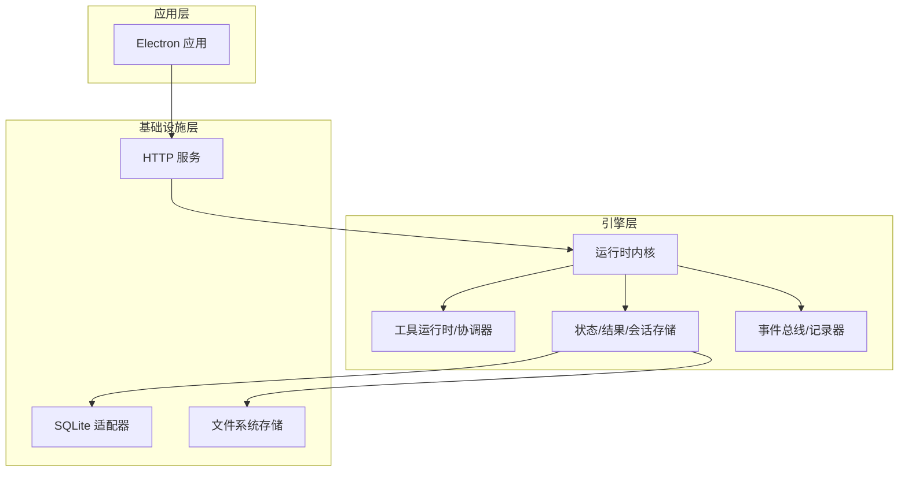
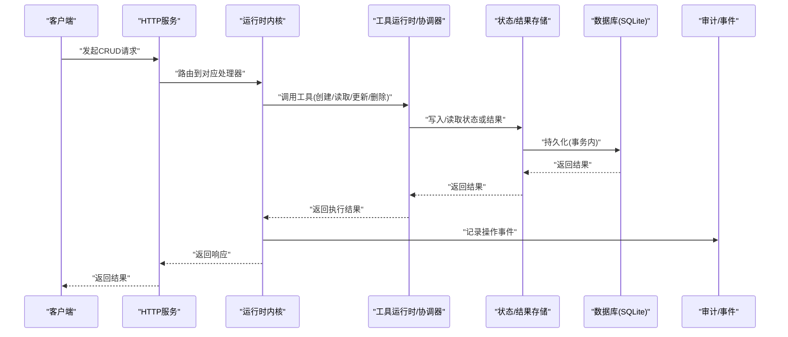
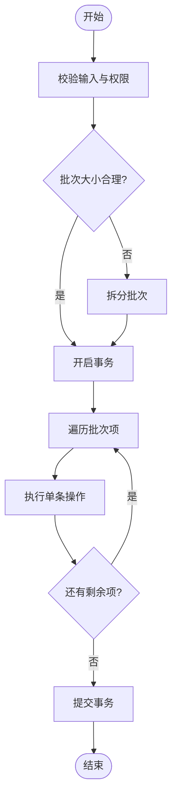
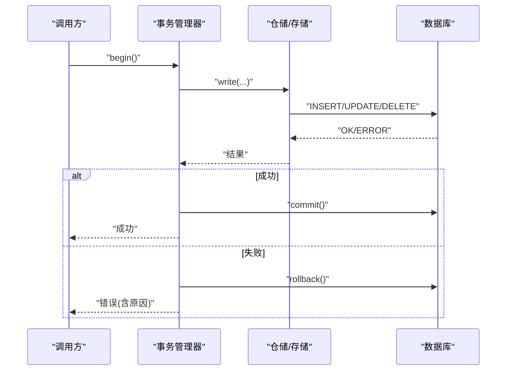
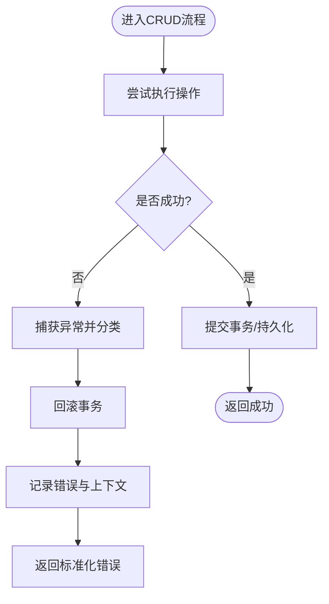
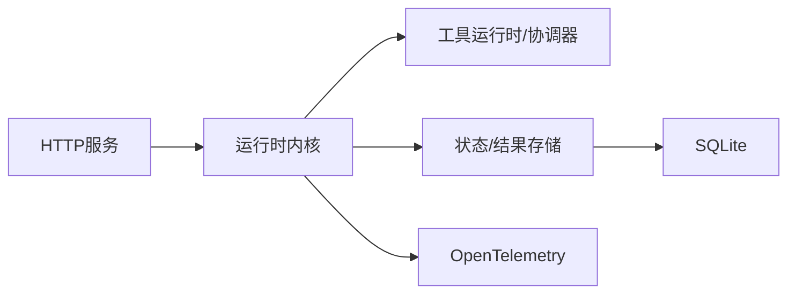

# CRUD操作模式

<cite>
**本文引用的文件**
- [engine/README.md](file://engine/README.md)
- [engine/package.json](file://engine/package.json)
- [engine/pnpm-workspace.yaml](file://engine/pnpm-workspace.yaml)
- [engine/tsconfig.json](file://engine/tsconfig.json)
- [engine/scripts/prepare-sqlite.mjs](file://engine/scripts/prepare-sqlite.mjs)
- [engine/tests/runtime-kernel.test.ts](file://engine/tests/runtime-kernel.test.ts)
- [engine/tests/runtime-kernel-e2e.test.ts](file://engine/tests/runtime-kernel-e2e.test.ts)
- [engine/tests/runtime-kernel-crash-recovery.test.ts](file://engine/tests/runtime-kernel-crash-recovery.test.ts)
- [engine/tests/runtime-kernel-contracts.test.ts](file://engine/tests/runtime-kernel-contracts.test.ts)
- [engine/tests/runtime-kernel-provider-matrix.test.ts](file://engine/tests/runtime-kernel-provider-matrix.test.ts)
- [engine/tests/tool-runtime-v3.test.ts](file://engine/tests/tool-runtime-v3.test.ts)
- [engine/tests/tool-coordinator-runtime.test.ts](file://engine/tests/tool-coordinator-runtime.test.ts)
- [engine/tests/tool-call-repair.test.ts](file://engine/tests/tool-call-repair.test.ts)
- [engine/tests/tool-storm-breaker.test.ts](file://engine/tests/tool-storm-breaker.test.ts)
- [engine/tests/tool-result-budget.test.ts](file://engine/tests/tool-result-budget.test.ts)
- [engine/tests/tool-dispatch-errors.test.ts](file://engine/tests/tool-dispatch-errors.test.ts)
- [engine/tests/compaction-transaction.test.ts](file://engine/tests/compaction-transaction.test.ts)
- [engine/tests/effect-commit.test.ts](file://engine/tests/effect-commit.test.ts)
- [engine/tests/effect-result-store.test.ts](file://engine/tests/effect-result-store.test.ts)
- [engine/tests/file-session-store-integration.test.ts](file://engine/tests/file-session-store-integration.test.ts)
- [engine/tests/file-session-store.test.ts](file://engine/tests/file-session-store.test.ts)
- [engine/tests/hybrid-store.test.ts](file://engine/tests/hybrid-store.test.ts)
- [engine/tests/memory-store.test.ts](file://engine/tests/memory-store.test.ts)
- [engine/tests/run-state-store.test.ts](file://engine/tests/run-state-store.test.ts)
- [engine/tests/task-state-store.test.ts](file://engine/tests/task-state-store.test.ts)
- [engine/tests/turn-state-store.test.ts](file://engine/tests/turn-state-store.test.ts)
- [engine/tests/command-audit.test.ts](file://engine/tests/command-audit.test.ts)
- [engine/tests/http-server.test.ts](file://engine/tests/http-server.test.ts)
- [engine/tests/http-server-test-harness.ts](file://engine/tests/http-server-test-harness.ts)
- [engine/tests/http-artifacts.test.ts](file://engine/tests/http-artifacts.test.ts)
- [engine/tests/opentelemetry.test.ts](file://engine/tests/opentelemetry.test.ts)
</cite>

## 目录
1. [简介](#简介)
2. [项目结构](#项目结构)
3. [核心组件](#核心组件)
4. [架构总览](#架构总览)
5. [详细组件分析](#详细组件分析)
6. [依赖分析](#依赖分析)
7. [性能考虑](#性能考虑)
8. [故障排查指南](#故障排查指南)
9. [结论](#结论)
10. [附录](#附录)

## 简介
本技术文档围绕KCoder的CRUD操作模式，系统化阐述增删改查的标准实现流程、统一接口设计、批量处理机制、事务管理、数据一致性保证、错误处理与回滚、以及操作日志与审计能力。文档以仓库中的测试与脚本为证据来源，结合工程化实践给出可落地的设计与优化建议，帮助读者在KCoder中构建稳定、高效、可观测的数据访问层。

## 项目结构
KCoder采用多包工作区组织，引擎（engine）为核心运行时，包含领域层、基础设施层、HTTP层、端口层等模块；应用层（app）提供前端界面与Electron宿主。与CRUD相关的关键位置包括：
- 引擎层：任务与工具运行、状态存储、事件总线、持久化适配器等
- HTTP层：服务端API暴露与中间件
- 基础设施层：SQLite准备脚本、混合存储、内存存储、文件会话存储等
- 测试用例：覆盖事务、崩溃恢复、审计、HTTP集成等场景

图表来源
- [engine/README.md](file://engine/README.md)
- [engine/scripts/prepare-sqlite.mjs](file://engine/scripts/prepare-sqlite.mjs)
- [engine/tests/http-server.test.ts](file://engine/tests/http-server.test.ts)
- [engine/tests/runtime-kernel.test.ts](file://engine/tests/runtime-kernel.test.ts)
- [engine/tests/tool-runtime-v3.test.ts](file://engine/tests/tool-runtime-v3.test.ts)
- [engine/tests/tool-coordinator-runtime.test.ts](file://engine/tests/tool-coordinator-runtime.test.ts)
- [engine/tests/file-session-store.test.ts](file://engine/tests/file-session-store.test.ts)
- [engine/tests/hybrid-store.test.ts](file://engine/tests/hybrid-store.test.ts)
- [engine/tests/memory-store.test.ts](file://engine/tests/memory-store.test.ts)

章节来源
- [engine/README.md](file://engine/README.md)
- [engine/package.json](file://engine/package.json)
- [engine/pnpm-workspace.yaml](file://engine/pnpm-workspace.yaml)
- [engine/tsconfig.json](file://engine/tsconfig.json)

## 核心组件
- 运行时内核：负责编排任务、调度工具、维护上下文与会话状态，是CRUD操作的执行中枢。
- 工具运行时与协调器：封装具体业务动作（如读写文件、调用外部服务），对外暴露统一的“工具调用”接口，天然支持批量化扩展。
- 状态与结果存储：提供任务状态、运行结果、会话数据的持久化与查询能力，支撑读取与更新路径。
- HTTP服务：将CRUD能力以REST或RPC形式暴露给上层应用或外部系统。
- 事件与审计：记录关键操作事件，用于审计、追踪与回放。

章节来源
- [engine/tests/runtime-kernel.test.ts](file://engine/tests/runtime-kernel.test.ts)
- [engine/tests/tool-runtime-v3.test.ts](file://engine/tests/tool-runtime-v3.test.ts)
- [engine/tests/tool-coordinator-runtime.test.ts](file://engine/tests/tool-coordinator-runtime.test.ts)
- [engine/tests/http-server.test.ts](file://engine/tests/http-server.test.ts)
- [engine/tests/command-audit.test.ts](file://engine/tests/command-audit.test.ts)

## 架构总览
下图展示从HTTP请求到持久化的端到端CRUD流程，体现统一接口、事务边界、错误处理与审计点。

图表来源
- [engine/tests/http-server.test.ts](file://engine/tests/http-server.test.ts)
- [engine/tests/runtime-kernel.test.ts](file://engine/tests/runtime-kernel.test.ts)
- [engine/tests/tool-runtime-v3.test.ts](file://engine/tests/tool-runtime-v3.test.ts)
- [engine/tests/tool-coordinator-runtime.test.ts](file://engine/tests/tool-coordinator-runtime.test.ts)
- [engine/tests/file-session-store.test.ts](file://engine/tests/file-session-store.test.ts)
- [engine/tests/hybrid-store.test.ts](file://engine/tests/hybrid-store.test.ts)
- [engine/tests/memory-store.test.ts](file://engine/tests/memory-store.test.ts)
- [engine/tests/command-audit.test.ts](file://engine/tests/command-audit.test.ts)

## 详细组件分析

### 统一CRUD接口设计
- 目标：为增删改查提供一致的方法签名与语义，屏蔽底层存储差异。
- 建议抽象：
  - create(entity): 插入新记录，返回唯一标识与时间戳
  - read(id|query): 按主键或条件查询，支持分页与投影
  - update(id, patch): 部分或全量更新，返回受影响行数
  - delete(id|query): 按主键或条件删除，支持软删除标记
  - batchCreate(entities), batchUpdate(patches), batchDelete(ids|queries): 批量操作入口
- 参数校验与幂等：
  - 入参校验失败直接返回错误，避免进入事务
  - 通过幂等键或去重策略保障重复提交安全
- 返回值规范：
  - 成功返回结构化结果（含状态码、数据、元信息）
  - 失败返回标准化错误对象（含错误码、消息、堆栈摘要）

章节来源
- [engine/tests/tool-runtime-v3.test.ts](file://engine/tests/tool-runtime-v3.test.ts)
- [engine/tests/tool-coordinator-runtime.test.ts](file://engine/tests/tool-coordinator-runtime.test.ts)
- [engine/tests/runtime-kernel.test.ts](file://engine/tests/runtime-kernel.test.ts)

### 批量操作处理机制
- 批量插入：
  - 使用单条事务包裹多条INSERT，减少往返开销
  - 分片提交：当批次过大时拆分为子批次，降低锁竞争与内存占用
- 批量更新：
  - 合并相同条件的更新，生成最小化SQL
  - 对热点行进行排序以减少锁升级风险
- 批量删除：
  - 优先基于索引字段过滤，避免全表扫描
  - 软删除模式下批量打标记，必要时异步清理
- 性能优化要点：
  - 控制批次大小，平衡吞吐与资源占用
  - 利用连接池与预编译语句
  - 监控慢查询与锁等待，动态调整批次

图表来源
- [engine/tests/tool-runtime-v3.test.ts](file://engine/tests/tool-runtime-v3.test.ts)
- [engine/tests/tool-coordinator-runtime.test.ts](file://engine/tests/tool-coordinator-runtime.test.ts)
- [engine/tests/compaction-transaction.test.ts](file://engine/tests/compaction-transaction.test.ts)

章节来源
- [engine/tests/tool-runtime-v3.test.ts](file://engine/tests/tool-runtime-v3.test.ts)
- [engine/tests/tool-coordinator-runtime.test.ts](file://engine/tests/tool-coordinator-runtime.test.ts)
- [engine/tests/compaction-transaction.test.ts](file://engine/tests/compaction-transaction.test.ts)

### 事务管理实现
- 数据库事务：
  - 所有写操作在事务边界内执行，确保原子性与隔离性
  - 根据操作类型选择合适的事务隔离级别
- 应用层事务：
  - 跨多个存储或服务的操作由应用层编排，保证整体一致性
  - 使用补偿逻辑或Saga模式处理长事务
- 分布式事务：
  - 对于跨进程/跨服务的CRUD，采用可靠事件+最终一致性方案
  - 引入幂等键与重试策略，避免重复执行导致不一致
- 事务边界与回滚：
  - 明确事务起点与终点，异常触发回滚
  - 捕获并分类异常，区分可重试与不可重试错误

图表来源
- [engine/tests/compaction-transaction.test.ts](file://engine/tests/compaction-transaction.test.ts)
- [engine/tests/effect-commit.test.ts](file://engine/tests/effect-commit.test.ts)
- [engine/tests/effect-result-store.test.ts](file://engine/tests/effect-result-store.test.ts)
- [engine/tests/runtime-kernel.test.ts](file://engine/tests/runtime-kernel.test.ts)

章节来源
- [engine/tests/compaction-transaction.test.ts](file://engine/tests/compaction-transaction.test.ts)
- [engine/tests/effect-commit.test.ts](file://engine/tests/effect-commit.test.ts)
- [engine/tests/effect-result-store.test.ts](file://engine/tests/effect-result-store.test.ts)
- [engine/tests/runtime-kernel.test.ts](file://engine/tests/runtime-kernel.test.ts)

### 数据一致性保证
- ACID特性：
  - 原子性：事务内全部成功或全部失败
  - 一致性：约束与校验保证数据合法
  - 隔离性：合理隔离级别避免脏读/幻读
  - 持久性：提交后落盘，具备崩溃恢复能力
- 最终一致性：
  - 通过事件驱动与重试队列达成跨域一致
  - 幂等键与去重表防止重复消费
- 冲突解决策略：
  - 乐观锁：版本号或时间戳比较，冲突时重试或提示用户
  - 合并策略：按字段优先级或业务规则合并变更
  - 冲突检测：变更集比对，提前发现潜在冲突

章节来源
- [engine/tests/runtime-kernel-crash-recovery.test.ts](file://engine/tests/runtime-kernel-crash-recovery.test.ts)
- [engine/tests/runtime-kernel-contracts.test.ts](file://engine/tests/runtime-kernel-contracts.test.ts)
- [engine/tests/tool-call-repair.test.ts](file://engine/tests/tool-call-repair.test.ts)

### 错误处理与回滚机制
- 异常捕获：
  - 分层捕获：HTTP层、内核层、工具层分别处理不同错误
  - 错误分类：网络错误、业务错误、系统错误，分别采取重试、降级或告警
- 事务回滚：
  - 任何未预期异常均触发回滚，保持数据一致
  - 记录回滚原因与上下文，便于定位问题
- 数据恢复：
  - 基于快照与事件日志的重放恢复
  - 断点续跑与任务重启，提升鲁棒性

图表来源
- [engine/tests/tool-dispatch-errors.test.ts](file://engine/tests/tool-dispatch-errors.test.ts)
- [engine/tests/tool-call-repair.test.ts](file://engine/tests/tool-call-repair.test.ts)
- [engine/tests/runtime-kernel-crash-recovery.test.ts](file://engine/tests/runtime-kernel-crash-recovery.test.ts)

章节来源
- [engine/tests/tool-dispatch-errors.test.ts](file://engine/tests/tool-dispatch-errors.test.ts)
- [engine/tests/tool-call-repair.test.ts](file://engine/tests/tool-call-repair.test.ts)
- [engine/tests/runtime-kernel-crash-recovery.test.ts](file://engine/tests/runtime-kernel-crash-recovery.test.ts)

### 操作日志与审计功能
- 审计范围：
  - 记录关键CRUD操作的主体、客体、动作、时间、结果
  - 敏感字段脱敏，保留必要上下文用于追溯
- 实现方式：
  - 在工具调用前后埋点，统一收集事件
  - 将审计事件持久化到独立表或日志系统
- 查询与分析：
  - 提供审计查询接口，支持按时间、主体、动作筛选
  - 与链路追踪集成，形成完整操作画像

章节来源
- [engine/tests/command-audit.test.ts](file://engine/tests/command-audit.test.ts)
- [engine/tests/opentelemetry.test.ts](file://engine/tests/opentelemetry.test.ts)

## 依赖分析
- 组件耦合：
  - HTTP服务依赖内核与工具运行时，低耦合高内聚
  - 存储层通过接口抽象，便于替换实现（内存、文件、SQLite）
- 外部依赖：
  - SQLite作为默认持久化后端，适合单机与轻量部署
  - OpenTelemetry用于可观测性采集
- 循环依赖：
  - 通过分层与接口解耦，避免循环引用

图表来源
- [engine/tests/http-server.test.ts](file://engine/tests/http-server.test.ts)
- [engine/tests/runtime-kernel.test.ts](file://engine/tests/runtime-kernel.test.ts)
- [engine/tests/tool-runtime-v3.test.ts](file://engine/tests/tool-runtime-v3.test.ts)
- [engine/tests/tool-coordinator-runtime.test.ts](file://engine/tests/tool-coordinator-runtime.test.ts)
- [engine/tests/hybrid-store.test.ts](file://engine/tests/hybrid-store.test.ts)
- [engine/tests/memory-store.test.ts](file://engine/tests/memory-store.test.ts)
- [engine/tests/opentelemetry.test.ts](file://engine/tests/opentelemetry.test.ts)

章节来源
- [engine/tests/http-server.test.ts](file://engine/tests/http-server.test.ts)
- [engine/tests/runtime-kernel.test.ts](file://engine/tests/runtime-kernel.test.ts)
- [engine/tests/tool-runtime-v3.test.ts](file://engine/tests/tool-runtime-v3.test.ts)
- [engine/tests/tool-coordinator-runtime.test.ts](file://engine/tests/tool-coordinator-runtime.test.ts)
- [engine/tests/hybrid-store.test.ts](file://engine/tests/hybrid-store.test.ts)
- [engine/tests/memory-store.test.ts](file://engine/tests/memory-store.test.ts)
- [engine/tests/opentelemetry.test.ts](file://engine/tests/opentelemetry.test.ts)

## 性能考虑
- 批量操作：
  - 合理设置批次大小，避免单次事务过大导致锁竞争
  - 使用预编译语句与连接池复用
- 索引与查询：
  - 为高频查询字段建立索引，避免全表扫描
  - 分页与投影减少数据传输量
- 并发与锁：
  - 热点行加锁粒度细化，减少阻塞
  - 使用乐观锁提高并发度
- 监控与调优：
  - 采集慢查询、锁等待、事务时长指标
  - 基于指标动态调整批次与隔离级别

[本节为通用指导，不直接分析具体文件]

## 故障排查指南
- 常见问题：
  - 事务超时：检查长事务与锁等待，缩短事务范围
  - 死锁：调整更新顺序与锁粒度，增加重试与退避
  - 数据不一致：核对幂等键与事件去重，确认补偿逻辑
- 定位手段：
  - 查看审计日志与链路追踪，还原操作序列
  - 启用调试日志，关注异常堆栈与上下文
- 恢复策略：
  - 基于快照与事件日志回放恢复
  - 针对特定实体进行修复脚本执行

章节来源
- [engine/tests/runtime-kernel-crash-recovery.test.ts](file://engine/tests/runtime-kernel-crash-recovery.test.ts)
- [engine/tests/command-audit.test.ts](file://engine/tests/command-audit.test.ts)
- [engine/tests/opentelemetry.test.ts](file://engine/tests/opentelemetry.test.ts)

## 结论
KCoder的CRUD操作模式以运行时内核为中心，通过工具运行时与存储抽象实现统一接口与可扩展能力。借助事务管理、一致性策略、错误处理与审计机制，系统在可靠性、性能与可观测性方面具备良好基础。建议在后续迭代中持续完善批量优化、分布式一致性与可观测性指标，以满足更复杂的生产场景。

[本节为总结，不直接分析具体文件]

## 附录
- 配置与环境：
  - SQLite初始化脚本位于scripts目录，用于准备数据库环境
- 参考测试：
  - 端到端与集成测试覆盖HTTP、内核、工具、存储、审计等关键路径

章节来源
- [engine/scripts/prepare-sqlite.mjs](file://engine/scripts/prepare-sqlite.mjs)
- [engine/tests/runtime-kernel-e2e.test.ts](file://engine/tests/runtime-kernel-e2e.test.ts)
- [engine/tests/http-server-test-harness.ts](file://engine/tests/http-server-test-harness.ts)
- [engine/tests/http-artifacts.test.ts](file://engine/tests/http-artifacts.test.ts)