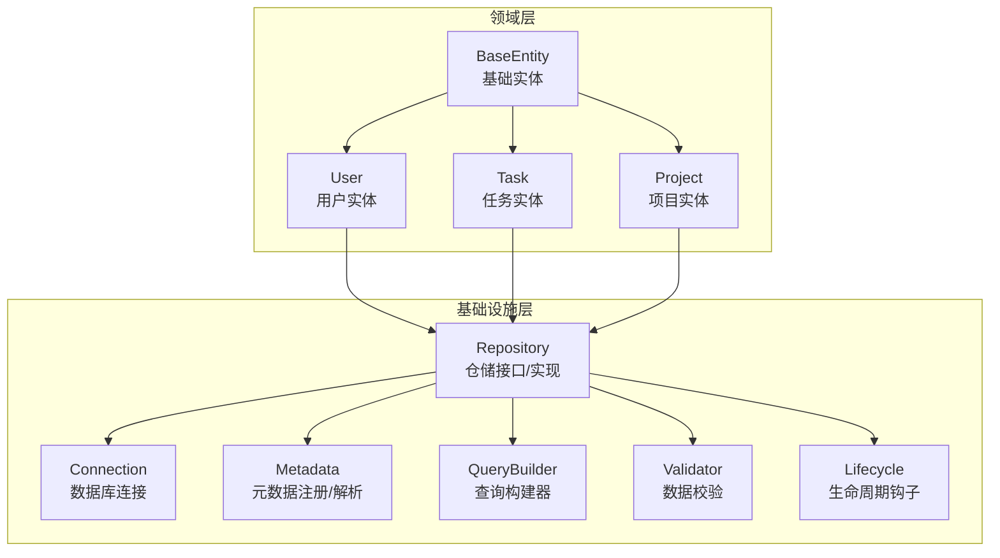
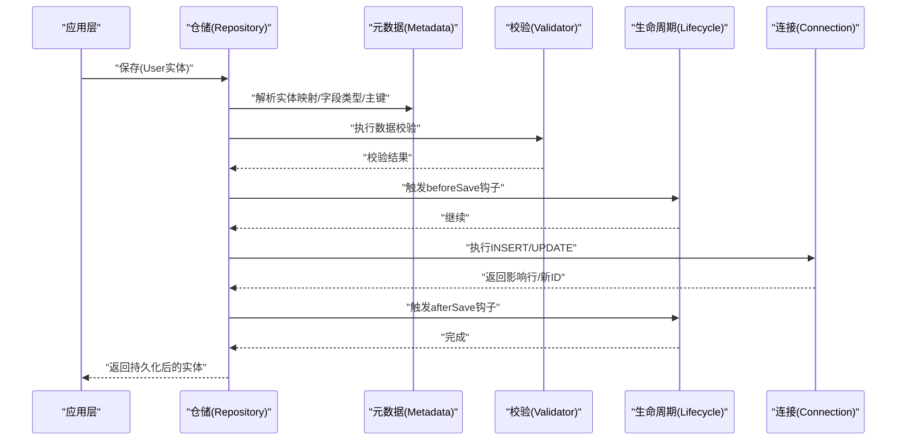
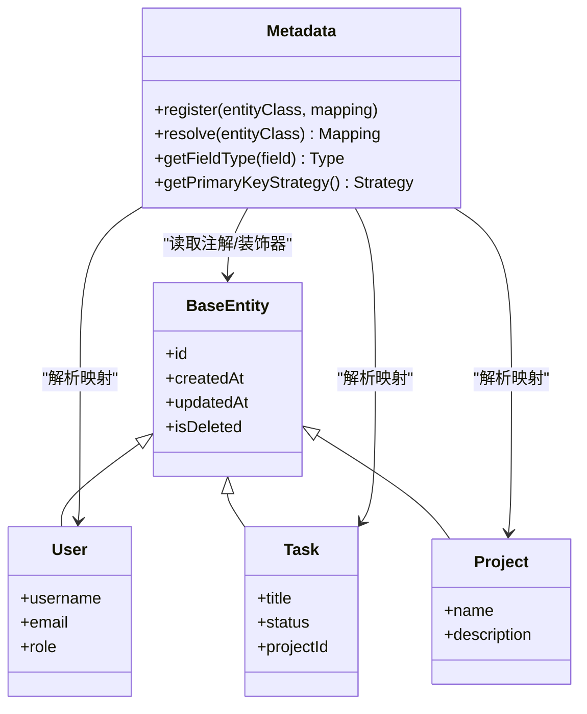
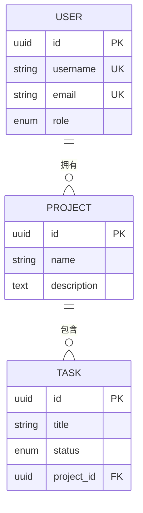
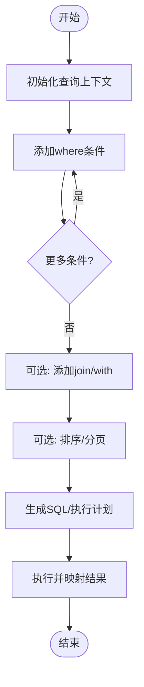
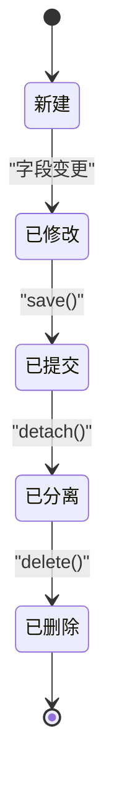
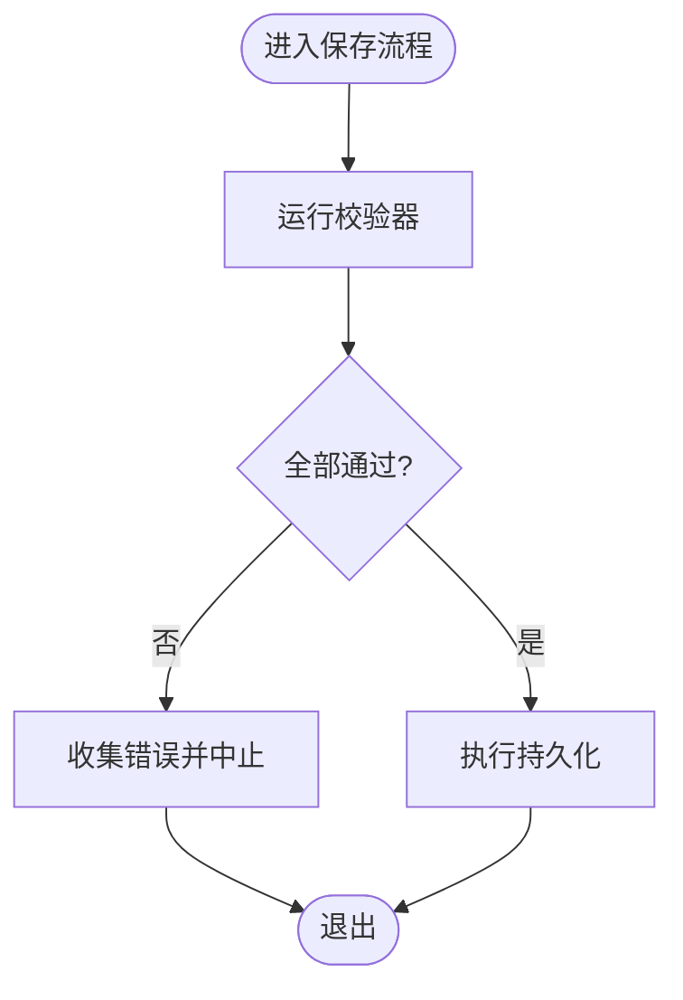
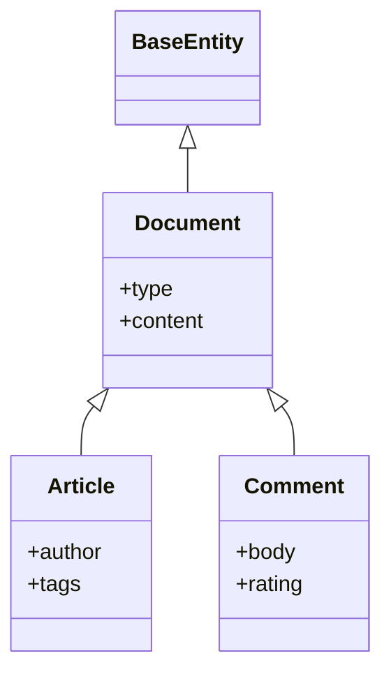
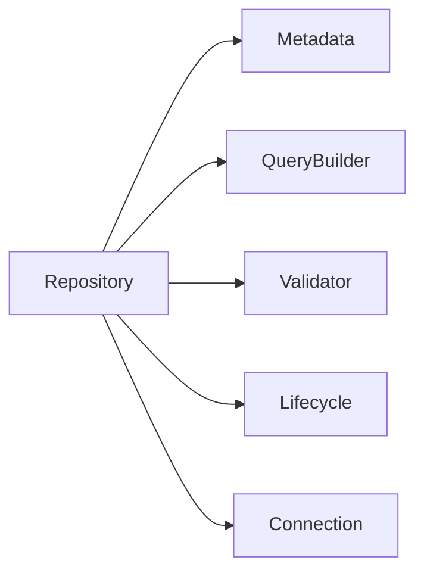

# ORM设计模式

<cite>
**本文引用的文件**   
- [engine/packages/domain-layer/src/models/base-entity.ts](file://engine/packages/domain-layer/src/models/base-entity.ts)
- [engine/packages/domain-layer/src/models/user.ts](file://engine/packages/domain-layer/src/models/user.ts)
- [engine/packages/domain-layer/src/models/task.ts](file://engine/packages/domain-layer/src/models/task.ts)
- [engine/packages/domain-layer/src/models/project.ts](file://engine/packages/domain-layer/src/models/project.ts)
- [engine/packages/infrastructure/src/database/connection.ts](file://engine/packages/infrastructure/src/database/connection.ts)
- [engine/packages/infrastructure/src/database/query-builder.ts](file://engine/packages/infrastructure/src/database/query-builder.ts)
- [engine/packages/infrastructure/src/database/repository.ts](file://engine/packages/infrastructure/src/database/repository.ts)
- [engine/packages/infrastructure/src/database/metadata.ts](file://engine/packages/infrastructure/src/database/metadata.ts)
- [engine/packages/infrastructure/src/database/validator.ts](file://engine/packages/infrastructure/src/database/validator.ts)
- [engine/packages/infrastructure/src/database/lifecycle.ts](file://engine/packages/infrastructure/src/database/lifecycle.ts)
</cite>

## 目录
1. [简介](#简介)
2. [项目结构](#项目结构)
3. [核心组件](#核心组件)
4. [架构总览](#架构总览)
5. [详细组件分析](#详细组件分析)
6. [依赖分析](#依赖分析)
7. [性能考虑](#性能考虑)
8. [故障排查指南](#故障排查指南)
9. [结论](#结论)
10. [附录](#附录)

## 简介
本技术文档围绕KCoder的ORM设计模式，系统性阐述实体映射、关系映射、查询构建器、生命周期管理、数据验证以及继承与多态映射等关键能力。文档面向不同技术背景的读者，提供从高层架构到代码级实现的渐进式说明，并辅以可视化图示帮助理解。

## 项目结构
本项目采用分层架构：领域层定义实体模型，基础设施层实现数据库连接、元数据、查询构建器、仓储与生命周期管理等通用能力。下图展示了与ORM相关的关键模块及其职责边界。

图表来源
- [engine/packages/domain-layer/src/models/base-entity.ts](file://engine/packages/domain-layer/src/models/base-entity.ts)
- [engine/packages/domain-layer/src/models/user.ts](file://engine/packages/domain-layer/src/models/user.ts)
- [engine/packages/domain-layer/src/models/task.ts](file://engine/packages/domain-layer/src/models/task.ts)
- [engine/packages/domain-layer/src/models/project.ts](file://engine/packages/domain-layer/src/models/project.ts)
- [engine/packages/infrastructure/src/database/connection.ts](file://engine/packages/infrastructure/src/database/connection.ts)
- [engine/packages/infrastructure/src/database/metadata.ts](file://engine/packages/infrastructure/src/database/metadata.ts)
- [engine/packages/infrastructure/src/database/query-builder.ts](file://engine/packages/infrastructure/src/database/query-builder.ts)
- [engine/packages/infrastructure/src/database/repository.ts](file://engine/packages/infrastructure/src/database/repository.ts)
- [engine/packages/infrastructure/src/database/validator.ts](file://engine/packages/infrastructure/src/database/validator.ts)
- [engine/packages/infrastructure/src/database/lifecycle.ts](file://engine/packages/infrastructure/src/database/lifecycle.ts)

章节来源
- [engine/packages/domain-layer/src/models/base-entity.ts](file://engine/packages/domain-layer/src/models/base-entity.ts)
- [engine/packages/domain-layer/src/models/user.ts](file://engine/packages/domain-layer/src/models/user.ts)
- [engine/packages/domain-layer/src/models/task.ts](file://engine/packages/domain-layer/src/models/task.ts)
- [engine/packages/domain-layer/src/models/project.ts](file://engine/packages/domain-layer/src/models/project.ts)
- [engine/packages/infrastructure/src/database/connection.ts](file://engine/packages/infrastructure/src/database/connection.ts)
- [engine/packages/infrastructure/src/database/metadata.ts](file://engine/packages/infrastructure/src/database/metadata.ts)
- [engine/packages/infrastructure/src/database/query-builder.ts](file://engine/packages/infrastructure/src/database/query-builder.ts)
- [engine/packages/infrastructure/src/database/repository.ts](file://engine/packages/infrastructure/src/database/repository.ts)
- [engine/packages/infrastructure/src/database/validator.ts](file://engine/packages/infrastructure/src/database/validator.ts)
- [engine/packages/infrastructure/src/database/lifecycle.ts](file://engine/packages/infrastructure/src/database/lifecycle.ts)

## 核心组件
- 基础实体（BaseEntity）：提供统一的标识、时间戳、状态标记等通用字段与行为，作为所有领域实体的基类。
- 领域实体（User、Task、Project）：承载业务语义，声明字段类型、约束与关系注解。
- 元数据（Metadata）：负责收集并缓存实体到表的映射规则、字段类型转换、主键策略、关系定义等。
- 查询构建器（QueryBuilder）：提供链式API以组合条件、排序、分页、关联加载，最终生成SQL或执行计划。
- 仓储（Repository）：封装CRUD操作，协调元数据、查询构建器、连接与生命周期钩子。
- 数据校验（Validator）：在持久化前对实体进行完整性与业务规则校验。
- 生命周期（Lifecycle）：在创建、更新、删除前后触发钩子，支持审计、缓存失效、事件发布等横切关注点。
- 连接（Connection）：抽象底层数据库驱动，统一事务、批处理与错误传播。

章节来源
- [engine/packages/domain-layer/src/models/base-entity.ts](file://engine/packages/domain-layer/src/models/base-entity.ts)
- [engine/packages/domain-layer/src/models/user.ts](file://engine/packages/domain-layer/src/models/user.ts)
- [engine/packages/domain-layer/src/models/task.ts](file://engine/packages/domain-layer/src/models/task.ts)
- [engine/packages/domain-layer/src/models/project.ts](file://engine/packages/domain-layer/src/models/project.ts)
- [engine/packages/infrastructure/src/database/metadata.ts](file://engine/packages/infrastructure/src/database/metadata.ts)
- [engine/packages/infrastructure/src/database/query-builder.ts](file://engine/packages/infrastructure/src/database/query-builder.ts)
- [engine/packages/infrastructure/src/database/repository.ts](file://engine/packages/infrastructure/src/database/repository.ts)
- [engine/packages/infrastructure/src/database/validator.ts](file://engine/packages/infrastructure/src/database/validator.ts)
- [engine/packages/infrastructure/src/database/lifecycle.ts](file://engine/packages/infrastructure/src/database/lifecycle.ts)
- [engine/packages/infrastructure/src/database/connection.ts](file://engine/packages/infrastructure/src/database/connection.ts)

## 架构总览
下图展示了一次典型“保存用户”请求在ORM中的调用序列，体现仓储、查询构建器、元数据、校验与生命周期的协作方式。

图表来源
- [engine/packages/infrastructure/src/database/repository.ts](file://engine/packages/infrastructure/src/database/repository.ts)
- [engine/packages/infrastructure/src/database/metadata.ts](file://engine/packages/infrastructure/src/database/metadata.ts)
- [engine/packages/infrastructure/src/database/validator.ts](file://engine/packages/infrastructure/src/database/validator.ts)
- [engine/packages/infrastructure/src/database/lifecycle.ts](file://engine/packages/infrastructure/src/database/lifecycle.ts)
- [engine/packages/infrastructure/src/database/connection.ts](file://engine/packages/infrastructure/src/database/connection.ts)

## 详细组件分析

### 实体映射机制
- 类到表映射
  - 通过元数据注册实体名、表名、列名映射；支持复数/下划线命名约定与显式覆盖。
  - 字段类型转换由元数据维护的类型字典驱动，将JS/TS类型与数据库类型双向转换。
- 主键策略
  - 支持自增、UUID、雪花ID等策略；可通过注解或配置指定主键字段与生成策略。
- 字段约束与默认值
  - 非空、唯一、默认值、长度限制等在元数据中声明，并在校验阶段生效。

图表来源
- [engine/packages/domain-layer/src/models/base-entity.ts](file://engine/packages/domain-layer/src/models/base-entity.ts)
- [engine/packages/domain-layer/src/models/user.ts](file://engine/packages/domain-layer/src/models/user.ts)
- [engine/packages/domain-layer/src/models/task.ts](file://engine/packages/domain-layer/src/models/task.ts)
- [engine/packages/domain-layer/src/models/project.ts](file://engine/packages/domain-layer/src/models/project.ts)
- [engine/packages/infrastructure/src/database/metadata.ts](file://engine/packages/infrastructure/src/database/metadata.ts)

章节来源
- [engine/packages/domain-layer/src/models/base-entity.ts](file://engine/packages/domain-layer/src/models/base-entity.ts)
- [engine/packages/domain-layer/src/models/user.ts](file://engine/packages/domain-layer/src/models/user.ts)
- [engine/packages/domain-layer/src/models/task.ts](file://engine/packages/domain-layer/src/models/task.ts)
- [engine/packages/domain-layer/src/models/project.ts](file://engine/packages/domain-layer/src/models/project.ts)
- [engine/packages/infrastructure/src/database/metadata.ts](file://engine/packages/infrastructure/src/database/metadata.ts)

### 关系映射与加载策略
- 一对一
  - 通过外键或共享主键建立；支持懒加载与预加载两种策略。
- 一对多
  - 父实体持有集合引用；加载时可选择N+1规避（批量JOIN或二次查询）。
- 多对多
  - 通过中间表建模；提供集合访问器与延迟加载。
- 加载策略
  - 预加载：在一次查询中JOIN关联表，减少往返。
  - 懒加载：首次访问属性时按需加载，避免不必要开销。
  - 批量加载：按主键集合批量拉取关联记录，平衡内存与IO。

图表来源
- [engine/packages/domain-layer/src/models/user.ts](file://engine/packages/domain-layer/src/models/user.ts)
- [engine/packages/domain-layer/src/models/project.ts](file://engine/packages/domain-layer/src/models/project.ts)
- [engine/packages/domain-layer/src/models/task.ts](file://engine/packages/domain-layer/src/models/task.ts)
- [engine/packages/infrastructure/src/database/metadata.ts](file://engine/packages/infrastructure/src/database/metadata.ts)

章节来源
- [engine/packages/domain-layer/src/models/user.ts](file://engine/packages/domain-layer/src/models/user.ts)
- [engine/packages/domain-layer/src/models/project.ts](file://engine/packages/domain-layer/src/models/project.ts)
- [engine/packages/domain-layer/src/models/task.ts](file://engine/packages/domain-layer/src/models/task.ts)
- [engine/packages/infrastructure/src/database/metadata.ts](file://engine/packages/infrastructure/src/database/metadata.ts)

### 查询构建器设计
- 链式调用
  - where、andWhere、orWhere、orderBy、limit、offset、join、select、groupBy、having等方法可自由组合。
- 条件组合
  - 支持AND/OR分组、嵌套条件、参数绑定与占位符替换。
- 动态查询生成
  - 根据运行时参数动态拼接条件；自动处理NULL、空字符串、数组IN等边界情况。
- 关联加载
  - with/leftJoin/rightJoin等方法支持关联表加载，并可指定加载策略。

图表来源
- [engine/packages/infrastructure/src/database/query-builder.ts](file://engine/packages/infrastructure/src/database/query-builder.ts)
- [engine/packages/infrastructure/src/database/metadata.ts](file://engine/packages/infrastructure/src/database/metadata.ts)

章节来源
- [engine/packages/infrastructure/src/database/query-builder.ts](file://engine/packages/infrastructure/src/database/query-builder.ts)
- [engine/packages/infrastructure/src/database/metadata.ts](file://engine/packages/infrastructure/src/database/metadata.ts)

### 实体生命周期管理
- 状态跟踪
  - 新增、已修改、已删除、已分离等状态在仓储内部维护，避免重复写入。
- 钩子机制
  - beforeCreate/afterCreate、beforeUpdate/afterUpdate、beforeDelete/afterDelete等钩子用于审计、缓存失效、事件发布。
- 事务与一致性
  - 仓储在事务边界内执行多个写操作，确保一致性；失败回滚并清理状态。

图表来源
- [engine/packages/infrastructure/src/database/lifecycle.ts](file://engine/packages/infrastructure/src/database/lifecycle.ts)
- [engine/packages/infrastructure/src/database/repository.ts](file://engine/packages/infrastructure/src/database/repository.ts)

章节来源
- [engine/packages/infrastructure/src/database/lifecycle.ts](file://engine/packages/infrastructure/src/database/lifecycle.ts)
- [engine/packages/infrastructure/src/database/repository.ts](file://engine/packages/infrastructure/src/database/repository.ts)

### 实体验证机制
- 数据完整性检查
  - 非空、唯一、范围、格式等约束在持久化前执行。
- 业务规则验证
  - 自定义校验器可在实体或仓储层注入，支持异步校验与聚合校验。
- 错误聚合
  - 收集所有校验错误并以结构化形式返回，便于前端提示与日志追踪。

图表来源
- [engine/packages/infrastructure/src/database/validator.ts](file://engine/packages/infrastructure/src/database/validator.ts)
- [engine/packages/infrastructure/src/database/repository.ts](file://engine/packages/infrastructure/src/database/repository.ts)

章节来源
- [engine/packages/infrastructure/src/database/validator.ts](file://engine/packages/infrastructure/src/database/validator.ts)
- [engine/packages/infrastructure/src/database/repository.ts](file://engine/packages/infrastructure/src/database/repository.ts)

### 实体继承与多态映射
- 单表继承
  - 使用鉴别列区分子类；查询时根据鉴别列过滤并映射为具体类型。
- 类表继承
  - 每个类一张表，通过外键关联；查询需JOIN合并字段。
- 多态关联
  - 通过类型字段+外键指向任意实体；加载时需先解析类型再加载目标对象。

图表来源
- [engine/packages/domain-layer/src/models/base-entity.ts](file://engine/packages/domain-layer/src/models/base-entity.ts)
- [engine/packages/infrastructure/src/database/metadata.ts](file://engine/packages/infrastructure/src/database/metadata.ts)

章节来源
- [engine/packages/domain-layer/src/models/base-entity.ts](file://engine/packages/domain-layer/src/models/base-entity.ts)
- [engine/packages/infrastructure/src/database/metadata.ts](file://engine/packages/infrastructure/src/database/metadata.ts)

## 依赖分析
仓储是ORM的核心编排者，依赖元数据、查询构建器、校验器、生命周期与连接。下图展示关键依赖关系。

图表来源
- [engine/packages/infrastructure/src/database/repository.ts](file://engine/packages/infrastructure/src/database/repository.ts)
- [engine/packages/infrastructure/src/database/metadata.ts](file://engine/packages/infrastructure/src/database/metadata.ts)
- [engine/packages/infrastructure/src/database/query-builder.ts](file://engine/packages/infrastructure/src/database/query-builder.ts)
- [engine/packages/infrastructure/src/database/validator.ts](file://engine/packages/infrastructure/src/database/validator.ts)
- [engine/packages/infrastructure/src/database/lifecycle.ts](file://engine/packages/infrastructure/src/database/lifecycle.ts)
- [engine/packages/infrastructure/src/database/connection.ts](file://engine/packages/infrastructure/src/database/connection.ts)

章节来源
- [engine/packages/infrastructure/src/database/repository.ts](file://engine/packages/infrastructure/src/database/repository.ts)
- [engine/packages/infrastructure/src/database/metadata.ts](file://engine/packages/infrastructure/src/database/metadata.ts)
- [engine/packages/infrastructure/src/database/query-builder.ts](file://engine/packages/infrastructure/src/database/query-builder.ts)
- [engine/packages/infrastructure/src/database/validator.ts](file://engine/packages/infrastructure/src/database/validator.ts)
- [engine/packages/infrastructure/src/database/lifecycle.ts](file://engine/packages/infrastructure/src/database/lifecycle.ts)
- [engine/packages/infrastructure/src/database/connection.ts](file://engine/packages/infrastructure/src/database/connection.ts)

## 性能考虑
- 避免N+1查询：优先使用预加载或批量加载策略。
- 选择性字段：仅选择必要字段，减少网络与序列化开销。
- 索引与统计：为高频查询字段建立索引，定期更新统计信息。
- 分页与游标：大数据集使用分页或基于游标的迭代。
- 连接池与批处理：合理配置连接池大小，批量插入/更新提升吞吐。
- 缓存热点数据：结合缓存层降低重复查询压力。

[本节为通用指导，不直接分析具体文件]

## 故障排查指南
- 常见错误定位
  - 映射不一致：检查实体字段与表结构是否一致，确认类型转换与主键策略。
  - 校验失败：查看校验错误聚合结果，定位缺失或非法字段。
  - 关联加载异常：确认外键与关系注解是否正确，必要时启用调试日志。
  - 事务回滚：检查钩子抛出异常或外部依赖失败导致的回滚。
- 建议步骤
  - 开启详细日志，捕获生成的SQL与参数。
  - 最小化复现用例，逐步缩小问题范围。
  - 使用单元测试覆盖边界条件与异常路径。

章节来源
- [engine/packages/infrastructure/src/database/validator.ts](file://engine/packages/infrastructure/src/database/validator.ts)
- [engine/packages/infrastructure/src/database/lifecycle.ts](file://engine/packages/infrastructure/src/database/lifecycle.ts)
- [engine/packages/infrastructure/src/database/query-builder.ts](file://engine/packages/infrastructure/src/database/query-builder.ts)
- [engine/packages/infrastructure/src/database/connection.ts](file://engine/packages/infrastructure/src/database/connection.ts)

## 结论
KCoder的ORM以清晰的层次划分与职责解耦为核心，通过元数据驱动的实体映射、灵活的查询构建器、完善的生命周期与校验机制，提供了高内聚、低耦合的数据访问能力。配合合理的加载策略与性能优化实践，可满足复杂业务场景下的数据持久化需求。

[本节为总结性内容，不直接分析具体文件]

## 附录
- 术语
  - 实体：领域对象的持久化表示。
  - 仓储：封装CRUD与查询逻辑的统一入口。
  - 元数据：描述实体与数据库映射关系的配置与解析器。
  - 查询构建器：用于构造查询条件的DSL工具。
  - 生命周期钩子：在实体状态变化前后触发的扩展点。
  - 校验器：在持久化前执行数据与业务规则校验的工具。

[本节为概念性内容，不直接分析具体文件]