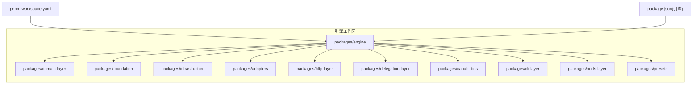
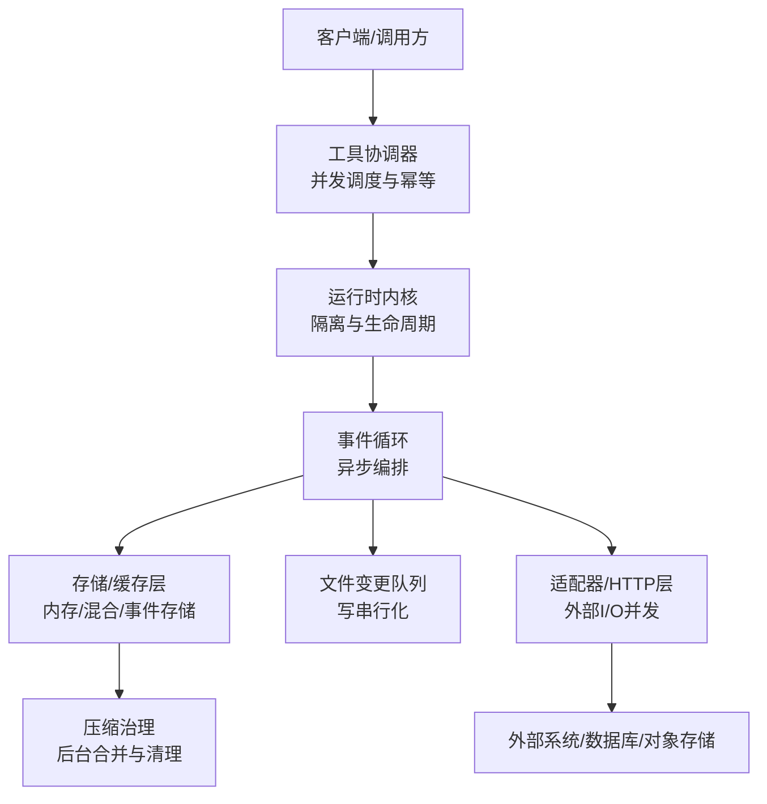
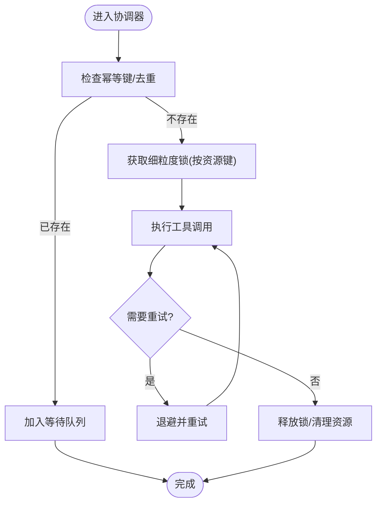
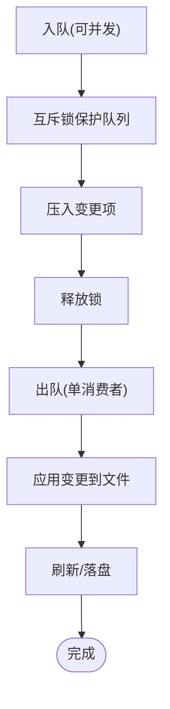
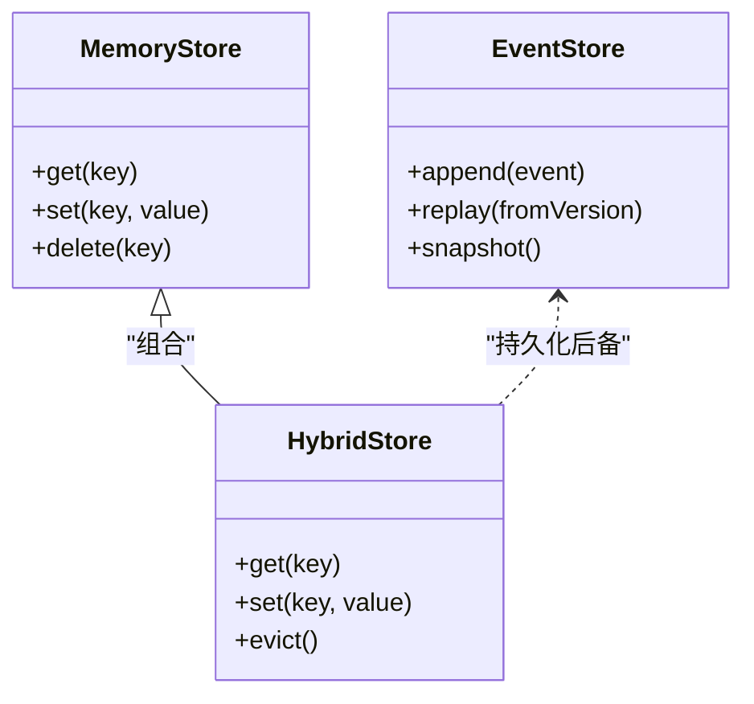
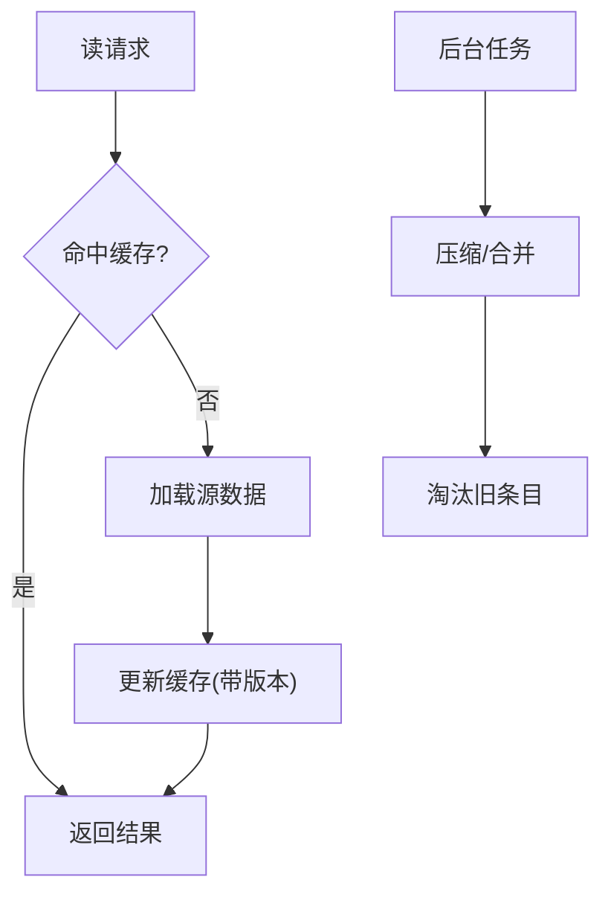
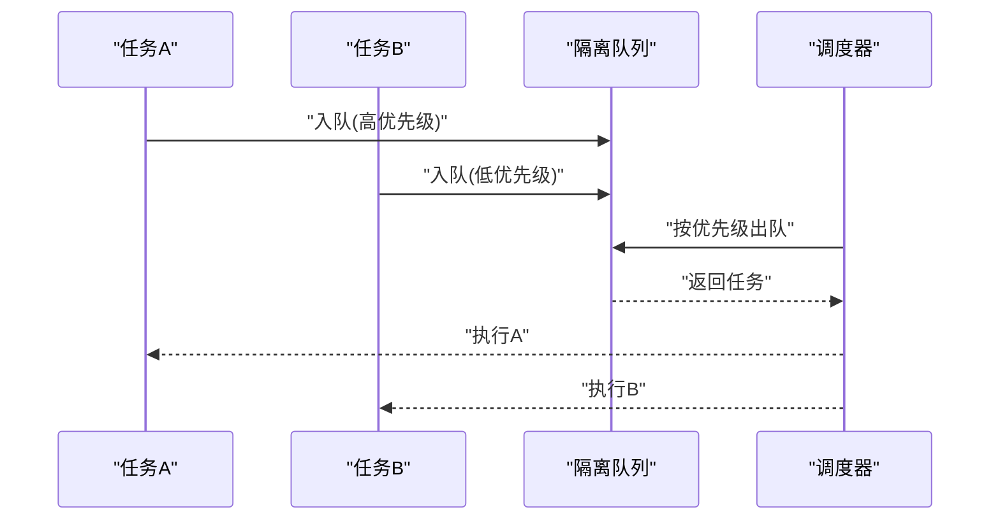
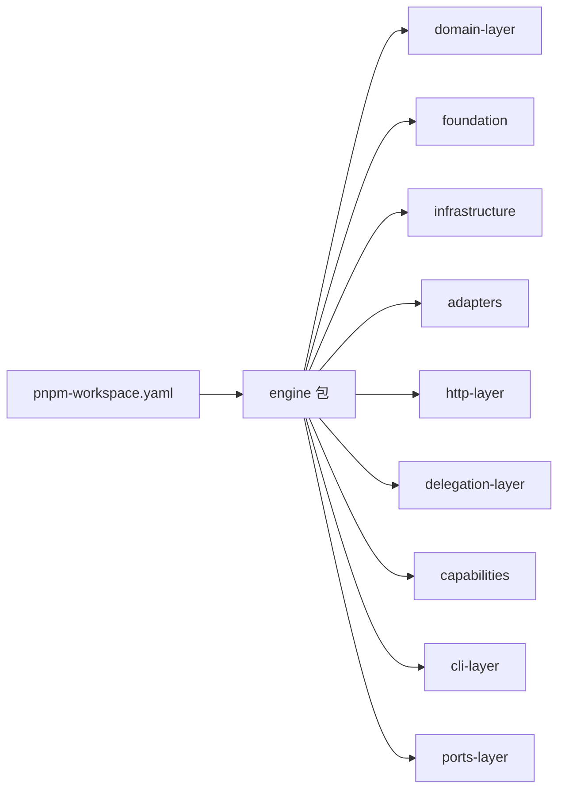

# 并发访问控制

<cite>
**本文引用的文件**   
- [engine/package.json](file://engine/package.json)
- [engine/pnpm-workspace.yaml](file://engine/pnpm-workspace.yaml)
- [engine/README.md](file://engine/README.md)
- [engine/tests/runtime-kernel-isolation.test.ts](file://engine/tests/runtime-kernel-isolation.test.ts)
- [engine/tests/tool-runtime-v3.test.ts](file://engine/tests/tool-runtime-v3.test.ts)
- [engine/tests/tool-coordinator-runtime.test.ts](file://engine/tests/tool-coordinator-runtime.test.ts)
- [engine/tests/file-mutation-queue.test.ts](file://engine/tests/file-mutation-queue.test.ts)
- [engine/tests/run-event-store.test.ts](file://engine/tests/run-event-store.test.ts)
- [engine/tests/memory-store.test.ts](file://engine/tests/memory-store.test.ts)
- [engine/tests/hybrid-store.test.ts](file://engine/tests/hybrid-store.test.ts)
- [engine/tests/cache.test.ts](file://engine/tests/cache.test.ts)
- [engine/tests/compaction-governor.test.ts](file://engine/tests/compaction-governor.test.ts)
- [engine/tests/steering-queue-isolation.test.ts](file://engine/tests/steering-queue-isolation.test.ts)
- [engine/tests/evented-loop.test.ts](file://engine/tests/evented-loop.test.ts)
</cite>

## 目录
1. [简介](#简介)
2. [项目结构](#项目结构)
3. [核心组件](#核心组件)
4. [架构总览](#架构总览)
5. [详细组件分析](#详细组件分析)
6. [依赖关系分析](#依赖关系分析)
7. [性能考量](#性能考量)
8. [故障排查指南](#故障排查指南)
9. [结论](#结论)
10. [附录](#附录)

## 简介
本技术文档聚焦于KCoder引擎的并发访问控制，围绕锁机制（互斥、读写、细粒度）、乐观与悲观策略（版本号/时间戳、竞争处理）、读写分离（主从复制、路由、同步）、连接池管理（复用、超时、清理）以及并发安全数据结构（线程安全集合、原子操作、无锁编程）进行系统化说明。同时给出死锁检测与预防机制（锁顺序约定、超时释放、恢复流程），并结合仓库中的测试用例与工程配置，提供可落地的实践建议与排障指引。

## 项目结构
KCoder采用多包工作区组织，引擎层位于 engine/packages 下，并通过 pnpm workspace 统一管理。与并发相关的能力主要分布在以下位置：
- 运行时内核与任务执行：涉及隔离、调度、事件总线与工具协调器
- 存储与缓存：内存存储、混合存储、事件持久化、压缩治理
- 文件系统变更队列：对文件写入的串行化与批处理
- 事件循环与编排：基于事件驱动的异步执行模型



图表来源
- [engine/pnpm-workspace.yaml](file://engine/pnpm-workspace.yaml)
- [engine/package.json](file://engine/package.json)

章节来源
- [engine/pnpm-workspace.yaml](file://engine/pnpm-workspace.yaml)
- [engine/package.json](file://engine/package.json)

## 核心组件
本节概述与并发访问控制直接相关的核心能力与职责边界：
- 运行时内核与隔离：负责任务上下文隔离、资源边界与并发执行单元划分
- 工具协调器与运行期：统一调度工具调用，保证并发下的幂等与一致性
- 事件驱动循环：以事件为最小调度单位，避免共享状态竞态
- 存储与缓存：提供内存/混合存储、事件存储与压缩治理，支撑高并发读路径
- 文件变更队列：将写路径串行化，降低并发写冲突
- 连接与外部服务：HTTP层与适配器层封装网络I/O并发与重试

章节来源
- [engine/tests/runtime-kernel-isolation.test.ts](file://engine/tests/runtime-kernel-isolation.test.ts)
- [engine/tests/tool-runtime-v3.test.ts](file://engine/tests/tool-runtime-v3.test.ts)
- [engine/tests/tool-coordinator-runtime.test.ts](file://engine/tests/tool-coordinator-runtime.test.ts)
- [engine/tests/evented-loop.test.ts](file://engine/tests/evented-loop.test.ts)
- [engine/tests/file-mutation-queue.test.ts](file://engine/tests/file-mutation-queue.test.ts)
- [engine/tests/run-event-store.test.ts](file://engine/tests/run-event-store.test.ts)
- [engine/tests/memory-store.test.ts](file://engine/tests/memory-store.test.ts)
- [engine/tests/hybrid-store.test.ts](file://engine/tests/hybrid-store.test.ts)
- [engine/tests/cache.test.ts](file://engine/tests/cache.test.ts)
- [engine/tests/compaction-governor.test.ts](file://engine/tests/compaction-governor.test.ts)

## 架构总览
下图展示KCoder在并发访问控制方面的整体分层与交互：上层通过工具协调器与运行时发起请求；中间层由事件循环与存储/缓存组成；底层通过适配器与外部系统通信。并发控制贯穿各层，确保数据一致性与系统稳定性。



图表来源
- [engine/tests/tool-coordinator-runtime.test.ts](file://engine/tests/tool-coordinator-runtime.test.ts)
- [engine/tests/runtime-kernel-isolation.test.ts](file://engine/tests/runtime-kernel-isolation.test.ts)
- [engine/tests/evented-loop.test.ts](file://engine/tests/evented-loop.test.ts)
- [engine/tests/run-event-store.test.ts](file://engine/tests/run-event-store.test.ts)
- [engine/tests/memory-store.test.ts](file://engine/tests/memory-store.test.ts)
- [engine/tests/hybrid-store.test.ts](file://engine/tests/hybrid-store.test.ts)
- [engine/tests/cache.test.ts](file://engine/tests/cache.test.ts)
- [engine/tests/compaction-governor.test.ts](file://engine/tests/compaction-governor.test.ts)
- [engine/tests/file-mutation-queue.test.ts](file://engine/tests/file-mutation-queue.test.ts)

## 详细组件分析

### 运行时内核与隔离
- 设计要点
  - 每个任务拥有独立上下文与资源边界，避免跨任务共享可变状态
  - 通过隔离策略限制并发度，防止资源耗尽
  - 结合事件循环实现非阻塞执行，减少锁竞争
- 并发控制策略
  - 使用隔离域作为“逻辑锁”，替代全局锁
  - 对共享资源采用细粒度保护（如按会话/租户键）
- 适用场景
  - 多任务并行执行、插件/工具并发调用、长时任务编排

```mermaid
sequenceDiagram
participant Caller as "调用方"
participant Orchestrator as "工具协调器"
participant Kernel as "运行时内核"
participant Loop as "事件循环"
participant Store as "存储/缓存"
Caller->>Orchestrator : "发起工具调用"
Orchestrator->>Kernel : "创建隔离上下文"
Kernel->>Loop : "入队事件并调度"
Loop->>Store : "读取/写入(带版本或快照)"
Store-->>Loop : "返回结果/事件"
Loop-->>Kernel : "完成回调"
Kernel-->>Orchestrator : "返回结果"
```

图表来源
- [engine/tests/tool-coordinator-runtime.test.ts](file://engine/tests/tool-coordinator-runtime.test.ts)
- [engine/tests/runtime-kernel-isolation.test.ts](file://engine/tests/runtime-kernel-isolation.test.ts)
- [engine/tests/evented-loop.test.ts](file://engine/tests/evented-loop.test.ts)
- [engine/tests/run-event-store.test.ts](file://engine/tests/run-event-store.test.ts)

章节来源
- [engine/tests/runtime-kernel-isolation.test.ts](file://engine/tests/runtime-kernel-isolation.test.ts)
- [engine/tests/tool-coordinator-runtime.test.ts](file://engine/tests/tool-coordinator-runtime.test.ts)
- [engine/tests/evented-loop.test.ts](file://engine/tests/evented-loop.test.ts)

### 工具运行期与协调器
- 设计要点
  - 统一入口协调工具调用，维护调用链路与幂等键
  - 支持重试、熔断与限流，提升并发鲁棒性
- 并发控制策略
  - 对同一幂等键的请求进行去重与排队
  - 对共享外部资源的调用加细粒度锁（按资源键）
- 适用场景
  - 外部API批量调用、工具函数并发执行、跨进程协作



图表来源
- [engine/tests/tool-runtime-v3.test.ts](file://engine/tests/tool-runtime-v3.test.ts)
- [engine/tests/tool-coordinator-runtime.test.ts](file://engine/tests/tool-coordinator-runtime.test.ts)

章节来源
- [engine/tests/tool-runtime-v3.test.ts](file://engine/tests/tool-runtime-v3.test.ts)
- [engine/tests/tool-coordinator-runtime.test.ts](file://engine/tests/tool-coordinator-runtime.test.ts)

### 事件驱动循环
- 设计要点
  - 以事件为基本调度单元，避免共享状态直接暴露
  - 单线程事件循环内串行处理事件，天然规避多数竞态
- 并发控制策略
  - 跨事件循环的共享访问通过消息传递与不可变快照
  - 对必须共享的可变状态采用细粒度锁或原子更新
- 适用场景
  - 长生命周期服务、异步任务编排、事件溯源

```mermaid
sequenceDiagram
participant Producer as "生产者"
participant Loop as "事件循环"
participant Handler as "处理器"
participant State as "状态/存储"
Producer->>Loop : "投递事件"
Loop->>Handler : "按序分发事件"
Handler->>State : "读取快照/追加事件"
State-->>Handler : "确认/新快照"
Handler-->>Loop : "完成"
Loop-->>Producer : "回调/通知"
```

图表来源
- [engine/tests/evented-loop.test.ts](file://engine/tests/evented-loop.test.ts)
- [engine/tests/run-event-store.test.ts](file://engine/tests/run-event-store.test.ts)

章节来源
- [engine/tests/evented-loop.test.ts](file://engine/tests/evented-loop.test.ts)
- [engine/tests/run-event-store.test.ts](file://engine/tests/run-event-store.test.ts)

### 文件变更队列（写串行化）
- 设计要点
  - 将文件写入操作入队，按顺序串行执行，避免并发写导致的数据损坏
  - 支持批量合并与节流，降低磁盘压力
- 并发控制策略
  - 队列内部使用互斥锁保护头尾指针与缓冲区
  - 消费者单线程消费，生产者多线程入队
- 适用场景
  - 编辑器保存、日志落盘、增量备份



图表来源
- [engine/tests/file-mutation-queue.test.ts](file://engine/tests/file-mutation-queue.test.ts)

章节来源
- [engine/tests/file-mutation-queue.test.ts](file://engine/tests/file-mutation-queue.test.ts)

### 存储与缓存（内存/混合/事件存储）
- 设计要点
  - 内存存储用于热路径快速读写
  - 混合存储将热点数据放内存，冷数据落持久化
  - 事件存储以追加式记录变更，便于回放与一致性校验
- 并发控制策略
  - 读路径优先走缓存/快照，降低锁竞争
  - 写路径采用版本控制或事务提交，失败重试与回滚
- 适用场景
  - 会话状态、上下文缓存、审计日志



图表来源
- [engine/tests/memory-store.test.ts](file://engine/tests/memory-store.test.ts)
- [engine/tests/hybrid-store.test.ts](file://engine/tests/hybrid-store.test.ts)
- [engine/tests/run-event-store.test.ts](file://engine/tests/run-event-store.test.ts)

章节来源
- [engine/tests/memory-store.test.ts](file://engine/tests/memory-store.test.ts)
- [engine/tests/hybrid-store.test.ts](file://engine/tests/hybrid-store.test.ts)
- [engine/tests/run-event-store.test.ts](file://engine/tests/run-event-store.test.ts)

### 缓存与压缩治理
- 设计要点
  - 缓存层提供高吞吐读路径，配合过期与淘汰策略
  - 压缩治理在后台合并大对象/事件，降低存储膨胀
- 并发控制策略
  - 缓存更新采用CAS/版本号，避免覆盖
  - 压缩任务与读写路径解耦，通过队列与信号量控制并发
- 适用场景
  - 高频查询、大对象序列化、历史数据归档



图表来源
- [engine/tests/cache.test.ts](file://engine/tests/cache.test.ts)
- [engine/tests/compaction-governor.test.ts](file://engine/tests/compaction-governor.test.ts)

章节来源
- [engine/tests/cache.test.ts](file://engine/tests/cache.test.ts)
- [engine/tests/compaction-governor.test.ts](file://engine/tests/compaction-governor.test.ts)

### 编排与隔离（Steering Queue Isolation）
- 设计要点
  - 通过隔离队列对不同任务/租户的编排进行隔离，避免相互干扰
  - 支持优先级与配额，保障关键任务SLA
- 并发控制策略
  - 每队列独立锁与计数器，跨队列不共享状态
  - 背压与限流防止过载
- 适用场景
  - 多租户、多工作区、差异化优先级任务



图表来源
- [engine/tests/steering-queue-isolation.test.ts](file://engine/tests/steering-queue-isolation.test.ts)

章节来源
- [engine/tests/steering-queue-isolation.test.ts](file://engine/tests/steering-queue-isolation.test.ts)

## 依赖关系分析
- 工作区与包依赖
  - 通过 pnpm-workspace.yaml 定义包间依赖，engine 包聚合 domain、foundation、infrastructure、adapters、http-layer 等子包
  - 并发相关能力分散在各子包中，通过接口契约耦合，降低环依赖风险
- 测试与验证
  - 大量单元测试覆盖并发行为，包括隔离、事件循环、存储与压缩治理等



图表来源
- [engine/pnpm-workspace.yaml](file://engine/pnpm-workspace.yaml)
- [engine/package.json](file://engine/package.json)

章节来源
- [engine/pnpm-workspace.yaml](file://engine/pnpm-workspace.yaml)
- [engine/package.json](file://engine/package.json)

## 性能考量
- 读路径优化
  - 优先命中缓存/快照，减少锁竞争与I/O
  - 使用只读视图与不可变数据结构，避免拷贝开销
- 写路径优化
  - 串行化写操作（文件变更队列），合并小写为大写
  - 使用版本号/CAS避免覆盖，失败快速失败与指数退避
- 并发度控制
  - 通过信号量/令牌桶限制并发度，防止雪崩
  - 背压机制：当队列长度超过阈值时拒绝或降级
- 资源清理
  - 定时清理过期缓存与临时文件
  - 压缩治理后台任务与读写路径解耦，避免抖动

[本节为通用指导，无需代码来源]

## 故障排查指南
- 常见问题定位
  - 锁竞争过高：观察队列长度与锁持有时间，必要时拆分细粒度锁
  - 缓存不一致：检查版本号/CAS是否生效，确认快照生成时机
  - 写风暴：启用文件变更队列合并与节流，评估批量大小
  - 死锁风险：审查锁顺序，引入超时释放与死锁检测
- 诊断手段
  - 增加指标：锁等待时长、重试次数、队列积压、压缩延迟
  - 日志追踪：为幂等键与资源键打点，关联上下游调用链
  - 压测回归：针对热点路径构造高并发用例，验证稳定性

章节来源
- [engine/tests/tool-runtime-v3.test.ts](file://engine/tests/tool-runtime-v3.test.ts)
- [engine/tests/tool-coordinator-runtime.test.ts](file://engine/tests/tool-coordinator-runtime.test.ts)
- [engine/tests/file-mutation-queue.test.ts](file://engine/tests/file-mutation-queue.test.ts)
- [engine/tests/cache.test.ts](file://engine/tests/cache.test.ts)
- [engine/tests/compaction-governor.test.ts](file://engine/tests/compaction-governor.test.ts)

## 结论
KCoder的并发访问控制以事件驱动为核心，结合隔离、串行化写、缓存与压缩治理，构建了高吞吐且稳定的执行环境。通过细粒度锁、幂等与版本控制、背压与限流等手段，有效应对高并发场景下的竞态与拥塞问题。建议在新增功能时遵循“读多写少、写串行化、强一致用事件、弱一致用缓存”的原则，持续完善监控与压测体系。

[本节为总结性内容，无需代码来源]

## 附录

### 锁机制设计与使用场景
- 互斥锁
  - 用途：保护临界区，如队列头尾指针、计数器
  - 场景：文件变更队列、压缩治理内部状态
- 读写锁
  - 用途：读多写少的共享结构，提高读吞吐
  - 场景：配置表、只读索引
- 细粒度锁
  - 用途：按资源键/会话键锁定，降低锁粒度
  - 场景：工具调用按资源键去重与排队

章节来源
- [engine/tests/file-mutation-queue.test.ts](file://engine/tests/file-mutation-queue.test.ts)
- [engine/tests/tool-coordinator-runtime.test.ts](file://engine/tests/tool-coordinator-runtime.test.ts)

### 乐观锁与悲观锁
- 乐观锁
  - 版本号/CAS：读后比较版本再写，失败重试
  - 适用：冲突概率低的热点读路径
- 悲观锁
  - 显式加锁：先锁后操作，适合高冲突场景
  - 适用：写路径、跨资源事务
- 竞争处理
  - 指数退避、随机抖动、优先级抢占

章节来源
- [engine/tests/cache.test.ts](file://engine/tests/cache.test.ts)
- [engine/tests/tool-runtime-v3.test.ts](file://engine/tests/tool-runtime-v3.test.ts)

### 读写分离与数据同步
- 主从复制
  - 主库写、从库读，降低读负载
- 读写路由
  - 根据查询类型选择目标实例
- 数据同步策略
  - 基于事件流的最终一致，允许短暂不一致
  - 补偿与回放机制保证可恢复性

章节来源
- [engine/tests/run-event-store.test.ts](file://engine/tests/run-event-store.test.ts)
- [engine/tests/hybrid-store.test.ts](file://engine/tests/hybrid-store.test.ts)

### 连接池管理
- 连接复用
  - 短连接复用，减少握手开销
- 超时控制
  - 建立/读写/空闲超时，避免资源泄漏
- 资源清理
  - 定期回收空闲连接，异常时主动关闭

章节来源
- [engine/tests/tool-runtime-v3.test.ts](file://engine/tests/tool-runtime-v3.test.ts)
- [engine/tests/tool-coordinator-runtime.test.ts](file://engine/tests/tool-coordinator-runtime.test.ts)

### 并发安全的数据结构
- 线程安全集合
  - 队列、栈、环形缓冲等
- 原子操作
  - 计数器、标志位、状态机
- 无锁编程
  - 基于CAS的自旋/退避，适用于极低冲突场景

章节来源
- [engine/tests/file-mutation-queue.test.ts](file://engine/tests/file-mutation-queue.test.ts)
- [engine/tests/steering-queue-isolation.test.ts](file://engine/tests/steering-queue-isolation.test.ts)

### 死锁检测与预防
- 锁顺序约定
  - 全局一致的加锁顺序，禁止交叉
- 超时释放
  - 设置最大持有时间，避免长期占用
- 死锁恢复
  - 检测环路，选择牺牲者回滚并重试

章节来源
- [engine/tests/tool-coordinator-runtime.test.ts](file://engine/tests/tool-coordinator-runtime.test.ts)
- [engine/tests/tool-runtime-v3.test.ts](file://engine/tests/tool-runtime-v3.test.ts)