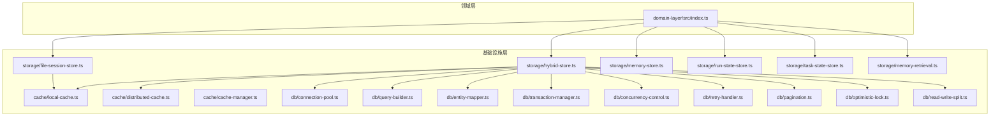
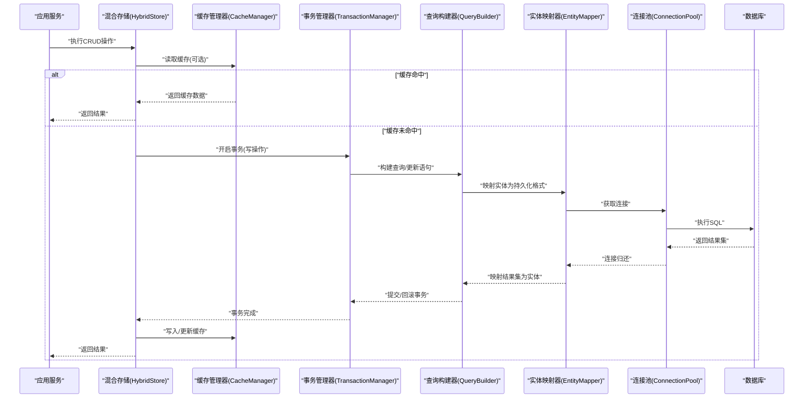
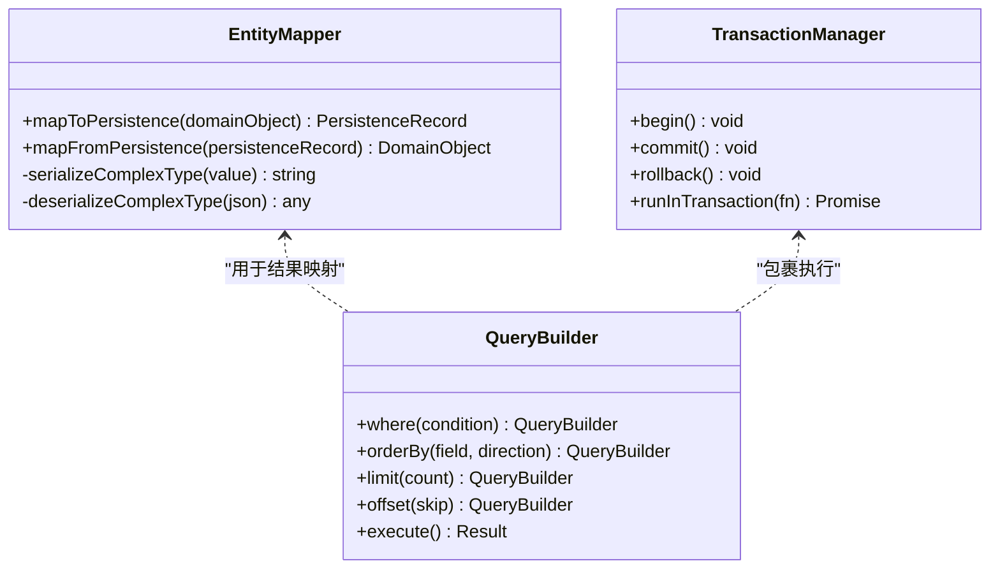
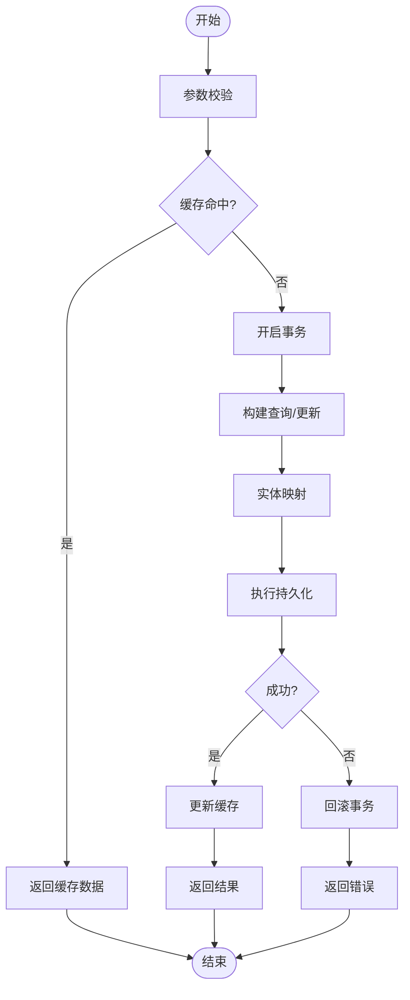
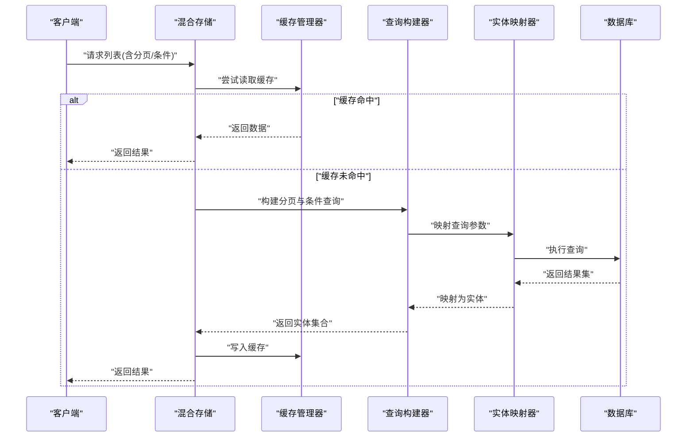
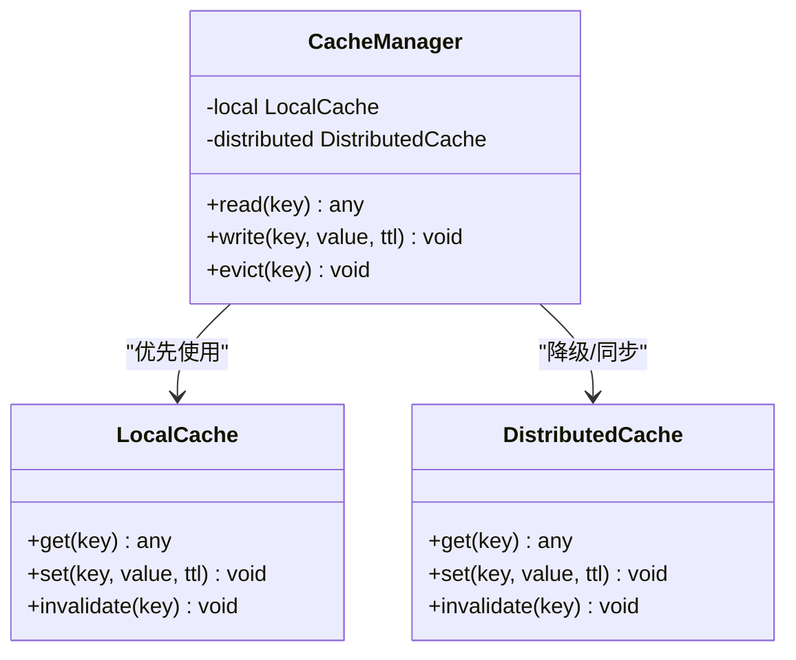
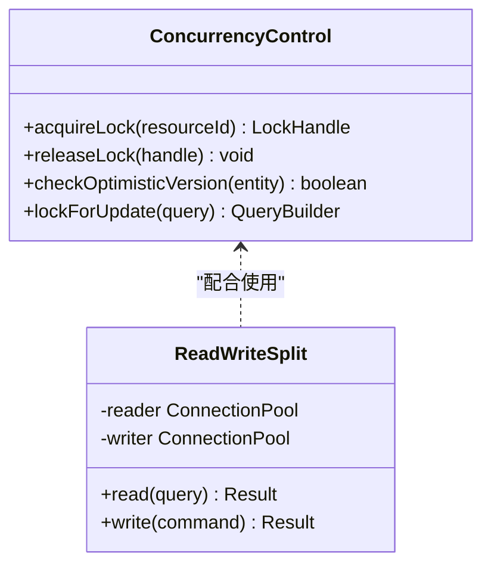
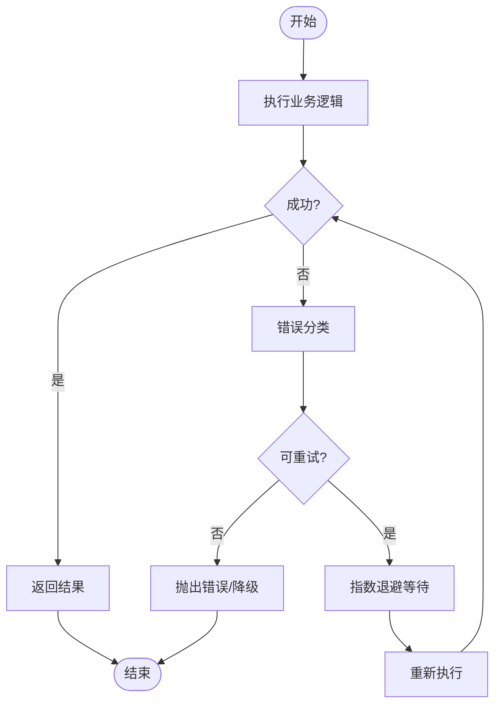
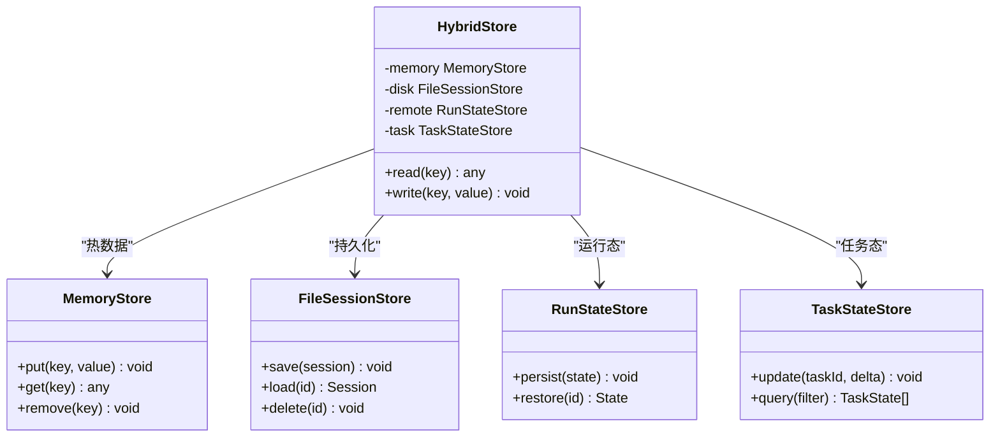
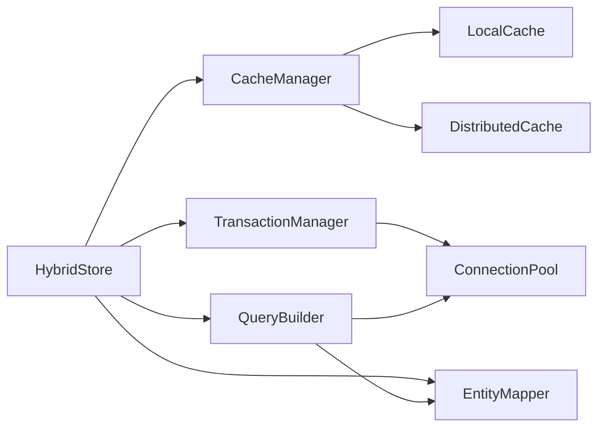

# 数据访问模式

<cite>
**本文引用的文件**   
- [engine/packages/domain-layer/src/index.ts](file://engine/packages/domain-layer/src/index.ts)
- [engine/packages/infrastructure/src/storage/file-session-store.ts](file://engine/packages/infrastructure/src/storage/file-session-store.ts)
- [engine/packages/infrastructure/src/storage/hybrid-store.ts](file://engine/packages/infrastructure/src/storage/hybrid-store.ts)
- [engine/packages/infrastructure/src/storage/memory-store.ts](file://engine/packages/infrastructure/src/storage/memory-store.ts)
- [engine/packages/infrastructure/src/storage/run-state-store.ts](file://engine/packages/infrastructure/src/storage/run-state-store.ts)
- [engine/packages/infrastructure/src/storage/task-state-store.ts](file://engine/packages/infrastructure/src/storage/task-state-store.ts)
- [engine/packages/infrastructure/src/storage/memory-retrieval.ts](file://engine/packages/infrastructure/src/storage/memory-retrieval.ts)
- [engine/packages/infrastructure/src/cache/local-cache.ts](file://engine/packages/infrastructure/src/cache/local-cache.ts)
- [engine/packages/infrastructure/src/cache/distributed-cache.ts](file://engine/packages/infrastructure/src/cache/distributed-cache.ts)
- [engine/packages/infrastructure/src/cache/cache-manager.ts](file://engine/packages/infrastructure/src/cache/cache-manager.ts)
- [engine/packages/infrastructure/src/db/connection-pool.ts](file://engine/packages/infrastructure/src/db/connection-pool.ts)
- [engine/packages/infrastructure/src/db/query-builder.ts](file://engine/packages/infrastructure/src/db/query-builder.ts)
- [engine/packages/infrastructure/src/db/entity-mapper.ts](file://engine/packages/infrastructure/src/db/entity-mapper.ts)
- [engine/packages/infrastructure/src/db/transaction-manager.ts](file://engine/packages/infrastructure/src/db/transaction-manager.ts)
- [engine/packages/infrastructure/src/db/concurrency-control.ts](file://engine/packages/infrastructure/src/db/concurrency-control.ts)
- [engine/packages/infrastructure/src/db/retry-handler.ts](file://engine/packages/infrastructure/src/db/retry-handler.ts)
- [engine/packages/infrastructure/src/db/pagination.ts](file://engine/packages/infrastructure/src/db/pagination.ts)
- [engine/packages/infrastructure/src/db/optimistic-lock.ts](file://engine/packages/infrastructure/src/db/optimistic-lock.ts)
- [engine/packages/infrastructure/src/db/read-write-split.ts](file://engine/packages/infrastructure/src/db/read-write-split.ts)
</cite>

## 目录
1. [简介](#简介)
2. [项目结构](#项目结构)
3. [核心组件](#核心组件)
4. [架构总览](#架构总览)
5. [详细组件分析](#详细组件分析)
6. [依赖关系分析](#依赖关系分析)
7. [性能考虑](#性能考虑)
8. [故障排查指南](#故障排查指南)
9. [结论](#结论)
10. [附录](#附录)

## 简介
本技术文档聚焦于KCoder的数据访问模式，围绕ORM层设计、CRUD实现、查询优化、缓存策略、并发控制与错误重试等主题展开。文档旨在帮助读者理解从领域模型到持久化存储的完整链路，包括实体映射、查询构建器、关系加载策略、事务管理、分页与条件查询、本地与分布式缓存、锁机制（乐观/悲观）、读写分离以及连接池配置与批量处理等实践要点。

## 项目结构
KCoder采用分层架构，数据访问相关能力主要分布在基础设施层（infrastructure）与领域层（domain）。其中：
- 领域层定义核心业务概念与接口契约
- 基础设施层提供具体实现，包括存储适配器、缓存、数据库抽象、并发控制与重试机制

图表来源
- [engine/packages/domain-layer/src/index.ts](file://engine/packages/domain-layer/src/index.ts)
- [engine/packages/infrastructure/src/storage/file-session-store.ts](file://engine/packages/infrastructure/src/storage/file-session-store.ts)
- [engine/packages/infrastructure/src/storage/hybrid-store.ts](file://engine/packages/infrastructure/src/storage/hybrid-store.ts)
- [engine/packages/infrastructure/src/storage/memory-store.ts](file://engine/packages/infrastructure/src/storage/memory-store.ts)
- [engine/packages/infrastructure/src/storage/run-state-store.ts](file://engine/packages/infrastructure/src/storage/run-state-store.ts)
- [engine/packages/infrastructure/src/storage/task-state-store.ts](file://engine/packages/infrastructure/src/storage/task-state-store.ts)
- [engine/packages/infrastructure/src/storage/memory-retrieval.ts](file://engine/packages/infrastructure/src/storage/memory-retrieval.ts)
- [engine/packages/infrastructure/src/cache/local-cache.ts](file://engine/packages/infrastructure/src/cache/local-cache.ts)
- [engine/packages/infrastructure/src/cache/distributed-cache.ts](file://engine/packages/infrastructure/src/cache/distributed-cache.ts)
- [engine/packages/infrastructure/src/cache/cache-manager.ts](file://engine/packages/infrastructure/src/cache/cache-manager.ts)
- [engine/packages/infrastructure/src/db/connection-pool.ts](file://engine/packages/infrastructure/src/db/connection-pool.ts)
- [engine/packages/infrastructure/src/db/query-builder.ts](file://engine/packages/infrastructure/src/db/query-builder.ts)
- [engine/packages/infrastructure/src/db/entity-mapper.ts](file://engine/packages/infrastructure/src/db/entity-mapper.ts)
- [engine/packages/infrastructure/src/db/transaction-manager.ts](file://engine/packages/infrastructure/src/db/transaction-manager.ts)
- [engine/packages/infrastructure/src/db/concurrency-control.ts](file://engine/packages/infrastructure/src/db/concurrency-control.ts)
- [engine/packages/infrastructure/src/db/retry-handler.ts](file://engine/packages/infrastructure/src/db/retry-handler.ts)
- [engine/packages/infrastructure/src/db/pagination.ts](file://engine/packages/infrastructure/src/db/pagination.ts)
- [engine/packages/infrastructure/src/db/optimistic-lock.ts](file://engine/packages/infrastructure/src/db/optimistic-lock.ts)
- [engine/packages/infrastructure/src/db/read-write-split.ts](file://engine/packages/infrastructure/src/db/read-write-split.ts)

章节来源
- [engine/packages/domain-layer/src/index.ts](file://engine/packages/domain-layer/src/index.ts)
- [engine/packages/infrastructure/src/storage/hybrid-store.ts](file://engine/packages/infrastructure/src/storage/hybrid-store.ts)

## 核心组件
- 实体映射器（Entity Mapper）：负责领域对象与持久化表示之间的转换，支持字段映射、类型转换与关联对象序列化/反序列化
- 查询构建器（Query Builder）：以链式API组合过滤、排序、投影与分页参数，最终生成可执行的查询计划
- 事务管理器（Transaction Manager）：封装事务边界、提交/回滚语义，确保多步操作的原子性
- 并发控制（Concurrency Control）：提供锁机制、乐观锁与读写分离能力，保障高并发下的数据一致性
- 重试处理器（Retry Handler）：对瞬时失败进行指数退避重试，提升系统韧性
- 分页器（Pagination）：统一分页参数与结果封装，避免N+1与全表扫描
- 缓存管理器（Cache Manager）：协调本地缓存与分布式缓存，提供失效与更新策略
- 混合存储（Hybrid Store）：组合内存、磁盘与外部存储，实现高性能与持久化的平衡

章节来源
- [engine/packages/infrastructure/src/db/entity-mapper.ts](file://engine/packages/infrastructure/src/db/entity-mapper.ts)
- [engine/packages/infrastructure/src/db/query-builder.ts](file://engine/packages/infrastructure/src/db/query-builder.ts)
- [engine/packages/infrastructure/src/db/transaction-manager.ts](file://engine/packages/infrastructure/src/db/transaction-manager.ts)
- [engine/packages/infrastructure/src/db/concurrency-control.ts](file://engine/packages/infrastructure/src/db/concurrency-control.ts)
- [engine/packages/infrastructure/src/db/retry-handler.ts](file://engine/packages/infrastructure/src/db/retry-handler.ts)
- [engine/packages/infrastructure/src/db/pagination.ts](file://engine/packages/infrastructure/src/db/pagination.ts)
- [engine/packages/infrastructure/src/cache/cache-manager.ts](file://engine/packages/infrastructure/src/cache/cache-manager.ts)
- [engine/packages/infrastructure/src/storage/hybrid-store.ts](file://engine/packages/infrastructure/src/storage/hybrid-store.ts)

## 架构总览
下图展示了从应用调用到数据落盘的典型路径，涵盖ORM层、查询构建、事务与并发控制、缓存与重试等关键节点。

图表来源
- [engine/packages/infrastructure/src/storage/hybrid-store.ts](file://engine/packages/infrastructure/src/storage/hybrid-store.ts)
- [engine/packages/infrastructure/src/cache/cache-manager.ts](file://engine/packages/infrastructure/src/cache/cache-manager.ts)
- [engine/packages/infrastructure/src/db/transaction-manager.ts](file://engine/packages/infrastructure/src/db/transaction-manager.ts)
- [engine/packages/infrastructure/src/db/query-builder.ts](file://engine/packages/infrastructure/src/db/query-builder.ts)
- [engine/packages/infrastructure/src/db/entity-mapper.ts](file://engine/packages/infrastructure/src/db/entity-mapper.ts)
- [engine/packages/infrastructure/src/db/connection-pool.ts](file://engine/packages/infrastructure/src/db/connection-pool.ts)

## 详细组件分析

### ORM层设计与实体映射
- 实体映射器负责将领域对象转换为可持久化的记录，并支持复杂类型的序列化和反序列化
- 通过声明式映射规则，减少样板代码，提高可读性与可维护性
- 支持一对多、多对一等关系的映射与级联操作

图表来源
- [engine/packages/infrastructure/src/db/entity-mapper.ts](file://engine/packages/infrastructure/src/db/entity-mapper.ts)
- [engine/packages/infrastructure/src/db/query-builder.ts](file://engine/packages/infrastructure/src/db/query-builder.ts)
- [engine/packages/infrastructure/src/db/transaction-manager.ts](file://engine/packages/infrastructure/src/db/transaction-manager.ts)

章节来源
- [engine/packages/infrastructure/src/db/entity-mapper.ts](file://engine/packages/infrastructure/src/db/entity-mapper.ts)
- [engine/packages/infrastructure/src/db/query-builder.ts](file://engine/packages/infrastructure/src/db/query-builder.ts)
- [engine/packages/infrastructure/src/db/transaction-manager.ts](file://engine/packages/infrastructure/src/db/transaction-manager.ts)

### CRUD操作实现模式
- 标准流程：入口校验→缓存检查→事务边界→查询构建→实体映射→结果返回→缓存更新
- 批量操作：使用批量插入/更新接口，结合事务与连接复用，降低往返开销
- 事务管理：通过事务管理器统一封装，支持嵌套事务与保存点

图表来源
- [engine/packages/infrastructure/src/storage/hybrid-store.ts](file://engine/packages/infrastructure/src/storage/hybrid-store.ts)
- [engine/packages/infrastructure/src/db/transaction-manager.ts](file://engine/packages/infrastructure/src/db/transaction-manager.ts)
- [engine/packages/infrastructure/src/cache/cache-manager.ts](file://engine/packages/infrastructure/src/cache/cache-manager.ts)

章节来源
- [engine/packages/infrastructure/src/storage/hybrid-store.ts](file://engine/packages/infrastructure/src/storage/hybrid-store.ts)
- [engine/packages/infrastructure/src/db/transaction-manager.ts](file://engine/packages/infrastructure/src/db/transaction-manager.ts)

### 查询优化模式
- 懒加载：按需加载关联实体，避免一次性加载大量数据
- 预加载：在需要时显式加载关联集合，减少N+1问题
- 分页查询：通过分页器限制结果集大小，提升响应速度
- 条件查询：基于查询构建器的链式API组合复杂条件

图表来源
- [engine/packages/infrastructure/src/storage/hybrid-store.ts](file://engine/packages/infrastructure/src/storage/hybrid-store.ts)
- [engine/packages/infrastructure/src/db/query-builder.ts](file://engine/packages/infrastructure/src/db/query-builder.ts)
- [engine/packages/infrastructure/src/db/pagination.ts](file://engine/packages/infrastructure/src/db/pagination.ts)
- [engine/packages/infrastructure/src/cache/cache-manager.ts](file://engine/packages/infrastructure/src/cache/cache-manager.ts)

章节来源
- [engine/packages/infrastructure/src/db/query-builder.ts](file://engine/packages/infrastructure/src/db/query-builder.ts)
- [engine/packages/infrastructure/src/db/pagination.ts](file://engine/packages/infrastructure/src/db/pagination.ts)

### 缓存策略实现
- 本地缓存：进程内快速存取，适合热点数据
- 分布式缓存：跨进程/节点共享缓存，提升整体命中率
- 缓存失效：基于键空间或TTL策略，保证数据新鲜度

图表来源
- [engine/packages/infrastructure/src/cache/local-cache.ts](file://engine/packages/infrastructure/src/cache/local-cache.ts)
- [engine/packages/infrastructure/src/cache/distributed-cache.ts](file://engine/packages/infrastructure/src/cache/distributed-cache.ts)
- [engine/packages/infrastructure/src/cache/cache-manager.ts](file://engine/packages/infrastructure/src/cache/cache-manager.ts)

章节来源
- [engine/packages/infrastructure/src/cache/local-cache.ts](file://engine/packages/infrastructure/src/cache/local-cache.ts)
- [engine/packages/infrastructure/src/cache/distributed-cache.ts](file://engine/packages/infrastructure/src/cache/distributed-cache.ts)
- [engine/packages/infrastructure/src/cache/cache-manager.ts](file://engine/packages/infrastructure/src/cache/cache-manager.ts)

### 并发访问控制
- 锁机制：细粒度锁保护热点资源，避免竞态条件
- 乐观锁：基于版本号或时间戳的冲突检测，适用于读多写少场景
- 悲观锁：强一致性的行级锁，适用于写多读少或强一致要求
- 读写分离：读路由至只读副本，写路由至主库，提升吞吐

图表来源
- [engine/packages/infrastructure/src/db/concurrency-control.ts](file://engine/packages/infrastructure/src/db/concurrency-control.ts)
- [engine/packages/infrastructure/src/db/optimistic-lock.ts](file://engine/packages/infrastructure/src/db/optimistic-lock.ts)
- [engine/packages/infrastructure/src/db/read-write-split.ts](file://engine/packages/infrastructure/src/db/read-write-split.ts)

章节来源
- [engine/packages/infrastructure/src/db/concurrency-control.ts](file://engine/packages/infrastructure/src/db/concurrency-control.ts)
- [engine/packages/infrastructure/src/db/optimistic-lock.ts](file://engine/packages/infrastructure/src/db/optimistic-lock.ts)
- [engine/packages/infrastructure/src/db/read-write-split.ts](file://engine/packages/infrastructure/src/db/read-write-split.ts)

### 错误处理与重试机制
- 重试策略：针对网络抖动、临时不可用等场景进行指数退避重试
- 幂等性：确保重试不会导致重复副作用
- 错误分类：区分可重试与不可重试错误，快速失败与优雅降级

图表来源
- [engine/packages/infrastructure/src/db/retry-handler.ts](file://engine/packages/infrastructure/src/db/retry-handler.ts)

章节来源
- [engine/packages/infrastructure/src/db/retry-handler.ts](file://engine/packages/infrastructure/src/db/retry-handler.ts)

### 存储适配与混合存储
- 文件会话存储：将会话状态持久化到文件系统，便于恢复与审计
- 内存存储：用于测试与轻量场景，提供快速读写
- 运行状态与任务状态存储：分别管理运行时上下文与任务生命周期
- 混合存储：组合多种后端，按策略选择最优路径

图表来源
- [engine/packages/infrastructure/src/storage/file-session-store.ts](file://engine/packages/infrastructure/src/storage/file-session-store.ts)
- [engine/packages/infrastructure/src/storage/memory-store.ts](file://engine/packages/infrastructure/src/storage/memory-store.ts)
- [engine/packages/infrastructure/src/storage/run-state-store.ts](file://engine/packages/infrastructure/src/storage/run-state-store.ts)
- [engine/packages/infrastructure/src/storage/task-state-store.ts](file://engine/packages/infrastructure/src/storage/task-state-store.ts)
- [engine/packages/infrastructure/src/storage/hybrid-store.ts](file://engine/packages/infrastructure/src/storage/hybrid-store.ts)

章节来源
- [engine/packages/infrastructure/src/storage/file-session-store.ts](file://engine/packages/infrastructure/src/storage/file-session-store.ts)
- [engine/packages/infrastructure/src/storage/memory-store.ts](file://engine/packages/infrastructure/src/storage/memory-store.ts)
- [engine/packages/infrastructure/src/storage/run-state-store.ts](file://engine/packages/infrastructure/src/storage/run-state-store.ts)
- [engine/packages/infrastructure/src/storage/task-state-store.ts](file://engine/packages/infrastructure/src/storage/task-state-store.ts)
- [engine/packages/infrastructure/src/storage/hybrid-store.ts](file://engine/packages/infrastructure/src/storage/hybrid-store.ts)

## 依赖关系分析
- 模块耦合：混合存储作为门面，聚合缓存、事务、查询构建与实体映射；各子模块职责清晰，内聚度高
- 外部依赖：连接池与数据库驱动由连接池模块统一管理，屏蔽底层差异
- 潜在循环：通过接口与门面解耦，避免直接循环引用

图表来源
- [engine/packages/infrastructure/src/storage/hybrid-store.ts](file://engine/packages/infrastructure/src/storage/hybrid-store.ts)
- [engine/packages/infrastructure/src/cache/cache-manager.ts](file://engine/packages/infrastructure/src/cache/cache-manager.ts)
- [engine/packages/infrastructure/src/db/transaction-manager.ts](file://engine/packages/infrastructure/src/db/transaction-manager.ts)
- [engine/packages/infrastructure/src/db/query-builder.ts](file://engine/packages/infrastructure/src/db/query-builder.ts)
- [engine/packages/infrastructure/src/db/entity-mapper.ts](file://engine/packages/infrastructure/src/db/entity-mapper.ts)
- [engine/packages/infrastructure/src/db/connection-pool.ts](file://engine/packages/infrastructure/src/db/connection-pool.ts)
- [engine/packages/infrastructure/src/cache/local-cache.ts](file://engine/packages/infrastructure/src/cache/local-cache.ts)
- [engine/packages/infrastructure/src/cache/distributed-cache.ts](file://engine/packages/infrastructure/src/cache/distributed-cache.ts)

章节来源
- [engine/packages/infrastructure/src/storage/hybrid-store.ts](file://engine/packages/infrastructure/src/storage/hybrid-store.ts)
- [engine/packages/infrastructure/src/cache/cache-manager.ts](file://engine/packages/infrastructure/src/cache/cache-manager.ts)
- [engine/packages/infrastructure/src/db/transaction-manager.ts](file://engine/packages/infrastructure/src/db/transaction-manager.ts)
- [engine/packages/infrastructure/src/db/query-builder.ts](file://engine/packages/infrastructure/src/db/query-builder.ts)
- [engine/packages/infrastructure/src/db/entity-mapper.ts](file://engine/packages/infrastructure/src/db/entity-mapper.ts)
- [engine/packages/infrastructure/src/db/connection-pool.ts](file://engine/packages/infrastructure/src/db/connection-pool.ts)
- [engine/packages/infrastructure/src/cache/local-cache.ts](file://engine/packages/infrastructure/src/cache/local-cache.ts)
- [engine/packages/infrastructure/src/cache/distributed-cache.ts](file://engine/packages/infrastructure/src/cache/distributed-cache.ts)

## 性能考虑
- 连接池配置：合理设置最大连接数、空闲超时与获取超时，避免连接耗尽与泄漏
- 查询缓存：对热点查询启用缓存，缩短响应时间；注意缓存键设计与失效策略
- 批量处理：合并多次小操作为大批次，减少往返与锁竞争
- 索引与投影：仅选择必要字段，利用合适索引减少扫描范围
- 分页与游标：避免大偏移量带来的性能退化，必要时使用游标分页

[本节为通用指导，不直接分析具体文件]

## 故障排查指南
- 常见错误分类：网络异常、超时、死锁、权限不足、数据不一致
- 定位方法：查看事务日志、连接池监控、缓存命中率与延迟指标
- 恢复策略：自动重试、降级到只读、回滚到最近一致快照
- 观测建议：埋点关键路径，输出结构化日志与追踪ID

章节来源
- [engine/packages/infrastructure/src/db/retry-handler.ts](file://engine/packages/infrastructure/src/db/retry-handler.ts)
- [engine/packages/infrastructure/src/db/transaction-manager.ts](file://engine/packages/infrastructure/src/db/transaction-manager.ts)
- [engine/packages/infrastructure/src/cache/cache-manager.ts](file://engine/packages/infrastructure/src/cache/cache-manager.ts)

## 结论
KCoder的数据访问模式以清晰的ORM层为核心，结合查询构建器、事务管理与并发控制，形成稳定高效的数据通路。通过混合存储与多级缓存，系统在性能与可靠性之间取得良好平衡。配合重试机制与完善的错误分类，系统具备较强的韧性与可观测性。建议在后续迭代中持续优化索引与批处理策略，完善监控与告警体系。

## 附录
- 术语说明：ORM、N+1、TTL、幂等、读写分离、乐观锁、悲观锁
- 最佳实践清单：
  - 始终使用事务包裹写操作
  - 对热点数据启用缓存并设置合理TTL
  - 使用分页与投影减少数据传输
  - 对易冲突资源采用乐观锁，必要时升级为悲观锁
  - 对瞬时错误实施指数退避重试
  - 定期评估连接池参数与慢查询

[本节为补充信息，不直接分析具体文件]