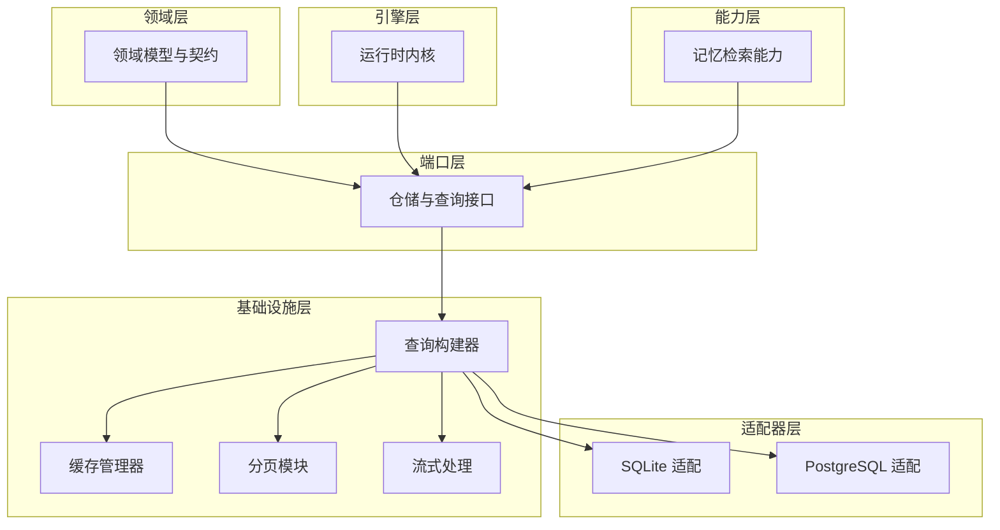
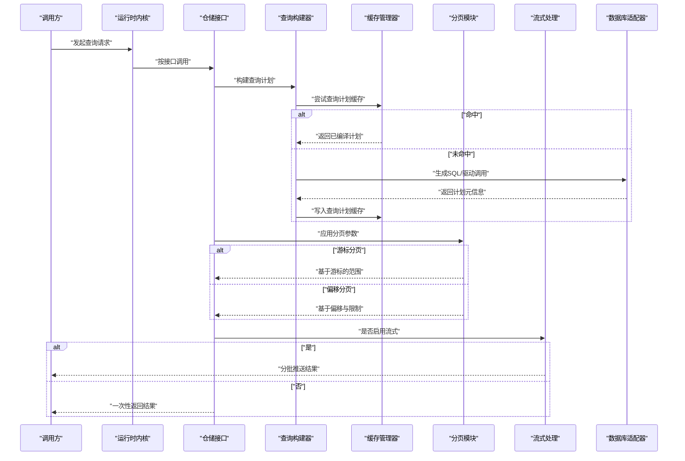
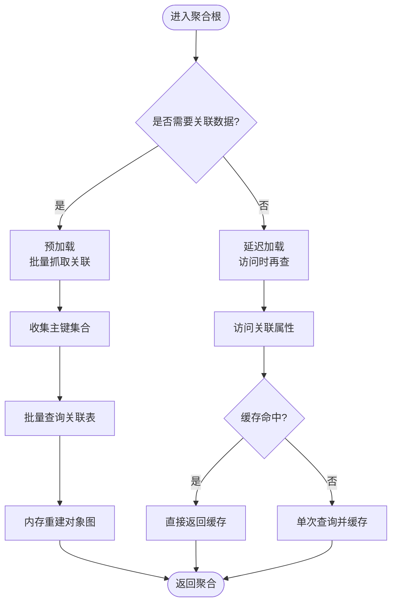
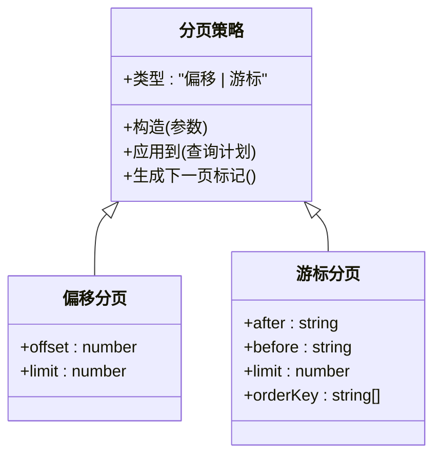
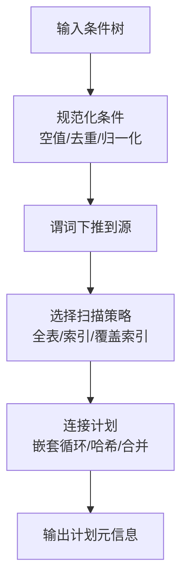
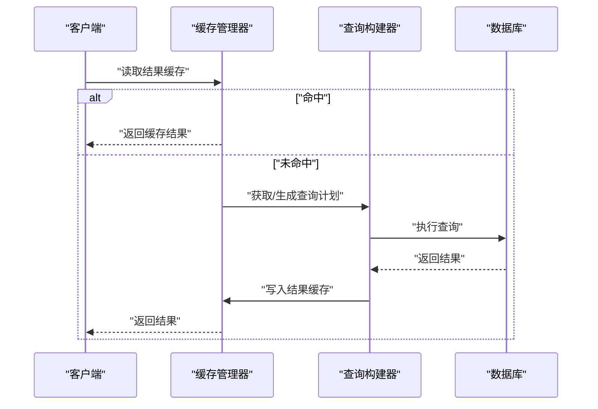
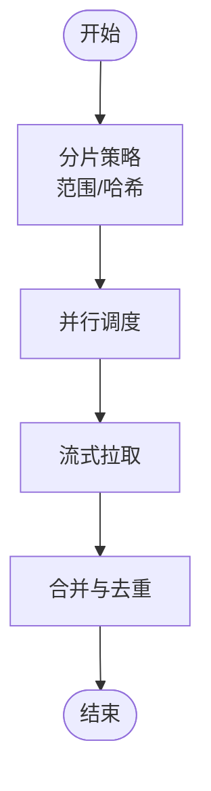
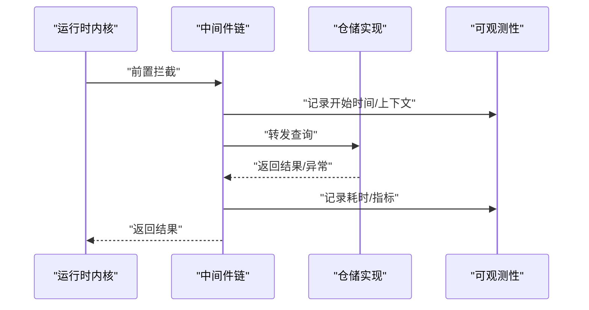
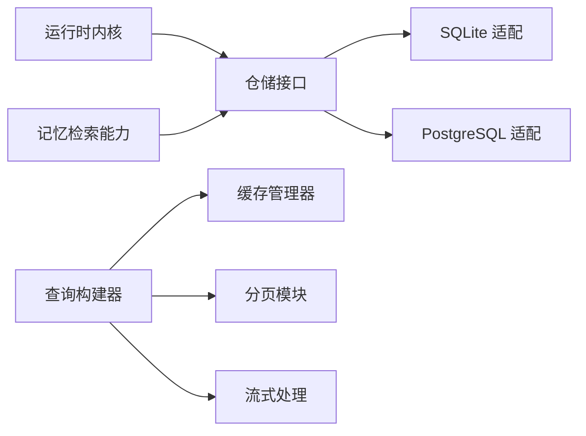

# 查询优化策略

<cite>
**本文引用的文件**   
- [engine/packages/domain-layer/src/index.ts](file://engine/packages/domain-layer/src/index.ts)
- [engine/packages/infrastructure/src/query-builder.ts](file://engine/packages/infrastructure/src/query-builder.ts)
- [engine/packages/infrastructure/src/cache-manager.ts](file://engine/packages/infrastructure/src/cache-manager.ts)
- [engine/packages/infrastructure/src/pagination.ts](file://engine/packages/infrastructure/src/pagination.ts)
- [engine/packages/infrastructure/src/streaming.ts](file://engine/packages/infrastructure/src/streaming.ts)
- [engine/packages/ports-layer/src/repository.ts](file://engine/packages/ports-layer/src/repository.ts)
- [engine/packages/adapters/sqlite/src/repository.ts](file://engine/packages/adapters/sqlite/src/repository.ts)
- [engine/packages/adapters/postgres/src/repository.ts](file://engine/packages/adapters/postgres/src/repository.ts)
- [engine/packages/engine/src/runtime-kernel.ts](file://engine/packages/engine/src/runtime-kernel.ts)
- [engine/packages/capabilities/src/memory-retrieval.ts](file://engine/packages/capabilities/src/memory-retrieval.ts)
- [engine/tests/hybrid-store.test.ts](file://engine/tests/hybrid-store.test.ts)
- [engine/tests/cache.test.ts](file://engine/tests/cache.test.ts)
</cite>

## 目录
1. [简介](#简介)
2. [项目结构](#项目结构)
3. [核心组件](#核心组件)
4. [架构总览](#架构总览)
5. [详细组件分析](#详细组件分析)
6. [依赖关系分析](#依赖关系分析)
7. [性能考量](#性能考量)
8. [故障排查指南](#故障排查指南)
9. [结论](#结论)
10. [附录](#附录)

## 简介
本技术文档聚焦于KCoder的查询优化策略，围绕懒加载与预加载、N+1问题治理、分页与无限滚动、条件查询构建与索引利用、缓存体系（结果缓存与查询计划缓存）、慢查询检测与执行计划分析、以及大数据量场景下的分片/并行/流式处理等主题展开。文档以分层架构视角梳理各层职责与协作方式，并通过图示帮助读者快速建立整体认知。

## 项目结构
KCoder采用多包工作区组织，查询相关能力主要分布在以下层次：
- 领域层（domain-layer）：定义实体、值对象与领域接口契约
- 端口层（ports-layer）：定义仓储与查询抽象接口
- 基础设施层（infrastructure）：实现查询构建器、缓存管理器、分页与流式处理
- 适配器层（adapters）：针对SQLite/PostgreSQL的具体实现
- 引擎层（engine）：运行时内核编排查询生命周期、中间件与可观测性
- 能力层（capabilities）：面向上层能力的查询封装（如记忆检索）

图表来源
- [engine/packages/domain-layer/src/index.ts](file://engine/packages/domain-layer/src/index.ts)
- [engine/packages/ports-layer/src/repository.ts](file://engine/packages/ports-layer/src/repository.ts)
- [engine/packages/infrastructure/src/query-builder.ts](file://engine/packages/infrastructure/src/query-builder.ts)
- [engine/packages/infrastructure/src/cache-manager.ts](file://engine/packages/infrastructure/src/cache-manager.ts)
- [engine/packages/infrastructure/src/pagination.ts](file://engine/packages/infrastructure/src/pagination.ts)
- [engine/packages/infrastructure/src/streaming.ts](file://engine/packages/infrastructure/src/streaming.ts)
- [engine/packages/adapters/sqlite/src/repository.ts](file://engine/packages/adapters/sqlite/src/repository.ts)
- [engine/packages/adapters/postgres/src/repository.ts](file://engine/packages/adapters/postgres/src/repository.ts)
- [engine/packages/engine/src/runtime-kernel.ts](file://engine/packages/engine/src/runtime-kernel.ts)
- [engine/packages/capabilities/src/memory-retrieval.ts](file://engine/packages/capabilities/src/memory-retrieval.ts)

章节来源
- [engine/packages/domain-layer/src/index.ts](file://engine/packages/domain-layer/src/index.ts)
- [engine/packages/ports-layer/src/repository.ts](file://engine/packages/ports-layer/src/repository.ts)
- [engine/packages/infrastructure/src/query-builder.ts](file://engine/packages/infrastructure/src/query-builder.ts)
- [engine/packages/infrastructure/src/cache-manager.ts](file://engine/packages/infrastructure/src/cache-manager.ts)
- [engine/packages/infrastructure/src/pagination.ts](file://engine/packages/infrastructure/src/pagination.ts)
- [engine/packages/infrastructure/src/streaming.ts](file://engine/packages/infrastructure/src/streaming.ts)
- [engine/packages/adapters/sqlite/src/repository.ts](file://engine/packages/adapters/sqlite/src/repository.ts)
- [engine/packages/adapters/postgres/src/repository.ts](file://engine/packages/adapters/postgres/src/repository.ts)
- [engine/packages/engine/src/runtime-kernel.ts](file://engine/packages/engine/src/runtime-kernel.ts)
- [engine/packages/capabilities/src/memory-retrieval.ts](file://engine/packages/capabilities/src/memory-retrieval.ts)

## 核心组件
- 查询构建器：负责将领域查询条件转换为数据库可执行的查询计划，支持动态条件组合、投影选择、排序与分页参数注入。
- 缓存管理器：提供结果缓存与查询计划缓存，包含键生成、TTL、失效策略与并发安全。
- 分页模块：统一偏移分页与游标分页的实现，并暴露无限滚动所需的“下一页”标记。
- 流式处理：对大结果集进行分批拉取与增量消费，降低内存峰值。
- 仓储接口：定义跨存储的查询与写入契约，屏蔽底层差异。
- 运行时内核：在查询生命周期中注入中间件、监控与错误处理。

章节来源
- [engine/packages/infrastructure/src/query-builder.ts](file://engine/packages/infrastructure/src/query-builder.ts)
- [engine/packages/infrastructure/src/cache-manager.ts](file://engine/packages/infrastructure/src/cache-manager.ts)
- [engine/packages/infrastructure/src/pagination.ts](file://engine/packages/infrastructure/src/pagination.ts)
- [engine/packages/infrastructure/src/streaming.ts](file://engine/packages/infrastructure/src/streaming.ts)
- [engine/packages/ports-layer/src/repository.ts](file://engine/packages/ports-layer/src/repository.ts)
- [engine/packages/engine/src/runtime-kernel.ts](file://engine/packages/engine/src/runtime-kernel.ts)

## 架构总览
下图展示了从调用方到数据源的完整查询路径，包括懒加载/预加载决策点、缓存命中分支、分页与流式输出、以及最终由具体适配器落库。

图表来源
- [engine/packages/engine/src/runtime-kernel.ts](file://engine/packages/engine/src/runtime-kernel.ts)
- [engine/packages/ports-layer/src/repository.ts](file://engine/packages/ports-layer/src/repository.ts)
- [engine/packages/infrastructure/src/query-builder.ts](file://engine/packages/infrastructure/src/query-builder.ts)
- [engine/packages/infrastructure/src/cache-manager.ts](file://engine/packages/infrastructure/src/cache-manager.ts)
- [engine/packages/infrastructure/src/pagination.ts](file://engine/packages/infrastructure/src/pagination.ts)
- [engine/packages/infrastructure/src/streaming.ts](file://engine/packages/infrastructure/src/streaming.ts)
- [engine/packages/adapters/sqlite/src/repository.ts](file://engine/packages/adapters/sqlite/src/repository.ts)
- [engine/packages/adapters/postgres/src/repository.ts](file://engine/packages/adapters/postgres/src/repository.ts)

## 详细组件分析

### 懒加载与预加载（含N+1治理）
- 懒加载：在访问关联属性时按需触发查询，避免不必要的I/O。适用于“可能不被使用”的关联数据。
- 预加载：在入口查询阶段批量抓取关联数据，减少往返次数，适合“确定需要”的关联集合。
- N+1治理：通过识别批量ID集合，合并为单次IN查询或JOIN，并在内存中重建对象图；同时结合缓存避免重复加载。

图表来源
- [engine/packages/ports-layer/src/repository.ts](file://engine/packages/ports-layer/src/repository.ts)
- [engine/packages/infrastructure/src/query-builder.ts](file://engine/packages/infrastructure/src/query-builder.ts)
- [engine/packages/infrastructure/src/cache-manager.ts](file://engine/packages/infrastructure/src/cache-manager.ts)

章节来源
- [engine/packages/ports-layer/src/repository.ts](file://engine/packages/ports-layer/src/repository.ts)
- [engine/packages/infrastructure/src/query-builder.ts](file://engine/packages/infrastructure/src/query-builder.ts)
- [engine/packages/infrastructure/src/cache-manager.ts](file://engine/packages/infrastructure/src/cache-manager.ts)

### 分页查询（偏移/游标/无限滚动）
- 偏移分页：基于LIMIT/OFFSET，适合小偏移场景；大偏移时需配合覆盖索引或延迟关联。
- 游标分页：基于上一页最后一条记录的有序字段（如时间戳+主键），稳定且高效，适合无限滚动。
- 无限滚动：前端维护游标，服务端仅返回“下一页”游标与少量记录，降低带宽与渲染压力。

图表来源
- [engine/packages/infrastructure/src/pagination.ts](file://engine/packages/infrastructure/src/pagination.ts)

章节来源
- [engine/packages/infrastructure/src/pagination.ts](file://engine/packages/infrastructure/src/pagination.ts)

### 条件查询构建与索引利用
- 动态条件组合：支持AND/OR嵌套、空值过滤、范围比较、模糊匹配与全文检索。
- 复杂查询优化：自动去重、下推谓词、消除冗余条件、选择最优连接顺序。
- 索引利用：根据谓词列与操作符推断可用索引，必要时提示缺失索引或建议复合索引。

图表来源
- [engine/packages/infrastructure/src/query-builder.ts](file://engine/packages/infrastructure/src/query-builder.ts)

章节来源
- [engine/packages/infrastructure/src/query-builder.ts](file://engine/packages/infrastructure/src/query-builder.ts)

### 查询缓存策略（结果缓存与查询计划缓存）
- 结果缓存：以查询指纹为键缓存结果集，支持TTL与标签级失效；适用于读多写少、强一致要求低的场景。
- 查询计划缓存：缓存编译后的执行计划，避免重复解析与优化开销。
- 失效机制：基于命名空间/标签的批量失效、版本前缀、写操作后主动失效。

图表来源
- [engine/packages/infrastructure/src/cache-manager.ts](file://engine/packages/infrastructure/src/cache-manager.ts)
- [engine/packages/infrastructure/src/query-builder.ts](file://engine/packages/infrastructure/src/query-builder.ts)

章节来源
- [engine/packages/infrastructure/src/cache-manager.ts](file://engine/packages/infrastructure/src/cache-manager.ts)
- [engine/packages/infrastructure/src/query-builder.ts](file://engine/packages/infrastructure/src/query-builder.ts)

### 大数据量查询优化（分片/并行/流式）
- 分片查询：按范围或哈希拆分查询任务，分别执行后合并结果。
- 并行查询：对独立子查询并发执行，注意限流与资源隔离。
- 流式处理：逐批拉取与消费，避免一次性加载全部数据，降低内存峰值。

图表来源
- [engine/packages/infrastructure/src/streaming.ts](file://engine/packages/infrastructure/src/streaming.ts)

章节来源
- [engine/packages/infrastructure/src/streaming.ts](file://engine/packages/infrastructure/src/streaming.ts)

### 运行时内核与可观测性
- 查询生命周期：在进入仓储前后注入中间件，用于埋点、审计、预算控制与错误恢复。
- 慢查询检测：统计执行时长与资源消耗，超过阈值上报告警。
- 执行计划分析：采集计划元信息，辅助定位全表扫描、低效连接等问题。

图表来源
- [engine/packages/engine/src/runtime-kernel.ts](file://engine/packages/engine/src/runtime-kernel.ts)

章节来源
- [engine/packages/engine/src/runtime-kernel.ts](file://engine/packages/engine/src/runtime-kernel.ts)

### 能力层示例：记忆检索
- 记忆检索能力封装了常用查询模式，内部复用分页、缓存与懒加载策略，对外暴露简洁API。

章节来源
- [engine/packages/capabilities/src/memory-retrieval.ts](file://engine/packages/capabilities/src/memory-retrieval.ts)

## 依赖关系分析
- 耦合与内聚：仓储接口解耦具体存储；查询构建器与缓存/分页/流式模块高内聚；适配器层专注驱动细节。
- 外部依赖：SQLite/PostgreSQL驱动、缓存后端（内存/Redis等）。
- 潜在环依赖：确保查询构建器不反向依赖仓储实现，避免循环。

图表来源
- [engine/packages/ports-layer/src/repository.ts](file://engine/packages/ports-layer/src/repository.ts)
- [engine/packages/adapters/sqlite/src/repository.ts](file://engine/packages/adapters/sqlite/src/repository.ts)
- [engine/packages/adapters/postgres/src/repository.ts](file://engine/packages/adapters/postgres/src/repository.ts)
- [engine/packages/infrastructure/src/query-builder.ts](file://engine/packages/infrastructure/src/query-builder.ts)
- [engine/packages/infrastructure/src/cache-manager.ts](file://engine/packages/infrastructure/src/cache-manager.ts)
- [engine/packages/infrastructure/src/pagination.ts](file://engine/packages/infrastructure/src/pagination.ts)
- [engine/packages/infrastructure/src/streaming.ts](file://engine/packages/infrastructure/src/streaming.ts)
- [engine/packages/engine/src/runtime-kernel.ts](file://engine/packages/engine/src/runtime-kernel.ts)
- [engine/packages/capabilities/src/memory-retrieval.ts](file://engine/packages/capabilities/src/memory-retrieval.ts)

章节来源
- [engine/packages/ports-layer/src/repository.ts](file://engine/packages/ports-layer/src/repository.ts)
- [engine/packages/adapters/sqlite/src/repository.ts](file://engine/packages/adapters/sqlite/src/repository.ts)
- [engine/packages/adapters/postgres/src/repository.ts](file://engine/packages/adapters/postgres/src/repository.ts)
- [engine/packages/infrastructure/src/query-builder.ts](file://engine/packages/infrastructure/src/query-builder.ts)
- [engine/packages/infrastructure/src/cache-manager.ts](file://engine/packages/infrastructure/src/cache-manager.ts)
- [engine/packages/infrastructure/src/pagination.ts](file://engine/packages/infrastructure/src/pagination.ts)
- [engine/packages/infrastructure/src/streaming.ts](file://engine/packages/infrastructure/src/streaming.ts)
- [engine/packages/engine/src/runtime-kernel.ts](file://engine/packages/engine/src/runtime-kernel.ts)
- [engine/packages/capabilities/src/memory-retrieval.ts](file://engine/packages/capabilities/src/memory-retrieval.ts)

## 性能考量
- 优先使用游标分页替代大偏移分页，避免深层OFFSET带来的额外扫描。
- 为高频过滤与排序列建立合适索引，尽量使用覆盖索引减少回表。
- 合理使用结果缓存与查询计划缓存，注意一致性边界与失效粒度。
- 对大结果集启用流式处理，控制单批大小与并发度，防止内存抖动。
- 在运行时内核中开启慢查询告警与执行计划采集，持续优化热点查询。

[本节为通用指导，无需列出具体文件来源]

## 故障排查指南
- 慢查询检测：关注运行时的耗时指标与告警，定位长尾查询。
- 执行计划分析：检查是否存在全表扫描、低效连接、缺少索引等情况。
- 缓存问题：核对缓存键生成逻辑、TTL设置与失效时机，避免脏读或雪崩。
- 分页异常：确认游标字段唯一性与排序稳定性，避免跳页或重复。
- 流式背压：监控批次大小与消费者速度，必要时调整并发与缓冲。

章节来源
- [engine/tests/hybrid-store.test.ts](file://engine/tests/hybrid-store.test.ts)
- [engine/tests/cache.test.ts](file://engine/tests/cache.test.ts)

## 结论
通过统一的查询构建器、可插拔的分页与流式模块、完善的缓存体系以及运行时内核的可观测性，KCoder能够在保证一致性的前提下显著提升查询性能与可扩展性。建议在业务侧优先采用游标分页与预加载策略，结合索引与缓存，逐步引入流式与分片方案应对海量数据场景。

[本节为总结性内容，无需列出具体文件来源]

## 附录
- 术语说明
  - 懒加载：在访问时才加载关联数据
  - 预加载：在入口查询时批量加载关联数据
  - 游标分页：基于有序字段与游标的高效分页
  - 覆盖索引：查询所需列均在索引中，无需回表
- 最佳实践清单
  - 明确读写一致性需求，合理选择缓存策略
  - 为高频条件与排序列建立复合索引
  - 使用游标分页替代深层OFFSET
  - 对大结果集启用流式处理
  - 在关键路径埋点与采集执行计划

[本节为补充信息，无需列出具体文件来源]