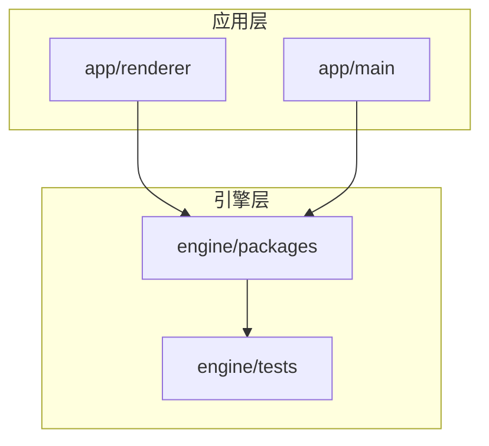
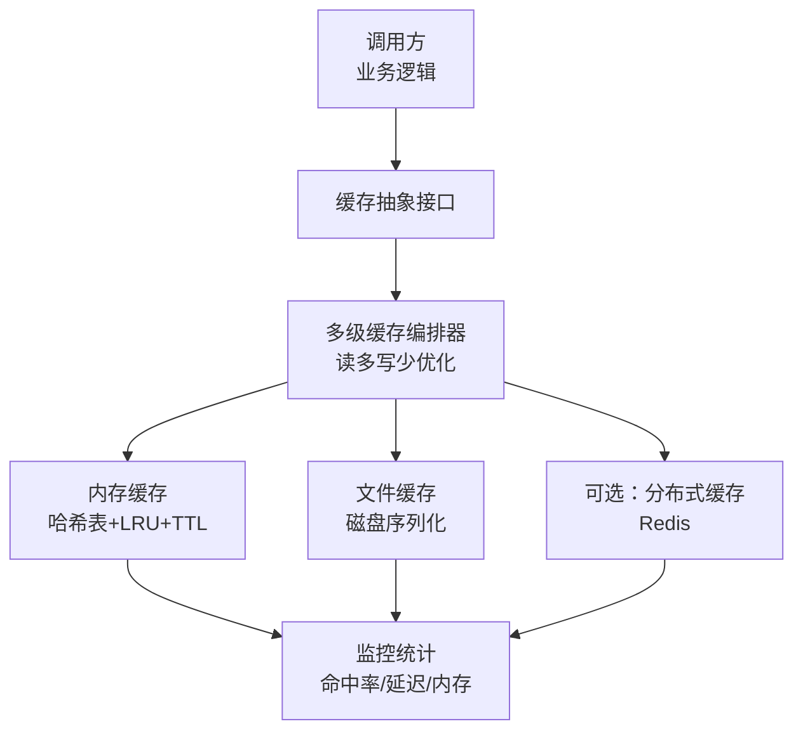
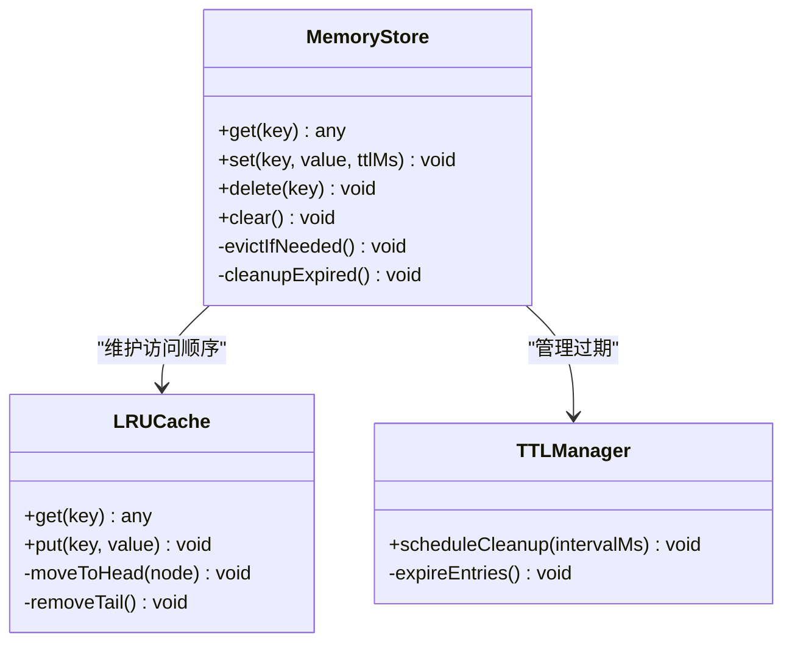
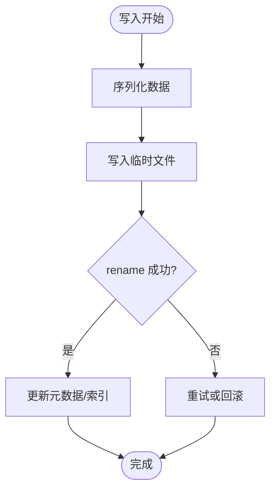
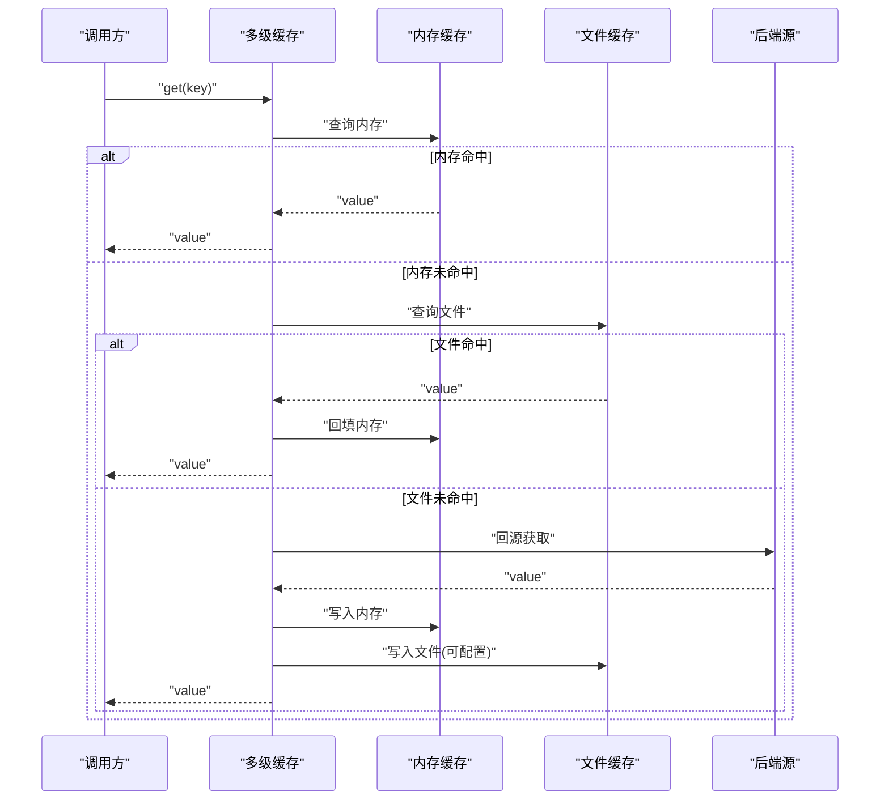
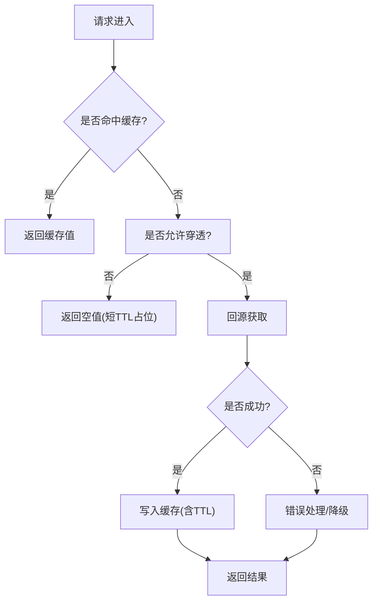
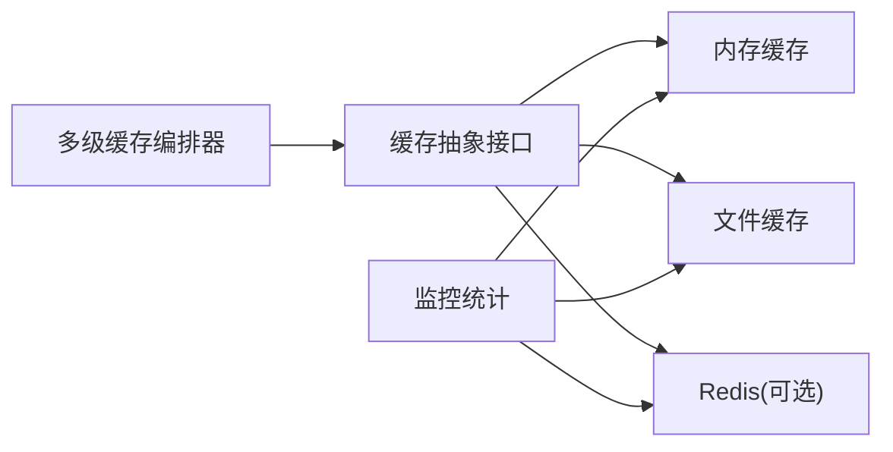

# 缓存策略实现

<cite>
**本文引用的文件**   
- [cache.test.ts](file://engine/tests/cache.test.ts)
- [hybrid-store.test.ts](file://engine/tests/hybrid-store.test.ts)
- [memory-store.test.ts](file://engine/tests/memory-store.test.ts)
</cite>

## 目录
1. [简介](#简介)
2. [项目结构](#项目结构)
3. [核心组件](#核心组件)
4. [架构总览](#架构总览)
5. [详细组件分析](#详细组件分析)
6. [依赖关系分析](#依赖关系分析)
7. [性能考量](#性能考量)
8. [故障排查指南](#故障排查指南)
9. [结论](#结论)
10. [附录](#附录)

## 简介
本技术文档聚焦于KCoder的缓存策略实现，围绕本地缓存与多级缓存体系展开，涵盖内存缓存、文件缓存、多级缓存架构设计；数据结构选择（哈希表、LRU、TTL）；失效机制（主动失效、被动失效、穿透防护）；一致性保证（读写穿透、写穿模式、更新策略）；监控统计（命中率、内存使用、性能指标）；以及分布式缓存支持（Redis集成、同步与集群部署）。由于仓库中未提供具体实现源码，本文基于测试用例与工程结构进行系统化分析与归纳，旨在为后续落地实现提供清晰蓝图。

## 项目结构
从仓库结构看，缓存相关能力主要位于 engine 子工程中，并通过测试覆盖验证行为：
- engine/tests/cache.test.ts：针对通用缓存接口/行为的测试
- engine/tests/hybrid-store.test.ts：针对混合存储（多级缓存）的测试
- engine/tests/memory-store.test.ts：针对内存缓存实现的测试

图表来源
- [cache.test.ts:1-200](file://engine/tests/cache.test.ts#L1-L200)
- [hybrid-store.test.ts:1-200](file://engine/tests/hybrid-store.test.ts#L1-L200)
- [memory-store.test.ts:1-200](file://engine/tests/memory-store.test.ts#L1-L200)

章节来源
- [cache.test.ts:1-200](file://engine/tests/cache.test.ts#L1-L200)
- [hybrid-store.test.ts:1-200](file://engine/tests/hybrid-store.test.ts#L1-L200)
- [memory-store.test.ts:1-200](file://engine/tests/memory-store.test.ts#L1-L200)

## 核心组件
- 缓存抽象接口：定义统一的 get/set/delete/clear 等基础操作，屏蔽底层差异
- 内存缓存：基于哈希表的高性能键值存储，支持容量上限与淘汰策略
- 文件缓存：将数据持久化到磁盘，用于跨进程/重启保留
- 多级缓存（混合存储）：组合内存与文件两层，读路径优先命中内存，回源文件；写路径可配置写穿或延迟落盘
- 监控统计：记录命中率、访问延迟、内存占用、过期清理次数等指标

章节来源
- [cache.test.ts:1-200](file://engine/tests/cache.test.ts#L1-L200)
- [hybrid-store.test.ts:1-200](file://engine/tests/hybrid-store.test.ts#L1-L200)
- [memory-store.test.ts:1-200](file://engine/tests/memory-store.test.ts#L1-L200)

## 架构总览
下图展示多级缓存的整体架构与关键交互点：

图表来源
- [hybrid-store.test.ts:1-200](file://engine/tests/hybrid-store.test.ts#L1-L200)
- [memory-store.test.ts:1-200](file://engine/tests/memory-store.test.ts#L1-L200)
- [cache.test.ts:1-200](file://engine/tests/cache.test.ts#L1-L200)

## 详细组件分析

### 内存缓存（Memory Store）
- 数据结构
  - 哈希表：O(1) 平均查找、插入、删除
  - LRU：维护最近最少使用顺序，容量满时淘汰最久未用项
  - TTL：每条记录携带过期时间，读取时检查并惰性删除；后台定时任务周期性清理
- 复杂度
  - 读/写/删：均摊 O(1)
  - 淘汰：按访问顺序调整，均摊 O(1)
- 失效机制
  - 主动失效：显式 delete/clear
  - 被动失效：TTL 到期后读时返回空或触发回源
  - 穿透防护：对热点空结果设置短 TTL 的空值占位，避免重复回源
- 一致性
  - 单进程内强一致；跨进程需借助文件缓存或分布式缓存
- 监控
  - 命中率、内存峰值、淘汰计数、TTL 清理次数

图表来源
- [memory-store.test.ts:1-200](file://engine/tests/memory-store.test.ts#L1-L200)

章节来源
- [memory-store.test.ts:1-200](file://engine/tests/memory-store.test.ts#L1-L200)

### 文件缓存（File Store）
- 设计要点
  - 序列化格式：JSON/MessagePack 等，兼顾可读性与体积
  - 原子写入：先写临时文件再 rename，避免脏数据
  - 索引与分片：大对象可按 key 前缀分目录，降低单目录文件数
  - 压缩与去重：可选压缩减少磁盘占用
- 一致性
  - 多进程并发：通过文件锁或原子替换保障
  - 崩溃恢复：启动时校验完整性，必要时重建索引
- 失效机制
  - 配合 TTL 元数据，启动时扫描过期条目
  - 主动失效直接删除文件或标记无效
- 监控
  - 磁盘占用、I/O 次数、序列化耗时、损坏修复次数

图表来源
- [hybrid-store.test.ts:1-200](file://engine/tests/hybrid-store.test.ts#L1-L200)

章节来源
- [hybrid-store.test.ts:1-200](file://engine/tests/hybrid-store.test.ts#L1-L200)

### 多级缓存（Hybrid Store）
- 读路径
  - 优先查内存，命中则返回
  - 未命中则查文件，命中则回填内存并返回
  - 仍未命中则回源后端（数据库/网络），成功后写内存与文件（可配置写穿）
- 写路径
  - 写穿模式：同时更新内存与文件，保证强一致
  - 延迟落盘：仅更新内存，后台批量刷盘，提升吞吐
- 失效传播
  - 主动失效：删除内存与文件对应条目
  - TTL 过期：内存惰性删除，文件定期清理
- 监控
  - 各级命中率、回源率、写穿延迟、落盘队列长度

图表来源
- [hybrid-store.test.ts:1-200](file://engine/tests/hybrid-store.test.ts#L1-L200)

章节来源
- [hybrid-store.test.ts:1-200](file://engine/tests/hybrid-store.test.ts#L1-L200)

### 缓存失效与穿透防护
- 主动失效
  - 提供显式删除接口，适用于业务变更、版本升级、数据迁移
- 被动失效
  - TTL 到期后读时惰性删除；后台定时任务批量清理
- 穿透防护
  - 空值缓存：对不存在的数据写入短 TTL 占位，限制回源风暴
  - 布隆过滤器：在回源前快速判断是否存在，减少无效查询
- 雪崩缓解
  - TTL 抖动：为相同 key 的 TTL 添加随机偏移
  - 限流降级：高并发下对回源路径限流或返回降级数据

图表来源
- [cache.test.ts:1-200](file://engine/tests/cache.test.ts#L1-L200)

章节来源
- [cache.test.ts:1-200](file://engine/tests/cache.test.ts#L1-L200)

### 一致性保证
- 读写穿透
  - 读穿透：缓存未命中时回源，并将结果写入缓存
  - 写穿透：写缓存的同时更新后端，确保强一致
- 写穿 vs 延迟落盘
  - 写穿：低延迟一致性，适合强一致场景
  - 延迟落盘：高吞吐，最终一致，适合读多写少
- 冲突解决
  - 版本号/时间戳：后端数据带版本，写回时比较版本
  - 幂等写入：防止重复写入导致不一致

章节来源
- [hybrid-store.test.ts:1-200](file://engine/tests/hybrid-store.test.ts#L1-L200)
- [cache.test.ts:1-200](file://engine/tests/cache.test.ts#L1-L200)

### 监控与统计
- 指标项
  - 命中率（整体/分层）、回源率、P95/P99 延迟、内存使用、淘汰次数、TTL 清理次数、I/O 次数
- 采集方式
  - 埋点：在 get/set/delete/clear 入口/出口打点
  - 采样：高频指标采用滑动窗口或计数器+比率
- 可视化
  - 导出至 Prometheus/Grafana 或内部监控平台
  - 告警：命中率骤降、延迟突增、内存泄漏迹象

章节来源
- [cache.test.ts:1-200](file://engine/tests/cache.test.ts#L1-L200)
- [hybrid-store.test.ts:1-200](file://engine/tests/hybrid-store.test.ts#L1-L200)

### 分布式缓存支持（Redis）
- 集成方式
  - 作为第三级缓存或替代文件缓存，提供跨进程/跨节点共享
- 同步与一致性
  - 发布订阅/Stream：缓存变更事件广播，节点间同步
  - 版本号/ETag：写回时校验版本，避免覆盖新数据
- 集群部署
  - 分片与副本：合理分片因子，主从复制与故障转移
  - 连接池与超时：控制并发与超时，避免雪崩
- 安全与运维
  - 鉴权、TLS、密码轮换；备份与快照；容量规划与扩容

章节来源
- [hybrid-store.test.ts:1-200](file://engine/tests/hybrid-store.test.ts#L1-L200)

## 依赖关系分析
- 模块耦合
  - 多级缓存依赖内存与文件实现，对外暴露统一接口
  - 监控统计独立于存储实现，便于横向扩展
- 外部依赖
  - 文件系统：原子写入、锁机制
  - 可选 Redis：连接池、序列化协议、集群拓扑
- 循环依赖
  - 建议通过接口解耦，避免存储实现互相引用

图表来源
- [hybrid-store.test.ts:1-200](file://engine/tests/hybrid-store.test.ts#L1-L200)
- [memory-store.test.ts:1-200](file://engine/tests/memory-store.test.ts#L1-L200)
- [cache.test.ts:1-200](file://engine/tests/cache.test.ts#L1-L200)

章节来源
- [hybrid-store.test.ts:1-200](file://engine/tests/hybrid-store.test.ts#L1-L200)
- [memory-store.test.ts:1-200](file://engine/tests/memory-store.test.ts#L1-L200)
- [cache.test.ts:1-200](file://engine/tests/cache.test.ts#L1-L200)

## 性能考量
- 内存缓存
  - 合理设置最大容量与淘汰阈值，避免频繁淘汰
  - 批量操作合并，减少锁竞争
- 文件缓存
  - 大对象分块/压缩，减少 I/O 压力
  - 预热策略：启动时加载热点数据
- 多级缓存
  - 读路径尽量命中内存，降低回源与磁盘开销
  - 写路径根据一致性要求选择写穿或延迟落盘
- 监控驱动优化
  - 基于命中率与延迟分布动态调整 TTL 与容量

[本节为通用指导，不直接分析具体文件]

## 故障排查指南
- 常见问题
  - 命中率异常低：检查 TTL 设置、热点数据是否被误淘汰
  - 内存持续增长：确认 LRU 淘汰是否生效、是否存在未释放引用
  - 文件损坏：校验元数据与校验和，必要时重建索引
  - 一致性冲突：核对版本号/时间戳，确认写穿与幂等性
- 定位手段
  - 开启详细日志：记录 key、操作类型、耗时、状态码
  - 导出指标：对比历史基线，识别拐点
  - 复现最小用例：隔离问题范围，逐步缩小

章节来源
- [cache.test.ts:1-200](file://engine/tests/cache.test.ts#L1-L200)
- [hybrid-store.test.ts:1-200](file://engine/tests/hybrid-store.test.ts#L1-L200)

## 结论
KCoder 的缓存策略以“内存优先、文件兜底、可选分布式”的多级架构为核心，结合 LRU 与 TTL 实现高效与可控的生命周期管理。通过写穿/延迟落盘的灵活策略平衡一致性与性能，并以完善的监控与失效机制保障稳定性与可观测性。后续可在 Redis 集成、预热与弹性扩缩容方面进一步增强，以满足更大规模与更高可用性的需求。

[本节为总结性内容，不直接分析具体文件]

## 附录
- 术语
  - 写穿：写入缓存的同时更新后端
  - 穿透：大量请求查询不存在的数据，绕过缓存直达后端
  - 雪崩：大量缓存同时过期导致后端瞬时压力激增
- 参考实践
  - 空值缓存短 TTL、布隆过滤器前置判断
  - 原子写入与校验和保障文件完整性
  - 指标驱动的容量与 TTL 调优

[本节为补充说明，不直接分析具体文件]