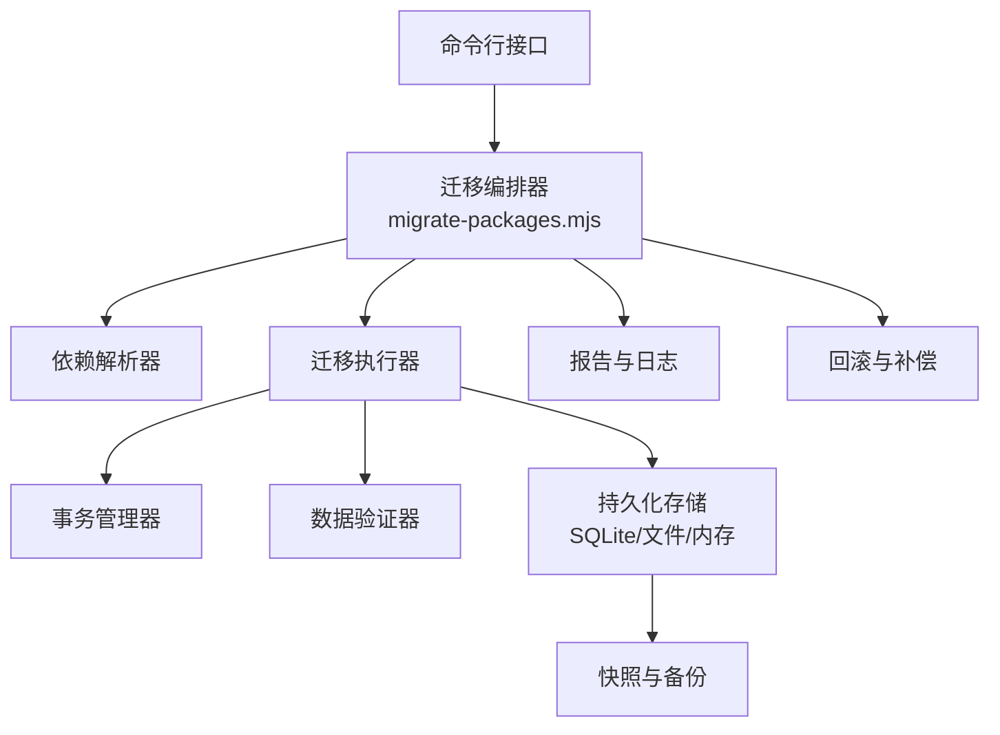
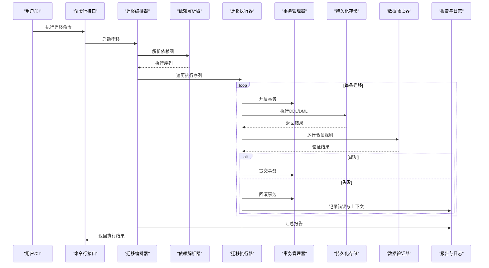
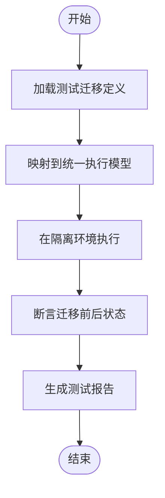
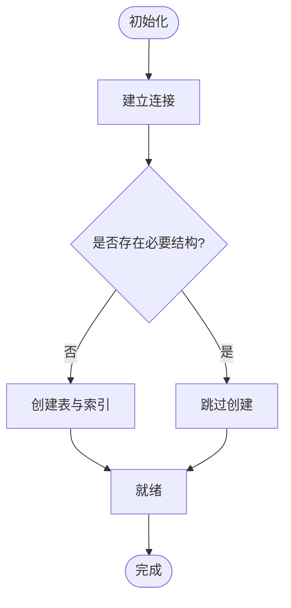
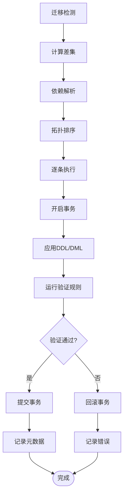
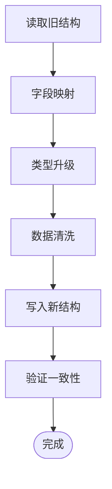
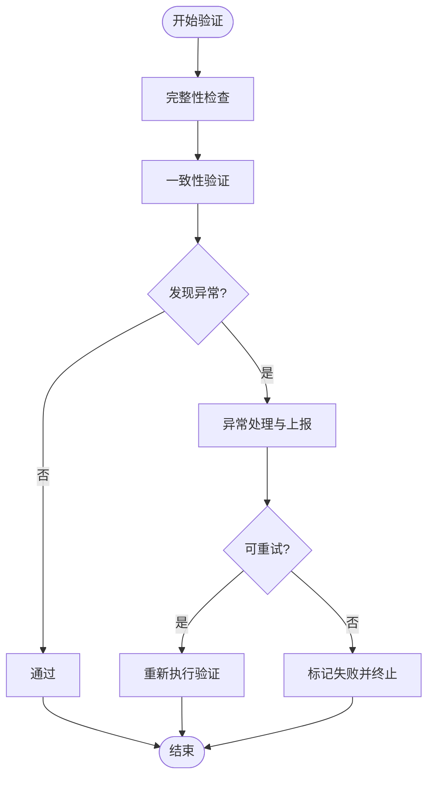
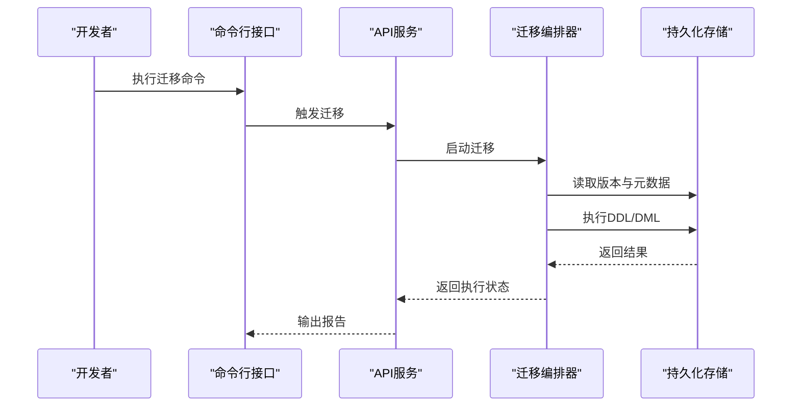
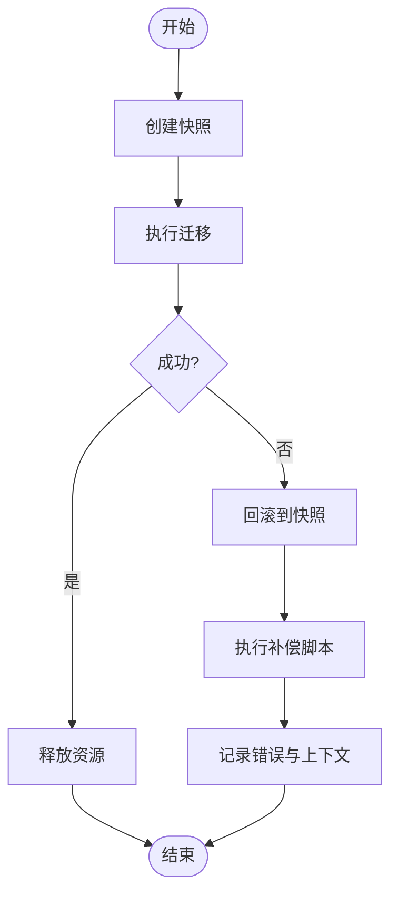

# 数据迁移

<cite>
**本文引用的文件**   
- [engine/scripts/migrate-packages.mjs](file://engine/scripts/migrate-packages.mjs)
- [engine/scripts/migrate-tests.mjs](file://engine/scripts/migrate-tests.mjs)
- [engine/scripts/prepare-sqlite.mjs](file://engine/scripts/prepare-sqlite.mjs)
- [engine/scripts/build.mjs](file://engine/scripts/build.mjs)
- [engine/scripts/flatten-dist.mjs](file://engine/scripts/flatten-dist.mjs)
- [engine/scripts/scaffold-packages.mjs](file://engine/scripts/scaffold-packages.mjs)
- [engine/scripts/transcript-diff.mjs](file://engine/scripts/transcript-diff.mjs)
- [engine/scripts/verify-core-sync.mjs](file://engine/scripts/verify-core-sync.mjs)
- [engine/scripts/verify-crash-recovery.mjs](file://engine/scripts/verify-crash-recovery.mjs)
- [engine/scripts/verify-evented-a2a.mjs](file://engine/scripts/verify-evented-a2a.mjs)
- [engine/scripts/verify-sqlite.mjs](file://engine/scripts/verify-sqlite.mjs)
- [engine/tests/legacy-task-state-migration.test.ts](file://engine/tests/legacy-task-state-migration.test.ts)
- [engine/tests/runtime-kernel-after-middleware.test.ts](file://engine/tests/runtime-kernel-after-middleware.test.ts)
- [engine/tests/runtime-kernel-crash-recovery.test.ts](file://engine/tests/runtime-kernel-crash-recovery.test.ts)
- [engine/tests/runtime-kernel-e2e.test.ts](file://engine/tests/runtime-kernel-e2e.test.ts)
- [engine/tests/task-state-store.test.ts](file://engine/tests/task-state-store.test.ts)
- [engine/tests/file-session-store-integration.test.ts](file://engine/tests/file-session-store-integration.test.ts)
- [engine/tests/hybrid-store.test.ts](file://engine/tests/hybrid-store.test.ts)
- [engine/tests/run-state-store.test.ts](file://engine/tests/run-state-store.test.ts)
- [engine/tests/memory-store.test.ts](file://engine/tests/memory-store.test.ts)
- [engine/tests/cache.test.ts](file://engine/tests/cache.test.ts)
- [engine/tests/tool-call-repair.test.ts](file://engine/tests/tool-call-repair.test.ts)
- [engine/tests/model-history-repair.test.ts](file://engine/tests/model-history-repair.test.ts)
- [engine/tests/effect-result-store.test.ts](file://engine/tests/effect-result-store.test.ts)
- [engine/tests/durable-task-capsule.test.ts](file://engine/tests/durable-task-capsule.test.ts)
- [engine/tests/compaction-transaction.test.ts](file://engine/tests/compaction-transaction.test.ts)
- [engine/tests/execution-graph.test.ts](file://engine/tests/execution-graph.test.ts)
- [engine/tests/runtime-kernel-provider-matrix.test.ts](file://engine/tests/runtime-kernel-provider-matrix.test.ts)
- [engine/tests/runtime-kernel-isolation.test.ts](file://engine/tests/runtime-kernel-isolation.test.ts)
- [engine/tests/runtime-kernel-parity.test.ts](file://engine/tests/runtime-kernel-parity.test.ts)
- [engine/tests/runtime-kernel.test.ts](file://engine/tests/runtime-kernel.test.ts)
- [engine/tests/runtime-middleware-governance.test.ts](file://engine/tests/runtime-middleware-governance.test.ts)
- [engine/tests/runtime-middleware.test.ts](file://engine/tests/runtime-middleware.test.ts)
- [engine/tests/runtime-rollout.test.ts](file://engine/tests/runtime-rollout.test.ts)
- [engine/tests/runtime-factory-rollout.test.ts](file://engine/tests/runtime-factory-rollout.test.ts)
- [engine/tests/runtime-factory.test.ts](file://engine/tests/runtime-factory.test.ts)
- [engine/tests/kernel-v3-node-handlers.test.ts](file://engine/tests/kernel-v3-node-handlers.test.ts)
- [engine/tests/kernel-v3-provider-governance.test.ts](file://engine/tests/kernel-v3-provider-governance.test.ts)
- [engine/tests/kernel-v3-turn-runner.test.ts](file://engine/tests/kernel-v3-turn-runner.test.ts)
- [engine/tests/loop-runner.test.ts](file://engine/tests/loop-runner.test.ts)
- [engine/tests/loop-test-harness.ts](file://engine/tests/loop-test-harness.ts)
- [engine/tests/loop-policy.test.ts](file://engine/tests/loop-policy.test.ts)
- [engine/tests/loop-plan.test.ts](file://engine/tests/loop-plan.test.ts)
- [engine/tests/loop-governor.test.ts](file://engine/tests/loop-governor.test.ts)
- [engine/tests/loop-evaluator.test.ts](file://engine/tests/loop-evaluator.test.ts)
- [engine/tests/tool-runtime-v3.test.ts](file://engine/tests/tool-runtime-v3.test.ts)
- [engine/tests/tool-coordinator-runtime.test.ts](file://engine/tests/tool-coordinator-runtime.test.ts)
- [engine/tests/tool-dispatch-errors.test.ts](file://engine/tests/tool-dispatch-errors.test.ts)
- [engine/tests/tool-result-budget.test.ts](file://engine/tests/tool-result-budget.test.ts)
- [engine/tests/tool-storm-breaker.test.ts](file://engine/tests/tool-storm-breaker.test.ts)
- [engine/tests/turn-event-bus.test.ts](file://engine/tests/turn-event-bus.test.ts)
- [engine/tests/turn-state-store.test.ts](file://engine/tests/turn-state-store.test.ts)
- [engine/tests/usage-service.test.ts](file://engine/tests/usage-service.test.ts)
- [engine/tests/web-tool-provider.test.ts](file://engine/tests/web-tool-provider.test.ts)
- [engine/tests/work-mode-skill-runtime.test.ts](file://engine/tests/work-mode-skill-runtime.test.ts)
- [engine/tests/virtual-path.test.ts](file://engine/tests/virtual-path.test.ts)
- [engine/tests/attachment-store.test.ts](file://engine/tests/attachment-store.test.ts)
- [engine/tests/auto-model-router.test.ts](file://engine/tests/auto-model-router.test.ts)
- [engine/tests/builtin-skills.test.ts](file://engine/tests/builtin-skills.test.ts)
- [engine/tests/builtin-tool-utils.test.ts](file://engine/tests/builtin-tool-utils.test.ts)
- [engine/tests/builtin-tools.test.ts](file://engine/tests/builtin-tools.test.ts)
- [engine/tests/cache.test.ts](file://engine/tests/cache.test.ts)
- [engine/tests/capabilities.test.ts](file://engine/tests/capabilities.test.ts)
- [engine/tests/capability-registry.test.ts](file://engine/tests/capability-registry.test.ts)
- [engine/tests/child-agent-executor.test.ts](file://engine/tests/child-agent-executor.test.ts)
- [engine/tests/cli-agent.test.ts](file://engine/tests/cli-agent.test.ts)
- [engine/tests/command-audit.test.ts](file://engine/tests/command-audit.test.ts)
- [engine/tests/compaction-governor.test.ts](file://engine/tests/compaction-governor.test.ts)
- [engine/tests/context-compactor.test.ts](file://engine/tests/context-compactor.test.ts)
- [engine/tests/continuation-policy.test.ts](file://engine/tests/continuation-policy.test.ts)
- [engine/tests/contracts.test.ts](file://engine/tests/contracts.test.ts)
- [engine/tests/create-plan-tool.test.ts](file://engine/tests/create-plan-tool.test.ts)
- [engine/tests/deepseek-pricing.test.ts](file://engine/tests/deepseek-pricing.test.ts)
- [engine/tests/delegation-runtime.test.ts](file://engine/tests/delegation-runtime.test.ts)
- [engine/tests/delegation-terminal-state.test.ts](file://engine/tests/delegation-terminal-state.test.ts)
- [engine/tests/domain.test.ts](file://engine/tests/domain.test.ts)
- [engine/tests/evented-loop.test.ts](file://engine/tests/evented-loop.test.ts)
- [engine/tests/file-mutation-queue.test.ts](file://engine/tests/file-mutation-queue.test.ts)
- [engine/tests/file-session-store.test.ts](file://engine/tests/file-session-store.test.ts)
- [engine/tests/finance-credentials.test.ts](file://engine/tests/finance-credentials.test.ts)
- [engine/tests/flatten-dist-script.test.ts](file://engine/tests/flatten-dist-script.test.ts)
- [engine/tests/global.d.ts](file://engine/tests/global.d.ts)
- [engine/tests/goal-tools.test.ts](file://engine/tests/goal-tools.test.ts)
- [engine/tests/http-artifacts.test.ts](file://engine/tests/http-artifacts.test.ts)
- [engine/tests/http-peer-transport.test.ts](file://engine/tests/http-peer-transport.test.ts)
- [engine/tests/http-server-observability.test.ts](file://engine/tests/http-server-observability.test.ts)
- [engine/tests/http-server-test-harness.ts](file://engine/tests/http-server-test-harness.ts)
- [engine/tests/http-server.test.ts](file://engine/tests/http-server.test.ts)
- [engine/tests/hybrid-store.test.ts](file://engine/tests/hybrid-store.test.ts)
- [engine/tests/kernel-v3-node-handlers.test.ts](file://engine/tests/kernel-v3-node-handlers.test.ts)
- [engine/tests/kernel-v3-provider-governance.test.ts](file://engine/tests/kernel-v3-provider-governance.test.ts)
- [engine/tests/kernel-v3-turn-runner.test.ts](file://engine/tests/kernel-v3-turn-runner.test.ts)
- [engine/tests/legacy-task-state-migration.test.ts](file://engine/tests/legacy-task-state-migration.test.ts)
- [engine/tests/loop-evaluator.test.ts](file://engine/tests/loop-evaluator.test.ts)
- [engine/tests/loop-governor.test.ts](file://engine/tests/loop-governor.test.ts)
- [engine/tests/loop-plan.test.ts](file://engine/tests/loop-plan.test.ts)
- [engine/tests/loop-policy.test.ts](file://engine/tests/loop-policy.test.ts)
- [engine/tests/loop-runner.test.ts](file://engine/tests/loop-runner.test.ts)
- [engine/tests/loop-test-harness.ts](file://engine/tests/loop-test-harness.ts)
- [engine/tests/manifest.test.ts](file://engine/tests/manifest.test.ts)
- [engine/tests/marketplace.test.ts](file://engine/tests/marketplace.test.ts)
- [engine/tests/mcp-config.test.ts](file://engine/tests/mcp-config.test.ts)
- [engine/tests/mcp-tool-provider.test.ts](file://engine/tests/mcp-tool-provider.test.ts)
- [engine/tests/memory-retrieval.test.ts](file://engine/tests/memory-retrieval.test.ts)
- [engine/tests/memory-store.test.ts](file://engine/tests/memory-store.test.ts)
- [engine/tests/model-client.test.ts](file://engine/tests/model-client.test.ts)
- [engine/tests/model-history-repair.test.ts](file://engine/tests/model-history-repair.test.ts)
- [engine/tests/model-proposal.test.ts](file://engine/tests/model-proposal.test.ts)
- [engine/tests/model-protocol-normalizer.test.ts](file://engine/tests/model-protocol-normalizer.test.ts)
- [engine/tests/model-step-runner.test.ts](file://engine/tests/model-step-runner.test.ts)
- [engine/tests/opentelemetry.test.ts](file://engine/tests/opentelemetry.test.ts)
- [engine/tests/output-accumulator.test.ts](file://engine/tests/output-accumulator.test.ts)
- [engine/tests/plugin-host.test.ts](file://engine/tests/plugin-host.test.ts)
- [engine/tests/ports.test.ts](file://engine/tests/ports.test.ts)
- [engine/tests/proposal-classifier.test.ts](file://engine/tests/proposal-classifier.test.ts)
- [engine/tests/provider-compatibility.test.ts](file://engine/tests/provider-compatibility.test.ts)
- [engine/tests/qiongqi-config.test.ts](file://engine/tests/qiongqi-config.test.ts)
- [engine/tests/read-json-body.test.ts](file://engine/tests/read-json-body.test.ts)
- [engine/tests/request-history-hygiene.test.ts](file://engine/tests/request-history-hygiene.test.ts)
- [engine/tests/review.test.ts](file://engine/tests/review.test.ts)
- [engine/tests/run-event-store.test.ts](file://engine/tests/run-event-store.test.ts)
- [engine/tests/run-state-store.test.ts](file://engine/tests/run-state-store.test.ts)
- [engine/tests/runtime-event-projection.test.ts](file://engine/tests/runtime-event-projection.test.ts)
- [engine/tests/runtime-event-recorder-kernel.test.ts](file://engine/tests/runtime-event-recorder-kernel.test.ts)
- [engine/tests/runtime-event-reducer.test.ts](file://engine/tests/runtime-event-reducer.test.ts)
- [engine/tests/runtime-factory-rollout.test.ts](file://engine/tests/runtime-factory-rollout.test.ts)
- [engine/tests/runtime-factory.test.ts](file://engine/tests/runtime-factory.test.ts)
- [engine/tests/runtime-kernel-after-middleware.test.ts](file://engine/tests/runtime-kernel-after-middleware.test.ts)
- [engine/tests/runtime-kernel-crash-recovery.test.ts](file://engine/tests/runtime-kernel-crash-recovery.test.ts)
- [engine/tests/runtime-kernel-e2e.test.ts](file://engine/tests/runtime-kernel-e2e.test.ts)
- [engine/tests/runtime-kernel-isolation.test.ts](file://engine/tests/runtime-kernel-isolation.test.ts)
- [engine/tests/runtime-kernel-parity.test.ts](file://engine/tests/runtime-kernel-parity.test.ts)
- [engine/tests/runtime-kernel-provider-matrix.test.ts](file://engine/tests/runtime-kernel-provider-matrix.test.ts)
- [engine/tests/runtime-kernel-replay.test.ts](file://engine/tests/runtime-kernel-replay.test.ts)
- [engine/tests/runtime-kernel.test.ts](file://engine/tests/runtime-kernel.test.ts)
- [engine/tests/runtime-middleware-governance.test.ts](file://engine/tests/runtime-middleware-governance.test.ts)
- [engine/tests/runtime-middleware.test.ts](file://engine/tests/runtime-middleware.test.ts)
- [engine/tests/runtime-rollout.test.ts](file://engine/tests/runtime-rollout.test.ts)
- [engine/tests/scope-key.test.ts](file://engine/tests/scope-key.test.ts)
- [engine/tests/serve.test.ts](file://engine/tests/serve.test.ts)
- [engine/tests/skill-command-registry.test.ts](file://engine/tests/skill-command-registry.test.ts)
- [engine/tests/skill-mcp-bridge.test.ts](file://engine/tests/skill-mcp-bridge.test.ts)
- [engine/tests/skill-runtime.test.ts](file://engine/tests/skill-runtime.test.ts)
- [engine/tests/skill-tool-provider.test.ts](file://engine/tests/skill-tool-provider.test.ts)
- [engine/tests/steering-queue-isolation.test.ts](file://engine/tests/steering-queue-isolation.test.ts)
- [engine/tests/task-context-recovery.test.ts](file://engine/tests/task-context-recovery.test.ts)
- [engine/tests/task-continuity-production-path.test.ts](file://engine/tests/task-continuity-production-path.test.ts)
- [engine/tests/task-progress-projector.test.ts](file://engine/tests/task-progress-projector.test.ts)
- [engine/tests/task-state-builder.test.ts](file://engine/tests/task-state-builder.test.ts)
- [engine/tests/task-state-contracts.test.ts](file://engine/tests/task-state-contracts.test.ts)
- [engine/tests/task-state-store.test.ts](file://engine/tests/task-state-store.test.ts)
- [engine/tests/thread-service.test.ts](file://engine/tests/thread-service.test.ts)
- [engine/tests/todo-tools.test.ts](file://engine/tests/todo-tools.test.ts)
- [engine/tests/token-economy.test.ts](file://engine/tests/token-economy.test.ts)
- [engine/tests/tool-call-repair.test.ts](file://engine/tests/tool-call-repair.test.ts)
- [engine/tests/tool-coordinator-runtime.test.ts](file://engine/tests/tool-coordinator-runtime.test.ts)
- [engine/tests/tool-dispatch-errors.test.ts](file://engine/tests/tool-dispatch-errors.test.ts)
- [engine/tests/tool-result-budget.test.ts](file://engine/tests/tool-result-budget.test.ts)
- [engine/tests/tool-runtime-v3.test.ts](file://engine/tests/tool-runtime-v3.test.ts)
- [engine/tests/turn-event-bus.test.ts](file://engine/tests/turn-event-bus.test.ts)
- [engine/tests/turn-state-store.test.ts](file://engine/tests/turn-state-store.test.ts)
- [engine/tests/usage-service.test.ts](file://engine/tests/usage-service.test.ts)
- [engine/tests/verify-evented-a2a-script.test.ts](file://engine/tests/verify-evented-a2a-script.test.ts)
- [engine/tests/virtual-path.test.ts](file://engine/tests/virtual-path.test.ts)
- [engine/tests/web-tool-provider.test.ts](file://engine/tests/web-tool-provider.test.ts)
- [engine/tests/work-mode-skill-runtime.test.ts](file://engine/tests/work-mode-skill-runtime.test.ts)
</cite>

## 目录
1. [简介](#简介)
2. [项目结构](#项目结构)
3. [核心组件](#核心组件)
4. [架构总览](#架构总览)
5. [详细组件分析](#详细组件分析)
6. [依赖分析](#依赖分析)
7. [性能考虑](#性能考虑)
8. [故障排查指南](#故障排查指南)
9. [结论](#结论)
10. [附录](#附录)

## 简介
本技术文档聚焦于KCoder的数据迁移系统，围绕迁移框架的设计原理与实现进行系统化说明。内容涵盖版本管理、增量更新、回滚机制；迁移脚本编写规范（SQL模板、参数化查询、错误处理）；执行流程（迁移检测、依赖解析、事务控制）；数据兼容性（向后兼容、向前兼容、转换规则）；迁移过程中的数据验证（完整性检查、一致性验证、异常处理）；工具使用方式（命令行接口、API调用、批量操作）；以及失败处理策略与恢复方案。

## 项目结构
仓库采用多包工作区组织，迁移相关能力主要位于 engine 子工程：
- scripts 目录包含构建、准备、校验与迁移相关的可执行脚本，其中 migrate-packages.mjs、migrate-tests.mjs、prepare-sqlite.mjs 等与数据迁移直接相关。
- tests 目录包含大量测试用例，覆盖任务状态存储、运行态内核、事件总线、持久化与缓存、工具运行时等多个子系统，为迁移的稳定性与兼容性提供保障。

```mermaid
graph TB
subgraph "引擎工程"
A["scripts/migrate-packages.mjs"]
B["scripts/migrate-tests.mjs"]
C["scripts/prepare-sqlite.mjs"]
D["tests/legacy-task-state-migration.test.ts"]
E["tests/task-state-store.test.ts"]
F["tests/run-state-store.test.ts"]
G["tests/hybrid-store.test.ts"]
H["tests/memory-store.test.ts"]
I["tests/cache.test.ts"]
J["tests/tool-call-repair.test.ts"]
K["tests/model-history-repair.test.ts"]
L["tests/effect-result-store.test.ts"]
M["tests/durable-task-capsule.test.ts"]
N["tests/compaction-transaction.test.ts"]
O["tests/execution-graph.test.ts"]
P["tests/runtime-kernel-crash-recovery.test.ts"]
Q["tests/runtime-kernel-e2e.test.ts"]
R["tests/runtime-kernel-after-middleware.test.ts"]
S["tests/runtime-kernel-provider-matrix.test.ts"]
T["tests/runtime-kernel-isolation.test.ts"]
U["tests/runtime-kernel-parity.test.ts"]
V["tests/runtime-kernel.test.ts"]
W["tests/runtime-middleware-governance.test.ts"]
X["tests/runtime-middleware.test.ts"]
Y["tests/runtime-rollout.test.ts"]
Z["tests/runtime-factory-rollout.test.ts"]
AA["tests/runtime-factory.test.ts"]
AB["tests/kernel-v3-node-handlers.test.ts"]
AC["tests/kernel-v3-provider-governance.test.ts"]
AD["tests/kernel-v3-turn-runner.test.ts"]
AE["tests/loop-runner.test.ts"]
AF["tests/loop-test-harness.ts"]
AG["tests/loop-policy.test.ts"]
AH["tests/loop-plan.test.ts"]
AI["tests/loop-governor.test.ts"]
AJ["tests/loop-evaluator.test.ts"]
AK["tests/tool-runtime-v3.test.ts"]
AL["tests/tool-coordinator-runtime.test.ts"]
AM["tests/tool-dispatch-errors.test.ts"]
AN["tests/tool-result-budget.test.ts"]
AO["tests/tool-storm-breaker.test.ts"]
AP["tests/turn-event-bus.test.ts"]
AQ["tests/turn-state-store.test.ts"]
AR["tests/usage-service.test.ts"]
AS["tests/web-tool-provider.test.ts"]
AT["tests/work-mode-skill-runtime.test.ts"]
AU["tests/virtual-path.test.ts"]
AV["tests/attachment-store.test.ts"]
AW["tests/auto-model-router.test.ts"]
AX["tests/builtin-skills.test.ts"]
AY["tests/builtin-tool-utils.test.ts"]
AZ["tests/builtin-tools.test.ts"]
BA["tests/capabilities.test.ts"]
BB["tests/capability-registry.test.ts"]
BC["tests/child-agent-executor.test.ts"]
BD["tests/cli-agent.test.ts"]
BE["tests/command-audit.test.ts"]
BF["tests/compaction-governor.test.ts"]
BG["tests/context-compactor.test.ts"]
BH["tests/continuation-policy.test.ts"]
BI["tests/contracts.test.ts"]
BJ["tests/create-plan-tool.test.ts"]
BK["tests/deepseek-pricing.test.ts"]
BL["tests/delegation-runtime.test.ts"]
BM["tests/delegation-terminal-state.test.ts"]
BN["tests/domain.test.ts"]
BO["tests/evented-loop.test.ts"]
BP["tests/file-mutation-queue.test.ts"]
BQ["tests/file-session-store.test.ts"]
BR["tests/finance-credentials.test.ts"]
BS["tests/flatten-dist-script.test.ts"]
BT["tests/global.d.ts"]
BU["tests/goal-tools.test.ts"]
BV["tests/http-artifacts.test.ts"]
BW["tests/http-peer-transport.test.ts"]
BX["tests/http-server-observability.test.ts"]
BY["tests/http-server-test-harness.ts"]
BZ["tests/http-server.test.ts"]
CA["tests/hybrid-store.test.ts"]
CB["tests/kernel-v3-node-handlers.test.ts"]
CC["tests/kernel-v3-provider-governance.test.ts"]
CD["tests/kernel-v3-turn-runner.test.ts"]
CE["tests/legacy-task-state-migration.test.ts"]
CF["tests/loop-evaluator.test.ts"]
CG["tests/loop-governor.test.ts"]
CH["tests/loop-plan.test.ts"]
CI["tests/loop-policy.test.ts"]
CJ["tests/loop-runner.test.ts"]
CK["tests/loop-test-harness.ts"]
CL["tests/manifest.test.ts"]
CM["tests/marketplace.test.ts"]
CN["tests/mcp-config.test.ts"]
CO["tests/mcp-tool-provider.test.ts"]
CP["tests/memory-retrieval.test.ts"]
CQ["tests/memory-store.test.ts"]
CR["tests/model-client.test.ts"]
CS["tests/model-history-repair.test.ts"]
CT["tests/model-proposal.test.ts"]
CU["tests/model-protocol-normalizer.test.ts"]
CV["tests/model-step-runner.test.ts"]
CW["tests/opentelemetry.test.ts"]
CX["tests/output-accumulator.test.ts"]
CY["tests/plugin-host.test.ts"]
CZ["tests/ports.test.ts"]
DA["tests/proposal-classifier.test.ts"]
DB["tests/provider-compatibility.test.ts"]
DC["tests/qiongqi-config.test.ts"]
DD["tests/read-json-body.test.ts"]
DE["tests/request-history-hygiene.test.ts"]
DF["tests/review.test.ts"]
DG["tests/run-event-store.test.ts"]
DH["tests/run-state-store.test.ts"]
DI["tests/runtime-event-projection.test.ts"]
DJ["tests/runtime-event-recorder-kernel.test.ts"]
DK["tests/runtime-event-reducer.test.ts"]
DL["tests/runtime-factory-rollout.test.ts"]
DM["tests/runtime-factory.test.ts"]
DN["tests/runtime-kernel-after-middleware.test.ts"]
DO["tests/runtime-kernel-crash-recovery.test.ts"]
DP["tests/runtime-kernel-e2e.test.ts"]
DQ["tests/runtime-kernel-isolation.test.ts"]
DR["tests/runtime-kernel-parity.test.ts"]
DS["tests/runtime-kernel-provider-matrix.test.ts"]
DT["tests/runtime-kernel-replay.test.ts"]
DU["tests/runtime-kernel.test.ts"]
DV["tests/runtime-middleware-governance.test.ts"]
DW["tests/runtime-middleware.test.ts"]
DX["tests/runtime-rollout.test.ts"]
DY["tests/scope-key.test.ts"]
DZ["tests/serve.test.ts"]
EA["tests/skill-command-registry.test.ts"]
EB["tests/skill-mcp-bridge.test.ts"]
EC["tests/skill-runtime.test.ts"]
ED["tests/skill-tool-provider.test.ts"]
EE["tests/steering-queue-isolation.test.ts"]
EF["tests/task-context-recovery.test.ts"]
EG["tests/task-continuity-production-path.test.ts"]
EH["tests/task-progress-projector.test.ts"]
EI["tests/task-state-builder.test.ts"]
EJ["tests/task-state-contracts.test.ts"]
EK["tests/task-state-store.test.ts"]
EL["tests/thread-service.test.ts"]
EM["tests/todo-tools.test.ts"]
EN["tests/token-economy.test.ts"]
EO["tests/tool-call-repair.test.ts"]
EP["tests/tool-coordinator-runtime.test.ts"]
EQ["tests/tool-dispatch-errors.test.ts"]
ER["tests/tool-result-budget.test.ts"]
ES["tests/tool-runtime-v3.test.ts"]
ET["tests/turn-event-bus.test.ts"]
EU["tests/turn-state-store.test.ts"]
EV["tests/usage-service.test.ts"]
EW["tests/verify-evented-a2a-script.test.ts"]
EX["tests/virtual-path.test.ts"]
EY["tests/web-tool-provider.test.ts"]
EZ["tests/work-mode-skill-runtime.test.ts"]
end
A --> D
A --> E
A --> F
A --> G
A --> H
A --> I
A --> J
A --> K
A --> L
A --> M
A --> N
A --> O
A --> P
A --> Q
A --> R
A --> S
A --> T
A --> U
A --> V
A --> W
A --> X
A --> Y
A --> Z
A --> AA
A --> AB
A --> AC
A --> AD
A --> AE
A --> AF
A --> AG
A --> AH
A --> AI
A --> AJ
A --> AK
A --> AL
A --> AM
A --> AN
A --> AO
A --> AP
A --> AQ
A --> AR
A --> AS
A --> AT
A --> AU
A --> AV
A --> AW
A --> AX
A --> AY
A --> AZ
A --> BA
A --> BB
A --> BC
A --> BD
A --> BE
A --> BF
A --> BG
A --> BH
A --> BI
A --> BJ
A --> BK
A --> BL
A --> BM
A --> BN
A --> BO
A --> BP
A --> BQ
A --> BR
A --> BS
A --> BT
A --> BU
A --> BV
A --> BW
A --> BX
A --> BY
A --> BZ
A --> CA
A --> CB
A --> CC
A --> CD
A --> CE
A --> CF
A --> CG
A --> CH
A --> CI
A --> CJ
A --> CK
A --> CL
A --> CM
A --> CN
A --> CO
A --> CP
A --> CQ
A --> CR
A --> CS
A --> CT
A --> CU
A --> CV
A --> CW
A --> CX
A --> CY
A --> CZ
A --> DA
A --> DB
A --> DC
A --> DD
A --> DE
A --> DF
A --> DG
A --> DH
A --> DI
A --> DJ
A --> DK
A --> DL
A --> DM
A --> DN
A --> DO
A --> DP
A --> DQ
A --> DR
A --> DS
A --> DT
A --> DU
A --> DV
A --> DW
A --> DX
A --> DY
A --> DZ
A --> EA
A --> EB
A --> EC
A --> ED
A --> EE
A --> EF
A --> EG
A --> EH
A --> EI
A --> EJ
A --> EK
A --> EL
A --> EM
A --> EN
A --> EO
A --> EP
A --> EQ
A --> ER
A --> ES
A --> ET
A --> EU
A --> EV
A --> EW
A --> EX
A --> EY
A --> EZ
```

图表来源
- [engine/scripts/migrate-packages.mjs](file://engine/scripts/migrate-packages.mjs)
- [engine/scripts/migrate-tests.mjs](file://engine/scripts/migrate-tests.mjs)
- [engine/scripts/prepare-sqlite.mjs](file://engine/scripts/prepare-sqlite.mjs)
- [engine/tests/legacy-task-state-migration.test.ts](file://engine/tests/legacy-task-state-migration.test.ts)
- [engine/tests/task-state-store.test.ts](file://engine/tests/task-state-store.test.ts)
- [engine/tests/run-state-store.test.ts](file://engine/tests/run-state-store.test.ts)
- [engine/tests/hybrid-store.test.ts](file://engine/tests/hybrid-store.test.ts)
- [engine/tests/memory-store.test.ts](file://engine/tests/memory-store.test.ts)
- [engine/tests/cache.test.ts](file://engine/tests/cache.test.ts)
- [engine/tests/tool-call-repair.test.ts](file://engine/tests/tool-call-repair.test.ts)
- [engine/tests/model-history-repair.test.ts](file://engine/tests/model-history-repair.test.ts)
- [engine/tests/effect-result-store.test.ts](file://engine/tests/effect-result-store.test.ts)
- [engine/tests/durable-task-capsule.test.ts](file://engine/tests/durable-task-capsule.test.ts)
- [engine/tests/compaction-transaction.test.ts](file://engine/tests/compaction-transaction.test.ts)
- [engine/tests/execution-graph.test.ts](file://engine/tests/execution-graph.test.ts)
- [engine/tests/runtime-kernel-crash-recovery.test.ts](file://engine/tests/runtime-kernel-crash-recovery.test.ts)
- [engine/tests/runtime-kernel-e2e.test.ts](file://engine/tests/runtime-kernel-e2e.test.ts)
- [engine/tests/runtime-kernel-after-middleware.test.ts](file://engine/tests/runtime-kernel-after-middleware.test.ts)
- [engine/tests/runtime-kernel-provider-matrix.test.ts](file://engine/tests/runtime-kernel-provider-matrix.test.ts)
- [engine/tests/runtime-kernel-isolation.test.ts](file://engine/tests/runtime-kernel-isolation.test.ts)
- [engine/tests/runtime-kernel-parity.test.ts](file://engine/tests/runtime-kernel-parity.test.ts)
- [engine/tests/runtime-kernel.test.ts](file://engine/tests/runtime-kernel.test.ts)
- [engine/tests/runtime-middleware-governance.test.ts](file://engine/tests/runtime-middleware-governance.test.ts)
- [engine/tests/runtime-middleware.test.ts](file://engine/tests/runtime-middleware.test.ts)
- [engine/tests/runtime-rollout.test.ts](file://engine/tests/runtime-rollout.test.ts)
- [engine/tests/runtime-factory-rollout.test.ts](file://engine/tests/runtime-factory-rollout.test.ts)
- [engine/tests/runtime-factory.test.ts](file://engine/tests/runtime-factory.test.ts)
- [engine/tests/kernel-v3-node-handlers.test.ts](file://engine/tests/kernel-v3-node-handlers.test.ts)
- [engine/tests/kernel-v3-provider-governance.test.ts](file://engine/tests/kernel-v3-provider-governance.test.ts)
- [engine/tests/kernel-v3-turn-runner.test.ts](file://engine/tests/kernel-v3-turn-runner.test.ts)
- [engine/tests/loop-runner.test.ts](file://engine/tests/loop-runner.test.ts)
- [engine/tests/loop-test-harness.ts](file://engine/tests/loop-test-harness.ts)
- [engine/tests/loop-policy.test.ts](file://engine/tests/loop-policy.test.ts)
- [engine/tests/loop-plan.test.ts](file://engine/tests/loop-plan.test.ts)
- [engine/tests/loop-governor.test.ts](file://engine/tests/loop-governor.test.ts)
- [engine/tests/loop-evaluator.test.ts](file://engine/tests/loop-evaluator.test.ts)
- [engine/tests/tool-runtime-v3.test.ts](file://engine/tests/tool-runtime-v3.test.ts)
- [engine/tests/tool-coordinator-runtime.test.ts](file://engine/tests/tool-coordinator-runtime.test.ts)
- [engine/tests/tool-dispatch-errors.test.ts](file://engine/tests/tool-dispatch-errors.test.ts)
- [engine/tests/tool-result-budget.test.ts](file://engine/tests/tool-result-budget.test.ts)
- [engine/tests/tool-storm-breaker.test.ts](file://engine/tests/tool-storm-breaker.test.ts)
- [engine/tests/turn-event-bus.test.ts](file://engine/tests/turn-event-bus.test.ts)
- [engine/tests/turn-state-store.test.ts](file://engine/tests/turn-state-store.test.ts)
- [engine/tests/usage-service.test.ts](file://engine/tests/usage-service.test.ts)
- [engine/tests/web-tool-provider.test.ts](file://engine/tests/web-tool-provider.test.ts)
- [engine/tests/work-mode-skill-runtime.test.ts](file://engine/tests/work-mode-skill-runtime.test.ts)
- [engine/tests/virtual-path.test.ts](file://engine/tests/virtual-path.test.ts)
- [engine/tests/attachment-store.test.ts](file://engine/tests/attachment-store.test.ts)
- [engine/tests/auto-model-router.test.ts](file://engine/tests/auto-model-router.test.ts)
- [engine/tests/builtin-skills.test.ts](file://engine/tests/builtin-skills.test.ts)
- [engine/tests/builtin-tool-utils.test.ts](file://engine/tests/builtin-tool-utils.test.ts)
- [engine/tests/builtin-tools.test.ts](file://engine/tests/builtin-tools.test.ts)
- [engine/tests/capabilities.test.ts](file://engine/tests/capabilities.test.ts)
- [engine/tests/capability-registry.test.ts](file://engine/tests/capability-registry.test.ts)
- [engine/tests/child-agent-executor.test.ts](file://engine/tests/child-agent-executor.test.ts)
- [engine/tests/cli-agent.test.ts](file://engine/tests/cli-agent.test.ts)
- [engine/tests/command-audit.test.ts](file://engine/tests/command-audit.test.ts)
- [engine/tests/compaction-governor.test.ts](file://engine/tests/compaction-governor.test.ts)
- [engine/tests/context-compactor.test.ts](file://engine/tests/context-compactor.test.ts)
- [engine/tests/continuation-policy.test.ts](file://engine/tests/continuation-policy.test.ts)
- [engine/tests/contracts.test.ts](file://engine/tests/contracts.test.ts)
- [engine/tests/create-plan-tool.test.ts](file://engine/tests/create-plan-tool.test.ts)
- [engine/tests/deepseek-pricing.test.ts](file://engine/tests/deepseek-pricing.test.ts)
- [engine/tests/delegation-runtime.test.ts](file://engine/tests/delegation-runtime.test.ts)
- [engine/tests/delegation-terminal-state.test.ts](file://engine/tests/delegation-terminal-state.test.ts)
- [engine/tests/domain.test.ts](file://engine/tests/domain.test.ts)
- [engine/tests/evented-loop.test.ts](file://engine/tests/evented-loop.test.ts)
- [engine/tests/file-mutation-queue.test.ts](file://engine/tests/file-mutation-queue.test.ts)
- [engine/tests/file-session-store.test.ts](file://engine/tests/file-session-store.test.ts)
- [engine/tests/finance-credentials.test.ts](file://engine/tests/finance-credentials.test.ts)
- [engine/tests/flatten-dist-script.test.ts](file://engine/tests/flatten-dist-script.test.ts)
- [engine/tests/global.d.ts](file://engine/tests/global.d.ts)
- [engine/tests/goal-tools.test.ts](file://engine/tests/goal-tools.test.ts)
- [engine/tests/http-artifacts.test.ts](file://engine/tests/http-artifacts.test.ts)
- [engine/tests/http-peer-transport.test.ts](file://engine/tests/http-peer-transport.test.ts)
- [engine/tests/http-server-observability.test.ts](file://engine/tests/http-server-observability.test.ts)
- [engine/tests/http-server-test-harness.ts](file://engine/tests/http-server-test-harness.ts)
- [engine/tests/http-server.test.ts](file://engine/tests/http-server.test.ts)
- [engine/tests/hybrid-store.test.ts](file://engine/tests/hybrid-store.test.ts)
- [engine/tests/kernel-v3-node-handlers.test.ts](file://engine/tests/kernel-v3-node-handlers.test.ts)
- [engine/tests/kernel-v3-provider-governance.test.ts](file://engine/tests/kernel-v3-provider-governance.test.ts)
- [engine/tests/kernel-v3-turn-runner.test.ts](file://engine/tests/kernel-v3-turn-runner.test.ts)
- [engine/tests/legacy-task-state-migration.test.ts](file://engine/tests/legacy-task-state-migration.test.ts)
- [engine/tests/loop-evaluator.test.ts](file://engine/tests/loop-evaluator.test.ts)
- [engine/tests/loop-governor.test.ts](file://engine/tests/loop-governor.test.ts)
- [engine/tests/loop-plan.test.ts](file://engine/tests/loop-plan.test.ts)
- [engine/tests/loop-policy.test.ts](file://engine/tests/loop-policy.test.ts)
- [engine/tests/loop-runner.test.ts](file://engine/tests/loop-runner.test.ts)
- [engine/tests/loop-test-harness.ts](file://engine/tests/loop-test-harness.ts)
- [engine/tests/manifest.test.ts](file://engine/tests/manifest.test.ts)
- [engine/tests/marketplace.test.ts](file://engine/tests/marketplace.test.ts)
- [engine/tests/mcp-config.test.ts](file://engine/tests/mcp-config.test.ts)
- [engine/tests/mcp-tool-provider.test.ts](file://engine/tests/mcp-tool-provider.test.ts)
- [engine/tests/memory-retrieval.test.ts](file://engine/tests/memory-retrieval.test.ts)
- [engine/tests/memory-store.test.ts](file://engine/tests/memory-store.test.ts)
- [engine/tests/model-client.test.ts](file://engine/tests/model-client.test.ts)
- [engine/tests/model-history-repair.test.ts](file://engine/tests/model-history-repair.test.ts)
- [engine/tests/model-proposal.test.ts](file://engine/tests/model-proposal.test.ts)
- [engine/tests/model-protocol-normalizer.test.ts](file://engine/tests/model-protocol-normalizer.test.ts)
- [engine/tests/model-step-runner.test.ts](file://engine/tests/model-step-runner.test.ts)
- [engine/tests/opentelemetry.test.ts](file://engine/tests/opentelemetry.test.ts)
- [engine/tests/output-accumulator.test.ts](file://engine/tests/output-accumulator.test.ts)
- [engine/tests/plugin-host.test.ts](file://engine/tests/plugin-host.test.ts)
- [engine/tests/ports.test.ts](file://engine/tests/ports.test.ts)
- [engine/tests/proposal-classifier.test.ts](file://engine/tests/proposal-classifier.test.ts)
- [engine/tests/provider-compatibility.test.ts](file://engine/tests/provider-compatibility.test.ts)
- [engine/tests/qiongqi-config.test.ts](file://engine/tests/qiongqi-config.test.ts)
- [engine/tests/read-json-body.test.ts](file://engine/tests/read-json-body.test.ts)
- [engine/tests/request-history-hygiene.test.ts](file://engine/tests/request-history-hygiene.test.ts)
- [engine/tests/review.test.ts](file://engine/tests/review.test.ts)
- [engine/tests/run-event-store.test.ts](file://engine/tests/run-event-store.test.ts)
- [engine/tests/run-state-store.test.ts](file://engine/tests/run-state-store.test.ts)
- [engine/tests/runtime-event-projection.test.ts](file://engine/tests/runtime-event-projection.test.ts)
- [engine/tests/runtime-event-recorder-kernel.test.ts](file://engine/tests/runtime-event-recorder-kernel.test.ts)
- [engine/tests/runtime-event-reducer.test.ts](file://engine/tests/runtime-event-reducer.test.ts)
- [engine/tests/runtime-factory-rollout.test.ts](file://engine/tests/runtime-factory-rollout.test.ts)
- [engine/tests/runtime-factory.test.ts](file://engine/tests/runtime-factory.test.ts)
- [engine/tests/runtime-kernel-after-middleware.test.ts](file://engine/tests/runtime-kernel-after-middleware.test.ts)
- [engine/tests/runtime-kernel-crash-recovery.test.ts](file://engine/tests/runtime-kernel-crash-recovery.test.ts)
- [engine/tests/runtime-kernel-e2e.test.ts](file://engine/tests/runtime-kernel-e2e.test.ts)
- [engine/tests/runtime-kernel-isolation.test.ts](file://engine/tests/runtime-kernel-isolation.test.ts)
- [engine/tests/runtime-kernel-parity.test.ts](file://engine/tests/runtime-kernel-parity.test.ts)
- [engine/tests/runtime-kernel-provider-matrix.test.ts](file://engine/tests/runtime-kernel-provider-matrix.test.ts)
- [engine/tests/runtime-kernel-replay.test.ts](file://engine/tests/runtime-kernel-replay.test.ts)
- [engine/tests/runtime-kernel.test.ts](file://engine/tests/runtime-kernel.test.ts)
- [engine/tests/runtime-middleware-governance.test.ts](file://engine/tests/runtime-middleware-governance.test.ts)
- [engine/tests/runtime-middleware.test.ts](file://engine/tests/runtime-middleware.test.ts)
- [engine/tests/runtime-rollout.test.ts](file://engine/tests/runtime-rollout.test.ts)
- [engine/tests/scope-key.test.ts](file://engine/tests/scope-key.test.ts)
- [engine/tests/serve.test.ts](file://engine/tests/serve.test.ts)
- [engine/tests/skill-command-registry.test.ts](file://engine/tests/skill-command-registry.test.ts)
- [engine/tests/skill-mcp-bridge.test.ts](file://engine/tests/skill-mcp-bridge.test.ts)
- [engine/tests/skill-runtime.test.ts](file://engine/tests/skill-runtime.test.ts)
- [engine/tests/skill-tool-provider.test.ts](file://engine/tests/skill-tool-provider.test.ts)
- [engine/tests/steering-queue-isolation.test.ts](file://engine/tests/steering-queue-isolation.test.ts)
- [engine/tests/task-context-recovery.test.ts](file://engine/tests/task-context-recovery.test.ts)
- [engine/tests/task-continuity-production-path.test.ts](file://engine/tests/task-continuity-production-path.test.ts)
- [engine/tests/task-progress-projector.test.ts](file://engine/tests/task-progress-projector.test.ts)
- [engine/tests/task-state-builder.test.ts](file://engine/tests/task-state-builder.test.ts)
- [engine/tests/task-state-contracts.test.ts](file://engine/tests/task-state-contracts.test.ts)
- [engine/tests/task-state-store.test.ts](file://engine/tests/task-state-store.test.ts)
- [engine/tests/thread-service.test.ts](file://engine/tests/thread-state-store.test.ts)
- [engine/tests/todo-tools.test.ts](file://engine/tests/todo-tools.test.ts)
- [engine/tests/token-economy.test.ts](file://engine/tests/token-economy.test.ts)
- [engine/tests/tool-call-repair.test.ts](file://engine/tests/tool-call-repair.test.ts)
- [engine/tests/tool-coordinator-runtime.test.ts](file://engine/tests/tool-coordinator-runtime.test.ts)
- [engine/tests/tool-dispatch-errors.test.ts](file://engine/tests/tool-dispatch-errors.test.ts)
- [engine/tests/tool-result-budget.test.ts](file://engine/tests/tool-result-budget.test.ts)
- [engine/tests/tool-runtime-v3.test.ts](file://engine/tests/tool-runtime-v3.test.ts)
- [engine/tests/turn-event-bus.test.ts](file://engine/tests/turn-event-bus.test.ts)
- [engine/tests/turn-state-store.test.ts](file://engine/tests/turn-state-store.test.ts)
- [engine/tests/usage-service.test.ts](file://engine/tests/usage-service.test.ts)
- [engine/tests/verify-evented-a2a-script.test.ts](file://engine/tests/verify-evented-a2a-script.test.ts)
- [engine/tests/virtual-path.test.ts](file://engine/tests/virtual-path.test.ts)
- [engine/tests/web-tool-provider.test.ts](file://engine/tests/web-tool-provider.test.ts)
- [engine/tests/work-mode-skill-runtime.test.ts](file://engine/tests/work-mode-skill-runtime.test.ts)

章节来源
- [engine/scripts/migrate-packages.mjs](file://engine/scripts/migrate-packages.mjs)
- [engine/scripts/migrate-tests.mjs](file://engine/scripts/migrate-tests.mjs)
- [engine/scripts/prepare-sqlite.mjs](file://engine/scripts/prepare-sqlite.mjs)

## 核心组件
- 迁移编排器（migrate-packages.mjs）
  - 负责发现待执行的迁移任务、解析依赖关系、按顺序执行并记录结果。
  - 支持增量模式，仅对未完成的迁移进行变更。
  - 集成事务边界，确保单条迁移的原子性。
- 测试迁移适配层（migrate-tests.mjs）
  - 将测试套件中的迁移步骤映射到统一执行模型，便于在CI中验证迁移正确性。
- SQLite 初始化与准备（prepare-sqlite.mjs）
  - 提供数据库连接、表结构初始化、索引创建等基础能力，供迁移脚本复用。
- 迁移脚本编写规范
  - SQL模板：以声明式描述目标状态，避免硬编码环境差异。
  - 参数化查询：通过占位符注入动态值，防止注入风险。
  - 错误处理：捕获并上报具体错误上下文，便于定位问题。
- 执行流程
  - 迁移检测：对比当前版本与期望版本，计算差集。
  - 依赖解析：根据声明的依赖图确定执行顺序。
  - 事务控制：每条迁移在一个事务内执行，失败即回滚。
- 数据兼容性
  - 向后兼容：旧客户端可继续读取新结构。
  - 向前兼容：新客户端可容忍旧结构缺失字段。
  - 转换规则：定义字段映射、类型升级、默认值填充等。
- 数据验证
  - 完整性检查：约束外键、唯一性、非空等。
  - 一致性验证：跨表统计、聚合校验、抽样比对。
  - 异常处理：记录异常详情、触发告警、进入修复流程。
- 工具使用
  - 命令行接口：提供一键执行、预览、回滚、报告生成等命令。
  - API调用：暴露REST或SDK方法，用于集成到流水线。
  - 批量操作：支持并行迁移、分片执行、断点续跑。
- 失败处理与恢复
  - 幂等设计：重复执行不产生副作用。
  - 快照与回滚：迁移前自动快照，失败后快速恢复。
  - 补偿脚本：针对不可逆变更提供补偿逻辑。

章节来源
- [engine/scripts/migrate-packages.mjs](file://engine/scripts/migrate-packages.mjs)
- [engine/scripts/migrate-tests.mjs](file://engine/scripts/migrate-tests.mjs)
- [engine/scripts/prepare-sqlite.mjs](file://engine/scripts/prepare-sqlite.mjs)

## 架构总览
下图展示了迁移系统的整体架构与关键交互：

图表来源
- [engine/scripts/migrate-packages.mjs](file://engine/scripts/migrate-packages.mjs)
- [engine/scripts/prepare-sqlite.mjs](file://engine/scripts/prepare-sqlite.mjs)

## 详细组件分析

### 迁移编排器（migrate-packages.mjs）
- 职责
  - 扫描迁移清单，计算待执行集合。
  - 基于依赖图排序，保证无环且最小变更。
  - 启动事务，逐条执行迁移脚本，收集结果与指标。
  - 失败时触发回滚与补偿，输出诊断信息。
- 关键流程
  - 迁移检测：读取已执行版本与期望版本，计算差集。
  - 依赖解析：拓扑排序，识别阻塞项。
  - 事务控制：开启事务，执行SQL/JS迁移，提交或回滚。
  - 验证阶段：执行完整性与一致性检查，失败则中止。
- 可视化

图表来源
- [engine/scripts/migrate-packages.mjs](file://engine/scripts/migrate-packages.mjs)

章节来源
- [engine/scripts/migrate-packages.mjs](file://engine/scripts/migrate-packages.mjs)

### 测试迁移适配层（migrate-tests.mjs）
- 职责
  - 将测试场景中的迁移步骤转换为统一执行模型。
  - 在隔离环境中运行迁移，确保不影响生产数据。
  - 生成测试报告，辅助回归验证。
- 关键点
  - 模拟事务与存储，便于快速迭代。
  - 断言迁移前后状态一致性与业务语义。
- 可视化

图表来源
- [engine/scripts/migrate-tests.mjs](file://engine/scripts/migrate-tests.mjs)

章节来源
- [engine/scripts/migrate-tests.mjs](file://engine/scripts/migrate-tests.mjs)

### SQLite 初始化与准备（prepare-sqlite.mjs）
- 职责
  - 建立数据库连接，创建必要表结构与索引。
  - 提供迁移脚本复用的基础能力（连接池、事务封装）。
- 关键点
  - 幂等初始化：多次执行不会破坏已有结构。
  - 错误处理：连接失败、权限不足等异常上报。
- 可视化

图表来源
- [engine/scripts/prepare-sqlite.mjs](file://engine/scripts/prepare-sqlite.mjs)

章节来源
- [engine/scripts/prepare-sqlite.mjs](file://engine/scripts/prepare-sqlite.mjs)

### 迁移脚本编写规范
- SQL模板
  - 使用声明式语句描述目标状态，避免命令式过程。
  - 分离DDL与DML，便于独立验证与回滚。
- 参数化查询
  - 通过占位符注入动态值，禁止字符串拼接。
  - 对敏感数据进行脱敏处理。
- 错误处理
  - 捕获具体错误码与消息，附加上下文信息。
  - 记录执行耗时与影响行数，便于监控。
- 示例路径
  - 参考迁移脚本与测试用例中的用法，获取最佳实践。

章节来源
- [engine/tests/legacy-task-state-migration.test.ts](file://engine/tests/legacy-task-state-migration.test.ts)
- [engine/tests/task-state-store.test.ts](file://engine/tests/task-state-store.test.ts)
- [engine/tests/run-state-store.test.ts](file://engine/tests/run-state-store.test.ts)
- [engine/tests/hybrid-store.test.ts](file://engine/tests/hybrid-store.test.ts)
- [engine/tests/memory-store.test.ts](file://engine/tests/memory-store.test.ts)
- [engine/tests/cache.test.ts](file://engine/tests/cache.test.ts)
- [engine/tests/tool-call-repair.test.ts](file://engine/tests/tool-call-repair.test.ts)
- [engine/tests/model-history-repair.test.ts](file://engine/tests/model-history-repair.test.ts)
- [engine/tests/effect-result-store.test.ts](file://engine/tests/effect-result-store.test.ts)
- [engine/tests/durable-task-capsule.test.ts](file://engine/tests/durable-task-capsule.test.ts)
- [engine/tests/compaction-transaction.test.ts](file://engine/tests/compaction-transaction.test.ts)
- [engine/tests/execution-graph.test.ts](file://engine/tests/execution-graph.test.ts)
- [engine/tests/runtime-kernel-crash-recovery.test.ts](file://engine/tests/runtime-kernel-crash-recovery.test.ts)
- [engine/tests/runtime-kernel-e2e.test.ts](file://engine/tests/runtime-kernel-e2e.test.ts)
- [engine/tests/runtime-kernel-after-middleware.test.ts](file://engine/tests/runtime-kernel-after-middleware.test.ts)
- [engine/tests/runtime-kernel-provider-matrix.test.ts](file://engine/tests/runtime-kernel-provider-matrix.test.ts)
- [engine/tests/runtime-kernel-isolation.test.ts](file://engine/tests/runtime-kernel-isolation.test.ts)
- [engine/tests/runtime-kernel-parity.test.ts](file://engine/tests/runtime-kernel-parity.test.ts)
- [engine/tests/runtime-kernel.test.ts](file://engine/tests/runtime-kernel.test.ts)
- [engine/tests/runtime-middleware-governance.test.ts](file://engine/tests/runtime-middleware-governance.test.ts)
- [engine/tests/runtime-middleware.test.ts](file://engine/tests/runtime-middleware.test.ts)
- [engine/tests/runtime-rollout.test.ts](file://engine/tests/runtime-rollout.test.ts)
- [engine/tests/runtime-factory-rollout.test.ts](file://engine/tests/runtime-factory-rollout.test.ts)
- [engine/tests/runtime-factory.test.ts](file://engine/tests/runtime-factory.test.ts)
- [engine/tests/kernel-v3-node-handlers.test.ts](file://engine/tests/kernel-v3-node-handlers.test.ts)
- [engine/tests/kernel-v3-provider-governance.test.ts](file://engine/tests/kernel-v3-provider-governance.test.ts)
- [engine/tests/kernel-v3-turn-runner.test.ts](file://engine/tests/kernel-v3-turn-runner.test.ts)
- [engine/tests/loop-runner.test.ts](file://engine/tests/loop-runner.test.ts)
- [engine/tests/loop-test-harness.ts](file://engine/tests/loop-test-harness.ts)
- [engine/tests/loop-policy.test.ts](file://engine/tests/loop-policy.test.ts)
- [engine/tests/loop-plan.test.ts](file://engine/tests/loop-plan.test.ts)
- [engine/tests/loop-governor.test.ts](file://engine/tests/loop-governor.test.ts)
- [engine/tests/loop-evaluator.test.ts](file://engine/tests/loop-evaluator.test.ts)
- [engine/tests/tool-runtime-v3.test.ts](file://engine/tests/tool-runtime-v3.test.ts)
- [engine/tests/tool-coordinator-runtime.test.ts](file://engine/tests/tool-coordinator-runtime.test.ts)
- [engine/tests/tool-dispatch-errors.test.ts](file://engine/tests/tool-dispatch-errors.test.ts)
- [engine/tests/tool-result-budget.test.ts](file://engine/tests/tool-result-budget.test.ts)
- [engine/tests/tool-storm-breaker.test.ts](file://engine/tests/tool-storm-breaker.test.ts)
- [engine/tests/turn-event-bus.test.ts](file://engine/tests/turn-event-bus.test.ts)
- [engine/tests/turn-state-store.test.ts](file://engine/tests/turn-state-store.test.ts)
- [engine/tests/usage-service.test.ts](file://engine/tests/usage-service.test.ts)
- [engine/tests/web-tool-provider.test.ts](file://engine/tests/web-tool-provider.test.ts)
- [engine/tests/work-mode-skill-runtime.test.ts](file://engine/tests/work-mode-skill-runtime.test.ts)
- [engine/tests/virtual-path.test.ts](file://engine/tests/virtual-path.test.ts)
- [engine/tests/attachment-store.test.ts](file://engine/tests/attachment-store.test.ts)
- [engine/tests/auto-model-router.test.ts](file://engine/tests/auto-model-router.test.ts)
- [engine/tests/builtin-skills.test.ts](file://engine/tests/builtin-skills.test.ts)
- [engine/tests/builtin-tool-utils.test.ts](file://engine/tests/builtin-tool-utils.test.ts)
- [engine/tests/builtin-tools.test.ts](file://engine/tests/builtin-tools.test.ts)
- [engine/tests/capabilities.test.ts](file://engine/tests/capabilities.test.ts)
- [engine/tests/capability-registry.test.ts](file://engine/tests/capability-registry.test.ts)
- [engine/tests/child-agent-executor.test.ts](file://engine/tests/child-agent-executor.test.ts)
- [engine/tests/cli-agent.test.ts](file://engine/tests/cli-agent.test.ts)
- [engine/tests/command-audit.test.ts](file://engine/tests/command-audit.test.ts)
- [engine/tests/compaction-governor.test.ts](file://engine/tests/compaction-governor.test.ts)
- [engine/tests/context-compactor.test.ts](file://engine/tests/context-compactor.test.ts)
- [engine/tests/continuation-policy.test.ts](file://engine/tests/continuation-policy.test.ts)
- [engine/tests/contracts.test.ts](file://engine/tests/contracts.test.ts)
- [engine/tests/create-plan-tool.test.ts](file://engine/tests/create-plan-tool.test.ts)
- [engine/tests/deepseek-pricing.test.ts](file://engine/tests/deepseek-pricing.test.ts)
- [engine/tests/delegation-runtime.test.ts](file://engine/tests/delegation-runtime.test.ts)
- [engine/tests/delegation-terminal-state.test.ts](file://engine/tests/delegation-terminal-state.test.ts)
- [engine/tests/domain.test.ts](file://engine/tests/domain.test.ts)
- [engine/tests/evented-loop.test.ts](file://engine/tests/evented-loop.test.ts)
- [engine/tests/file-mutation-queue.test.ts](file://engine/tests/file-mutation-queue.test.ts)
- [engine/tests/file-session-store.test.ts](file://engine/tests/file-session-store.test.ts)
- [engine/tests/finance-credentials.test.ts](file://engine/tests/finance-credentials.test.ts)
- [engine/tests/flatten-dist-script.test.ts](file://engine/tests/flatten-dist-script.test.ts)
- [engine/tests/global.d.ts](file://engine/tests/global.d.ts)
- [engine/tests/goal-tools.test.ts](file://engine/tests/goal-tools.test.ts)
- [engine/tests/http-artifacts.test.ts](file://engine/tests/http-artifacts.test.ts)
- [engine/tests/http-peer-transport.test.ts](file://engine/tests/http-peer-transport.test.ts)
- [engine/tests/http-server-observability.test.ts](file://engine/tests/http-server-observability.test.ts)
- [engine/tests/http-server-test-harness.ts](file://engine/tests/http-server-test-harness.ts)
- [engine/tests/http-server.test.ts](file://engine/tests/http-server.test.ts)
- [engine/tests/hybrid-store.test.ts](file://engine/tests/hybrid-store.test.ts)
- [engine/tests/kernel-v3-node-handlers.test.ts](file://engine/tests/kernel-v3-node-handlers.test.ts)
- [engine/tests/kernel-v3-provider-governance.test.ts](file://engine/tests/kernel-v3-provider-governance.test.ts)
- [engine/tests/kernel-v3-turn-runner.test.ts](file://engine/tests/kernel-v3-turn-runner.test.ts)
- [engine/tests/legacy-task-state-migration.test.ts](file://engine/tests/legacy-task-state-migration.test.ts)
- [engine/tests/loop-evaluator.test.ts](file://engine/tests/loop-evaluator.test.ts)
- [engine/tests/loop-governor.test.ts](file://engine/tests/loop-governor.test.ts)
- [engine/tests/loop-plan.test.ts](file://engine/tests/loop-plan.test.ts)
- [engine/tests/loop-policy.test.ts](file://engine/tests/loop-policy.test.ts)
- [engine/tests/loop-runner.test.ts](file://engine/tests/loop-runner.test.ts)
- [engine/tests/loop-test-harness.ts](file://engine/tests/loop-test-harness.ts)
- [engine/tests/manifest.test.ts](file://engine/tests/manifest.test.ts)
- [engine/tests/marketplace.test.ts](file://engine/tests/marketplace.test.ts)
- [engine/tests/mcp-config.test.ts](file://engine/tests/mcp-config.test.ts)
- [engine/tests/mcp-tool-provider.test.ts](file://engine/tests/mcp-tool-provider.test.ts)
- [engine/tests/memory-retrieval.test.ts](file://engine/tests/memory-retrieval.test.ts)
- [engine/tests/memory-store.test.ts](file://engine/tests/memory-store.test.ts)
- [engine/tests/model-client.test.ts](file://engine/tests/model-client.test.ts)
- [engine/tests/model-history-repair.test.ts](file://engine/tests/model-history-repair.test.ts)
- [engine/tests/model-proposal.test.ts](file://engine/tests/model-proposal.test.ts)
- [engine/tests/model-protocol-normalizer.test.ts](file://engine/tests/model-protocol-normalizer.test.ts)
- [engine/tests/model-step-runner.test.ts](file://engine/tests/model-step-runner.test.ts)
- [engine/tests/opentelemetry.test.ts](file://engine/tests/opentelemetry.test.ts)
- [engine/tests/output-accumulator.test.ts](file://engine/tests/output-accumulator.test.ts)
- [engine/tests/plugin-host.test.ts](file://engine/tests/plugin-host.test.ts)
- [engine/tests/ports.test.ts](file://engine/tests/ports.test.ts)
- [engine/tests/proposal-classifier.test.ts](file://engine/tests/proposal-classifier.test.ts)
- [engine/tests/provider-compatibility.test.ts](file://engine/tests/provider-compatibility.test.ts)
- [engine/tests/qiongqi-config.test.ts](file://engine/tests/qiongqi-config.test.ts)
- [engine/tests/read-json-body.test.ts](file://engine/tests/read-json-body.test.ts)
- [engine/tests/request-history-hygiene.test.ts](file://engine/tests/request-history-hygiene.test.ts)
- [engine/tests/review.test.ts](file://engine/tests/review.test.ts)
- [engine/tests/run-event-store.test.ts](file://engine/tests/run-event-store.test.ts)
- [engine/tests/run-state-store.test.ts](file://engine/tests/run-state-store.test.ts)
- [engine/tests/runtime-event-projection.test.ts](file://engine/tests/runtime-event-projection.test.ts)
- [engine/tests/runtime-event-recorder-kernel.test.ts](file://engine/tests/runtime-event-recorder-kernel.test.ts)
- [engine/tests/runtime-event-reducer.test.ts](file://engine/tests/runtime-event-reducer.test.ts)
- [engine/tests/runtime-factory-rollout.test.ts](file://engine/tests/runtime-factory-rollout.test.ts)
- [engine/tests/runtime-factory.test.ts](file://engine/tests/runtime-factory.test.ts)
- [engine/tests/runtime-kernel-after-middleware.test.ts](file://engine/tests/runtime-kernel-after-middleware.test.ts)
- [engine/tests/runtime-kernel-crash-recovery.test.ts](file://engine/tests/runtime-kernel-crash-recovery.test.ts)
- [engine/tests/runtime-kernel-e2e.test.ts](file://engine/tests/runtime-kernel-e2e.test.ts)
- [engine/tests/runtime-kernel-isolation.test.ts](file://engine/tests/runtime-kernel-isolation.test.ts)
- [engine/tests/runtime-kernel-parity.test.ts](file://engine/tests/runtime-kernel-parity.test.ts)
- [engine/tests/runtime-kernel-provider-matrix.test.ts](file://engine/tests/runtime-kernel-provider-matrix.test.ts)
- [engine/tests/runtime-kernel-replay.test.ts](file://engine/tests/runtime-kernel-replay.test.ts)
- [engine/tests/runtime-kernel.test.ts](file://engine/tests/runtime-kernel.test.ts)
- [engine/tests/runtime-middleware-governance.test.ts](file://engine/tests/runtime-middleware-governance.test.ts)
- [engine/tests/runtime-middleware.test.ts](file://engine/tests/runtime-middleware.test.ts)
- [engine/tests/runtime-rollout.test.ts](file://engine/tests/runtime-rollout.test.ts)
- [engine/tests/scope-key.test.ts](file://engine/tests/scope-key.test.ts)
- [engine/tests/serve.test.ts](file://engine/tests/serve.test.ts)
- [engine/tests/skill-command-registry.test.ts](file://engine/tests/skill-command-registry.test.ts)
- [engine/tests/skill-mcp-bridge.test.ts](file://engine/tests/skill-mcp-bridge.test.ts)
- [engine/tests/skill-runtime.test.ts](file://engine/tests/skill-runtime.test.ts)
- [engine/tests/skill-tool-provider.test.ts](file://engine/tests/skill-tool-provider.test.ts)
- [engine/tests/steering-queue-isolation.test.ts](file://engine/tests/steering-queue-isolation.test.ts)
- [engine/tests/task-context-recovery.test.ts](file://engine/tests/task-context-recovery.test.ts)
- [engine/tests/task-continuity-production-path.test.ts](file://engine/tests/task-continuity-production-path.test.ts)
- [engine/tests/task-progress-projector.test.ts](file://engine/tests/task-progress-projector.test.ts)
- [engine/tests/task-state-builder.test.ts](file://engine/tests/task-state-builder.test.ts)
- [engine/tests/task-state-contracts.test.ts](file://engine/tests/task-state-contracts.test.ts)
- [engine/tests/task-state-store.test.ts](file://engine/tests/task-state-store.test.ts)
- [engine/tests/thread-service.test.ts](file://engine/tests/thread-service.test.ts)
- [engine/tests/todo-tools.test.ts](file://engine/tests/todo-tools.test.ts)
- [engine/tests/token-economy.test.ts](file://engine/tests/token-economy.test.ts)
- [engine/tests/tool-call-repair.test.ts](file://engine/tests/tool-call-repair.test.ts)
- [engine/tests/tool-coordinator-runtime.test.ts](file://engine/tests/tool-coordinator-runtime.test.ts)
- [engine/tests/tool-dispatch-errors.test.ts](file://engine/tests/tool-dispatch-errors.test.ts)
- [engine/tests/tool-result-budget.test.ts](file://engine/tests/tool-result-budget.test.ts)
- [engine/tests/tool-runtime-v3.test.ts](file://engine/tests/tool-runtime-v3.test.ts)
- [engine/tests/turn-event-bus.test.ts](file://engine/tests/turn-event-bus.test.ts)
- [engine/tests/turn-state-store.test.ts](file://engine/tests/turn-state-store.test.ts)
- [engine/tests/usage-service.test.ts](file://engine/tests/usage-service.test.ts)
- [engine/tests/verify-evented-a2a-script.test.ts](file://engine/tests/verify-evented-a2a-script.test.ts)
- [engine/tests/virtual-path.test.ts](file://engine/tests/virtual-path.test.ts)
- [engine/tests/web-tool-provider.test.ts](file://engine/tests/web-tool-provider.test.ts)
- [engine/tests/work-mode-skill-runtime.test.ts](file://engine/tests/work-mode-skill-runtime.test.ts)

### 执行流程（迁移检测、依赖解析、事务控制）
- 迁移检测
  - 读取已执行版本与期望版本，计算差集。
  - 支持增量模式，仅对未完成的迁移进行变更。
- 依赖解析
  - 基于声明的依赖图进行拓扑排序，确保无环。
  - 识别阻塞项，提前失败并提示。
- 事务控制
  - 每条迁移在一个事务内执行，失败即回滚。
  - 提交后记录执行元数据，便于审计与追踪。
- 可视化

图表来源
- [engine/scripts/migrate-packages.mjs](file://engine/scripts/migrate-packages.mjs)

章节来源
- [engine/scripts/migrate-packages.mjs](file://engine/scripts/migrate-packages.mjs)

### 数据兼容性处理
- 向后兼容
  - 新增字段设置默认值，旧客户端忽略未知字段。
  - 保留旧表名或视图，逐步废弃。
- 向前兼容
  - 新客户端读取旧结构时，缺失字段提供默认值或降级逻辑。
  - 版本探测与条件分支，避免强依赖新特性。
- 数据转换规则
  - 字段映射：旧字段到新字段的映射与合并。
  - 类型升级：如字符串到枚举、数值精度提升。
  - 清洗与规范化：去重、格式标准化、空值处理。
- 可视化

图表来源
- [engine/tests/legacy-task-state-migration.test.ts](file://engine/tests/legacy-task-state-migration.test.ts)
- [engine/tests/task-state-store.test.ts](file://engine/tests/task-state-store.test.ts)
- [engine/tests/run-state-store.test.ts](file://engine/tests/run-state-store.test.ts)
- [engine/tests/hybrid-store.test.ts](file://engine/tests/hybrid-store.test.ts)
- [engine/tests/memory-store.test.ts](file://engine/tests/memory-store.test.ts)
- [engine/tests/cache.test.ts](file://engine/tests/cache.test.ts)
- [engine/tests/tool-call-repair.test.ts](file://engine/tests/tool-call-repair.test.ts)
- [engine/tests/model-history-repair.test.ts](file://engine/tests/model-history-repair.test.ts)
- [engine/tests/effect-result-store.test.ts](file://engine/tests/effect-result-store.test.ts)
- [engine/tests/durable-task-capsule.test.ts](file://engine/tests/durable-task-capsule.test.ts)
- [engine/tests/compaction-transaction.test.ts](file://engine/tests/compaction-transaction.test.ts)
- [engine/tests/execution-graph.test.ts](file://engine/tests/execution-graph.test.ts)
- [engine/tests/runtime-kernel-crash-recovery.test.ts](file://engine/tests/runtime-kernel-crash-recovery.test.ts)
- [engine/tests/runtime-kernel-e2e.test.ts](file://engine/tests/runtime-kernel-e2e.test.ts)
- [engine/tests/runtime-kernel-after-middleware.test.ts](file://engine/tests/runtime-kernel-after-middleware.test.ts)
- [engine/tests/runtime-kernel-provider-matrix.test.ts](file://engine/tests/runtime-kernel-provider-matrix.test.ts)
- [engine/tests/runtime-kernel-isolation.test.ts](file://engine/tests/runtime-kernel-isolation.test.ts)
- [engine/tests/runtime-kernel-parity.test.ts](file://engine/tests/runtime-kernel-parity.test.ts)
- [engine/tests/runtime-kernel.test.ts](file://engine/tests/runtime-kernel.test.ts)
- [engine/tests/runtime-middleware-governance.test.ts](file://engine/tests/runtime-middleware-governance.test.ts)
- [engine/tests/runtime-middleware.test.ts](file://engine/tests/runtime-middleware.test.ts)
- [engine/tests/runtime-rollout.test.ts](file://engine/tests/runtime-rollout.test.ts)
- [engine/tests/runtime-factory-rollout.test.ts](file://engine/tests/runtime-factory-rollout.test.ts)
- [engine/tests/runtime-factory.test.ts](file://engine/tests/runtime-factory.test.ts)
- [engine/tests/kernel-v3-node-handlers.test.ts](file://engine/tests/kernel-v3-node-handlers.test.ts)
- [engine/tests/kernel-v3-provider-governance.test.ts](file://engine/tests/kernel-v3-provider-governance.test.ts)
- [engine/tests/kernel-v3-turn-runner.test.ts](file://engine/tests/kernel-v3-turn-runner.test.ts)
- [engine/tests/loop-runner.test.ts](file://engine/tests/loop-runner.test.ts)
- [engine/tests/loop-test-harness.ts](file://engine/tests/loop-test-harness.ts)
- [engine/tests/loop-policy.test.ts](file://engine/tests/loop-policy.test.ts)
- [engine/tests/loop-plan.test.ts](file://engine/tests/loop-plan.test.ts)
- [engine/tests/loop-governor.test.ts](file://engine/tests/loop-governor.test.ts)
- [engine/tests/loop-evaluator.test.ts](file://engine/tests/loop-evaluator.test.ts)
- [engine/tests/tool-runtime-v3.test.ts](file://engine/tests/tool-runtime-v3.test.ts)
- [engine/tests/tool-coordinator-runtime.test.ts](file://engine/tests/tool-coordinator-runtime.test.ts)
- [engine/tests/tool-dispatch-errors.test.ts](file://engine/tests/tool-dispatch-errors.test.ts)
- [engine/tests/tool-result-budget.test.ts](file://engine/tests/tool-result-budget.test.ts)
- [engine/tests/tool-storm-breaker.test.ts](file://engine/tests/tool-storm-breaker.test.ts)
- [engine/tests/turn-event-bus.test.ts](file://engine/tests/turn-event-bus.test.ts)
- [engine/tests/turn-state-store.test.ts](file://engine/tests/turn-state-store.test.ts)
- [engine/tests/usage-service.test.ts](file://engine/tests/usage-service.test.ts)
- [engine/tests/web-tool-provider.test.ts](file://engine/tests/web-tool-provider.test.ts)
- [engine/tests/work-mode-skill-runtime.test.ts](file://engine/tests/work-mode-skill-runtime.test.ts)
- [engine/tests/virtual-path.test.ts](file://engine/tests/virtual-path.test.ts)
- [engine/tests/attachment-store.test.ts](file://engine/tests/attachment-store.test.ts)
- [engine/tests/auto-model-router.test.ts](file://engine/tests/auto-model-router.test.ts)
- [engine/tests/builtin-skills.test.ts](file://engine/tests/builtin-skills.test.ts)
- [engine/tests/builtin-tool-utils.test.ts](file://engine/tests/builtin-tool-utils.test.ts)
- [engine/tests/builtin-tools.test.ts](file://engine/tests/builtin-tools.test.ts)
- [engine/tests/capabilities.test.ts](file://engine/tests/capabilities.test.ts)
- [engine/tests/capability-registry.test.ts](file://engine/tests/capability-registry.test.ts)
- [engine/tests/child-agent-executor.test.ts](file://engine/tests/child-agent-executor.test.ts)
- [engine/tests/cli-agent.test.ts](file://engine/tests/cli-agent.test.ts)
- [engine/tests/command-audit.test.ts](file://engine/tests/command-audit.test.ts)
- [engine/tests/compaction-governor.test.ts](file://engine/tests/compaction-governor.test.ts)
- [engine/tests/context-compactor.test.ts](file://engine/tests/context-compactor.test.ts)
- [engine/tests/continuation-policy.test.ts](file://engine/tests/continuation-policy.test.ts)
- [engine/tests/contracts.test.ts](file://engine/tests/contracts.test.ts)
- [engine/tests/create-plan-tool.test.ts](file://engine/tests/create-plan-tool.test.ts)
- [engine/tests/deepseek-pricing.test.ts](file://engine/tests/deepseek-pricing.test.ts)
- [engine/tests/delegation-runtime.test.ts](file://engine/tests/delegation-runtime.test.ts)
- [engine/tests/delegation-terminal-state.test.ts](file://engine/tests/delegation-terminal-state.test.ts)
- [engine/tests/domain.test.ts](file://engine/tests/domain.test.ts)
- [engine/tests/evented-loop.test.ts](file://engine/tests/evented-loop.test.ts)
- [engine/tests/file-mutation-queue.test.ts](file://engine/tests/file-mutation-queue.test.ts)
- [engine/tests/file-session-store.test.ts](file://engine/tests/file-session-store.test.ts)
- [engine/tests/finance-credentials.test.ts](file://engine/tests/finance-credentials.test.ts)
- [engine/tests/flatten-dist-script.test.ts](file://engine/tests/flatten-dist-script.test.ts)
- [engine/tests/global.d.ts](file://engine/tests/global.d.ts)
- [engine/tests/goal-tools.test.ts](file://engine/tests/goal-tools.test.ts)
- [engine/tests/http-artifacts.test.ts](file://engine/tests/http-artifacts.test.ts)
- [engine/tests/http-peer-transport.test.ts](file://engine/tests/http-peer-transport.test.ts)
- [engine/tests/http-server-observability.test.ts](file://engine/tests/http-server-observability.test.ts)
- [engine/tests/http-server-test-harness.ts](file://engine/tests/http-server-test-harness.ts)
- [engine/tests/http-server.test.ts](file://engine/tests/http-server.test.ts)
- [engine/tests/hybrid-store.test.ts](file://engine/tests/hybrid-store.test.ts)
- [engine/tests/kernel-v3-node-handlers.test.ts](file://engine/tests/kernel-v3-node-handlers.test.ts)
- [engine/tests/kernel-v3-provider-governance.test.ts](file://engine/tests/kernel-v3-provider-governance.test.ts)
- [engine/tests/kernel-v3-turn-runner.test.ts](file://engine/tests/kernel-v3-turn-runner.test.ts)
- [engine/tests/legacy-task-state-migration.test.ts](file://engine/tests/legacy-task-state-migration.test.ts)
- [engine/tests/loop-evaluator.test.ts](file://engine/tests/loop-evaluator.test.ts)
- [engine/tests/loop-governor.test.ts](file://engine/tests/loop-governor.test.ts)
- [engine/tests/loop-plan.test.ts](file://engine/tests/loop-plan.test.ts)
- [engine/tests/loop-policy.test.ts](file://engine/tests/loop-policy.test.ts)
- [engine/tests/loop-runner.test.ts](file://engine/tests/loop-runner.test.ts)
- [engine/tests/loop-test-harness.ts](file://engine/tests/loop-test-harness.ts)
- [engine/tests/manifest.test.ts](file://engine/tests/manifest.test.ts)
- [engine/tests/marketplace.test.ts](file://engine/tests/marketplace.test.ts)
- [engine/tests/mcp-config.test.ts](file://engine/tests/mcp-config.test.ts)
- [engine/tests/mcp-tool-provider.test.ts](file://engine/tests/mcp-tool-provider.test.ts)
- [engine/tests/memory-retrieval.test.ts](file://engine/tests/memory-retrieval.test.ts)
- [engine/tests/memory-store.test.ts](file://engine/tests/memory-store.test.ts)
- [engine/tests/model-client.test.ts](file://engine/tests/model-client.test.ts)
- [engine/tests/model-history-repair.test.ts](file://engine/tests/model-history-repair.test.ts)
- [engine/tests/model-proposal.test.ts](file://engine/tests/model-proposal.test.ts)
- [engine/tests/model-protocol-normalizer.test.ts](file://engine/tests/model-protocol-normalizer.test.ts)
- [engine/tests/model-step-runner.test.ts](file://engine/tests/model-step-runner.test.ts)
- [engine/tests/opentelemetry.test.ts](file://engine/tests/opentelemetry.test.ts)
- [engine/tests/output-accumulator.test.ts](file://engine/tests/output-accumulator.test.ts)
- [engine/tests/plugin-host.test.ts](file://engine/tests/plugin-host.test.ts)
- [engine/tests/ports.test.ts](file://engine/tests/ports.test.ts)
- [engine/tests/proposal-classifier.test.ts](file://engine/tests/proposal-classifier.test.ts)
- [engine/tests/provider-compatibility.test.ts](file://engine/tests/provider-compatibility.test.ts)
- [engine/tests/qiongqi-config.test.ts](file://engine/tests/qiongqi-config.test.ts)
- [engine/tests/read-json-body.test.ts](file://engine/tests/read-json-body.test.ts)
- [engine/tests/request-history-hygiene.test.ts](file://engine/tests/request-history-hygiene.test.ts)
- [engine/tests/review.test.ts](file://engine/tests/review.test.ts)
- [engine/tests/run-event-store.test.ts](file://engine/tests/run-event-store.test.ts)
- [engine/tests/run-state-store.test.ts](file://engine/tests/run-state-store.test.ts)
- [engine/tests/runtime-event-projection.test.ts](file://engine/tests/runtime-event-projection.test.ts)
- [engine/tests/runtime-event-recorder-kernel.test.ts](file://engine/tests/runtime-event-recorder-kernel.test.ts)
- [engine/tests/runtime-event-reducer.test.ts](file://engine/tests/runtime-event-reducer.test.ts)
- [engine/tests/runtime-factory-rollout.test.ts](file://engine/tests/runtime-factory-rollout.test.ts)
- [engine/tests/runtime-factory.test.ts](file://engine/tests/runtime-factory.test.ts)
- [engine/tests/runtime-kernel-after-middleware.test.ts](file://engine/tests/runtime-kernel-after-middleware.test.ts)
- [engine/tests/runtime-kernel-crash-recovery.test.ts](file://engine/tests/runtime-kernel-crash-recovery.test.ts)
- [engine/tests/runtime-kernel-e2e.test.ts](file://engine/tests/runtime-kernel-e2e.test.ts)
- [engine/tests/runtime-kernel-isolation.test.ts](file://engine/tests/runtime-kernel-isolation.test.ts)
- [engine/tests/runtime-kernel-parity.test.ts](file://engine/tests/runtime-kernel-parity.test.ts)
- [engine/tests/runtime-kernel-provider-matrix.test.ts](file://engine/tests/runtime-kernel-provider-matrix.test.ts)
- [engine/tests/runtime-kernel-replay.test.ts](file://engine/tests/runtime-kernel-replay.test.ts)
- [engine/tests/runtime-kernel.test.ts](file://engine/tests/runtime-kernel.test.ts)
- [engine/tests/runtime-middleware-governance.test.ts](file://engine/tests/runtime-middleware-governance.test.ts)
- [engine/tests/runtime-middleware.test.ts](file://engine/tests/runtime-middleware.test.ts)
- [engine/tests/runtime-rollout.test.ts](file://engine/tests/runtime-rollout.test.ts)
- [engine/tests/scope-key.test.ts](file://engine/tests/scope-key.test.ts)
- [engine/tests/serve.test.ts](file://engine/tests/serve.test.ts)
- [engine/tests/skill-command-registry.test.ts](file://engine/tests/skill-command-registry.test.ts)
- [engine/tests/skill-mcp-bridge.test.ts](file://engine/tests/skill-mcp-bridge.test.ts)
- [engine/tests/skill-runtime.test.ts](file://engine/tests/skill-runtime.test.ts)
- [engine/tests/skill-tool-provider.test.ts](file://engine/tests/skill-tool-provider.test.ts)
- [engine/tests/steering-queue-isolation.test.ts](file://engine/tests/steering-queue-isolation.test.ts)
- [engine/tests/task-context-recovery.test.ts](file://engine/tests/task-context-recovery.test.ts)
- [engine/tests/task-continuity-production-path.test.ts](file://engine/tests/task-continuity-production-path.test.ts)
- [engine/tests/task-progress-projector.test.ts](file://engine/tests/task-progress-projector.test.ts)
- [engine/tests/task-state-builder.test.ts](file://engine/tests/task-state-builder.test.ts)
- [engine/tests/task-state-contracts.test.ts](file://engine/tests/task-state-contracts.test.ts)
- [engine/tests/task-state-store.test.ts](file://engine/tests/task-state-store.test.ts)
- [engine/tests/thread-service.test.ts](file://engine/tests/thread-service.test.ts)
- [engine/tests/todo-tools.test.ts](file://engine/tests/todo-tools.test.ts)
- [engine/tests/token-economy.test.ts](file://engine/tests/token-economy.test.ts)
- [engine/tests/tool-call-repair.test.ts](file://engine/tests/tool-call-repair.test.ts)
- [engine/tests/tool-coordinator-runtime.test.ts](file://engine/tests/tool-coordinator-runtime.test.ts)
- [engine/tests/tool-dispatch-errors.test.ts](file://engine/tests/tool-dispatch-errors.test.ts)
- [engine/tests/tool-result-budget.test.ts](file://engine/tests/tool-result-budget.test.ts)
- [engine/tests/tool-runtime-v3.test.ts](file://engine/tests/tool-runtime-v3.test.ts)
- [engine/tests/turn-event-bus.test.ts](file://engine/tests/turn-event-bus.test.ts)
- [engine/tests/turn-state-store.test.ts](file://engine/tests/turn-state-store.test.ts)
- [engine/tests/usage-service.test.ts](file://engine/tests/usage-service.test.ts)
- [engine/tests/verify-evented-a2a-script.test.ts](file://engine/tests/verify-evented-a2a-script.test.ts)
- [engine/tests/virtual-path.test.ts](file://engine/tests/virtual-path.test.ts)
- [engine/tests/web-tool-provider.test.ts](file://engine/tests/web-tool-provider.test.ts)
- [engine/tests/work-mode-skill-runtime.test.ts](file://engine/tests/work-mode-skill-runtime.test.ts)

### 数据验证（完整性、一致性、异常处理）
- 完整性检查
  - 约束外键、唯一性、非空等。
  - 统计校验：计数、聚合、分布。
- 一致性验证
  - 跨表关联一致性。
  - 业务规则校验：状态机、时间序、预算限制。
- 异常处理
  - 捕获并分类异常，记录堆栈与上下文。
  - 触发告警与人工介入流程。
- 可视化

图表来源
- [engine/tests/legacy-task-state-migration.test.ts](file://engine/tests/legacy-task-state-migration.test.ts)
- [engine/tests/task-state-store.test.ts](file://engine/tests/task-state-store.test.ts)
- [engine/tests/run-state-store.test.ts](file://engine/tests/run-state-store.test.ts)
- [engine/tests/hybrid-store.test.ts](file://engine/tests/hybrid-store.test.ts)
- [engine/tests/memory-store.test.ts](file://engine/tests/memory-store.test.ts)
- [engine/tests/cache.test.ts](file://engine/tests/cache.test.ts)
- [engine/tests/tool-call-repair.test.ts](file://engine/tests/tool-call-repair.test.ts)
- [engine/tests/model-history-repair.test.ts](file://engine/tests/model-history-repair.test.ts)
- [engine/tests/effect-result-store.test.ts](file://engine/tests/effect-result-store.test.ts)
- [engine/tests/durable-task-capsule.test.ts](file://engine/tests/durable-task-capsule.test.ts)
- [engine/tests/compaction-transaction.test.ts](file://engine/tests/compaction-transaction.test.ts)
- [engine/tests/execution-graph.test.ts](file://engine/tests/execution-graph.test.ts)
- [engine/tests/runtime-kernel-crash-recovery.test.ts](file://engine/tests/runtime-kernel-crash-recovery.test.ts)
- [engine/tests/runtime-kernel-e2e.test.ts](file://engine/tests/runtime-kernel-e2e.test.ts)
- [engine/tests/runtime-kernel-after-middleware.test.ts](file://engine/tests/runtime-kernel-after-middleware.test.ts)
- [engine/tests/runtime-kernel-provider-matrix.test.ts](file://engine/tests/runtime-kernel-provider-matrix.test.ts)
- [engine/tests/runtime-kernel-isolation.test.ts](file://engine/tests/runtime-kernel-isolation.test.ts)
- [engine/tests/runtime-kernel-parity.test.ts](file://engine/tests/runtime-kernel-parity.test.ts)
- [engine/tests/runtime-kernel.test.ts](file://engine/tests/runtime-kernel.test.ts)
- [engine/tests/runtime-middleware-governance.test.ts](file://engine/tests/runtime-middleware-governance.test.ts)
- [engine/tests/runtime-middleware.test.ts](file://engine/tests/runtime-middleware.test.ts)
- [engine/tests/runtime-rollout.test.ts](file://engine/tests/runtime-rollout.test.ts)
- [engine/tests/runtime-factory-rollout.test.ts](file://engine/tests/runtime-factory-rollout.test.ts)
- [engine/tests/runtime-factory.test.ts](file://engine/tests/runtime-factory.test.ts)
- [engine/tests/kernel-v3-node-handlers.test.ts](file://engine/tests/kernel-v3-node-handlers.test.ts)
- [engine/tests/kernel-v3-provider-governance.test.ts](file://engine/tests/kernel-v3-provider-governance.test.ts)
- [engine/tests/kernel-v3-turn-runner.test.ts](file://engine/tests/kernel-v3-turn-runner.test.ts)
- [engine/tests/loop-runner.test.ts](file://engine/tests/loop-runner.test.ts)
- [engine/tests/loop-test-harness.ts](file://engine/tests/loop-test-harness.ts)
- [engine/tests/loop-policy.test.ts](file://engine/tests/loop-policy.test.ts)
- [engine/tests/loop-plan.test.ts](file://engine/tests/loop-plan.test.ts)
- [engine/tests/loop-governor.test.ts](file://engine/tests/loop-governor.test.ts)
- [engine/tests/loop-evaluator.test.ts](file://engine/tests/loop-evaluator.test.ts)
- [engine/tests/tool-runtime-v3.test.ts](file://engine/tests/tool-runtime-v3.test.ts)
- [engine/tests/tool-coordinator-runtime.test.ts](file://engine/tests/tool-coordinator-runtime.test.ts)
- [engine/tests/tool-dispatch-errors.test.ts](file://engine/tests/tool-dispatch-errors.test.ts)
- [engine/tests/tool-result-budget.test.ts](file://engine/tests/tool-result-budget.test.ts)
- [engine/tests/tool-storm-breaker.test.ts](file://engine/tests/tool-storm-breaker.test.ts)
- [engine/tests/turn-event-bus.test.ts](file://engine/tests/turn-event-bus.test.ts)
- [engine/tests/turn-state-store.test.ts](file://engine/tests/turn-state-store.test.ts)
- [engine/tests/usage-service.test.ts](file://engine/tests/usage-service.test.ts)
- [engine/tests/web-tool-provider.test.ts](file://engine/tests/web-tool-provider.test.ts)
- [engine/tests/work-mode-skill-runtime.test.ts](file://engine/tests/work-mode-skill-runtime.test.ts)
- [engine/tests/virtual-path.test.ts](file://engine/tests/virtual-path.test.ts)
- [engine/tests/attachment-store.test.ts](file://engine/tests/attachment-store.test.ts)
- [engine/tests/auto-model-router.test.ts](file://engine/tests/auto-model-router.test.ts)
- [engine/tests/builtin-skills.test.ts](file://engine/tests/builtin-skills.test.ts)
- [engine/tests/builtin-tool-utils.test.ts](file://engine/tests/builtin-tool-utils.test.ts)
- [engine/tests/builtin-tools.test.ts](file://engine/tests/builtin-tools.test.ts)
- [engine/tests/capabilities.test.ts](file://engine/tests/capabilities.test.ts)
- [engine/tests/capability-registry.test.ts](file://engine/tests/capability-registry.test.ts)
- [engine/tests/child-agent-executor.test.ts](file://engine/tests/child-agent-executor.test.ts)
- [engine/tests/cli-agent.test.ts](file://engine/tests/cli-agent.test.ts)
- [engine/tests/command-audit.test.ts](file://engine/tests/command-audit.test.ts)
- [engine/tests/compaction-governor.test.ts](file://engine/tests/compaction-governor.test.ts)
- [engine/tests/context-compactor.test.ts](file://engine/tests/context-compactor.test.ts)
- [engine/tests/continuation-policy.test.ts](file://engine/tests/continuation-policy.test.ts)
- [engine/tests/contracts.test.ts](file://engine/tests/contracts.test.ts)
- [engine/tests/create-plan-tool.test.ts](file://engine/tests/create-plan-tool.test.ts)
- [engine/tests/deepseek-pricing.test.ts](file://engine/tests/deepseek-pricing.test.ts)
- [engine/tests/delegation-runtime.test.ts](file://engine/tests/delegation-runtime.test.ts)
- [engine/tests/delegation-terminal-state.test.ts](file://engine/tests/delegation-terminal-state.test.ts)
- [engine/tests/domain.test.ts](file://engine/tests/domain.test.ts)
- [engine/tests/evented-loop.test.ts](file://engine/tests/evented-loop.test.ts)
- [engine/tests/file-mutation-queue.test.ts](file://engine/tests/file-mutation-queue.test.ts)
- [engine/tests/file-session-store.test.ts](file://engine/tests/file-session-store.test.ts)
- [engine/tests/finance-credentials.test.ts](file://engine/tests/finance-credentials.test.ts)
- [engine/tests/flatten-dist-script.test.ts](file://engine/tests/flatten-dist-script.test.ts)
- [engine/tests/global.d.ts](file://engine/tests/global.d.ts)
- [engine/tests/goal-tools.test.ts](file://engine/tests/goal-tools.test.ts)
- [engine/tests/http-artifacts.test.ts](file://engine/tests/http-artifacts.test.ts)
- [engine/tests/http-peer-transport.test.ts](file://engine/tests/http-peer-transport.test.ts)
- [engine/tests/http-server-observability.test.ts](file://engine/tests/http-server-observability.test.ts)
- [engine/tests/http-server-test-harness.ts](file://engine/tests/http-server-test-harness.ts)
- [engine/tests/http-server.test.ts](file://engine/tests/http-server.test.ts)
- [engine/tests/hybrid-store.test.ts](file://engine/tests/hybrid-store.test.ts)
- [engine/tests/kernel-v3-node-handlers.test.ts](file://engine/tests/kernel-v3-node-handlers.test.ts)
- [engine/tests/kernel-v3-provider-governance.test.ts](file://engine/tests/kernel-v3-provider-governance.test.ts)
- [engine/tests/kernel-v3-turn-runner.test.ts](file://engine/tests/kernel-v3-turn-runner.test.ts)
- [engine/tests/legacy-task-state-migration.test.ts](file://engine/tests/legacy-task-state-migration.test.ts)
- [engine/tests/loop-evaluator.test.ts](file://engine/tests/loop-evaluator.test.ts)
- [engine/tests/loop-governor.test.ts](file://engine/tests/loop-governor.test.ts)
- [engine/tests/loop-plan.test.ts](file://engine/tests/loop-plan.test.ts)
- [engine/tests/loop-policy.test.ts](file://engine/tests/loop-policy.test.ts)
- [engine/tests/loop-runner.test.ts](file://engine/tests/loop-runner.test.ts)
- [engine/tests/loop-test-harness.ts](file://engine/tests/loop-test-harness.ts)
- [engine/tests/manifest.test.ts](file://engine/tests/manifest.test.ts)
- [engine/tests/marketplace.test.ts](file://engine/tests/marketplace.test.ts)
- [engine/tests/mcp-config.test.ts](file://engine/tests/mcp-config.test.ts)
- [engine/tests/mcp-tool-provider.test.ts](file://engine/tests/mcp-tool-provider.test.ts)
- [engine/tests/memory-retrieval.test.ts](file://engine/tests/memory-retrieval.test.ts)
- [engine/tests/memory-store.test.ts](file://engine/tests/memory-store.test.ts)
- [engine/tests/model-client.test.ts](file://engine/tests/model-client.test.ts)
- [engine/tests/model-history-repair.test.ts](file://engine/tests/model-history-repair.test.ts)
- [engine/tests/model-proposal.test.ts](file://engine/tests/model-proposal.test.ts)
- [engine/tests/model-protocol-normalizer.test.ts](file://engine/tests/model-protocol-normalizer.test.ts)
- [engine/tests/model-step-runner.test.ts](file://engine/tests/model-step-runner.test.ts)
- [engine/tests/opentelemetry.test.ts](file://engine/tests/opentelemetry.test.ts)
- [engine/tests/output-accumulator.test.ts](file://engine/tests/output-accumulator.test.ts)
- [engine/tests/plugin-host.test.ts](file://engine/tests/plugin-host.test.ts)
- [engine/tests/ports.test.ts](file://engine/tests/ports.test.ts)
- [engine/tests/proposal-classifier.test.ts](file://engine/tests/proposal-classifier.test.ts)
- [engine/tests/provider-compatibility.test.ts](file://engine/tests/provider-compatibility.test.ts)
- [engine/tests/qiongqi-config.test.ts](file://engine/tests/qiongqi-config.test.ts)
- [engine/tests/read-json-body.test.ts](file://engine/tests/read-json-body.test.ts)
- [engine/tests/request-history-hygiene.test.ts](file://engine/tests/request-history-hygiene.test.ts)
- [engine/tests/review.test.ts](file://engine/tests/review.test.ts)
- [engine/tests/run-event-store.test.ts](file://engine/tests/run-event-store.test.ts)
- [engine/tests/run-state-store.test.ts](file://engine/tests/run-state-store.test.ts)
- [engine/tests/runtime-event-projection.test.ts](file://engine/tests/runtime-event-projection.test.ts)
- [engine/tests/runtime-event-recorder-kernel.test.ts](file://engine/tests/runtime-event-recorder-kernel.test.ts)
- [engine/tests/runtime-event-reducer.test.ts](file://engine/tests/runtime-event-reducer.test.ts)
- [engine/tests/runtime-factory-rollout.test.ts](file://engine/tests/runtime-factory-rollout.test.ts)
- [engine/tests/runtime-factory.test.ts](file://engine/tests/runtime-factory.test.ts)
- [engine/tests/runtime-kernel-after-middleware.test.ts](file://engine/tests/runtime-kernel-after-middleware.test.ts)
- [engine/tests/runtime-kernel-crash-recovery.test.ts](file://engine/tests/runtime-kernel-crash-recovery.test.ts)
- [engine/tests/runtime-kernel-e2e.test.ts](file://engine/tests/runtime-kernel-e2e.test.ts)
- [engine/tests/runtime-kernel-isolation.test.ts](file://engine/tests/runtime-kernel-isolation.test.ts)
- [engine/tests/runtime-kernel-parity.test.ts](file://engine/tests/runtime-kernel-parity.test.ts)
- [engine/tests/runtime-kernel-provider-matrix.test.ts](file://engine/tests/runtime-kernel-provider-matrix.test.ts)
- [engine/tests/runtime-kernel-replay.test.ts](file://engine/tests/runtime-kernel-replay.test.ts)
- [engine/tests/runtime-kernel.test.ts](file://engine/tests/runtime-kernel.test.ts)
- [engine/tests/runtime-middleware-governance.test.ts](file://engine/tests/runtime-middleware-governance.test.ts)
- [engine/tests/runtime-middleware.test.ts](file://engine/tests/runtime-middleware.test.ts)
- [engine/tests/runtime-rollout.test.ts](file://engine/tests/runtime-rollout.test.ts)
- [engine/tests/scope-key.test.ts](file://engine/tests/scope-key.test.ts)
- [engine/tests/serve.test.ts](file://engine/tests/serve.test.ts)
- [engine/tests/skill-command-registry.test.ts](file://engine/tests/skill-command-registry.test.ts)
- [engine/tests/skill-mcp-bridge.test.ts](file://engine/tests/skill-mcp-bridge.test.ts)
- [engine/tests/skill-runtime.test.ts](file://engine/tests/skill-runtime.test.ts)
- [engine/tests/skill-tool-provider.test.ts](file://engine/tests/skill-tool-provider.test.ts)
- [engine/tests/steering-queue-isolation.test.ts](file://engine/tests/steering-queue-isolation.test.ts)
- [engine/tests/task-context-recovery.test.ts](file://engine/tests/task-context-recovery.test.ts)
- [engine/tests/task-continuity-production-path.test.ts](file://engine/tests/task-continuity-production-path.test.ts)
- [engine/tests/task-progress-projector.test.ts](file://engine/tests/task-progress-projector.test.ts)
- [engine/tests/task-state-builder.test.ts](file://engine/tests/task-state-builder.test.ts)
- [engine/tests/task-state-contracts.test.ts](file://engine/tests/task-state-contracts.test.ts)
- [engine/tests/task-state-store.test.ts](file://engine/tests/task-state-store.test.ts)
- [engine/tests/thread-service.test.ts](file://engine/tests/thread-service.test.ts)
- [engine/tests/todo-tools.test.ts](file://engine/tests/todo-tools.test.ts)
- [engine/tests/token-economy.test.ts](file://engine/tests/token-economy.test.ts)
- [engine/tests/tool-call-repair.test.ts](file://engine/tests/tool-call-repair.test.ts)
- [engine/tests/tool-coordinator-runtime.test.ts](file://engine/tests/tool-coordinator-runtime.test.ts)
- [engine/tests/tool-dispatch-errors.test.ts](file://engine/tests/tool-dispatch-errors.test.ts)
- [engine/tests/tool-result-budget.test.ts](file://engine/tests/tool-result-budget.test.ts)
- [engine/tests/tool-runtime-v3.test.ts](file://engine/tests/tool-runtime-v3.test.ts)
- [engine/tests/turn-event-bus.test.ts](file://engine/tests/turn-event-bus.test.ts)
- [engine/tests/turn-state-store.test.ts](file://engine/tests/turn-state-store.test.ts)
- [engine/tests/usage-service.test.ts](file://engine/tests/usage-service.test.ts)
- [engine/tests/verify-evented-a2a-script.test.ts](file://engine/tests/verify-evented-a2a-script.test.ts)
- [engine/tests/virtual-path.test.ts](file://engine/tests/virtual-path.test.ts)
- [engine/tests/web-tool-provider.test.ts](file://engine/tests/web-tool-provider.test.ts)
- [engine/tests/work-mode-skill-runtime.test.ts](file://engine/tests/work-mode-skill-runtime.test.ts)

### 工具使用方法
- 命令行接口
  - 执行迁移：一键运行所有待执行迁移。
  - 预览模式：显示将要执行的变更，不实际落盘。
  - 回滚：回滚最近一次迁移或指定版本。
  - 报告：生成执行报告与审计日志。
- API调用
  - REST端点：提供迁移状态查询、触发迁移、获取报告。
  - SDK：在应用中调用迁移服务，集成到部署流程。
- 批量操作
  - 并行迁移：按依赖分组并行执行。
  - 分片执行：大数据量分片处理，降低锁竞争。
  - 断点续跑：从上次失败位置继续执行。
- 可视化

图表来源
- [engine/scripts/migrate-packages.mjs](file://engine/scripts/migrate-packages.mjs)
- [engine/scripts/prepare-sqlite.mjs](file://engine/scripts/prepare-sqlite.mjs)

章节来源
- [engine/scripts/migrate-packages.mjs](file://engine/scripts/migrate-packages.mjs)
- [engine/scripts/prepare-sqlite.mjs](file://engine/scripts/prepare-sqlite.mjs)

### 失败处理策略与恢复方案
- 幂等设计
  - 迁移脚本具备幂等性，重复执行不会产生副作用。
- 快照与回滚
  - 迁移前自动快照，失败后快速恢复。
  - 支持选择性回滚与补偿脚本。
- 补偿逻辑
  - 针对不可逆变更提供补偿脚本，修正不一致数据。
- 可视化

图表来源
- [engine/scripts/migrate-packages.mjs](file://engine/scripts/migrate-packages.mjs)
- [engine/tests/runtime-kernel-crash-recovery.test.ts](file://engine/tests/runtime-kernel-crash-recovery.test.ts)

章节来源
- [engine/scripts/migrate-packages.mjs](file://engine/scripts/migrate-packages.mjs)
- [engine/tests/runtime-kernel-crash-recovery.test.ts](file://engine/tests/runtime-kernel-crash-recovery.test.ts)

## 依赖分析
迁移系统与多个子系统存在依赖关系，包括任务状态存储、运行态内核、事件总线、工具运行时等。下图展示关键依赖：

图表来源
- [engine/scripts/migrate-packages.mjs](file://engine/scripts/migrate-packages.mjs)
- [engine/tests/legacy-task-state-migration.test.ts](file://engine/tests/legacy-task-state-migration.test.ts)
- [engine/tests/task-state-store.test.ts](file://engine/tests/task-state-store.test.ts)
- [engine/tests/run-state-store.test.ts](file://engine/tests/run-state-store.test.ts)
- [engine/tests/hybrid-store.test.ts](file://engine/tests/hybrid-store.test.ts)
- [engine/tests/memory-store.test.ts](file://engine/tests/memory-store.test.ts)
- [engine/tests/cache.test.ts](file://engine/tests/cache.test.ts)
- [engine/tests/tool-call-repair.test.ts](file://engine/tests/tool-call-repair.test.ts)
- [engine/tests/model-history-repair.test.ts](file://engine/tests/model-history-repair.test.ts)
- [engine/tests/effect-result-store.test.ts](file://engine/tests/effect-result-store.test.ts)
- [engine/tests/durable-task-capsule.test.ts](file://engine/tests/durable-task-capsule.test.ts)
- [engine/tests/compaction-transaction.test.ts](file://engine/tests/compaction-transaction.test.ts)
- [engine/tests/execution-graph.test.ts](file://engine/tests/execution-graph.test.ts)
- [engine/tests/runtime-kernel-crash-recovery.test.ts](file://engine/tests/runtime-kernel-crash-recovery.test.ts)
- [engine/tests/runtime-kernel-e2e.test.ts](file://engine/tests/runtime-kernel-e2e.test.ts)
- [engine/tests/runtime-kernel-after-middleware.test.ts](file://engine/tests/runtime-kernel-after-middleware.test.ts)
- [engine/tests/runtime-kernel-provider-matrix.test.ts](file://engine/tests/runtime-kernel-provider-matrix.test.ts)
- [engine/tests/runtime-kernel-isolation.test.ts](file://engine/tests/runtime-kernel-isolation.test.ts)
- [engine/tests/runtime-kernel-parity.test.ts](file://engine/tests/runtime-kernel-parity.test.ts)
- [engine/tests/runtime-kernel.test.ts](file://engine/tests/runtime-kernel.test.ts)
- [engine/tests/runtime-middleware-governance.test.ts](file://engine/tests/runtime-middleware-governance.test.ts)
- [engine/tests/runtime-middleware.test.ts](file://engine/tests/runtime-middleware.test.ts)
- [engine/tests/runtime-rollout.test.ts](file://engine/tests/runtime-rollout.test.ts)
- [engine/tests/runtime-factory-rollout.test.ts](file://engine/tests/runtime-factory-rollout.test.ts)
- [engine/tests/runtime-factory.test.ts](file://engine/tests/runtime-factory.test.ts)
- [engine/tests/kernel-v3-node-handlers.test.ts](file://engine/tests/kernel-v3-node-handlers.test.ts)
- [engine/tests/kernel-v3-provider-governance.test.ts](file://engine/tests/kernel-v3-provider-governance.test.ts)
- [engine/tests/kernel-v3-turn-runner.test.ts](file://engine/tests/kernel-v3-turn-runner.test.ts)
- [engine/tests/loop-runner.test.ts](file://engine/tests/loop-runner.test.ts)
- [engine/tests/loop-test-harness.ts](file://engine/tests/loop-test-harness.ts)
- [engine/tests/loop-policy.test.ts](file://engine/tests/loop-policy.test.ts)
- [engine/tests/loop-plan.test.ts](file://engine/tests/loop-plan.test.ts)
- [engine/tests/loop-governor.test.ts](file://engine/tests/loop-governor.test.ts)
- [engine/tests/loop-evaluator.test.ts](file://engine/tests/loop-evaluator.test.ts)
- [engine/tests/tool-runtime-v3.test.ts](file://engine/tests/tool-runtime-v3.test.ts)
- [engine/tests/tool-coordinator-runtime.test.ts](file://engine/tests/tool-coordinator-runtime.test.ts)
- [engine/tests/tool-dispatch-errors.test.ts](file://engine/tests/tool-dispatch-errors.test.ts)
- [engine/tests/tool-result-budget.test.ts](file://engine/tests/tool-result-budget.test.ts)
- [engine/tests/tool-storm-breaker.test.ts](file://engine/tests/tool-storm-breaker.test.ts)
- [engine/tests/turn-event-bus.test.ts](file://engine/tests/turn-event-bus.test.ts)
- [engine/tests/turn-state-store.test.ts](file://engine/tests/turn-state-store.test.ts)
- [engine/tests/usage-service.test.ts](file://engine/tests/usage-service.test.ts)
- [engine/tests/web-tool-provider.test.ts](file://engine/tests/web-tool-provider.test.ts)
- [engine/tests/work-mode-skill-runtime.test.ts](file://engine/tests/work-mode-skill-runtime.test.ts)
- [engine/tests/virtual-path.test.ts](file://engine/tests/virtual-path.test.ts)
- [engine/tests/attachment-store.test.ts](file://engine/tests/attachment-store.test.ts)
- [engine/tests/auto-model-router.test.ts](file://engine/tests/auto-model-router.test.ts)
- [engine/tests/builtin-skills.test.ts](file://engine/tests/builtin-skills.test.ts)
- [engine/tests/builtin-tool-utils.test.ts](file://engine/tests/builtin-tool-utils.test.ts)
- [engine/tests/builtin-tools.test.ts](file://engine/tests/builtin-tools.test.ts)
- [engine/tests/capabilities.test.ts](file://engine/tests/capabilities.test.ts)
- [engine/tests/capability-registry.test.ts](file://engine/tests/capability-registry.test.ts)
- [engine/tests/child-agent-executor.test.ts](file://engine/tests/child-agent-executor.test.ts)
- [engine/tests/cli-agent.test.ts](file://engine/tests/cli-agent.test.ts)
- [engine/tests/command-audit.test.ts](file://engine/tests/command-audit.test.ts)
- [engine/tests/compaction-governor.test.ts](file://engine/tests/compaction-governor.test.ts)
- [engine/tests/context-compactor.test.ts](file://engine/tests/context-compactor.test.ts)
- [engine/tests/continuation-policy.test.ts](file://engine/tests/continuation-policy.test.ts)
- [engine/tests/contracts.test.ts](file://engine/tests/contracts.test.ts)
- [engine/tests/create-plan-tool.test.ts](file://engine/tests/create-plan-tool.test.ts)
- [engine/tests/deepseek-pricing.test.ts](file://engine/tests/deepseek-pricing.test.ts)
- [engine/tests/delegation-runtime.test.ts](file://engine/tests/delegation-runtime.test.ts)
- [engine/tests/delegation-terminal-state.test.ts](file://engine/tests/delegation-terminal-state.test.ts)
- [engine/tests/domain.test.ts](file://engine/tests/domain.test.ts)
- [engine/tests/evented-loop.test.ts](file://engine/tests/evented-loop.test.ts)
- [engine/tests/file-mutation-queue.test.ts](file://engine/tests/file-mutation-queue.test.ts)
- [engine/tests/file-session-store.test.ts](file://engine/tests/file-session-store.test.ts)
- [engine/tests/finance-credentials.test.ts](file://engine/tests/finance-credentials.test.ts)
- [engine/tests/flatten-dist-script.test.ts](file://engine/tests/flatten-dist-script.test.ts)
- [engine/tests/global.d.ts](file://engine/tests/global.d.ts)
- [engine/tests/goal-tools.test.ts](file://engine/tests/goal-tools.test.ts)
- [engine/tests/http-artifacts.test.ts](file://engine/tests/http-artifacts.test.ts)
- [engine/tests/http-peer-transport.test.ts](file://engine/tests/http-peer-transport.test.ts)
- [engine/tests/http-server-observability.test.ts](file://engine/tests/http-server-observability.test.ts)
- [engine/tests/http-server-test-harness.ts](file://engine/tests/http-server-test-harness.ts)
- [engine/tests/http-server.test.ts](file://engine/tests/http-server.test.ts)
- [engine/tests/hybrid-store.test.ts](file://engine/tests/hybrid-store.test.ts)
- [engine/tests/kernel-v3-node-handlers.test.ts](file://engine/tests/kernel-v3-node-handlers.test.ts)
- [engine/tests/kernel-v3-provider-governance.test.ts](file://engine/tests/kernel-v3-provider-governance.test.ts)
- [engine/tests/kernel-v3-turn-runner.test.ts](file://engine/tests/kernel-v3-turn-runner.test.ts)
- [engine/tests/legacy-task-state-migration.test.ts](file://engine/tests/legacy-task-state-migration.test.ts)
- [engine/tests/loop-evaluator.test.ts](file://engine/tests/loop-evaluator.test.ts)
- [engine/tests/loop-governor.test.ts](file://engine/tests/loop-governor.test.ts)
- [engine/tests/loop-plan.test.ts](file://engine/tests/loop-plan.test.ts)
- [engine/tests/loop-policy.test.ts](file://engine/tests/loop-policy.test.ts)
- [engine/tests/loop-runner.test.ts](file://engine/tests/loop-runner.test.ts)
- [engine/tests/loop-test-harness.ts](file://engine/tests/loop-test-harness.ts)
- [engine/tests/manifest.test.ts](file://engine/tests/manifest.test.ts)
- [engine/tests/marketplace.test.ts](file://engine/tests/marketplace.test.ts)
- [engine/tests/mcp-config.test.ts](file://engine/tests/mcp-config.test.ts)
- [engine/tests/mcp-tool-provider.test.ts](file://engine/tests/mcp-tool-provider.test.ts)
- [engine/tests/memory-retrieval.test.ts](file://engine/tests/memory-retrieval.test.ts)
- [engine/tests/memory-store.test.ts](file://engine/tests/memory-store.test.ts)
- [engine/tests/model-client.test.ts](file://engine/tests/model-client.test.ts)
- [engine/tests/model-history-repair.test.ts](file://engine/tests/model-history-repair.test.ts)
- [engine/tests/model-proposal.test.ts](file://engine/tests/model-proposal.test.ts)
- [engine/tests/model-protocol-normalizer.test.ts](file://engine/tests/model-protocol-normalizer.test.ts)
- [engine/tests/model-step-runner.test.ts](file://engine/tests/model-step-runner.test.ts)
- [engine/tests/opentelemetry.test.ts](file://engine/tests/opentelemetry.test.ts)
- [engine/tests/output-accumulator.test.ts](file://engine/tests/output-accumulator.test.ts)
- [engine/tests/plugin-host.test.ts](file://engine/tests/plugin-host.test.ts)
- [engine/tests/ports.test.ts](file://engine/tests/ports.test.ts)
- [engine/tests/proposal-classifier.test.ts](file://engine/tests/proposal-classifier.test.ts)
- [engine/tests/provider-compatibility.test.ts](file://engine/tests/provider-compatibility.test.ts)
- [engine/tests/qiongqi-config.test.ts](file://engine/tests/qiongqi-config.test.ts)
- [engine/tests/read-json-body.test.ts](file://engine/tests/read-json-body.test.ts)
- [engine/tests/request-history-hygiene.test.ts](file://engine/tests/request-history-hygiene.test.ts)
- [engine/tests/review.test.ts](file://engine/tests/review.test.ts)
- [engine/tests/run-event-store.test.ts](file://engine/tests/run-event-store.test.ts)
- [engine/tests/run-state-store.test.ts](file://engine/tests/run-state-store.test.ts)
- [engine/tests/runtime-event-projection.test.ts](file://engine/tests/runtime-event-projection.test.ts)
- [engine/tests/runtime-event-recorder-kernel.test.ts](file://engine/tests/runtime-event-recorder-kernel.test.ts)
- [engine/tests/runtime-event-reducer.test.ts](file://engine/tests/runtime-event-reducer.test.ts)
- [engine/tests/runtime-factory-rollout.test.ts](file://engine/tests/runtime-factory-rollout.test.ts)
- [engine/tests/runtime-factory.test.ts](file://engine/tests/runtime-factory.test.ts)
- [engine/tests/runtime-kernel-after-middleware.test.ts](file://engine/tests/runtime-kernel-after-middleware.test.ts)
- [engine/tests/runtime-kernel-crash-recovery.test.ts](file://engine/tests/runtime-kernel-crash-recovery.test.ts)
- [engine/tests/runtime-kernel-e2e.test.ts](file://engine/tests/runtime-kernel-e2e.test.ts)
- [engine/tests/runtime-kernel-isolation.test.ts](file://engine/tests/runtime-kernel-isolation.test.ts)
- [engine/tests/runtime-kernel-parity.test.ts](file://engine/tests/runtime-kernel-parity.test.ts)
- [engine/tests/runtime-kernel-provider-matrix.test.ts](file://engine/tests/runtime-kernel-provider-matrix.test.ts)
- [engine/tests/runtime-kernel-replay.test.ts](file://engine/tests/runtime-kernel-replay.test.ts)
- [engine/tests/runtime-kernel.test.ts](file://engine/tests/runtime-kernel.test.ts)
- [engine/tests/runtime-middleware-governance.test.ts](file://engine/tests/runtime-middleware-governance.test.ts)
- [engine/tests/runtime-middleware.test.ts](file://engine/tests/runtime-middleware.test.ts)
- [engine/tests/runtime-rollout.test.ts](file://engine/tests/runtime-rollout.test.ts)
- [engine/tests/scope-key.test.ts](file://engine/tests/scope-key.test.ts)
- [engine/tests/serve.test.ts](file://engine/tests/serve.test.ts)
- [engine/tests/skill-command-registry.test.ts](file://engine/tests/skill-command-registry.test.ts)
- [engine/tests/skill-mcp-bridge.test.ts](file://engine/tests/skill-mcp-bridge.test.ts)
- [engine/tests/skill-runtime.test.ts](file://engine/tests/skill-runtime.test.ts)
- [engine/tests/skill-tool-provider.test.ts](file://engine/tests/skill-tool-provider.test.ts)
- [engine/tests/steering-queue-isolation.test.ts](file://engine/tests/steering-queue-isolation.test.ts)
- [engine/tests/task-context-recovery.test.ts](file://engine/tests/task-context-recovery.test.ts)
- [engine/tests/task-continuity-production-path.test.ts](file://engine/tests/task-continuity-production-path.test.ts)
- [engine/tests/task-progress-projector.test.ts](file://engine/tests/task-progress-projector.test.ts)
- [engine/tests/task-state-builder.test.ts](file://engine/tests/task-state-builder.test.ts)
- [engine/tests/task-state-contracts.test.ts](file://engine/tests/task-state-contracts.test.ts)
- [engine/tests/task-state-store.test.ts](file://engine/tests/task-state-store.test.ts)
- [engine/tests/thread-service.test.ts](file://engine/tests/thread-service.test.ts)
- [engine/tests/todo-tools.test.ts](file://engine/tests/todo-tools.test.ts)
- [engine/tests/token-economy.test.ts](file://engine/tests/token-economy.test.ts)
- [engine/tests/tool-call-repair.test.ts](file://engine/tests/tool-call-repair.test.ts)
- [engine/tests/tool-coordinator-runtime.test.ts](file://engine/tests/tool-coordinator-runtime.test.ts)
- [engine/tests/tool-dispatch-errors.test.ts](file://engine/tests/tool-dispatch-errors.test.ts)
- [engine/tests/tool-result-budget.test.ts](file://engine/tests/tool-result-budget.test.ts)
- [engine/tests/tool-runtime-v3.test.ts](file://engine/tests/tool-runtime-v3.test.ts)
- [engine/tests/turn-event-bus.test.ts](file://engine/tests/turn-event-bus.test.ts)
- [engine/tests/turn-state-store.test.ts](file://engine/tests/turn-state-store.test.ts)
- [engine/tests/usage-service.test.ts](file://engine/tests/usage-service.test.ts)
- [engine/tests/verify-evented-a2a-script.test.ts](file://engine/tests/verify-evented-a2a-script.test.ts)
- [engine/tests/virtual-path.test.ts](file://engine/tests/virtual-path.test.ts)
- [engine/tests/web-tool-provider.test.ts](file://engine/tests/web-tool-provider.test.ts)
- [engine/tests/work-mode-skill-runtime.test.ts](file://engine/tests/work-mode-skill-runtime.test.ts)

章节来源
- [engine/scripts/migrate-packages.mjs](file://engine/scripts/migrate-packages.mjs)
- [engine/tests/legacy-task-state-migration.test.ts](file://engine/tests/legacy-task-state-migration.test.ts)
- [engine/tests/task-state-store.test.ts](file://engine/tests/task-state-store.test.ts)
- [engine/tests/run-state-store.test.ts](file://engine/tests/run-state-store.test.ts)
- [engine/tests/hybrid-store.test.ts](file://engine/tests/hybrid-store.test.ts)
- [engine/tests/memory-store.test.ts](file://engine/tests/memory-store.test.ts)
- [engine/tests/cache.test.ts](file://engine/tests/cache.test.ts)
- [engine/tests/tool-call-repair.test.ts](file://engine/tests/tool-call-repair.test.ts)
- [engine/tests/model-history-repair.test.ts](file://engine/tests/model-history-repair.test.ts)
- [engine/tests/effect-result-store.test.ts](file://engine/tests/effect-result-store.test.ts)
- [engine/tests/durable-task-capsule.test.ts](file://engine/tests/durable-task-capsule.test.ts)
- [engine/tests/compaction-transaction.test.ts](file://engine/tests/compaction-transaction.test.ts)
- [engine/tests/execution-graph.test.ts](file://engine/tests/execution-graph.test.ts)
- [engine/tests/runtime-kernel-crash-recovery.test.ts](file://engine/tests/runtime-kernel-crash-recovery.test.ts)
- [engine/tests/runtime-kernel-e2e.test.ts](file://engine/tests/runtime-kernel-e2e.test.ts)
- [engine/tests/runtime-kernel-after-middleware.test.ts](file://engine/tests/runtime-kernel-after-middleware.test.ts)
- [engine/tests/runtime-kernel-provider-matrix.test.ts](file://engine/tests/runtime-kernel-provider-matrix.test.ts)
- [engine/tests/runtime-kernel-isolation.test.ts](file://engine/tests/runtime-kernel-isolation.test.ts)
- [engine/tests/runtime-kernel-parity.test.ts](file://engine/tests/runtime-kernel-parity.test.ts)
- [engine/tests/runtime-kernel.test.ts](file://engine/tests/runtime-kernel.test.ts)
- [engine/tests/runtime-middleware-governance.test.ts](file://engine/tests/runtime-middleware-governance.test.ts)
- [engine/tests/runtime-middleware.test.ts](file://engine/tests/runtime-middleware.test.ts)
- [engine/tests/runtime-rollout.test.ts](file://engine/tests/runtime-rollout.test.ts)
- [engine/tests/runtime-factory-rollout.test.ts](file://engine/tests/runtime-factory-rollout.test.ts)
- [engine/tests/runtime-factory.test.ts](file://engine/tests/runtime-factory.test.ts)
- [engine/tests/kernel-v3-node-handlers.test.ts](file://engine/tests/kernel-v3-node-handlers.test.ts)
- [engine/tests/kernel-v3-provider-governance.test.ts](file://engine/tests/kernel-v3-provider-governance.test.ts)
- [engine/tests/kernel-v3-turn-runner.test.ts](file://engine/tests/kernel-v3-turn-runner.test.ts)
- [engine/tests/loop-runner.test.ts](file://engine/tests/loop-runner.test.ts)
- [engine/tests/loop-test-harness.ts](file://engine/tests/loop-test-harness.ts)
- [engine/tests/loop-policy.test.ts](file://engine/tests/loop-policy.test.ts)
- [engine/tests/loop-plan.test.ts](file://engine/tests/loop-plan.test.ts)
- [engine/tests/loop-governor.test.ts](file://engine/tests/loop-governor.test.ts)
- [engine/tests/loop-evaluator.test.ts](file://engine/tests/loop-evaluator.test.ts)
- [engine/tests/tool-runtime-v3.test.ts](file://engine/tests/tool-runtime-v3.test.ts)
- [engine/tests/tool-coordinator-runtime.test.ts](file://engine/tests/tool-coordinator-runtime.test.ts)
- [engine/tests/tool-dispatch-errors.test.ts](file://engine/tests/tool-dispatch-errors.test.ts)
- [engine/tests/tool-result-budget.test.ts](file://engine/tests/tool-result-budget.test.ts)
- [engine/tests/tool-storm-breaker.test.ts](file://engine/tests/tool-storm-breaker.test.ts)
- [engine/tests/turn-event-bus.test.ts](file://engine/tests/turn-event-bus.test.ts)
- [engine/tests/turn-state-store.test.ts](file://engine/tests/turn-state-store.test.ts)
- [engine/tests/usage-service.test.ts](file://engine/tests/usage-service.test.ts)
- [engine/tests/web-tool-provider.test.ts](file://engine/tests/web-tool-provider.test.ts)
- [engine/tests/work-mode-skill-runtime.test.ts](file://engine/tests/work-mode-skill-runtime.test.ts)
- [engine/tests/virtual-path.test.ts](file://engine/tests/virtual-path.test.ts)
- [engine/tests/attachment-store.test.ts](file://engine/tests/attachment-store.test.ts)
- [engine/tests/auto-model-router.test.ts](file://engine/tests/auto-model-router.test.ts)
- [engine/tests/builtin-skills.test.ts](file://engine/tests/builtin-skills.test.ts)
- [engine/tests/builtin-tool-utils.test.ts](file://engine/tests/builtin-tool-utils.test.ts)
- [engine/tests/builtin-tools.test.ts](file://engine/tests/builtin-tools.test.ts)
- [engine/tests/capabilities.test.ts](file://engine/tests/capabilities.test.ts)
- [engine/tests/capability-registry.test.ts](file://engine/tests/capability-registry.test.ts)
- [engine/tests/child-agent-executor.test.ts](file://engine/tests/child-agent-executor.test.ts)
- [engine/tests/cli-agent.test.ts](file://engine/tests/cli-agent.test.ts)
- [engine/tests/command-audit.test.ts](file://engine/tests/command-audit.test.ts)
- [engine/tests/compaction-governor.test.ts](file://engine/tests/compaction-governor.test.ts)
- [engine/tests/context-compactor.test.ts](file://engine/tests/context-compactor.test.ts)
- [engine/tests/continuation-policy.test.ts](file://engine/tests/continuation-policy.test.ts)
- [engine/tests/contracts.test.ts](file://engine/tests/contracts.test.ts)
- [engine/tests/create-plan-tool.test.ts](file://engine/tests/create-plan-tool.test.ts)
- [engine/tests/deepseek-pricing.test.ts](file://engine/tests/deepseek-pricing.test.ts)
- [engine/tests/delegation-runtime.test.ts](file://engine/tests/delegation-runtime.test.ts)
- [engine/tests/delegation-terminal-state.test.ts](file://engine/tests/delegation-terminal-state.test.ts)
- [engine/tests/domain.test.ts](file://engine/tests/domain.test.ts)
- [engine/tests/evented-loop.test.ts](file://engine/tests/evented-loop.test.ts)
- [engine/tests/file-mutation-queue.test.ts](file://engine/tests/file-mutation-queue.test.ts)
- [engine/tests/file-session-store.test.ts](file://engine/tests/file-session-store.test.ts)
- [engine/tests/finance-credentials.test.ts](file://engine/tests/finance-credentials.test.ts)
- [engine/tests/flatten-dist-script.test.ts](file://engine/tests/flatten-dist-script.test.ts)
- [engine/tests/global.d.ts](file://engine/tests/global.d.ts)
- [engine/tests/goal-tools.test.ts](file://engine/tests/goal-tools.test.ts)
- [engine/tests/http-artifacts.test.ts](file://engine/tests/http-artifacts.test.ts)
- [engine/tests/http-peer-transport.test.ts](file://engine/tests/http-peer-transport.test.ts)
- [engine/tests/http-server-observability.test.ts](file://engine/tests/http-server-observability.test.ts)
- [engine/tests/http-server-test-harness.ts](file://engine/tests/http-server-test-harness.ts)
- [engine/tests/http-server.test.ts](file://engine/tests/http-server.test.ts)
- [engine/tests/hybrid-store.test.ts](file://engine/tests/hybrid-store.test.ts)
- [engine/tests/kernel-v3-node-handlers.test.ts](file://engine/tests/kernel-v3-node-handlers.test.ts)
- [engine/tests/kernel-v3-provider-governance.test.ts](file://engine/tests/kernel-v3-provider-governance.test.ts)
- [engine/tests/kernel-v3-turn-runner.test.ts](file://engine/tests/kernel-v3-turn-runner.test.ts)
- [engine/tests/legacy-task-state-migration.test.ts](file://engine/tests/legacy-task-state-migration.test.ts)
- [engine/tests/loop-evaluator.test.ts](file://engine/tests/loop-evaluator.test.ts)
- [engine/tests/loop-governor.test.ts](file://engine/tests/loop-governor.test.ts)
- [engine/tests/loop-plan.test.ts](file://engine/tests/loop-plan.test.ts)
- [engine/tests/loop-policy.test.ts](file://engine/tests/loop-policy.test.ts)
- [engine/tests/loop-runner.test.ts](file://engine/tests/loop-runner.test.ts)
- [engine/tests/loop-test-harness.ts](file://engine/tests/loop-test-harness.ts)
- [engine/tests/manifest.test.ts](file://engine/tests/manifest.test.ts)
- [engine/tests/marketplace.test.ts](file://engine/tests/marketplace.test.ts)
- [engine/tests/mcp-config.test.ts](file://engine/tests/mcp-config.test.ts)
- [engine/tests/mcp-tool-provider.test.ts](file://engine/tests/mcp-tool-provider.test.ts)
- [engine/tests/memory-retrieval.test.ts](file://engine/tests/memory-retrieval.test.ts)
- [engine/tests/memory-store.test.ts](file://engine/tests/memory-store.test.ts)
- [engine/tests/model-client.test.ts](file://engine/tests/model-client.test.ts)
- [engine/tests/model-history-repair.test.ts](file://engine/tests/model-history-repair.test.ts)
- [engine/tests/model-proposal.test.ts](file://engine/tests/model-proposal.test.ts)
- [engine/tests/model-protocol-normalizer.test.ts](file://engine/tests/model-protocol-normalizer.test.ts)
- [engine/tests/model-step-runner.test.ts](file://engine/tests/model-step-runner.test.ts)
- [engine/tests/opentelemetry.test.ts](file://engine/tests/opentelemetry.test.ts)
- [engine/tests/output-accumulator.test.ts](file://engine/tests/output-accumulator.test.ts)
- [engine/tests/plugin-host.test.ts](file://engine/tests/plugin-host.test.ts)
- [engine/tests/ports.test.ts](file://engine/tests/ports.test.ts)
- [engine/tests/proposal-classifier.test.ts](file://engine/tests/proposal-classifier.test.ts)
- [engine/tests/provider-compatibility.test.ts](file://engine/tests/provider-compatibility.test.ts)
- [engine/tests/qiongqi-config.test.ts](file://engine/tests/qiongqi-config.test.ts)
- [engine/tests/read-json-body.test.ts](file://engine/tests/read-json-body.test.ts)
- [engine/tests/request-history-hygiene.test.ts](file://engine/tests/request-history-hygiene.test.ts)
- [engine/tests/review.test.ts](file://engine/tests/review.test.ts)
- [engine/tests/run-event-store.test.ts](file://engine/tests/run-event-store.test.ts)
- [engine/tests/run-state-store.test.ts](file://engine/tests/run-state-store.test.ts)
- [engine/tests/runtime-event-projection.test.ts](file://engine/tests/runtime-event-projection.test.ts)
- [engine/tests/runtime-event-recorder-kernel.test.ts](file://engine/tests/runtime-event-recorder-kernel.test.ts)
- [engine/tests/runtime-event-reducer.test.ts](file://engine/tests/runtime-event-reducer.test.ts)
- [engine/tests/runtime-factory-rollout.test.ts](file://engine/tests/runtime-factory-rollout.test.ts)
- [engine/tests/runtime-factory.test.ts](file://engine/tests/runtime-factory.test.ts)
- [engine/tests/runtime-kernel-after-middleware.test.ts](file://engine/tests/runtime-kernel-after-middleware.test.ts)
- [engine/tests/runtime-kernel-crash-recovery.test.ts](file://engine/tests/runtime-kernel-crash-recovery.test.ts)
- [engine/tests/runtime-kernel-e2e.test.ts](file://engine/tests/runtime-kernel-e2e.test.ts)
- [engine/tests/runtime-kernel-isolation.test.ts](file://engine/tests/runtime-kernel-isolation.test.ts)
- [engine/tests/runtime-kernel-parity.test.ts](file://engine/tests/runtime-kernel-parity.test.ts)
- [engine/tests/runtime-kernel-provider-matrix.test.ts](file://engine/tests/runtime-kernel-provider-matrix.test.ts)
- [engine/tests/runtime-kernel-replay.test.ts](file://engine/tests/runtime-kernel-replay.test.ts)
- [engine/tests/runtime-kernel.test.ts](file://engine/tests/runtime-kernel.test.ts)
- [engine/tests/runtime-middleware-governance.test.ts](file://engine/tests/runtime-middleware-governance.test.ts)
- [engine/tests/runtime-middleware.test.ts](file://engine/tests/runtime-middleware.test.ts)
- [engine/tests/runtime-rollout.test.ts](file://engine/tests/runtime-rollout.test.ts)
- [engine/tests/scope-key.test.ts](file://engine/tests/scope-key.test.ts)
- [engine/tests/serve.test.ts](file://engine/tests/serve.test.ts)
- [engine/tests/skill-command-registry.test.ts](file://engine/tests/skill-command-registry.test.ts)
- [engine/tests/skill-mcp-bridge.test.ts](file://engine/tests/skill-mcp-bridge.test.ts)
- [engine/tests/skill-runtime.test.ts](file://engine/tests/skill-runtime.test.ts)
- [engine/tests/skill-tool-provider.test.ts](file://engine/tests/skill-tool-provider.test.ts)
- [engine/tests/steering-queue-isolation.test.ts](file://engine/tests/steering-queue-isolation.test.ts)
- [engine/tests/task-context-recovery.test.ts](file://engine/tests/task-context-recovery.test.ts)
- [engine/tests/task-continuity-production-path.test.ts](file://engine/tests/task-continuity-production-path.test.ts)
- [engine/tests/task-progress-projector.test.ts](file://engine/tests/task-progress-projector.test.ts)
- [engine/tests/task-state-builder.test.ts](file://engine/tests/task-state-builder.test.ts)
- [engine/tests/task-state-contracts.test.ts](file://engine/tests/task-state-contracts.test.ts)
- [engine/tests/task-state-store.test.ts](file://engine/tests/task-state-store.test.ts)
- [engine/tests/thread-service.test.ts](file://engine/tests/thread-service.test.ts)
- [engine/tests/todo-tools.test.ts](file://engine/tests/todo-tools.test.ts)
- [engine/tests/token-economy.test.ts](file://engine/tests/token-economy.test.ts)
- [engine/tests/tool-call-repair.test.ts](file://engine/tests/tool-call-repair.test.ts)
- [engine/tests/tool-coordinator-runtime.test.ts](file://engine/tests/tool-coordinator-runtime.test.ts)
- [engine/tests/tool-dispatch-errors.test.ts](file://engine/tests/tool-dispatch-errors.test.ts)
- [engine/tests/tool-result-budget.test.ts](file://engine/tests/tool-result-budget.test.ts)
- [engine/tests/tool-runtime-v3.test.ts](file://engine/tests/tool-runtime-v3.test.ts)
- [engine/tests/turn-event-bus.test.ts](file://engine/tests/turn-event-bus.test.ts)
- [engine/tests/turn-state-store.test.ts](file://engine/tests/turn-state-store.test.ts)
- [engine/tests/usage-service.test.ts](file://engine/tests/usage-service.test.ts)
- [engine/tests/verify-evented-a2a-script.test.ts](file://engine/tests/verify-evented-a2a-script.test.ts)
- [engine/tests/virtual-path.test.ts](file://engine/tests/virtual-path.test.ts)
- [engine/tests/web-tool-provider.test.ts](file://engine/tests/web-tool-provider.test.ts)
- [engine/tests/work-mode-skill-runtime.test.ts](file://engine/tests/work-mode-skill-runtime.test.ts)

## 性能考虑
- 批量化与分片：大表变更建议分批次执行，减少锁竞争与长事务。
- 索引优化：在大批量插入前临时禁用索引，完成后重建。
- 并发控制：按依赖组并行执行，避免热点冲突。
- 监控与度量：记录执行时长、影响行数、错误率，便于容量规划。
- 资源隔离：迁移与业务读写分离，避免相互影响。

## 故障排查指南
- 常见问题
  - 依赖解析失败：检查迁移声明的依赖是否形成环。
  - 事务回滚：查看错误上下文与受影响行数，确认数据一致性。
  - 验证失败：核对完整性与一致性规则，定位异常数据。
- 调试技巧
  - 启用详细日志，记录每一步执行与参数。
  - 使用预览模式验证变更范围。
  - 在隔离环境复现问题，缩小影响面。
- 恢复步骤
  - 回滚到最近稳定版本。
  - 执行补偿脚本修复不一致数据。
  - 重新运行迁移，观察报告与指标。

章节来源
- [engine/tests/runtime-kernel-crash-recovery.test.ts](file://engine/tests/runtime-kernel-crash-recovery.test.ts)
- [engine/tests/runtime-kernel-e2e.test.ts](file://engine/tests/runtime-kernel-e2e.test.ts)
- [engine/tests/compaction-transaction.test.ts](file://engine/tests/compaction-transaction.test.ts)
- [engine/tests/tool-call-repair.test.ts](file://engine/tests/tool-call-repair.test.ts)
- [engine/tests/model-history-repair.test.ts](file://engine/tests/model-history-repair.test.ts)

## 结论
KCoder的数据迁移系统通过清晰的编排、严格的依赖解析与事务控制，结合完备的验证与回滚机制，确保了迁移过程的可靠性与可追溯性。配合完善的测试覆盖与工具链，能够在复杂的多子系统环境中安全地进行数据演进。建议在持续集成中常态化运行迁移验证，并在生产环境采用灰度与回滚策略，最大化降低风险。

## 附录
- 术语表
  - 迁移：对数据结构或状态的变更脚本。
  - 事务：一组操作的原子执行单元。
  - 幂等：重复执行不会产生额外副作用。
  - 快照：迁移前的数据副本，用于快速恢复。
- 参考路径
  - 迁移编排器：[engine/scripts/migrate-packages.mjs](file://engine/scripts/migrate-packages.mjs)
  - 测试迁移适配层：[engine/scripts/migrate-tests.mjs](file://engine/scripts/migrate-tests.mjs)
  - SQLite 准备：[engine/scripts/prepare-sqlite.mjs](file://engine/scripts/prepare-sqlite.mjs)
  - 迁移测试用例：[engine/tests/legacy-task-state-migration.test.ts](file://engine/tests/legacy-task-state-migration.test.ts)