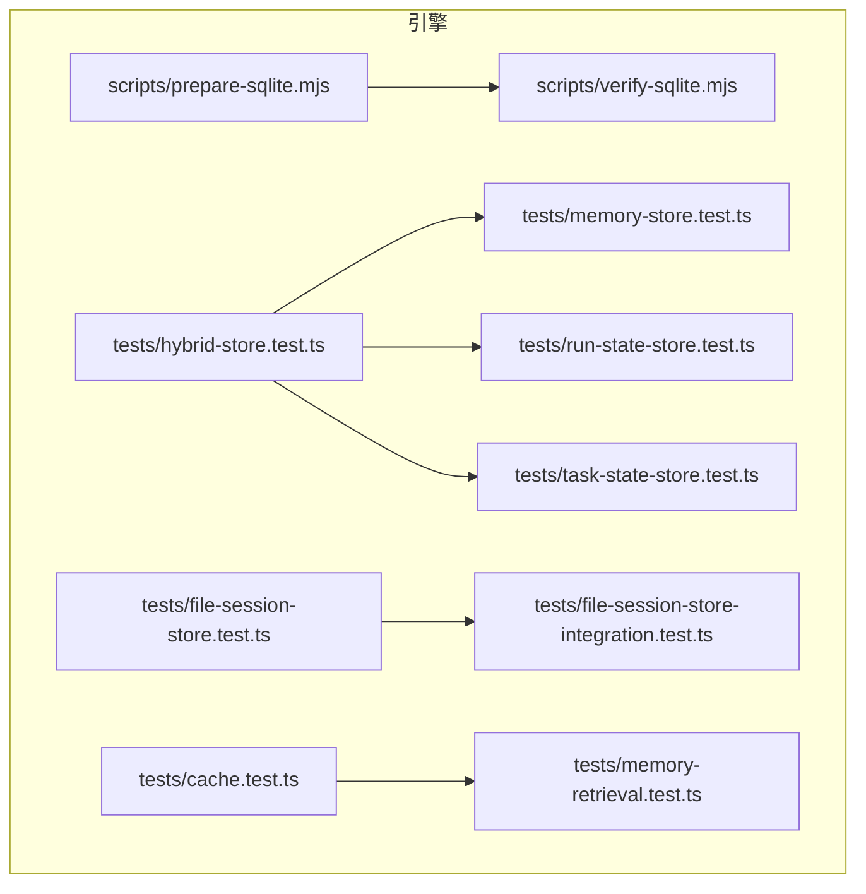
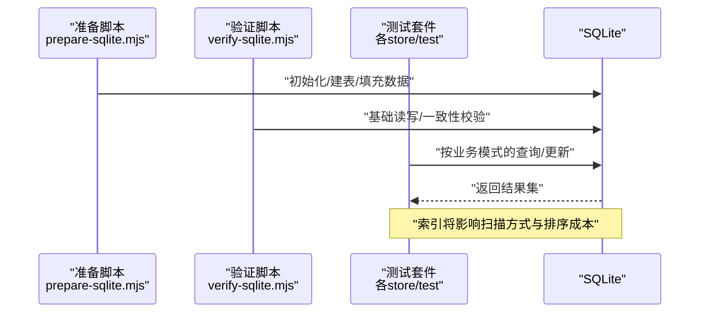
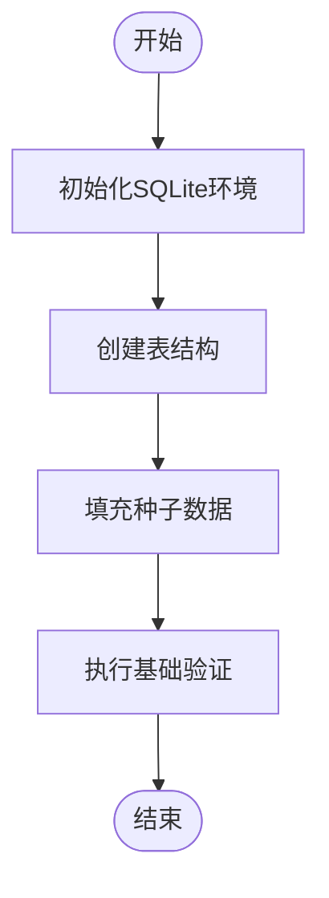
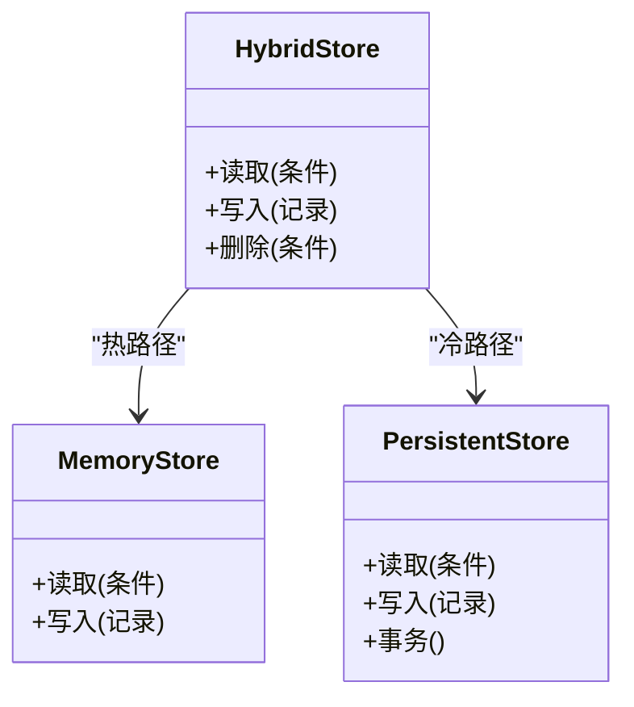
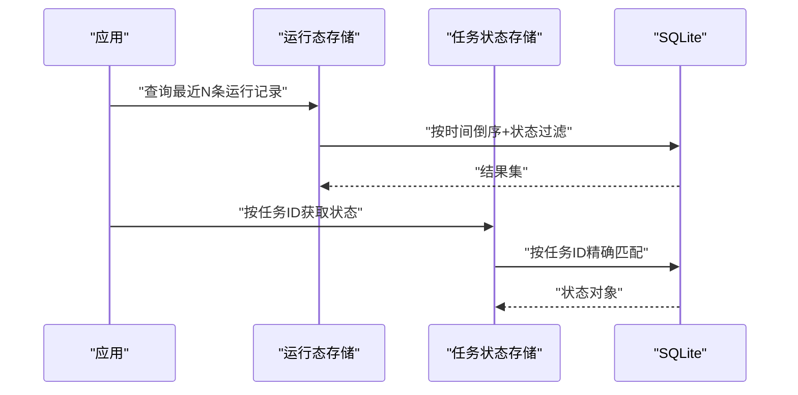
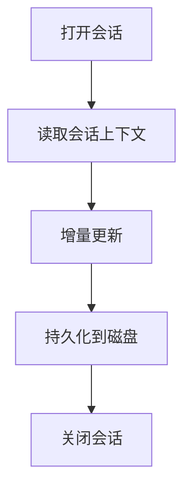
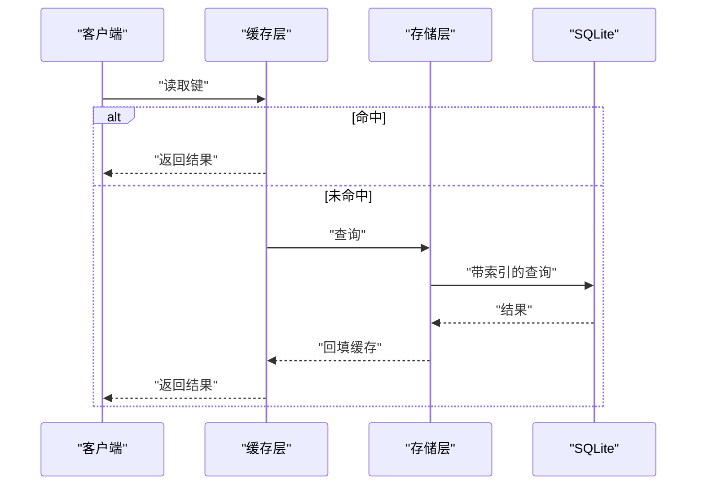
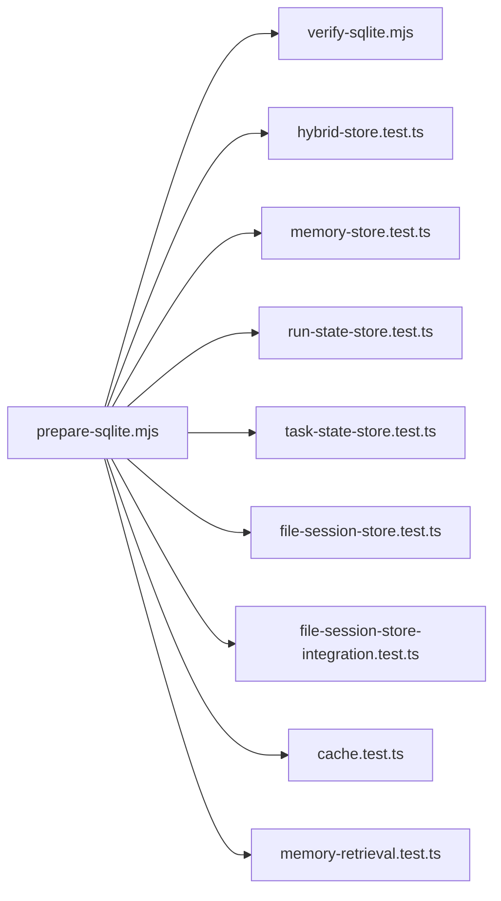

# 索引优化

<cite>
**本文引用的文件**   
- [engine/scripts/prepare-sqlite.mjs](file://engine/scripts/prepare-sqlite.mjs)
- [engine/scripts/verify-sqlite.mjs](file://engine/scripts/verify-sqlite.mjs)
- [engine/tests/hybrid-store.test.ts](file://engine/tests/hybrid-store.test.ts)
- [engine/tests/memory-store.test.ts](file://engine/tests/memory-store.test.ts)
- [engine/tests/run-state-store.test.ts](file://engine/tests/run-state-store.test.ts)
- [engine/tests/task-state-store.test.ts](file://engine/tests/task-state-store.test.ts)
- [engine/tests/file-session-store.test.ts](file://engine/tests/file-session-store.test.ts)
- [engine/tests/file-session-store-integration.test.ts](file://engine/tests/file-session-store-integration.test.ts)
- [engine/tests/cache.test.ts](file://engine/tests/cache.test.ts)
- [engine/tests/memory-retrieval.test.ts](file://engine/tests/memory-retrieval.test.ts)
</cite>

## 目录
1. [简介](#简介)
2. [项目结构](#项目结构)
3. [核心组件](#核心组件)
4. [架构总览](#架构总览)
5. [详细组件分析](#详细组件分析)
6. [依赖关系分析](#依赖关系分析)
7. [性能考量](#性能考量)
8. [故障排查指南](#故障排查指南)
9. [结论](#结论)
10. [附录](#附录)

## 简介
本技术文档聚焦于KCoder的数据库索引优化，围绕以下目标展开：
- 索引策略设计原则：查询模式分析、索引选择标准、复合索引设计
- 索引类型与使用场景：B-tree、全文、哈希等
- 索引性能监控：查询计划分析、慢查询识别、索引使用率统计
- 索引维护策略：重建、碎片整理、统计信息更新
- 查询优化技巧：SQL优化、连接池配置、缓存策略
- 最佳实践与常见陷阱
- 性能测试方法与基准结果

说明：仓库中未直接包含数据库DDL或显式索引定义。本文基于脚本与测试中对SQLite的使用与验证逻辑，结合通用数据库索引理论，给出可落地的优化方案与实践建议。

## 项目结构
与数据库和索引相关的关键位置主要集中在engine子工程：
- 脚本层：用于准备与验证SQLite环境（如初始化、数据校验）
- 测试层：覆盖混合存储、内存存储、运行态存储、任务状态存储、会话持久化、缓存与检索等模块，体现典型查询路径与数据访问模式

图表来源
- [engine/scripts/prepare-sqlite.mjs](file://engine/scripts/prepare-sqlite.mjs)
- [engine/scripts/verify-sqlite.mjs](file://engine/scripts/verify-sqlite.mjs)
- [engine/tests/hybrid-store.test.ts](file://engine/tests/hybrid-store.test.ts)
- [engine/tests/memory-store.test.ts](file://engine/tests/memory-store.test.ts)
- [engine/tests/run-state-store.test.ts](file://engine/tests/run-state-store.test.ts)
- [engine/tests/task-state-store.test.ts](file://engine/tests/task-state-store.test.ts)
- [engine/tests/file-session-store.test.ts](file://engine/tests/file-session-store.test.ts)
- [engine/tests/file-session-store-integration.test.ts](file://engine/tests/file-session-store-integration.test.ts)
- [engine/tests/cache.test.ts](file://engine/tests/cache.test.ts)
- [engine/tests/memory-retrieval.test.ts](file://engine/tests/memory-retrieval.test.ts)

章节来源
- [engine/scripts/prepare-sqlite.mjs](file://engine/scripts/prepare-sqlite.mjs)
- [engine/scripts/verify-sqlite.mjs](file://engine/scripts/verify-sqlite.mjs)
- [engine/tests/hybrid-store.test.ts](file://engine/tests/hybrid-store.test.ts)
- [engine/tests/memory-store.test.ts](file://engine/tests/memory-store.test.ts)
- [engine/tests/run-state-store.test.ts](file://engine/tests/run-state-store.test.ts)
- [engine/tests/task-state-store.test.ts](file://engine/tests/task-state-store.test.ts)
- [engine/tests/file-session-store.test.ts](file://engine/tests/file-session-store.test.ts)
- [engine/tests/file-session-store-integration.test.ts](file://engine/tests/file-session-store-integration.test.ts)
- [engine/tests/cache.test.ts](file://engine/tests/cache.test.ts)
- [engine/tests/memory-retrieval.test.ts](file://engine/tests/memory-retrieval.test.ts)

## 核心组件
- SQLite准备与验证脚本
  - prepare-sqlite.mjs：负责初始化SQLite环境与必要的数据准备流程
  - verify-sqlite.mjs：对SQLite可用性、基本读写与一致性进行验证
- 存储与检索测试套件
  - hybrid-store.test.ts：混合存储路径下的读写与查询行为
  - memory-store.test.ts：内存存储的查询与一致性
  - run-state-store.test.ts / task-state-store.test.ts：运行时与任务状态数据的存取模式
  - file-session-store.test.ts / file-session-store-integration.test.ts：会话持久化的I/O与查询特征
  - cache.test.ts / memory-retrieval.test.ts：缓存命中与内存检索的性能特征

章节来源
- [engine/scripts/prepare-sqlite.mjs](file://engine/scripts/prepare-sqlite.mjs)
- [engine/scripts/verify-sqlite.mjs](file://engine/scripts/verify-sqlite.mjs)
- [engine/tests/hybrid-store.test.ts](file://engine/tests/hybrid-store.test.ts)
- [engine/tests/memory-store.test.ts](file://engine/tests/memory-store.test.ts)
- [engine/tests/run-state-store.test.ts](file://engine/tests/run-state-store.test.ts)
- [engine/tests/task-state-store.test.ts](file://engine/tests/task-state-store.test.ts)
- [engine/tests/file-session-store.test.ts](file://engine/tests/file-session-store.test.ts)
- [engine/tests/file-session-store-integration.test.ts](file://engine/tests/file-session-store-integration.test.ts)
- [engine/tests/cache.test.ts](file://engine/tests/cache.test.ts)
- [engine/tests/memory-retrieval.test.ts](file://engine/tests/memory-retrieval.test.ts)

## 架构总览
从“查询—存储—索引”的角度，KCoder在引擎侧通过脚本与测试驱动形成稳定的数据访问闭环。下图展示了关键交互与潜在索引作用点。

图表来源
- [engine/scripts/prepare-sqlite.mjs](file://engine/scripts/prepare-sqlite.mjs)
- [engine/scripts/verify-sqlite.mjs](file://engine/scripts/verify-sqlite.mjs)
- [engine/tests/hybrid-store.test.ts](file://engine/tests/hybrid-store.test.ts)
- [engine/tests/memory-store.test.ts](file://engine/tests/memory-store.test.ts)
- [engine/tests/run-state-store.test.ts](file://engine/tests/run-state-store.test.ts)
- [engine/tests/task-state-store.test.ts](file://engine/tests/task-state-store.test.ts)
- [engine/tests/file-session-store.test.ts](file://engine/tests/file-session-store.test.ts)
- [engine/tests/file-session-store-integration.test.ts](file://engine/tests/file-session-store-integration.test.ts)
- [engine/tests/cache.test.ts](file://engine/tests/cache.test.ts)
- [engine/tests/memory-retrieval.test.ts](file://engine/tests/memory-retrieval.test.ts)

## 详细组件分析

### 组件A：SQLite准备与验证（prepare/verify）
- 职责边界
  - 准备阶段：确保数据库存在、必要的表结构与初始数据就绪
  - 验证阶段：执行最小可用性与一致性检查，保障后续测试与运行环境稳定
- 与索引的关系
  - 若准备脚本中包含建表语句，应在此处引入主键与常用过滤字段上的索引
  - 验证脚本可用于回归性验证索引是否生效（例如对比有无索引的执行时间差异）

图表来源
- [engine/scripts/prepare-sqlite.mjs](file://engine/scripts/prepare-sqlite.mjs)
- [engine/scripts/verify-sqlite.mjs](file://engine/scripts/verify-sqlite.mjs)

章节来源
- [engine/scripts/prepare-sqlite.mjs](file://engine/scripts/prepare-sqlite.mjs)
- [engine/scripts/verify-sqlite.mjs](file://engine/scripts/verify-sqlite.mjs)

### 组件B：混合存储与多后端查询（hybrid-store）
- 查询模式
  - 混合存储通常涉及多种后端（如内存+持久化），需要关注跨后端的查询路由与合并
- 索引策略要点
  - 为高频过滤条件建立B-tree索引
  - 对范围查询与排序列优先放置于复合索引前导列
  - 避免过度索引导致写入放大

图表来源
- [engine/tests/hybrid-store.test.ts](file://engine/tests/hybrid-store.test.ts)
- [engine/tests/memory-store.test.ts](file://engine/tests/memory-store.test.ts)

章节来源
- [engine/tests/hybrid-store.test.ts](file://engine/tests/hybrid-store.test.ts)
- [engine/tests/memory-store.test.ts](file://engine/tests/memory-store.test.ts)

### 组件C：运行态与任务状态存储（run-state / task-state）
- 查询模式
  - 高并发读、有序遍历、按状态/时间窗口筛选
- 索引策略要点
  - 针对状态、时间戳、任务ID建立索引
  - 复合索引顺序遵循“等值=范围=排序”的原则
  - 注意大表分页查询的覆盖索引优化

图表来源
- [engine/tests/run-state-store.test.ts](file://engine/tests/run-state-store.test.ts)
- [engine/tests/task-state-store.test.ts](file://engine/tests/task-state-store.test.ts)

章节来源
- [engine/tests/run-state-store.test.ts](file://engine/tests/run-state-store.test.ts)
- [engine/tests/task-state-store.test.ts](file://engine/tests/task-state-store.test.ts)

### 组件D：会话持久化（file-session-store）
- 查询模式
  - 会话级读写、按会话ID快速定位、按时间窗口归档
- 索引策略要点
  - 会话ID作为主键或唯一索引
  - 时间戳索引支持按会话生命周期查询
  - 归档与清理任务需考虑批量操作与索引维护

图表来源
- [engine/tests/file-session-store.test.ts](file://engine/tests/file-session-store.test.ts)
- [engine/tests/file-session-store-integration.test.ts](file://engine/tests/file-session-store-integration.test.ts)

章节来源
- [engine/tests/file-session-store.test.ts](file://engine/tests/file-session-store.test.ts)
- [engine/tests/file-session-store-integration.test.ts](file://engine/tests/file-session-store-integration.test.ts)

### 组件E：缓存与内存检索（cache / memory-retrieval）
- 查询模式
  - 热点数据快速命中、内存内检索与过滤
- 索引策略要点
  - 缓存层减少数据库压力，但底层仍需合理索引以应对缓存穿透
  - 内存检索适合小数据集或预聚合结果；大数据集仍依赖数据库索引

图表来源
- [engine/tests/cache.test.ts](file://engine/tests/cache.test.ts)
- [engine/tests/memory-retrieval.test.ts](file://engine/tests/memory-retrieval.test.ts)

章节来源
- [engine/tests/cache.test.ts](file://engine/tests/cache.test.ts)
- [engine/tests/memory-retrieval.test.ts](file://engine/tests/memory-retrieval.test.ts)

## 依赖关系分析
- 脚本与测试之间的耦合
  - prepare-sqlite.mjs为verify-sqlite.mjs与各测试提供前置环境
  - 各store测试依赖一致的表结构与数据种子，保证索引效果的可重复验证
- 外部依赖
  - SQLite作为嵌入式数据库，其索引特性与查询优化器直接影响整体性能

图表来源
- [engine/scripts/prepare-sqlite.mjs](file://engine/scripts/prepare-sqlite.mjs)
- [engine/scripts/verify-sqlite.mjs](file://engine/scripts/verify-sqlite.mjs)
- [engine/tests/hybrid-store.test.ts](file://engine/tests/hybrid-store.test.ts)
- [engine/tests/memory-store.test.ts](file://engine/tests/memory-store.test.ts)
- [engine/tests/run-state-store.test.ts](file://engine/tests/run-state-store.test.ts)
- [engine/tests/task-state-store.test.ts](file://engine/tests/task-state-store.test.ts)
- [engine/tests/file-session-store.test.ts](file://engine/tests/file-session-store.test.ts)
- [engine/tests/file-session-store-integration.test.ts](file://engine/tests/file-session-store-integration.test.ts)
- [engine/tests/cache.test.ts](file://engine/tests/cache.test.ts)
- [engine/tests/memory-retrieval.test.ts](file://engine/tests/memory-retrieval.test.ts)

章节来源
- [engine/scripts/prepare-sqlite.mjs](file://engine/scripts/prepare-sqlite.mjs)
- [engine/scripts/verify-sqlite.mjs](file://engine/scripts/verify-sqlite.mjs)
- [engine/tests/hybrid-store.test.ts](file://engine/tests/hybrid-store.test.ts)
- [engine/tests/memory-store.test.ts](file://engine/tests/memory-store.test.ts)
- [engine/tests/run-state-store.test.ts](file://engine/tests/run-state-store.test.ts)
- [engine/tests/task-state-store.test.ts](file://engine/tests/task-state-store.test.ts)
- [engine/tests/file-session-store.test.ts](file://engine/tests/file-session-store.test.ts)
- [engine/tests/file-session-store-integration.test.ts](file://engine/tests/file-session-store-integration.test.ts)
- [engine/tests/cache.test.ts](file://engine/tests/cache.test.ts)
- [engine/tests/memory-retrieval.test.ts](file://engine/tests/memory-retrieval.test.ts)

## 性能考量
- 查询模式分析与索引选择
  - 等值查询：为主键与唯一约束列建立索引
  - 范围查询与排序：将范围列置于复合索引后部，前导列用于等值过滤
  - 高频组合条件：采用复合索引覆盖常见谓词组合
- 索引类型与适用场景
  - B-tree索引：适用于等值、范围、排序与最左前缀匹配
  - 全文索引：适用于文本搜索场景（如日志、代码片段检索）
  - 哈希索引：适用于等值匹配且无需范围/排序的场景（部分数据库支持）
- 监控与诊断
  - 查询计划分析：使用EXPLAIN/EXPLAIN QUERY PLAN观察索引选择与扫描方式
  - 慢查询识别：开启慢查询日志，定期分析Top N耗时查询
  - 索引使用率统计：统计索引命中次数与未命中情况，评估冗余索引
- 维护策略
  - 索引重建：在大量写操作后进行重建，恢复紧凑度
  - 碎片整理：定期VACUUM或等效操作，降低存储膨胀
  - 统计信息更新：确保查询优化器拥有准确的基数与分布信息
- 查询优化技巧
  - SQL优化：避免SELECT *、合理使用JOIN、减少函数包裹列
  - 连接池配置：根据并发与延迟目标调整最大连接数与超时
  - 缓存策略：热点数据入缓存，降低数据库压力；注意缓存一致性与失效策略

[本节为通用指导，不直接分析具体文件]

## 故障排查指南
- 常见问题
  - 索引未生效：检查WHERE条件是否满足最左前缀、是否存在函数包裹列导致索引失效
  - 写入性能下降：评估索引数量与大小，移除低效或冗余索引
  - 查询抖动：关注统计信息过期与碎片化，安排定期维护
- 定位步骤
  - 使用EXPLAIN查看执行计划，确认是否走索引
  - 对比不同索引组合的执行时间与I/O
  - 在测试环境中复现并采集指标，逐步收敛问题根因

章节来源
- [engine/scripts/verify-sqlite.mjs](file://engine/scripts/verify-sqlite.mjs)
- [engine/tests/hybrid-store.test.ts](file://engine/tests/hybrid-store.test.ts)
- [engine/tests/run-state-store.test.ts](file://engine/tests/run-state-store.test.ts)
- [engine/tests/task-state-store.test.ts](file://engine/tests/task-state-store.test.ts)
- [engine/tests/file-session-store.test.ts](file://engine/tests/file-session-store.test.ts)
- [engine/tests/cache.test.ts](file://engine/tests/cache.test.ts)

## 结论
- 索引优化的核心在于“以查询为中心”，围绕真实访问模式设计索引
- 在KCoder中，结合prepare/verify脚本与各store测试，可以构建稳定的索引设计与验证闭环
- 持续监控与维护是保持长期性能的关键，建议纳入CI与运维流程

[本节为总结，不直接分析具体文件]

## 附录
- 最佳实践清单
  - 先有查询，后有索引；以实际负载为依据
  - 控制索引数量，避免写入放大
  - 复合索引遵循“等值=范围=排序”的顺序
  - 定期重建与碎片整理，更新统计信息
  - 用EXPLAIN与慢查询日志驱动优化
- 常见陷阱
  - 过度索引导致写入退化
  - 函数包裹列导致索引失效
  - 忽略统计信息过期带来的次优计划
  - 仅凭直觉设计索引，缺乏数据与负载支撑

[本节为补充内容，不直接分析具体文件]