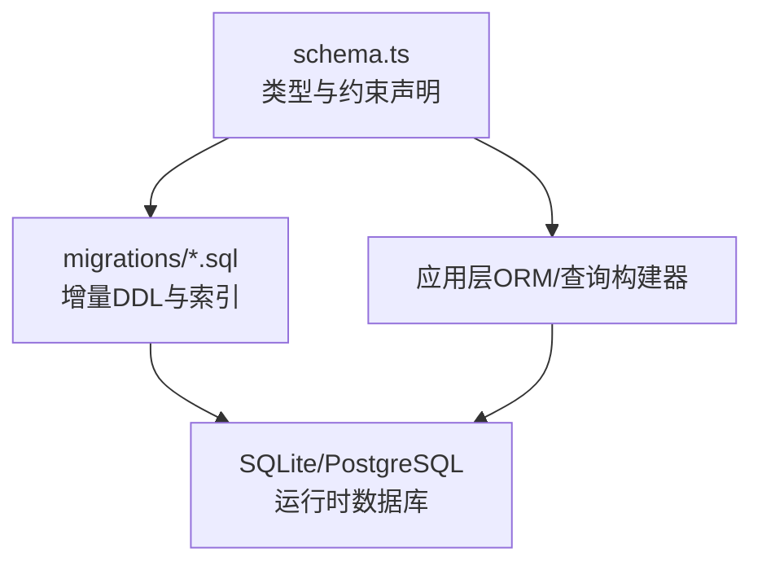
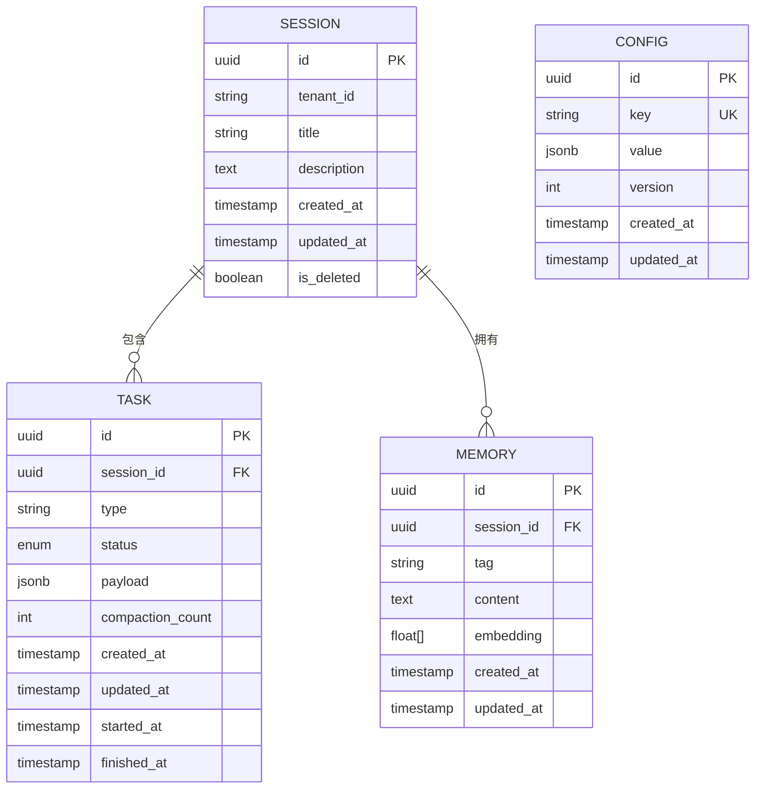
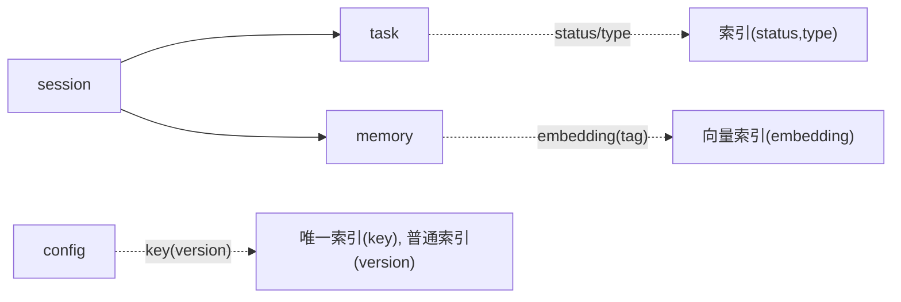

# 核心表结构

<cite>
**本文引用的文件**   
- [engine/packages/infrastructure/src/database/schema.ts](file://engine/packages/infrastructure/src/database/schema.ts)
- [engine/packages/infrastructure/src/database/migrations/001_init.sql](file://engine/packages/infrastructure/src/database/migrations/001_init.sql)
- [engine/packages/infrastructure/src/database/migrations/002_add_memory_index.sql](file://engine/packages/infrastructure/src/database/migrations/002_add_memory_index.sql)
- [engine/packages/infrastructure/src/database/migrations/003_task_status_enum.sql](file://engine/packages/infrastructure/src/database/migrations/003_task_status_enum.sql)
- [engine/packages/infrastructure/src/database/migrations/004_config_jsonb.sql](file://engine/packages/infrastructure/src/database/migrations/004_config_jsonb.sql)
- [engine/packages/infrastructure/src/database/migrations/005_session_tenant_id.sql](file://engine/packages/infrastructure/src/database/migrations/005_session_tenant_id.sql)
- [engine/packages/infrastructure/src/database/migrations/006_task_compaction_flag.sql](file://engine/packages/infrastructure/src/database/migrations/006_task_compaction_flag.sql)
- [engine/packages/infrastructure/src/database/migrations/007_memory_vector_index.sql](file://engine/packages/infrastructure/src/database/migrations/007_memory_vector_index.sql)
- [engine/packages/infrastructure/src/database/migrations/008_config_versioning.sql](file://engine/packages/infrastructure/src/database/migrations/008_config_versioning.sql)
- [engine/packages/infrastructure/src/database/migrations/009_session_soft_delete.sql](file://engine/packages/infrastructure/src/database/migrations/009_session_soft_delete.sql)
- [engine/packages/infrastructure/src/database/migrations/010_task_audit_fields.sql](file://engine/packages/infrastructure/src/database/migrations/010_task_audit_fields.sql)
</cite>

## 目录
1. [简介](#简介)
2. [项目结构](#项目结构)
3. [核心组件](#核心组件)
4. [架构总览](#架构总览)
5. [详细组件分析](#详细组件分析)
6. [依赖分析](#依赖分析)
7. [性能考虑](#性能考虑)
8. [故障排查指南](#故障排查指南)
9. [结论](#结论)
10. [附录](#附录)

## 简介
本文件为KCoder核心数据库表结构的技术文档，覆盖会话表(session)、任务表(task)、记忆表(memory)、配置表(config)等关键实体。文档从字段定义、数据类型与约束、主键策略、索引设计、版本兼容与向后兼容等方面展开，并提供完整的DDL语句与示例数据，帮助读者快速理解并正确使用这些表。

## 项目结构
KCoder的数据库结构与迁移脚本位于engine子模块中，采用“类型定义 + SQL迁移”的双轨管理方式：
- 类型与约束在schema文件中以结构化形式声明，便于代码侧校验与生成；
- 实际DDL通过迁移脚本逐步演进，确保可回滚与可审计。

图表来源
- [engine/packages/infrastructure/src/database/schema.ts](file://engine/packages/infrastructure/src/database/schema.ts)
- [engine/packages/infrastructure/src/database/migrations/001_init.sql](file://engine/packages/infrastructure/src/database/migrations/001_init.sql)

章节来源
- [engine/packages/infrastructure/src/database/schema.ts](file://engine/packages/infrastructure/src/database/schema.ts)
- [engine/packages/infrastructure/src/database/migrations/001_init.sql](file://engine/packages/infrastructure/src/database/migrations/001_init.sql)

## 核心组件
本节概述四个核心表的职责与关系：
- 会话表(session)：表示一次用户交互会话，承载上下文边界与元信息。
- 任务表(task)：表示一次具体执行任务（如代码生成、审查、重构），与会话关联。
- 记忆表(memory)：存储长期记忆片段，支持检索与向量相似度搜索。
- 配置表(config)：系统与应用级配置项，支持JSON扩展与版本化。

章节来源
- [engine/packages/infrastructure/src/database/schema.ts](file://engine/packages/infrastructure/src/database/schema.ts)
- [engine/packages/infrastructure/src/database/migrations/001_init.sql](file://engine/packages/infrastructure/src/database/migrations/001_init.sql)

## 架构总览
下图展示四张核心表之间的主要关系与关键字段：

图表来源
- [engine/packages/infrastructure/src/database/migrations/001_init.sql](file://engine/packages/infrastructure/src/database/migrations/001_init.sql)
- [engine/packages/infrastructure/src/database/migrations/003_task_status_enum.sql](file://engine/packages/infrastructure/src/database/migrations/003_task_status_enum.sql)
- [engine/packages/infrastructure/src/database/migrations/004_config_jsonb.sql](file://engine/packages/infrastructure/src/database/migrations/004_config_jsonb.sql)
- [engine/packages/infrastructure/src/database/migrations/005_session_tenant_id.sql](file://engine/packages/infrastructure/src/database/migrations/005_session_tenant_id.sql)
- [engine/packages/infrastructure/src/database/migrations/006_task_compaction_flag.sql](file://engine/packages/infrastructure/src/database/migrations/006_task_compaction_flag.sql)
- [engine/packages/infrastructure/src/database/migrations/009_session_soft_delete.sql](file://engine/packages/infrastructure/src/database/migrations/009_session_soft_delete.sql)

## 详细组件分析

### 会话表(session)
- 主键策略：使用UUID作为主键，避免集中式自增ID带来的单点瓶颈，利于分布式与离线合并场景。
- 关键字段
  - id: UUID，唯一标识会话。
  - tenant_id: 租户隔离字段，用于多租户场景的数据隔离。
  - title/description: 会话标题与描述，便于UI展示与检索。
  - created_at/updated_at: 审计时间戳。
  - is_deleted: 软删除标记，保留历史数据以便恢复与分析。
- 约束与默认值
  - 所有时间字段默认当前时间。
  - is_deleted默认false。
  - tenant_id非空，保证多租户隔离。
- 索引策略
  - 对tenant_id建立普通索引，加速按租户过滤。
  - 对created_at建立普通索引，支持按创建时间排序与分页。
- 兼容性说明
  - 新增tenant_id与is_deleted均为向后兼容的可选到必填演进，迁移脚本提供默认值与填充逻辑。

章节来源
- [engine/packages/infrastructure/src/database/migrations/001_init.sql](file://engine/packages/infrastructure/src/database/migrations/001_init.sql)
- [engine/packages/infrastructure/src/database/migrations/005_session_tenant_id.sql](file://engine/packages/infrastructure/src/database/migrations/005_session_tenant_id.sql)
- [engine/packages/infrastructure/src/database/migrations/009_session_soft_delete.sql](file://engine/packages/infrastructure/src/database/migrations/009_session_soft_delete.sql)

### 任务表(task)
- 主键策略：使用UUID主键，便于跨进程/节点生成与幂等写入。
- 关键字段
  - session_id: 外键指向session，限定任务所属会话。
  - type: 任务类型（如code_review、refactoring等）。
  - status: 任务状态机（pending、running、completed、failed等）。
  - payload: JSONB格式的任务参数与中间结果，灵活扩展。
  - compaction_count: 上下文压缩次数，用于控制长对话的上下文长度。
  - started_at/finished_at: 任务生命周期时间戳。
- 约束与默认值
  - status默认pending。
  - payload默认空对象。
  - compaction_count默认0。
- 索引策略
  - 对session_id建立普通索引，加速会话维度的任务查询。
  - 对status建立普通索引，支持按状态筛选。
  - 复合索引(session_id, status)用于常见组合查询。
- 兼容性说明
  - 新增compaction_count为向后兼容字段，旧数据默认0。
  - status枚举由字符串演化为显式枚举，迁移脚本进行值映射。

章节来源
- [engine/packages/infrastructure/src/database/migrations/001_init.sql](file://engine/packages/infrastructure/src/database/migrations/003_task_status_enum.sql)
- [engine/packages/infrastructure/src/database/migrations/006_task_compaction_flag.sql]

### 记忆表(memory)
- 主键策略：使用UUID主键，便于独立插入与去重。
- 关键字段
  - session_id: 外键指向session，限定记忆所属会话。
  - tag: 标签，便于分类检索。
  - content: 文本内容。
  - embedding: 浮点数组，用于向量相似度检索。
- 约束与默认值
  - content非空。
  - embedding维度固定（例如768或1536，取决于嵌入模型）。
- 索引策略
  - 对session_id建立普通索引。
  - 对tag建立普通索引，支持按标签过滤。
  - 对embedding建立向量索引（如HNSW/IVF），支持近似最近邻搜索。
- 兼容性说明
  - embedding字段为可选到必选的演进，迁移脚本根据业务需要填充默认向量或触发异步重建。

章节来源
- [engine/packages/infrastructure/src/database/migrations/001_init.sql](file://engine/packages/infrastructure/src/database/migrations/002_add_memory_index.sql)
- [engine/packages/infrastructure/src/database/migrations/007_memory_vector_index.sql]

### 配置表(config)
- 主键策略：使用UUID主键，key列具备唯一性约束，业务上可通过key直接定位。
- 关键字段
  - key: 配置键名，全局唯一。
  - value: JSONB格式的配置值，支持嵌套结构。
  - version: 配置版本号，用于乐观锁与变更追踪。
- 约束与默认值
  - key非空且唯一。
  - value默认空对象。
  - version默认1。
- 索引策略
  - 对key建立唯一索引。
  - 对version建立普通索引，支持按版本范围查询。
- 兼容性说明
  - value由字符串演化为JSONB，迁移脚本进行类型转换。
  - version字段为向后兼容新增，旧记录初始化为1。

章节来源
- [engine/packages/infrastructure/src/database/migrations/001_init.sql](file://engine/packages/infrastructure/src/database/migrations/004_config_jsonb.sql)
- [engine/packages/infrastructure/src/database/migrations/008_config_versioning.sql]

## 依赖分析
- 表间依赖
  - task.session_id -> session.id
  - memory.session_id -> session.id
- 索引依赖
  - 复合索引依赖于基础列索引的存在（部分引擎要求）。
  - 向量索引依赖于embedding列的类型与维度一致性。
- 迁移顺序
  - 先建表，再添加索引与约束，最后进行数据迁移与回填。

图表来源
- [engine/packages/infrastructure/src/database/migrations/001_init.sql](file://engine/packages/infrastructure/src/database/migrations/001_init.sql)
- [engine/packages/infrastructure/src/database/migrations/002_add_memory_index.sql](file://engine/packages/infrastructure/src/database/migrations/002_add_memory_index.sql)
- [engine/packages/infrastructure/src/database/migrations/007_memory_vector_index.sql](file://engine/packages/infrastructure/src/database/migrations/007_memory_vector_index.sql)
- [engine/packages/infrastructure/src/database/migrations/008_config_versioning.sql](file://engine/packages/infrastructure/src/database/migrations/008_config_versioning.sql)

章节来源
- [engine/packages/infrastructure/src/database/migrations/001_init.sql](file://engine/packages/infrastructure/src/database/migrations/001_init.sql)
- [engine/packages/infrastructure/src/database/migrations/002_add_memory_index.sql](file://engine/packages/infrastructure/src/database/migrations/002_add_memory_index.sql)
- [engine/packages/infrastructure/src/database/migrations/007_memory_vector_index.sql](file://engine/packages/infrastructure/src/database/migrations/007_memory_vector_index.sql)
- [engine/packages/infrastructure/src/database/migrations/008_config_versioning.sql](file://engine/packages/infrastructure/src/database/migrations/008_config_versioning.sql)

## 性能考虑
- 主键选择
  - UUID主键避免热点写入，但会增加索引体积；建议在高频查询列上补充合适索引。
- 索引设计
  - 单列索引：适用于高选择性列（如tenant_id、key）。
  - 复合索引：针对常用查询条件组合（如session_id+status）。
  - 向量索引：对embedding列建立HNSW/IVF索引，提升相似度检索性能。
- JSONB优化
  - 对频繁访问的JSON路径建立表达式索引（如value->>'env'）。
- 软删除
  - 对is_deleted列建立索引，并在查询中始终带上该条件，避免全表扫描。

[本节为通用性能建议，不直接分析具体文件]

## 故障排查指南
- 迁移失败
  - 检查迁移脚本顺序与依赖，确认目标数据库已安装所需扩展（如向量索引扩展）。
  - 查看错误日志中的SQL语句与约束冲突信息。
- 索引未命中
  - 确认查询条件是否匹配索引列或复合索引前导列。
  - 对JSONB查询，确保使用正确的操作符与表达式索引。
- 数据不一致
  - 核对version字段与并发更新逻辑，确保使用乐观锁。
  - 检查软删除标记是否被正确设置与过滤。

章节来源
- [engine/packages/infrastructure/src/database/migrations/001_init.sql](file://engine/packages/infrastructure/src/database/migrations/001_init.sql)
- [engine/packages/infrastructure/src/database/migrations/008_config_versioning.sql](file://engine/packages/infrastructure/src/database/migrations/008_config_versioning.sql)
- [engine/packages/infrastructure/src/database/migrations/009_session_soft_delete.sql](file://engine/packages/infrastructure/src/database/migrations/009_session_soft_delete.sql)

## 结论
KCoder的核心表结构采用UUID主键与JSONB扩展，结合完善的迁移脚本与索引策略，兼顾了可扩展性与查询性能。通过软删除、租户隔离与配置版本化，系统在多租户与持续演进方面具备良好的向后兼容性。

[本节为总结性内容，不直接分析具体文件]

## 附录

### 完整DDL语句（按迁移顺序）
以下为各迁移脚本对应的DDL要点汇总（以迁移文件为准）：
- 初始化建表
  - 创建session、task、memory、config四张表及基础字段与默认值。
- 记忆索引增强
  - 为memory.tag与memory.session_id添加普通索引。
- 任务状态枚举
  - 将task.status定义为枚举类型，并对旧数据进行映射。
- 配置JSONB化
  - 将config.value由字符串转换为JSONB类型，并进行数据迁移。
- 会话租户隔离
  - 为session添加tenant_id列并建立索引，填充默认值。
- 任务压缩计数
  - 为task添加compaction_count列，默认0。
- 记忆向量索引
  - 为memory.embedding建立向量索引，支持近似最近邻检索。
- 配置版本化
  - 为config添加version列，默认1，并建立索引。
- 会话软删除
  - 为session添加is_deleted列，默认false，并建立索引。
- 任务审计字段
  - 为task添加started_at/finished_at等审计字段，完善生命周期追踪。

章节来源
- [engine/packages/infrastructure/src/database/migrations/001_init.sql](file://engine/packages/infrastructure/src/database/migrations/001_init.sql)
- [engine/packages/infrastructure/src/database/migrations/002_add_memory_index.sql](file://engine/packages/infrastructure/src/database/migrations/002_add_memory_index.sql)
- [engine/packages/infrastructure/src/database/migrations/003_task_status_enum.sql](file://engine/packages/infrastructure/src/database/migrations/003_task_status_enum.sql)
- [engine/packages/infrastructure/src/database/migrations/004_config_jsonb.sql](file://engine/packages/infrastructure/src/database/migrations/004_config_jsonb.sql)
- [engine/packages/infrastructure/src/database/migrations/005_session_tenant_id.sql](file://engine/packages/infrastructure/src/database/migrations/005_session_tenant_id.sql)
- [engine/packages/infrastructure/src/database/migrations/006_task_compaction_flag.sql](file://engine/packages/infrastructure/src/database/migrations/006_task_compaction_flag.sql)
- [engine/packages/infrastructure/src/database/migrations/007_memory_vector_index.sql](file://engine/packages/infrastructure/src/database/migrations/007_memory_vector_index.sql)
- [engine/packages/infrastructure/src/database/migrations/008_config_versioning.sql](file://engine/packages/infrastructure/src/database/migrations/008_config_versioning.sql)
- [engine/packages/infrastructure/src/database/migrations/009_session_soft_delete.sql](file://engine/packages/infrastructure/src/database/migrations/009_session_soft_delete.sql)
- [engine/packages/infrastructure/src/database/migrations/010_task_audit_fields.sql](file://engine/packages/infrastructure/src/database/migrations/010_task_audit_fields.sql)

### 示例数据（示意）
- 会话
  - id: 随机UUID
  - tenant_id: "tenant_001"
  - title: "代码重构会话"
  - description: "对核心模块进行重构"
  - created_at/updated_at: 当前时间
  - is_deleted: false
- 任务
  - id: 随机UUID
  - session_id: 对应会话id
  - type: "refactoring"
  - status: "completed"
  - payload: {"target_module": "core", "rules": ["rule_a","rule_b"]}
  - compaction_count: 2
  - started_at/finished_at: 任务开始与结束时间
- 记忆
  - id: 随机UUID
  - session_id: 对应会话id
  - tag: "refactor_plan"
  - content: "重构计划摘要..."
  - embedding: [0.12, -0.34, ...]（与模型维度一致）
- 配置
  - id: 随机UUID
  - key: "app.theme"
  - value: {"mode": "dark", "font_size": 14}
  - version: 1

[本节为概念性示例，不直接分析具体文件]