# 状态管理表设计

<cite>
**本文引用的文件**   
- [run-state-store.test.ts](file://engine/tests/run-state-store.test.ts)
- [task-state-store.test.ts](file://engine/tests/task-state-store.test.ts)
- [turn-state-store.test.ts](file://engine/tests/turn-state-store.test.ts)
- [legacy-task-state-migration.test.ts](file://engine/tests/legacy-task-state-migration.test.ts)
- [task-state-builder.test.ts](file://engine/tests/task-state-builder.test.ts)
- [task-state-contracts.test.ts](file://engine/tests/task-state-contracts.test.ts)
- [task-progress-projector.test.ts](file://engine/tests/task-progress-projector.test.ts)
- [task-context-recovery.test.ts](file://engine/tests/task-context-recovery.test.ts)
- [durable-task-capsule.test.ts](file://engine/tests/durable-task-capsule.test.ts)
- [runtime-kernel-crash-recovery.test.ts](file://engine/tests/runtime-kernel-crash-recovery.test.ts)
- [compaction-transaction.test.ts](file://engine/tests/compaction-transaction.test.ts)
- [evented-loop.test.ts](file://engine/tests/evented-loop.test.ts)
- [kernel-v3-node-handlers.test.ts](file://engine/tests/kernel-v3-node-handlers.test.ts)
- [delegation-terminal-state.test.ts](file://engine/tests/delegation-terminal-state.test.ts)
</cite>

## 目录
1. [引言](#引言)
2. [项目结构](#项目结构)
3. [核心组件](#核心组件)
4. [架构总览](#架构总览)
5. [详细组件分析](#详细组件分析)
6. [依赖分析](#依赖分析)
7. [性能考虑](#性能考虑)
8. [故障排查指南](#故障排查指南)
9. [结论](#结论)
10. [附录](#附录)

## 引言
本技术文档聚焦于KCoder的状态管理相关表结构设计，围绕运行状态表(run_state)、任务状态表(task_state)、会话状态表(session_state)等核心实体展开。文档从系统架构、数据流、处理逻辑、并发控制、持久化与恢复机制、历史审计、以及性能优化与扩展性等方面进行全面阐述，并提供状态转换流程图与状态机图，帮助读者快速理解并落地实现。

## 项目结构
KCoder的引擎层采用多包分层架构，状态管理与持久化能力主要分布在domain-layer、infrastructure、ports-layer与engine等模块中。测试用例覆盖了状态存储、迁移、投影、崩溃恢复、事务压缩等关键路径，为理解状态表设计与行为提供了重要依据。

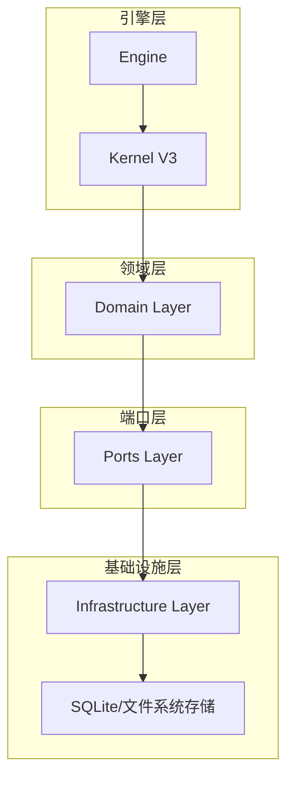

[此图为概念性结构示意，不直接映射具体源文件，故无图表来源]

## 核心组件
- 运行状态表(run_state)：记录一次完整执行生命周期（如一次对话或一次任务编排）的运行上下文、阶段、时间戳、版本与一致性信息。
- 任务状态表(task_state)：记录任务的当前状态、子任务关系、进度、错误码、重试次数、超时与截止时间等。
- 会话状态表(session_state)：记录会话维度的上下文、偏好、权限、配额、模型选择、工具集等。
- 轮次状态表(turn_state)：记录单次交互轮次的输入输出、中间结果、工具调用与结果聚合。
- 事件与投影：通过事件驱动与投影机制将状态变更持久化并生成可查询视图。

上述组件在测试中广泛覆盖，包括状态构建器、契约校验、进度投影、上下文恢复、崩溃恢复、迁移脚本与事务压缩等。

**章节来源**
- [run-state-store.test.ts:1-200](file://engine/tests/run-state-store.test.ts#L1-L200)
- [task-state-store.test.ts:1-200](file://engine/tests/task-state-store.test.ts#L1-L200)
- [turn-state-store.test.ts:1-200](file://engine/tests/turn-state-store.test.ts#L1-L200)
- [task-state-builder.test.ts:1-200](file://engine/tests/task-state-builder.test.ts#L1-L200)
- [task-state-contracts.test.ts:1-200](file://engine/tests/task-state-contracts.test.ts#L1-L200)
- [task-progress-projector.test.ts:1-200](file://engine/tests/task-progress-projector.test.ts#L1-L200)
- [task-context-recovery.test.ts:1-200](file://engine/tests/task-context-recovery.test.ts#L1-L200)
- [durable-task-capsule.test.ts:1-200](file://engine/tests/durable-task-capsule.test.ts#L1-L200)
- [runtime-kernel-crash-recovery.test.ts:1-200](file://engine/tests/runtime-kernel-crash-recovery.test.ts#L1-L200)
- [compaction-transaction.test.ts:1-200](file://engine/tests/compaction-transaction.test.ts#L1-L200)
- [evented-loop.test.ts:1-200](file://engine/tests/evented-loop.test.ts#L1-L200)
- [kernel-v3-node-handlers.test.ts:1-200](file://engine/tests/kernel-v3-node-handlers.test.ts#L1-L200)
- [delegation-terminal-state.test.ts:1-200](file://engine/tests/delegation-terminal-state.test.ts#L1-L200)

## 架构总览
状态管理的整体流程遵循“事件驱动+投影”的模式：业务操作产生领域事件，事件被持久化到事件日志；投影器消费事件并更新状态表；查询服务读取状态表提供一致视图。该模式支持高内聚低耦合、可扩展与易审计。

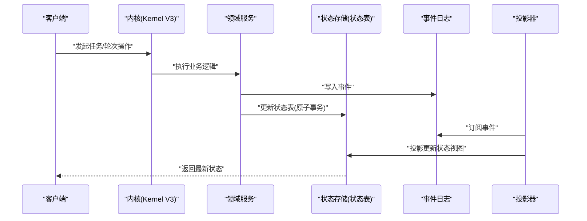

**图表来源**
- [runtime-kernel-crash-recovery.test.ts:1-200](file://engine/tests/runtime-kernel-crash-recovery.test.ts#L1-L200)
- [evented-loop.test.ts:1-200](file://engine/tests/evented-loop.test.ts#L1-L200)
- [task-progress-projector.test.ts:1-200](file://engine/tests/task-progress-projector.test.ts#L1-L200)

## 详细组件分析

### 运行状态表(run_state)
- 职责：维护一次运行的全局上下文与生命周期阶段，支撑崩溃恢复与重启后的状态重建。
- 关键字段建议：
  - run_id：运行唯一标识
  - status：运行状态码（如初始化、进行中、暂停、完成、失败）
  - version：乐观锁版本号
  - created_at/updated_at：创建与更新时间戳
  - metadata：扩展元数据（JSON）
- 状态转换规则：
  - 初始化→进行中：启动后进入
  - 进行中→暂停：外部干预或资源不足
  - 进行中→完成：所有子任务成功
  - 进行中→失败：出现不可恢复错误
  - 暂停→进行中：恢复执行
- 持久化策略：
  - 使用事务保证状态与事件的一致性
  - 结合事件日志进行重放恢复
- 并发控制：
  - 乐观锁：基于version字段比较更新
  - 悲观锁：对热点行加排他锁（必要时）
- 恢复机制：
  - 进程重启后根据run_id加载状态，若不一致则回滚至最近一致点并重放事件

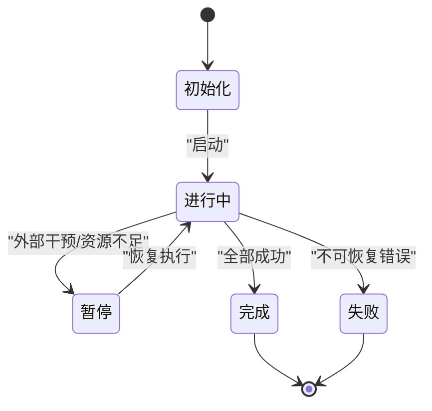

**图表来源**
- [run-state-store.test.ts:1-200](file://engine/tests/run-state-store.test.ts#L1-L200)
- [runtime-kernel-crash-recovery.test.ts:1-200](file://engine/tests/runtime-kernel-crash-recovery.test.ts#L1-L200)

**章节来源**
- [run-state-store.test.ts:1-200](file://engine/tests/run-state-store.test.ts#L1-L200)
- [runtime-kernel-crash-recovery.test.ts:1-200](file://engine/tests/runtime-kernel-crash-recovery.test.ts#L1-L200)

### 任务状态表(task_state)
- 职责：记录任务及其子任务的状态、进度、错误与重试信息，支撑任务编排与监控。
- 关键字段建议：
  - task_id：任务唯一标识
  - parent_task_id：父任务ID（树形结构）
  - status：任务状态码（待执行、执行中、成功、失败、取消、重试）
  - progress：进度百分比或计数
  - retry_count：重试次数
  - timeout_at：超时截止时间
  - error_code/error_message：错误码与描述
  - version：乐观锁版本号
  - created_at/updated_at：时间戳
- 状态转换规则：
  - 待执行→执行中：调度器分配执行
  - 执行中→成功：执行完成且校验通过
  - 执行中→失败：出现错误
  - 执行中→重试：触发重试策略
  - 执行中→取消：外部取消
- 持久化策略：
  - 批量更新与增量投影结合
  - 使用事务包裹状态与事件写入
- 并发控制：
  - 乐观锁避免写冲突
  - 针对热点任务可使用分片或队列隔离
- 恢复机制：
  - 根据任务ID与版本定位断点，重放事件恢复上下文

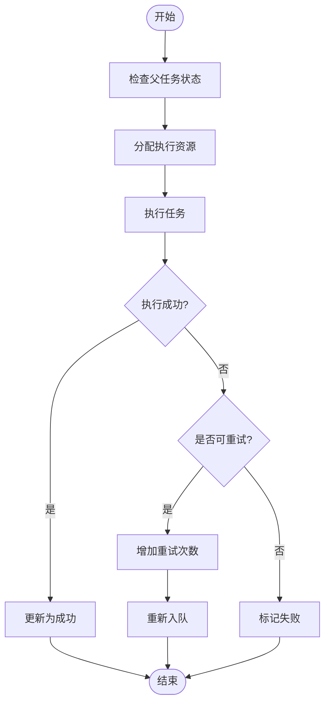

**图表来源**
- [task-state-store.test.ts:1-200](file://engine/tests/task-state-store.test.ts#L1-L200)
- [task-state-builder.test.ts:1-200](file://engine/tests/task-state-builder.test.ts#L1-L200)
- [task-state-contracts.test.ts:1-200](file://engine/tests/task-state-contracts.test.ts#L1-L200)
- [task-progress-projector.test.ts:1-200](file://engine/tests/task-progress-projector.test.ts#L1-L200)

**章节来源**
- [task-state-store.test.ts:1-200](file://engine/tests/task-state-store.test.ts#L1-L200)
- [task-state-builder.test.ts:1-200](file://engine/tests/task-state-builder.test.ts#L1-L200)
- [task-state-contracts.test.ts:1-200](file://engine/tests/task-state-contracts.test.ts#L1-L200)
- [task-progress-projector.test.ts:1-200](file://engine/tests/task-progress-projector.test.ts#L1-L200)

### 会话状态表(session_state)
- 职责：维护会话级上下文与配置，包括用户偏好、权限、配额、模型与工具集等。
- 关键字段建议：
  - session_id：会话唯一标识
  - user_id：用户标识
  - model_config：模型配置（JSON）
  - tool_set：可用工具集合（JSON）
  - quota：配额与用量统计（JSON）
  - version：乐观锁版本号
  - updated_at：更新时间戳
- 状态转换规则：
  - 新建→活跃：首次交互
  - 活跃→冻结：长时间未活动
  - 冻结→活跃：再次激活
- 持久化策略：
  - 小粒度更新，避免大对象频繁全量替换
  - 使用索引加速按user_id与session_id查询
- 并发控制：
  - 乐观锁为主，必要时对配额更新加悲观锁
- 恢复机制：
  - 会话重启时加载最近快照与增量事件

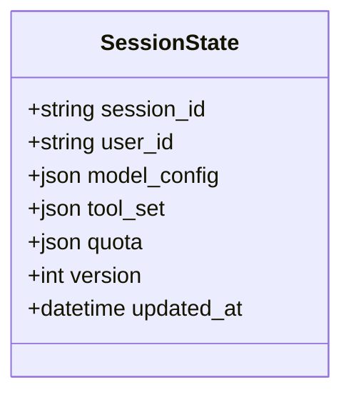

**图表来源**
- [task-context-recovery.test.ts:1-200](file://engine/tests/task-context-recovery.test.ts#L1-L200)

**章节来源**
- [task-context-recovery.test.ts:1-200](file://engine/tests/task-context-recovery.test.ts#L1-L200)

### 轮次状态表(turn_state)
- 职责：记录单次交互轮次的输入、输出、工具调用与结果聚合，用于审计与回放。
- 关键字段建议：
  - turn_id：轮次唯一标识
  - run_id：所属运行ID
  - input/output：输入输出摘要（JSON）
  - tool_calls：工具调用列表（JSON）
  - status：轮次状态（进行中、完成、失败）
  - version：乐观锁版本号
  - created_at/updated_at：时间戳
- 状态转换规则：
  - 进行中→完成：正常结束
  - 进行中→失败：异常终止
- 持久化策略：
  - 追加式写入，便于回放与审计
- 并发控制：
  - 单轮次串行，跨轮次并行

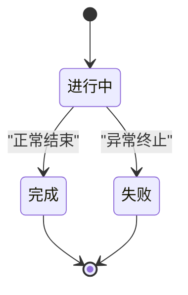

**图表来源**
- [turn-state-store.test.ts:1-200](file://engine/tests/turn-state-store.test.ts#L1-L200)

**章节来源**
- [turn-state-store.test.ts:1-200](file://engine/tests/turn-state-store.test.ts#L1-L200)

### 状态机与事件驱动
- 状态机实现：
  - 以领域事件驱动状态转换，确保幂等性与顺序性
  - 每个状态转换对应明确的事件类型与校验规则
- 事件与投影：
  - 事件写入后由投影器异步更新状态视图
  - 支持按需重放事件以修复状态

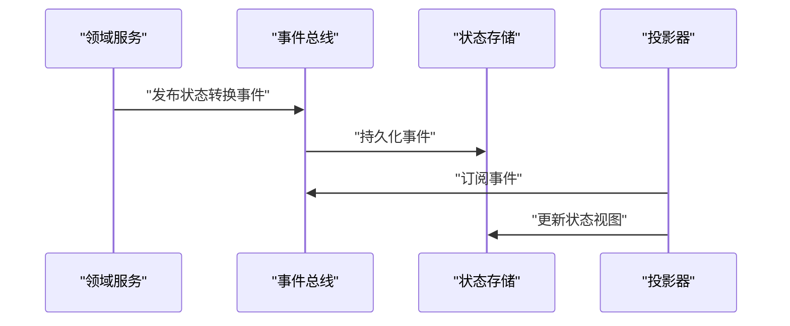

**图表来源**
- [evented-loop.test.ts:1-200](file://engine/tests/evented-loop.test.ts#L1-L200)
- [kernel-v3-node-handlers.test.ts:1-200](file://engine/tests/kernel-v3-node-handlers.test.ts#L1-L200)

**章节来源**
- [evented-loop.test.ts:1-200](file://engine/tests/evented-loop.test.ts#L1-L200)
- [kernel-v3-node-handlers.test.ts:1-200](file://engine/tests/kernel-v3-node-handlers.test.ts#L1-L200)

### 状态历史记录与审计追踪
- 策略：
  - 事件日志作为不可变审计轨迹
  - 状态表提供当前快照，事件日志提供变更明细
- 用途：
  - 问题回溯、合规审计、回放调试
- 压缩与归档：
  - 定期压缩旧事件，保留必要摘要

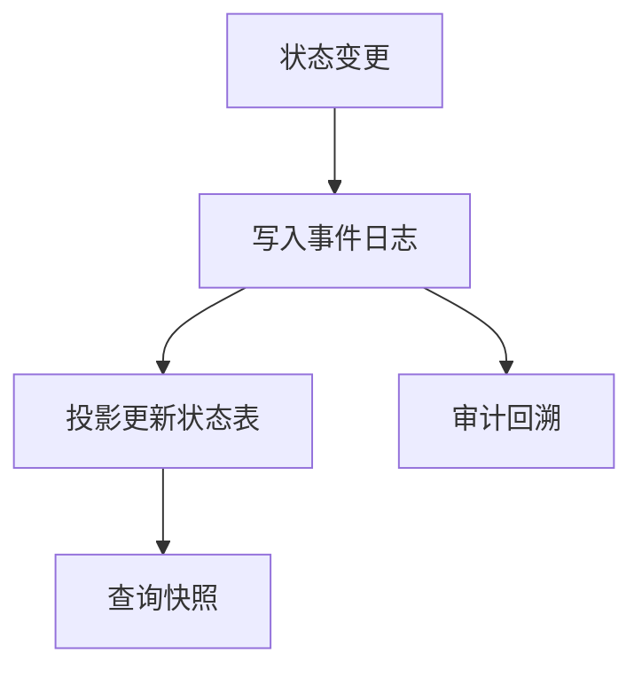

**图表来源**
- [compaction-transaction.test.ts:1-200](file://engine/tests/compaction-transaction.test.ts#L1-L200)

**章节来源**
- [compaction-transaction.test.ts:1-200](file://engine/tests/compaction-transaction.test.ts#L1-L200)

### 并发状态控制
- 乐观锁：
  - 基于version字段，更新时比较版本号，防止覆盖
- 悲观锁：
  - 对热点资源加排他锁，适用于强一致性场景
- 选择策略：
  - 读多写少用乐观锁，写冲突频繁用悲观锁或分片

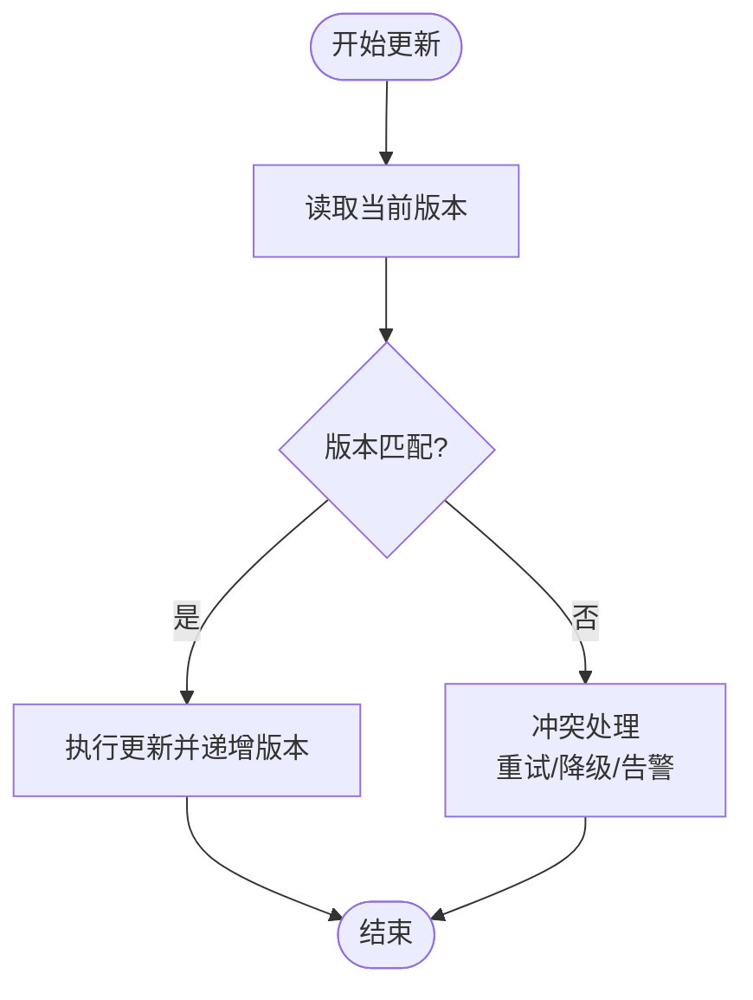

**图表来源**
- [task-state-store.test.ts:1-200](file://engine/tests/task-state-store.test.ts#L1-L200)
- [run-state-store.test.ts:1-200](file://engine/tests/run-state-store.test.ts#L1-L200)

**章节来源**
- [task-state-store.test.ts:1-200](file://engine/tests/task-state-store.test.ts#L1-L200)
- [run-state-store.test.ts:1-200](file://engine/tests/run-state-store.test.ts#L1-L200)

### 状态恢复机制
- 崩溃恢复：
  - 进程重启后加载最近一致快照，重放事件恢复到最新状态
- 上下文恢复：
  - 任务上下文与轮次上下文分别持久化，支持细粒度恢复
- 委托终端状态：
  - 委托任务到达终态后，主任务继续推进

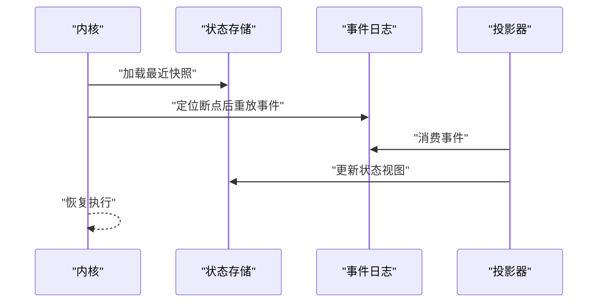

**图表来源**
- [runtime-kernel-crash-recovery.test.ts:1-200](file://engine/tests/runtime-kernel-crash-recovery.test.ts#L1-L200)
- [task-context-recovery.test.ts:1-200](file://engine/tests/task-context-recovery.test.ts#L1-L200)
- [delegation-terminal-state.test.ts:1-200](file://engine/tests/delegation-terminal-state.test.ts#L1-L200)

**章节来源**
- [runtime-kernel-crash-recovery.test.ts:1-200](file://engine/tests/runtime-kernel-crash-recovery.test.ts#L1-L200)
- [task-context-recovery.test.ts:1-200](file://engine/tests/task-context-recovery.test.ts#L1-L200)
- [delegation-terminal-state.test.ts:1-200](file://engine/tests/delegation-terminal-state.test.ts#L1-L200)

### 迁移与兼容性
- 历史迁移：
  - 提供迁移脚本与测试，确保新旧状态结构兼容
- 版本演进：
  - 通过version字段与事件类型区分不同版本

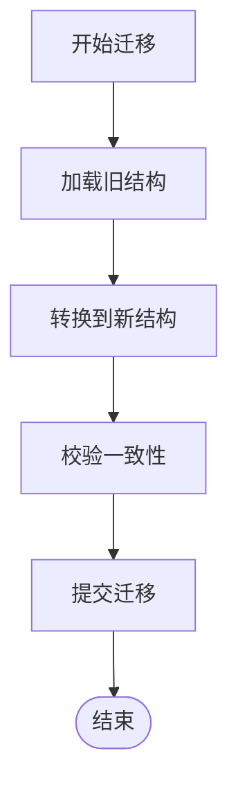

**图表来源**
- [legacy-task-state-migration.test.ts:1-200](file://engine/tests/legacy-task-state-migration.test.ts#L1-L200)

**章节来源**
- [legacy-task-state-migration.test.ts:1-200](file://engine/tests/legacy-task-state-migration.test.ts#L1-L200)

## 依赖分析
状态管理各组件之间的依赖关系如下：

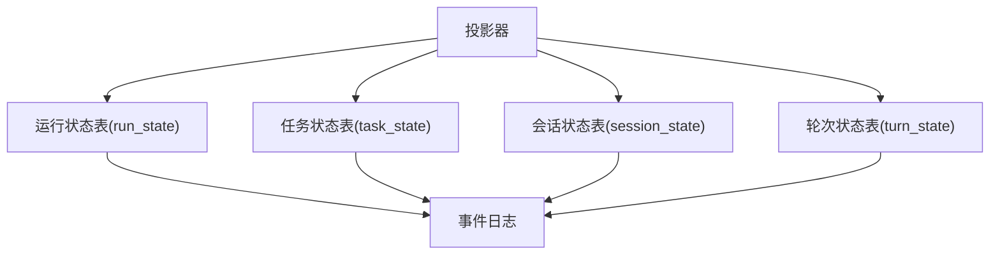

**图表来源**
- [run-state-store.test.ts:1-200](file://engine/tests/run-state-store.test.ts#L1-L200)
- [task-state-store.test.ts:1-200](file://engine/tests/task-state-store.test.ts#L1-L200)
- [turn-state-store.test.ts:1-200](file://engine/tests/turn-state-store.test.ts#L1-L200)
- [task-progress-projector.test.ts:1-200](file://engine/tests/task-progress-projector.test.ts#L1-L200)

**章节来源**
- [run-state-store.test.ts:1-200](file://engine/tests/run-state-store.test.ts#L1-L200)
- [task-state-store.test.ts:1-200](file://engine/tests/task-state-store.test.ts#L1-L200)
- [turn-state-store.test.ts:1-200](file://engine/tests/turn-state-store.test.ts#L1-L200)
- [task-progress-projector.test.ts:1-200](file://engine/tests/task-progress-projector.test.ts#L1-L200)

## 性能考虑
- 索引优化：
  - 为高频查询字段建立索引（如run_id、task_id、session_id、status、created_at）
- 批处理与合并：
  - 批量写入与投影合并减少IO开销
- 压缩与归档：
  - 定期压缩旧事件，降低存储压力
- 分片与分区：
  - 按时间或租户分片，提升并发与查询性能
- 缓存策略：
  - 热点状态短期缓存，注意失效与一致性

[本节为通用指导，无需特定文件来源]

## 故障排查指南
- 常见问题：
  - 状态不一致：检查事件重放与投影是否正确
  - 写冲突：确认乐观锁version比较逻辑
  - 恢复失败：验证快照完整性与事件连续性
- 诊断手段：
  - 查看事件日志与状态快照差异
  - 启用详细日志与指标采集
  - 复现最小用例并回放事件

**章节来源**
- [runtime-kernel-crash-recovery.test.ts:1-200](file://engine/tests/runtime-kernel-crash-recovery.test.ts#L1-L200)
- [compaction-transaction.test.ts:1-200](file://engine/tests/compaction-transaction.test.ts#L1-L200)

## 结论
KCoder的状态管理采用事件驱动与投影相结合的设计，具备高内聚、低耦合、易审计与可扩展的特点。通过合理的状态表设计、并发控制与恢复机制，能够支撑复杂任务编排与高可靠运行。建议在实施过程中关注索引优化、批处理与压缩归档，以提升性能与可维护性。

[本节为总结性内容，无需特定文件来源]

## 附录
- 术语说明：
  - 运行状态：一次执行的总体状态
  - 任务状态：单个任务及其子任务的状态
  - 会话状态：会话级上下文与配置
  - 轮次状态：单次交互的输入输出与工具调用
  - 事件日志：不可变的变更记录
  - 投影器：将事件转换为状态视图的组件

[本节为概念性说明，无需特定文件来源]