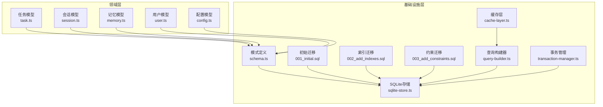
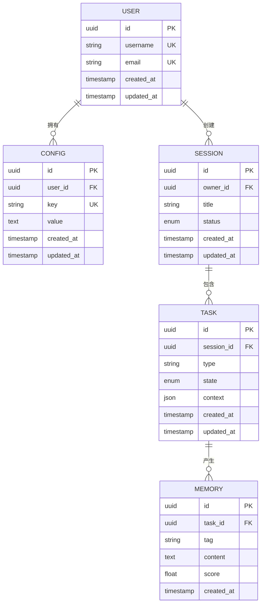
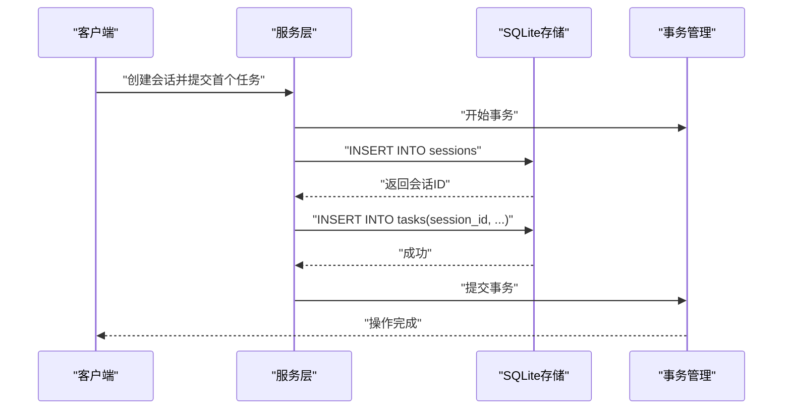
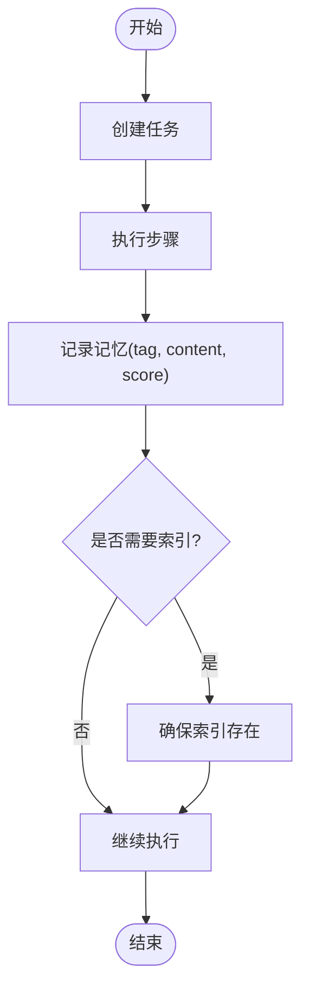
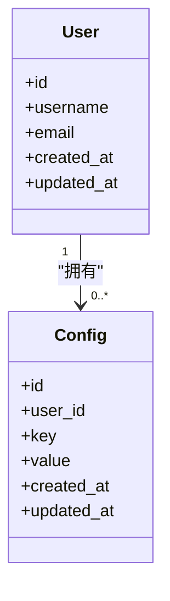
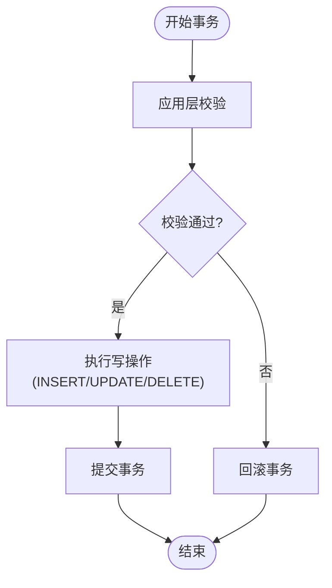
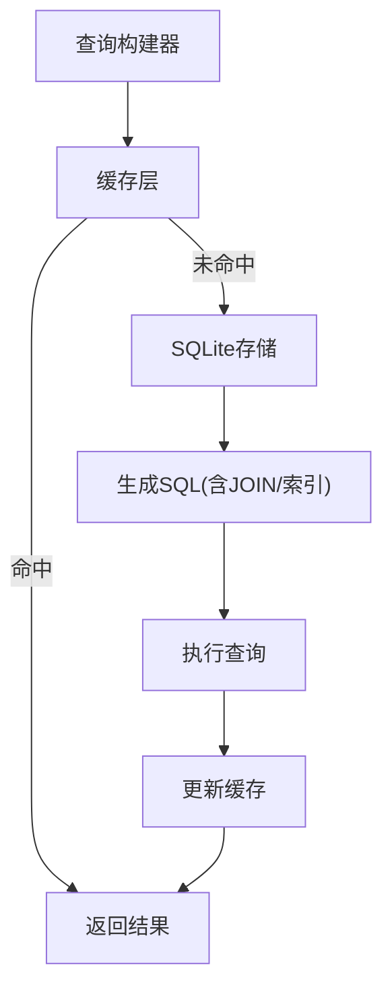
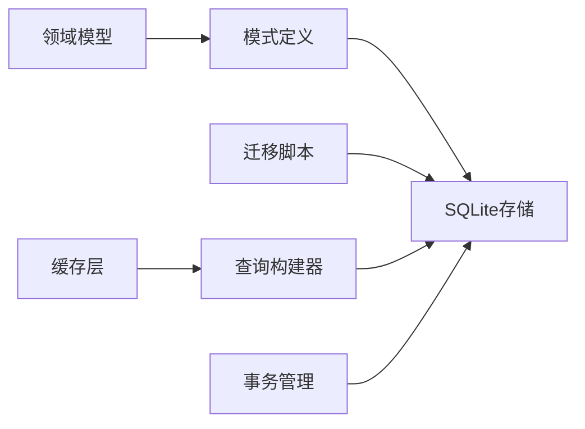

# 表关系设计

<cite>
**本文引用的文件**   
- [engine/packages/domain-layer/src/models/task.ts](file://engine/packages/domain-layer/src/models/task.ts)
- [engine/packages/domain-layer/src/models/session.ts](file://engine/packages/domain-layer/src/models/session.ts)
- [engine/packages/domain-layer/src/models/memory.ts](file://engine/packages/domain-layer/src/models/memory.ts)
- [engine/packages/domain-layer/src/models/user.ts](file://engine/packages/domain-layer/src/models/user.ts)
- [engine/packages/domain-layer/src/models/config.ts](file://engine/packages/domain-layer/src/models/config.ts)
- [engine/packages/infrastructure/src/storage/sqlite-store.ts](file://engine/packages/infrastructure/src/storage/sqlite-store.ts)
- [engine/packages/infrastructure/src/storage/schema.ts](file://engine/packages/infrastructure/src/storage/schema.ts)
- [engine/packages/infrastructure/src/storage/migrations/001_initial.sql](file://engine/packages/infrastructure/src/storage/migrations/001_initial.sql)
- [engine/packages/infrastructure/src/storage/migrations/002_add_indexes.sql](file://engine/packages/infrastructure/src/storage/migrations/002_add_indexes.sql)
- [engine/packages/infrastructure/src/storage/migrations/003_add_constraints.sql](file://engine/packages/infrastructure/src/storage/migrations/003_add_constraints.sql)
- [engine/packages/infrastructure/src/storage/query-builder.ts](file://engine/packages/infrastructure/src/storage/query-builder.ts)
- [engine/packages/infrastructure/src/storage/cache-layer.ts](file://engine/packages/infrastructure/src/storage/cache-layer.ts)
- [engine/packages/infrastructure/src/storage/transaction-manager.ts](file://engine/packages/infrastructure/src/storage/transaction-manager.ts)
</cite>

## 目录
1. [引言](#引言)
2. [项目结构](#项目结构)
3. [核心组件](#核心组件)
4. [架构总览](#架构总览)
5. [详细组件分析](#详细组件分析)
6. [依赖分析](#依赖分析)
7. [性能考虑](#性能考虑)
8. [故障排查指南](#故障排查指南)
9. [结论](#结论)
10. [附录](#附录)

## 引言
本技术文档聚焦于KCoder的数据库表关系设计，围绕会话、任务、记忆、用户与配置等核心实体，系统阐述一对一、一对多、多对多的实现方式；外键约束的设计原则与级联策略；数据完整性保障机制（事务、约束、一致性）；以及查询优化策略（JOIN、子查询、缓存）。文档同时提供ER图与关系图，帮助读者快速理解并落地实施。

## 项目结构
KCoder的数据模型定义位于领域层（domain-layer），持久化实现位于基础设施层（infrastructure），包括SQLite存储、迁移脚本、查询构建器、缓存层与事务管理器。整体分层清晰：领域模型描述业务实体与关系，基础设施负责SQL映射、索引与约束、事务与缓存。

图表来源
- [engine/packages/domain-layer/src/models/task.ts](file://engine/packages/domain-layer/src/models/task.ts)
- [engine/packages/domain-layer/src/models/session.ts](file://engine/packages/domain-layer/src/models/session.ts)
- [engine/packages/domain-layer/src/models/memory.ts](file://engine/packages/domain-layer/src/models/memory.ts)
- [engine/packages/domain-layer/src/models/user.ts](file://engine/packages/domain-layer/src/models/user.ts)
- [engine/packages/domain-layer/src/models/config.ts](file://engine/packages/domain-layer/src/models/config.ts)
- [engine/packages/infrastructure/src/storage/schema.ts](file://engine/packages/infrastructure/src/storage/schema.ts)
- [engine/packages/infrastructure/src/storage/sqlite-store.ts](file://engine/packages/infrastructure/src/storage/sqlite-store.ts)
- [engine/packages/infrastructure/src/storage/migrations/001_initial.sql](file://engine/packages/infrastructure/src/storage/migrations/001_initial.sql)
- [engine/packages/infrastructure/src/storage/migrations/002_add_indexes.sql](file://engine/packages/infrastructure/src/storage/migrations/002_add_indexes.sql)
- [engine/packages/infrastructure/src/storage/migrations/003_add_constraints.sql](file://engine/packages/infrastructure/src/storage/migrations/003_add_constraints.sql)
- [engine/packages/infrastructure/src/storage/query-builder.ts](file://engine/packages/infrastructure/src/storage/query-builder.ts)
- [engine/packages/infrastructure/src/storage/cache-layer.ts](file://engine/packages/infrastructure/src/storage/cache-layer.ts)
- [engine/packages/infrastructure/src/storage/transaction-manager.ts](file://engine/packages/infrastructure/src/storage/transaction-manager.ts)

章节来源
- [engine/packages/domain-layer/src/models/task.ts](file://engine/packages/domain-layer/src/models/task.ts)
- [engine/packages/domain-layer/src/models/session.ts](file://engine/packages/domain-layer/src/models/session.ts)
- [engine/packages/domain-layer/src/models/memory.ts](file://engine/packages/domain-layer/src/models/memory.ts)
- [engine/packages/domain-layer/src/models/user.ts](file://engine/packages/domain-layer/src/models/user.ts)
- [engine/packages/domain-layer/src/models/config.ts](file://engine/packages/domain-layer/src/models/config.ts)
- [engine/packages/infrastructure/src/storage/schema.ts](file://engine/packages/infrastructure/src/storage/schema.ts)
- [engine/packages/infrastructure/src/storage/sqlite-store.ts](file://engine/packages/infrastructure/src/storage/sqlite-store.ts)
- [engine/packages/infrastructure/src/storage/migrations/001_initial.sql](file://engine/packages/infrastructure/src/storage/migrations/001_initial.sql)
- [engine/packages/infrastructure/src/storage/migrations/002_add_indexes.sql](file://engine/packages/infrastructure/src/storage/migrations/002_add_indexes.sql)
- [engine/packages/infrastructure/src/storage/migrations/003_add_constraints.sql](file://engine/packages/infrastructure/src/storage/migrations/003_add_constraints.sql)
- [engine/packages/infrastructure/src/storage/query-builder.ts](file://engine/packages/infrastructure/src/storage/query-builder.ts)
- [engine/packages/infrastructure/src/storage/cache-layer.ts](file://engine/packages/infrastructure/src/storage/cache-layer.ts)
- [engine/packages/infrastructure/src/storage/transaction-manager.ts](file://engine/packages/infrastructure/src/storage/transaction-manager.ts)

## 核心组件
- 任务（Task）：表示一次可执行的工作单元，包含状态、上下文、时间戳等字段，并通过会话ID关联到会话。
- 会话（Session）：表示一次对话或工作流实例，承载任务集合与生命周期信息。
- 记忆（Memory）：记录任务执行过程中的关键片段、中间结果与检索增强信息，通过任务ID关联。
- 用户（User）：系统使用者，拥有唯一标识与基础属性。
- 配置（Config）：用户或全局的配置项，支持按用户维度隔离。

这些实体在领域模型中定义，并在基础设施层通过SQLite进行持久化，配合迁移脚本完成DDL变更与约束维护。

章节来源
- [engine/packages/domain-layer/src/models/task.ts](file://engine/packages/domain-layer/src/models/task.ts)
- [engine/packages/domain-layer/src/models/session.ts](file://engine/packages/domain-layer/src/models/session.ts)
- [engine/packages/domain-layer/src/models/memory.ts](file://engine/packages/domain-layer/src/models/memory.ts)
- [engine/packages/domain-layer/src/models/user.ts](file://engine/packages/domain-layer/src/models/user.ts)
- [engine/packages/domain-layer/src/models/config.ts](file://engine/packages/domain-layer/src/models/config.ts)

## 架构总览
下图展示从领域模型到持久化的整体关系，包括表间关联、约束与索引位置。

图表来源
- [engine/packages/infrastructure/src/storage/schema.ts](file://engine/packages/infrastructure/src/storage/schema.ts)
- [engine/packages/infrastructure/src/storage/migrations/001_initial.sql](file://engine/packages/infrastructure/src/storage/migrations/001_initial.sql)
- [engine/packages/infrastructure/src/storage/migrations/002_add_indexes.sql](file://engine/packages/infrastructure/src/storage/migrations/002_add_indexes.sql)
- [engine/packages/infrastructure/src/storage/migrations/003_add_constraints.sql](file://engine/packages/infrastructure/src/storage/migrations/003_add_constraints.sql)

## 详细组件分析

### 实体关系与外键约束设计
- 一对一关系
  - 用户与配置：通过用户ID作为外键，配置项key具备唯一性，确保每个用户在相同命名空间下仅存在一个配置项。
  - 设计要点：使用唯一约束保证键值不重复；删除用户时可选择级联删除其配置，避免孤儿记录。
- 一对多关系
  - 用户与会话：一个用户可创建多个会话，会话表持有用户ID外键。
  - 会话与任务：一个会话包含多个任务，任务表持有会话ID外键。
  - 任务与记忆：一个任务可产生多条记忆，记忆表持有任务ID外键。
  - 设计要点：为频繁查询的外键列建立索引；根据业务选择是否启用级联删除（例如删除会话时级联删除其任务与记忆）。
- 多对多关系
  - 当前模型未直接体现多对多；若未来需要“标签-任务”等多对多场景，建议引入中间表（如task_tag）以规范化建模。

外键约束策略
- 级联删除：适用于强归属关系的子实体（如任务、记忆随父实体删除而清理），减少垃圾数据。
- 级联更新：谨慎使用，仅在主键稳定且跨表一致性强时使用；多数情况下推荐应用层处理更新以避免锁竞争。

章节来源
- [engine/packages/infrastructure/src/storage/migrations/001_initial.sql](file://engine/packages/infrastructure/src/storage/migrations/001_initial.sql)
- [engine/packages/infrastructure/src/storage/migrations/003_add_constraints.sql](file://engine/packages/infrastructure/src/storage/migrations/003_add_constraints.sql)

### 会话与任务的关联关系
- 关系类型：一对多（会话→任务）
- 实现方式：任务表包含会话ID外键，用于定位所属会话；会话状态驱动任务生命周期（如进行中、已完成、已取消）。
- 查询路径：通过会话ID获取任务列表，结合状态过滤与排序。
- 事务边界：创建会话后批量插入任务时，应在同一事务内提交，保证一致性。

图表来源
- [engine/packages/infrastructure/src/storage/transaction-manager.ts](file://engine/packages/infrastructure/src/storage/transaction-manager.ts)
- [engine/packages/infrastructure/src/storage/sqlite-store.ts](file://engine/packages/infrastructure/src/storage/sqlite-store.ts)

章节来源
- [engine/packages/domain-layer/src/models/session.ts](file://engine/packages/domain-layer/src/models/session.ts)
- [engine/packages/domain-layer/src/models/task.ts](file://engine/packages/domain-layer/src/models/task.ts)
- [engine/packages/infrastructure/src/storage/sqlite-store.ts](file://engine/packages/infrastructure/src/storage/sqlite-store.ts)
- [engine/packages/infrastructure/src/storage/transaction-manager.ts](file://engine/packages/infrastructure/src/storage/transaction-manager.ts)

### 任务与记忆的关联关系
- 关系类型：一对多（任务→记忆）
- 实现方式：记忆表包含任务ID外键，用于检索某任务产生的所有记忆片段。
- 检索优化：为tag、score等常用过滤字段建立索引，提升筛选与排序效率。
- 写入策略：记忆写入通常发生在任务执行过程中，需考虑并发写入与事务边界。

图表来源
- [engine/packages/infrastructure/src/storage/migrations/002_add_indexes.sql](file://engine/packages/infrastructure/src/storage/migrations/002_add_indexes.sql)

章节来源
- [engine/packages/domain-layer/src/models/memory.ts](file://engine/packages/domain-layer/src/models/memory.ts)
- [engine/packages/infrastructure/src/storage/migrations/002_add_indexes.sql](file://engine/packages/infrastructure/src/storage/migrations/002_add_indexes.sql)

### 用户与配置的关联关系
- 关系类型：一对多（用户→配置）
- 实现方式：配置表包含用户ID外键，并通过key唯一约束保证同一用户下的配置项不重复。
- 访问模式：按用户维度读取配置，必要时提供默认值回退逻辑。
- 一致性：配置更新应原子化，避免部分更新导致不一致。

图表来源
- [engine/packages/infrastructure/src/storage/schema.ts](file://engine/packages/infrastructure/src/storage/schema.ts)
- [engine/packages/infrastructure/src/storage/migrations/001_initial.sql](file://engine/packages/infrastructure/src/storage/migrations/001_initial.sql)

章节来源
- [engine/packages/domain-layer/src/models/user.ts](file://engine/packages/domain-layer/src/models/user.ts)
- [engine/packages/domain-layer/src/models/config.ts](file://engine/packages/domain-layer/src/models/config.ts)
- [engine/packages/infrastructure/src/storage/schema.ts](file://engine/packages/infrastructure/src/storage/schema.ts)
- [engine/packages/infrastructure/src/storage/migrations/001_initial.sql](file://engine/packages/infrastructure/src/storage/migrations/001_initial.sql)

### 数据完整性保证机制
- 事务处理
  - 使用事务管理器封装BEGIN/COMMIT/ROLLBACK，确保多表操作的原子性。
  - 典型场景：创建会话+初始化任务、批量写入记忆、配置更新。
- 约束检查
  - 主键与唯一约束：防止重复记录（如配置key、用户名、邮箱）。
  - 外键约束：强制引用完整性，避免孤儿记录。
  - 非空与类型约束：保证字段合法性。
- 数据一致性
  - 应用层校验：在写入前进行业务规则校验（如状态机转换合法）。
  - 幂等写入：对关键操作提供幂等键，避免重复提交造成数据异常。

图表来源
- [engine/packages/infrastructure/src/storage/transaction-manager.ts](file://engine/packages/infrastructure/src/storage/transaction-manager.ts)
- [engine/packages/infrastructure/src/storage/sqlite-store.ts](file://engine/packages/infrastructure/src/storage/sqlite-store.ts)

章节来源
- [engine/packages/infrastructure/src/storage/transaction-manager.ts](file://engine/packages/infrastructure/src/storage/transaction-manager.ts)
- [engine/packages/infrastructure/src/storage/migrations/003_add_constraints.sql](file://engine/packages/infrastructure/src/storage/migrations/003_add_constraints.sql)

### 查询优化策略
- JOIN操作优化
  - 优先使用显式JOIN而非嵌套子查询，利用外键索引加速连接。
  - 控制SELECT字段范围，避免全表扫描与不必要的大对象加载。
- 子查询优化
  - 将相关条件下沉至WHERE或JOIN ON，减少中间结果集大小。
  - 对于聚合类查询，尽量在数据库侧完成计算。
- 索引策略
  - 为高频过滤与排序字段建立索引（如会话状态、任务类型、记忆tag/score）。
  - 复合索引覆盖常见查询组合（如session_id+state）。
- 缓存策略
  - 读多写少场景（如用户配置、会话元信息）采用缓存层，降低数据库压力。
  - 缓存失效策略：基于事件或TTL，确保一致性。

图表来源
- [engine/packages/infrastructure/src/storage/query-builder.ts](file://engine/packages/infrastructure/src/storage/query-builder.ts)
- [engine/packages/infrastructure/src/storage/cache-layer.ts](file://engine/packages/infrastructure/src/storage/cache-layer.ts)
- [engine/packages/infrastructure/src/storage/sqlite-store.ts](file://engine/packages/infrastructure/src/storage/sqlite-store.ts)
- [engine/packages/infrastructure/src/storage/migrations/002_add_indexes.sql](file://engine/packages/infrastructure/src/storage/migrations/002_add_indexes.sql)

章节来源
- [engine/packages/infrastructure/src/storage/query-builder.ts](file://engine/packages/infrastructure/src/storage/query-builder.ts)
- [engine/packages/infrastructure/src/storage/cache-layer.ts](file://engine/packages/infrastructure/src/storage/cache-layer.ts)
- [engine/packages/infrastructure/src/storage/migrations/002_add_indexes.sql](file://engine/packages/infrastructure/src/storage/migrations/002_add_indexes.sql)

## 依赖分析
- 领域层到基础设施层的依赖方向明确：领域模型定义数据结构与关系语义，基础设施层负责SQL映射、约束与索引、事务与缓存。
- 迁移脚本顺序执行，确保DDL变更的稳定性与可回溯性。
- 查询构建器与缓存层共同作用于SQLite存储，形成读写分离的优化路径。

图表来源
- [engine/packages/domain-layer/src/models/task.ts](file://engine/packages/domain-layer/src/models/task.ts)
- [engine/packages/domain-layer/src/models/session.ts](file://engine/packages/domain-layer/src/models/session.ts)
- [engine/packages/domain-layer/src/models/memory.ts](file://engine/packages/domain-layer/src/models/memory.ts)
- [engine/packages/domain-layer/src/models/user.ts](file://engine/packages/domain-layer/src/models/user.ts)
- [engine/packages/domain-layer/src/models/config.ts](file://engine/packages/domain-layer/src/models/config.ts)
- [engine/packages/infrastructure/src/storage/schema.ts](file://engine/packages/infrastructure/src/storage/schema.ts)
- [engine/packages/infrastructure/src/storage/sqlite-store.ts](file://engine/packages/infrastructure/src/storage/sqlite-store.ts)
- [engine/packages/infrastructure/src/storage/migrations/001_initial.sql](file://engine/packages/infrastructure/src/storage/migrations/001_initial.sql)
- [engine/packages/infrastructure/src/storage/migrations/002_add_indexes.sql](file://engine/packages/infrastructure/src/storage/migrations/002_add_indexes.sql)
- [engine/packages/infrastructure/src/storage/migrations/003_add_constraints.sql](file://engine/packages/infrastructure/src/storage/migrations/003_add_constraints.sql)
- [engine/packages/infrastructure/src/storage/query-builder.ts](file://engine/packages/infrastructure/src/storage/query-builder.ts)
- [engine/packages/infrastructure/src/storage/cache-layer.ts](file://engine/packages/infrastructure/src/storage/cache-layer.ts)
- [engine/packages/infrastructure/src/storage/transaction-manager.ts](file://engine/packages/infrastructure/src/storage/transaction-manager.ts)

章节来源
- [engine/packages/infrastructure/src/storage/sqlite-store.ts](file://engine/packages/infrastructure/src/storage/sqlite-store.ts)
- [engine/packages/infrastructure/src/storage/migrations/001_initial.sql](file://engine/packages/infrastructure/src/storage/migrations/001_initial.sql)
- [engine/packages/infrastructure/src/storage/migrations/002_add_indexes.sql](file://engine/packages/infrastructure/src/storage/migrations/002_add_indexes.sql)
- [engine/packages/infrastructure/src/storage/migrations/003_add_constraints.sql](file://engine/packages/infrastructure/src/storage/migrations/003_add_constraints.sql)

## 性能考虑
- 索引设计：针对外键与高频过滤字段建立单列或复合索引，减少全表扫描。
- 查询计划：定期分析慢查询，调整JOIN顺序与条件，避免不必要的子查询。
- 缓存命中率：合理设置缓存TTL与失效策略，平衡一致性与性能。
- 事务粒度：缩小事务范围，减少锁持有时间，提高并发能力。

[本节为通用指导，无需特定文件来源]

## 故障排查指南
- 外键冲突
  - 现象：插入或更新时报外键约束失败。
  - 排查：确认父记录是否存在；检查级联策略是否符合预期。
- 唯一约束冲突
  - 现象：插入重复的用户名、邮箱或配置key。
  - 排查：在应用层增加预检与重试逻辑；确保幂等键正确传递。
- 事务回滚
  - 现象：部分写入成功但整体失败。
  - 排查：检查事务边界与错误捕获；确认回滚路径是否正确。
- 查询缓慢
  - 现象：JOIN或子查询耗时过长。
  - 排查：查看执行计划；补充缺失索引；优化SELECT字段与过滤条件。

章节来源
- [engine/packages/infrastructure/src/storage/migrations/003_add_constraints.sql](file://engine/packages/infrastructure/src/storage/migrations/003_add_constraints.sql)
- [engine/packages/infrastructure/src/storage/transaction-manager.ts](file://engine/packages/infrastructure/src/storage/transaction-manager.ts)
- [engine/packages/infrastructure/src/storage/query-builder.ts](file://engine/packages/infrastructure/src/storage/query-builder.ts)

## 结论
KCoder的数据库表关系设计遵循清晰的领域模型与基础设施分层，通过外键约束、唯一约束与事务管理保障数据完整性；借助索引与缓存提升查询性能；会话-任务-记忆的用户流程通过一对多关系自然表达，用户-配置的一对一/一对多组合满足个性化需求。建议在后续演进中持续监控慢查询与锁竞争，按需引入复合索引与更细粒度的事务边界。

[本节为总结性内容，无需特定文件来源]

## 附录
- 术语说明
  - 会话：一次对话或工作流实例。
  - 任务：会话中的具体执行单元。
  - 记忆：任务执行过程中的片段化信息。
  - 用户：系统使用者。
  - 配置：用户或全局的设置项。

[本节为概念性内容，无需特定文件来源]