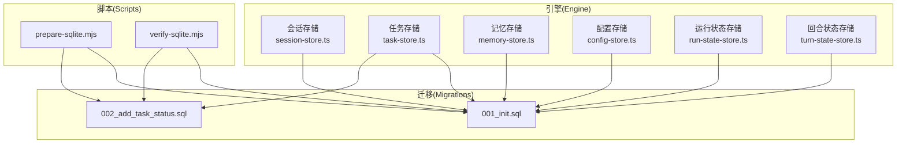
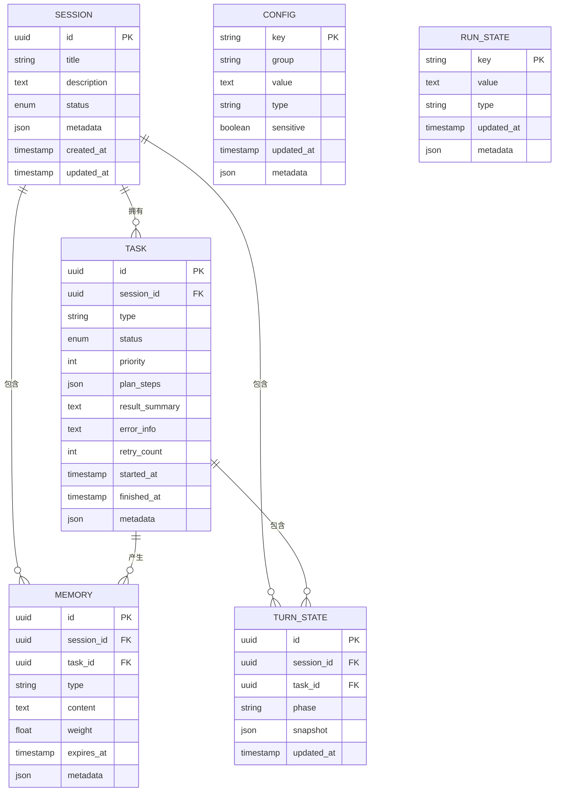
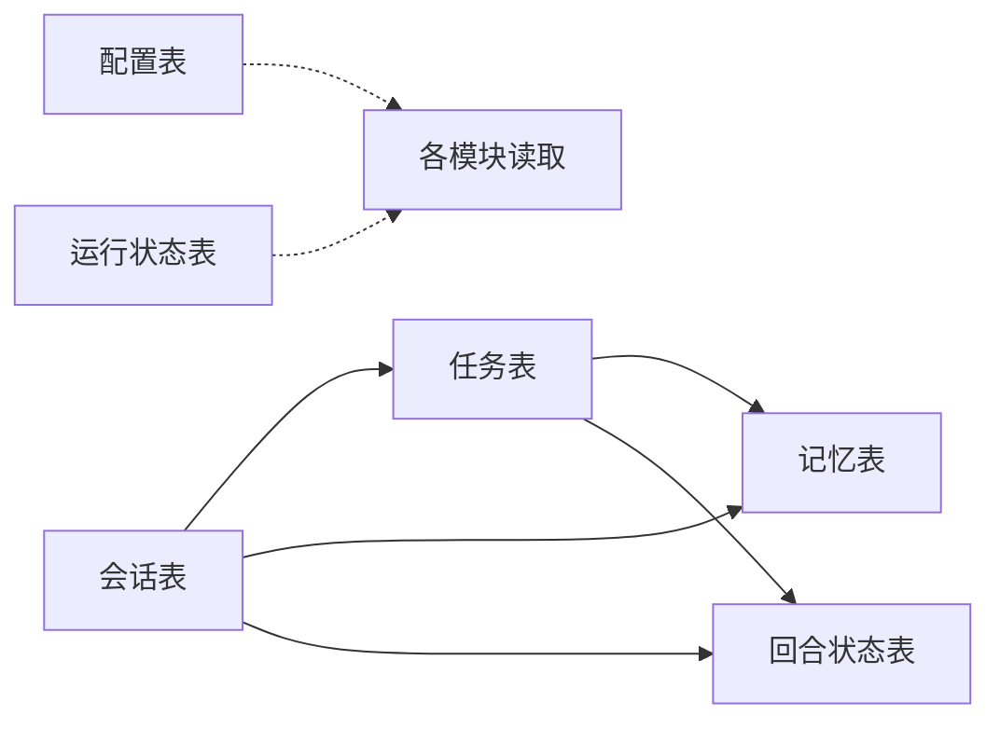

# 表结构设计

<cite>
**本文引用的文件**   
- [engine/packages/infrastructure/src/storage/sqlite/session-store.ts](file://engine/packages/infrastructure/src/storage/sqlite/session-store.ts)
- [engine/packages/infrastructure/src/storage/sqlite/task-store.ts](file://engine/packages/infrastructure/src/storage/sqlite/task-store.ts)
- [engine/packages/infrastructure/src/storage/sqlite/memory-store.ts](file://engine/packages/infrastructure/src/storage/sqlite/memory-store.ts)
- [engine/packages/infrastructure/src/storage/sqlite/config-store.ts](file://engine/packages/infrastructure/src/storage/sqlite/config-store.ts)
- [engine/packages/infrastructure/src/storage/sqlite/run-state-store.ts](file://engine/packages/infrastructure/src/storage/sqlite/run-state-store.ts)
- [engine/packages/infrastructure/src/storage/sqlite/turn-state-store.ts](file://engine/packages/infrastructure/src/storage/sqlite/turn-state-store.ts)
- [engine/packages/infrastructure/src/storage/sqlite/migrations/001_init.sql](file://engine/packages/infrastructure/src/storage/sqlite/migrations/001_init.sql)
- [engine/packages/infrastructure/src/storage/sqlite/migrations/002_add_task_status.sql](file://engine/packages/infrastructure/src/storage/sqlite/migrations/002_add_task_status.sql)
- [engine/scripts/prepare-sqlite.mjs](file://engine/scripts/prepare-sqlite.mjs)
- [engine/scripts/verify-sqlite.mjs](file://engine/scripts/verify-sqlite.mjs)
</cite>

## 目录
1. [简介](#简介)
2. [项目结构](#项目结构)
3. [核心组件](#核心组件)
4. [架构总览](#架构总览)
5. [详细组件分析](#详细组件分析)
6. [依赖分析](#依赖依赖分析)
7. [性能考虑](#性能考虑)
8. [故障排查指南](#故障排查指南)
9. [结论](#结论)
10. [附录](#附录)

## 简介
本文件面向KCoder的数据库表结构设计，聚焦持久化层（SQLite）的核心表：会话表、任务表、记忆表、配置表，以及运行状态与回合状态等支撑表。文档将说明字段定义、数据类型与约束、表间关系与完整性保证、业务含义与用途、索引与扩展设计、版本迁移策略，并给出ER图与示例数据建议，帮助读者快速理解与扩展该存储模型。

## 项目结构
KCoder的持久化实现位于engine子工程内，采用模块化组织：
- 存储实现：基于SQLite的多个Store模块，分别负责会话、任务、记忆、配置、运行状态、回合状态等实体的CRUD与查询。
- 迁移脚本：migrations目录下按序号管理DDL变更。
- 初始化与校验：scripts下提供SQLite初始化与验证脚本。

图表来源
- [engine/packages/infrastructure/src/storage/sqlite/session-store.ts](file://engine/packages/infrastructure/src/storage/sqlite/session-store.ts)
- [engine/packages/infrastructure/src/storage/sqlite/task-store.ts](file://engine/packages/infrastructure/src/storage/sqlite/task-store.ts)
- [engine/packages/infrastructure/src/storage/sqlite/memory-store.ts](file://engine/packages/infrastructure/src/storage/sqlite/memory-store.ts)
- [engine/packages/infrastructure/src/storage/sqlite/config-store.ts](file://engine/packages/infrastructure/src/storage/sqlite/config-store.ts)
- [engine/packages/infrastructure/src/storage/sqlite/run-state-store.ts](file://engine/packages/infrastructure/src/storage/sqlite/run-state-store.ts)
- [engine/packages/infrastructure/src/storage/sqlite/turn-state-store.ts](file://engine/packages/infrastructure/src/storage/sqlite/turn-state-store.ts)
- [engine/packages/infrastructure/src/storage/sqlite/migrations/001_init.sql](file://engine/packages/infrastructure/src/storage/sqlite/migrations/001_init.sql)
- [engine/packages/infrastructure/src/storage/sqlite/migrations/002_add_task_status.sql](file://engine/packages/infrastructure/src/storage/sqlite/migrations/002_add_task_status.sql)
- [engine/scripts/prepare-sqlite.mjs](file://engine/scripts/prepare-sqlite.mjs)
- [engine/scripts/verify-sqlite.mjs](file://engine/scripts/verify-sqlite.mjs)

章节来源
- [engine/packages/infrastructure/src/storage/sqlite/session-store.ts](file://engine/packages/infrastructure/src/storage/sqlite/session-store.ts)
- [engine/packages/infrastructure/src/storage/sqlite/task-store.ts](file://engine/packages/infrastructure/src/storage/sqlite/task-store.ts)
- [engine/packages/infrastructure/src/storage/sqlite/memory-store.ts](file://engine/packages/infrastructure/src/storage/sqlite/memory-store.ts)
- [engine/packages/infrastructure/src/storage/sqlite/config-store.ts](file://engine/packages/infrastructure/src/storage/sqlite/config-store.ts)
- [engine/packages/infrastructure/src/storage/sqlite/run-state-store.ts](file://engine/packages/infrastructure/src/storage/sqlite/run-state-store.ts)
- [engine/packages/infrastructure/src/storage/sqlite/turn-state-store.ts](file://engine/packages/infrastructure/src/storage/sqlite/turn-state-store.ts)
- [engine/packages/infrastructure/src/storage/sqlite/migrations/001_init.sql](file://engine/packages/infrastructure/src/storage/sqlite/migrations/001_init.sql)
- [engine/packages/infrastructure/src/storage/sqlite/migrations/002_add_task_status.sql](file://engine/packages/infrastructure/src/storage/sqlite/migrations/002_add_task_status.sql)
- [engine/scripts/prepare-sqlite.mjs](file://engine/scripts/prepare-sqlite.mjs)
- [engine/scripts/verify-sqlite.mjs](file://engine/scripts/verify-sqlite.mjs)

## 核心组件
本节概述各核心表的职责与关键字段语义，便于快速定位与理解。

- 会话表(session)
  - 作用：记录一次用户对话会话的全局上下文与元信息，作为任务的生命周期容器。
  - 关键字段：会话ID、标题、描述、创建时间、更新时间、状态、标签/分类、扩展JSON。
  - 主键：自增或UUID形式的会话ID。
  - 索引：按创建时间、状态、标签进行检索优化。

- 任务表(task)
  - 作用：承载会话内的具体执行单元，包含目标、计划、步骤、结果与进度。
  - 关键字段：任务ID、所属会话ID、类型、状态、优先级、计划/步骤JSON、结果摘要、错误信息、开始/结束时间、重试次数、扩展JSON。
  - 外键：会话ID引用会话表。
  - 索引：会话ID、状态、创建/更新时间。

- 记忆表(memory)
  - 作用：持久化长期/短期记忆片段，支持检索与聚合。
  - 关键字段：记忆ID、会话ID、任务ID（可选）、类型、内容、向量/关键词（可选）、权重、过期时间、扩展JSON。
  - 外键：会话ID、任务ID（可选）。
  - 索引：会话ID、任务ID、类型、时间戳。

- 配置表(config)
  - 作用：应用级与用户级配置项的键值存储，支持分组与层级。
  - 关键字段：配置键、分组、值、类型、是否敏感、生效范围、更新时间、扩展JSON。
  - 唯一性：配置键+分组唯一。
  - 索引：分组、更新时间。

- 运行状态表(run_state)
  - 作用：记录引擎运行时关键状态（如全局开关、预算、限流、特性开关等）。
  - 关键字段：键、值、类型、更新时间、扩展JSON。
  - 唯一性：键唯一。

- 回合状态表(turn_state)
  - 作用：记录单次回合（turn）的执行上下文与中间态，用于恢复与审计。
  - 关键字段：回合ID、会话ID、任务ID、阶段、快照JSON、更新时间。
  - 外键：会话ID、任务ID。
  - 索引：会话ID、任务ID、更新时间。

章节来源
- [engine/packages/infrastructure/src/storage/sqlite/session-store.ts](file://engine/packages/infrastructure/src/storage/sqlite/session-store.ts)
- [engine/packages/infrastructure/src/storage/sqlite/task-store.ts](file://engine/packages/infrastructure/src/storage/sqlite/task-store.ts)
- [engine/packages/infrastructure/src/storage/sqlite/memory-store.ts](file://engine/packages/infrastructure/src/storage/sqlite/memory-store.ts)
- [engine/packages/infrastructure/src/storage/sqlite/config-store.ts](file://engine/packages/infrastructure/src/storage/sqlite/config-store.ts)
- [engine/packages/infrastructure/src/storage/sqlite/run-state-store.ts](file://engine/packages/infrastructure/src/storage/sqlite/run-state-store.ts)
- [engine/packages/infrastructure/src/storage/sqlite/turn-state-store.ts](file://engine/packages/infrastructure/src/storage/sqlite/turn-state-store.ts)

## 架构总览
下图展示核心实体之间的关系与主要约束，体现“会话-任务-记忆”的主从结构与“配置/状态”的横切关注点。

图表来源
- [engine/packages/infrastructure/src/storage/sqlite/migrations/001_init.sql](file://engine/packages/infrastructure/src/storage/sqlite/migrations/001_init.sql)
- [engine/packages/infrastructure/src/storage/sqlite/migrations/002_add_task_status.sql](file://engine/packages/infrastructure/src/storage/sqlite/migrations/002_add_task_status.sql)

## 详细组件分析

### 会话表(session)
- 业务含义：表示一次对话会话，贯穿任务生命周期，提供上下文边界。
- 主键设计：建议使用UUID或自增整数；若跨进程/分布式，优先UUID。
- 关键字段
  - 标题/描述：人类可读标识与说明。
  - 状态：如“活跃/归档/删除中”，用于UI与清理策略。
  - 元数据：扩展字段，存放标签、来源、版本等。
  - 时间戳：创建/更新时间，便于排序与审计。
- 索引建议：按状态、更新时间、标签检索建立索引。
- 约束与完整性：无强外键依赖，但常作为其他表的外键目标。

章节来源
- [engine/packages/infrastructure/src/storage/sqlite/session-store.ts](file://engine/packages/infrastructure/src/storage/sqlite/session-store.ts)
- [engine/packages/infrastructure/src/storage/sqlite/migrations/001_init.sql](file://engine/packages/infrastructure/src/storage/sqlite/migrations/001_init.sql)

### 任务表(task)
- 业务含义：会话内的可执行单元，承载目标、计划、步骤、结果与进度。
- 主键设计：UUID或自增ID，需与外部流程ID解耦。
- 关键字段
  - 会话ID：外键关联会话。
  - 类型/状态/优先级：区分任务种类、执行阶段与调度顺序。
  - 计划/步骤JSON：结构化计划与步骤列表。
  - 结果摘要/错误信息：最终产出与失败原因。
  - 重试次数：控制容错与幂等。
  - 时间戳：开始/结束时间，用于SLA与耗时统计。
  - 元数据：扩展字段，如来源工具、参数签名等。
- 索引建议：会话ID、状态、更新时间。
- 约束与完整性：会话ID为外键，确保任务归属正确。

章节来源
- [engine/packages/infrastructure/src/storage/sqlite/task-store.ts](file://engine/packages/infrastructure/src/storage/sqlite/task-store.ts)
- [engine/packages/infrastructure/src/storage/sqlite/migrations/001_init.sql](file://engine/packages/infrastructure/src/storage/sqlite/migrations/001_init.sql)
- [engine/packages/infrastructure/src/storage/sqlite/migrations/002_add_task_status.sql](file://engine/packages/infrastructure/src/storage/sqlite/migrations/002_add_task_status.sql)

### 记忆表(memory)
- 业务含义：持久化会话/任务的记忆片段，支持检索与复用。
- 主键设计：UUID，避免冲突。
- 关键字段
  - 会话ID/任务ID：定位记忆来源。
  - 类型：如“事实/经验/规则/临时”。
  - 内容：文本或结构化片段。
  - 权重/过期时间：用于排序与清理。
  - 元数据：来源、置信度、版本等。
- 索引建议：会话ID、任务ID、类型、更新时间。
- 约束与完整性：会话ID为外键；任务ID可为空以支持会话级记忆。

章节来源
- [engine/packages/infrastructure/src/storage/sqlite/memory-store.ts](file://engine/packages/infrastructure/src/storage/sqlite/memory-store.ts)
- [engine/packages/infrastructure/src/storage/sqlite/migrations/001_init.sql](file://engine/packages/infrastructure/src/storage/sqlite/migrations/001_init.sql)

### 配置表(config)
- 业务含义：应用与用户配置项的集中存储，支持分组与类型。
- 主键设计：key+group联合唯一键。
- 关键字段
  - 值/类型：统一序列化存储，便于前端渲染。
  - 是否敏感：标记敏感配置，避免日志泄露。
  - 更新时间：追踪变更历史。
  - 元数据：来源、版本、注释等。
- 索引建议：分组、更新时间。
- 约束与完整性：key+group唯一，避免重复覆盖。

章节来源
- [engine/packages/infrastructure/src/storage/sqlite/config-store.ts](file://engine/packages/infrastructure/src/storage/sqlite/config-store.ts)
- [engine/packages/infrastructure/src/storage/sqlite/migrations/001_init.sql](file://engine/packages/infrastructure/src/storage/sqlite/migrations/001_init.sql)

### 运行状态表(run_state)
- 业务含义：引擎运行时全局状态，如开关、配额、限流策略等。
- 主键设计：key唯一。
- 关键字段
  - 值/类型：统一序列化。
  - 更新时间：变更审计。
  - 元数据：来源、版本等。
- 索引建议：更新时间。
- 约束与完整性：key唯一。

章节来源
- [engine/packages/infrastructure/src/storage/sqlite/run-state-store.ts](file://engine/packages/infrastructure/src/storage/sqlite/run-state-store.ts)
- [engine/packages/infrastructure/src/storage/sqlite/migrations/001_init.sql](file://engine/packages/infrastructure/src/storage/sqlite/migrations/001_init.sql)

### 回合状态表(turn_state)
- 业务含义：单次回合的执行上下文与快照，用于恢复与审计。
- 主键设计：UUID。
- 关键字段
  - 会话ID/任务ID：定位上下文。
  - 阶段：如“规划/执行/收尾”。
  - 快照JSON：完整上下文快照。
  - 更新时间：最近一次写入时间。
- 索引建议：会话ID、任务ID、更新时间。
- 约束与完整性：会话ID、任务ID为外键。

章节来源
- [engine/packages/infrastructure/src/storage/sqlite/turn-state-store.ts](file://engine/packages/infrastructure/src/storage/sqlite/turn-state-store.ts)
- [engine/packages/infrastructure/src/storage/sqlite/migrations/001_init.sql](file://engine/packages/infrastructure/src/storage/sqlite/migrations/001_init.sql)

### 状态管理相关表设计
- 运行状态：通过run_state表维护全局开关与配额，配合事务与幂等写入保证一致性。
- 任务状态：task.status字段驱动任务生命周期流转，结合重试次数与错误信息实现容错。
- 会话状态：session.status字段用于会话生命周期管理，配合清理策略归档或删除。
- 回合状态：turn_state表提供细粒度上下文快照，支持断点恢复与回放。

章节来源
- [engine/packages/infrastructure/src/storage/sqlite/run-state-store.ts](file://engine/packages/infrastructure/src/storage/sqlite/run-state-store.ts)
- [engine/packages/infrastructure/src/storage/sqlite/task-store.ts](file://engine/packages/infrastructure/src/storage/sqlite/task-store.ts)
- [engine/packages/infrastructure/src/storage/sqlite/session-store.ts](file://engine/packages/infrastructure/src/storage/sqlite/session-store.ts)
- [engine/packages/infrastructure/src/storage/sqlite/turn-state-store.ts](file://engine/packages/infrastructure/src/storage/sqlite/turn-state-store.ts)

## 依赖分析
- 直接依赖
  - 任务表依赖会话表（外键）。
  - 记忆表依赖会话表与任务表（任务ID可选）。
  - 回合状态表依赖会话表与任务表。
- 间接依赖
  - 配置表与运行状态表为横切关注点，被多模块读取。
- 潜在循环依赖
  - 当前设计无循环外键依赖，保持单向引用。
- 外部依赖
  - SQLite作为底层存储，迁移脚本由初始化脚本触发执行。

图表来源
- [engine/packages/infrastructure/src/storage/sqlite/migrations/001_init.sql](file://engine/packages/infrastructure/src/storage/sqlite/migrations/001_init.sql)
- [engine/packages/infrastructure/src/storage/sqlite/migrations/002_add_task_status.sql](file://engine/packages/infrastructure/src/storage/sqlite/migrations/002_add_task_status.sql)

章节来源
- [engine/packages/infrastructure/src/storage/sqlite/migrations/001_init.sql](file://engine/packages/infrastructure/src/storage/sqlite/migrations/001_init.sql)
- [engine/packages/infrastructure/src/storage/sqlite/migrations/002_add_task_status.sql](file://engine/packages/infrastructure/src/storage/sqlite/migrations/002_add_task_status.sql)

## 性能考虑
- 索引策略
  - 高频查询字段建立索引：如task.session_id、task.status、memory.session_id、memory.task_id、turn_state.session_id、turn_state.task_id。
  - 时间范围查询：为created_at/updated_at建立索引以提升排序与过滤性能。
- JSON字段
  - 对plan_steps、snapshot等JSON字段仅做必要查询，必要时抽取热点字段为独立列并建索引。
- 分表与分区
  - 当单表数据量过大时，可按会话或时间维度拆分表或引入分区策略。
- 读写分离
  - 在单机场景下可通过连接池与只读副本提升并发读取能力。
- 清理与归档
  - 定期清理过期记忆与归档旧会话，降低热点表体积。

[本节为通用指导，不直接分析具体文件]

## 故障排查指南
- 初始化失败
  - 检查迁移脚本是否按序执行，确认版本号与依赖关系。
  - 使用初始化脚本重新构建数据库，确保所有表与索引存在。
- 数据不一致
  - 核对外键约束是否启用，检查会话/任务/记忆的关联完整性。
  - 查看任务状态与错误信息，定位失败环节。
- 性能问题
  - 分析慢查询日志，补充缺失索引。
  - 评估JSON字段查询复杂度，考虑规范化。
- 配置异常
  - 检查配置键的唯一性与类型，避免覆盖与解析错误。

章节来源
- [engine/scripts/prepare-sqlite.mjs](file://engine/scripts/prepare-sqlite.mjs)
- [engine/scripts/verify-sqlite.mjs](file://engine/scripts/verify-sqlite.mjs)

## 结论
本设计围绕“会话-任务-记忆”主线，辅以配置与运行/回合状态表，形成清晰的数据边界与扩展点。通过合理的索引与迁移策略，兼顾了性能与可演进性。建议在后续迭代中持续监控热点查询，逐步规范化关键JSON字段，并结合业务需求完善状态机与审计能力。

[本节为总结，不直接分析具体文件]

## 附录

### ER图（代码映射版）

图表来源
- [engine/packages/infrastructure/src/storage/sqlite/migrations/001_init.sql](file://engine/packages/infrastructure/src/storage/sqlite/migrations/001_init.sql)
- [engine/packages/infrastructure/src/storage/sqlite/migrations/002_add_task_status.sql](file://engine/packages/infrastructure/src/storage/sqlite/migrations/002_add_task_status.sql)

### 示例数据（示意）
- 会话
  - 标题：“重构登录模块”
  - 描述：“针对auth服务的重构任务”
  - 状态：“活跃”
  - 元数据：{"tags":["auth","refactor"]}
- 任务
  - 类型：“重构”
  - 状态：“进行中”
  - 优先级：高
  - 计划/步骤：包含若干步骤的JSON数组
  - 结果摘要：阶段性成果摘要
  - 错误信息：失败时的堆栈或提示
  - 重试次数：0
  - 开始/结束时间：时间戳
- 记忆
  - 类型：“经验”
  - 内容：“重构时需保留接口兼容性”
  - 权重：0.8
  - 过期时间：未来某时刻
- 配置
  - 键：“feature.enable_code_review”
  - 分组：“features”
  - 值：“true”
  - 类型：“boolean”
  - 敏感：否
- 运行状态
  - 键：“budget.daily_limit”
  - 值：“1000”
  - 类型：“number”
- 回合状态
  - 阶段：“执行”
  - 快照：包含上下文与中间结果的JSON

[本节为概念性示例，不直接分析具体文件]

### 版本管理与迁移策略
- 迁移编号
  - 使用递增序号命名，确保执行顺序。
- 幂等性
  - 每个迁移应幂等，避免重复执行导致错误。
- 回滚策略
  - 为重要迁移编写反向脚本，支持回滚。
- 初始化与校验
  - 初始化脚本负责按序执行迁移。
  - 校验脚本用于验证表结构与索引是否存在。

章节来源
- [engine/packages/infrastructure/src/storage/sqlite/migrations/001_init.sql](file://engine/packages/infrastructure/src/storage/sqlite/migrations/001_init.sql)
- [engine/packages/infrastructure/src/storage/sqlite/migrations/002_add_task_status.sql](file://engine/packages/infrastructure/src/storage/sqlite/migrations/002_add_task_status.sql)
- [engine/scripts/prepare-sqlite.mjs](file://engine/scripts/prepare-sqlite.mjs)
- [engine/scripts/verify-sqlite.mjs](file://engine/scripts/verify-sqlite.mjs)

### 扩展性设计
- 扩展字段
  - 广泛使用metadata JSON字段，避免频繁DDL变更。
- 枚举与状态机
  - 明确状态枚举与转换规则，新增状态需同步更新迁移与校验逻辑。
- 多租户与隔离
  - 可在会话或任务层面增加租户ID字段，实现数据隔离。
- 审计与追溯
  - 为关键表增加操作人、来源、版本等审计字段，便于问题定位。

[本节为通用指导，不直接分析具体文件]