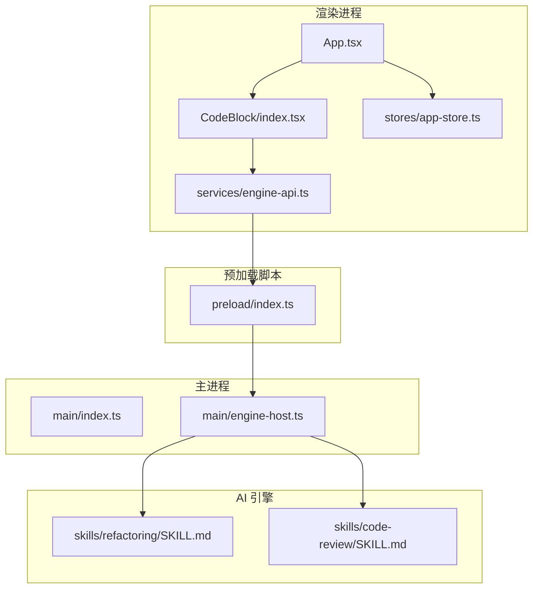
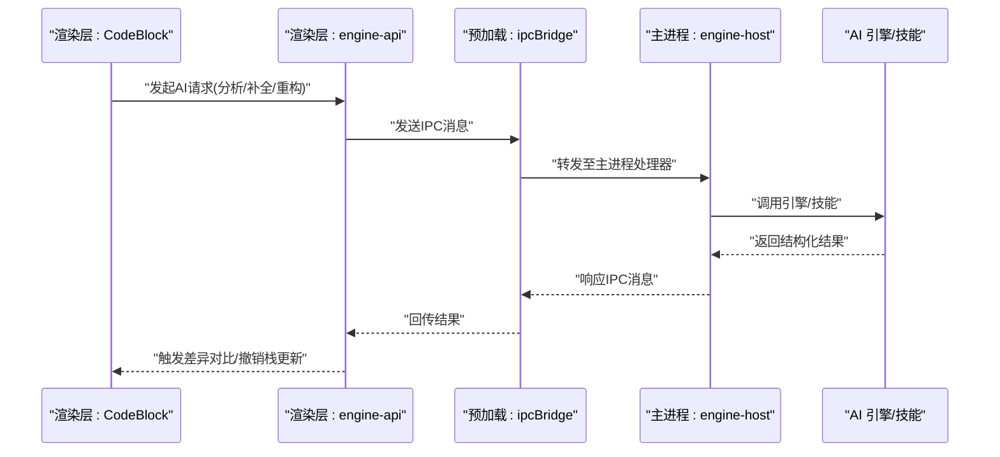
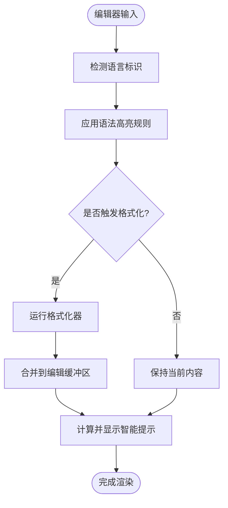
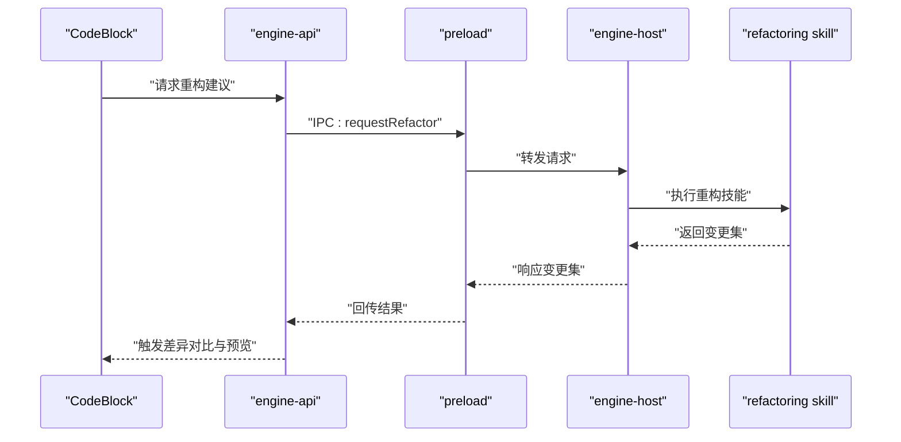
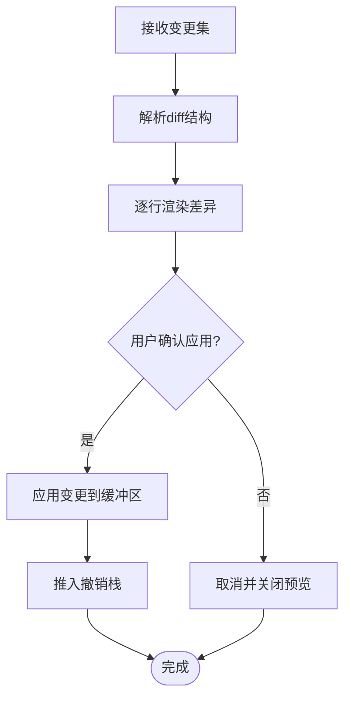
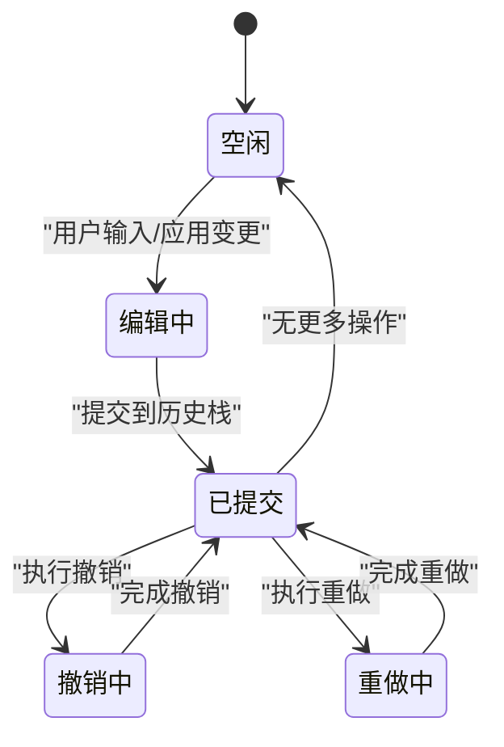
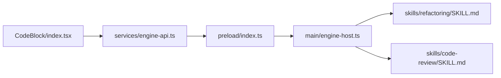

# 代码编辑器集成

<cite>
**本文引用的文件**   
- [app/renderer/src/components/CodeBlock/index.tsx](file://app/renderer/src/components/CodeBlock/index.tsx)
- [app/renderer/src/services/engine-api.ts](file://app/renderer/src/services/engine-api.ts)
- [app/main/engine-host.ts](file://app/main/engine-host.ts)
- [app/main/index.ts](file://app/main/index.ts)
- [app/preload/index.ts](file://app/preload/index.ts)
- [engine/skills/refactoring/SKILL.md](file://engine/skills/refactoring/SKILL.md)
- [engine/skills/code-review/SKILL.md](file://engine/skills/code-review/SKILL.md)
</cite>

## 目录
1. [简介](#简介)
2. [项目结构](#项目结构)
3. [核心组件](#核心组件)
4. [架构总览](#架构总览)
5. [详细组件分析](#详细组件分析)
6. [依赖关系分析](#依赖关系分析)
7. [性能考虑](#性能考虑)
8. [故障排查指南](#故障排查指南)
9. [结论](#结论)
10. [附录](#附录)

## 简介
本技术文档围绕 KCoder 的代码编辑器集成功能，系统性阐述以下方面：
- 代码块渲染机制：语法高亮、格式化与智能提示的协作方式
- 编辑器与 AI 引擎的集成：代码分析、自动补全与重构建议的生成流程
- 差异对比展示：AI 修改前后的变更可视化
- 版本控制与撤销重做：基于操作历史的状态管理
- 多语言支持与主题切换：语言包与主题配置
- 事件系统与扩展接口：插件化能力与外部工具桥接
- 性能优化策略：大文件渲染与内存管理
- 常见问题排查与调试技巧

## 项目结构
KCoder 采用 Electron 多进程架构，前端渲染层负责 UI 与交互，主进程负责系统资源与引擎通信，引擎侧提供 AI 能力与技能（Skill）体系。

图表来源
- [app/renderer/src/components/CodeBlock/index.tsx](file://app/renderer/src/components/CodeBlock/index.tsx)
- [app/renderer/src/services/engine-api.ts](file://app/renderer/src/services/engine-api.ts)
- [app/main/engine-host.ts](file://app/main/engine-host.ts)
- [app/main/index.ts](file://app/main/index.ts)
- [app/preload/index.ts](file://app/preload/index.ts)
- [engine/skills/refactoring/SKILL.md](file://engine/skills/refactoring/SKILL.md)
- [engine/skills/code-review/SKILL.md](file://engine/skills/code-review/SKILL.md)

章节来源
- [app/renderer/src/components/CodeBlock/index.tsx](file://app/renderer/src/components/CodeBlock/index.tsx)
- [app/renderer/src/services/engine-api.ts](file://app/renderer/src/services/engine-api.ts)
- [app/main/engine-host.ts](file://app/main/engine-host.ts)
- [app/main/index.ts](file://app/main/index.ts)
- [app/preload/index.ts](file://app/preload/index.ts)
- [engine/skills/refactoring/SKILL.md](file://engine/skills/refactoring/SKILL.md)
- [engine/skills/code-review/SKILL.md](file://engine/skills/code-review/SKILL.md)

## 核心组件
- 代码块组件：封装编辑器实例、渲染管线与交互事件，向上暴露统一 API
- 引擎 API 服务：封装与主进程及 AI 引擎的通信协议、错误处理与重试策略
- 主进程引擎宿主：维护引擎生命周期、会话状态、消息路由与权限校验
- 预加载桥接：安全暴露 IPC 通道，隔离上下文并最小化暴露面
- 引擎技能：以 Skill 形式声明 AI 能力（如重构、代码审查），由宿主按需加载与调度

章节来源
- [app/renderer/src/components/CodeBlock/index.tsx](file://app/renderer/src/components/CodeBlock/index.tsx)
- [app/renderer/src/services/engine-api.ts](file://app/renderer/src/services/engine-api.ts)
- [app/main/engine-host.ts](file://app/main/engine-host.ts)
- [app/preload/index.ts](file://app/preload/index.ts)
- [engine/skills/refactoring/SKILL.md](file://engine/skills/refactoring/SKILL.md)
- [engine/skills/code-review/SKILL.md](file://engine/skills/code-review/SKILL.md)

## 架构总览
整体数据与控制流如下：渲染层通过 CodeBlock 组件驱动编辑器行为；当需要 AI 能力时，调用 engine-api 服务，经由 preload 桥接到主进程的 engine-host；主进程根据请求类型路由到对应引擎模块或 Skill，返回结构化结果后，渲染层进行差异对比、撤销栈更新与 UI 刷新。

图表来源
- [app/renderer/src/components/CodeBlock/index.tsx](file://app/renderer/src/components/CodeBlock/index.tsx)
- [app/renderer/src/services/engine-api.ts](file://app/renderer/src/services/engine-api.ts)
- [app/preload/index.ts](file://app/preload/index.ts)
- [app/main/engine-host.ts](file://app/main/engine-host.ts)

## 详细组件分析

### 代码块渲染机制（语法高亮、格式化、智能提示）
- 语法高亮：按语言标识选择词法规则，增量解析可见区域，避免全量重绘
- 代码格式化：在保存或手动触发时执行格式化器，生成新内容后合并入编辑缓冲区
- 智能提示：监听输入事件，结合上下文与缓存，异步拉取补全项并去抖显示

章节来源
- [app/renderer/src/components/CodeBlock/index.tsx](file://app/renderer/src/components/CodeBlock/index.tsx)

### 编辑器与 AI 引擎集成（代码分析、自动补全、重构建议）
- 代码分析：将当前文件上下文与光标位置信息打包，发送至引擎进行分析，返回问题与建议
- 自动补全：基于上下文片段与缓存命中，快速返回候选列表
- 重构建议：调用 refactoring 技能，生成可应用的变更集，并在渲染层进行差异预览

图表来源
- [app/renderer/src/components/CodeBlock/index.tsx](file://app/renderer/src/components/CodeBlock/index.tsx)
- [app/renderer/src/services/engine-api.ts](file://app/renderer/src/services/engine-api.ts)
- [app/preload/index.ts](file://app/preload/index.ts)
- [app/main/engine-host.ts](file://app/main/engine-host.ts)
- [engine/skills/refactoring/SKILL.md](file://engine/skills/refactoring/SKILL.md)

章节来源
- [app/renderer/src/services/engine-api.ts](file://app/renderer/src/services/engine-api.ts)
- [app/main/engine-host.ts](file://app/main/engine-host.ts)
- [engine/skills/refactoring/SKILL.md](file://engine/skills/refactoring/SKILL.md)

### 差异对比功能（AI 修改前后变化展示）
- 变更集接收：从引擎返回 diff 对象，包含新增、删除与替换区间
- 行级高亮：对变更行进行颜色标记，支持折叠/展开查看
- 一键应用：用户确认后批量应用变更，写入缓冲区并记录到撤销栈

章节来源
- [app/renderer/src/components/CodeBlock/index.tsx](file://app/renderer/src/components/CodeBlock/index.tsx)

### 版本控制与撤销重做机制
- 操作历史：每次编辑或应用变更生成不可变快照，压入栈中
- 撤销/重做：基于栈指针移动，恢复或重放快照，确保一致性
- 事务性提交：批量变更作为一次事务，保证原子性与可回滚

章节来源
- [app/renderer/src/components/CodeBlock/index.tsx](file://app/renderer/src/components/CodeBlock/index.tsx)

### 多语言支持与主题切换
- 多语言：根据用户设置加载对应语言包，动态切换编辑器语言标识与界面文案
- 主题：切换主题时重新计算高亮规则与配色，避免全量重建以提升性能

章节来源
- [app/renderer/src/components/CodeBlock/index.tsx](file://app/renderer/src/components/CodeBlock/index.tsx)

### 事件系统与扩展接口
- 事件总线：编辑器内部事件（如 onDidChange、onSave、onApplyDiff）供上层订阅
- 扩展点：通过注册回调或中间件，实现自定义格式化器、提示源与差异渲染器
- 安全边界：所有扩展需通过预加载白名单与主进程校验

章节来源
- [app/preload/index.ts](file://app/preload/index.ts)
- [app/main/engine-host.ts](file://app/main/engine-host.ts)

## 依赖关系分析
渲染层与主进程通过预加载桥接，主进程再与引擎/技能交互。关键依赖如下：

图表来源
- [app/renderer/src/components/CodeBlock/index.tsx](file://app/renderer/src/components/CodeBlock/index.tsx)
- [app/renderer/src/services/engine-api.ts](file://app/renderer/src/services/engine-api.ts)
- [app/preload/index.ts](file://app/preload/index.ts)
- [app/main/engine-host.ts](file://app/main/engine-host.ts)
- [engine/skills/refactoring/SKILL.md](file://engine/skills/refactoring/SKILL.md)
- [engine/skills/code-review/SKILL.md](file://engine/skills/code-review/SKILL.md)

章节来源
- [app/renderer/src/components/CodeBlock/index.tsx](file://app/renderer/src/components/CodeBlock/index.tsx)
- [app/renderer/src/services/engine-api.ts](file://app/renderer/src/services/engine-api.ts)
- [app/preload/index.ts](file://app/preload/index.ts)
- [app/main/engine-host.ts](file://app/main/engine-host.ts)
- [engine/skills/refactoring/SKILL.md](file://engine/skills/refactoring/SKILL.md)
- [engine/skills/code-review/SKILL.md](file://engine/skills/code-review/SKILL.md)

## 性能考虑
- 大文件渲染优化
  - 虚拟滚动：仅渲染可视区域，减少 DOM 节点数量
  - 增量解析：按行/块粒度更新高亮与提示，避免整文件重算
  - 防抖与节流：对输入与提示请求进行限流，降低 CPU 与网络压力
- 内存管理
  - 历史快照压缩：对频繁小变更进行合并，限制栈深度
  - 变更集惰性加载：差异详情按需展开，避免一次性构建大型结构
- 网络与缓存
  - 补全与提示本地缓存，过期策略与失效通知
  - 失败重试与降级：网络异常时退回离线模式

[本节为通用指导，不直接分析具体文件]

## 故障排查指南
- 常见症状
  - 编辑器卡顿：检查是否开启全量高亮或禁用虚拟滚动
  - 补全延迟：确认防抖参数与缓存命中率
  - 差异未显示：核对 diff 结构与行号映射是否正确
- 定位步骤
  - 在渲染层添加日志输出，追踪事件序列与数据流向
  - 在主进程打印 IPC 消息体与耗时，识别瓶颈
  - 使用浏览器开发者工具观察内存占用与堆快照
- 修复建议
  - 调整渲染批次大小与滚动阈值
  - 增加超时与重试上限，避免长时间阻塞
  - 对大文件启用分片加载与懒解析

章节来源
- [app/renderer/src/components/CodeBlock/index.tsx](file://app/renderer/src/components/CodeBlock/index.tsx)
- [app/renderer/src/services/engine-api.ts](file://app/renderer/src/services/engine-api.ts)
- [app/main/engine-host.ts](file://app/main/engine-host.ts)

## 结论
KCoder 的代码编辑器集成通过清晰的组件分层与 IPC 桥接，实现了高效的渲染与强大的 AI 能力协同。借助差异对比、撤销重做与可扩展的事件系统，开发者可在保证性能的同时获得流畅的智能编辑体验。后续可继续完善缓存策略、扩展生态与监控指标，进一步提升稳定性与易用性。

[本节为总结性内容，不直接分析具体文件]

## 附录
- 术语表
  - 变更集：描述代码增删改的结构化数据
  - 撤销栈：记录编辑历史的可回滚数据结构
  - 技能（Skill）：引擎中以声明式方式提供的 AI 能力单元
- 参考路径
  - 代码块组件入口：[app/renderer/src/components/CodeBlock/index.tsx](file://app/renderer/src/components/CodeBlock/index.tsx)
  - 引擎 API 服务：[app/renderer/src/services/engine-api.ts](file://app/renderer/src/services/engine-api.ts)
  - 主进程引擎宿主：[app/main/engine-host.ts](file://app/main/engine-host.ts)
  - 预加载桥接：[app/preload/index.ts](file://app/preload/index.ts)
  - 重构技能说明：[engine/skills/refactoring/SKILL.md](file://engine/skills/refactoring/SKILL.md)
  - 代码审查技能说明：[engine/skills/code-review/SKILL.md](file://engine/skills/code-review/SKILL.md)