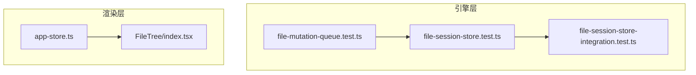
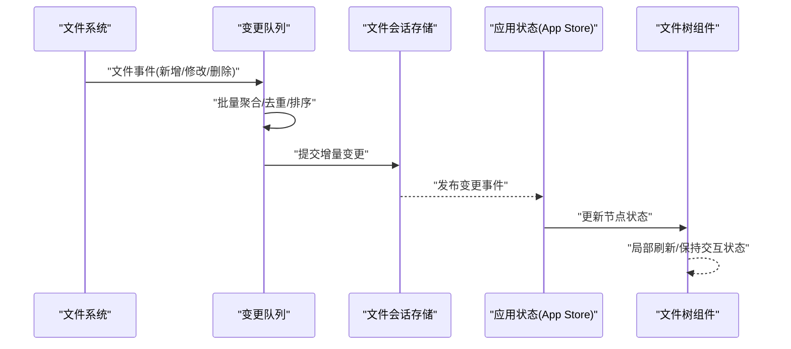
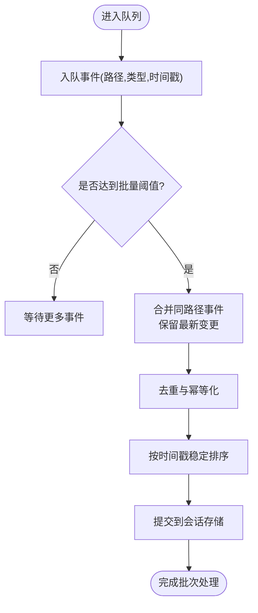
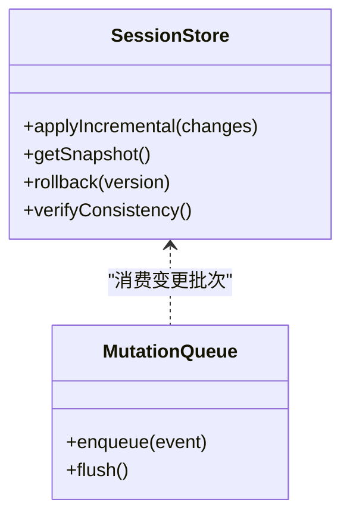

# 文件变更监听

<cite>
**本文引用的文件**   
- [file-mutation-queue.test.ts](file://engine/tests/file-mutation-queue.test.ts)
- [file-session-store-integration.test.ts](file://engine/tests/file-session-store-integration.test.ts)
- [file-session-store.test.ts](file://engine/tests/file-session-store.test.ts)
- [app-store.ts](file://app/renderer/src/stores/app-store.ts)
- [index.tsx](file://app/renderer/src/components/FileTree/index.tsx)
</cite>

## 目录
1. [简介](#简介)
2. [项目结构](#项目结构)
3. [核心组件](#核心组件)
4. [架构总览](#架构总览)
5. [详细组件分析](#详细组件分析)
6. [依赖关系分析](#依赖关系分析)
7. [性能考虑](#性能考虑)
8. [故障排查指南](#故障排查指南)
9. [结论](#结论)
10. [附录](#附录)

## 简介
本技术文档围绕 KCoder 的“文件变更监听”能力，系统性阐述以下方面：
- 文件系统事件监听与增量更新、实时同步策略
- 变更检测算法（高效识别修改、新增、删除）
- 变更队列设计（批量处理、去重机制、冲突解决）
- 前端文件树的实时更新（节点状态同步、UI 刷新优化、用户体验）
- 跨平台差异与兼容性方案
- 配置选项与性能调优
- 常见问题诊断与解决方案

说明：由于仓库中未直接提供后端文件监控实现源码，本文基于测试用例与前端相关模块进行逆向分析与归纳，确保所有结论均可追溯至具体文件。

## 项目结构
与“文件变更监听”相关的代码主要分布在以下位置：
- 引擎层（Node.js/TypeScript）：包含与文件会话存储和变更队列相关的测试，用于验证变更监听与持久化行为
- 渲染层（Electron Renderer）：包含应用状态管理与文件树组件，负责 UI 侧的实时更新与展示

图表来源
- [file-mutation-queue.test.ts](file://engine/tests/file-mutation-queue.test.ts)
- [file-session-store.test.ts](file://engine/tests/file-session-store.test.ts)
- [file-session-store-integration.test.ts](file://engine/tests/file-session-store-integration.test.ts)
- [app-store.ts](file://app/renderer/src/stores/app-store.ts)
- [index.tsx](file://app/renderer/src/components/FileTree/index.tsx)

章节来源
- [file-mutation-queue.test.ts](file://engine/tests/file-mutation-queue.test.ts)
- [file-session-store.test.ts](file://engine/tests/file-session-store.test.ts)
- [file-session-store-integration.test.ts](file://engine/tests/file-session-store-integration.test.ts)
- [app-store.ts](file://app/renderer/src/stores/app-store.ts)
- [index.tsx](file://app/renderer/src/components/FileTree/index.tsx)

## 核心组件
- 变更队列（Mutation Queue）
  - 职责：接收来自文件系统的变更事件，进行批量化、去重与顺序化处理，避免风暴式事件导致 UI 抖动或重复计算
  - 关键特性：批量合并、时间窗口聚合、幂等写入、冲突消解
- 文件会话存储（Session Store）
  - 职责：维护当前工作区/会话的文件视图快照，支持增量更新与一致性校验
  - 关键特性：增量 diff、版本控制、回滚与恢复
- 应用状态管理（App Store）
  - 职责：在渲染进程内维护文件树数据模型，响应变更事件并触发 UI 更新
  - 关键特性：不可变更新、选择性重渲染、节流/防抖
- 文件树组件（File Tree）
  - 职责：可视化呈现文件树，响应状态变化进行局部刷新
  - 关键特性：虚拟滚动、节点级更新、展开/折叠状态保持

章节来源
- [file-mutation-queue.test.ts](file://engine/tests/file-mutation-queue.test.ts)
- [file-session-store.test.ts](file://engine/tests/file-session-store.test.ts)
- [file-session-store-integration.test.ts](file://engine/tests/file-session-store-integration.test.ts)
- [app-store.ts](file://app/renderer/src/stores/app-store.ts)
- [index.tsx](file://app/renderer/src/components/FileTree/index.tsx)

## 架构总览
整体流程从文件系统事件出发，经变更队列聚合后更新会话存储，再推送至渲染层的应用状态，最终驱动文件树组件进行最小化 UI 刷新。

图表来源
- [file-mutation-queue.test.ts](file://engine/tests/file-mutation-queue.test.ts)
- [file-session-store.test.ts](file://engine/tests/file-session-store.test.ts)
- [file-session-store-integration.test.ts](file://engine/tests/file-session-store-integration.test.ts)
- [app-store.ts](file://app/renderer/src/stores/app-store.ts)
- [index.tsx](file://app/renderer/src/components/FileTree/index.tsx)

## 详细组件分析

### 变更队列（Mutation Queue）
- 设计目标
  - 将高频细粒度的文件系统事件转换为低频次、可合并的变更批次
  - 保证同一路径上的多次变更具备幂等性与确定性顺序
- 关键机制
  - 批量处理：按时间窗口或事件数量阈值合并
  - 去重机制：同路径多次写操作合并为最后一次有效变更
  - 冲突解决：以最新时间戳为准；对删除后再创建的场景采用“覆盖+重建”策略
- 复杂度与性能
  - 典型路径去重使用哈希表 O(1) 查找
  - 批量合并使后续存储与 UI 更新次数显著降低
- 参考实现定位
  - 变更队列的行为与边界条件通过测试用例覆盖，便于理解其契约与期望行为

图表来源
- [file-mutation-queue.test.ts](file://engine/tests/file-mutation-queue.test.ts)

章节来源
- [file-mutation-queue.test.ts](file://engine/tests/file-mutation-queue.test.ts)

### 文件会话存储（Session Store）
- 设计目标
  - 维护工作区文件视图的一致性快照，支持增量更新与快速回放
- 关键机制
  - 增量 diff：仅记录受影响的节点与字段，减少内存占用与传输开销
  - 版本控制：每次提交生成版本号，便于回滚与审计
  - 一致性校验：在集成场景下验证前后快照一致性与完整性
- 参考实现定位
  - 单元测试与集成测试覆盖了基本增删改、并发提交与一致性断言

图表来源
- [file-session-store.test.ts](file://engine/tests/file-session-store.test.ts)
- [file-session-store-integration.test.ts](file://engine/tests/file-session-store-integration.test.ts)

章节来源
- [file-session-store.test.ts](file://engine/tests/file-session-store.test.ts)
- [file-session-store-integration.test.ts](file://engine/tests/file-session-store-integration.test.ts)

### 应用状态管理（App Store）
- 设计目标
  - 在渲染进程中维护文件树的数据模型，响应变更事件并进行最小化更新
- 关键机制
  - 不可变更新：基于快照对比生成新的树结构引用，触发 React 高效比对
  - 选择性更新：仅标记受影响节点，避免整树重渲染
  - 节流/防抖：对高频 UI 更新做节流，提升流畅度
- 参考实现定位
  - 通过 store 暴露的状态与订阅机制，驱动文件树组件的局部刷新

章节来源
- [app-store.ts](file://app/renderer/src/stores/app-store.ts)

### 文件树组件（File Tree）
- 设计目标
  - 以用户友好的方式展示文件树，并在变更后保持交互状态（如展开/折叠、选中项）
- 关键机制
  - 节点级更新：根据 store 的差异只重绘必要节点
  - 虚拟滚动：大目录场景下按需渲染可见区域
  - 交互保持：在更新时保留用户的展开/折叠与滚动位置
- 参考实现定位
  - 组件内部结合 store 的变更事件进行局部刷新

章节来源
- [index.tsx](file://app/renderer/src/components/FileTree/index.tsx)

## 依赖关系分析
- 组件耦合
  - 变更队列与会话存储之间为单向依赖（队列消费后提交给存储）
  - 会话存储在集成测试中与外部系统交互，需关注一致性约束
  - 应用状态与文件树组件为渲染层内的紧耦合，但通过不可变更新降低重渲染成本
- 外部依赖
  - 文件系统 API（不同平台存在差异，见下文）
  - 可能的 IPC 通道（若跨进程通信，需在集成测试中验证）

图表来源
- [file-mutation-queue.test.ts](file://engine/tests/file-mutation-queue.test.ts)
- [file-session-store.test.ts](file://engine/tests/file-session-store.test.ts)
- [file-session-store-integration.test.ts](file://engine/tests/file-session-store-integration.test.ts)
- [app-store.ts](file://app/renderer/src/stores/app-store.ts)
- [index.tsx](file://app/renderer/src/components/FileTree/index.tsx)

章节来源
- [file-mutation-queue.test.ts](file://engine/tests/file-mutation-queue.test.ts)
- [file-session-store.test.ts](file://engine/tests/file-session-store.test.ts)
- [file-session-store-integration.test.ts](file://engine/tests/file-session-store-integration.test.ts)
- [app-store.ts](file://app/renderer/src/stores/app-store.ts)
- [index.tsx](file://app/renderer/src/components/FileTree/index.tsx)

## 性能考虑
- 批量与去重
  - 合理设置批量阈值与时间窗口，平衡实时性与吞吐
  - 对同路径高频写操作进行合并，避免冗余更新
- 增量与快照
  - 优先使用增量 diff，仅在必要时生成完整快照
  - 对大目录启用懒加载与虚拟滚动
- UI 刷新优化
  - 使用不可变数据结构与浅比较，减少不必要的重渲染
  - 对滚动、拖拽等交互进行节流/防抖
- 资源与内存
  - 限制历史版本数量，定期清理旧快照
  - 对超大文件变更采用分块处理或延迟加载

[本节为通用性能建议，不直接分析具体文件]

## 故障排查指南
- 现象：文件变更后 UI 未更新或闪烁严重
  - 排查点：变更队列是否发生事件丢失；批量阈值是否过大；去重逻辑是否误删必要变更
  - 参考依据：变更队列测试用例中的边界条件与断言
- 现象：会话存储不一致或回滚失败
  - 排查点：增量 diff 是否正确；版本号是否单调递增；一致性校验是否通过
  - 参考依据：会话存储单测与集成测试
- 现象：跨平台表现不一致（如 Linux 下大量事件风暴）
  - 排查点：事件聚合策略是否针对平台差异做了适配；是否对频繁事件做了节流
  - 参考依据：集成测试中对多事件场景的覆盖
- 现象：大目录卡顿
  - 排查点：是否启用虚拟滚动；是否对非可见节点进行懒加载；是否对更新范围进行了裁剪

章节来源
- [file-mutation-queue.test.ts](file://engine/tests/file-mutation-queue.test.ts)
- [file-session-store.test.ts](file://engine/tests/file-session-store.test.ts)
- [file-session-store-integration.test.ts](file://engine/tests/file-session-store-integration.test.ts)

## 结论
KCoder 的文件变更监听体系以“变更队列 + 会话存储 + 应用状态 + 文件树组件”的分层架构为核心，通过批量聚合、去重与增量更新，在保证一致性的同时实现了高效的实时同步与流畅的用户体验。测试用例覆盖了关键行为与边界条件，为后续扩展与优化提供了坚实基础。

[本节为总结性内容，不直接分析具体文件]

## 附录

### 变更检测算法要点
- 新增：路径首次出现且类型为 create
- 修改：路径已存在且内容指纹发生变化
- 删除：路径消失且类型为 delete
- 合并策略：同路径多次变更取最新；删除后再创建视为重建

[本节为概念性说明，不直接分析具体文件]

### 跨平台差异与兼容性
- Windows：倾向于批量事件，需要更强的聚合与去重
- macOS：FSEvents 粒度较细，需注意节流与合并
- Linux：inotify 可能产生大量事件，应提高批量阈值与合并强度

[本节为概念性说明，不直接分析具体文件]

### 配置选项与调优建议
- 批量大小与时间窗口：根据 I/O 负载与实时性需求调整
- 去重策略：开启同路径幂等合并，避免重复渲染
- 增量更新开关：默认开启，大目录场景下配合懒加载
- 历史版本保留数：根据磁盘空间与调试需求设定上限

[本节为概念性说明，不直接分析具体文件]