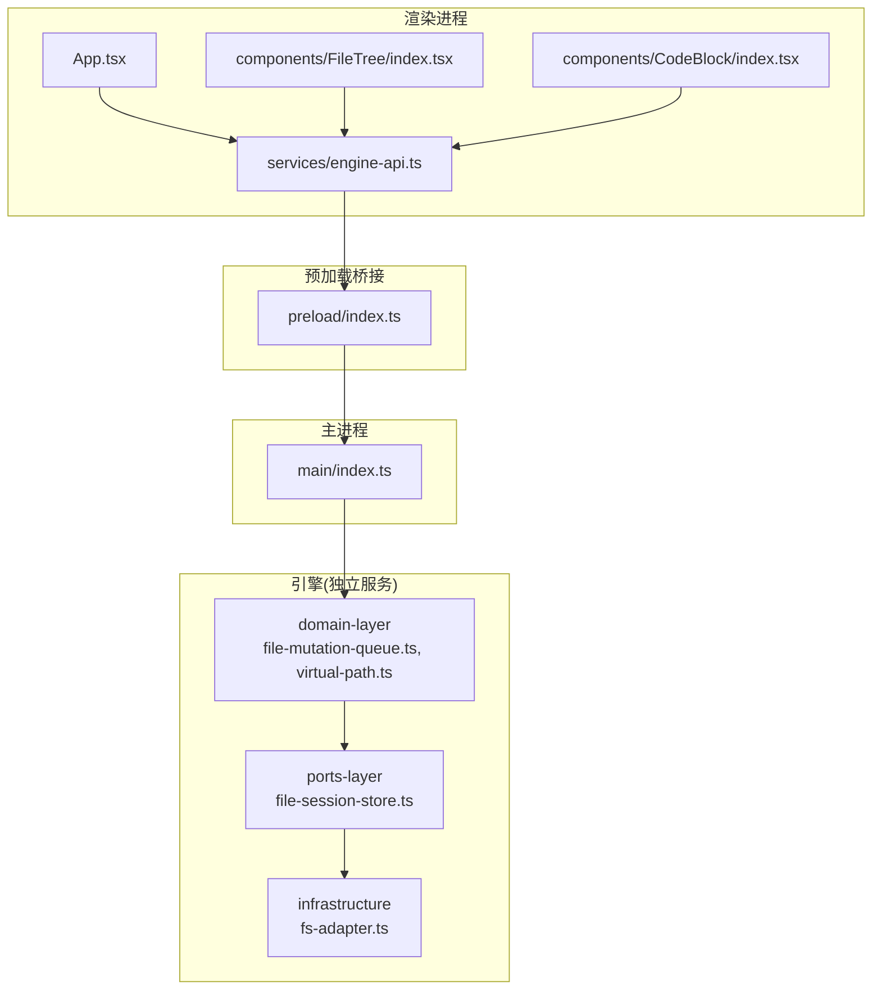
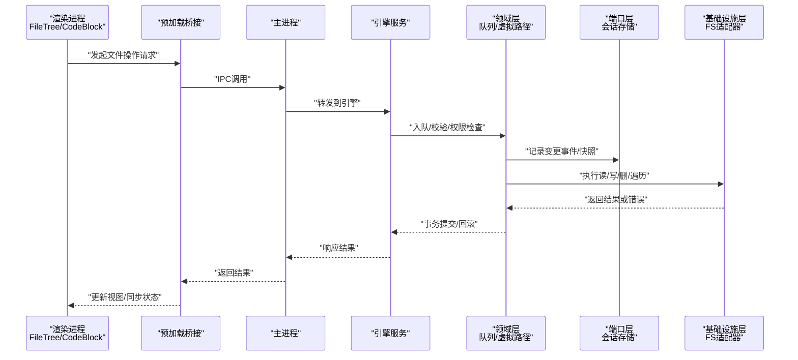
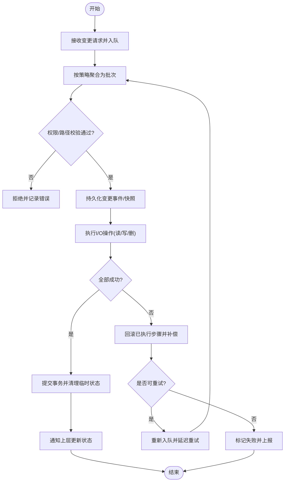
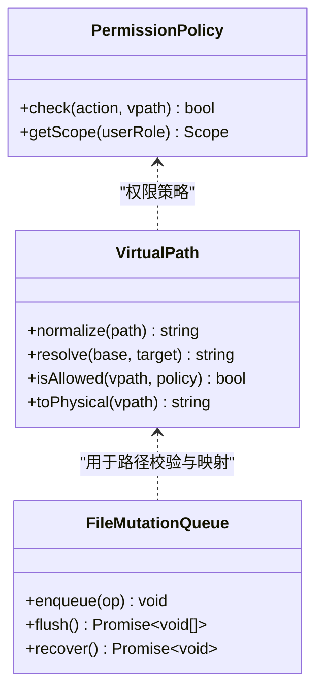
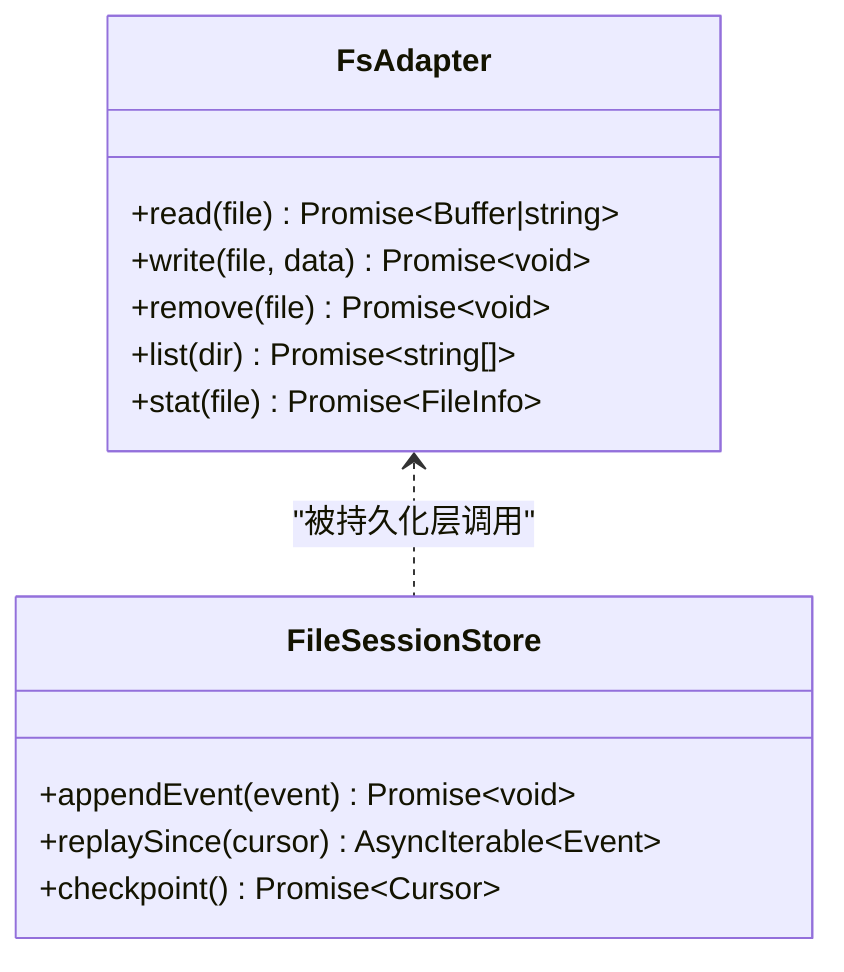
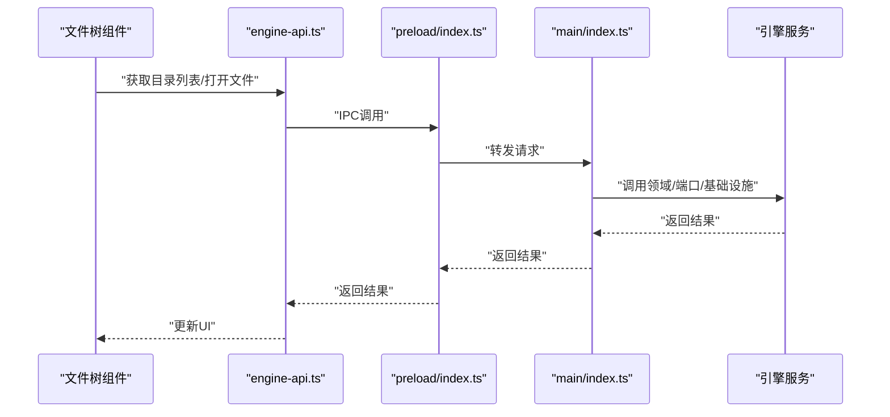

# 文件操作

<cite>
**本文引用的文件**   
- [engine/README.md](file://engine/README.md)
- [engine/package.json](file://engine/package.json)
- [engine/tsconfig.json](file://engine/tsconfig.json)
- [engine/pnpm-workspace.yaml](file://engine/pnpm-workspace.yaml)
- [app/package.json](file://app/package.json)
- [app/electron.vite.config.ts](file://app/electron.vite.config.ts)
- [app/src/main/index.ts](file://app/src/main/index.ts)
- [app/src/preload/index.ts](file://app/src/preload/index.ts)
- [app/src/renderer/src/App.tsx](file://app/src/renderer/src/App.tsx)
- [app/src/renderer/src/services/engine-api.ts](file://app/src/renderer/src/services/engine-api.ts)
- [app/src/renderer/src/components/FileTree/index.tsx](file://app/src/renderer/src/components/FileTree/index.tsx)
- [app/src/renderer/src/components/CodeBlock/index.tsx](file://app/src/renderer/src/components/CodeBlock/index.tsx)
- [engine/packages/domain-layer/src/file-mutation-queue.ts](file://engine/packages/domain-layer/src/file-mutation-queue.ts)
- [engine/packages/domain-layer/src/virtual-path.ts](file://engine/packages/domain-layer/src/virtual-path.ts)
- [engine/packages/infrastructure/src/fs-adapter.ts](file://engine/packages/infrastructure/src/fs-adapter.ts)
- [engine/packages/ports-layer/src/file-session-store.ts](file://engine/packages/ports-layer/src/file-session-store.ts)
- [engine/tests/file-mutation-queue.test.ts](file://engine/tests/file-mutation-queue.test.ts)
- [engine/tests/virtual-path.test.ts](file://engine/tests/virtual-path.test.ts)
</cite>

## 目录
1. [简介](#简介)
2. [项目结构](#项目结构)
3. [核心组件](#核心组件)
4. [架构总览](#架构总览)
5. [详细组件分析](#详细组件分析)
6. [依赖关系分析](#依赖关系分析)
7. [性能考虑](#性能考虑)
8. [故障排查指南](#故障排查指南)
9. [结论](#结论)
10. [附录：API 与使用示例](#附录api-与使用示例)

## 简介
本技术文档聚焦于KCoder的文件操作能力，覆盖以下关键主题：
- 文件系统访问与安全控制（读取、写入、删除）
- 文件变更监听与实时同步
- 文件操作队列（批量处理、事务管理、错误恢复）
- 文件树（目录展示、节点展开折叠、搜索过滤）
- 代码块语法高亮与编辑
- 虚拟路径系统与权限控制
- API接口与使用示例
- 性能优化策略（大文件、内存管理）
- 与其他系统集成（版本控制、云存储）

## 项目结构
KCoder采用Electron多进程架构，前端渲染进程通过预加载脚本与主进程通信，再由主进程调用引擎服务完成文件操作。引擎内部以领域层、端口层、基础设施层等分层组织，提供可插拔的适配器与持久化实现。

图表来源
- [app/src/renderer/src/App.tsx](file://app/src/renderer/src/App.tsx)
- [app/src/renderer/src/services/engine-api.ts](file://app/src/renderer/src/services/engine-api.ts)
- [app/src/renderer/src/components/FileTree/index.tsx](file://app/src/renderer/src/components/FileTree/index.tsx)
- [app/src/renderer/src/components/CodeBlock/index.tsx](file://app/src/renderer/src/components/CodeBlock/index.tsx)
- [app/src/preload/index.ts](file://app/src/preload/index.ts)
- [app/src/main/index.ts](file://app/src/main/index.ts)
- [engine/packages/domain-layer/src/file-mutation-queue.ts](file://engine/packages/domain-layer/src/file-mutation-queue.ts)
- [engine/packages/domain-layer/src/virtual-path.ts](file://engine/packages/domain-layer/src/virtual-path.ts)
- [engine/packages/ports-layer/src/file-session-store.ts](file://engine/packages/ports-layer/src/file-session-store.ts)
- [engine/packages/infrastructure/src/fs-adapter.ts](file://engine/packages/infrastructure/src/fs-adapter.ts)

章节来源
- [engine/README.md](file://engine/README.md)
- [engine/package.json](file://engine/package.json)
- [engine/tsconfig.json](file://engine/tsconfig.json)
- [engine/pnpm-workspace.yaml](file://engine/pnpm-workspace.yaml)
- [app/package.json](file://app/package.json)
- [app/electron.vite.config.ts](file://app/electron.vite.config.ts)
- [app/src/main/index.ts](file://app/src/main/index.ts)
- [app/src/preload/index.ts](file://app/src/preload/index.ts)
- [app/src/renderer/src/App.tsx](file://app/src/renderer/src/App.tsx)
- [app/src/renderer/src/services/engine-api.ts](file://app/src/renderer/src/services/engine-api.ts)

## 核心组件
- 文件操作队列：负责将文件变更请求入队、批处理、事务提交与失败回滚，保障一致性与幂等性。
- 虚拟路径系统：抽象物理路径与逻辑路径映射，支持权限边界与命名空间隔离。
- 文件系统适配器：封装底层文件系统读写、删除、遍历等操作，统一错误模型。
- 文件会话存储：持久化文件变更事件与状态，支撑崩溃恢复与会话回放。
- 前端文件树与代码块：提供目录浏览、节点交互、搜索过滤与语法高亮编辑体验。

章节来源
- [engine/packages/domain-layer/src/file-mutation-queue.ts](file://engine/packages/domain-layer/src/file-mutation-queue.ts)
- [engine/packages/domain-layer/src/virtual-path.ts](file://engine/packages/domain-layer/src/virtual-path.ts)
- [engine/packages/infrastructure/src/fs-adapter.ts](file://engine/packages/infrastructure/src/fs-adapter.ts)
- [engine/packages/ports-layer/src/file-session-store.ts](file://engine/packages/ports-layer/src/file-session-store.ts)
- [app/src/renderer/src/components/FileTree/index.tsx](file://app/src/renderer/src/components/FileTree/index.tsx)
- [app/src/renderer/src/components/CodeBlock/index.tsx](file://app/src/renderer/src/components/CodeBlock/index.tsx)

## 架构总览
整体数据流从渲染进程发起，经预加载桥接到主进程，再转发至引擎服务。引擎在领域层进行业务编排（队列、权限、事务），通过端口层对接持久化，最终由基础设施层执行真实I/O。

图表来源
- [app/src/renderer/src/components/FileTree/index.tsx](file://app/src/renderer/src/components/FileTree/index.tsx)
- [app/src/renderer/src/components/CodeBlock/index.tsx](file://app/src/renderer/src/components/CodeBlock/index.tsx)
- [app/src/preload/index.ts](file://app/src/preload/index.ts)
- [app/src/main/index.ts](file://app/src/main/index.ts)
- [engine/packages/domain-layer/src/file-mutation-queue.ts](file://engine/packages/domain-layer/src/file-mutation-queue.ts)
- [engine/packages/domain-layer/src/virtual-path.ts](file://engine/packages/domain-layer/src/virtual-path.ts)
- [engine/packages/ports-layer/src/file-session-store.ts](file://engine/packages/ports-layer/src/file-session-store.ts)
- [engine/packages/infrastructure/src/fs-adapter.ts](file://engine/packages/infrastructure/src/fs-adapter.ts)

## 详细组件分析

### 文件操作队列
职责与特性：
- 入队与批处理：将多个文件变更合并为批次，减少I/O次数。
- 事务管理：同一批次内要么全部成功，要么全部回滚，保证一致性。
- 错误恢复：失败时重试、退避与补偿；持久化中间状态以便崩溃后恢复。
- 幂等性：对重复提交的变更具备去重与幂等处理能力。

图表来源
- [engine/packages/domain-layer/src/file-mutation-queue.ts](file://engine/packages/domain-layer/src/file-mutation-queue.ts)
- [engine/packages/ports-layer/src/file-session-store.ts](file://engine/packages/ports-layer/src/file-session-store.ts)
- [engine/tests/file-mutation-queue.test.ts](file://engine/tests/file-mutation-queue.test.ts)

章节来源
- [engine/packages/domain-layer/src/file-mutation-queue.ts](file://engine/packages/domain-layer/src/file-mutation-queue.ts)
- [engine/packages/ports-layer/src/file-session-store.ts](file://engine/packages/ports-layer/src/file-session-store.ts)
- [engine/tests/file-mutation-queue.test.ts](file://engine/tests/file-mutation-queue.test.ts)

### 虚拟路径系统与权限控制
设计要点：
- 虚拟路径：将逻辑路径映射到实际物理路径，支持命名空间与沙箱隔离。
- 权限控制：基于角色/资源粒度进行访问控制，限制越权访问。
- 规范化与校验：统一路径分隔符、解析相对路径、防止路径穿越。

图表来源
- [engine/packages/domain-layer/src/virtual-path.ts](file://engine/packages/domain-layer/src/virtual-path.ts)
- [engine/packages/domain-layer/src/file-mutation-queue.ts](file://engine/packages/domain-layer/src/file-mutation-queue.ts)
- [engine/tests/virtual-path.test.ts](file://engine/tests/virtual-path.test.ts)

章节来源
- [engine/packages/domain-layer/src/virtual-path.ts](file://engine/packages/domain-layer/src/virtual-path.ts)
- [engine/tests/virtual-path.test.ts](file://engine/tests/virtual-path.test.ts)

### 文件系统适配器
职责：
- 统一封装读、写、删、遍历、元数据查询等基础操作。
- 标准化错误类型与消息，便于上层捕获与重试。
- 可选地集成缓存、压缩、分块传输等扩展点。

图表来源
- [engine/packages/infrastructure/src/fs-adapter.ts](file://engine/packages/infrastructure/src/fs-adapter.ts)
- [engine/packages/ports-layer/src/file-session-store.ts](file://engine/packages/ports-layer/src/file-session-store.ts)

章节来源
- [engine/packages/infrastructure/src/fs-adapter.ts](file://engine/packages/infrastructure/src/fs-adapter.ts)
- [engine/packages/ports-layer/src/file-session-store.ts](file://engine/packages/ports-layer/src/file-session-store.ts)

### 前端文件树与代码块
文件树：
- 目录结构展示：递归加载子节点，按需懒加载以提升性能。
- 节点展开/折叠：维护本地状态，避免重复请求。
- 搜索过滤：客户端模糊匹配与高亮显示。

代码块：
- 语法高亮：根据语言选择对应高亮器，增量渲染降低卡顿。
- 编辑功能：撤销/重做、自动补全、保存触发文件写入。

图表来源
- [app/src/renderer/src/components/FileTree/index.tsx](file://app/src/renderer/src/components/FileTree/index.tsx)
- [app/src/renderer/src/services/engine-api.ts](file://app/src/renderer/src/services/engine-api.ts)
- [app/src/preload/index.ts](file://app/src/preload/index.ts)
- [app/src/main/index.ts](file://app/src/main/index.ts)
- [engine/packages/domain-layer/src/file-mutation-queue.ts](file://engine/packages/domain-layer/src/file-mutation-queue.ts)
- [engine/packages/infrastructure/src/fs-adapter.ts](file://engine/packages/infrastructure/src/fs-adapter.ts)

章节来源
- [app/src/renderer/src/components/FileTree/index.tsx](file://app/src/renderer/src/components/FileTree/index.tsx)
- [app/src/renderer/src/components/CodeBlock/index.tsx](file://app/src/renderer/src/components/CodeBlock/index.tsx)
- [app/src/renderer/src/services/engine-api.ts](file://app/src/renderer/src/services/engine-api.ts)
- [app/src/preload/index.ts](file://app/src/preload/index.ts)
- [app/src/main/index.ts](file://app/src/main/index.ts)

## 依赖关系分析
- 渲染层依赖预加载桥接与主进程IPC通道。
- 主进程作为代理转发请求至引擎服务。
- 引擎领域层依赖端口层与基础设施层，形成清晰的分层解耦。
- 测试用例验证队列与虚拟路径行为，确保契约稳定。

图表来源
- [app/src/renderer/src/App.tsx](file://app/src/renderer/src/App.tsx)
- [app/src/renderer/src/components/FileTree/index.tsx](file://app/src/renderer/src/components/FileTree/index.tsx)
- [app/src/renderer/src/components/CodeBlock/index.tsx](file://app/src/renderer/src/components/CodeBlock/index.tsx)
- [app/src/preload/index.ts](file://app/src/preload/index.ts)
- [app/src/main/index.ts](file://app/src/main/index.ts)
- [engine/packages/domain-layer/src/file-mutation-queue.ts](file://engine/packages/domain-layer/src/file-mutation-queue.ts)
- [engine/packages/domain-layer/src/virtual-path.ts](file://engine/packages/domain-layer/src/virtual-path.ts)
- [engine/packages/ports-layer/src/file-session-store.ts](file://engine/packages/ports-layer/src/file-session-store.ts)
- [engine/packages/infrastructure/src/fs-adapter.ts](file://engine/packages/infrastructure/src/fs-adapter.ts)

章节来源
- [engine/tests/file-mutation-queue.test.ts](file://engine/tests/file-mutation-queue.test.ts)
- [engine/tests/virtual-path.test.ts](file://engine/tests/virtual-path.test.ts)

## 性能考虑
- 大文件处理：
  - 分块读取/写入，避免一次性加载到内存。
  - 流式传输与增量同步，减少带宽与CPU占用。
- 内存管理：
  - 文件树懒加载与分页，仅渲染可见节点。
  - 代码块高亮增量计算，避免整篇重绘。
- I/O优化：
  - 批量合并与事务提交，降低系统调用次数。
  - 合理设置超时与重试退避，避免雪崩。
- 缓存策略：
  - 目录结构与元数据短期缓存，命中优先。
  - 变更事件去重与合并，减少冗余处理。

[本节为通用指导，不直接分析具体文件]

## 故障排查指南
- 常见错误定位：
  - 权限不足：检查虚拟路径策略与用户角色。
  - 路径非法：确认路径规范化与相对路径解析。
  - I/O失败：查看适配器错误码与重试计数。
- 恢复机制：
  - 利用会话存储回放最近事件，重建状态。
  - 队列失败项进入死信队列，人工介入或自动补偿。
- 日志与观测：
  - 记录关键操作的时间戳、路径、大小与耗时。
  - 监控队列积压、重试率与失败分布。

章节来源
- [engine/packages/domain-layer/src/file-mutation-queue.ts](file://engine/packages/domain-layer/src/file-mutation-queue.ts)
- [engine/packages/ports-layer/src/file-session-store.ts](file://engine/packages/ports-layer/src/file-session-store.ts)
- [engine/packages/infrastructure/src/fs-adapter.ts](file://engine/packages/infrastructure/src/fs-adapter.ts)

## 结论
KCoder的文件操作体系通过分层设计与可插拔适配器，实现了安全可控、可扩展且高性能的文件管理能力。队列与事务保障了数据一致性，虚拟路径与权限策略提供了灵活的安全边界，前端组件则提供了良好的交互体验。结合会话持久化与恢复机制，系统在复杂场景下仍保持稳定与可靠。

[本节为总结，不直接分析具体文件]

## 附录：API 与使用示例
说明：以下为面向调用方的概念性接口定义，具体参数与返回值以各模块契约为准。

- 文件读取
  - 方法：readFile
  - 输入：虚拟路径、选项（编码、分块大小）
  - 输出：内容或分块流
  - 错误：权限拒绝、路径不存在、I/O异常

- 文件写入
  - 方法：writeFile
  - 输入：虚拟路径、内容、选项（原子写入、覆盖策略）
  - 输出：写入结果
  - 错误：权限拒绝、磁盘空间不足、写入中断

- 文件删除
  - 方法：deleteFile
  - 输入：虚拟路径、级联选项
  - 输出：删除结果
  - 错误：权限拒绝、路径不存在、正在使用中

- 目录遍历
  - 方法：listDir
  - 输入：虚拟路径、分页参数
  - 输出：条目列表与元信息
  - 错误：权限拒绝、路径不存在

- 变更监听
  - 方法：watchChanges
  - 输入：根路径、过滤器
  - 输出：变更事件流
  - 错误：权限拒绝、监听失败

- 会话回放
  - 方法：replayFrom
  - 输入：游标/时间戳
  - 输出：事件序列
  - 错误：游标无效、存储不可用

使用示例（概念流程）：
- 打开文件：调用readFile获取内容，渲染到代码块组件，启用语法高亮。
- 保存修改：将编辑器内容写入队列，等待事务提交成功后刷新文件树。
- 监听变化：订阅watchChanges事件，当外部修改发生时，提示用户合并或重载。

章节来源
- [app/src/renderer/src/services/engine-api.ts](file://app/src/renderer/src/services/engine-api.ts)
- [engine/packages/domain-layer/src/file-mutation-queue.ts](file://engine/packages/domain-layer/src/file-mutation-queue.ts)
- [engine/packages/ports-layer/src/file-session-store.ts](file://engine/packages/ports-layer/src/file-session-store.ts)
- [engine/packages/infrastructure/src/fs-adapter.ts](file://engine/packages/infrastructure/src/fs-adapter.ts)