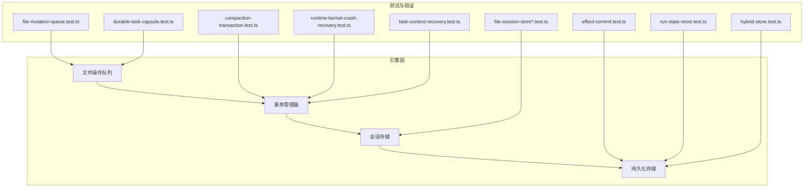
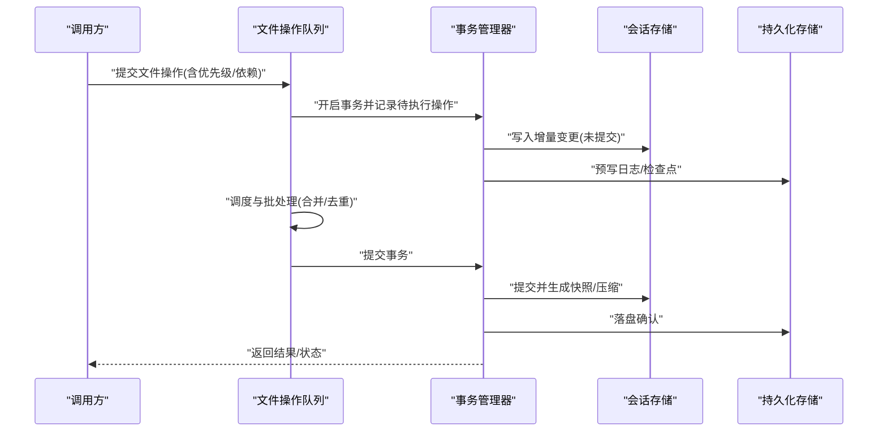
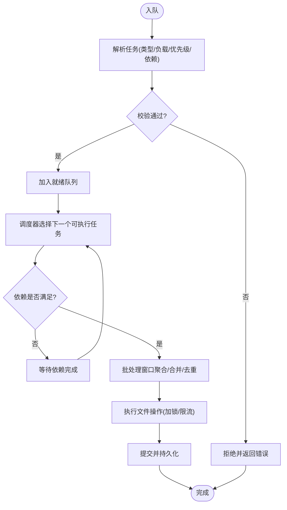
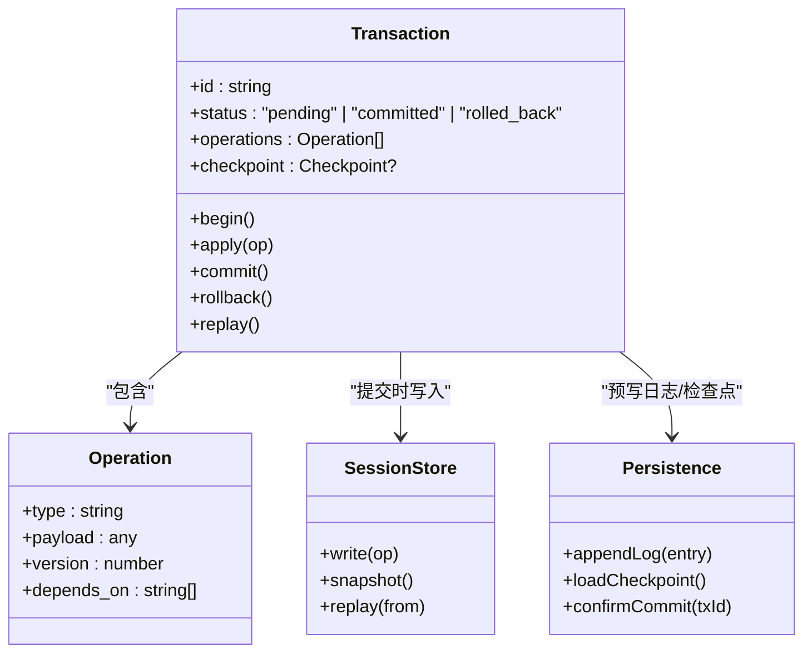
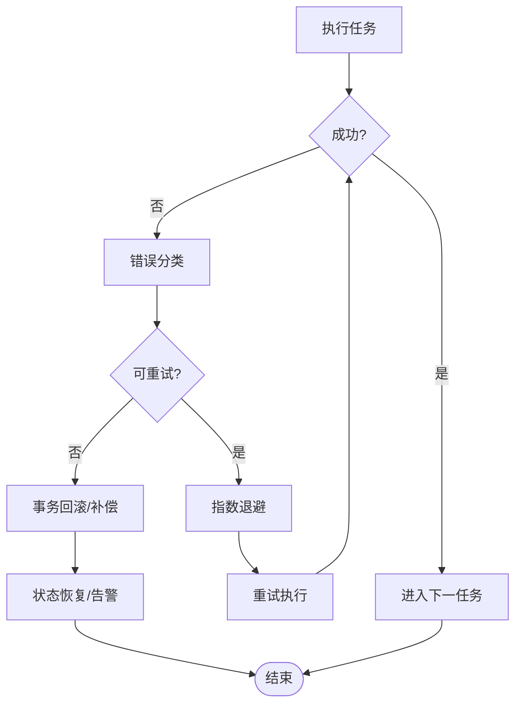
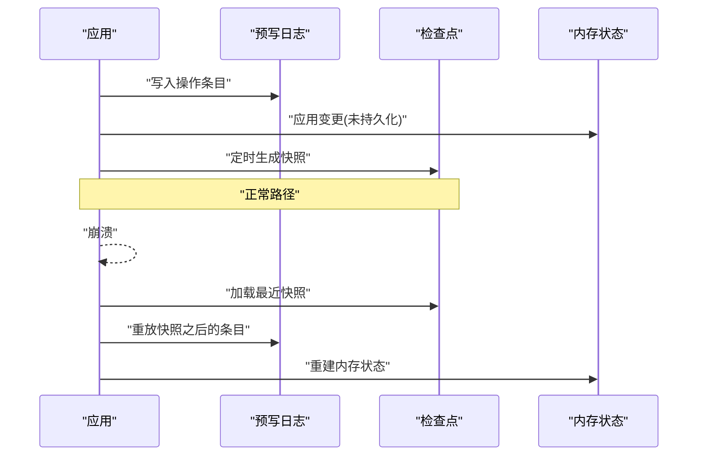
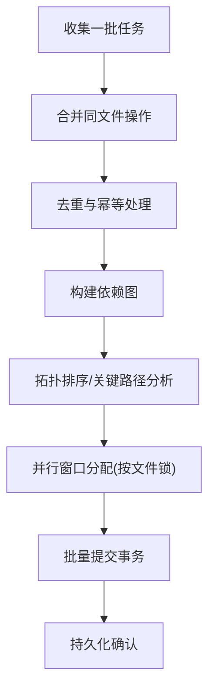
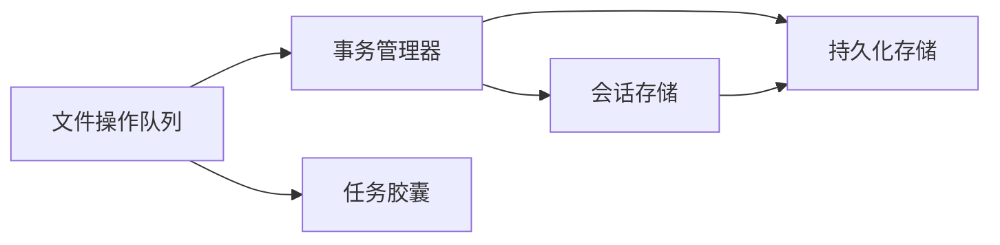

# 文件操作队列

<cite>
**本文引用的文件**   
- [file-mutation-queue.test.ts](file://engine/tests/file-mutation-queue.test.ts)
- [file-session-store-integration.test.ts](file://engine/tests/file-session-store-integration.test.ts)
- [file-session-store.test.ts](file://engine/tests/file-session-store.test.ts)
- [compaction-transaction.test.ts](file://engine/tests/compaction-transaction.test.ts)
- [effect-commit.test.ts](file://engine/tests/effect-commit.test.ts)
- [durable-task-capsule.test.ts](file://engine/tests/durable-task-capsule.test.ts)
- [runtime-kernel-crash-recovery.test.ts](file://engine/tests/runtime-kernel-crash-recovery.test.ts)
- [task-context-recovery.test.ts](file://engine/tests/task-context-recovery.test.ts)
- [run-state-store.test.ts](file://engine/tests/run-state-store.test.ts)
- [hybrid-store.test.ts](file://engine/tests/hybrid-store.test.ts)
</cite>

## 目录
1. [简介](#简介)
2. [项目结构](#项目结构)
3. [核心组件](#核心组件)
4. [架构总览](#架构总览)
5. [详细组件分析](#详细组件分析)
6. [依赖分析](#依赖分析)
7. [性能考虑](#性能考虑)
8. [故障排查指南](#故障排查指南)
9. [结论](#结论)
10. [附录](#附录)

## 简介
本技术文档围绕“文件操作队列”能力，系统化阐述其数据结构、任务调度与优先级管理、并发控制、事务机制（原子性、一致性、可恢复性）、批量处理策略（合并、依赖分析与执行优化）、错误处理与重试（失败回滚、补偿操作、状态恢复）、持久化方案（不丢失与崩溃恢复），以及配置参数与性能调优建议。同时提供监控与调试工具的使用指引，帮助读者快速理解并高效使用该系统。

## 项目结构
仓库采用多包工程组织，核心实现位于 engine/packages 下，测试用例集中于 engine/tests。与“文件操作队列”直接相关的验证点主要分布在以下测试文件中：
- 文件变更队列行为与边界条件：file-mutation-queue.test.ts
- 文件会话存储集成与端到端流程：file-session-store-integration.test.ts、file-session-store.test.ts
- 事务与压缩（Compaction）相关：compaction-transaction.test.ts
- 效果提交与持久化：effect-commit.test.ts、durable-task-capsule.test.ts
- 崩溃恢复与上下文恢复：runtime-kernel-crash-recovery.test.ts、task-context-recovery.test.ts
- 运行态状态存储与混合存储：run-state-store.test.ts、hybrid-store.test.ts

图表来源
- [file-mutation-queue.test.ts:1-200](file://engine/tests/file-mutation-queue.test.ts#L1-L200)
- [file-session-store-integration.test.ts:1-200](file://engine/tests/file-session-store-integration.test.ts#L1-L200)
- [file-session-store.test.ts:1-200](file://engine/tests/file-session-store.test.ts#L1-L200)
- [compaction-transaction.test.ts:1-200](file://engine/tests/compaction-transaction.test.ts#L1-L200)
- [effect-commit.test.ts:1-200](file://engine/tests/effect-commit.test.ts#L1-L200)
- [durable-task-capsule.test.ts:1-200](file://engine/tests/durable-task-capsule.test.ts#L1-L200)
- [runtime-kernel-crash-recovery.test.ts:1-200](file://engine/tests/runtime-kernel-crash-recovery.test.ts#L1-L200)
- [task-context-recovery.test.ts:1-200](file://engine/tests/task-context-recovery.test.ts#L1-L200)
- [run-state-store.test.ts:1-200](file://engine/tests/run-state-store.test.ts#L1-L200)
- [hybrid-store.test.ts:1-200](file://engine/tests/hybrid-store.test.ts#L1-L200)

章节来源
- [file-mutation-queue.test.ts:1-200](file://engine/tests/file-mutation-queue.test.ts#L1-L200)
- [file-session-store-integration.test.ts:1-200](file://engine/tests/file-session-store-integration.test.ts#L1-L200)
- [file-session-store.test.ts:1-200](file://engine/tests/file-session-store.test.ts#L1-L200)
- [compaction-transaction.test.ts:1-200](file://engine/tests/compaction-transaction.test.ts#L1-L200)
- [effect-commit.test.ts:1-200](file://engine/tests/effect-commit.test.ts#L1-L200)
- [durable-task-capsule.test.ts:1-200](file://engine/tests/durable-task-capsule.test.ts#L1-L200)
- [runtime-kernel-crash-recovery.test.ts:1-200](file://engine/tests/runtime-kernel-crash-recovery.test.ts#L1-L200)
- [task-context-recovery.test.ts:1-200](file://engine/tests/task-context-recovery.test.ts#L1-L200)
- [run-state-store.test.ts:1-200](file://engine/tests/run-state-store.test.ts#L1-L200)
- [hybrid-store.test.ts:1-200](file://engine/tests/hybrid-store.test.ts#L1-L200)

## 核心组件
- 文件操作队列：负责接收、排序、调度与执行文件变更任务，支持优先级与批处理。
- 事务管理器：封装操作的原子提交、回滚与重放，保障一致性与可恢复性。
- 会话存储：维护文件会话的增量变更与快照，支撑压缩与回放。
- 持久化存储：提供事件/状态的落盘能力，确保崩溃后恢复。
- 任务胶囊：将任务与其副作用、检查点与元数据打包，便于持久化与重放。

章节来源
- [file-mutation-queue.test.ts:1-200](file://engine/tests/file-mutation-queue.test.ts#L1-L200)
- [file-session-store.test.ts:1-200](file://engine/tests/file-session-store.test.ts#L1-L200)
- [compaction-transaction.test.ts:1-200](file://engine/tests/compaction-transaction.test.ts#L1-L200)
- [effect-commit.test.ts:1-200](file://engine/tests/effect-commit.test.ts#L1-L200)
- [durable-task-capsule.test.ts:1-200](file://engine/tests/durable-task-capsule.test.ts#L1-L200)

## 架构总览
下图展示了从入队到持久化的关键路径，以及事务与压缩在其中的作用。

图表来源
- [file-mutation-queue.test.ts:1-200](file://engine/tests/file-mutation-queue.test.ts#L1-L200)
- [file-session-store-integration.test.ts:1-200](file://engine/tests/file-session-store-integration.test.ts#L1-L200)
- [compaction-transaction.test.ts:1-200](file://engine/tests/compaction-transaction.test.ts#L1-L200)
- [effect-commit.test.ts:1-200](file://engine/tests/effect-commit.test.ts#L1-L200)
- [durable-task-capsule.test.ts:1-200](file://engine/tests/durable-task-capsule.test.ts#L1-L200)

## 详细组件分析

### 文件操作队列：数据结构与调度
- 任务模型
  - 标识与版本：用于幂等与冲突检测。
  - 类型与负载：如创建、删除、覆盖、追加等。
  - 优先级：数值或等级，影响出队顺序。
  - 依赖关系：指向前置任务ID，形成有向无环图（DAG）。
  - 时间戳与序列号：保证全局有序与因果一致性。
- 调度与优先级
  - 基于优先级的就绪队列，结合依赖解析进行拓扑排序。
  - 支持同优先级内的FIFO或按时间戳排序。
- 并发控制
  - 单消费者串行执行同一文件的变更，避免写竞争。
  - 跨文件变更可并行执行，受最大并发度限制。
  - 通过锁或令牌桶控制并发上限，防止资源耗尽。
- 批处理策略
  - 合并：相邻的同文件写操作可合并为一次写入。
  - 去重：相同键值对的去重与幂等提交。
  - 窗口聚合：在固定时间窗口内收集任务，统一提交。
  - 依赖分析：在执行前完成依赖满足性检查，提前阻塞不可执行任务。

图表来源
- [file-mutation-queue.test.ts:1-200](file://engine/tests/file-mutation-queue.test.ts#L1-L200)

章节来源
- [file-mutation-queue.test.ts:1-200](file://engine/tests/file-mutation-queue.test.ts#L1-L200)

### 事务管理机制：原子性、一致性与可恢复性
- 原子性
  - 事务内所有变更要么全部提交，要么全部回滚。
  - 提交前仅写入内存/预写日志，提交成功后才应用至会话存储。
- 一致性
  - 提交时校验约束（如文件存在性、权限、大小限制）。
  - 通过版本号/哈希校验避免脏写与覆盖。
- 可恢复性
  - 预写日志（WAL）记录事务开始、操作序列与提交标记。
  - 崩溃恢复时重放未完成事务，或根据检查点回滚。
- 压缩（Compaction）
  - 定期将多次变更压缩为快照，减少回放成本。
  - 压缩过程需保持事务边界，避免中间状态暴露。

图表来源
- [compaction-transaction.test.ts:1-200](file://engine/tests/compaction-transaction.test.ts#L1-L200)
- [effect-commit.test.ts:1-200](file://engine/tests/effect-commit.test.ts#L1-L200)
- [durable-task-capsule.test.ts:1-200](file://engine/tests/durable-task-capsule.test.ts#L1-L200)

章节来源
- [compaction-transaction.test.ts:1-200](file://engine/tests/compaction-transaction.test.ts#L1-L200)
- [effect-commit.test.ts:1-200](file://engine/tests/effect-commit.test.ts#L1-L200)
- [durable-task-capsule.test.ts:1-200](file://engine/tests/durable-task-capsule.test.ts#L1-L200)

### 错误处理与重试机制
- 失败分类
  - 可重试错误：网络抖动、临时I/O拥塞。
  - 不可重试错误：权限不足、格式非法、依赖缺失。
- 重试策略
  - 指数退避与抖动，避免雪崩。
  - 最大重试次数与超时控制。
- 回滚与补偿
  - 事务级回滚：撤销已应用的变更。
  - 补偿操作：针对外部副作用（如通知、索引更新）执行反向操作。
- 状态恢复
  - 崩溃后从最近检查点+未提交日志恢复。
  - 任务胶囊携带执行上下文，支持断点续跑。

图表来源
- [runtime-kernel-crash-recovery.test.ts:1-200](file://engine/tests/runtime-kernel-crash-recovery.test.ts#L1-L200)
- [task-context-recovery.test.ts:1-200](file://engine/tests/task-context-recovery.test.ts#L1-L200)
- [durable-task-capsule.test.ts:1-200](file://engine/tests/durable-task-capsule.test.ts#L1-L200)

章节来源
- [runtime-kernel-crash-recovery.test.ts:1-200](file://engine/tests/runtime-kernel-crash-recovery.test.ts#L1-L200)
- [task-context-recovery.test.ts:1-200](file://engine/tests/task-context-recovery.test.ts#L1-L200)
- [durable-task-capsule.test.ts:1-200](file://engine/tests/durable-task-capsule.test.ts#L1-L200)

### 队列持久化方案：不丢失与崩溃恢复
- 预写日志（WAL）
  - 每条事务/操作先落盘再执行，确保顺序与完整性。
  - 支持分段与滚动，避免单文件过大。
- 检查点（Snapshot）
  - 周期性生成会话快照，缩短恢复时间。
  - 快照与日志联合使用，支持任意时间点恢复。
- 混合存储
  - 热数据驻留内存，冷数据归档磁盘。
  - 读写路径透明切换，兼顾性能与容量。
- 崩溃恢复流程
  - 启动时加载最新检查点，重放后续日志。
  - 识别未完成事务并回滚，清理悬挂锁。

图表来源
- [file-session-store-integration.test.ts:1-200](file://engine/tests/file-session-store-integration.test.ts#L1-L200)
- [run-state-store.test.ts:1-200](file://engine/tests/run-state-store.test.ts#L1-L200)
- [hybrid-store.test.ts:1-200](file://engine/tests/hybrid-store.test.ts#L1-L200)

章节来源
- [file-session-store-integration.test.ts:1-200](file://engine/tests/file-session-store-integration.test.ts#L1-L200)
- [run-state-store.test.ts:1-200](file://engine/tests/run-state-store.test.ts#L1-L200)
- [hybrid-store.test.ts:1-200](file://engine/tests/hybrid-store.test.ts#L1-L200)

### 批量处理策略：合并、依赖分析与执行优化
- 操作合并
  - 同文件连续写入合并为一次大写入，降低系统调用开销。
  - 文本差异合并，保留最小必要变更。
- 依赖分析
  - 构建任务DAG，计算最长路径与关键路径。
  - 动态解锁：当依赖完成后立即提升任务优先级。
- 执行优化
  - 批提交：将多个小事务合并为一个事务提交，减少落盘次数。
  - 并行窗口：按文件粒度并行，跨文件互不影响。
  - 背压：当持久化延迟超过阈值时暂停入队，保护系统稳定。

图表来源
- [file-mutation-queue.test.ts:1-200](file://engine/tests/file-mutation-queue.test.ts#L1-L200)
- [compaction-transaction.test.ts:1-200](file://engine/tests/compaction-transaction.test.ts#L1-L200)

章节来源
- [file-mutation-queue.test.ts:1-200](file://engine/tests/file-mutation-queue.test.ts#L1-L200)
- [compaction-transaction.test.ts:1-200](file://engine/tests/compaction-transaction.test.ts#L1-L200)

## 依赖分析
- 内部依赖
  - 队列依赖事务管理器与持久化接口；事务管理器依赖会话存储与持久化。
  - 任务胶囊贯穿队列、事务与持久化，承载上下文与检查点。
- 外部依赖
  - 文件系统API、锁服务、指标与日志系统。
- 潜在循环依赖
  - 通过接口抽象与依赖注入解耦，避免模块间强耦合。

图表来源
- [file-mutation-queue.test.ts:1-200](file://engine/tests/file-mutation-queue.test.ts#L1-L200)
- [durable-task-capsule.test.ts:1-200](file://engine/tests/durable-task-capsule.test.ts#L1-L200)
- [effect-commit.test.ts:1-200](file://engine/tests/effect-commit.test.ts#L1-L200)

章节来源
- [file-mutation-queue.test.ts:1-200](file://engine/tests/file-mutation-queue.test.ts#L1-L200)
- [durable-task-capsule.test.ts:1-200](file://engine/tests/durable-task-capsule.test.ts#L1-L200)
- [effect-commit.test.ts:1-200](file://engine/tests/effect-commit.test.ts#L1-L200)

## 性能考虑
- 批处理窗口大小与频率：平衡吞吐与延迟，避免长尾。
- 合并与去重阈值：根据文件大小与变更密度调整。
- 并发度与文件锁粒度：按文件加锁，最大化并行度。
- 持久化策略：WAL分段大小、检查点间隔、异步落盘。
- 背压与限流：监控持久化延迟与队列长度，动态调节入队速率。
- 压缩策略：压缩周期与快照粒度，权衡回放时间与存储占用。

[本节为通用指导，无需具体文件引用]

## 故障排查指南
- 常见问题定位
  - 任务堆积：检查依赖是否长期未满足、是否存在死锁或锁未释放。
  - 重复执行：核对任务幂等键与版本号，确认去重逻辑生效。
  - 数据不一致：查看事务提交标记与WAL顺序，确认是否有部分提交。
  - 崩溃恢复失败：检查最近检查点是否损坏，WAL是否完整。
- 诊断手段
  - 启用详细日志：记录事务生命周期、任务状态转换与持久化事件。
  - 指标采集：队列长度、平均延迟、提交成功率、重试次数。
  - 快照与日志导出：用于离线回放与问题复现。
- 恢复步骤
  - 停止入队，清理悬挂锁。
  - 加载最近有效检查点并重放日志。
  - 校验最终状态一致性，必要时触发补偿操作。

章节来源
- [runtime-kernel-crash-recovery.test.ts:1-200](file://engine/tests/runtime-kernel-crash-recovery.test.ts#L1-L200)
- [task-context-recovery.test.ts:1-200](file://engine/tests/task-context-recovery.test.ts#L1-L200)
- [run-state-store.test.ts:1-200](file://engine/tests/run-state-store.test.ts#L1-L200)

## 结论
文件操作队列通过“任务模型+事务+持久化”的组合，实现了高可靠、可恢复的文件变更处理能力。借助批处理、依赖分析与并发控制，系统在吞吐与延迟之间取得良好平衡。配合完善的错误处理与监控调试手段，可在复杂场景下保持稳定与一致。

[本节为总结性内容，无需具体文件引用]

## 附录
- 配置参数建议
  - 批处理窗口：根据业务峰值与延迟目标设定。
  - 最大并发度：依据CPU与I/O能力评估。
  - 检查点间隔：在恢复时间与存储开销间折中。
  - 重试退避：初始延迟、最大次数与抖动范围。
- 监控与调试
  - 关键指标：入队速率、出队速率、提交耗时、重试率、队列深度。
  - 调试工具：事务回放器、依赖图可视化、快照对比工具。

[本节为补充信息，无需具体文件引用]