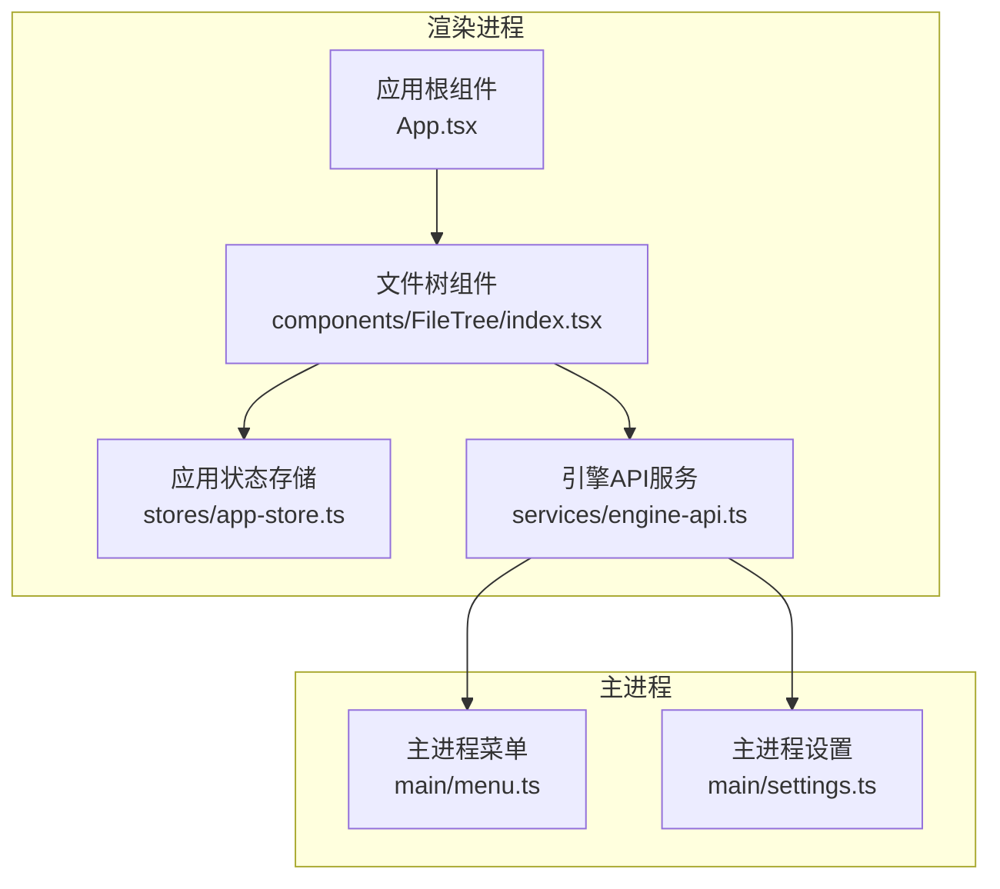
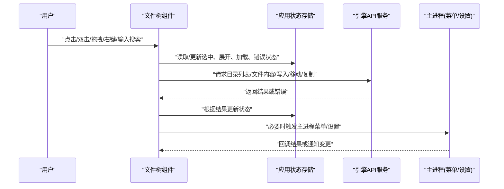
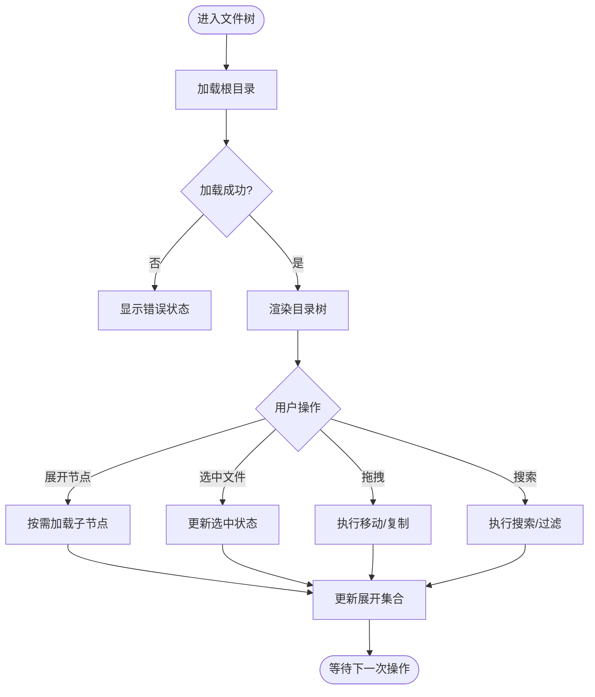
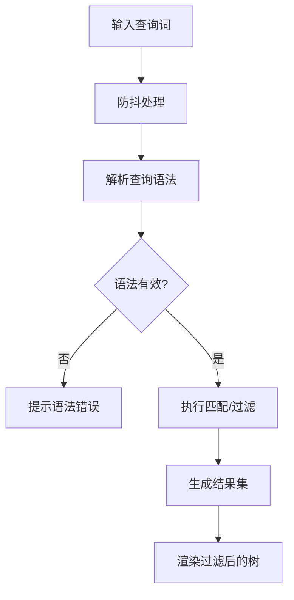
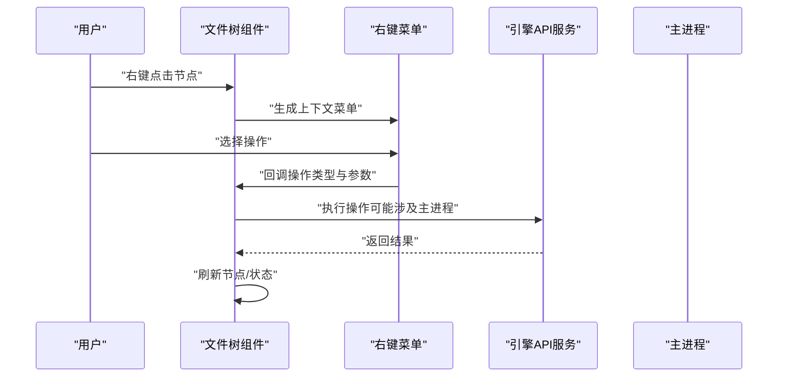
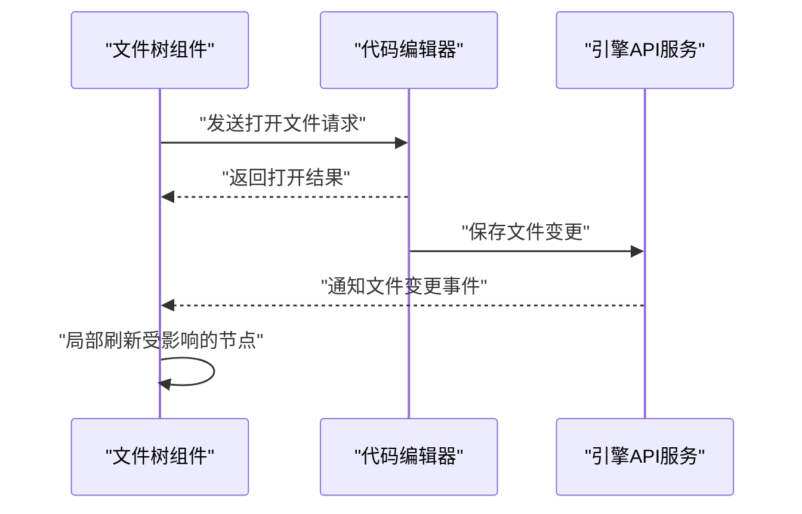
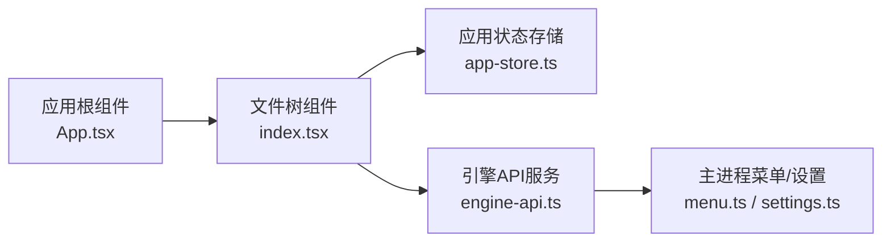

# 文件树组件

<cite>
**本文引用的文件**   
- [app/renderer/src/components/FileTree/index.tsx](file://app/renderer/src/components/FileTree/index.tsx)
- [app/renderer/src/stores/app-store.ts](file://app/renderer/src/stores/app-store.ts)
- [app/renderer/src/services/engine-api.ts](file://app/renderer/src/services/engine-api.ts)
- [app/main/menu.ts](file://app/main/menu.ts)
- [app/main/settings.ts](file://app/main/settings.ts)
- [app/renderer/src/App.tsx](file://app/renderer/src/App.tsx)
</cite>

## 目录
1. [简介](#简介)
2. [项目结构](#项目结构)
3. [核心组件](#核心组件)
4. [架构总览](#架构总览)
5. [详细组件分析](#详细组件分析)
6. [依赖分析](#依赖分析)
7. [性能考虑](#性能考虑)
8. [故障排查指南](#故障排查指南)
9. [结论](#结论)
10. [附录](#附录)

## 简介
本文件为 KCoder 前端“文件树”组件的用户界面文档，聚焦于视觉设计、交互模式与状态管理，并说明搜索过滤、右键菜单、与代码编辑器的集成方式、自定义配置与样式定制方法，以及响应式设计与无障碍访问支持。该组件位于渲染进程，通过服务层与引擎通信，负责展示项目目录结构、节点展开/折叠、选中与加载状态、拖拽操作以及与编辑器联动打开/保存/同步等能力。

## 项目结构
文件树组件位于渲染进程的 components 目录下，并与全局应用状态 store、引擎 API 服务以及主进程菜单/设置模块协作。整体采用分层组织：UI 组件层（FileTree）、状态管理层（app-store）、数据通信层（engine-api）以及主进程入口（menu/settings）。

图表来源
- [app/renderer/src/components/FileTree/index.tsx](file://app/renderer/src/components/FileTree/index.tsx)
- [app/renderer/src/stores/app-store.ts](file://app/renderer/src/stores/app-store.ts)
- [app/renderer/src/services/engine-api.ts](file://app/renderer/src/services/engine-api.ts)
- [app/main/menu.ts](file://app/main/menu.ts)
- [app/main/settings.ts](file://app/main/settings.ts)
- [app/renderer/src/App.tsx](file://app/renderer/src/App.tsx)

章节来源
- [app/renderer/src/components/FileTree/index.tsx](file://app/renderer/src/components/FileTree/index.tsx)
- [app/renderer/src/stores/app-store.ts](file://app/renderer/src/stores/app-store.ts)
- [app/renderer/src/services/engine-api.ts](file://app/renderer/src/services/engine-api.ts)
- [app/main/menu.ts](file://app/main/menu.ts)
- [app/main/settings.ts](file://app/main/settings.ts)
- [app/renderer/src/App.tsx](file://app/renderer/src/App.tsx)

## 核心组件
- 文件树组件（FileTree）
  - 职责：渲染目录树、处理节点展开/折叠、选中、拖拽、右键菜单、搜索与过滤、与编辑器联动。
  - 关键交互：点击节点切换选中；双击打开文件；拖拽文件或文件夹到目标位置；右键上下文菜单触发操作；输入框进行文件名匹配与类型筛选。
  - 状态映射：从 app-store 读取当前选中文件、已展开路径集合、加载与错误状态；向 engine-api 发起目录枚举、文件读写、移动/复制等操作请求。
- 应用状态存储（app-store）
  - 职责：集中管理文件树相关状态（如 selectedFilePath、expandedPaths、loading、error），提供订阅更新机制供 UI 消费。
- 引擎API服务（engine-api）
  - 职责：封装与引擎的通信协议，暴露目录列表、文件内容读写、重命名、删除、移动/复制、批量操作等方法。
- 主进程菜单与设置（main/menu.ts, main/settings.ts）
  - 职责：提供系统级菜单项与偏好设置，部分文件操作可通过主进程权限执行或持久化用户配置。

章节来源
- [app/renderer/src/components/FileTree/index.tsx](file://app/renderer/src/components/FileTree/index.tsx)
- [app/renderer/src/stores/app-store.ts](file://app/renderer/src/stores/app-store.ts)
- [app/renderer/src/services/engine-api.ts](file://app/renderer/src/services/engine-api.ts)
- [app/main/menu.ts](file://app/main/menu.ts)
- [app/main/settings.ts](file://app/main/settings.ts)

## 架构总览
文件树组件在渲染进程中运行，通过 app-store 获取和更新状态，并通过 engine-api 调用引擎侧能力。主进程菜单与设置作为外部扩展点，与引擎 API 协同完成需要更高权限的操作。

图表来源
- [app/renderer/src/components/FileTree/index.tsx](file://app/renderer/src/components/FileTree/index.tsx)
- [app/renderer/src/stores/app-store.ts](file://app/renderer/src/stores/app-store.ts)
- [app/renderer/src/services/engine-api.ts](file://app/renderer/src/services/engine-api.ts)
- [app/main/menu.ts](file://app/main/menu.ts)
- [app/main/settings.ts](file://app/main/settings.ts)

## 详细组件分析

### 视觉设计与交互模式
- 目录结构展示
  - 以层级缩进呈现目录与文件，支持图标区分文件类型与目录。
  - 节点前缀包含展开/折叠指示器，用于控制子节点的可见性。
- 节点展开/折叠
  - 点击父节点或指示器可展开/折叠子节点；首次展开时按需拉取目录列表。
  - 支持键盘导航：方向键移动焦点，回车确认选择，空格切换展开/折叠。
- 选中状态
  - 单选或多选（取决于配置）；高亮显示当前选中项；支持 Shift/Ctrl 多选。
- 拖拽操作
  - 支持将文件/文件夹拖放到其他目录实现移动或复制；拖放过程中显示插入位置预览。
  - 拖拽开始/结束/悬停均有明确反馈（阴影、边框高亮）。
- 右键菜单
  - 针对文件与目录提供上下文相关操作：打开、重命名、删除、复制、粘贴、移动到、属性查看等。
  - 菜单项根据上下文动态启用/禁用（例如未选中时禁用删除）。
- 搜索与过滤
  - 文本框支持文件名模糊匹配；可选按扩展名或文件类型筛选。
  - 高级查询语法：支持通配符、正则表达式、组合条件（AND/OR/NOT）等（由配置开关控制）。
- 与编辑器集成
  - 双击文件或在菜单中选择“打开”，将文件路径推送至编辑器；若已有标签页则切换，否则新建。
  - 文件保存后自动刷新对应节点状态；跨进程同步确保视图与磁盘一致。

章节来源
- [app/renderer/src/components/FileTree/index.tsx](file://app/renderer/src/components/FileTree/index.tsx)
- [app/renderer/src/stores/app-store.ts](file://app/renderer/src/stores/app-store.ts)
- [app/renderer/src/services/engine-api.ts](file://app/renderer/src/services/engine-api.ts)
- [app/main/menu.ts](file://app/main/menu.ts)

### 状态管理
- 关键状态字段
  - 选中文件路径：selectedFilePath
  - 已展开路径集合：expandedPaths
  - 加载状态：loading（含细分：rootLoading、nodeLoading）
  - 错误状态：error（含网络错误、权限错误、IO 错误等）
  - 搜索与过滤：searchQuery、filterType、advancedMode
- 状态更新流程
  - 用户交互触发事件 → 组件内部预处理 → 更新本地状态 → 调用 engine-api 执行副作用 → 接收结果 → 回写 app-store → 驱动 UI 重新渲染。
- 错误处理策略
  - 捕获引擎返回的错误码，转换为友好的提示；对不可恢复错误提供重试与上报入口。
  - 对超时、断网等异常进行降级显示，并提供“重试”按钮。

图表来源
- [app/renderer/src/components/FileTree/index.tsx](file://app/renderer/src/components/FileTree/index.tsx)
- [app/renderer/src/stores/app-store.ts](file://app/renderer/src/stores/app-store.ts)
- [app/renderer/src/services/engine-api.ts](file://app/renderer/src/services/engine-api.ts)

章节来源
- [app/renderer/src/components/FileTree/index.tsx](file://app/renderer/src/components/FileTree/index.tsx)
- [app/renderer/src/stores/app-store.ts](file://app/renderer/src/stores/app-store.ts)
- [app/renderer/src/services/engine-api.ts](file://app/renderer/src/services/engine-api.ts)

### 搜索与过滤功能
- 基础匹配
  - 支持不区分大小写的文件名模糊匹配。
- 类型筛选
  - 按扩展名或 MIME 类型快速过滤。
- 高级查询语法
  - 支持通配符（*、?）、正则表达式、布尔组合（AND/OR/NOT）、分组括号等。
  - 提供语法校验与错误提示，避免无效查询导致性能问题。
- 性能优化
  - 防抖输入、增量匹配、虚拟滚动（当节点数量较大时）。
  - 缓存最近搜索结果，减少重复计算。

图表来源
- [app/renderer/src/components/FileTree/index.tsx](file://app/renderer/src/components/FileTree/index.tsx)
- [app/renderer/src/services/engine-api.ts](file://app/renderer/src/services/engine-api.ts)

章节来源
- [app/renderer/src/components/FileTree/index.tsx](file://app/renderer/src/components/FileTree/index.tsx)
- [app/renderer/src/services/engine-api.ts](file://app/renderer/src/services/engine-api.ts)

### 右键菜单实现
- 上下文感知
  - 根据选中对象类型（文件/目录）动态生成菜单项。
  - 根据权限与当前状态禁用不可用项（如无写入权限时禁用删除/重命名）。
- 常用操作
  - 打开、重命名、删除、复制、粘贴、移动到、属性查看、在终端中打开等。
- 快捷键与键盘可达性
  - 支持键盘触发菜单（Shift+F10 或上下文键），Tab 导航，Enter 确认。
- 与主进程集成
  - 某些操作需主进程权限（如系统级打开、批量删除），通过 engine-api 转发到主进程菜单/设置模块。

图表来源
- [app/renderer/src/components/FileTree/index.tsx](file://app/renderer/src/components/FileTree/index.tsx)
- [app/renderer/src/services/engine-api.ts](file://app/renderer/src/services/engine-api.ts)
- [app/main/menu.ts](file://app/main/menu.ts)

章节来源
- [app/renderer/src/components/FileTree/index.tsx](file://app/renderer/src/components/FileTree/index.tsx)
- [app/main/menu.ts](file://app/main/menu.ts)

### 与代码编辑器的集成
- 打开文件
  - 双击文件或选择“打开”后，将文件路径发送至编辑器；若已存在标签页则切换，否则新建。
- 保存与同步
  - 编辑器保存后，文件树自动刷新受影响节点；支持增量同步以减少不必要的重绘。
- 冲突与一致性
  - 监听文件系统变更事件，合并来自多源的修改，保证视图与磁盘一致。
- 错误与提示
  - 打开失败时显示原因（权限不足、路径不存在等），并提供重试或定位选项。

图表来源
- [app/renderer/src/components/FileTree/index.tsx](file://app/renderer/src/components/FileTree/index.tsx)
- [app/renderer/src/services/engine-api.ts](file://app/renderer/src/services/engine-api.ts)

章节来源
- [app/renderer/src/components/FileTree/index.tsx](file://app/renderer/src/components/FileTree/index.tsx)
- [app/renderer/src/services/engine-api.ts](file://app/renderer/src/services/engine-api.ts)

### 自定义配置与样式定制
- 配置项（示例）
  - 默认展开深度：控制初次渲染时的展开层级。
  - 是否启用高级查询：开启/关闭高级搜索语法。
  - 拖拽行为：仅移动或允许复制。
  - 主题与图标：文件类型图标集、颜色方案。
  - 键盘导航：是否启用、快捷键映射。
- 样式定制
  - 通过 CSS 变量或主题接口覆盖节点背景、选中态、悬停态、分隔线等。
  - 支持暗色/亮色主题切换，适配不同环境。
- 扩展点
  - 注册自定义文件类型图标与操作项。
  - 注入自定义过滤器或排序规则。

章节来源
- [app/renderer/src/components/FileTree/index.tsx](file://app/renderer/src/components/FileTree/index.tsx)
- [app/main/settings.ts](file://app/main/settings.ts)

### 响应式设计
- 布局自适应
  - 在小屏幕下自动收起次要信息，调整缩进与图标尺寸。
- 触控友好
  - 增大点击区域，支持长按弹出上下文菜单。
- 性能优化
  - 使用虚拟列表渲染大量节点，避免卡顿。

章节来源
- [app/renderer/src/components/FileTree/index.tsx](file://app/renderer/src/components/FileTree/index.tsx)

### 无障碍访问（A11y）
- 键盘可达性
  - 完整的 Tab/Shift+Tab 导航，方向键移动焦点，Enter/Space 确认与切换。
- 语义化与ARIA
  - 为树节点提供 role="treeitem"、aria-expanded、aria-selected 等属性。
- 屏幕阅读器
  - 提供清晰的节点描述与状态提示（如“已选中”、“加载中”、“错误”）。
- 对比度与焦点可见性
  - 遵循 WCAG 对比度要求，确保焦点指示清晰可见。

章节来源
- [app/renderer/src/components/FileTree/index.tsx](file://app/renderer/src/components/FileTree/index.tsx)

## 依赖分析
文件树组件依赖应用状态存储与引擎 API 服务，同时与主进程菜单/设置模块间接耦合。

图表来源
- [app/renderer/src/components/FileTree/index.tsx](file://app/renderer/src/components/FileTree/index.tsx)
- [app/renderer/src/stores/app-store.ts](file://app/renderer/src/stores/app-store.ts)
- [app/renderer/src/services/engine-api.ts](file://app/renderer/src/services/engine-api.ts)
- [app/main/menu.ts](file://app/main/menu.ts)
- [app/main/settings.ts](file://app/main/settings.ts)
- [app/renderer/src/App.tsx](file://app/renderer/src/App.tsx)

章节来源
- [app/renderer/src/components/FileTree/index.tsx](file://app/renderer/src/components/FileTree/index.tsx)
- [app/renderer/src/stores/app-store.ts](file://app/renderer/src/stores/app-store.ts)
- [app/renderer/src/services/engine-api.ts](file://app/renderer/src/services/engine-api.ts)
- [app/main/menu.ts](file://app/main/menu.ts)
- [app/main/settings.ts](file://app/main/settings.ts)
- [app/renderer/src/App.tsx](file://app/renderer/src/App.tsx)

## 性能考虑
- 懒加载与分页
  - 仅在展开节点时拉取子目录，避免一次性加载整个项目。
- 虚拟滚动
  - 对大目录使用虚拟列表，只渲染可视区域内的节点。
- 防抖与节流
  - 搜索输入防抖，拖拽结束节流，减少频繁状态更新。
- 缓存策略
  - 缓存目录结构与文件元数据，结合时间戳与版本号失效。
- 增量更新
  - 基于变更事件局部刷新，避免整树重渲染。

[本节为通用指导，无需源码引用]

## 故障排查指南
- 常见问题
  - 目录无法展开：检查引擎 API 返回码与权限；查看网络/磁盘错误日志。
  - 搜索无结果：验证查询语法；尝试简化为基本模糊匹配。
  - 拖拽失败：确认目标目录可写；检查跨进程权限。
  - 与编辑器不同步：监听文件系统变更事件；重启同步服务。
- 调试建议
  - 启用详细日志，记录关键交互与 API 调用。
  - 使用浏览器开发者工具监控状态变化与网络请求。
  - 在主进程菜单/设置中重置相关配置，排除配置污染。

章节来源
- [app/renderer/src/services/engine-api.ts](file://app/renderer/src/services/engine-api.ts)
- [app/main/menu.ts](file://app/main/menu.ts)
- [app/main/settings.ts](file://app/main/settings.ts)

## 结论
文件树组件通过清晰的分层架构与良好的状态管理，提供了丰富的目录浏览与文件管理能力。其搜索过滤、右键菜单、拖拽与编辑器集成等功能满足日常开发需求；同时兼顾性能优化与无障碍访问，具备良好的可扩展性与用户体验。

[本节为总结性内容，无需源码引用]

## 附录
- 术语表
  - 节点：目录或文件在树中的表示。
  - 上下文菜单：右键触发的操作菜单。
  - 高级查询：支持复杂条件的搜索语法。
- 参考
  - 组件入口：[app/renderer/src/components/FileTree/index.tsx](file://app/renderer/src/components/FileTree/index.tsx)
  - 状态管理：[app/renderer/src/stores/app-store.ts](file://app/renderer/src/stores/app-store.ts)
  - 引擎通信：[app/renderer/src/services/engine-api.ts](file://app/renderer/src/services/engine-api.ts)
  - 主进程集成：[app/main/menu.ts](file://app/main/menu.ts)、[app/main/settings.ts](file://app/main/settings.ts)
  - 应用根：[app/renderer/src/App.tsx](file://app/renderer/src/App.tsx)