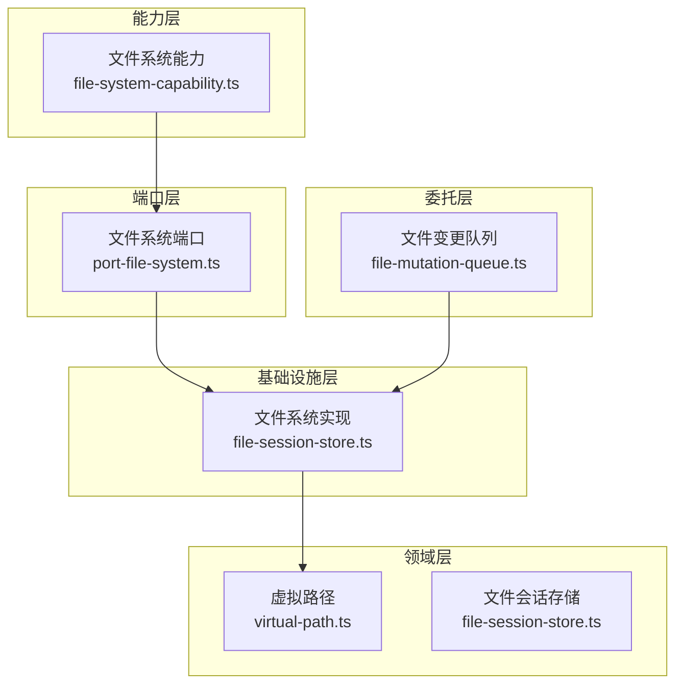
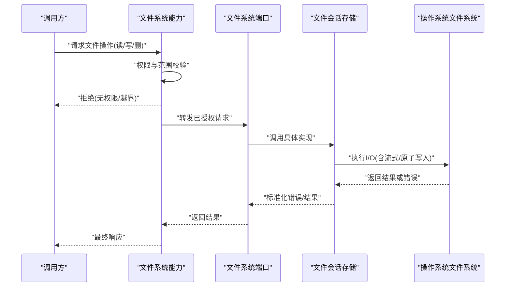
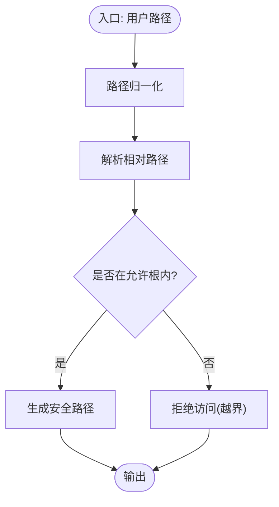
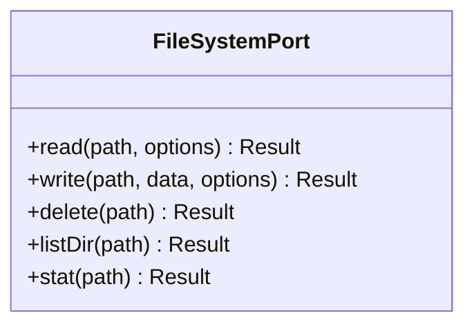
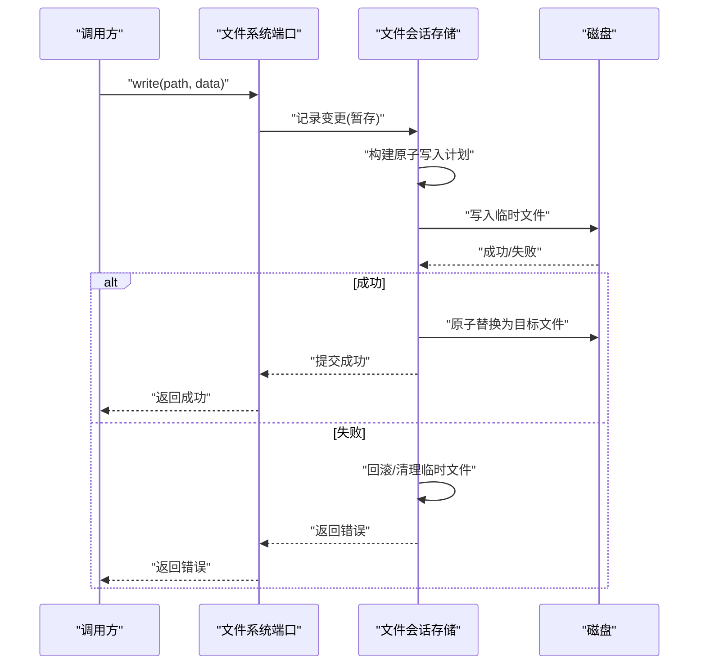
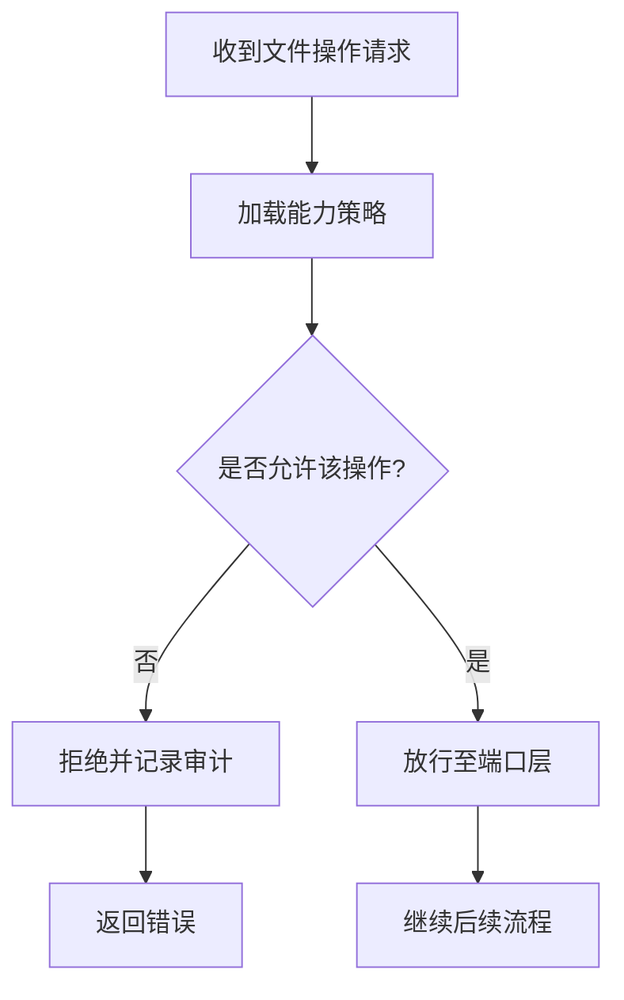
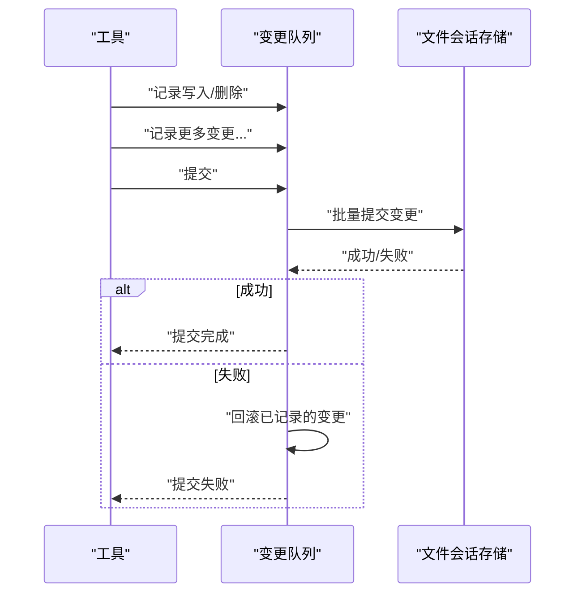
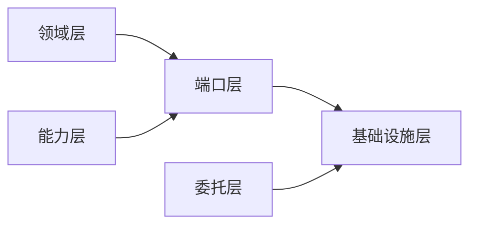

# 文件系统访问

<cite>
**本文引用的文件**   
- [engine/packages/domain-layer/src/file-system/virtual-path.ts](file://engine/packages/domain-layer/src/file-system/virtual-path.ts)
- [engine/packages/infrastructure/src/file-system/file-session-store.ts](file://engine/packages/infrastructure/src/file-system/file-session-store.ts)
- [engine/packages/ports-layer/src/file-system/port-file-system.ts](file://engine/packages/ports-layer/src/file-system/port-file-system.ts)
- [engine/packages/capabilities/src/file-system-capability.ts](file://engine/packages/capabilities/src/file-system-capability.ts)
- [engine/packages/delegation-layer/src/tool/file-mutation-queue.ts](file://engine/packages/delegation-layer/src/tool/file-mutation-queue.ts)
- [engine/tests/virtual-path.test.ts](file://engine/tests/virtual-path.test.ts)
- [engine/tests/file-session-store.test.ts](file://engine/tests/file-session-store.test.ts)
- [engine/tests/file-mutation-queue.test.ts](file://engine/tests/file-mutation-queue.test.ts)
</cite>

## 目录
1. [简介](#简介)
2. [项目结构](#项目结构)
3. [核心组件](#核心组件)
4. [架构总览](#架构总览)
5. [详细组件分析](#详细组件分析)
6. [依赖关系分析](#依赖关系分析)
7. [性能考量](#性能考量)
8. [故障排查指南](#故障排查指南)
9. [结论](#结论)
10. [附录：API 参考](#附录api-参考)

## 简介
本技术文档聚焦于 KCoder 的文件系统访问能力，围绕以下目标展开：
- 深入解释文件读取、写入、删除等基础操作的实现机制，包括安全控制、权限验证与错误处理策略。
- 详细说明虚拟路径系统的设计原理，如何实现抽象的文件路径映射与跨平台兼容性。
- 介绍文件操作的安全沙箱机制，防止恶意代码对系统文件的非法访问。
- 解释大文件处理的优化策略，包括流式读写、内存管理与性能调优。
- 提供文件系统 API 的完整接口文档，包含参数说明、返回值定义和使用示例。
- 说明与操作系统文件系统的集成方式与限制。

## 项目结构
KCoder 将“文件系统访问”能力分层组织在 engine 子工程中，采用领域层、端口层、基础设施层与能力注册层的清晰划分：
- 领域层（domain-layer）：定义虚拟路径、会话存储等核心概念与契约。
- 端口层（ports-layer）：定义文件系统端口（Port），屏蔽底层差异。
- 基础设施层（infrastructure）：基于端口的具体实现，如基于磁盘的会话存储。
- 能力层（capabilities）：对外暴露的能力开关与校验。
- 委托层（delegation-layer）：工具执行时的变更队列与提交策略。
- 测试（tests）：覆盖关键路径与边界条件。

图表来源
- [engine/packages/domain-layer/src/file-system/virtual-path.ts](file://engine/packages/domain-layer/src/file-system/virtual-path.ts)
- [engine/packages/infrastructure/src/file-system/file-session-store.ts](file://engine/packages/infrastructure/src/file-system/file-session-store.ts)
- [engine/packages/ports-layer/src/file-system/port-file-system.ts](file://engine/packages/ports-layer/src/file-system/port-file-system.ts)
- [engine/packages/capabilities/src/file-system-capability.ts](file://engine/packages/capabilities/src/file-system-capability.ts)
- [engine/packages/delegation-layer/src/tool/file-mutation-queue.ts](file://engine/packages/delegation-layer/src/tool/file-mutation-queue.ts)

章节来源
- [engine/packages/domain-layer/src/file-system/virtual-path.ts](file://engine/packages/domain-layer/src/file-system/virtual-path.ts)
- [engine/packages/infrastructure/src/file-system/file-session-store.ts](file://engine/packages/infrastructure/src/file-system/file-session-store.ts)
- [engine/packages/ports-layer/src/file-system/port-file-system.ts](file://engine/packages/ports-layer/src/file-system/port-file-system.ts)
- [engine/packages/capabilities/src/file-system-capability.ts](file://engine/packages/capabilities/src/file-system-capability.ts)
- [engine/packages/delegation-layer/src/tool/file-mutation-queue.ts](file://engine/packages/delegation-layer/src/tool/file-mutation-queue.ts)

## 核心组件
- 虚拟路径（Virtual Path）
  - 职责：提供跨平台的统一路径表示，规范化分隔符、解析相对路径、拼接与归一化，确保在不同 OS 上行为一致。
  - 关键点：路径合法性校验、根路径约束、避免路径穿越。
- 文件系统端口（File System Port）
  - 职责：定义统一的文件 I/O 接口（读、写、删、列出、元数据查询等），屏蔽底层差异。
  - 关键点：输入参数校验、错误类型标准化、可插拔实现。
- 文件会话存储（File Session Store）
  - 职责：基于磁盘的具体实现，负责持久化、事务性提交、并发安全与资源释放。
  - 关键点：原子写入、回滚、锁与并发控制、大文件流式处理。
- 文件系统能力（File System Capability）
  - 职责：控制是否允许进行文件操作，结合上下文与策略进行授权检查。
  - 关键点：白名单/黑名单、作用域限制、审计日志。
- 文件变更队列（File Mutation Queue）
  - 职责：在工具执行期间收集变更，支持批量提交或撤销，降低中间状态风险。
  - 关键点：幂等、顺序保证、失败重试与补偿。

章节来源
- [engine/packages/domain-layer/src/file-system/virtual-path.ts](file://engine/packages/domain-layer/src/file-system/virtual-path.ts)
- [engine/packages/ports-layer/src/file-system/port-file-system.ts](file://engine/packages/ports-layer/src/file-system/port-file-system.ts)
- [engine/packages/infrastructure/src/file-system/file-session-store.ts](file://engine/packages/infrastructure/src/file-system/file-session-store.ts)
- [engine/packages/capabilities/src/file-system-capability.ts](file://engine/packages/capabilities/src/file-system-capability.ts)
- [engine/packages/delegation-layer/src/tool/file-mutation-queue.ts](file://engine/packages/delegation-layer/src/tool/file-mutation-queue.ts)

## 架构总览
下图展示了从调用方到磁盘的完整链路，以及安全与一致性保障点。

图表来源
- [engine/packages/capabilities/src/file-system-capability.ts](file://engine/packages/capabilities/src/file-system-capability.ts)
- [engine/packages/ports-layer/src/file-system/port-file-system.ts](file://engine/packages/ports-layer/src/file-system/port-file-system.ts)
- [engine/packages/infrastructure/src/file-system/file-session-store.ts](file://engine/packages/infrastructure/src/file-system/file-session-store.ts)

## 详细组件分析

### 虚拟路径系统
- 设计目标
  - 统一不同操作系统的路径分隔符与大小写敏感性差异。
  - 提供安全的相对路径解析与拼接，杜绝路径穿越。
  - 为上层提供稳定的路径语义（根、工作区、临时区等）。
- 关键特性
  - 路径归一化：去除冗余分隔符、解析 . 与 ..。
  - 根路径约束：所有访问必须落在允许的根目录下。
  - 跨平台兼容：自动处理 Windows 与 POSIX 的差异。
- 典型流程
  - 输入用户路径 → 解析与归一化 → 校验是否在允许范围内 → 输出安全路径。

图表来源
- [engine/packages/domain-layer/src/file-system/virtual-path.ts](file://engine/packages/domain-layer/src/file-system/virtual-path.ts)

章节来源
- [engine/packages/domain-layer/src/file-system/virtual-path.ts](file://engine/packages/domain-layer/src/file-system/virtual-path.ts)
- [engine/tests/virtual-path.test.ts](file://engine/tests/virtual-path.test.ts)

### 文件系统端口（抽象接口）
- 职责
  - 定义读、写、删、列目录、获取元数据等标准方法。
  - 统一错误模型与返回结构，便于上层处理。
- 设计要点
  - 参数校验前置，尽早失败。
  - 返回结构化结果，区分成功与失败分支。
  - 支持可选的流式接口用于大文件场景。

图表来源
- [engine/packages/ports-layer/src/file-system/port-file-system.ts](file://engine/packages/ports-layer/src/file-system/port-file-system.ts)

章节来源
- [engine/packages/ports-layer/src/file-system/port-file-system.ts](file://engine/packages/ports-layer/src/file-system/port-file-system.ts)

### 文件会话存储（磁盘实现）
- 职责
  - 基于端口接口的磁盘实现，负责实际 I/O。
  - 提供会话级的事务性提交与回滚。
  - 管理并发访问与资源清理。
- 关键机制
  - 原子写入：先写临时文件，再原子替换，避免部分写入导致损坏。
  - 变更队列：在会话中累积变更，提交时一次性落盘。
  - 流式处理：对大文件使用流式读写，降低内存峰值。
  - 错误恢复：异常时回滚未提交的变更，保证一致性。

图表来源
- [engine/packages/infrastructure/src/file-system/file-session-store.ts](file://engine/packages/infrastructure/src/file-system/file-session-store.ts)
- [engine/packages/ports-layer/src/file-system/port-file-system.ts](file://engine/packages/ports-layer/src/file-system/port-file-system.ts)

章节来源
- [engine/packages/infrastructure/src/file-system/file-session-store.ts](file://engine/packages/infrastructure/src/file-system/file-session-store.ts)
- [engine/tests/file-session-store.test.ts](file://engine/tests/file-session-store.test.ts)

### 文件系统能力（安全沙箱）
- 职责
  - 在每次文件操作前进行权限与范围校验。
  - 根据上下文决定允许的操作集合（读/写/删/列目录）。
  - 记录审计信息，便于追踪与回溯。
- 沙箱策略
  - 白名单目录：仅允许访问指定根路径下的文件。
  - 操作粒度：按动作细粒度授权，最小权限原则。
  - 动态策略：依据任务、用户角色、环境配置动态调整。

图表来源
- [engine/packages/capabilities/src/file-system-capability.ts](file://engine/packages/capabilities/src/file-system-capability.ts)

章节来源
- [engine/packages/capabilities/src/file-system-capability.ts](file://engine/packages/capabilities/src/file-system-capability.ts)

### 文件变更队列（工具侧）
- 职责
  - 在工具执行过程中收集文件变更，支持批量提交或撤销。
  - 保证变更的顺序性与幂等性，减少中间态影响。
- 关键特性
  - 变更去重与合并：相同路径多次写入可合并。
  - 失败补偿：提交失败时自动回滚。
  - 可观测性：记录变更明细，便于调试与审计。

图表来源
- [engine/packages/delegation-layer/src/tool/file-mutation-queue.ts](file://engine/packages/delegation-layer/src/tool/file-mutation-queue.ts)
- [engine/packages/infrastructure/src/file-system/file-session-store.ts](file://engine/packages/infrastructure/src/file-system/file-session-store.ts)

章节来源
- [engine/packages/delegation-layer/src/tool/file-mutation-queue.ts](file://engine/packages/delegation-layer/src/tool/file-mutation-queue.ts)
- [engine/tests/file-mutation-queue.test.ts](file://engine/tests/file-mutation-queue.test.ts)

## 依赖关系分析
- 耦合与内聚
  - 端口层与领域层解耦良好，通过抽象接口降低耦合度。
  - 基础设施层对端口层强依赖，但对领域层保持弱依赖（仅使用路径等基础类型）。
- 外部依赖
  - 操作系统文件系统：通过 Node.js 原生模块或平台适配层访问。
  - 并发与锁：由运行时或内部锁机制保证。
- 潜在循环依赖
  - 当前分层清晰，未见直接循环依赖；需关注能力层与委托层之间的间接引用。

图表来源
- [engine/packages/domain-layer/src/file-system/virtual-path.ts](file://engine/packages/domain-layer/src/file-system/virtual-path.ts)
- [engine/packages/ports-layer/src/file-system/port-file-system.ts](file://engine/packages/ports-layer/src/file-system/port-file-system.ts)
- [engine/packages/infrastructure/src/file-system/file-session-store.ts](file://engine/packages/infrastructure/src/file-system/file-session-store.ts)
- [engine/packages/capabilities/src/file-system-capability.ts](file://engine/packages/capabilities/src/file-system-capability.ts)
- [engine/packages/delegation-layer/src/tool/file-mutation-queue.ts](file://engine/packages/delegation-layer/src/tool/file-mutation-queue.ts)

章节来源
- [engine/packages/domain-layer/src/file-system/virtual-path.ts](file://engine/packages/domain-layer/src/file-system/virtual-path.ts)
- [engine/packages/ports-layer/src/file-system/port-file-system.ts](file://engine/packages/ports-layer/src/file-system/port-file-system.ts)
- [engine/packages/infrastructure/src/file-system/file-session-store.ts](file://engine/packages/infrastructure/src/file-system/file-session-store.ts)
- [engine/packages/capabilities/src/file-system-capability.ts](file://engine/packages/capabilities/src/file-system-capability.ts)
- [engine/packages/delegation-layer/src/tool/file-mutation-queue.ts](file://engine/packages/delegation-layer/src/tool/file-mutation-queue.ts)

## 性能考量
- 流式读写
  - 对大文件采用流式接口，避免一次性加载到内存，降低峰值内存占用。
  - 合理设置缓冲区大小，平衡吞吐与延迟。
- 原子写入与缓存
  - 原子替换减少脏数据风险，但会增加一次拷贝开销；可通过零拷贝策略优化。
  - 热点文件可引入只读缓存，提升读取性能。
- 并发与锁
  - 同一文件并发写入需串行化，避免竞争条件。
  - 读多写少场景可使用读锁共享，提高并发度。
- I/O 调度
  - 批量提交变更，减少系统调用次数。
  - 异步 I/O 与非阻塞模式提升整体吞吐。

[本节为通用性能建议，不直接分析具体文件]

## 故障排查指南
- 常见错误类型
  - 权限不足：能力层拒绝访问，检查白名单与作用域。
  - 路径越界：虚拟路径校验失败，确认根路径与相对路径解析。
  - 写入失败：原子替换失败或磁盘空间不足，检查磁盘状态与权限。
  - 并发冲突：同一文件并发写入导致失败，考虑串行化或合并变更。
- 定位步骤
  - 查看能力层日志，确认是否被策略拦截。
  - 检查虚拟路径解析结果，确认最终安全路径。
  - 审查变更队列提交记录，定位失败阶段。
  - 核对基础设施层错误码与堆栈，定位底层 I/O 问题。

章节来源
- [engine/packages/capabilities/src/file-system-capability.ts](file://engine/packages/capabilities/src/file-system-capability.ts)
- [engine/packages/domain-layer/src/file-system/virtual-path.ts](file://engine/packages/domain-layer/src/file-system/virtual-path.ts)
- [engine/packages/delegation-layer/src/tool/file-mutation-queue.ts](file://engine/packages/delegation-layer/src/tool/file-mutation-queue.ts)
- [engine/packages/infrastructure/src/file-system/file-session-store.ts](file://engine/packages/infrastructure/src/file-system/file-session-store.ts)

## 结论
KCoder 的文件系统访问通过清晰的层次化设计与严格的安全沙箱机制，实现了跨平台兼容、高可靠与高性能的文件操作能力。虚拟路径系统确保了路径安全与一致性，端口层提供了可扩展的抽象接口，基础设施层以原子写入与流式处理保障了正确性与性能，能力层与变更队列则分别承担了授权与事务性保障。整体架构具备良好的可维护性与扩展性，适合在复杂工程环境中稳定运行。

[本节为总结性内容，不直接分析具体文件]

## 附录：API 参考
以下为文件系统相关接口的高层定义与使用说明（以路径与结果为抽象描述，具体类型见对应源文件）：

- 虚拟路径
  - 功能：路径归一化、解析、拼接与安全校验。
  - 输入：原始路径字符串、根路径上下文。
  - 输出：安全路径对象或错误。
  - 注意：禁止路径穿越，超出根路径将被拒绝。
  - 参考：[engine/packages/domain-layer/src/file-system/virtual-path.ts](file://engine/packages/domain-layer/src/file-system/virtual-path.ts)

- 文件系统端口
  - read(path, options): 读取文件或流式读取。
  - write(path, data, options): 写入文件或流式写入。
  - delete(path): 删除文件或目录。
  - listDir(path): 列出目录内容。
  - stat(path): 获取文件元数据。
  - 参考：[engine/packages/ports-layer/src/file-system/port-file-system.ts](file://engine/packages/ports-layer/src/file-system/port-file-system.ts)

- 文件会话存储
  - 提供上述接口的磁盘实现，支持会话级提交与回滚。
  - 参考：[engine/packages/infrastructure/src/file-system/file-session-store.ts](file://engine/packages/infrastructure/src/file-system/file-session-store.ts)

- 文件系统能力
  - 在调用端口前进行权限与范围校验。
  - 参考：[engine/packages/capabilities/src/file-system-capability.ts](file://engine/packages/capabilities/src/file-system-capability.ts)

- 文件变更队列
  - 收集变更并提供批量提交与回滚。
  - 参考：[engine/packages/delegation-layer/src/tool/file-mutation-queue.ts](file://engine/packages/delegation-layer/src/tool/file-mutation-queue.ts)

- 测试用例
  - 虚拟路径测试：[engine/tests/virtual-path.test.ts](file://engine/tests/virtual-path.test.ts)
  - 文件会话存储测试：[engine/tests/file-session-store.test.ts](file://engine/tests/file-session-store.test.ts)
  - 文件变更队列测试：[engine/tests/file-mutation-queue.test.ts](file://engine/tests/file-mutation-queue.test.ts)