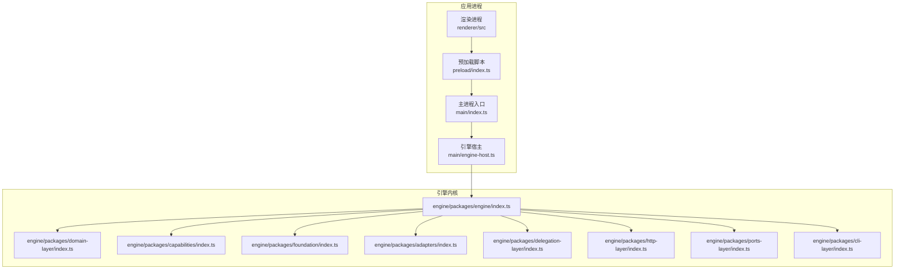
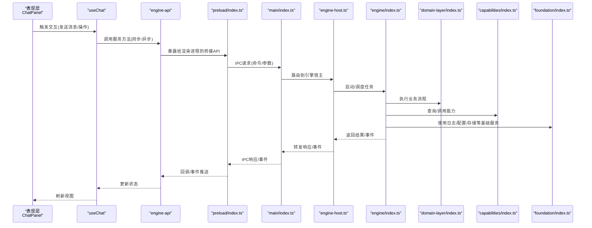
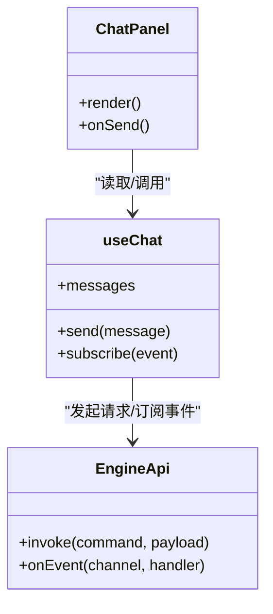
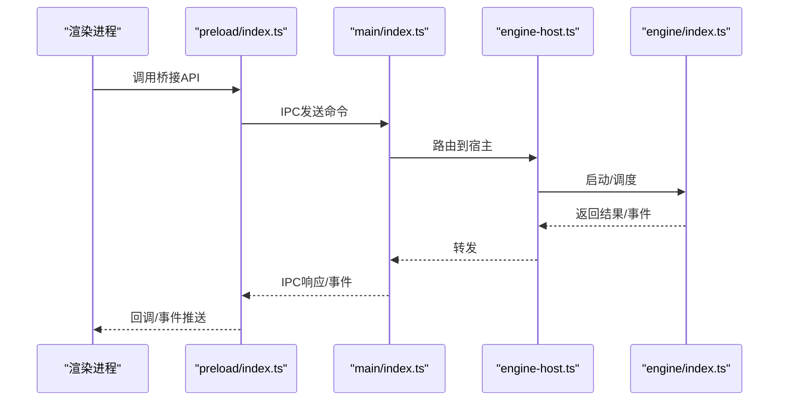
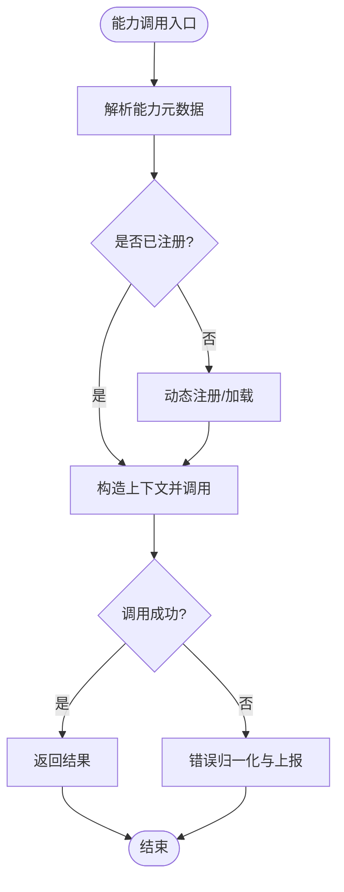
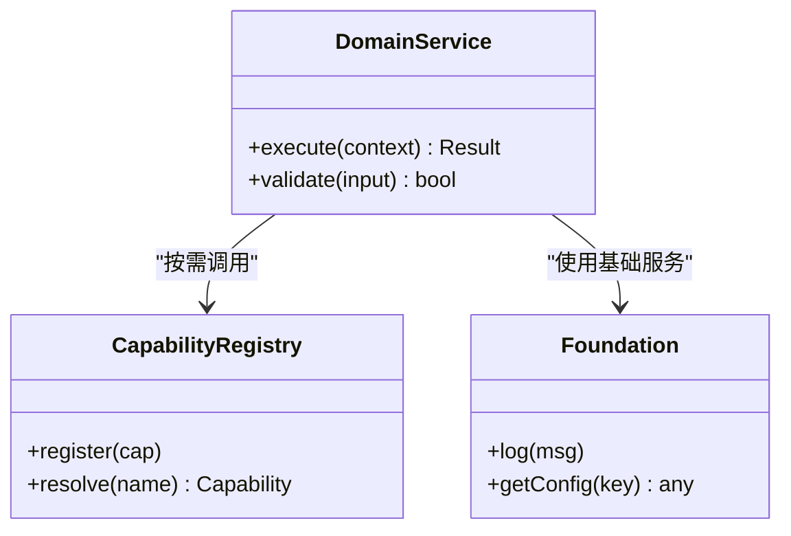
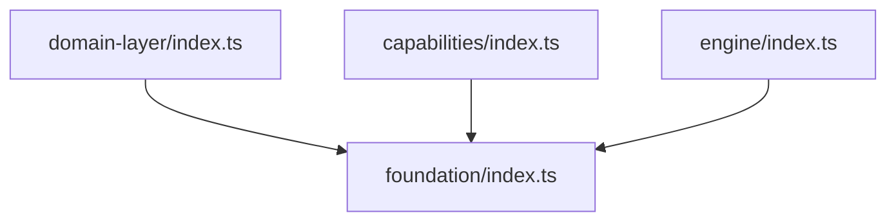
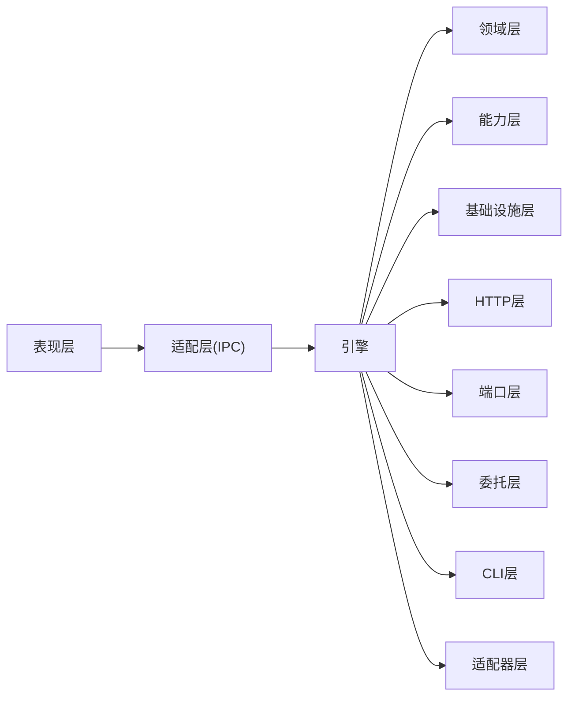

# 分层架构详解

<cite>
**本文引用的文件**   
- [app/main/index.ts](file://app/main/index.ts)
- [app/main/engine-host.ts](file://app/main/engine-host.ts)
- [app/preload/index.ts](file://app/preload/index.ts)
- [app/renderer/src/main.tsx](file://app/renderer/src/main.tsx)
- [app/renderer/src/App.tsx](file://app/renderer/src/App.tsx)
- [app/renderer/src/services/engine-api.ts](file://app/renderer/src/services/engine-api.ts)
- [app/renderer/src/hooks/useChat.ts](file://app/renderer/src/hooks/useChat.ts)
- [app/renderer/src/components/ChatPanel/index.tsx](file://app/renderer/src/components/ChatPanel/index.tsx)
- [engine/packages/domain-layer/index.ts](file://engine/packages/domain-layer/index.ts)
- [engine/packages/capabilities/index.ts](file://engine/packages/capabilities/index.ts)
- [engine/packages/foundation/index.ts](file://engine/packages/foundation/index.ts)
- [engine/packages/adapters/index.ts](file://engine/packages/adapters/index.ts)
- [engine/packages/delegation-layer/index.ts](file://engine/packages/delegation-layer/index.ts)
- [engine/packages/http-layer/index.ts](file://engine/packages/http-layer/index.ts)
- [engine/packages/ports-layer/index.ts](file://engine/packages/ports-layer/index.ts)
- [engine/packages/cli-layer/index.ts](file://engine/packages/cli-layer/index.ts)
- [engine/packages/engine/index.ts](file://engine/packages/engine/index.ts)
</cite>

## 目录
1. [简介](#简介)
2. [项目结构](#项目结构)
3. [核心组件](#核心组件)
4. [架构总览](#架构总览)
5. [详细组件分析](#详细组件分析)
6. [依赖关系分析](#依赖关系分析)
7. [性能考量](#性能考量)
8. [故障排查指南](#故障排查指南)
9. [结论](#结论)
10. [附录](#附录)

## 简介
本文件面向KCoder系统，围绕五层架构进行系统化说明：表现层（React UI）、适配层（Engine Host与IPC通信）、能力层（Capabilities注册中心）、领域层（Domain Layer业务逻辑）、基础设施层（Foundation基础服务）。文档聚焦于每层的职责边界、接口定义与依赖关系，阐述层间通信机制（同步调用、异步事件、消息传递），并解释分层如何支撑代码复用、测试隔离与独立部署。同时提供跨层交互的示例路径与可视化图示，帮助读者快速理解与落地。

## 项目结构
KCoder采用多包工作区组织，前端基于Electron+React，后端引擎以packages形式解耦为多个层次与横向能力。整体结构如下：

图表来源
- [app/main/index.ts](file://app/main/index.ts)
- [app/main/engine-host.ts](file://app/main/engine-host.ts)
- [app/preload/index.ts](file://app/preload/index.ts)
- [app/renderer/src/main.tsx](file://app/renderer/src/main.tsx)
- [engine/packages/engine/index.ts](file://engine/packages/engine/index.ts)
- [engine/packages/domain-layer/index.ts](file://engine/packages/domain-layer/index.ts)
- [engine/packages/capabilities/index.ts](file://engine/packages/capabilities/index.ts)
- [engine/packages/foundation/index.ts](file://engine/packages/foundation/index.ts)
- [engine/packages/adapters/index.ts](file://engine/packages/adapters/index.ts)
- [engine/packages/delegation-layer/index.ts](file://engine/packages/delegation-layer/index.ts)
- [engine/packages/http-layer/index.ts](file://engine/packages/http-layer/index.ts)
- [engine/packages/ports-layer/index.ts](file://engine/packages/ports-layer/index.ts)
- [engine/packages/cli-layer/index.ts](file://engine/packages/cli-layer/index.ts)

章节来源
- [app/main/index.ts](file://app/main/index.ts)
- [app/main/engine-host.ts](file://app/main/engine-host.ts)
- [app/preload/index.ts](file://app/preload/index.ts)
- [app/renderer/src/main.tsx](file://app/renderer/src/main.tsx)
- [engine/packages/engine/index.ts](file://engine/packages/engine/index.ts)

## 核心组件
- 表现层（React UI）
  - 负责用户界面与交互状态管理，通过hooks与服务层对接。
  - 关键入口与组件：[app/renderer/src/main.tsx](file://app/renderer/src/main.tsx)、[app/renderer/src/App.tsx](file://app/renderer/src/App.tsx)、[app/renderer/src/components/ChatPanel/index.tsx](file://app/renderer/src/components/ChatPanel/index.tsx)。
  - 数据获取与状态绑定：[app/renderer/src/hooks/useChat.ts](file://app/renderer/src/hooks/useChat.ts)、[app/renderer/src/services/engine-api.ts](file://app/renderer/src/services/engine-api.ts)。

- 适配层（Engine Host与IPC）
  - 主进程侧承载与引擎进程的桥接，封装IPC通道、生命周期管理与错误传播。
  - 关键文件：[app/main/index.ts](file://app/main/index.ts)、[app/main/engine-host.ts](file://app/main/engine-host.ts)、[app/preload/index.ts](file://app/preload/index.ts)。

- 能力层（Capabilities注册中心）
  - 在引擎内部提供能力的发现、注册与调用编排，驱动插件化扩展。
  - 关键文件：[engine/packages/capabilities/index.ts](file://engine/packages/capabilities/index.ts)。

- 领域层（Domain Layer）
  - 承载核心业务规则、流程编排与领域模型，不依赖外部实现细节。
  - 关键文件：[engine/packages/domain-layer/index.ts](file://engine/packages/domain-layer/index.ts)。

- 基础设施层（Foundation）
  - 提供日志、配置、持久化、并发控制等通用基础能力，被上层共同依赖。
  - 关键文件：[engine/packages/foundation/index.ts](file://engine/packages/foundation/index.ts)。

章节来源
- [app/renderer/src/main.tsx](file://app/renderer/src/main.tsx)
- [app/renderer/src/App.tsx](file://app/renderer/src/App.tsx)
- [app/renderer/src/components/ChatPanel/index.tsx](file://app/renderer/src/components/ChatPanel/index.tsx)
- [app/renderer/src/hooks/useChat.ts](file://app/renderer/src/hooks/useChat.ts)
- [app/renderer/src/services/engine-api.ts](file://app/renderer/src/services/engine-api.ts)
- [app/main/index.ts](file://app/main/index.ts)
- [app/main/engine-host.ts](file://app/main/engine-host.ts)
- [app/preload/index.ts](file://app/preload/index.ts)
- [engine/packages/capabilities/index.ts](file://engine/packages/capabilities/index.ts)
- [engine/packages/domain-layer/index.ts](file://engine/packages/domain-layer/index.ts)
- [engine/packages/foundation/index.ts](file://engine/packages/foundation/index.ts)

## 架构总览
下图展示从UI到引擎的分层调用链路与通信方式，包括同步RPC与异步事件流。

图表来源
- [app/renderer/src/components/ChatPanel/index.tsx](file://app/renderer/src/components/ChatPanel/index.tsx)
- [app/renderer/src/hooks/useChat.ts](file://app/renderer/src/hooks/useChat.ts)
- [app/renderer/src/services/engine-api.ts](file://app/renderer/src/services/engine-api.ts)
- [app/preload/index.ts](file://app/preload/index.ts)
- [app/main/index.ts](file://app/main/index.ts)
- [app/main/engine-host.ts](file://app/main/engine-host.ts)
- [engine/packages/engine/index.ts](file://engine/packages/engine/index.ts)
- [engine/packages/domain-layer/index.ts](file://engine/packages/domain-layer/index.ts)
- [engine/packages/capabilities/index.ts](file://engine/packages/capabilities/index.ts)
- [engine/packages/foundation/index.ts](file://engine/packages/foundation/index.ts)

## 详细组件分析

### 表现层（React UI）
- 职责边界
  - 仅关注视图渲染与用户交互；不直接访问底层系统或引擎。
  - 通过hooks聚合状态，通过服务层发起请求与订阅事件。
- 关键接口与约定
  - hooks暴露统一的数据操作方法与状态字段，供组件消费。
  - 服务层对IPC进行封装，屏蔽进程边界细节。
- 依赖关系
  - 依赖服务层与本地状态管理，不依赖主进程或引擎模块。
- 典型交互模式
  - 组件触发hook方法 -> hook调用服务 -> 服务经预加载桥接到主进程 -> 主进程转发至引擎宿主。

图表来源
- [app/renderer/src/components/ChatPanel/index.tsx](file://app/renderer/src/components/ChatPanel/index.tsx)
- [app/renderer/src/hooks/useChat.ts](file://app/renderer/src/hooks/useChat.ts)
- [app/renderer/src/services/engine-api.ts](file://app/renderer/src/services/engine-api.ts)

章节来源
- [app/renderer/src/components/ChatPanel/index.tsx](file://app/renderer/src/components/ChatPanel/index.tsx)
- [app/renderer/src/hooks/useChat.ts](file://app/renderer/src/hooks/useChat.ts)
- [app/renderer/src/services/engine-api.ts](file://app/renderer/src/services/engine-api.ts)

### 适配层（Engine Host与IPC通信）
- 职责边界
  - 作为渲染进程与引擎进程的桥梁，处理IPC序列化、错误映射、超时与重试策略。
  - 维护引擎生命周期（启动、停止、重启）与资源清理。
- 关键接口与约定
  - 预加载脚本向渲染进程暴露最小API集合。
  - 主进程将IPC命令路由到引擎宿主，统一异常与事件回传。
- 依赖关系
  - 依赖Electron IPC与引擎宿主；不感知领域逻辑。
- 典型交互模式
  - 渲染进程通过预加载API调用 -> 主进程接收IPC -> 调用引擎宿主 -> 宿主执行引擎并返回。

图表来源
- [app/preload/index.ts](file://app/preload/index.ts)
- [app/main/index.ts](file://app/main/index.ts)
- [app/main/engine-host.ts](file://app/main/engine-host.ts)
- [engine/packages/engine/index.ts](file://engine/packages/engine/index.ts)

章节来源
- [app/preload/index.ts](file://app/preload/index.ts)
- [app/main/index.ts](file://app/main/index.ts)
- [app/main/engine-host.ts](file://app/main/engine-host.ts)

### 能力层（Capabilities注册中心）
- 职责边界
  - 提供能力的声明、发现、注册与调用编排；支持动态扩展与版本兼容。
- 关键接口与约定
  - 能力描述元数据、调用契约、权限与安全上下文。
  - 注册表提供按名称/标签查找与批量装配。
- 依赖关系
  - 依赖领域层契约与基础设施（如配置、日志）。
- 典型交互模式
  - 引擎在运行时根据任务需求查询能力 -> 解析依赖 -> 调用具体实现。

图表来源
- [engine/packages/capabilities/index.ts](file://engine/packages/capabilities/index.ts)
- [engine/packages/domain-layer/index.ts](file://engine/packages/domain-layer/index.ts)
- [engine/packages/foundation/index.ts](file://engine/packages/foundation/index.ts)

章节来源
- [engine/packages/capabilities/index.ts](file://engine/packages/capabilities/index.ts)
- [engine/packages/domain-layer/index.ts](file://engine/packages/domain-layer/index.ts)
- [engine/packages/foundation/index.ts](file://engine/packages/foundation/index.ts)

### 领域层（Domain Layer）
- 职责边界
  - 定义核心业务流程、状态机与领域模型；不包含I/O与外部协议细节。
- 关键接口与约定
  - 纯函数式或不可变数据结构为主；对外暴露稳定的领域API。
- 依赖关系
  - 仅依赖基础设施抽象（如配置、日志接口），避免反向依赖。
- 典型交互模式
  - 引擎协调领域用例 -> 组合能力与工具 -> 产出领域结果。

图表来源
- [engine/packages/domain-layer/index.ts](file://engine/packages/domain-layer/index.ts)
- [engine/packages/capabilities/index.ts](file://engine/packages/capabilities/index.ts)
- [engine/packages/foundation/index.ts](file://engine/packages/foundation/index.ts)

章节来源
- [engine/packages/domain-layer/index.ts](file://engine/packages/domain-layer/index.ts)
- [engine/packages/capabilities/index.ts](file://engine/packages/capabilities/index.ts)
- [engine/packages/foundation/index.ts](file://engine/packages/foundation/index.ts)

### 基础设施层（Foundation）
- 职责边界
  - 提供跨层共享的基础设施：日志、配置、持久化、并发控制、时间源等。
- 关键接口与约定
  - 稳定接口、可替换实现（便于测试与部署）。
- 依赖关系
  - 不被其他层反向依赖；仅被上层按需引入。
- 典型交互模式
  - 各层通过接口访问基础能力，实现“依赖倒置”。

图表来源
- [engine/packages/foundation/index.ts](file://engine/packages/foundation/index.ts)
- [engine/packages/domain-layer/index.ts](file://engine/packages/domain-layer/index.ts)
- [engine/packages/capabilities/index.ts](file://engine/packages/capabilities/index.ts)
- [engine/packages/engine/index.ts](file://engine/packages/engine/index.ts)

章节来源
- [engine/packages/foundation/index.ts](file://engine/packages/foundation/index.ts)
- [engine/packages/domain-layer/index.ts](file://engine/packages/domain-layer/index.ts)
- [engine/packages/capabilities/index.ts](file://engine/packages/capabilities/index.ts)
- [engine/packages/engine/index.ts](file://engine/packages/engine/index.ts)

### 横向能力与扩展点
- HTTP层
  - 提供HTTP客户端/服务端能力，用于远程调用与可观测性。
  - 参考：[engine/packages/http-layer/index.ts](file://engine/packages/http-layer/index.ts)
- 端口层
  - 抽象外部系统接入点，便于替换不同传输与协议。
  - 参考：[engine/packages/ports-layer/index.ts](file://engine/packages/ports-layer/index.ts)
- 委托层
  - 支持子代理/子任务的委派与编排。
  - 参考：[engine/packages/delegation-layer/index.ts](file://engine/packages/delegation-layer/index.ts)
- CLI层
  - 提供命令行入口与批处理能力。
  - 参考：[engine/packages/cli-layer/index.ts](file://engine/packages/cli-layer/index.ts)
- 适配器层
  - 适配第三方系统与平台差异。
  - 参考：[engine/packages/adapters/index.ts](file://engine/packages/adapters/index.ts)

章节来源
- [engine/packages/http-layer/index.ts](file://engine/packages/http-layer/index.ts)
- [engine/packages/ports-layer/index.ts](file://engine/packages/ports-layer/index.ts)
- [engine/packages/delegation-layer/index.ts](file://engine/packages/delegation-layer/index.ts)
- [engine/packages/cli-layer/index.ts](file://engine/packages/cli-layer/index.ts)
- [engine/packages/adapters/index.ts](file://engine/packages/adapters/index.ts)

## 依赖关系分析
- 单向依赖原则
  - 表现层 -> 适配层 -> 引擎 -> 领域层 -> 基础设施层。
  - 能力层与横向层（HTTP/Ports/Delegation/CLI/Adapters）由引擎协调，遵循依赖倒置。
- 耦合与内聚
  - 层内高内聚，层间通过稳定接口通信；IPC与能力注册作为主要解耦点。
- 循环依赖规避
  - 领域层不依赖能力层的具体实现，仅依赖其契约；能力层通过注册表注入实现。

图表来源
- [app/renderer/src/main.tsx](file://app/renderer/src/main.tsx)
- [app/preload/index.ts](file://app/preload/index.ts)
- [app/main/index.ts](file://app/main/index.ts)
- [app/main/engine-host.ts](file://app/main/engine-host.ts)
- [engine/packages/engine/index.ts](file://engine/packages/engine/index.ts)
- [engine/packages/domain-layer/index.ts](file://engine/packages/domain-layer/index.ts)
- [engine/packages/capabilities/index.ts](file://engine/packages/capabilities/index.ts)
- [engine/packages/foundation/index.ts](file://engine/packages/foundation/index.ts)
- [engine/packages/http-layer/index.ts](file://engine/packages/http-layer/index.ts)
- [engine/packages/ports-layer/index.ts](file://engine/packages/ports-layer/index.ts)
- [engine/packages/delegation-layer/index.ts](file://engine/packages/delegation-layer/index.ts)
- [engine/packages/cli-layer/index.ts](file://engine/packages/cli-layer/index.ts)
- [engine/packages/adapters/index.ts](file://engine/packages/adapters/index.ts)

章节来源
- [engine/packages/engine/index.ts](file://engine/packages/engine/index.ts)
- [engine/packages/domain-layer/index.ts](file://engine/packages/domain-layer/index.ts)
- [engine/packages/capabilities/index.ts](file://engine/packages/capabilities/index.ts)
- [engine/packages/foundation/index.ts](file://engine/packages/foundation/index.ts)
- [engine/packages/http-layer/index.ts](file://engine/packages/http-layer/index.ts)
- [engine/packages/ports-layer/index.ts](file://engine/packages/ports-layer/index.ts)
- [engine/packages/delegation-layer/index.ts](file://engine/packages/delegation-layer/index.ts)
- [engine/packages/cli-layer/index.ts](file://engine/packages/cli-layer/index.ts)
- [engine/packages/adapters/index.ts](file://engine/packages/adapters/index.ts)

## 性能考量
- IPC开销优化
  - 批量合并消息、节流/防抖高频事件、压缩载荷。
- 异步优先
  - 长耗时任务走异步事件流，避免阻塞UI线程。
- 缓存与去重
  - 热点数据在领域层或服务层做缓存；幂等命令去重。
- 资源治理
  - 引擎侧限流、超时与熔断；失败重试退避。
- 可观测性
  - 关键路径埋点与指标上报，定位瓶颈。

## 故障排查指南
- 常见问题定位
  - IPC链路：检查预加载API、主进程路由与宿主初始化顺序。
  - 能力缺失：确认能力注册时机与元数据完整性。
  - 领域错误：查看领域层校验与状态转换日志。
  - 基础服务：核对配置项、日志级别与持久化可用性。
- 建议步骤
  - 自下而上验证：基础设施 -> 能力 -> 领域 -> 引擎 -> 宿主 -> IPC -> UI。
  - 开启调试日志与追踪ID，关联一次请求的全链路。
  - 针对失败场景补充单元测试与集成测试用例。

## 结论
KCoder的五层架构通过清晰的职责划分与稳定的接口契约，实现了良好的可扩展性与可测试性。适配层屏蔽了进程边界复杂性，能力层提供了插件化扩展点，领域层专注业务本质，基础设施层提供通用支撑。配合HTTP/Ports/Delegation/CLI/Adapters等横向能力，系统既能满足复杂工程实践，又便于独立演进与持续交付。

## 附录
- 代码示例路径（不含具体代码内容）
  - 表现层调用链路：[app/renderer/src/components/ChatPanel/index.tsx](file://app/renderer/src/components/ChatPanel/index.tsx)、[app/renderer/src/hooks/useChat.ts](file://app/renderer/src/hooks/useChat.ts)、[app/renderer/src/services/engine-api.ts](file://app/renderer/src/services/engine-api.ts)
  - 适配层IPC桥接：[app/preload/index.ts](file://app/preload/index.ts)、[app/main/index.ts](file://app/main/index.ts)、[app/main/engine-host.ts](file://app/main/engine-host.ts)
  - 能力注册与调用：[engine/packages/capabilities/index.ts](file://engine/packages/capabilities/index.ts)
  - 领域流程编排：[engine/packages/domain-layer/index.ts](file://engine/packages/domain-layer/index.ts)
  - 基础服务使用：[engine/packages/foundation/index.ts](file://engine/packages/foundation/index.ts)
  - 横向能力接入：[engine/packages/http-layer/index.ts](file://engine/packages/http-layer/index.ts)、[engine/packages/ports-layer/index.ts](file://engine/packages/ports-layer/index.ts)、[engine/packages/delegation-layer/index.ts](file://engine/packages/delegation-layer/index.ts)、[engine/packages/cli-layer/index.ts](file://engine/packages/cli-layer/index.ts)、[engine/packages/adapters/index.ts](file://engine/packages/adapters/index.ts)