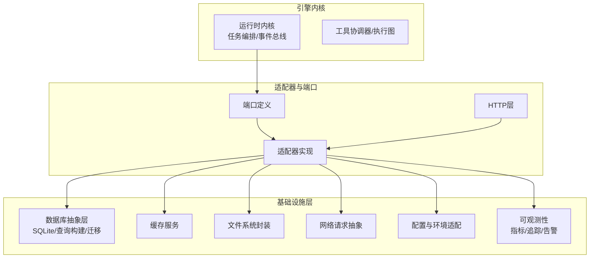
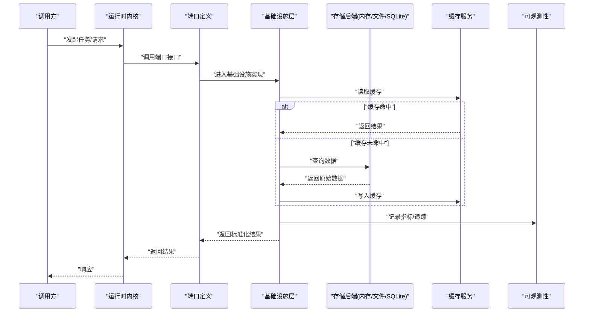
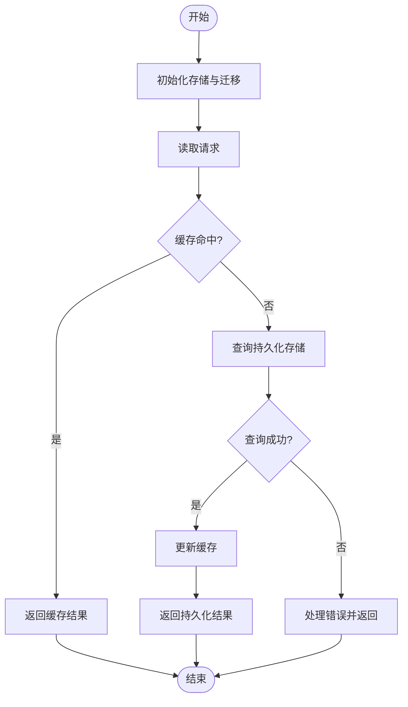
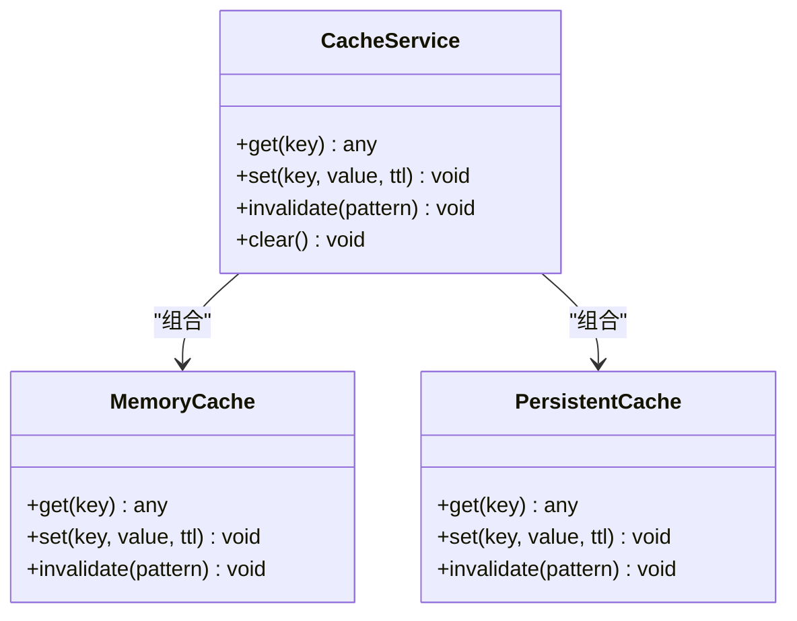
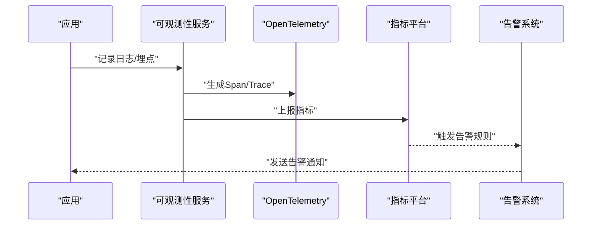
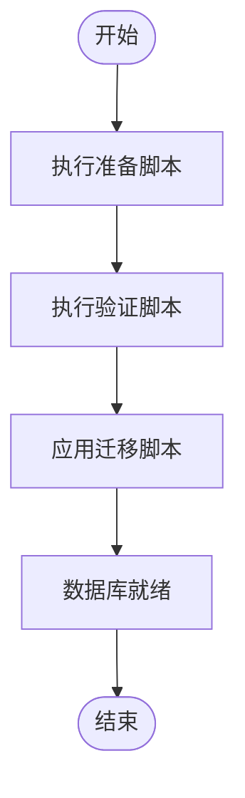
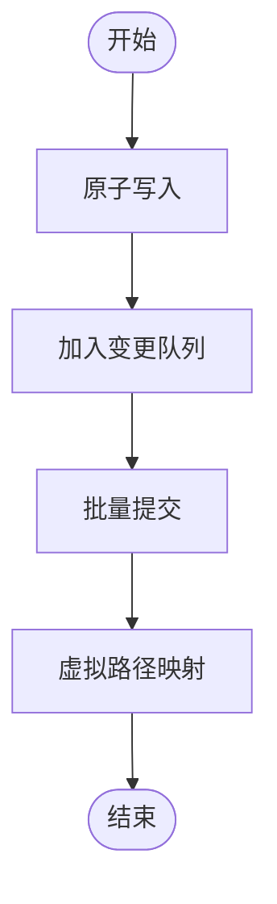
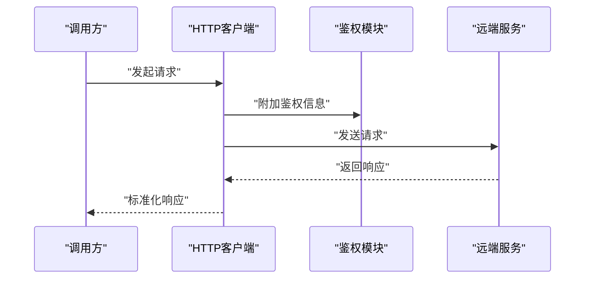
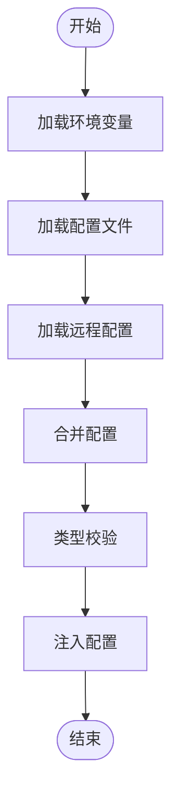
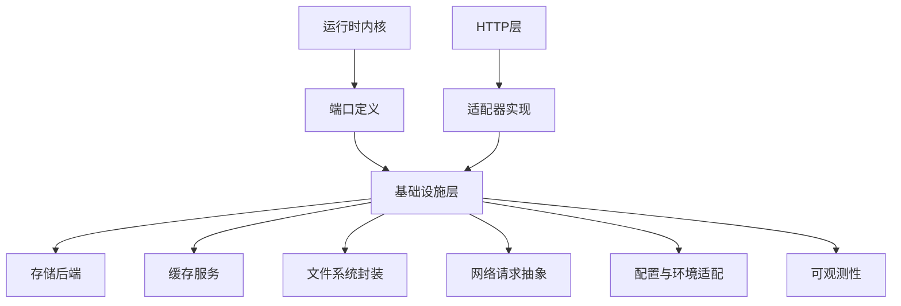

# 基础设施层（Infrastructure Layer）

<cite>
**本文引用的文件**   
- [engine/packages/infrastructure/package.json](file://engine/packages/infrastructure/package.json)
- [engine/scripts/prepare-sqlite.mjs](file://engine/scripts/prepare-sqlite.mjs)
- [engine/scripts/verify-sqlite.mjs](file://engine/scripts/verify-sqlite.mjs)
- [engine/tests/cache.test.ts](file://engine/tests/cache.test.ts)
- [engine/tests/opentelemetry.test.ts](file://engine/tests/opentelemetry.test.ts)
- [engine/tests/http-server-observability.test.ts](file://engine/tests/http-server-observability.test.ts)
- [engine/tests/runtime-kernel-provider-matrix.test.ts](file://engine/tests/runtime-kernel-provider-matrix.test.ts)
- [engine/tests/runtime-kernel-crash-recovery.test.ts](file://engine/tests/runtime-kernel-crash-recovery.test.ts)
- [engine/tests/file-session-store-integration.test.ts](file://engine/tests/file-session-store-integration.test.ts)
- [engine/tests/hybrid-store.test.ts](file://engine/tests/hybrid-store.test.ts)
- [engine/tests/run-state-store.test.ts](file://engine/tests/run-state-store.test.ts)
- [engine/tests/memory-store.test.ts](file://engine/tests/memory-store.test.ts)
- [engine/tests/task-state-store.test.ts](file://engine/tests/task-state-store.test.ts)
- [engine/tests/tool-runtime-v3.test.ts](file://engine/tests/tool-runtime-v3.test.ts)
- [engine/tests/execution-graph.test.ts](file://engine/tests/execution-graph.test.ts)
- [engine/tests/runtime-kernel-e2e.test.ts](file://engine/tests/runtime-kernel-e2e.test.ts)
- [engine/tests/runtime-kernel-isolation.test.ts](file://engine/tests/runtime-kernel-isolation.test.ts)
- [engine/tests/runtime-kernel-contracts.test.ts](file://engine/tests/runtime-kernel-contracts.test.ts)
- [engine/tests/runtime-kernel-budget.test.ts](file://engine/tests/runtime-kernel-budget.test.ts)
- [engine/tests/runtime-kernel-provider-governance.test.ts](file://engine/tests/runtime-kernel-provider-governance.test.ts)
- [engine/tests/runtime-kernel-after-middleware.test.ts](file://engine/tests/runtime-kernel-after-middleware.test.ts)
- [engine/tests/runtime-kernel-parity.test.ts](file://engine/tests/runtime-kernel-parity.test.ts)
- [engine/tests/runtime-kernel-replay.test.ts](file://engine/tests/runtime-kernel-replay.test.ts)
- [engine/tests/runtime-kernel.test.ts](file://engine/tests/runtime-kernel.test.ts)
- [engine/tests/runtime-factory.test.ts](file://engine/tests/runtime-factory.test.ts)
- [engine/tests/runtime-factory-rollout.test.ts](file://engine/tests/runtime-factory-rollout.test.ts)
- [engine/tests/runtime-event-projection.test.ts](file://engine/tests/runtime-event-projection.test.ts)
- [engine/tests/runtime-event-recorder-kernel.test.ts](file://engine/tests/runtime-event-recorder-kernel.test.ts)
- [engine/tests/runtime-event-reducer.test.ts](file://engine/tests/runtime-event-reducer.test.ts)
- [engine/tests/tool-call-repair.test.ts](file://engine/tests/tool-call-repair.test.ts)
- [engine/tests/tool-storm-breaker.test.ts](file://engine/tests/tool-storm-breaker.test.ts)
- [engine/tests/tool-coordinator-runtime.test.ts](file://engine/tests/tool-coordinator-runtime.test.ts)
- [engine/tests/tool-dispatch-errors.test.ts](file://engine/tests/tool-dispatch-errors.test.ts)
- [engine/tests/tool-result-budget.test.ts](file://engine/tests/tool-result-budget.test.ts)
- [engine/tests/turn-event-bus.test.ts](file://engine/tests/turn-event-bus.test.ts)
- [engine/tests/turn-state-store.test.ts](file://engine/tests/turn-state-store.test.ts)
- [engine/tests/thread-service.test.ts](file://engine/tests/thread-service.test.ts)
- [engine/tests/mcp-config.test.ts](file://engine/tests/mcp-config.test.ts)
- [engine/tests/mcp-tool-provider.test.ts](file://engine/tests/mcp-tool-provider.test.ts)
- [engine/tests/web-tool-provider.test.ts](file://engine/tests/web-tool-provider.test.ts)
- [engine/tests/http-artifacts.test.ts](file://engine/tests/http-artifacts.test.ts)
- [engine/tests/http-peer-transport.test.ts](file://engine/tests/http-peer-transport.test.ts)
- [engine/tests/http-server.test.ts](file://engine/tests/http-server.test.ts)
- [engine/tests/serve.test.ts](file://engine/tests/serve.test.ts)
- [engine/tests/model-client.test.ts](file://engine/tests/model-client.test.ts)
- [engine/tests/model-history-repair.test.ts](file://engine/tests/model-history-repair.test.ts)
- [engine/tests/model-step-runner.test.ts](file://engine/tests/model-step-runner.test.ts)
- [engine/tests/model-protocol-normalizer.test.ts](file://engine/tests/model-protocol-normalizer.test.ts)
- [engine/tests/auto-model-router.test.ts](file://engine/tests/auto-model-router.test.ts)
- [engine/tests/provider-compatibility.test.ts](file://engine/tests/provider-compatibility.test.ts)
- [engine/tests/qiongqi-config.test.ts](file://engine/tests/qiongqi-config.test.ts)
- [engine/tests/capability-registry.test.ts](file://engine/tests/capability-registry.test.ts)
- [engine/tests/capabilities.test.ts](file://engine/tests/capabilities.test.ts)
- [engine/tests/builtin-tools.test.ts](file://engine/tests/builtin-tools.test.ts)
- [engine/tests/builtin-tool-utils.test.ts](file://engine/tests/builtin-tool-utils.test.ts)
- [engine/tests/skill-command-registry.test.ts](file://engine/tests/skill-command-registry.test.ts)
- [engine/tests/skill-runtime.test.ts](file://engine/tests/skill-runtime.test.ts)
- [engine/tests/skill-mcp-bridge.test.ts](file://engine/tests/skill-mcp-bridge.test.ts)
- [engine/tests/work-mode-skill-runtime.test.ts](file://engine/tests/work-mode-skill-runtime.test.ts)
- [engine/tests/kernel-v3-node-handlers.test.ts](file://engine/tests/kernel-v3-node-handlers.test.ts)
- [engine/tests/kernel-v3-provider-governance.test.ts](file://engine/tests/kernel-v3-provider-governance.test.ts)
- [engine/tests/kernel-v3-turn-runner.test.ts](file://engine/tests/kernel-v3-turn-runner.test.ts)
- [engine/tests/durable-task-capsule.test.ts](file://engine/tests/durable-task-capsule.test.ts)
- [engine/tests/evented-loop.test.ts](file://engine/tests/evented-loop.test.ts)
- [engine/tests/loop-runner.test.ts](file://engine/tests/loop-runner.test.ts)
- [engine/tests/loop-policy.test.ts](file://engine/tests/loop-policy.test.ts)
- [engine/tests/loop-plan.test.ts](file://engine/tests/loop-plan.test.ts)
- [engine/tests/loop-evaluator.test.ts](file://engine/tests/loop-evaluator.test.ts)
- [engine/tests/compaction-governor.test.ts](file://engine/tests/compaction-governor.test.ts)
- [engine/tests/compaction-transaction.test.ts](file://engine/tests/compaction-transaction.test.ts)
- [engine/tests/context-compactor.test.ts](file://engine/tests/context-compactor.test.ts)
- [engine/tests/delegation-runtime.test.ts](file://engine/tests/delegation-runtime.test.ts)
- [engine/tests/delegation-terminal-state.test.ts](file://engine/tests/delegation-terminal-state.test.ts)
- [engine/tests/child-agent-executor.test.ts](file://engine/tests/child-agent-executor.test.ts)
- [engine/tests/agent-cli.test.ts](file://engine/tests/agent-cli.test.ts)
- [engine/tests/cli-agent.test.ts](file://engine/tests/cli-agent.test.ts)
- [engine/tests/command-audit.test.ts](file://engine/tests/command-audit.test.ts)
- [engine/tests/request-history-hygiene.test.ts](file://engine/tests/request-history-hygiene.test.ts)
- [engine/tests/output-accumulator.test.ts](file://engine/tests/output-accumulator.test.ts)
- [engine/tests/usage-service.test.ts](file://engine/tests/usage-service.test.ts)
- [engine/tests/token-economy.test.ts](file://engine/tests/token-economy.test.ts)
- [engine/tests/virtual-path.test.ts](file://engine/tests/virtual-path.test.ts)
- [engine/tests/atomic-write.test.ts](file://engine/tests/atomic-write.test.ts)
- [engine/tests/file-mutation-queue.test.ts](file://engine/tests/file-mutation-queue.test.ts)
- [engine/tests/file-session-store.test.ts](file://engine/tests/file-session-store.test.ts)
- [engine/tests/attachment-store.test.ts](file://engine/tests/attachment-store.test.ts)
- [engine/tests/memory-retrieval.test.ts](file://engine/tests/memory-retrieval.test.ts)
- [engine/tests/memory-store.test.ts](file://engine/tests/memory-store.test.ts)
- [engine/tests/run-event-store.test.ts](file://engine/tests/run-event-store.test.ts)
- [engine/tests/effect-commit.test.ts](file://engine/tests/effect-commit.test.ts)
- [engine/tests/effect-result-store.test.ts](file://engine/tests/effect-result-store.test.ts)
- [engine/tests/legacy-task-state-migration.test.ts](file://engine/tests/legacy-task-state-migration.test.ts)
- [engine/tests/manifest.test.ts](file://engine/tests/manifest.test.ts)
- [engine/tests/marketplace.test.ts](file://engine/tests/marketplace.test.ts)
- [engine/tests/ports.test.ts](file://engine/tests/ports.test.ts)
- [engine/tests/proposal-classifier.test.ts](file://engine/tests/proposal-classifier.test.ts)
- [engine/tests/read-json-body.test.ts](file://engine/tests/read-json-body.test.ts)
- [engine/tests/finance-credentials.test.ts](file://engine/tests/finance-credentials.test.ts)
- [engine/tests/global.d.ts](file://engine/tests/global.d.ts)
</cite>

## 目录
1. [引言](#引言)
2. [项目结构](#项目结构)
3. [核心组件](#核心组件)
4. [架构总览](#架构总览)
5. [详细组件分析](#详细组件分析)
6. [依赖关系分析](#依赖关系分析)
7. [性能考量](#性能考量)
8. [故障排查指南](#故障排查指南)
9. [结论](#结论)
10. [附录](#附录)

## 引言
本文件面向KCoder的基础设施层，聚焦于基础服务的架构设计与实现要点，涵盖数据存储、缓存机制、日志与可观测性、数据库抽象层（SQLite集成、查询构建器、迁移管理）、文件系统操作封装、网络请求抽象、配置管理与环境适配策略。文档同时提供扩展新基础设施组件的实践指引，帮助读者在保持系统稳定性的前提下快速增强能力。

## 项目结构
KCoder采用多包工作区组织方式，基础设施相关能力集中在 engine/packages/infrastructure 下，并通过脚本与测试覆盖关键路径。整体结构强调分层与职责分离：领域逻辑位于 domain-layer，基础设施能力通过 ports-layer 暴露接口，由 adapters 与 http-layer 等具体实现对接外部资源。

图表来源
- [engine/packages/infrastructure/package.json](file://engine/packages/infrastructure/package.json)

章节来源
- [engine/packages/infrastructure/package.json](file://engine/packages/infrastructure/package.json)

## 核心组件
本节概述基础设施层的关键子系统及其职责边界，为后续深入分析奠定基础。

- 数据存储与持久化
  - 统一存储接口：以内存、文件、混合模式等多种后端实现同一套读写契约，便于在不同环境与场景间切换。
  - SQLite集成：通过准备脚本与验证脚本确保数据库初始化与可用性；结合迁移管理保障版本演进。
  - 事务与一致性：对关键写路径提供事务语义，保证状态变更的原子性与可恢复性。

- 缓存机制
  - 多级缓存：支持内存缓存与持久化缓存的组合，兼顾性能与可靠性。
  - 失效与更新：提供按键或通配符的失效策略，以及按需刷新与回源保护。

- 日志与可观测性
  - 结构化日志：统一日志格式与级别，便于检索与分析。
  - 指标收集：暴露关键运行指标（吞吐、延迟、错误率、资源使用）。
  - 链路追踪：基于OpenTelemetry进行跨进程/跨服务追踪，辅助定位问题。
  - 告警机制：基于阈值与规则触发告警，联动通知渠道。

- 数据库抽象层
  - 连接池与生命周期管理：自动创建、复用与回收连接。
  - 查询构建器：类型安全的条件组合、分页、排序与聚合。
  - 迁移管理：声明式迁移脚本与版本控制，支持回滚与幂等执行。

- 文件系统操作封装
  - 原子写入与并发安全：避免部分写入导致的数据损坏。
  - 变更队列：合并与批处理文件变更，降低I/O压力。
  - 虚拟路径映射：屏蔽底层差异，提供一致的路径语义。

- 网络请求抽象
  - 统一客户端：封装重试、超时、熔断与限流策略。
  - 传输协议：支持HTTP/HTTPS及自定义协议，便于扩展。
  - 鉴权与签名：集中管理凭证与签名流程。

- 配置管理与环境适配
  - 多来源配置：环境变量、配置文件、远程配置中心优先级合并。
  - 类型校验与默认值：启动时校验并注入默认值，减少运行时异常。
  - 特性开关：通过配置动态启用/禁用功能，支持灰度发布。

章节来源
- [engine/scripts/prepare-sqlite.mjs](file://engine/scripts/prepare-sqlite.mjs)
- [engine/scripts/verify-sqlite.mjs](file://engine/scripts/verify-sqlite.mjs)
- [engine/tests/cache.test.ts](file://engine/tests/cache.test.ts)
- [engine/tests/opentelemetry.test.ts](file://engine/tests/opentelemetry.test.ts)
- [engine/tests/http-server-observability.test.ts](file://engine/tests/http-server-observability.test.ts)
- [engine/tests/hybrid-store.test.ts](file://engine/tests/hybrid-store.test.ts)
- [engine/tests/run-state-store.test.ts](file://engine/tests/run-state-store.test.ts)
- [engine/tests/memory-store.test.ts](file://engine/tests/memory-store.test.ts)
- [engine/tests/task-state-store.test.ts](file://engine/tests/task-state-store.test.ts)
- [engine/tests/file-session-store-integration.test.ts](file://engine/tests/file-session-store-integration.test.ts)
- [engine/tests/atomic-write.test.ts](file://engine/tests/atomic-write.test.ts)
- [engine/tests/file-mutation-queue.test.ts](file://engine/tests/file-mutation-queue.test.ts)
- [engine/tests/virtual-path.test.ts](file://engine/tests/virtual-path.test.ts)
- [engine/tests/http-artifacts.test.ts](file://engine/tests/http-artifacts.test.ts)
- [engine/tests/http-peer-transport.test.ts](file://engine/tests/http-peer-transport.test.ts)
- [engine/tests/http-server.test.ts](file://engine/tests/http-server.test.ts)
- [engine/tests/serve.test.ts](file://engine/tests/serve.test.ts)
- [engine/tests/mcp-config.test.ts](file://engine/tests/mcp-config.test.ts)
- [engine/tests/qiongqi-config.test.ts](file://engine/tests/qiongqi-config.test.ts)

## 架构总览
下图展示基础设施层与上层内核、适配器与HTTP层的交互关系，突出数据流与控制流的关键路径。

图表来源
- [engine/tests/runtime-kernel.test.ts](file://engine/tests/runtime-kernel.test.ts)
- [engine/tests/hybrid-store.test.ts](file://engine/tests/hybrid-store.test.ts)
- [engine/tests/cache.test.ts](file://engine/tests/cache.test.ts)
- [engine/tests/opentelemetry.test.ts](file://engine/tests/opentelemetry.test.ts)

## 详细组件分析

### 数据存储与持久化
- 设计要点
  - 统一接口：所有存储后端遵循一致的读写契约，便于替换与组合。
  - 混合模式：内存+持久化的混合存储，提升读性能的同时保障数据不丢失。
  - 事务与一致性：关键写路径使用事务，确保状态变更的原子性与可恢复性。
- 关键流程
  - 初始化：准备数据库与表结构，应用迁移脚本。
  - 读写：优先走缓存，未命中则访问持久化存储，并回填缓存。
  - 迁移：按版本号顺序执行，支持幂等与回滚。

图表来源
- [engine/tests/hybrid-store.test.ts](file://engine/tests/hybrid-store.test.ts)
- [engine/tests/run-state-store.test.ts](file://engine/tests/run-state-store.test.ts)
- [engine/tests/memory-store.test.ts](file://engine/tests/memory-store.test.ts)
- [engine/tests/task-state-store.test.ts](file://engine/tests/task-state-store.test.ts)
- [engine/tests/file-session-store-integration.test.ts](file://engine/tests/file-session-store-integration.test.ts)

章节来源
- [engine/tests/hybrid-store.test.ts](file://engine/tests/hybrid-store.test.ts)
- [engine/tests/run-state-store.test.ts](file://engine/tests/run-state-store.test.ts)
- [engine/tests/memory-store.test.ts](file://engine/tests/memory-store.test.ts)
- [engine/tests/task-state-store.test.ts](file://engine/tests/task-state-store.test.ts)
- [engine/tests/file-session-store-integration.test.ts](file://engine/tests/file-session-store-integration.test.ts)

### 缓存机制
- 设计要点
  - 多级缓存：内存缓存作为热路径，持久化缓存用于冷数据与重启恢复。
  - 失效策略：支持TTL、LRU与手动失效，避免脏读与雪崩。
  - 回源保护：当缓存不可用时，直接回源到持久化存储，保障可用性。
- 关键流程
  - 读取：先查内存，再查持久化，最后回源。
  - 写入：双写策略，确保一致性。
  - 失效：按键或通配符批量失效。

图表来源
- [engine/tests/cache.test.ts](file://engine/tests/cache.test.ts)

章节来源
- [engine/tests/cache.test.ts](file://engine/tests/cache.test.ts)

### 日志与可观测性
- 设计要点
  - 结构化日志：统一字段与级别，便于聚合与分析。
  - 指标收集：暴露QPS、延迟分位、错误率、资源使用等指标。
  - 链路追踪：基于OpenTelemetry生成Span，关联上下游调用。
  - 告警机制：基于阈值与规则触发告警，支持多渠道通知。
- 关键流程
  - 采集：在关键路径埋点，收集指标与追踪上下文。
  - 上报：异步上报至监控平台，避免阻塞主流程。
  - 告警：评估规则，触发告警并记录审计日志。

图表来源
- [engine/tests/opentelemetry.test.ts](file://engine/tests/opentelemetry.test.ts)
- [engine/tests/http-server-observability.test.ts](file://engine/tests/http-server-observability.test.ts)

章节来源
- [engine/tests/opentelemetry.test.ts](file://engine/tests/opentelemetry.test.ts)
- [engine/tests/http-server-observability.test.ts](file://engine/tests/http-server-observability.test.ts)

### 数据库抽象层（SQLite集成、查询构建器、迁移管理）
- 设计要点
  - 连接池：自动管理连接生命周期，支持并发与限流。
  - 查询构建器：类型安全的条件组合、分页、排序与聚合。
  - 迁移管理：声明式迁移脚本与版本控制，支持幂等执行与回滚。
- 关键流程
  - 准备：执行准备脚本，初始化数据库与表结构。
  - 验证：执行验证脚本，确保数据库可用。
  - 迁移：按版本号顺序执行，失败时回滚并记录审计日志。

图表来源
- [engine/scripts/prepare-sqlite.mjs](file://engine/scripts/prepare-sqlite.mjs)
- [engine/scripts/verify-sqlite.mjs](file://engine/scripts/verify-sqlite.mjs)

章节来源
- [engine/scripts/prepare-sqlite.mjs](file://engine/scripts/prepare-sqlite.mjs)
- [engine/scripts/verify-sqlite.mjs](file://engine/scripts/verify-sqlite.mjs)

### 文件系统操作封装
- 设计要点
  - 原子写入：避免部分写入导致的数据损坏。
  - 变更队列：合并与批处理文件变更，降低I/O压力。
  - 虚拟路径映射：屏蔽底层差异，提供一致的路径语义。
- 关键流程
  - 写入：原子写入临时文件，成功后重命名。
  - 变更：将变更加入队列，批量提交。
  - 映射：解析虚拟路径，转换为实际路径。

图表来源
- [engine/tests/atomic-write.test.ts](file://engine/tests/atomic-write.test.ts)
- [engine/tests/file-mutation-queue.test.ts](file://engine/tests/file-mutation-queue.test.ts)
- [engine/tests/virtual-path.test.ts](file://engine/tests/virtual-path.test.ts)

章节来源
- [engine/tests/atomic-write.test.ts](file://engine/tests/atomic-write.test.ts)
- [engine/tests/file-mutation-queue.test.ts](file://engine/tests/file-mutation-queue.test.ts)
- [engine/tests/virtual-path.test.ts](file://engine/tests/virtual-path.test.ts)

### 网络请求抽象
- 设计要点
  - 统一客户端：封装重试、超时、熔断与限流策略。
  - 传输协议：支持HTTP/HTTPS及自定义协议，便于扩展。
  - 鉴权与签名：集中管理凭证与签名流程。
- 关键流程
  - 构建：组装请求头、参数与认证信息。
  - 发送：根据策略执行重试与熔断。
  - 解析：统一响应格式与错误码映射。

图表来源
- [engine/tests/http-artifacts.test.ts](file://engine/tests/http-artifacts.test.ts)
- [engine/tests/http-peer-transport.test.ts](file://engine/tests/http-peer-transport.test.ts)
- [engine/tests/http-server.test.ts](file://engine/tests/http-server.test.ts)
- [engine/tests/serve.test.ts](file://engine/tests/serve.test.ts)

章节来源
- [engine/tests/http-artifacts.test.ts](file://engine/tests/http-artifacts.test.ts)
- [engine/tests/http-peer-transport.test.ts](file://engine/tests/http-peer-transport.test.ts)
- [engine/tests/http-server.test.ts](file://engine/tests/http-server.test.ts)
- [engine/tests/serve.test.ts](file://engine/tests/serve.test.ts)

### 配置管理与环境适配
- 设计要点
  - 多来源配置：环境变量、配置文件、远程配置中心优先级合并。
  - 类型校验与默认值：启动时校验并注入默认值，减少运行时异常。
  - 特性开关：通过配置动态启用/禁用功能，支持灰度发布。
- 关键流程
  - 加载：按优先级加载各来源配置。
  - 校验：类型检查与必填项验证。
  - 注入：将配置注入到相应组件。

图表来源
- [engine/tests/mcp-config.test.ts](file://engine/tests/mcp-config.test.ts)
- [engine/tests/qiongqi-config.test.ts](file://engine/tests/qiongqi-config.test.ts)

章节来源
- [engine/tests/mcp-config.test.ts](file://engine/tests/mcp-config.test.ts)
- [engine/tests/qiongqi-config.test.ts](file://engine/tests/qiongqi-config.test.ts)

### 扩展新基础设施组件的实践指引
- 步骤概览
  - 定义端口：在端口层定义清晰的接口契约。
  - 实现适配器：在适配器层提供具体实现，遵循端口契约。
  - 注册与装配：在基础设施层注册新组件，并提供配置项。
  - 编写测试：覆盖正常路径、异常路径与边界条件。
  - 可观测性：埋点指标与追踪，确保可观测性。
- 示例参考
  - 参考现有存储与缓存实现的测试用例，了解如何构造测试环境与断言行为。
  - 参考可观测性测试用例，了解如何集成OpenTelemetry与指标上报。

章节来源
- [engine/tests/hybrid-store.test.ts](file://engine/tests/hybrid-store.test.ts)
- [engine/tests/cache.test.ts](file://engine/tests/cache.test.ts)
- [engine/tests/opentelemetry.test.ts](file://engine/tests/opentelemetry.test.ts)

## 依赖关系分析
基础设施层与上层内核、适配器与HTTP层的依赖关系如下所示。

图表来源
- [engine/packages/infrastructure/package.json](file://engine/packages/infrastructure/package.json)

章节来源
- [engine/packages/infrastructure/package.json](file://engine/packages/infrastructure/package.json)

## 性能考量
- 缓存命中率优化：合理设置TTL与容量上限，避免热点键倾斜。
- 连接池调优：根据并发量调整最大连接数与空闲回收策略。
- I/O批处理：合并小文件写入，减少系统调用次数。
- 异步上报：指标与日志异步上报，避免阻塞主流程。
- 熔断与限流：在网络请求中启用熔断与限流，防止级联故障。

[本节为通用指导，无需特定文件引用]

## 故障排查指南
- 常见问题
  - 数据库初始化失败：检查准备与验证脚本的执行结果与权限。
  - 缓存不一致：确认双写策略与失效时机是否合理。
  - 网络请求超时：检查重试与熔断配置，查看上游服务健康状态。
  - 配置缺失或类型错误：核对环境变量与配置文件，关注启动时的校验日志。
- 诊断手段
  - 查看结构化日志与追踪ID，定位问题链路。
  - 检查指标面板，识别异常峰值与错误率。
  - 复现最小用例，隔离问题范围。

章节来源
- [engine/tests/runtime-kernel-crash-recovery.test.ts](file://engine/tests/runtime-kernel-crash-recovery.test.ts)
- [engine/tests/tool-dispatch-errors.test.ts](file://engine/tests/tool-dispatch-errors.test.ts)
- [engine/tests/tool-call-repair.test.ts](file://engine/tests/tool-call-repair.test.ts)

## 结论
KCoder的基础设施层通过统一的接口与清晰的职责划分，提供了可靠的数据存储、高效的缓存机制、完善的日志与可观测性、健壮的数据库抽象、安全的文件系统操作、灵活的网络请求抽象以及灵活的配置管理。借助上述设计，系统能够在复杂环境下保持稳定与高性能，并为未来扩展提供坚实基础。

[本节为总结性内容，无需特定文件引用]

## 附录
- 术语表
  - 端口：定义基础设施能力的抽象接口。
  - 适配器：实现端口接口的具体组件。
  - 迁移：数据库版本演进的脚本集合。
  - 可观测性：包括日志、指标与追踪的综合能力。

[本节为概念性内容，无需特定文件引用]