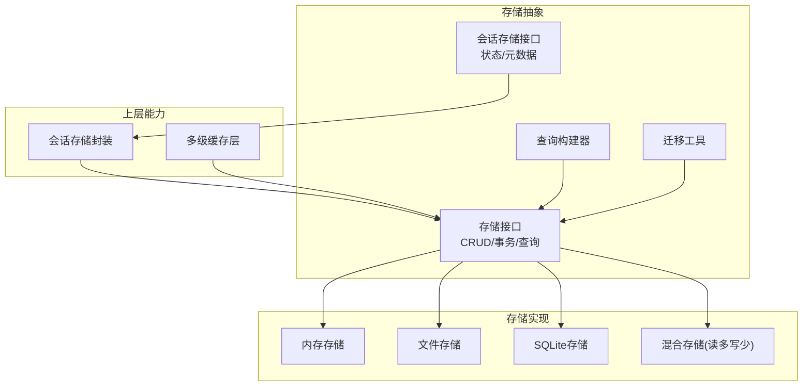
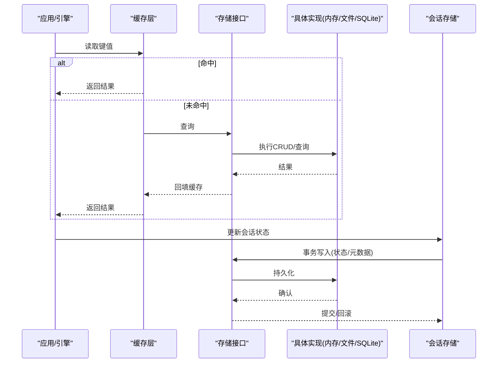
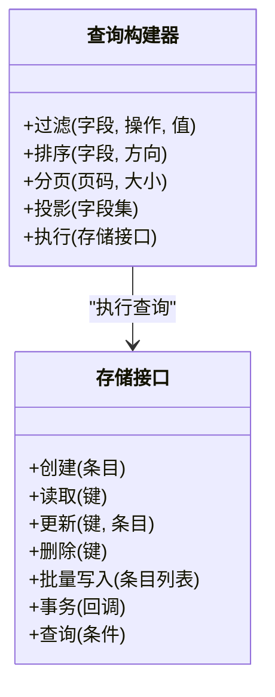
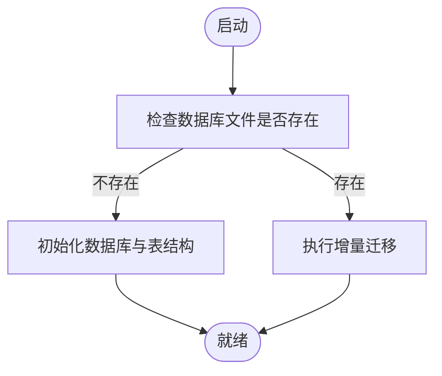
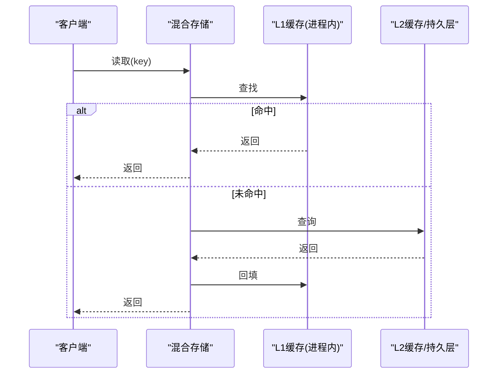
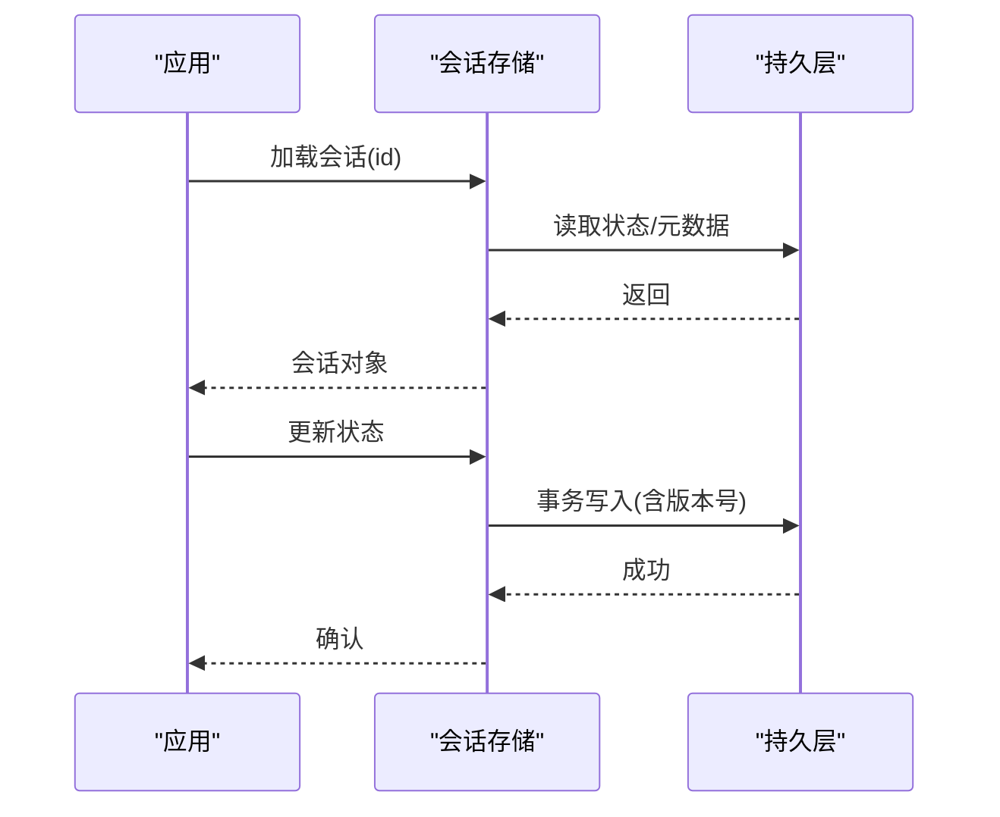
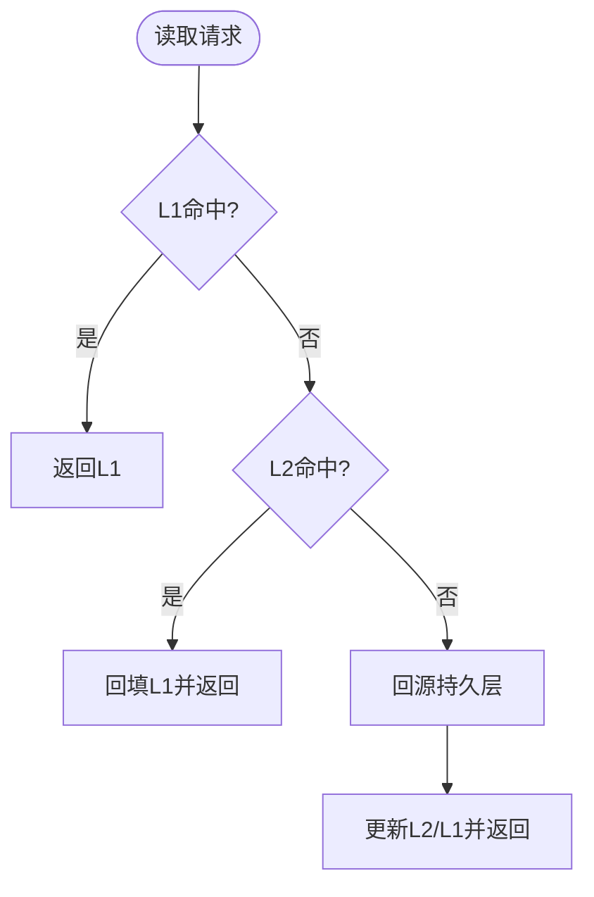
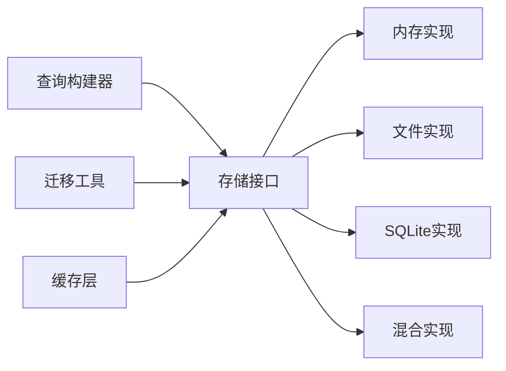

# 数据存储系统

<cite>
**本文引用的文件**   
- [engine/packages/infrastructure/src/storage/index.ts](file://engine/packages/infrastructure/src/storage/index.ts)
- [engine/packages/infrastructure/src/storage/memory-store.ts](file://engine/packages/infrastructure/src/storage/memory-store.ts)
- [engine/packages/infrastructure/src/storage/file-store.ts](file://engine/packages/infrastructure/src/storage/file-store.ts)
- [engine/packages/infrastructure/src/storage/sqlite-store.ts](file://engine/packages/infrastructure/src/storage/sqlite-store.ts)
- [engine/packages/infrastructure/src/storage/hybrid-store.ts](file://engine/packages/infrastructure/src/storage/hybrid-store.ts)
- [engine/packages/infrastructure/src/storage/session-store.ts](file://engine/packages/infrastructure/src/storage/session-store.ts)
- [engine/packages/infrastructure/src/storage/cache-layer.ts](file://engine/packages/infrastructure/src/storage/cache-layer.ts)
- [engine/packages/infrastructure/src/storage/migration.ts](file://engine/packages/infrastructure/src/storage/migration.ts)
- [engine/packages/infrastructure/src/storage/query-builder.ts](file://engine/packages/infrastructure/src/storage/query-builder.ts)
- [engine/tests/file-session-store.test.ts](file://engine/tests/file-session-store.test.ts)
- [engine/tests/hybrid-store.test.ts](file://engine/tests/hybrid-store.test.ts)
- [engine/tests/memory-store.test.ts](file://engine/tests/memory-store.test.ts)
- [engine/scripts/prepare-sqlite.mjs](file://engine/scripts/prepare-sqlite.mjs)
</cite>

## 目录
1. [简介](#简介)
2. [项目结构](#项目结构)
3. [核心组件](#核心组件)
4. [架构总览](#架构总览)
5. [详细组件分析](#详细组件分析)
6. [依赖分析](#依赖分析)
7. [性能考虑](#性能考虑)
8. [故障排查指南](#故障排查指南)
9. [结论](#结论)
10. [附录](#附录)

## 简介
本文件面向KCoder的数据存储子系统，聚焦于存储抽象层的设计与实现，覆盖内存、文件与SQLite持久化三种后端；阐述统一的CRUD接口、事务支持、查询构建器；说明会话存储的状态持久化、数据迁移与备份恢复策略；解释缓存层的多级缓存、失效策略与优化手段；并提供扩展新存储后端的实践路径。同时给出数据一致性与并发访问控制机制的说明。

## 项目结构
存储子系统位于基础设施包中，采用“接口定义 + 多实现 + 组合适配”的分层组织方式：
- 接口与契约：统一存储接口、会话存储接口、查询构建器、迁移工具等
- 具体实现：内存、文件、SQLite、混合（读写分离）存储
- 上层能力：缓存层、会话存储封装、脚本与测试

图表来源
- [engine/packages/infrastructure/src/storage/index.ts](file://engine/packages/infrastructure/src/storage/index.ts)
- [engine/packages/infrastructure/src/storage/memory-store.ts](file://engine/packages/infrastructure/src/storage/memory-store.ts)
- [engine/packages/infrastructure/src/storage/file-store.ts](file://engine/packages/infrastructure/src/storage/file-store.ts)
- [engine/packages/infrastructure/src/storage/sqlite-store.ts](file://engine/packages/infrastructure/src/storage/sqlite-store.ts)
- [engine/packages/infrastructure/src/storage/hybrid-store.ts](file://engine/packages/infrastructure/src/storage/hybrid-store.ts)
- [engine/packages/infrastructure/src/storage/session-store.ts](file://engine/packages/infrastructure/src/storage/session-store.ts)
- [engine/packages/infrastructure/src/storage/cache-layer.ts](file://engine/packages/infrastructure/src/storage/cache-layer.ts)
- [engine/packages/infrastructure/src/storage/migration.ts](file://engine/packages/infrastructure/src/storage/migration.ts)
- [engine/packages/infrastructure/src/storage/query-builder.ts](file://engine/packages/infrastructure/src/storage/query-builder.ts)

章节来源
- [engine/packages/infrastructure/src/storage/index.ts](file://engine/packages/infrastructure/src/storage/index.ts)
- [engine/packages/infrastructure/src/storage/memory-store.ts](file://engine/packages/infrastructure/src/storage/memory-store.ts)
- [engine/packages/infrastructure/src/storage/file-store.ts](file://engine/packages/infrastructure/src/storage/file-store.ts)
- [engine/packages/infrastructure/src/storage/sqlite-store.ts](file://engine/packages/infrastructure/src/storage/sqlite-store.ts)
- [engine/packages/infrastructure/src/storage/hybrid-store.ts](file://engine/packages/infrastructure/src/storage/hybrid-store.ts)
- [engine/packages/infrastructure/src/storage/session-store.ts](file://engine/packages/infrastructure/src/storage/session-store.ts)
- [engine/packages/infrastructure/src/storage/cache-layer.ts](file://engine/packages/infrastructure/src/storage/cache-layer.ts)
- [engine/packages/infrastructure/src/storage/migration.ts](file://engine/packages/infrastructure/src/storage/migration.ts)
- [engine/packages/infrastructure/src/storage/query-builder.ts](file://engine/packages/infrastructure/src/storage/query-builder.ts)

## 核心组件
- 存储接口：定义统一的CRUD操作、事务边界、批量写入与查询入口，屏蔽底层差异
- 查询构建器：提供链式API构造过滤、排序、分页与投影，降低SQL/序列化细节暴露
- 事务支持：在单连接或原子写入单元内保证操作的ACID特性
- 会话存储：围绕会话状态与元数据的持久化、版本迁移与备份恢复
- 缓存层：多级缓存（进程内+磁盘/数据库），带失效策略与一致性保障
- 混合存储：读多写少场景下，将热点读走内存/缓存，冷数据落盘或进SQLite

章节来源
- [engine/packages/infrastructure/src/storage/index.ts](file://engine/packages/infrastructure/src/storage/index.ts)
- [engine/packages/infrastructure/src/storage/query-builder.ts](file://engine/packages/infrastructure/src/storage/query-builder.ts)
- [engine/packages/infrastructure/src/storage/session-store.ts](file://engine/packages/infrastructure/src/storage/session-store.ts)
- [engine/packages/infrastructure/src/storage/cache-layer.ts](file://engine/packages/infrastructure/src/storage/cache-layer.ts)
- [engine/packages/infrastructure/src/storage/hybrid-store.ts](file://engine/packages/infrastructure/src/storage/hybrid-store.ts)

## 架构总览
下图展示从调用方到不同存储后端的整体流程，以及缓存与会话层的介入点。

图表来源
- [engine/packages/infrastructure/src/storage/cache-layer.ts](file://engine/packages/infrastructure/src/storage/cache-layer.ts)
- [engine/packages/infrastructure/src/storage/index.ts](file://engine/packages/infrastructure/src/storage/index.ts)
- [engine/packages/infrastructure/src/storage/memory-store.ts](file://engine/packages/infrastructure/src/storage/memory-store.ts)
- [engine/packages/infrastructure/src/storage/file-store.ts](file://engine/packages/infrastructure/src/storage/file-store.ts)
- [engine/packages/infrastructure/src/storage/sqlite-store.ts](file://engine/packages/infrastructure/src/storage/sqlite-store.ts)
- [engine/packages/infrastructure/src/storage/session-store.ts](file://engine/packages/infrastructure/src/storage/session-store.ts)

## 详细组件分析

### 存储接口与CRUD/事务/查询构建器
- 统一接口
  - 定义增删改查、批量操作、事务边界、错误语义与幂等约定
  - 为查询构建器提供执行上下文，使同一查询DSL可跨后端运行
- 事务支持
  - 以事务块包裹多个写操作，失败时整体回滚
  - 对文件/SQLite分别采用原子写入与数据库事务
- 查询构建器
  - 链式API：过滤、排序、分页、投影
  - 内部生成后端可执行的查询计划，交由具体实现执行

图表来源
- [engine/packages/infrastructure/src/storage/index.ts](file://engine/packages/infrastructure/src/storage/index.ts)
- [engine/packages/infrastructure/src/storage/query-builder.ts](file://engine/packages/infrastructure/src/storage/query-builder.ts)

章节来源
- [engine/packages/infrastructure/src/storage/index.ts](file://engine/packages/infrastructure/src/storage/index.ts)
- [engine/packages/infrastructure/src/storage/query-builder.ts](file://engine/packages/infrastructure/src/storage/query-builder.ts)

### 内存存储
- 特点
  - 基于进程内数据结构，延迟极低，适合单元测试与临时缓存
  - 无持久化，重启丢失
- 适用场景
  - 快速原型、集成测试、热路径短生命周期数据

章节来源
- [engine/packages/infrastructure/src/storage/memory-store.ts](file://engine/packages/infrastructure/src/storage/memory-store.ts)
- [engine/tests/memory-store.test.ts](file://engine/tests/memory-store.test.ts)

### 文件存储
- 特点
  - 以文件系统为介质，具备简单可靠、易备份的特性
  - 通过原子写入与校验确保一致性
- 适用场景
  - 配置、日志、小型结构化数据、离线归档

章节来源
- [engine/packages/infrastructure/src/storage/file-store.ts](file://engine/packages/infrastructure/src/storage/file-store.ts)
- [engine/tests/file-session-store.test.ts](file://engine/tests/file-session-store.test.ts)

### SQLite持久化存储
- 特点
  - 关系型、ACID事务、索引与复杂查询能力强
  - 适合结构化业务数据与历史快照
- 初始化与准备
  - 使用脚本完成数据库文件准备与表结构初始化

图表来源
- [engine/packages/infrastructure/src/storage/sqlite-store.ts](file://engine/packages/infrastructure/src/storage/sqlite-store.ts)
- [engine/scripts/prepare-sqlite.mjs](file://engine/scripts/prepare-sqlite.mjs)

章节来源
- [engine/packages/infrastructure/src/storage/sqlite-store.ts](file://engine/packages/infrastructure/src/storage/sqlite-store.ts)
- [engine/scripts/prepare-sqlite.mjs](file://engine/scripts/prepare-sqlite.mjs)

### 混合存储（读多写少）
- 设计
  - 读路径：优先命中缓存/内存，未命中再回源至持久层
  - 写路径：先写持久层，再按策略更新缓存
- 优势
  - 降低热点读对持久层的压力，提升吞吐与延迟表现

图表来源
- [engine/packages/infrastructure/src/storage/hybrid-store.ts](file://engine/packages/infrastructure/src/storage/hybrid-store.ts)
- [engine/packages/infrastructure/src/storage/cache-layer.ts](file://engine/packages/infrastructure/src/storage/cache-layer.ts)

章节来源
- [engine/packages/infrastructure/src/storage/hybrid-store.ts](file://engine/packages/infrastructure/src/storage/hybrid-store.ts)
- [engine/tests/hybrid-store.test.ts](file://engine/tests/hybrid-store.test.ts)

### 会话存储（状态持久化、迁移、备份恢复）
- 功能
  - 会话状态与元数据的持久化
  - 版本化迁移，兼容旧格式
  - 备份与恢复：导出/导入会话快照，支持断点续跑
- 典型流程

图表来源
- [engine/packages/infrastructure/src/storage/session-store.ts](file://engine/packages/infrastructure/src/storage/session-store.ts)
- [engine/packages/infrastructure/src/storage/migration.ts](file://engine/packages/infrastructure/src/storage/migration.ts)

章节来源
- [engine/packages/infrastructure/src/storage/session-store.ts](file://engine/packages/infrastructure/src/storage/session-store.ts)
- [engine/packages/infrastructure/src/storage/migration.ts](file://engine/packages/infrastructure/src/storage/migration.ts)
- [engine/tests/file-session-store.test.ts](file://engine/tests/file-session-store.test.ts)

### 缓存层（多级缓存、失效策略、性能优化）
- 多级缓存
  - L1：进程内内存缓存，低延迟
  - L2：磁盘/数据库缓存，容量大、可共享
- 失效策略
  - TTL过期、LRU淘汰、事件驱动失效（写后失效）
- 一致性
  - 写路径主动失效或更新缓存，避免脏读
- 性能优化
  - 批量写入合并、预取热点键、压缩与分片

图表来源
- [engine/packages/infrastructure/src/storage/cache-layer.ts](file://engine/packages/infrastructure/src/storage/cache-layer.ts)

章节来源
- [engine/packages/infrastructure/src/storage/cache-layer.ts](file://engine/packages/infrastructure/src/storage/cache-layer.ts)

### 扩展新的存储后端（示例步骤）
- 步骤
  1) 新建实现类，遵循存储接口契约（CRUD/事务/查询）
  2) 实现事务语义（如文件原子写入、数据库事务）
  3) 注册到工厂或容器，供上层注入
  4) 编写单元测试覆盖关键路径与异常分支
- 参考位置
  - 接口定义与契约：[engine/packages/infrastructure/src/storage/index.ts](file://engine/packages/infrastructure/src/storage/index.ts)
  - 已有实现参考：内存/文件/SQLite/Hybrid
  - 测试用例参考：[engine/tests/hybrid-store.test.ts](file://engine/tests/hybrid-store.test.ts)、[engine/tests/memory-store.test.ts](file://engine/tests/memory-store.test.ts)

章节来源
- [engine/packages/infrastructure/src/storage/index.ts](file://engine/packages/infrastructure/src/storage/index.ts)
- [engine/packages/infrastructure/src/storage/memory-store.ts](file://engine/packages/infrastructure/src/storage/memory-store.ts)
- [engine/packages/infrastructure/src/storage/file-store.ts](file://engine/packages/infrastructure/src/storage/file-store.ts)
- [engine/packages/infrastructure/src/storage/sqlite-store.ts](file://engine/packages/infrastructure/src/storage/sqlite-store.ts)
- [engine/packages/infrastructure/src/storage/hybrid-store.ts](file://engine/packages/infrastructure/src/storage/hybrid-store.ts)
- [engine/tests/hybrid-store.test.ts](file://engine/tests/hybrid-store.test.ts)
- [engine/tests/memory-store.test.ts](file://engine/tests/memory-store.test.ts)

## 依赖分析
- 耦合与内聚
  - 存储实现仅依赖接口与通用工具，内聚度高
  - 查询构建器与迁移工具作为横切能力被各实现复用
- 外部依赖
  - SQLite后端依赖数据库驱动与脚本初始化
  - 文件存储依赖文件系统原子写入能力
- 循环依赖
  - 通过接口解耦，避免实现间直接相互引用

图表来源
- [engine/packages/infrastructure/src/storage/index.ts](file://engine/packages/infrastructure/src/storage/index.ts)
- [engine/packages/infrastructure/src/storage/query-builder.ts](file://engine/packages/infrastructure/src/storage/query-builder.ts)
- [engine/packages/infrastructure/src/storage/migration.ts](file://engine/packages/infrastructure/src/storage/migration.ts)
- [engine/packages/infrastructure/src/storage/cache-layer.ts](file://engine/packages/infrastructure/src/storage/cache-layer.ts)

章节来源
- [engine/packages/infrastructure/src/storage/index.ts](file://engine/packages/infrastructure/src/storage/index.ts)
- [engine/packages/infrastructure/src/storage/query-builder.ts](file://engine/packages/infrastructure/src/storage/query-builder.ts)
- [engine/packages/infrastructure/src/storage/migration.ts](file://engine/packages/infrastructure/src/storage/migration.ts)
- [engine/packages/infrastructure/src/storage/cache-layer.ts](file://engine/packages/infrastructure/src/storage/cache-layer.ts)

## 性能考虑
- 选择合适后端
  - 高频小对象：内存/混合存储
  - 结构化强查询：SQLite
  - 归档与离线：文件存储
- 缓存策略
  - 合理设置TTL与淘汰策略，避免缓存雪崩
  - 写后失效或延迟双写，平衡一致性与性能
- 事务与批处理
  - 合并小事务，减少锁竞争与IO次数
- 索引与查询
  - 在SQLite上为常用过滤/排序字段建立索引
  - 使用查询构建器的投影减少数据传输

## 故障排查指南
- 常见问题
  - 事务回滚：检查约束冲突与唯一性约束
  - 文件损坏：校验与回滚到最近快照
  - 缓存不一致：确认写后失效逻辑是否触发
- 定位方法
  - 开启调试日志，记录事务边界与关键路径耗时
  - 针对SQLite，检查PRAGMA与索引使用情况
  - 针对文件存储，验证原子写入与校验和

章节来源
- [engine/packages/infrastructure/src/storage/session-store.ts](file://engine/packages/infrastructure/src/storage/session-store.ts)
- [engine/packages/infrastructure/src/storage/cache-layer.ts](file://engine/packages/infrastructure/src/storage/cache-layer.ts)
- [engine/packages/infrastructure/src/storage/sqlite-store.ts](file://engine/packages/infrastructure/src/storage/sqlite-store.ts)
- [engine/packages/infrastructure/src/storage/file-store.ts](file://engine/packages/infrastructure/src/storage/file-store.ts)

## 结论
KCoder存储抽象层通过统一接口屏蔽底层差异，结合查询构建器与事务能力，提供了可扩展、高性能且一致的数据存取方案。会话存储与迁移机制保障了长期演进与可靠性；多级缓存进一步提升了吞吐与延迟表现。建议在生产环境根据数据特征选择合适的后端与缓存策略，并通过完善的测试与监控持续优化。

## 附录
- 相关测试
  - 文件会话存储：[engine/tests/file-session-store.test.ts](file://engine/tests/file-session-store.test.ts)
  - 混合存储：[engine/tests/hybrid-store.test.ts](file://engine/tests/hybrid-store.test.ts)
  - 内存存储：[engine/tests/memory-store.test.ts](file://engine/tests/memory-store.test.ts)
- 初始化脚本
  - SQLite准备：[engine/scripts/prepare-sqlite.mjs](file://engine/scripts/prepare-sqlite.mjs)