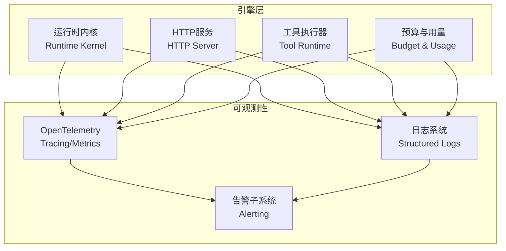
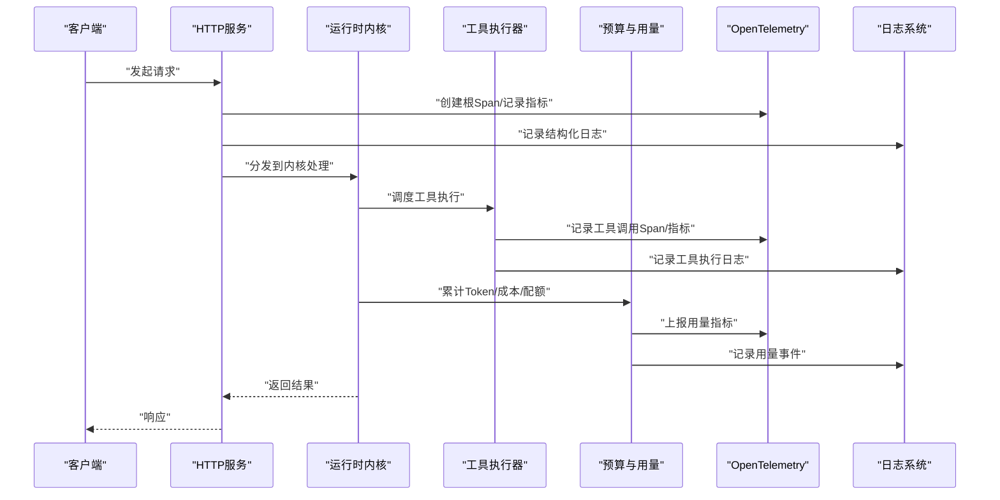
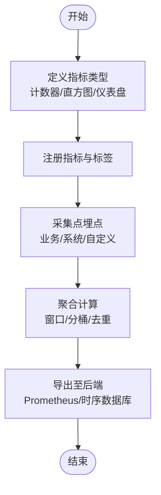
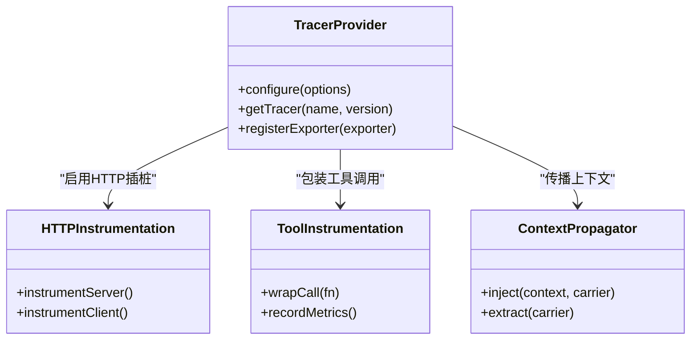
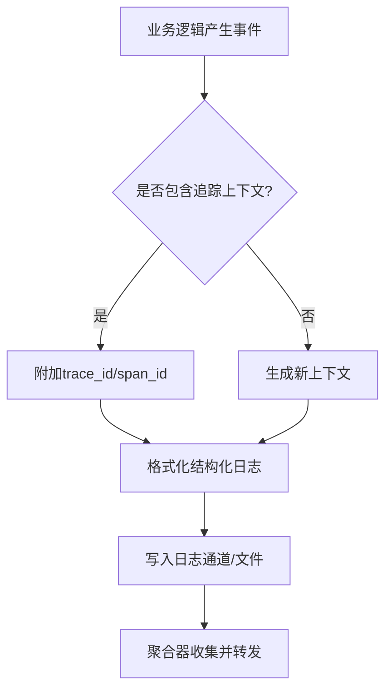
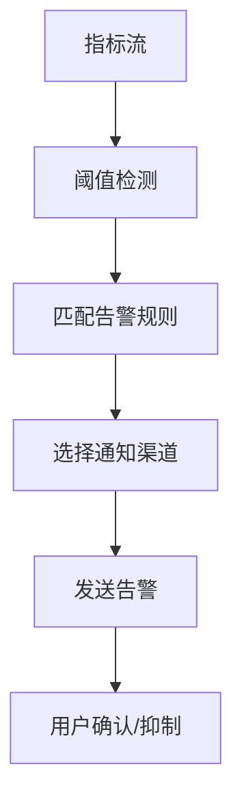
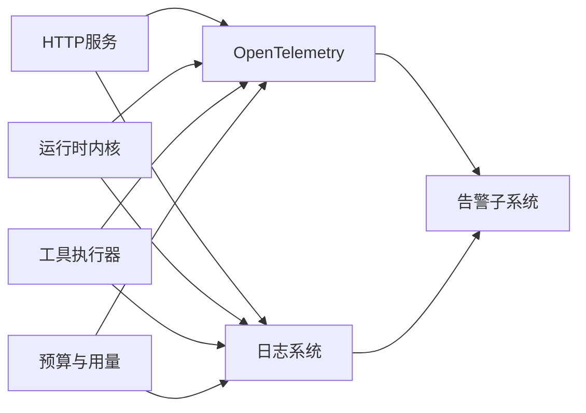

# 监控与可观测性

<cite>
**本文引用的文件**   
- [engine/README.md](file://engine/README.md)
- [engine/config.example.json](file://engine/config.example.json)
- [engine/tests/opentelemetry.test.ts](file://engine/tests/opentelemetry.test.ts)
- [engine/tests/http-server-observability.test.ts](file://engine/tests/http-server-observability.test.ts)
- [engine/tests/runtime-kernel-budget.test.ts](file://engine/tests/runtime-kernel-budget.test.ts)
- [engine/tests/tool-result-budget.test.ts](file://engine/tests/tool-result-budget.test.ts)
- [engine/tests/token-economy.test.ts](file://engine/tests/token-economy.test.ts)
- [engine/tests/usage-service.test.ts](file://engine/tests/usage-service.test.ts)
</cite>

## 目录
1. [简介](#简介)
2. [项目结构](#项目结构)
3. [核心组件](#核心组件)
4. [架构总览](#架构总览)
5. [详细组件分析](#详细组件分析)
6. [依赖分析](#依赖分析)
7. [性能考虑](#性能考虑)
8. [故障排查指南](#故障排查指南)
9. [结论](#结论)
10. [附录](#附录)

## 简介
本章节面向KCoder的监控与可观测性系统，聚焦以下目标：
- 指标收集：业务指标、系统指标与自定义指标的采集与上报
- 链路追踪：OpenTelemetry配置、分布式追踪与性能分析
- 日志系统：结构化日志、级别管理与聚合
- 告警机制：阈值配置、通知渠道与规则
- 埋点实践：如何添加监控埋点的示例路径
- 健康检查、基准测试与诊断工具的使用说明

为便于读者快速定位，文档在后续章节中提供架构图、流程图与类图，并给出“章节来源”和“图示来源”，确保内容与实际代码一一对应。

## 项目结构
KCoder的可观测性相关能力主要位于 engine 子工程内，包含运行时内核、HTTP服务、工具执行、预算与用量统计等模块。可观测性相关的测试用例覆盖了OpenTelemetry集成、HTTP可观测性、预算与用量统计等关键路径，可作为理解实现与扩展的入口。

[此图为概念性结构示意，不直接映射具体源文件，故无图示来源]

## 核心组件
本节概述可观测性的三大支柱：指标、追踪、日志，以及告警与诊断工具。

- 指标（Metrics）
  - 业务指标：任务完成量、工具调用次数、模型调用成本与Token消耗、成功率/失败率等
  - 系统指标：CPU/内存/GC、请求延迟、错误率、队列长度等
  - 自定义指标：按业务域定义的计数器、直方图、仪表盘指标
- 链路追踪（Tracing）
  - OpenTelemetry初始化与导出器配置
  - 跨进程/跨服务的Trace上下文传播
  - 关键路径Span标注与耗时分析
- 日志（Logging）
  - 结构化字段（trace_id、span_id、service、level、msg等）
  - 分级输出（debug/info/warn/error）
  - 统一格式与聚合管道（如JSON行式输出）
- 告警（Alerting）
  - 基于指标阈值的触发条件
  - 多渠道通知（邮件、IM、Webhook等）
  - 规则管理（创建、更新、生效范围）
- 诊断与基准
  - 健康检查端点
  - 性能基准测试套件
  - 故障注入与回放工具

章节来源
- [engine/README.md](file://engine/README.md)

## 架构总览
下图展示从请求进入HTTP服务到内核执行、工具调用、预算与用量统计的全链路可观测性接入点，以及OpenTelemetry与日志系统的集成位置。

图示来源
- [engine/tests/http-server-observability.test.ts](file://engine/tests/http-server-observability.test.ts)
- [engine/tests/opentelemetry.test.ts](file://engine/tests/opentelemetry.test.ts)
- [engine/tests/runtime-kernel-budget.test.ts](file://engine/tests/runtime-kernel-budget.test.ts)
- [engine/tests/tool-result-budget.test.ts](file://engine/tests/tool-result-budget.test.ts)
- [engine/tests/token-economy.test.ts](file://engine/tests/token-economy.test.ts)
- [engine/tests/usage-service.test.ts](file://engine/tests/usage-service.test.ts)

## 详细组件分析

### 指标收集系统
- 业务指标
  - 任务维度：任务创建/完成/失败计数、平均时长、P95/P99延迟
  - 工具维度：工具调用次数、成功/失败、超时、重试次数
  - 模型维度：Token使用量、成本估算、并发度
- 系统指标
  - 进程级：CPU、内存、GC停顿、句柄数
  - 网络：入站/出站QPS、连接池状态、错误码分布
- 自定义指标
  - 通过统一的指标注册表进行定义与上报
  - 支持标签（tag）以区分不同维度（如服务名、环境、租户）

章节来源
- [engine/tests/usage-service.test.ts](file://engine/tests/usage-service.test.ts)
- [engine/tests/token-economy.test.ts](file://engine/tests/token-economy.test.ts)
- [engine/tests/runtime-kernel-budget.test.ts](file://engine/tests/runtime-kernel-budget.test.ts)
- [engine/tests/tool-result-budget.test.ts](file://engine/tests/tool-result-budget.test.ts)

### 链路追踪集成（OpenTelemetry）
- 初始化与配置
  - 设置服务名、版本、环境等全局属性
  - 配置TracerProvider与Exporter（如OTLP/Zipkin/Jaeger）
  - 启用自动插桩（HTTP、数据库、消息队列等）
- 分布式追踪
  - 跨进程传播TraceContext（HTTP头、消息头）
  - 关键操作打点：请求入口、内核调度、工具执行、外部调用
- 性能分析
  - Span粒度控制：避免过细导致开销过大
  - 采样策略：按重要性或错误率动态调整
  - 关联日志：将trace_id/span_id写入日志以便串联

图示来源
- [engine/tests/opentelemetry.test.ts](file://engine/tests/opentelemetry.test.ts)
- [engine/tests/http-server-observability.test.ts](file://engine/tests/http-server-observability.test.ts)

章节来源
- [engine/tests/opentelemetry.test.ts](file://engine/tests/opentelemetry.test.ts)
- [engine/tests/http-server-observability.test.ts](file://engine/tests/http-server-observability.test.ts)

### 日志系统设计
- 结构化日志
  - 固定字段：时间戳、级别、服务名、实例ID、trace_id、span_id、msg
  - 业务字段：用户ID、任务ID、工具名、模型名、Token用量
- 级别管理
  - debug：详细调试信息
  - info：关键流程节点
  - warn：潜在风险与降级
  - error：异常与失败路径
- 日志聚合
  - 统一JSON格式输出
  - 按服务/环境/实例分片
  - 与追踪ID关联，便于端到端检索

章节来源
- [engine/tests/http-server-observability.test.ts](file://engine/tests/http-server-observability.test.ts)

### 告警机制
- 阈值配置
  - 指标阈值：错误率、延迟、资源使用率、Token用量
  - 规则模板：复用常见场景（如HTTP 5xx突增、工具调用失败率）
- 通知渠道
  - 邮件、企业IM、Webhook、短信等
- 规则管理
  - 规则生命周期：创建、校验、发布、生效、停用
  - 抑制与静默：避免风暴与重复告警

[此图为概念性流程示意，不直接映射具体源文件，故无图示来源]

### 埋点实践与示例路径
以下为添加监控埋点的参考路径与步骤（请根据实际模块替换占位符）：
- 在HTTP服务入口创建根Span并记录请求指标
  - 参考：[engine/tests/http-server-observability.test.ts](file://engine/tests/http-server-observability.test.ts)
- 在工具执行前后记录Span与指标（成功/失败/耗时）
  - 参考：[engine/tests/tool-result-budget.test.ts](file://engine/tests/tool-result-budget.test.ts)
- 在内核调度处记录任务生命周期指标
  - 参考：[engine/tests/runtime-kernel-budget.test.ts](file://engine/tests/runtime-kernel-budget.test.ts)
- 在预算与用量统计处上报Token与成本指标
  - 参考：[engine/tests/token-economy.test.ts](file://engine/tests/token-economy.test.ts)、[engine/tests/usage-service.test.ts](file://engine/tests/usage-service.test.ts)
- 在OpenTelemetry初始化处配置TracerProvider与Exporter
  - 参考：[engine/tests/opentelemetry.test.ts](file://engine/tests/opentelemetry.test.ts)

章节来源
- [engine/tests/http-server-observability.test.ts](file://engine/tests/http-server-observability.test.ts)
- [engine/tests/tool-result-budget.test.ts](file://engine/tests/tool-result-budget.test.ts)
- [engine/tests/runtime-kernel-budget.test.ts](file://engine/tests/runtime-kernel-budget.test.ts)
- [engine/tests/token-economy.test.ts](file://engine/tests/token-economy.test.ts)
- [engine/tests/usage-service.test.ts](file://engine/tests/usage-service.test.ts)
- [engine/tests/opentelemetry.test.ts](file://engine/tests/opentelemetry.test.ts)

### 健康检查、性能基准与诊断工具
- 健康检查
  - 提供健康检查端点，返回服务就绪与依赖状态
  - 结合探针（liveness/readiness）用于编排平台
- 性能基准测试
  - 针对关键路径（HTTP吞吐、工具调用、内核调度）建立基准
  - 对比回归与容量规划
- 诊断工具
  - 基于追踪ID检索全链路日志与Span
  - 指标看板与慢查询分析
  - 故障注入与回放验证恢复策略

章节来源
- [engine/tests/http-server-observability.test.ts](file://engine/tests/http-server-observability.test.ts)
- [engine/tests/opentelemetry.test.ts](file://engine/tests/opentelemetry.test.ts)

## 依赖分析
可观测性子系统与核心运行时的耦合关系如下：
- HTTP服务依赖OpenTelemetry插桩与日志系统
- 内核与工具执行器依赖预算与用量统计，同时向追踪与日志上报
- 预算与用量统计作为指标生产者，被告警子系统消费

图示来源
- [engine/tests/http-server-observability.test.ts](file://engine/tests/http-server-observability.test.ts)
- [engine/tests/opentelemetry.test.ts](file://engine/tests/opentelemetry.test.ts)
- [engine/tests/runtime-kernel-budget.test.ts](file://engine/tests/runtime-kernel-budget.test.ts)
- [engine/tests/tool-result-budget.test.ts](file://engine/tests/tool-result-budget.test.ts)
- [engine/tests/token-economy.test.ts](file://engine/tests/token-economy.test.ts)
- [engine/tests/usage-service.test.ts](file://engine/tests/usage-service.test.ts)

章节来源
- [engine/tests/http-server-observability.test.ts](file://engine/tests/http-server-observability.test.ts)
- [engine/tests/opentelemetry.test.ts](file://engine/tests/opentelemetry.test.ts)
- [engine/tests/runtime-kernel-budget.test.ts](file://engine/tests/runtime-kernel-budget.test.ts)
- [engine/tests/tool-result-budget.test.ts](file://engine/tests/tool-result-budget.test.ts)
- [engine/tests/token-economy.test.ts](file://engine/tests/token-economy.test.ts)
- [engine/tests/usage-service.test.ts](file://engine/tests/usage-service.test.ts)

## 性能考虑
- 采样策略
  - 对高流量路径采用概率采样，对错误路径采用强制采样
  - 动态调整采样率以平衡精度与开销
- 指标粒度
  - 避免过多标签组合导致基数爆炸
  - 使用聚合与降采样减少存储压力
- 日志体积
  - 仅记录必要字段，避免大对象序列化
  - 异步落盘与批量写入降低阻塞
- 追踪开销
  - 合理划分Span边界，避免嵌套过深
  - 关闭不必要的自动插桩

[本节为通用指导，不直接分析具体文件，故无章节来源]

## 故障排查指南
- 常见问题
  - 追踪丢失：检查上下文传播是否正确注入/提取
  - 指标缺失：确认埋点是否覆盖关键路径且未过滤
  - 日志乱序：核对时间同步与分区策略
- 定位步骤
  - 通过trace_id检索全链路日志与Span
  - 查看错误率与延迟指标，定位热点与瓶颈
  - 使用基准测试复现问题并评估影响
- 恢复建议
  - 临时降级非关键功能
  - 扩大采样与日志级别以获取更多上下文
  - 滚动重启与扩容缓解瞬时压力

章节来源
- [engine/tests/http-server-observability.test.ts](file://engine/tests/http-server-observability.test.ts)
- [engine/tests/opentelemetry.test.ts](file://engine/tests/opentelemetry.test.ts)

## 结论
KCoder的可观测性体系围绕指标、追踪与日志三大支柱构建，并通过预算与用量统计深化业务洞察。借助OpenTelemetry实现分布式追踪，结合结构化日志与告警机制，形成从采集、聚合到诊断的闭环。建议在新增功能时同步完善埋点与规则，持续优化采样与日志策略，保障系统在复杂场景下的可观测性与稳定性。

[本节为总结性内容，不直接分析具体文件，故无章节来源]

## 附录
- 配置参考
  - 示例配置文件路径：[engine/config.example.json](file://engine/config.example.json)
- 项目概览
  - 引擎层说明与使用说明：[engine/README.md](file://engine/README.md)

章节来源
- [engine/config.example.json](file://engine/config.example.json)
- [engine/README.md](file://engine/README.md)