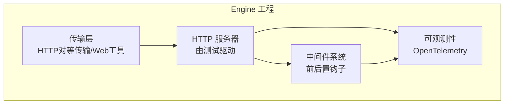
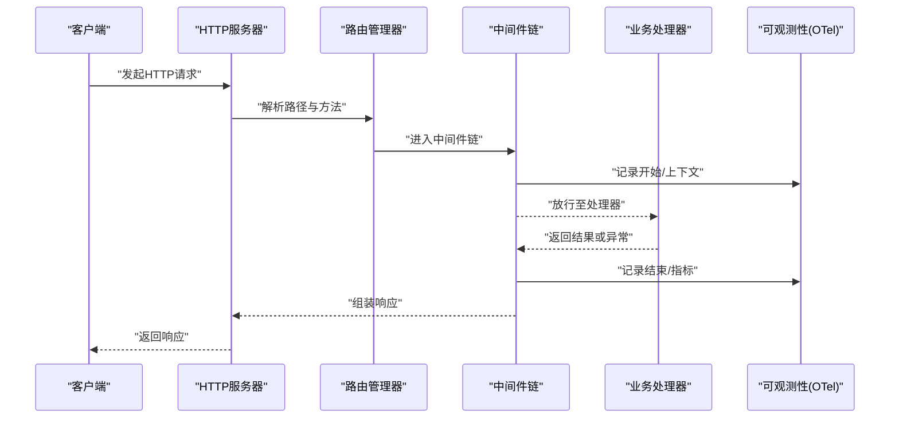
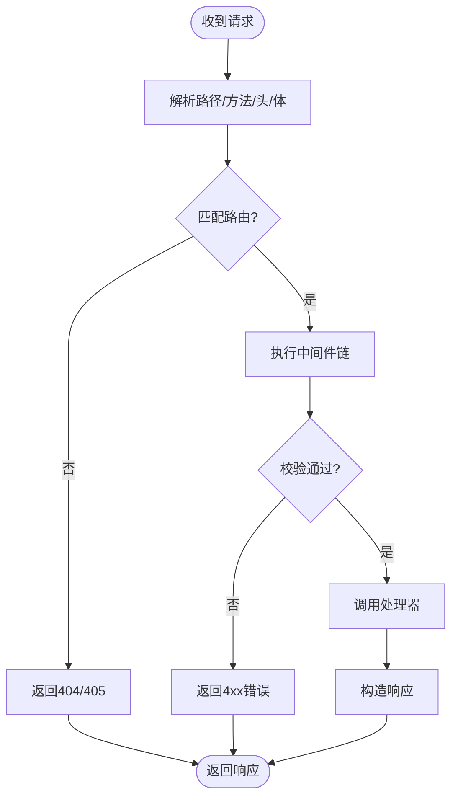
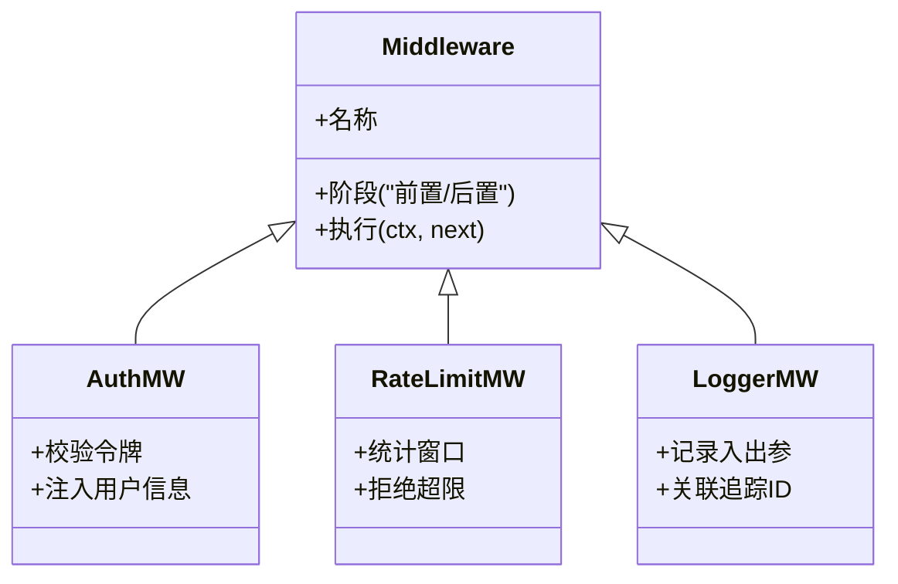
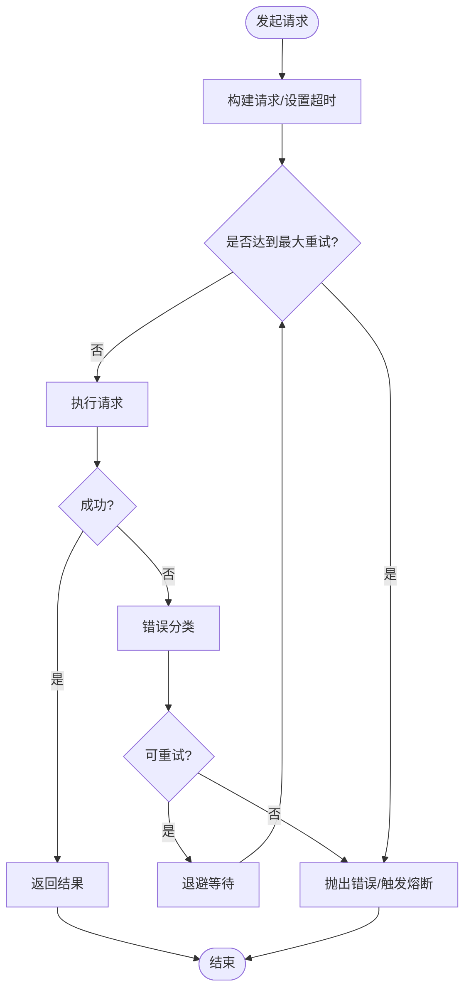
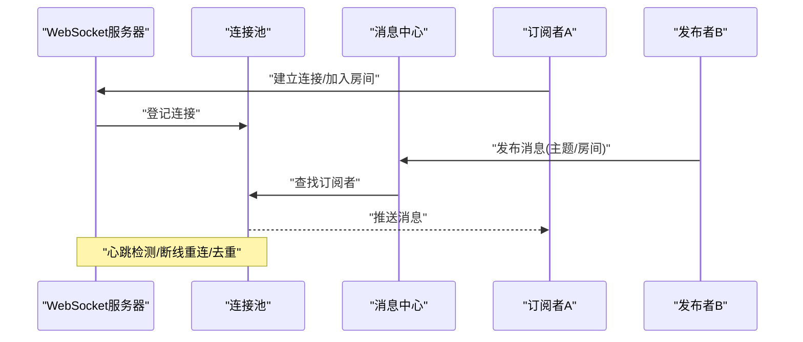
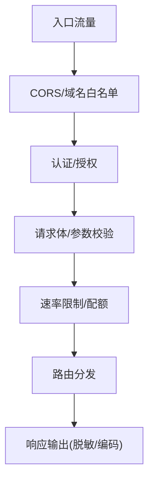
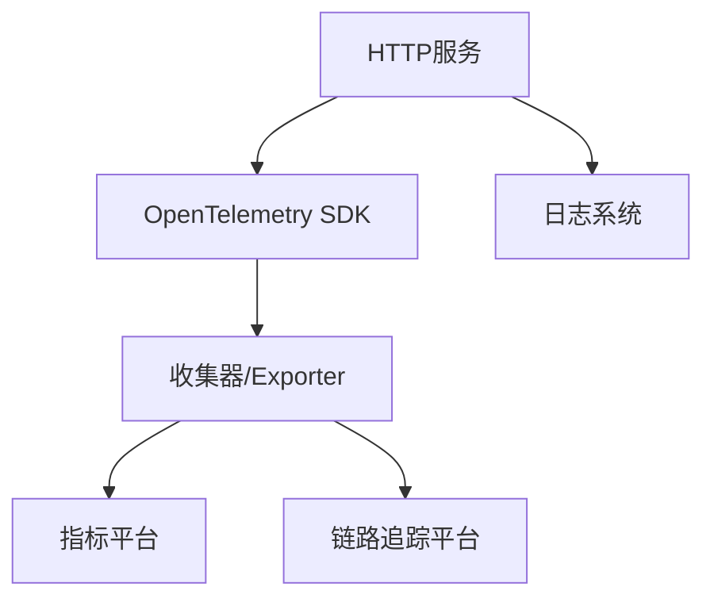
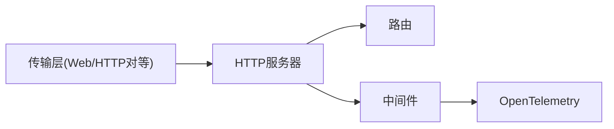

# 网络服务基础设施

<cite>
**本文引用的文件**   
- [engine/package.json](file://engine/package.json)
- [engine/README.md](file://engine/README.md)
- [engine/tests/http-server.test.ts](file://engine/tests/http-server.test.ts)
- [engine/tests/http-server-test-harness.ts](file://engine/tests/http-server-test-harness.ts)
- [engine/tests/http-artifacts.test.ts](file://engine/tests/http-artifacts.test.ts)
- [engine/tests/read-json-body.test.ts](file://engine/tests/read-json-body.test.ts)
- [engine/tests/runtime-kernel-after-middleware.test.ts](file://engine/tests/runtime-kernel-after-middleware.test.ts)
- [engine/tests/runtime-middleware-governance.test.ts](file://engine/tests/runtime-middleware-governance.test.ts)
- [engine/tests/runtime-middleware.test.ts](file://engine/tests/runtime-middleware.test.ts)
- [engine/tests/http-peer-transport.test.ts](file://engine/tests/http-peer-transport.test.ts)
- [engine/tests/web-tool-provider.test.ts](file://engine/tests/web-tool-provider.test.ts)
- [engine/tests/opentelemetry.test.ts](file://engine/tests/opentelemetry.test.ts)
- [engine/tests/http-server-observability.test.ts](file://engine/tests/http-server-observability.test.ts)
</cite>

## 目录
1. [简介](#简介)
2. [项目结构](#项目结构)
3. [核心组件](#核心组件)
4. [架构总览](#架构总览)
5. [详细组件分析](#详细组件分析)
6. [依赖关系分析](#依赖关系分析)
7. [性能考量](#性能考量)
8. [故障排查指南](#故障排查指南)
9. [结论](#结论)
10. [附录](#附录)

## 简介
本文件面向KCoder的网络服务基础设施，聚焦于HTTP服务器、WebSocket连接管理、网络请求抽象层与安全机制。文档基于仓库中的测试与配置线索进行系统化梳理，帮助读者理解路由管理、中间件系统、请求处理流程、实时通信协议、消息广播、连接池管理、重试与超时控制、错误处理策略、认证授权、请求验证与防护策略，并给出扩展API端点的实践建议以及负载均衡、限流与监控集成方案。

## 项目结构
从仓库结构看，网络相关能力集中在 engine 子工程内，并通过测试用例覆盖HTTP服务器、中间件、可观测性、传输层等关键路径。主要关注点包括：
- HTTP服务器与路由：通过测试套件验证服务端行为与响应格式。
- 中间件系统：贯穿请求生命周期，支持前置校验与后置处理。
- 可观测性与遥测：OpenTelemetry集成用于指标与链路追踪。
- 传输与工具桥接：HTTP对等传输与Web工具提供者，体现对外部系统的接入方式。

[本节为概念性概述，不直接分析具体文件，故无“章节来源”]

## 核心组件
- HTTP服务器与路由管理
  - 负责监听端口、解析请求、匹配路由、调用处理器并返回响应。
  - 通过测试用例验证不同路径与方法的行为一致性。
- 中间件系统
  - 提供前置与后置拦截点，用于鉴权、日志、度量、错误转换等。
  - 支持治理与组合，确保可扩展与可维护。
- 网络请求抽象层
  - 封装HTTP客户端能力，统一重试、超时、错误分类与恢复策略。
  - 在测试中体现JSON体读取与结构化错误处理。
- WebSocket与实时通信
  - 通过HTTP对等传输与Web工具提供者间接体现长连接与事件分发模式。
  - 结合可观测性实现连接级与消息级追踪。
- 安全机制
  - 认证授权、请求验证与防护策略通过中间件与网关层实现。
  - 结合可观测性输出审计与告警信号。

**章节来源**
- [engine/tests/http-server.test.ts](file://engine/tests/http-server.test.ts)
- [engine/tests/runtime-kernel-after-middleware.test.ts](file://engine/tests/runtime-kernel-after-middleware.test.ts)
- [engine/tests/runtime-middleware-governance.test.ts](file://engine/tests/runtime-middleware-governance.test.ts)
- [engine/tests/runtime-middleware.test.ts](file://engine/tests/runtime-middleware.test.ts)
- [engine/tests/read-json-body.test.ts](file://engine/tests/read-json-body.test.ts)
- [engine/tests/http-peer-transport.test.ts](file://engine/tests/http-peer-transport.test.ts)
- [engine/tests/web-tool-provider.test.ts](file://engine/tests/web-tool-provider.test.ts)
- [engine/tests/opentelemetry.test.ts](file://engine/tests/opentelemetry.test.ts)
- [engine/tests/http-server-observability.test.ts](file://engine/tests/http-server-observability.test.ts)

## 架构总览
下图展示从客户端到业务处理的端到端流程，包含路由、中间件、处理器与可观测性采集点。

**图表来源**
- [engine/tests/http-server.test.ts](file://engine/tests/http-server.test.ts)
- [engine/tests/runtime-kernel-after-middleware.test.ts](file://engine/tests/runtime-kernel-after-middleware.test.ts)
- [engine/tests/opentelemetry.test.ts](file://engine/tests/opentelemetry.test.ts)

**章节来源**
- [engine/tests/http-server.test.ts](file://engine/tests/http-server.test.ts)
- [engine/tests/runtime-kernel-after-middleware.test.ts](file://engine/tests/runtime-kernel-after-middleware.test.ts)
- [engine/tests/opentelemetry.test.ts](file://engine/tests/opentelemetry.test.ts)

## 详细组件分析

### HTTP服务器与路由管理
- 职责
  - 监听端口、接收请求、解析URL与查询参数、匹配路由表、调度处理器。
  - 统一错误映射与响应格式化。
- 关键点
  - 路由优先级与通配符策略需明确定义，避免歧义。
  - 请求体解析应区分Content-Type，并提供健壮的错误提示。
- 扩展新API端点的步骤
  - 在路由表中注册新的路径与方法映射。
  - 编写处理器函数，完成输入校验、业务调用与响应构造。
  - 在中间件链中注入必要的鉴权、日志与度量。
  - 补充单元测试，覆盖成功与失败分支。

**图表来源**
- [engine/tests/http-server.test.ts](file://engine/tests/http-server.test.ts)
- [engine/tests/read-json-body.test.ts](file://engine/tests/read-json-body.test.ts)

**章节来源**
- [engine/tests/http-server.test.ts](file://engine/tests/http-server.test.ts)
- [engine/tests/read-json-body.test.ts](file://engine/tests/read-json-body.test.ts)

### 中间件系统
- 设计要点
  - 前置中间件：鉴权、速率限制、请求签名校验、CORS、日志。
  - 后置中间件：响应压缩、指标上报、错误归一化、审计日志。
- 治理与组合
  - 通过治理策略控制中间件的启用、顺序与条件执行。
  - 支持按路径或标签分组，便于模块化与复用。
- 典型流程
  - 进入时创建上下文对象，携带请求元数据与追踪ID。
  - 退出时清理资源并上报指标。

**图表来源**
- [engine/tests/runtime-kernel-after-middleware.test.ts](file://engine/tests/runtime-kernel-after-middleware.test.ts)
- [engine/tests/runtime-middleware-governance.test.ts](file://engine/tests/runtime-middleware-governance.test.ts)
- [engine/tests/runtime-middleware.test.ts](file://engine/tests/runtime-middleware.test.ts)

**章节来源**
- [engine/tests/runtime-kernel-after-middleware.test.ts](file://engine/tests/runtime-kernel-after-middleware.test.ts)
- [engine/tests/runtime-middleware-governance.test.ts](file://engine/tests/runtime-middleware-governance.test.ts)
- [engine/tests/runtime-middleware.test.ts](file://engine/tests/runtime-middleware.test.ts)

### 网络请求抽象层（客户端侧）
- 目标
  - 统一HTTP客户端调用，屏蔽底层差异，提供重试、超时、熔断与错误分类。
- 关键能力
  - 重试策略：指数退避、抖动、最大次数与可重试状态码集合。
  - 超时控制：连接超时、读超时、写超时与整体超时。
  - 错误处理：网络错误、超时、业务错误分类与可观测性埋点。
- 使用建议
  - 将幂等请求纳入重试范围，非幂等需谨慎。
  - 为外部依赖设置合理的超时与降级策略。

**图表来源**
- [engine/tests/read-json-body.test.ts](file://engine/tests/read-json-body.test.ts)

**章节来源**
- [engine/tests/read-json-body.test.ts](file://engine/tests/read-json-body.test.ts)

### WebSocket与实时通信
- 角色定位
  - 通过HTTP对等传输与Web工具提供者实现双向通信与事件分发。
  - 适合需要低延迟、持续交互的场景（如代码协作、任务进度推送）。
- 连接管理
  - 连接池：按租户/会话维度组织连接，支持心跳保活与断线重连。
  - 消息广播：基于主题或房间模型进行定向或泛洪式分发。
- 可靠性
  - 应用层ACK与去重，保证至少一次投递。
  - 背压与队列上限，防止内存泄漏。

**图表来源**
- [engine/tests/http-peer-transport.test.ts](file://engine/tests/http-peer-transport.test.ts)
- [engine/tests/web-tool-provider.test.ts](file://engine/tests/web-tool-provider.test.ts)

**章节来源**
- [engine/tests/http-peer-transport.test.ts](file://engine/tests/http-peer-transport.test.ts)
- [engine/tests/web-tool-provider.test.ts](file://engine/tests/web-tool-provider.test.ts)

### 安全机制
- 认证与授权
  - 基于令牌或会话的鉴权中间件，校验签名与有效期。
  - 细粒度权限控制（RBAC/ABAC），结合路由与资源标识。
- 请求验证
  - 严格校验Content-Type、字段类型与长度、白名单域名与CORS。
  - 防注入与XSS：输入清洗与输出编码。
- 防护策略
  - 速率限制与IP黑名单，防止滥用与DDoS。
  - 敏感信息脱敏与审计日志，满足合规要求。

**图表来源**
- [engine/tests/runtime-middleware.test.ts](file://engine/tests/runtime-middleware.test.ts)
- [engine/tests/runtime-middleware-governance.test.ts](file://engine/tests/runtime-middleware-governance.test.ts)

**章节来源**
- [engine/tests/runtime-middleware.test.ts](file://engine/tests/runtime-middleware.test.ts)
- [engine/tests/runtime-middleware-governance.test.ts](file://engine/tests/runtime-middleware-governance.test.ts)

### 可观测性与监控集成
- OpenTelemetry集成
  - 自动采集HTTP请求/响应、数据库与外部调用链路。
  - 自定义Span与属性，增强业务语义。
- 指标与日志
  - 暴露QPS、延迟分布、错误率、连接数与消息吞吐。
  - 结构化日志与TraceID串联，便于问题定位。
- 告警与SLO
  - 基于阈值与趋势的告警规则，保障可用性。

**图表来源**
- [engine/tests/opentelemetry.test.ts](file://engine/tests/opentelemetry.test.ts)
- [engine/tests/http-server-observability.test.ts](file://engine/tests/http-server-observability.test.ts)

**章节来源**
- [engine/tests/opentelemetry.test.ts](file://engine/tests/opentelemetry.test.ts)
- [engine/tests/http-server-observability.test.ts](file://engine/tests/http-server-observability.test.ts)

## 依赖关系分析
- 内部依赖
  - HTTP服务器依赖路由与中间件；中间件依赖可观测性。
  - 传输层与工具提供者作为外部系统接入点，受中间件保护。
- 外部依赖
  - OpenTelemetry SDK用于遥测导出。
  - 运行时环境（Node.js）与包管理器（pnpm）约束版本与脚本。

**图表来源**
- [engine/tests/http-server.test.ts](file://engine/tests/http-server.test.ts)
- [engine/tests/opentelemetry.test.ts](file://engine/tests/opentelemetry.test.ts)
- [engine/tests/http-peer-transport.test.ts](file://engine/tests/http-peer-transport.test.ts)

**章节来源**
- [engine/tests/http-server.test.ts](file://engine/tests/http-server.test.ts)
- [engine/tests/opentelemetry.test.ts](file://engine/tests/opentelemetry.test.ts)
- [engine/tests/http-peer-transport.test.ts](file://engine/tests/http-peer-transport.test.ts)

## 性能考量
- 连接与并发
  - 合理设置最大连接数与线程/事件循环利用率，避免阻塞操作。
  - WebSocket连接池采用惰性创建与空闲回收策略。
- 缓存与批处理
  - 热点数据本地缓存与分布式缓存结合，降低后端压力。
  - 批量写入与聚合上报，减少IO与网络开销。
- 超时与熔断
  - 分层超时与快速失败，避免雪崩。
  - 熔断与半开探测，提升鲁棒性。
- 资源隔离
  - 多租户隔离与配额限制，防止单租户影响全局。

[本节为通用指导，不直接分析具体文件，故无“章节来源”]

## 故障排查指南
- 常见问题定位
  - 4xx/5xx错误：检查路由匹配、中间件校验与处理器异常。
  - 超时与重试风暴：核对超时阈值与重试策略，确认下游健康度。
  - WebSocket掉线：查看心跳与重连逻辑，检查连接池容量与背压。
- 诊断手段
  - 开启详细日志与TraceID，复现问题并拉取链路。
  - 使用指标面板观察QPS、延迟与错误率拐点。
  - 针对特定路径与中间件添加临时探针，缩小范围。

**章节来源**
- [engine/tests/http-server.test.ts](file://engine/tests/http-server.test.ts)
- [engine/tests/http-server-observability.test.ts](file://engine/tests/http-server-observability.test.ts)
- [engine/tests/opentelemetry.test.ts](file://engine/tests/opentelemetry.test.ts)

## 结论
KCoder的网络服务基础设施以HTTP服务器为核心，配合灵活的中间件系统与完善的可观测性，形成高内聚、低耦合的服务边界。通过统一的网络请求抽象层与WebSocket连接管理，既保证了可靠的外部调用，也实现了高效的实时通信。建议在新增API与功能时遵循现有中间件与可观测性规范，并结合负载均衡、限流与监控策略，持续提升稳定性与可运维性。

[本节为总结性内容，不直接分析具体文件，故无“章节来源”]

## 附录

### 如何添加新的API端点（实践清单）
- 在路由表中注册新路径与方法。
- 编写处理器，完成输入校验、业务调用与响应构造。
- 在中间件链中注入鉴权、日志与度量。
- 补充单元测试，覆盖成功与失败分支。
- 更新可观测性埋点，确保链路完整。

**章节来源**
- [engine/tests/http-server.test.ts](file://engine/tests/http-server.test.ts)
- [engine/tests/runtime-kernel-after-middleware.test.ts](file://engine/tests/runtime-kernel-after-middleware.test.ts)
- [engine/tests/opentelemetry.test.ts](file://engine/tests/opentelemetry.test.ts)

### 负载均衡、限流与监控集成方案
- 负载均衡
  - 使用反向代理或服务网格进行七层负载均衡与健康检查。
  - 基于权重与地域就近原则分配流量。
- 限流
  - 网关层实施令牌桶/漏桶算法，按IP/用户/租户维度限流。
  - 动态调整阈值，结合告警与自动扩缩容。
- 监控集成
  - 对接Prometheus/Grafana与Jaeger/Zipkin。
  - 自定义业务指标与SLO看板，完善告警规则。

**章节来源**
- [engine/tests/http-server-observability.test.ts](file://engine/tests/http-server-observability.test.ts)
- [engine/tests/opentelemetry.test.ts](file://engine/tests/opentelemetry.test.ts)

### 参考与背景
- 工程说明与依赖
  - package.json与README提供工程概览与运行方式。

**章节来源**
- [engine/package.json](file://engine/package.json)
- [engine/README.md](file://engine/README.md)