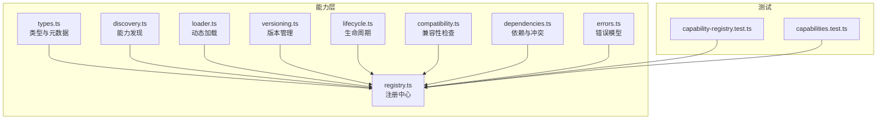
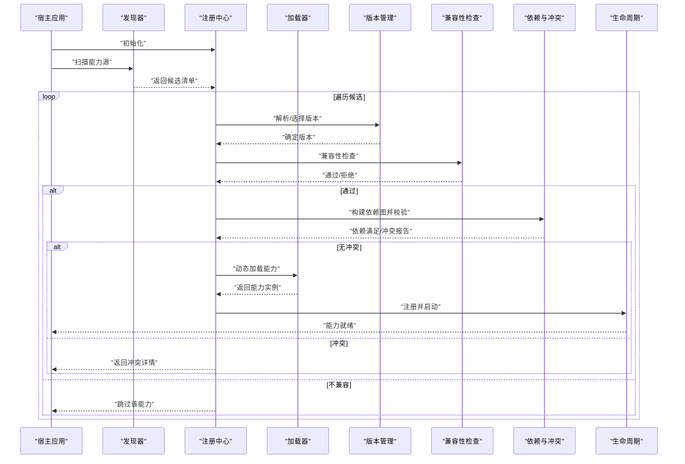
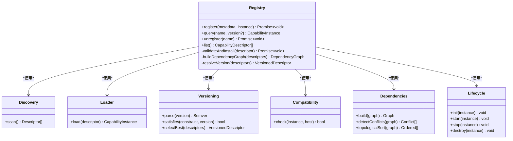
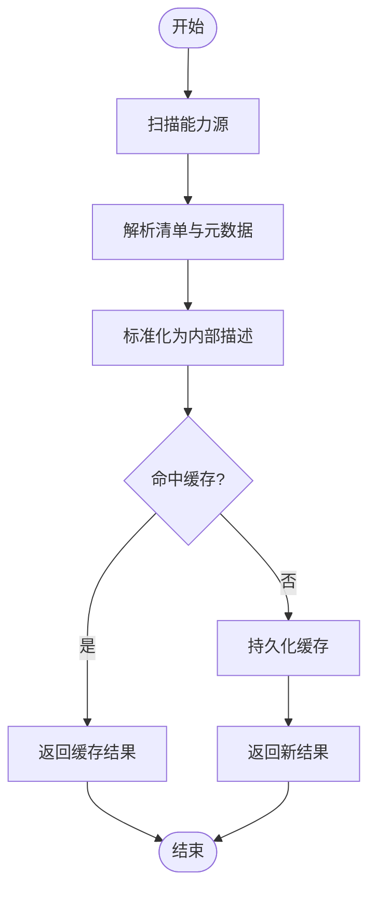
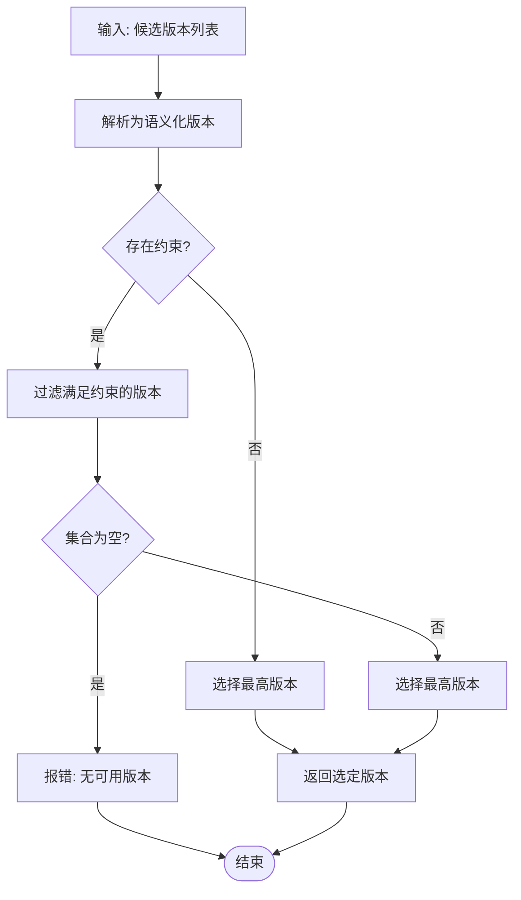
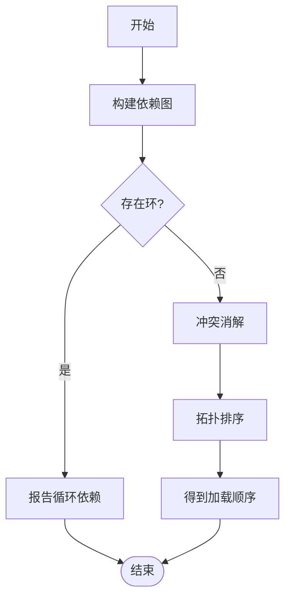
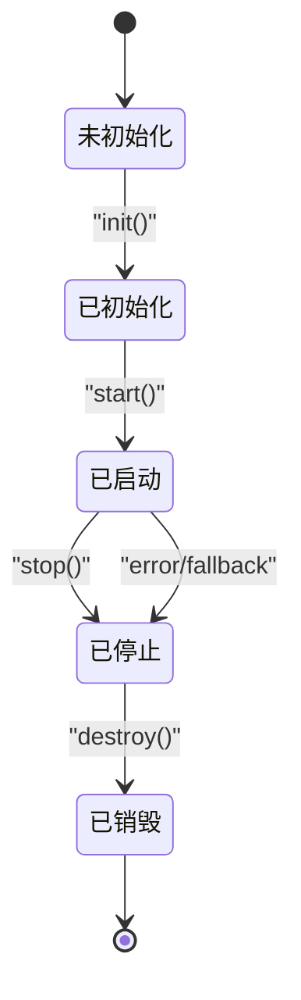
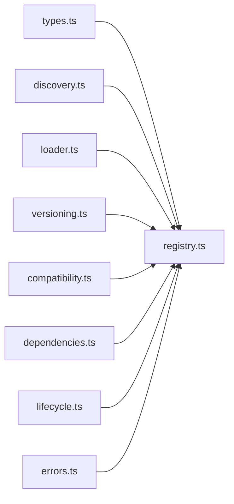

# 能力层（Capability Layer）

<cite>
**本文引用的文件**   
- [engine/packages/capabilities/src/index.ts](file://engine/packages/capabilities/src/index.ts)
- [engine/packages/capabilities/src/registry.ts](file://engine/packages/capabilities/src/registry.ts)
- [engine/packages/capabilities/src/types.ts](file://engine/packages/capabilities/src/types.ts)
- [engine/packages/capabilities/src/loader.ts](file://engine/packages/capabilities/src/loader.ts)
- [engine/packages/capabilities/src/discovery.ts](file://engine/packages/capabilities/src/discovery.ts)
- [engine/packages/capabilities/src/versioning.ts](file://engine/packages/capabilities/src/versioning.ts)
- [engine/packages/capabilities/src/lifecycle.ts](file://engine/packages/capabilities/src/lifecycle.ts)
- [engine/packages/capabilities/src/compatibility.ts](file://engine/packages/capabilities/src/compatibility.ts)
- [engine/packages/capabilities/src/dependencies.ts](file://engine/packages/capabilities/src/dependencies.ts)
- [engine/packages/capabilities/src/errors.ts](file://engine/packages/capabilities/src/errors.ts)
- [engine/tests/capability-registry.test.ts](file://engine/tests/capability-registry.test.ts)
- [engine/tests/capabilities.test.ts](file://engine/tests/capabilities.test.ts)
</cite>

## 目录
1. [简介](#简介)
2. [项目结构](#项目结构)
3. [核心组件](#核心组件)
4. [架构总览](#架构总览)
5. [详细组件分析](#详细组件分析)
6. [依赖关系分析](#依赖关系分析)
7. [性能考量](#性能考量)
8. [故障排查指南](#故障排查指南)
9. [结论](#结论)
10. [附录](#附录)

## 简介
本文件面向KCoder的能力层，系统性阐述能力注册中心的设计模式与实现要点，包括：
- 能力发现机制、动态加载与版本管理
- 能力的完整生命周期（注册到卸载）
- 能力接口定义、元数据规范与兼容性检查
- 能力间依赖管理与冲突解决策略
- 自定义能力的开发与注册示例路径
- 能力测试框架与调试工具使用方法

目标读者既包括需要扩展KCoder能力的开发者，也包括关注系统架构与可维护性的工程师。

## 项目结构
能力层位于 engine/packages/capabilities 包中，围绕“注册中心”组织代码，按职责拆分为类型、注册表、发现、加载、版本、生命周期、兼容性与依赖管理等模块。测试用例集中在 engine/tests 下，覆盖注册表与能力集行为。

图表来源
- [engine/packages/capabilities/src/types.ts](file://engine/packages/capabilities/src/types.ts)
- [engine/packages/capabilities/src/registry.ts](file://engine/packages/capabilities/src/registry.ts)
- [engine/packages/capabilities/src/discovery.ts](file://engine/packages/capabilities/src/discovery.ts)
- [engine/packages/capabilities/src/loader.ts](file://engine/packages/capabilities/src/loader.ts)
- [engine/packages/capabilities/src/versioning.ts](file://engine/packages/capabilities/src/versioning.ts)
- [engine/packages/capabilities/src/lifecycle.ts](file://engine/packages/capabilities/src/lifecycle.ts)
- [engine/packages/capabilities/src/compatibility.ts](file://engine/packages/capabilities/src/compatibility.ts)
- [engine/packages/capabilities/src/dependencies.ts](file://engine/packages/capabilities/src/dependencies.ts)
- [engine/packages/capabilities/src/errors.ts](file://engine/packages/capabilities/src/errors.ts)
- [engine/tests/capability-registry.test.ts](file://engine/tests/capability-registry.test.ts)
- [engine/tests/capabilities.test.ts](file://engine/tests/capabilities.test.ts)

章节来源
- [engine/packages/capabilities/src/index.ts](file://engine/packages/capabilities/src/index.ts)
- [engine/packages/capabilities/src/registry.ts](file://engine/packages/capabilities/src/registry.ts)
- [engine/packages/capabilities/src/types.ts](file://engine/packages/capabilities/src/types.ts)
- [engine/packages/capabilities/src/discovery.ts](file://engine/packages/capabilities/src/discovery.ts)
- [engine/packages/capabilities/src/loader.ts](file://engine/packages/capabilities/src/loader.ts)
- [engine/packages/capabilities/src/versioning.ts](file://engine/packages/capabilities/src/versioning.ts)
- [engine/packages/capabilities/src/lifecycle.ts](file://engine/packages/capabilities/src/lifecycle.ts)
- [engine/packages/capabilities/src/compatibility.ts](file://engine/packages/capabilities/src/compatibility.ts)
- [engine/packages/capabilities/src/dependencies.ts](file://engine/packages/capabilities/src/dependencies.ts)
- [engine/packages/capabilities/src/errors.ts](file://engine/packages/capabilities/src/errors.ts)
- [engine/tests/capability-registry.test.ts](file://engine/tests/capability-registry.test.ts)
- [engine/tests/capabilities.test.ts](file://engine/tests/capabilities.test.ts)

## 核心组件
- 类型与元数据（types.ts）
  - 定义能力描述、能力实例、能力清单、版本约束、依赖声明等核心类型，作为注册中心与各模块交互的契约。
- 注册中心（registry.ts）
  - 提供能力的注册、查询、更新、卸载入口；协调发现、加载、版本、兼容性与依赖校验；暴露统一API供上层使用。
- 能力发现（discovery.ts）
  - 扫描本地或远程源，收集候选能力清单，生成待加载项。
- 动态加载（loader.ts）
  - 根据清单将能力模块按需加载为运行时实例，支持热插拔与隔离。
- 版本管理（versioning.ts）
  - 解析并比较语义化版本，选择满足约束的最佳版本，处理多版本共存与升级回滚。
- 生命周期（lifecycle.ts）
  - 管理能力从初始化、启动、运行到停止、销毁的状态机，确保资源释放与一致性。
- 兼容性检查（compatibility.ts）
  - 基于元数据进行能力与宿主环境的兼容性判定，阻止不兼容能力进入运行态。
- 依赖与冲突（dependencies.ts）
  - 构建依赖图、检测环与冲突，提供拓扑排序与冲突消解策略。
- 错误模型（errors.ts）
  - 统一定义能力层异常类型与错误码，便于诊断与上报。

章节来源
- [engine/packages/capabilities/src/types.ts](file://engine/packages/capabilities/src/types.ts)
- [engine/packages/capabilities/src/registry.ts](file://engine/packages/capabilities/src/registry.ts)
- [engine/packages/capabilities/src/discovery.ts](file://engine/packages/capabilities/src/discovery.ts)
- [engine/packages/capabilities/src/loader.ts](file://engine/packages/capabilities/src/loader.ts)
- [engine/packages/capabilities/src/versioning.ts](file://engine/packages/capabilities/src/versioning.ts)
- [engine/packages/capabilities/src/lifecycle.ts](file://engine/packages/capabilities/src/lifecycle.ts)
- [engine/packages/capabilities/src/compatibility.ts](file://engine/packages/capabilities/src/compatibility.ts)
- [engine/packages/capabilities/src/dependencies.ts](file://engine/packages/capabilities/src/dependencies.ts)
- [engine/packages/capabilities/src/errors.ts](file://engine/packages/capabilities/src/errors.ts)

## 架构总览
能力层采用“注册中心+插件式”的架构。发现器产出候选清单，加载器将其转换为能力实例，注册中心负责编排版本、兼容性与依赖校验，并通过生命周期管理器驱动状态迁移。

图表来源
- [engine/packages/capabilities/src/registry.ts](file://engine/packages/capabilities/src/registry.ts)
- [engine/packages/capabilities/src/discovery.ts](file://engine/packages/capabilities/src/discovery.ts)
- [engine/packages/capabilities/src/loader.ts](file://engine/packages/capabilities/src/loader.ts)
- [engine/packages/capabilities/src/versioning.ts](file://engine/packages/capabilities/src/versioning.ts)
- [engine/packages/capabilities/src/compatibility.ts](file://engine/packages/capabilities/src/compatibility.ts)
- [engine/packages/capabilities/src/dependencies.ts](file://engine/packages/capabilities/src/dependencies.ts)
- [engine/packages/capabilities/src/lifecycle.ts](file://engine/packages/capabilities/src/lifecycle.ts)

## 详细组件分析

### 注册中心（Registry）
- 职责
  - 聚合发现、加载、版本、兼容性与依赖校验结果，对外暴露统一的注册/查询/卸载接口。
  - 维护能力索引与运行时实例映射，保证并发安全与幂等操作。
- 关键流程
  - 注册：接收能力元数据与实例，执行版本选择、兼容性检查、依赖校验，成功后纳入索引并触发启动。
  - 查询：按名称、版本或标签检索能力实例。
  - 卸载：按名称定位实例，调用生命周期停止与销毁，清理索引与资源。
- 设计要点
  - 以事件或回调形式通知外部状态变更，便于UI与日志集成。
  - 对重复注册进行去重与版本覆盖策略控制。

图表来源
- [engine/packages/capabilities/src/registry.ts](file://engine/packages/capabilities/src/registry.ts)
- [engine/packages/capabilities/src/discovery.ts](file://engine/packages/capabilities/src/discovery.ts)
- [engine/packages/capabilities/src/loader.ts](file://engine/packages/capabilities/src/loader.ts)
- [engine/packages/capabilities/src/versioning.ts](file://engine/packages/capabilities/src/versioning.ts)
- [engine/packages/capabilities/src/compatibility.ts](file://engine/packages/capabilities/src/compatibility.ts)
- [engine/packages/capabilities/src/dependencies.ts](file://engine/packages/capabilities/src/dependencies.ts)
- [engine/packages/capabilities/src/lifecycle.ts](file://engine/packages/capabilities/src/lifecycle.ts)

章节来源
- [engine/packages/capabilities/src/registry.ts](file://engine/packages/capabilities/src/registry.ts)

### 能力发现机制
- 扫描范围
  - 本地目录、打包产物或远程仓库中的能力清单。
- 输出格式
  - 标准化后的能力描述数组，包含名称、版本、入口、元数据等。
- 增量与缓存
  - 支持增量扫描与缓存命中，减少IO开销。

图表来源
- [engine/packages/capabilities/src/discovery.ts](file://engine/packages/capabilities/src/discovery.ts)

章节来源
- [engine/packages/capabilities/src/discovery.ts](file://engine/packages/capabilities/src/discovery.ts)

### 动态加载与隔离
- 加载策略
  - 按需加载、懒初始化，避免冷启动成本。
- 隔离边界
  - 每个能力拥有独立上下文与作用域，防止相互污染。
- 热插拔
  - 在不停机的情况下完成替换与重启。

章节来源
- [engine/packages/capabilities/src/loader.ts](file://engine/packages/capabilities/src/loader.ts)

### 版本管理
- 语义化版本
  - 解析主/次/补丁版本，支持范围约束与预发布标识。
- 最佳选择
  - 在多版本并存时选择满足约束的最高版本。
- 升级与回滚
  - 记录历史版本快照，支持一键回滚。

图表来源
- [engine/packages/capabilities/src/versioning.ts](file://engine/packages/capabilities/src/versioning.ts)

章节来源
- [engine/packages/capabilities/src/versioning.ts](file://engine/packages/capabilities/src/versioning.ts)

### 兼容性检查
- 检查维度
  - 宿主环境要求、能力最小/最大版本、平台差异、特性开关。
- 决策规则
  - 任一维度不满足即拒绝加载，并给出明确原因。

章节来源
- [engine/packages/capabilities/src/compatibility.ts](file://engine/packages/capabilities/src/compatibility.ts)

### 依赖关系与冲突解决
- 依赖建模
  - 有向图表示能力间的依赖关系，标注版本约束。
- 冲突检测
  - 同一能力不同版本同时被请求时的冲突识别。
- 消解策略
  - 优先满足强依赖，弱依赖降级或忽略；必要时提示用户干预。
- 拓扑排序
  - 保证加载顺序正确，避免循环依赖导致的死锁。

图表来源
- [engine/packages/capabilities/src/dependencies.ts](file://engine/packages/capabilities/src/dependencies.ts)

章节来源
- [engine/packages/capabilities/src/dependencies.ts](file://engine/packages/capabilities/src/dependencies.ts)

### 生命周期管理
- 状态机
  - 未初始化 → 已初始化 → 已启动 → 已停止 → 已销毁
- 钩子与事件
  - 提供初始化、启动、停止、销毁钩子，便于注入资源与清理。
- 失败恢复
  - 启动失败自动回退至上一稳定状态，并记录诊断信息。

图表来源
- [engine/packages/capabilities/src/lifecycle.ts](file://engine/packages/capabilities/src/lifecycle.ts)

章节来源
- [engine/packages/capabilities/src/lifecycle.ts](file://engine/packages/capabilities/src/lifecycle.ts)

### 能力接口与元数据规范
- 能力接口
  - 定义能力对外暴露的方法签名、参数与返回值约定。
- 元数据字段
  - 名称、版本、描述、作者、许可证、入口、依赖、兼容性约束等。
- 契约校验
  - 注册前对能力实例进行接口与元数据的静态/动态校验，确保一致性与安全性。

章节来源
- [engine/packages/capabilities/src/types.ts](file://engine/packages/capabilities/src/types.ts)
- [engine/packages/capabilities/src/registry.ts](file://engine/packages/capabilities/src/registry.ts)

### 自定义能力开发与注册示例
- 开发步骤
  - 实现能力接口，编写能力元数据，导出标准入口。
  - 将能力打包为可发现单元（如模块或包）。
- 注册方式
  - 通过注册中心的注册API传入元数据与实例，或在清单中声明后由发现器自动注册。
- 参考路径
  - 能力类型与元数据定义：[engine/packages/capabilities/src/types.ts](file://engine/packages/capabilities/src/types.ts)
  - 注册中心API：[engine/packages/capabilities/src/registry.ts](file://engine/packages/capabilities/src/registry.ts)
  - 发现与加载：[engine/packages/capabilities/src/discovery.ts](file://engine/packages/capabilities/src/discovery.ts), [engine/packages/capabilities/src/loader.ts](file://engine/packages/capabilities/src/loader.ts)

章节来源
- [engine/packages/capabilities/src/types.ts](file://engine/packages/capabilities/src/types.ts)
- [engine/packages/capabilities/src/registry.ts](file://engine/packages/capabilities/src/registry.ts)
- [engine/packages/capabilities/src/discovery.ts](file://engine/packages/capabilities/src/discovery.ts)
- [engine/packages/capabilities/src/loader.ts](file://engine/packages/capabilities/src/loader.ts)

### 能力测试框架与调试工具
- 单元测试
  - 针对注册表与能力集的行为进行测试，覆盖注册、查询、卸载、冲突与版本选择等场景。
- 集成测试
  - 模拟真实宿主环境，验证能力加载、生命周期与依赖解析的端到端流程。
- 调试建议
  - 启用详细日志，捕获兼容性失败与依赖冲突的具体原因；结合断点与回放定位问题。

章节来源
- [engine/tests/capability-registry.test.ts](file://engine/tests/capability-registry.test.ts)
- [engine/tests/capabilities.test.ts](file://engine/tests/capabilities.test.ts)

## 依赖关系分析
- 内聚与耦合
  - 注册中心作为协调者，与其他模块松耦合，通过清晰的类型契约交互。
- 直接依赖
  - 注册中心直接依赖发现、加载、版本、兼容性与依赖模块。
- 间接依赖
  - 错误模型贯穿各模块，用于统一异常表达。
- 潜在循环
  - 通过单向依赖与分层设计避免循环引用。

图表来源
- [engine/packages/capabilities/src/types.ts](file://engine/packages/capabilities/src/types.ts)
- [engine/packages/capabilities/src/registry.ts](file://engine/packages/capabilities/src/registry.ts)
- [engine/packages/capabilities/src/discovery.ts](file://engine/packages/capabilities/src/discovery.ts)
- [engine/packages/capabilities/src/loader.ts](file://engine/packages/capabilities/src/loader.ts)
- [engine/packages/capabilities/src/versioning.ts](file://engine/packages/capabilities/src/versioning.ts)
- [engine/packages/capabilities/src/compatibility.ts](file://engine/packages/capabilities/src/compatibility.ts)
- [engine/packages/capabilities/src/dependencies.ts](file://engine/packages/capabilities/src/dependencies.ts)
- [engine/packages/capabilities/src/lifecycle.ts](file://engine/packages/capabilities/src/lifecycle.ts)
- [engine/packages/capabilities/src/errors.ts](file://engine/packages/capabilities/src/errors.ts)

章节来源
- [engine/packages/capabilities/src/registry.ts](file://engine/packages/capabilities/src/registry.ts)
- [engine/packages/capabilities/src/errors.ts](file://engine/packages/capabilities/src/errors.ts)

## 性能考量
- 发现阶段
  - 使用增量扫描与缓存，降低IO与解析成本。
- 加载阶段
  - 懒加载与按需初始化，减少内存占用与启动时间。
- 版本与依赖
  - 缓存版本解析与拓扑排序结果，避免重复计算。
- 并发与锁
  - 注册中心对共享状态加锁，避免竞态条件导致的不一致。

## 故障排查指南
- 常见问题
  - 版本不满足约束：检查能力元数据中的版本范围与宿主期望。
  - 依赖冲突：查看冲突报告，调整依赖版本或引入桥接能力。
  - 兼容性失败：核对平台与特性开关，必要时降级功能。
  - 生命周期异常：确认初始化与启动顺序，检查资源释放是否完整。
- 诊断手段
  - 启用详细日志，定位具体失败阶段与错误码。
  - 使用测试套件复现问题，逐步缩小范围。

章节来源
- [engine/packages/capabilities/src/errors.ts](file://engine/packages/capabilities/src/errors.ts)
- [engine/tests/capability-registry.test.ts](file://engine/tests/capability-registry.test.ts)
- [engine/tests/capabilities.test.ts](file://engine/tests/capabilities.test.ts)

## 结论
能力层通过注册中心整合发现、加载、版本、兼容性与依赖管理，形成高内聚、低耦合的可插拔体系。完善的生命周期与错误模型保障了系统的稳定性与可观测性。遵循元数据与接口规范，开发者可以高效地扩展KCoder能力，并通过测试与调试工具快速定位问题。

## 附录
- 术语
  - 能力：具备特定功能的可插拔模块。
  - 元数据：描述能力属性与约束的结构化数据。
  - 语义化版本：主/次/补丁版本号及其约束。
- 参考路径
  - 类型与元数据：[engine/packages/capabilities/src/types.ts](file://engine/packages/capabilities/src/types.ts)
  - 注册中心：[engine/packages/capabilities/src/registry.ts](file://engine/packages/capabilities/src/registry.ts)
  - 发现与加载：[engine/packages/capabilities/src/discovery.ts](file://engine/packages/capabilities/src/discovery.ts), [engine/packages/capabilities/src/loader.ts](file://engine/packages/capabilities/src/loader.ts)
  - 版本与兼容：[engine/packages/capabilities/src/versioning.ts](file://engine/packages/capabilities/src/versioning.ts), [engine/packages/capabilities/src/compatibility.ts](file://engine/packages/capabilities/src/compatibility.ts)
  - 依赖与冲突：[engine/packages/capabilities/src/dependencies.ts](file://engine/packages/capabilities/src/dependencies.ts)
  - 生命周期：[engine/packages/capabilities/src/lifecycle.ts](file://engine/packages/capabilities/src/lifecycle.ts)
  - 错误模型：[engine/packages/capabilities/src/errors.ts](file://engine/packages/capabilities/src/errors.ts)
  - 测试用例：[engine/tests/capability-registry.test.ts](file://engine/tests/capability-registry.test.ts), [engine/tests/capabilities.test.ts](file://engine/tests/capabilities.test.ts)