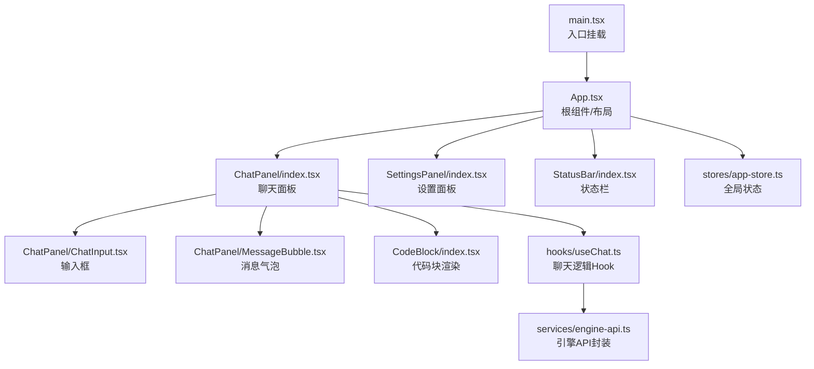
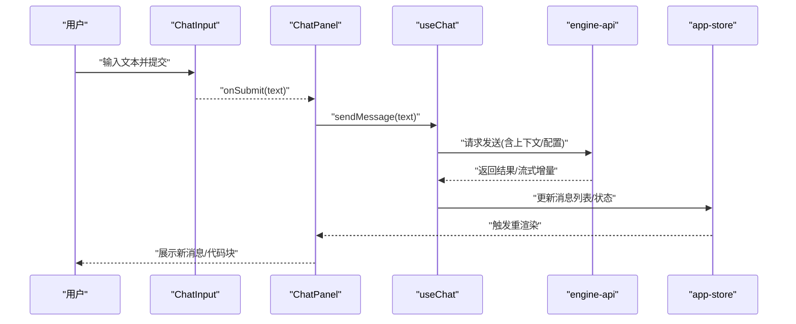
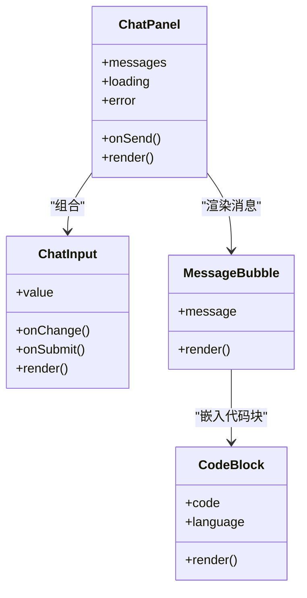
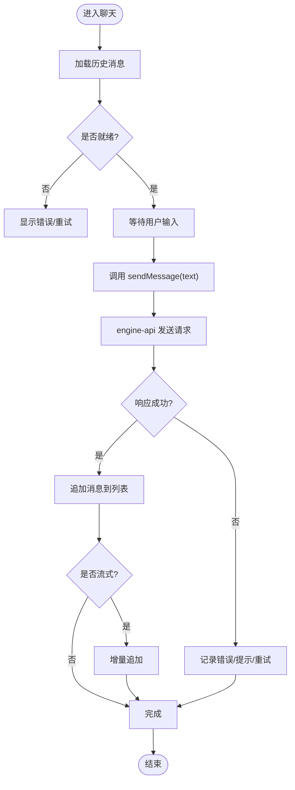
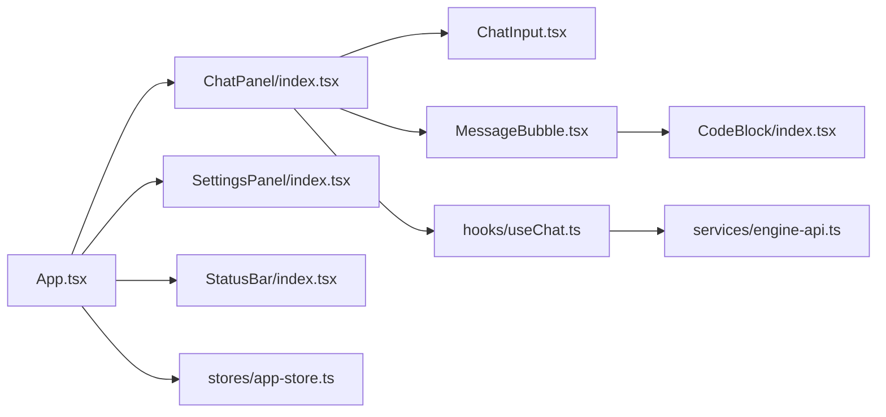

# React组件架构

<cite>
**本文引用的文件**   
- [App.tsx](file://app/renderer/src/App.tsx)
- [main.tsx](file://app/renderer/src/main.tsx)
- [ChatPanel/index.tsx](file://app/renderer/src/components/ChatPanel/index.tsx)
- [ChatPanel/ChatInput.tsx](file://app/renderer/src/components/ChatPanel/ChatInput.tsx)
- [ChatPanel/MessageBubble.tsx](file://app/renderer/src/components/ChatPanel/MessageBubble.tsx)
- [SettingsPanel/index.tsx](file://app/renderer/src/components/SettingsPanel/index.tsx)
- [CodeBlock/index.tsx](file://app/renderer/src/components/CodeBlock/index.tsx)
- [StatusBar/index.tsx](file://app/renderer/src/components/StatusBar/index.tsx)
- [hooks/useChat.ts](file://app/renderer/src/hooks/useChat.ts)
- [services/engine-api.ts](file://app/renderer/src/services/engine-api.ts)
- [stores/app-store.ts](file://app/renderer/src/stores/app-store.ts)
</cite>

## 目录
1. [简介](#简介)
2. [项目结构](#项目结构)
3. [核心组件](#核心组件)
4. [架构总览](#架构总览)
5. [详细组件分析](#详细组件分析)
6. [依赖关系分析](#依赖关系分析)
7. [性能考虑](#性能考虑)
8. [故障排查指南](#故障排查指南)
9. [结论](#结论)
10. [附录](#附录)

## 简介
本文件面向KCoder的React前端渲染层，系统化梳理组件层次结构与通信模式，重点覆盖根组件组织、关键UI组件职责划分与实现要点（ChatPanel、Sidebar、SettingsPanel等），并总结组件复用策略、自定义Hook使用模式与错误边界处理。文档同时提供架构图、时序图与流程图，帮助读者快速理解数据流与控制流，并在“最佳实践”与“性能优化”章节给出可操作的指导。

## 项目结构
渲染层位于 app/renderer/src 下，采用按功能域划分的目录组织方式：
- components：按功能模块拆分UI组件，如 ChatPanel、SettingsPanel、CodeBlock、StatusBar 等
- hooks：封装可复用的状态逻辑，如 useChat
- services：对外部服务或引擎API的封装，如 engine-api
- stores：全局状态管理，如 app-store
- App.tsx：应用根组件，负责顶层布局与路由/面板切换
- main.tsx：入口文件，挂载根组件到DOM

图表来源
- [main.tsx:1-50](file://app/renderer/src/main.tsx#L1-L50)
- [App.tsx:1-120](file://app/renderer/src/App.tsx#L1-L120)
- [ChatPanel/index.tsx:1-200](file://app/renderer/src/components/ChatPanel/index.tsx#L1-L200)
- [ChatPanel/ChatInput.tsx:1-120](file://app/renderer/src/components/ChatPanel/ChatInput.tsx#L1-L120)
- [ChatPanel/MessageBubble.tsx:1-120](file://app/renderer/src/components/ChatPanel/MessageBubble.tsx#L1-L120)
- [SettingsPanel/index.tsx:1-120](file://app/renderer/src/components/SettingsPanel/index.tsx#L1-L120)
- [CodeBlock/index.tsx:1-120](file://app/renderer/src/components/CodeBlock/index.tsx#L1-L120)
- [hooks/useChat.ts:1-200](file://app/renderer/src/hooks/useChat.ts#L1-L200)
- [services/engine-api.ts:1-200](file://app/renderer/src/services/engine-api.ts#L1-L200)
- [stores/app-store.ts:1-200](file://app/renderer/src/stores/app-store.ts#L1-L200)

章节来源
- [main.tsx:1-50](file://app/renderer/src/main.tsx#L1-L50)
- [App.tsx:1-120](file://app/renderer/src/App.tsx#L1-L120)

## 核心组件
- App 根组件
  - 职责：应用初始化、全局布局容器、面板/侧边栏可见性控制、与全局状态和外部服务的桥接
  - 典型交互：根据用户操作切换显示 ChatPanel/SettingsPanel/StatusBar；将全局配置与主题等状态注入子组件
- ChatPanel 聊天面板
  - 职责：展示对话历史、承载输入区域、调用发送逻辑、渲染消息气泡与代码块
  - 内部组成：ChatInput（输入）、MessageBubble（单条消息）、CodeBlock（代码片段高亮）
- SettingsPanel 设置面板
  - 职责：展示与编辑应用设置项（如模型选择、提示词模板、快捷键等），保存至持久化存储
- StatusBar 状态栏
  - 职责：展示应用运行状态、连接状态、当前任务进度等轻量信息
- CodeBlock 代码块
  - 职责：安全渲染代码片段，支持复制、语言标识、折叠/展开等

章节来源
- [App.tsx:1-120](file://app/renderer/src/App.tsx#L1-L120)
- [ChatPanel/index.tsx:1-200](file://app/renderer/src/components/ChatPanel/index.tsx#L1-L200)
- [ChatPanel/ChatInput.tsx:1-120](file://app/renderer/src/components/ChatPanel/ChatInput.tsx#L1-L120)
- [ChatPanel/MessageBubble.tsx:1-120](file://app/renderer/src/components/ChatPanel/MessageBubble.tsx#L1-L120)
- [SettingsPanel/index.tsx:1-120](file://app/renderer/src/components/SettingsPanel/index.tsx#L1-L120)
- [StatusBar/index.tsx:1-120](file://app/renderer/src/components/StatusBar/index.tsx#L1-L120)
- [CodeBlock/index.tsx:1-120](file://app/renderer/src/components/CodeBlock/index.tsx#L1-L120)

## 架构总览
整体采用“根组件 + 功能面板 + 共享Hook/Store + 服务封装”的分层架构：
- UI层：各面板组件仅关注展示与用户交互
- 逻辑层：useChat等Hook集中编排业务逻辑（发送消息、加载历史、错误重试）
- 数据层：app-store维护全局状态（主题、面板开关、用户偏好）
- 集成层：engine-api封装与后端/引擎的通信（HTTP/WebSocket/IPC）

图表来源
- [ChatPanel/index.tsx:1-200](file://app/renderer/src/components/ChatPanel/index.tsx#L1-L200)
- [ChatPanel/ChatInput.tsx:1-120](file://app/renderer/src/components/ChatPanel/ChatInput.tsx#L1-L120)
- [hooks/useChat.ts:1-200](file://app/renderer/src/hooks/useChat.ts#L1-L200)
- [services/engine-api.ts:1-200](file://app/renderer/src/services/engine-api.ts#L1-L200)
- [stores/app-store.ts:1-200](file://app/renderer/src/stores/app-store.ts#L1-L200)

## 详细组件分析

### App 根组件
- 设计要点
  - 作为布局容器，组合 ChatPanel、SettingsPanel、StatusBar
  - 通过 props 或 Context 向子组件传递全局配置（主题、语言、面板可见性等）
  - 在生命周期中完成一次性的初始化（如读取本地配置、建立长连接）
- 事件与通信
  - 接收来自子组件的事件回调（如打开设置、切换面板）
  - 将全局状态变化广播给相关子组件
- 生命周期管理
  - 启动时加载配置与缓存
  - 卸载时清理定时器/监听器/连接

章节来源
- [App.tsx:1-120](file://app/renderer/src/App.tsx#L1-L120)

### ChatPanel 聊天面板
- 职责与组成
  - 聚合消息列表与输入区，协调 useChat 的业务流程
  - 内嵌 MessageBubble 与 CodeBlock 进行内容渲染
- Props 设计建议
  - messages: 消息数组
  - onSend: 提交回调
  - loading/error: 状态透传
  - theme/config: 外观与行为配置
- 事件处理机制
  - 输入提交 -> useChat.sendMessage -> engine-api 调用 -> 更新 store -> 重渲染
- 生命周期管理
  - 进入面板时加载历史消息
  - 离开面板时停止轮询/取消未完成的请求
- 错误处理
  - 网络异常、超时、服务端错误统一捕获并提示
  - 失败重试与降级策略（如离线缓存）

图表来源
- [ChatPanel/index.tsx:1-200](file://app/renderer/src/components/ChatPanel/index.tsx#L1-L200)
- [ChatPanel/ChatInput.tsx:1-120](file://app/renderer/src/components/ChatPanel/ChatInput.tsx#L1-L120)
- [ChatPanel/MessageBubble.tsx:1-120](file://app/renderer/src/components/ChatPanel/MessageBubble.tsx#L1-L120)
- [CodeBlock/index.tsx:1-120](file://app/renderer/src/components/CodeBlock/index.tsx#L1-L120)

章节来源
- [ChatPanel/index.tsx:1-200](file://app/renderer/src/components/ChatPanel/index.tsx#L1-L200)
- [ChatPanel/ChatInput.tsx:1-120](file://app/renderer/src/components/ChatPanel/ChatInput.tsx#L1-L120)
- [ChatPanel/MessageBubble.tsx:1-120](file://app/renderer/src/components/ChatPanel/MessageBubble.tsx#L1-L120)
- [CodeBlock/index.tsx:1-120](file://app/renderer/src/components/CodeBlock/index.tsx#L1-L120)

### Sidebar 侧边栏（概念说明）
- 定位：导航与快捷入口，用于在不同面板间切换（如聊天、设置、历史记录）
- 与根组件的关系：由 App 控制其显隐与选中态
- 交互模式：点击菜单项 -> 通知 App 切换面板 -> 对应面板组件挂载/卸载

[本节为概念性说明，不直接分析具体文件]

### SettingsPanel 设置面板
- 职责：集中管理应用配置（模型、提示词、快捷键、主题等）
- 数据流：表单变更 -> 校验 -> 写入 app-store -> 持久化 -> 其他组件订阅更新
- 错误处理：字段校验失败提示、保存失败回滚与重试

章节来源
- [SettingsPanel/index.tsx:1-120](file://app/renderer/src/components/SettingsPanel/index.tsx#L1-L120)
- [stores/app-store.ts:1-200](file://app/renderer/src/stores/app-store.ts#L1-L200)

### StatusBar 状态栏
- 职责：展示连接状态、任务进度、错误摘要等轻量信息
- 数据来源：订阅 app-store 的状态片段，避免不必要的重渲染

章节来源
- [StatusBar/index.tsx:1-120](file://app/renderer/src/components/StatusBar/index.tsx#L1-L120)
- [stores/app-store.ts:1-200](file://app/renderer/src/stores/app-store.ts#L1-L200)

### CodeBlock 代码块
- 职责：安全渲染代码片段，支持复制、语言标识、行号、折叠/展开
- 安全性：对内容进行转义/白名单过滤，防止XSS
- 性能：大段代码懒加载与虚拟滚动（可选）

章节来源
- [CodeBlock/index.tsx:1-120](file://app/renderer/src/components/CodeBlock/index.tsx#L1-L120)

### 自定义 Hook：useChat
- 职责：封装聊天相关的状态与副作用（发送消息、加载历史、错误重试、流式响应）
- 对外暴露：
  - messages: 消息列表
  - loading/error: 状态
  - sendMessage(text): 触发发送
  - loadHistory(): 拉取历史
- 与服务的协作：调用 engine-api 发起请求，解析响应并更新 store

图表来源
- [hooks/useChat.ts:1-200](file://app/renderer/src/hooks/useChat.ts#L1-L200)
- [services/engine-api.ts:1-200](file://app/renderer/src/services/engine-api.ts#L1-L200)

章节来源
- [hooks/useChat.ts:1-200](file://app/renderer/src/hooks/useChat.ts#L1-L200)
- [services/engine-api.ts:1-200](file://app/renderer/src/services/engine-api.ts#L1-L200)

### 服务封装：engine-api
- 职责：统一封装与引擎的通信细节（URL、鉴权、重试、超时、错误码映射）
- 能力：
  - 发送聊天请求（同步/异步/流式）
  - 获取历史、上传附件、查询状态
  - 错误分类与友好提示
- 与Hook/组件的关系：被 useChat 调用，组件不直接感知网络细节

章节来源
- [services/engine-api.ts:1-200](file://app/renderer/src/services/engine-api.ts#L1-L200)

### 全局状态：app-store
- 职责：维护全局配置、面板可见性、主题、用户会话等
- 更新策略：局部更新、订阅最小化、持久化同步
- 与组件的关系：组件按需订阅，避免全量重渲染

章节来源
- [stores/app-store.ts:1-200](file://app/renderer/src/stores/app-store.ts#L1-L200)

## 依赖关系分析
- 组件耦合
  - ChatPanel 强依赖 useChat 与 CodeBlock/MessageBubble
  - App 弱耦合各面板，通过 props/Context 解耦
- 外部依赖
  - engine-api 屏蔽底层通信差异，便于替换传输层
- 可能的循环依赖
  - 确保 Hook 与服务之间单向依赖（Hook -> Service），避免反向引用

图表来源
- [App.tsx:1-120](file://app/renderer/src/App.tsx#L1-L120)
- [ChatPanel/index.tsx:1-200](file://app/renderer/src/components/ChatPanel/index.tsx#L1-L200)
- [ChatPanel/ChatInput.tsx:1-120](file://app/renderer/src/components/ChatPanel/ChatInput.tsx#L1-L120)
- [ChatPanel/MessageBubble.tsx:1-120](file://app/renderer/src/components/ChatPanel/MessageBubble.tsx#L1-L120)
- [CodeBlock/index.tsx:1-120](file://app/renderer/src/components/CodeBlock/index.tsx#L1-L120)
- [hooks/useChat.ts:1-200](file://app/renderer/src/hooks/useChat.ts#L1-L200)
- [services/engine-api.ts:1-200](file://app/renderer/src/services/engine-api.ts#L1-L200)
- [stores/app-store.ts:1-200](file://app/renderer/src/stores/app-store.ts#L1-L200)

章节来源
- [App.tsx:1-120](file://app/renderer/src/App.tsx#L1-L120)
- [ChatPanel/index.tsx:1-200](file://app/renderer/src/components/ChatPanel/index.tsx#L1-L200)
- [hooks/useChat.ts:1-200](file://app/renderer/src/hooks/useChat.ts#L1-L200)
- [services/engine-api.ts:1-200](file://app/renderer/src/services/engine-api.ts#L1-L200)
- [stores/app-store.ts:1-200](file://app/renderer/src/stores/app-store.ts#L1-L200)

## 性能考虑
- 渲染优化
  - 使用 React.memo 包裹纯展示组件（如 MessageBubble、CodeBlock）
  - 对长列表采用虚拟滚动或分页加载
- 状态更新
  - 将频繁更新的局部状态下沉到组件内部，减少父级重渲染
  - 使用选择性订阅（只订阅必要字段）
- 网络与I/O
  - 请求去抖/节流（如搜索、自动保存）
  - 失败重试与指数退避
  - 流式响应增量渲染，避免整段拼接导致的卡顿
- 资源加载
  - 大体积库按需加载与懒加载
  - 图片/代码块按需渲染

[本节提供通用指导，不直接分析具体文件]

## 故障排查指南
- 常见问题
  - 消息不更新：检查 useChat 是否正确更新 store 并触发重渲染
  - 发送失败：查看 engine-api 的错误分类与日志，确认鉴权/超时/重试策略
  - 设置未生效：确认 app-store 的持久化与订阅链路
- 调试建议
  - 在 Hook 与服务层增加结构化日志（请求ID、耗时、错误码）
  - 使用浏览器开发者工具的性能面板定位重渲染热点
  - 对关键路径添加断言与边界用例测试

章节来源
- [hooks/useChat.ts:1-200](file://app/renderer/src/hooks/useChat.ts#L1-L200)
- [services/engine-api.ts:1-200](file://app/renderer/src/services/engine-api.ts#L1-L200)
- [stores/app-store.ts:1-200](file://app/renderer/src/stores/app-store.ts#L1-L200)

## 结论
KCoder 的React前端采用清晰的分层与模块化设计：根组件负责布局与协调，功能面板专注展示与交互，Hook 集中业务逻辑，服务层屏蔽通信细节，Store 管理全局状态。该架构具备良好的可扩展性与可维护性，配合合理的性能优化与错误处理策略，能够支撑复杂的AI助手交互场景。

## 附录
- 开发最佳实践
  - 组件职责单一，props 最小化且类型明确
  - 复杂逻辑放入 Hook，保持组件简洁
  - 对外接口稳定，内部实现可演进
- 示例参考路径
  - 根组件组织：[App.tsx](file://app/renderer/src/App.tsx)
  - 聊天主流程：[ChatPanel/index.tsx](file://app/renderer/src/components/ChatPanel/index.tsx)、[hooks/useChat.ts](file://app/renderer/src/hooks/useChat.ts)
  - 输入与消息渲染：[ChatInput.tsx](file://app/renderer/src/components/ChatPanel/ChatInput.tsx)、[MessageBubble.tsx](file://app/renderer/src/components/ChatPanel/MessageBubble.tsx)
  - 代码块渲染：[CodeBlock/index.tsx](file://app/renderer/src/components/CodeBlock/index.tsx)
  - 设置面板：[SettingsPanel/index.tsx](file://app/renderer/src/components/SettingsPanel/index.tsx)
  - 状态栏：[StatusBar/index.tsx](file://app/renderer/src/components/StatusBar/index.tsx)
  - 引擎API封装：[services/engine-api.ts](file://app/renderer/src/services/engine-api.ts)
  - 全局状态：[stores/app-store.ts](file://app/renderer/src/stores/app-store.ts)