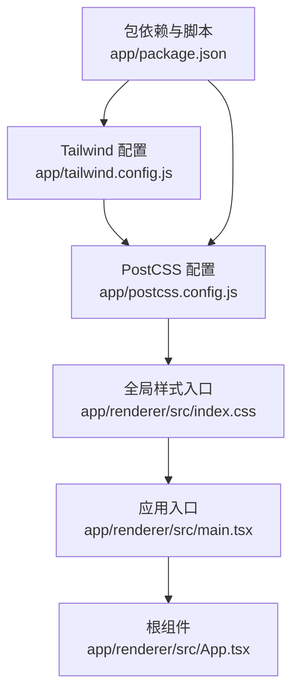
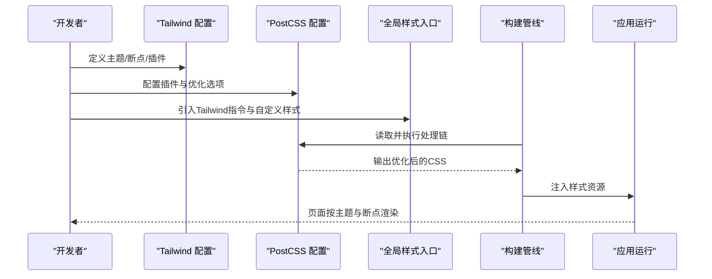
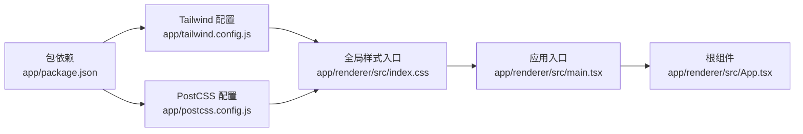

# 样式系统

<cite>
**本文引用的文件**   
- [tailwind.config.js](file://app/tailwind.config.js)
- [postcss.config.js](file://app/postcss.config.js)
- [index.css](file://app/renderer/src/index.css)
- [main.tsx](file://app/renderer/src/main.tsx)
- [App.tsx](file://app/renderer/src/App.tsx)
- [package.json](file://app/package.json)
</cite>

## 目录
1. [简介](#简介)
2. [项目结构](#项目结构)
3. [核心组件](#核心组件)
4. [架构总览](#架构总览)
5. [详细组件分析](#详细组件分析)
6. [依赖关系分析](#依赖关系分析)
7. [性能考虑](#性能考虑)
8. [故障排查指南](#故障排查指南)
9. [结论](#结论)
10. [附录](#附录)

## 简介
本文件面向KCoder的样式系统，聚焦于Tailwind CSS集成、自定义主题（颜色、字体、断点）、CSS模块化与组织方式、响应式实现策略，以及PostCSS处理流程与插件配置。文档同时提供样式性能优化建议、浏览器兼容性处理要点、开发工具使用指南，并通过“代码片段路径”的方式给出可复用的定制与主题切换示例位置，便于快速落地。

## 项目结构
KCoder的前端渲染层位于 app/renderer 下，样式相关的关键文件包括：
- Tailwind配置：app/tailwind.config.js
- PostCSS配置：app/postcss.config.js
- 全局样式入口：app/renderer/src/index.css
- 应用入口与根组件：app/renderer/src/main.tsx、app/renderer/src/App.tsx
- 构建与依赖声明：app/package.json

图表来源
- [tailwind.config.js](file://app/tailwind.config.js)
- [postcss.config.js](file://app/postcss.config.js)
- [index.css](file://app/renderer/src/index.css)
- [main.tsx](file://app/renderer/src/main.tsx)
- [App.tsx](file://app/renderer/src/App.tsx)
- [package.json](file://app/package.json)

章节来源
- [tailwind.config.js](file://app/tailwind.config.js)
- [postcss.config.js](file://app/postcss.config.js)
- [index.css](file://app/renderer/src/index.css)
- [main.tsx](file://app/renderer/src/main.tsx)
- [App.tsx](file://app/renderer/src/App.tsx)
- [package.json](file://app/package.json)

## 核心组件
- Tailwind主题与扩展
  - 通过Tailwind配置文件定义或覆盖默认主题，包括颜色系统、字体族、布局断点等。
  - 推荐将业务语义色与中性色分层管理，保持设计令牌清晰。
- PostCSS处理链
  - 在PostCSS配置中引入必要的插件，如自动前缀、压缩与优化选项，确保跨浏览器兼容与产物体积控制。
- 样式入口与模块组织
  - 在全局样式入口中按需引入Tailwind指令与自定义样式；组件级样式采用就近组织，避免全局污染。
- 构建与依赖
  - 在包依赖中声明Tailwind与PostCSS生态依赖，并在构建脚本中串联编译流程。

章节来源
- [tailwind.config.js](file://app/tailwind.config.js)
- [postcss.config.js](file://app/postcss.config.js)
- [index.css](file://app/renderer/src/index.css)
- [package.json](file://app/package.json)

## 架构总览
下图展示了从配置到最终样式的生成链路：Tailwind配置驱动主题与断点，PostCSS对样式进行预处理与优化，最终由构建管线注入到应用中。

图表来源
- [tailwind.config.js](file://app/tailwind.config.js)
- [postcss.config.js](file://app/postcss.config.js)
- [index.css](file://app/renderer/src/index.css)
- [main.tsx](file://app/renderer/src/main.tsx)
- [App.tsx](file://app/renderer/src/App.tsx)

## 详细组件分析

### Tailwind主题与自定义配置
- 颜色系统
  - 在主题配置中集中定义语义化颜色键值，便于在类名与设计令牌间建立映射。
  - 建议区分品牌色、状态色与中性色，并提供明暗变体以支持深色模式。
- 字体规范
  - 在字体族配置中声明主字体、备用字体与等宽字体，保证代码块与UI文本的一致性。
- 布局断点
  - 基于移动端优先原则定义断点，确保在小屏设备上体验优先，再逐步增强大屏布局。
- 插件与扩展
  - 按需启用官方或社区插件，扩展实用类能力，减少手写CSS。

章节来源
- [tailwind.config.js](file://app/tailwind.config.js)

### PostCSS处理流程与插件配置
- 插件选择
  - 自动前缀：为不同浏览器补齐必要前缀，提升兼容性。
  - 压缩与优化：移除无用空白、重复规则，减小产物体积。
- 处理顺序
  - 先解析Tailwind生成的样式，再进行前缀与压缩，确保最终产物稳定且高效。
- 环境变量与模式
  - 根据构建模式开启或关闭调试信息、SourceMap等辅助功能。

章节来源
- [postcss.config.js](file://app/postcss.config.js)

### 样式入口与模块化组织
- 全局入口
  - 在全局样式文件中引入Tailwind指令与基础重置，统一基线样式。
- 组件级样式
  - 将组件相关样式就近组织，必要时使用命名空间或作用域策略，避免冲突。
- 主题变量与Token
  - 将设计Token暴露为CSS变量，配合Tailwind配置形成单一事实源。

章节来源
- [index.css](file://app/renderer/src/index.css)
- [main.tsx](file://app/renderer/src/main.tsx)
- [App.tsx](file://app/renderer/src/App.tsx)

### 响应式设计实现
- 断点策略
  - 使用移动端优先的断点体系，在小屏上默认展示关键内容，在大屏上展开更多区域。
- 布局组合
  - 结合栅格与弹性布局，在不同断点下调整列数与间距，保证可读性与操作效率。
- 交互适配
  - 针对触摸与鼠标输入差异，调整点击区域与滚动行为。

章节来源
- [tailwind.config.js](file://app/tailwind.config.js)
- [index.css](file://app/renderer/src/index.css)

### 主题切换与动态定制
- 运行时主题切换
  - 通过切换根节点上的数据属性或类名，触发CSS变量更新，实现亮/暗主题切换。
- 局部主题覆盖
  - 在特定容器内覆盖主题变量，实现卡片或弹窗级别的独立主题。
- 配置驱动
  - 将主题配置与运行时切换解耦，通过配置对象生成对应的CSS变量集合。

章节来源
- [tailwind.config.js](file://app/tailwind.config.js)
- [index.css](file://app/renderer/src/index.css)
- [App.tsx](file://app/renderer/src/App.tsx)

## 依赖关系分析
- 构建依赖
  - Tailwind与PostCSS及其插件在包依赖中声明，构建脚本负责串联处理流程。
- 配置耦合
  - Tailwind配置与PostCSS配置相互协作，前者定义主题与指令，后者决定处理链与优化策略。
- 运行时影响
  - 全局样式入口与应用入口共同决定样式加载时机与作用域。

图表来源
- [package.json](file://app/package.json)
- [tailwind.config.js](file://app/tailwind.config.js)
- [postcss.config.js](file://app/postcss.config.js)
- [index.css](file://app/renderer/src/index.css)
- [main.tsx](file://app/renderer/src/main.tsx)
- [App.tsx](file://app/renderer/src/App.tsx)

章节来源
- [package.json](file://app/package.json)
- [tailwind.config.js](file://app/tailwind.config.js)
- [postcss.config.js](file://app/postcss.config.js)
- [index.css](file://app/renderer/src/index.css)
- [main.tsx](file://app/renderer/src/main.tsx)
- [App.tsx](file://app/renderer/src/App.tsx)

## 性能考虑
- 产物体积
  - 启用PostCSS压缩与Tailwind的Tree Shaking，仅保留实际使用的类与样式。
- 缓存策略
  - 对静态样式资源设置长期缓存，利用哈希文件名提升缓存命中率。
- 加载时序
  - 将关键样式尽早加载，非关键样式延迟加载，降低首屏阻塞。
- 调试与监控
  - 在开发环境开启SourceMap与详细日志，生产环境关闭冗余信息。

[本节为通用指导，不直接分析具体文件]

## 故障排查指南
- 样式未生效
  - 检查全局样式入口是否正确引入Tailwind指令与自定义样式。
  - 确认构建管线是否包含PostCSS处理步骤。
- 主题变量无效
  - 验证CSS变量是否在根节点正确定义，并确保运行时切换逻辑已执行。
- 断点异常
  - 核对Tailwind配置的断点定义是否与预期一致，检查媒体查询优先级。
- 兼容性问题
  - 确认自动前缀插件已启用，并检查目标浏览器范围配置。

章节来源
- [index.css](file://app/renderer/src/index.css)
- [postcss.config.js](file://app/postcss.config.js)
- [tailwind.config.js](file://app/tailwind.config.js)

## 结论
KCoder的样式系统以Tailwind为核心，结合PostCSS完成跨浏览器兼容与产物优化。通过集中化的主题配置与清晰的模块化组织，既保证了开发效率，也兼顾了运行时灵活性与性能表现。建议在后续迭代中持续完善设计Token体系，并将主题切换与组件库深度整合，进一步提升一致性与维护性。

[本节为总结性内容，不直接分析具体文件]

## 附录
- 代码片段路径（用于参考实现）
  - 主题与断点定义：参见 [tailwind.config.js](file://app/tailwind.config.js)
  - PostCSS插件与优化选项：参见 [postcss.config.js](file://app/postcss.config.js)
  - 全局样式与指令引入：参见 [index.css](file://app/renderer/src/index.css)
  - 应用入口与根组件挂载：参见 [main.tsx](file://app/renderer/src/main.tsx)、[App.tsx](file://app/renderer/src/App.tsx)
  - 依赖与脚本声明：参见 [package.json](file://app/package.json)

[本节为导航性内容，不直接分析具体文件]