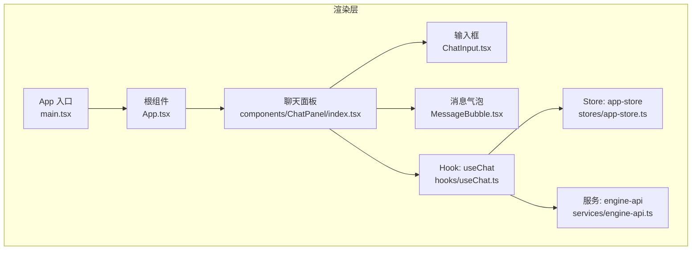
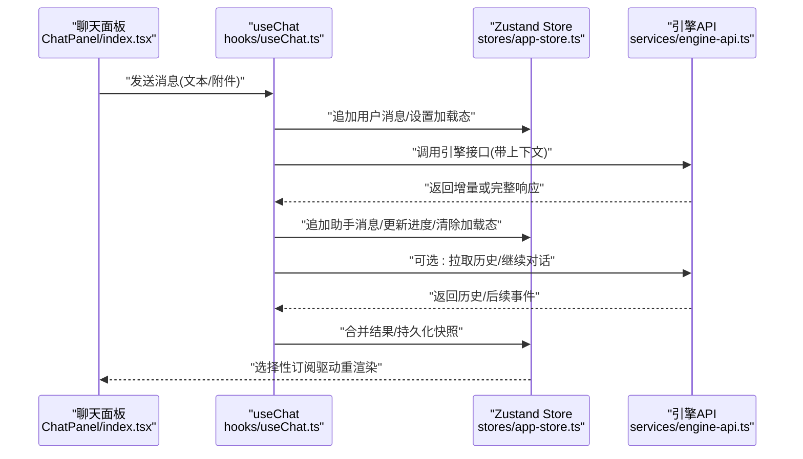
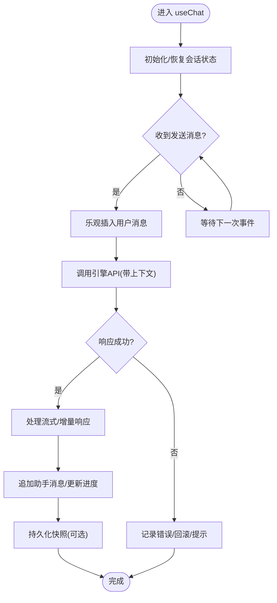
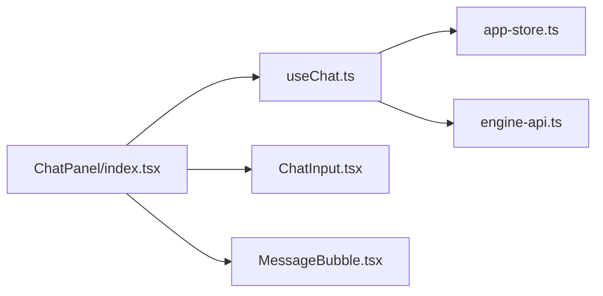

# 状态管理

<cite>
**本文引用的文件**   
- [app-store.ts](file://app/renderer/src/stores/app-store.ts)
- [useChat.ts](file://app/renderer/src/hooks/useChat.ts)
- [engine-api.ts](file://app/renderer/src/services/engine-api.ts)
- [index.tsx](file://app/renderer/src/components/ChatPanel/index.tsx)
- [ChatInput.tsx](file://app/renderer/src/components/ChatPanel/ChatInput.tsx)
- [MessageBubble.tsx](file://app/renderer/src/components/ChatPanel/MessageBubble.tsx)
</cite>

## 目录
1. [简介](#简介)
2. [项目结构](#项目结构)
3. [核心组件](#核心组件)
4. [架构总览](#架构总览)
5. [详细组件分析](#详细组件分析)
6. [依赖关系分析](#依赖关系分析)
7. [性能考虑](#性能考虑)
8. [故障排查指南](#故障排查指南)
9. [结论](#结论)
10. [附录](#附录)

## 简介
本文件围绕 KCoder 渲染层的状态管理系统进行系统化文档化，重点覆盖：
- Zustand 的架构设计与 store 组织方式
- 全局状态的结构、更新模式与选择器使用
- useChat Hook 的实现逻辑（聊天状态、消息流处理、异步协调）
- 与引擎 API 的集成（数据同步、错误处理、缓存策略）
- 状态持久化方案、性能优化技巧与调试方法
- 最佳实践示例（以代码片段路径形式给出）

## 项目结构
KCoder 渲染层采用“按功能域”组织状态与 UI 的模式：
- stores：集中定义应用级 Zustand store
- hooks：封装业务逻辑与状态交互（如 useChat）
- services：对外部服务（引擎 API）的调用封装
- components：UI 组件通过 hooks 订阅 store 并触发更新

图表来源
- [index.tsx](file://app/renderer/src/components/ChatPanel/index.tsx)
- [ChatInput.tsx](file://app/renderer/src/components/ChatPanel/ChatInput.tsx)
- [MessageBubble.tsx](file://app/renderer/src/components/ChatPanel/MessageBubble.tsx)
- [useChat.ts](file://app/renderer/src/hooks/useChat.ts)
- [app-store.ts](file://app/renderer/src/stores/app-store.ts)
- [engine-api.ts](file://app/renderer/src/services/engine-api.ts)

章节来源
- [index.tsx](file://app/renderer/src/components/ChatPanel/index.tsx)
- [ChatInput.tsx](file://app/renderer/src/components/ChatPanel/ChatInput.tsx)
- [MessageBubble.tsx](file://app/renderer/src/components/ChatPanel/MessageBubble.tsx)
- [useChat.ts](file://app/renderer/src/hooks/useChat.ts)
- [app-store.ts](file://app/renderer/src/stores/app-store.ts)
- [engine-api.ts](file://app/renderer/src/services/engine-api.ts)

## 核心组件
本节聚焦三个关键模块的职责与协作关系：
- Store（Zustand）：维护聊天会话、消息列表、加载态、错误等全局状态；提供原子化的更新动作。
- Hook（useChat）：组合 store 动作与服务调用，暴露给 UI 使用的便捷接口，负责消息流编排与异步协调。
- Service（engine-api）：封装对引擎的 HTTP/IPC 调用，统一错误处理与重试/缓存策略。

章节来源
- [app-store.ts](file://app/renderer/src/stores/app-store.ts)
- [useChat.ts](file://app/renderer/src/hooks/useChat.ts)
- [engine-api.ts](file://app/renderer/src/services/engine-api.ts)

## 架构总览
下图展示从 UI 到引擎的数据流与控制流：

图表来源
- [index.tsx](file://app/renderer/src/components/ChatPanel/index.tsx)
- [useChat.ts](file://app/renderer/src/hooks/useChat.ts)
- [app-store.ts](file://app/renderer/src/stores/app-store.ts)
- [engine-api.ts](file://app/renderer/src/services/engine-api.ts)

## 详细组件分析

### Zustand Store 设计（app-store.ts）
- 状态组织
  - 会话与会话元信息（如会话ID、标题、时间戳）
  - 消息集合（有序列表，含角色、内容、时间戳、状态）
  - 运行期标志（加载中、错误信息、分页/游标）
  - 配置项（模型、系统提示、最大长度等）
- 更新模式
  - 原子动作：追加消息、更新消息状态、清空会话、切换配置等
  - 批量更新：在长任务中减少重渲染次数
  - 不可变更新：基于新引用替换数组/对象，确保选择器命中
- 选择器使用
  - 仅订阅必要字段（如只读消息列表、当前加载态），避免无关组件重渲染
  - 组合选择器：将多个派生值组合为稳定引用，提升性能
- 扩展点
  - 中间件：日志、持久化、撤销/重做、统计埋点
  - 命名空间：未来可按功能域拆分多个 store，并通过组合式 hook 聚合

章节来源
- [app-store.ts](file://app/renderer/src/stores/app-store.ts)

### useChat Hook（useChat.ts）
- 职责边界
  - 封装与 store 的交互（读取状态、派发动作）
  - 编排与 engine-api 的调用（发送、接收、重试、取消）
  - 暴露给 UI 的高阶函数（如 sendMessage、clearSession、loadHistory）
- 消息流处理
  - 乐观更新：先插入用户消息，再发起请求，失败时回滚
  - 增量更新：支持流式响应，逐步追加助手消息片段
  - 幂等性：重复提交时去重或合并
- 异步协调
  - 并发控制：同一会话内串行执行，避免竞态
  - 超时与重试：可配置的退避策略
  - 取消机制：离开页面或切换会话时中断未完成的请求
- 错误处理
  - 网络异常、引擎错误、业务校验错误分类处理
  - 用户可见的错误提示与恢复操作（重试、清空、切换模型）
- 选择器与性能
  - 使用细粒度选择器订阅最小状态集
  - 对大对象/数组进行稳定引用包装，避免频繁重建

图表来源
- [useChat.ts](file://app/renderer/src/hooks/useChat.ts)
- [engine-api.ts](file://app/renderer/src/services/engine-api.ts)
- [app-store.ts](file://app/renderer/src/stores/app-store.ts)

章节来源
- [useChat.ts](file://app/renderer/src/hooks/useChat.ts)

### 引擎 API 集成（engine-api.ts）
- 调用封装
  - 统一请求头、鉴权、超时、重试
  - 针对 SSE/流式响应的适配层
- 数据同步
  - 请求-响应映射到 store 的消息结构
  - 事件流到消息片段的转换与合并
- 错误处理
  - 网络错误、HTTP 错误码、引擎业务错误分类
  - 降级策略（离线队列、本地草稿）
- 缓存策略
  - 会话历史缓存（内存+磁盘）
  - 模型/能力清单缓存
  - 失效与更新策略（按会话/按时间/按版本）

章节来源
- [engine-api.ts](file://app/renderer/src/services/engine-api.ts)

### UI 组件与状态绑定
- ChatPanel/index.tsx
  - 订阅 useChat 提供的状态与方法
  - 渲染消息列表与输入区，处理滚动与自动定位
- ChatInput.tsx
  - 收集用户输入，触发 useChat.sendMessage
  - 处理附件上传与预览
- MessageBubble.tsx
  - 根据消息类型与状态渲染不同样式
  - 支持复制、展开、重试等操作

章节来源
- [index.tsx](file://app/renderer/src/components/ChatPanel/index.tsx)
- [ChatInput.tsx](file://app/renderer/src/components/ChatPanel/ChatInput.tsx)
- [MessageBubble.tsx](file://app/renderer/src/components/ChatPanel/MessageBubble.tsx)

## 依赖关系分析
- 组件依赖 Hook，Hook 依赖 Store 与 Service
- Store 不直接依赖 UI，保持纯状态与动作
- Service 屏蔽外部协议细节，向上提供稳定接口

图表来源
- [index.tsx](file://app/renderer/src/components/ChatPanel/index.tsx)
- [useChat.ts](file://app/renderer/src/hooks/useChat.ts)
- [app-store.ts](file://app/renderer/src/stores/app-store.ts)
- [engine-api.ts](file://app/renderer/src/services/engine-api.ts)
- [ChatInput.tsx](file://app/renderer/src/components/ChatPanel/ChatInput.tsx)
- [MessageBubble.tsx](file://app/renderer/src/components/ChatPanel/MessageBubble.tsx)

## 性能考虑
- 选择器粒度
  - 仅订阅变更的最小状态切片，避免整树重渲染
- 不可变更新
  - 使用新引用替换数组/对象，保证浅比较命中
- 批量更新
  - 长任务中使用批量更新减少渲染次数
- 计算缓存
  - 对派生数据进行记忆化，避免重复计算
- 虚拟列表
  - 大量消息时使用虚拟化渲染
- 防抖/节流
  - 输入与滚动场景下降低高频更新
- 取消与去抖
  - 快速切换会话时取消未完成请求，避免多余渲染

[本节为通用指导，无需源码引用]

## 故障排查指南
- 常见问题定位
  - 消息未显示：检查是否乐观插入成功、store 更新是否被选择器订阅
  - 重复消息：检查去重键与幂等逻辑
  - 流式卡顿：检查增量合并逻辑与渲染批次
  - 网络错误：查看 engine-api 的错误分类与重试策略
- 调试建议
  - 启用 store 日志中间件，观察动作序列与状态快照
  - 在 useChat 中打印关键节点（发送、响应、合并、持久化）
  - 使用浏览器/开发者工具监控网络与存储读写
- 恢复策略
  - 会话崩溃后从持久化快照恢复
  - 失败请求自动重试与降级

章节来源
- [useChat.ts](file://app/renderer/src/hooks/useChat.ts)
- [engine-api.ts](file://app/renderer/src/services/engine-api.ts)
- [app-store.ts](file://app/renderer/src/stores/app-store.ts)

## 结论
通过将状态集中在 Zustand store、用 useChat 编排业务流、并以 engine-api 抽象外部依赖，KCoder 实现了清晰、可扩展且高性能的聊天状态管理。配合选择器、批处理、持久化与完善的错误处理，可在复杂交互场景下保持稳定体验。

[本节为总结，无需源码引用]

## 附录

### 最佳实践示例（以路径引用代替代码）
- 定义 store 与动作
  - [app-store.ts](file://app/renderer/src/stores/app-store.ts)
- 在 Hook 中组合 store 与 API
  - [useChat.ts](file://app/renderer/src/hooks/useChat.ts)
- 在组件中订阅与触发
  - [index.tsx](file://app/renderer/src/components/ChatPanel/index.tsx)
  - [ChatInput.tsx](file://app/renderer/src/components/ChatPanel/ChatInput.tsx)
  - [MessageBubble.tsx](file://app/renderer/src/components/ChatPanel/MessageBubble.tsx)
- 引擎 API 封装与错误处理
  - [engine-api.ts](file://app/renderer/src/services/engine-api.ts)