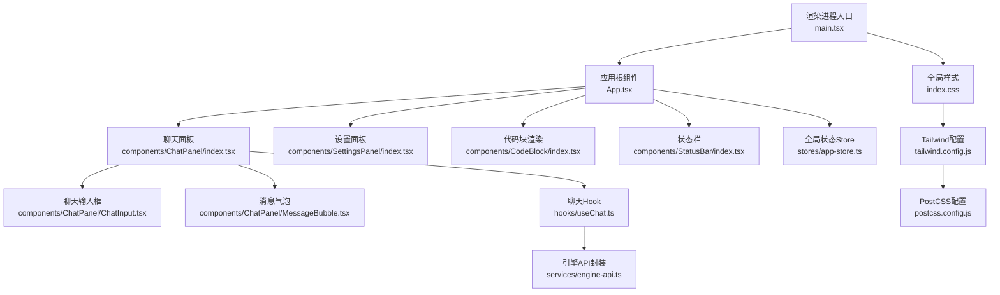
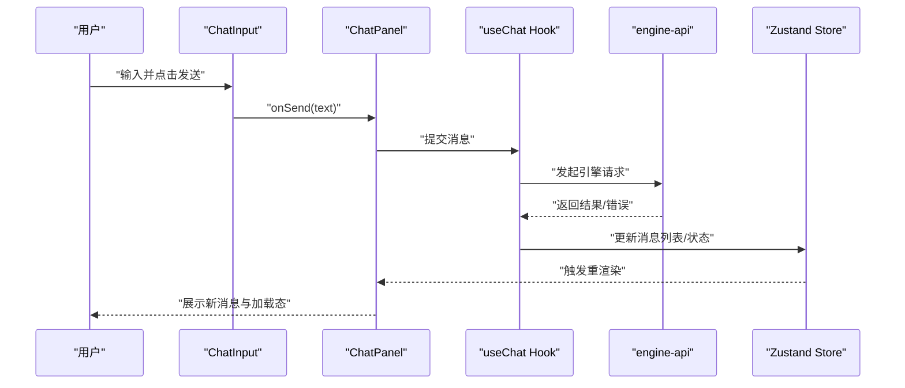
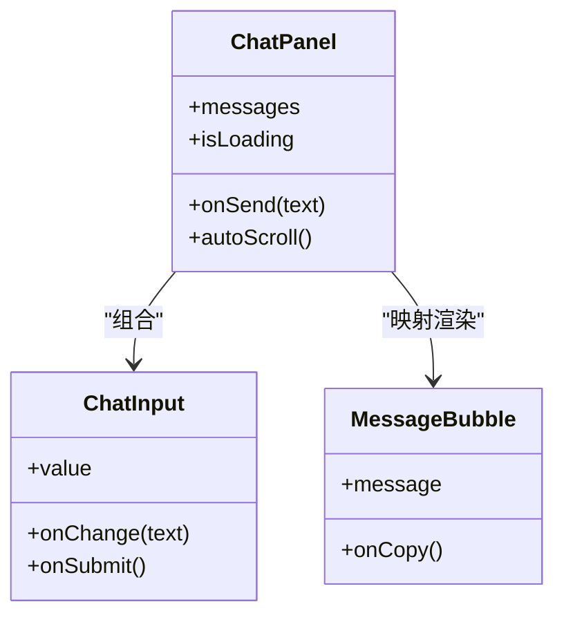
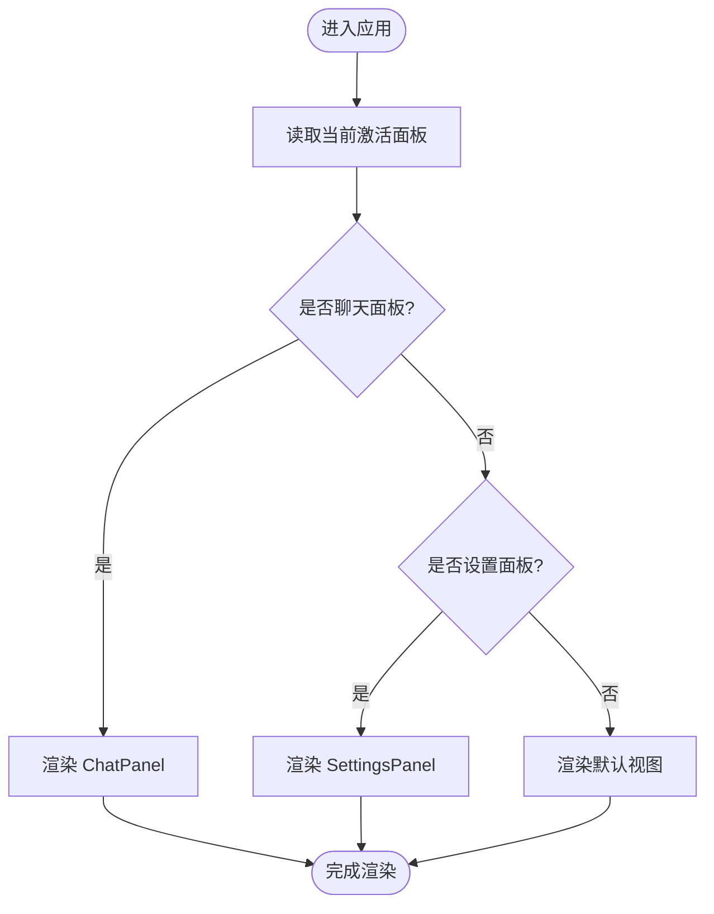
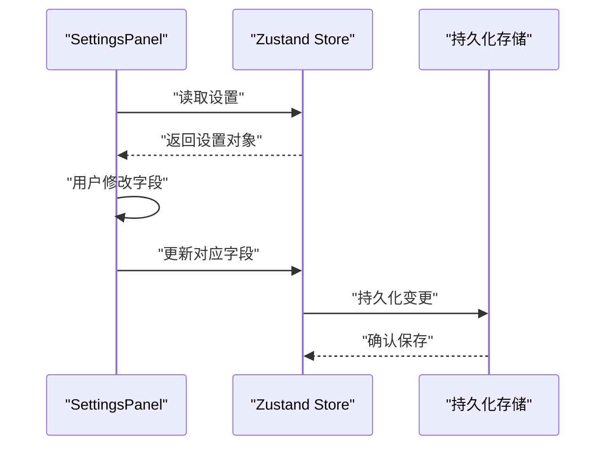
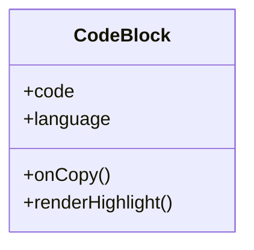
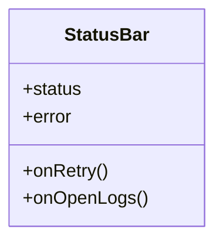
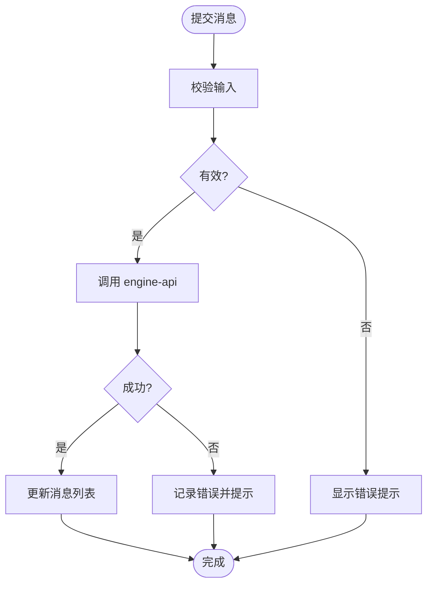
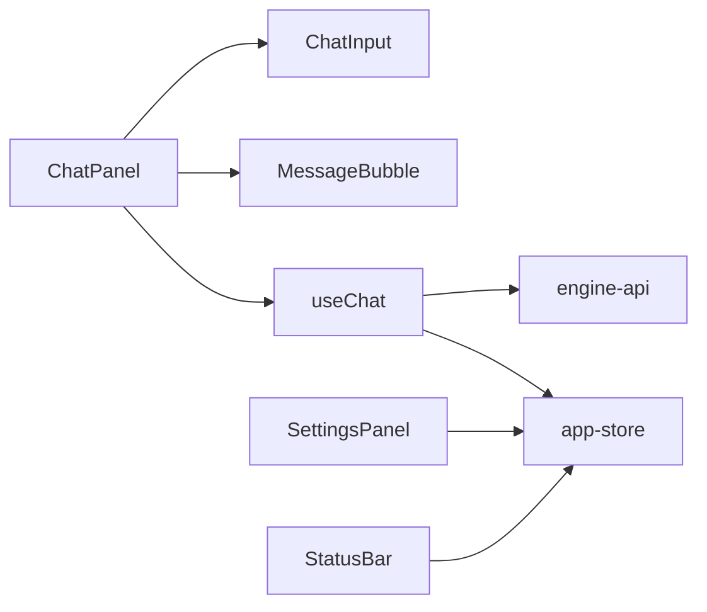

# 表现层（Presentation Layer）

<cite>
**本文引用的文件**   
- [App.tsx](file://app/renderer/src/App.tsx)
- [main.tsx](file://app/renderer/src/main.tsx)
- [index.css](file://app/renderer/src/index.css)
- [tailwind.config.js](file://app/tailwind.config.js)
- [postcss.config.js](file://app/postcss.config.js)
- [package.json](file://app/package.json)
- [ChatPanel/index.tsx](file://app/renderer/src/components/ChatPanel/index.tsx)
- [ChatInput.tsx](file://app/renderer/src/components/ChatPanel/ChatInput.tsx)
- [MessageBubble.tsx](file://app/renderer/src/components/ChatPanel/MessageBubble.tsx)
- [SettingsPanel/index.tsx](file://app/renderer/src/components/SettingsPanel/index.tsx)
- [CodeBlock/index.tsx](file://app/renderer/src/components/CodeBlock/index.tsx)
- [StatusBar/index.tsx](file://app/renderer/src/components/StatusBar/index.tsx)
- [useChat.ts](file://app/renderer/src/hooks/useChat.ts)
- [engine-api.ts](file://app/renderer/src/services/engine-api.ts)
- [app-store.ts](file://app/renderer/src/stores/app-store.ts)
</cite>

## 目录
1. [简介](#简介)
2. [项目结构](#项目结构)
3. [核心组件](#核心组件)
4. [架构总览](#架构总览)
5. [详细组件分析](#详细组件分析)
6. [依赖关系分析](#依赖关系分析)
7. [性能考虑](#性能考虑)
8. [故障排查指南](#故障排查指南)
9. [结论](#结论)
10. [附录](#附录)

## 简介
本章节聚焦于KCoder的表现层，围绕React UI组件架构、状态管理策略与样式系统展开。重点覆盖以下方面：
- 组件层次结构与职责划分
- 基于Zustand的状态管理设计（store结构、数据流、持久化）
- Tailwind CSS集成与主题定制方案
- 核心组件（ChatPanel、Sidebar、SettingsPanel等）的实现模式与交互流程
- 组件间通信模式、事件处理机制与性能优化策略
- 面向开发的最佳实践示例路径

## 项目结构
表现层位于渲染进程（renderer），采用“按功能域组织”的目录结构：
- components：UI组件（ChatPanel、SettingsPanel、CodeBlock、StatusBar等）
- hooks：可复用逻辑（如useChat）
- services：对外服务封装（如engine-api）
- stores：全局状态（Zustand store）
- App.tsx：应用根组件
- main.tsx：入口挂载
- index.css：全局样式与Tailwind指令
- tailwind.config.js / postcss.config.js：样式构建配置
- package.json：依赖与脚本

图表来源
- [main.tsx:1-200](file://app/renderer/src/main.tsx#L1-L200)
- [App.tsx:1-200](file://app/renderer/src/App.tsx#L1-L200)
- [ChatPanel/index.tsx:1-200](file://app/renderer/src/components/ChatPanel/index.tsx#L1-L200)
- [SettingsPanel/index.tsx:1-200](file://app/renderer/src/components/SettingsPanel/index.tsx#L1-L200)
- [CodeBlock/index.tsx:1-200](file://app/renderer/src/components/CodeBlock/index.tsx#L1-L200)
- [StatusBar/index.tsx:1-200](file://app/renderer/src/components/StatusBar/index.tsx#L1-L200)
- [ChatInput.tsx:1-200](file://app/renderer/src/components/ChatPanel/ChatInput.tsx#L1-L200)
- [MessageBubble.tsx:1-200](file://app/renderer/src/components/ChatPanel/MessageBubble.tsx#L1-L200)
- [useChat.ts:1-200](file://app/renderer/src/hooks/useChat.ts#L1-L200)
- [engine-api.ts:1-200](file://app/renderer/src/services/engine-api.ts#L1-L200)
- [app-store.ts:1-200](file://app/renderer/src/stores/app-store.ts#L1-L200)
- [index.css:1-200](file://app/renderer/src/index.css#L1-L200)
- [tailwind.config.js:1-200](file://app/tailwind.config.js#L1-L200)
- [postcss.config.js:1-200](file://app/postcss.config.js#L1-L200)

章节来源
- [main.tsx:1-200](file://app/renderer/src/main.tsx#L1-L200)
- [App.tsx:1-200](file://app/renderer/src/App.tsx#L1-L200)
- [package.json:1-200](file://app/package.json#L1-L200)

## 核心组件
本节概述关键UI组件的职责与协作方式：
- ChatPanel：聊天对话主容器，负责消息列表展示、滚动定位、输入分发与加载态控制
- ChatInput：输入区域，负责用户输入校验、发送触发与快捷键处理
- MessageBubble：单条消息气泡，负责内容渲染（文本/代码片段）、复制与时间戳显示
- SettingsPanel：设置面板，负责应用偏好项编辑与保存
- CodeBlock：代码块渲染器，支持语法高亮、复制与语言标签
- StatusBar：底部状态栏，展示运行状态、错误提示与操作入口

组件间通过props向下传递数据，通过回调函数或Zustand store进行跨层级通信。

章节来源
- [ChatPanel/index.tsx:1-200](file://app/renderer/src/components/ChatPanel/index.tsx#L1-L200)
- [ChatInput.tsx:1-200](file://app/renderer/src/components/ChatPanel/ChatInput.tsx#L1-L200)
- [MessageBubble.tsx:1-200](file://app/renderer/src/components/ChatPanel/MessageBubble.tsx#L1-L200)
- [SettingsPanel/index.tsx:1-200](file://app/renderer/src/components/SettingsPanel/index.tsx#L1-L200)
- [CodeBlock/index.tsx:1-200](file://app/renderer/src/components/CodeBlock/index.tsx#L1-L200)
- [StatusBar/index.tsx:1-200](file://app/renderer/src/components/StatusBar/index.tsx#L1-L200)

## 架构总览
表现层遵循“单向数据流 + 集中式状态”的模式：
- React组件树自上而下渲染
- 业务状态集中于Zustand store，组件订阅所需切片
- 异步请求通过services层统一封装，避免在组件中直接调用底层API
- 样式系统基于Tailwind CSS，结合PostCSS与自定义主题扩展

图表来源
- [ChatInput.tsx:1-200](file://app/renderer/src/components/ChatPanel/ChatInput.tsx#L1-L200)
- [ChatPanel/index.tsx:1-200](file://app/renderer/src/components/ChatPanel/index.tsx#L1-L200)
- [useChat.ts:1-200](file://app/renderer/src/hooks/useChat.ts#L1-L200)
- [engine-api.ts:1-200](file://app/renderer/src/services/engine-api.ts#L1-L200)
- [app-store.ts:1-200](file://app/renderer/src/stores/app-store.ts#L1-L200)

## 详细组件分析

### ChatPanel 组件
- 职责：聚合消息列表、输入区与加载指示；维护滚动位置与自动滚动行为
- 状态来源：从Zustand store读取消息集合与加载态；通过回调更新状态
- 交互流程：接收子组件事件，委托给useChat进行业务编排，再写入store
- 性能要点：对长列表使用稳定key与惰性渲染；避免不必要的重渲染

图表来源
- [ChatPanel/index.tsx:1-200](file://app/renderer/src/components/ChatPanel/index.tsx#L1-L200)
- [ChatInput.tsx:1-200](file://app/renderer/src/components/ChatPanel/ChatInput.tsx#L1-L200)
- [MessageBubble.tsx:1-200](file://app/renderer/src/components/ChatPanel/MessageBubble.tsx#L1-L200)

章节来源
- [ChatPanel/index.tsx:1-200](file://app/renderer/src/components/ChatPanel/index.tsx#L1-L200)
- [ChatInput.tsx:1-200](file://app/renderer/src/components/ChatPanel/ChatInput.tsx#L1-L200)
- [MessageBubble.tsx:1-200](file://app/renderer/src/components/ChatPanel/MessageBubble.tsx#L1-L200)

### Sidebar 组件（概念性说明）
- 角色：侧边导航/面板切换容器，提供路由或视图切换能力
- 交互：点击菜单项切换当前活动面板（如ChatPanel、SettingsPanel）
- 状态：可从store读取当前激活面板标识，驱动条件渲染

[此图为概念流程图，不直接映射具体源码文件]

### SettingsPanel 组件
- 职责：展示并编辑应用设置项（如主题、模型参数、快捷键等）
- 数据流：从store读取设置快照；变更时写回store并触发持久化
- 交互：表单控件绑定onChange，提交时批量保存

图表来源
- [SettingsPanel/index.tsx:1-200](file://app/renderer/src/components/SettingsPanel/index.tsx#L1-L200)
- [app-store.ts:1-200](file://app/renderer/src/stores/app-store.ts#L1-L200)

章节来源
- [SettingsPanel/index.tsx:1-200](file://app/renderer/src/components/SettingsPanel/index.tsx#L1-L200)

### CodeBlock 组件
- 职责：安全渲染代码片段，提供语言标签、复制按钮与可选的高亮
- 性能：对大段代码进行分片或懒加载；避免阻塞主线程
- 可访问性：为复制按钮提供键盘操作与屏幕阅读器支持

图表来源
- [CodeBlock/index.tsx:1-200](file://app/renderer/src/components/CodeBlock/index.tsx#L1-L200)

章节来源
- [CodeBlock/index.tsx:1-200](file://app/renderer/src/components/CodeBlock/index.tsx#L1-L200)

### StatusBar 组件
- 职责：展示应用运行状态、错误信息与快捷操作入口
- 状态：从store读取状态标志位；根据状态切换颜色与文案
- 交互：点击错误信息可跳转到日志或重试

图表来源
- [StatusBar/index.tsx:1-200](file://app/renderer/src/components/StatusBar/index.tsx#L1-L200)

章节来源
- [StatusBar/index.tsx:1-200](file://app/renderer/src/components/StatusBar/index.tsx#L1-L200)

### useChat Hook
- 职责：封装聊天相关状态与副作用（发送消息、加载态、错误处理）
- 数据流：调用engine-api发起请求，成功后更新store中的消息列表
- 错误处理：捕获网络异常与服务端错误，反馈到UI

图表来源
- [useChat.ts:1-200](file://app/renderer/src/hooks/useChat.ts#L1-L200)
- [engine-api.ts:1-200](file://app/renderer/src/services/engine-api.ts#L1-L200)
- [app-store.ts:1-200](file://app/renderer/src/stores/app-store.ts#L1-L200)

章节来源
- [useChat.ts:1-200](file://app/renderer/src/hooks/useChat.ts#L1-L200)
- [engine-api.ts:1-200](file://app/renderer/src/services/engine-api.ts#L1-L200)

## 依赖关系分析
- 组件依赖：
  - ChatPanel 组合 ChatInput 与 MessageBubble
  - useChat 依赖 engine-api 与 app-store
  - SettingsPanel 依赖 app-store 与持久化层
- 外部依赖：
  - Tailwind CSS 与 PostCSS 用于样式编译
  - Zustand 用于状态管理
  - 引擎API（HTTP/IPC）用于与后端通信

图表来源
- [ChatPanel/index.tsx:1-200](file://app/renderer/src/components/ChatPanel/index.tsx#L1-L200)
- [ChatInput.tsx:1-200](file://app/renderer/src/components/ChatPanel/ChatInput.tsx#L1-L200)
- [MessageBubble.tsx:1-200](file://app/renderer/src/components/ChatPanel/MessageBubble.tsx#L1-L200)
- [useChat.ts:1-200](file://app/renderer/src/hooks/useChat.ts#L1-L200)
- [engine-api.ts:1-200](file://app/renderer/src/services/engine-api.ts#L1-L200)
- [app-store.ts:1-200](file://app/renderer/src/stores/app-store.ts#L1-L200)
- [SettingsPanel/index.tsx:1-200](file://app/renderer/src/components/SettingsPanel/index.tsx#L1-L200)
- [StatusBar/index.tsx:1-200](file://app/renderer/src/components/StatusBar/index.tsx#L1-L200)

章节来源
- [package.json:1-200](file://app/package.json#L1-L200)

## 性能考虑
- 列表渲染优化
  - 为消息条目提供稳定的唯一key，避免无意义重排
  - 对长列表实现虚拟滚动或分页加载，减少DOM节点数量
- 状态更新最小化
  - 将频繁更新的局部状态下沉至组件内部，减少全局store粒度
  - 使用Zustand的selector精确订阅，避免无关组件重渲染
- 异步与错误边界
  - 对耗时操作使用防抖/节流（如搜索、自动保存）
  - 使用错误边界包裹易崩溃组件，提升整体稳定性
- 样式与主题
  - 利用Tailwind原子类减少重复样式，按需生成CSS
  - 主题变量集中定义，便于运行时切换与暗色模式适配

[本节为通用指导，不直接分析具体文件]

## 故障排查指南
- 常见问题定位
  - 消息未更新：检查useChat是否正确调用engine-api并更新store
  - 设置未持久化：确认store的持久化中间件与存储键名一致
  - 样式未生效：验证Tailwind指令与配置文件路径
- 调试建议
  - 在useChat与engine-api处添加日志，观察请求与响应
  - 使用浏览器开发者工具监控store变化与组件重渲染次数
  - 针对长列表，开启虚拟滚动并测量首屏渲染时间

章节来源
- [useChat.ts:1-200](file://app/renderer/src/hooks/useChat.ts#L1-L200)
- [engine-api.ts:1-200](file://app/renderer/src/services/engine-api.ts#L1-L200)
- [app-store.ts:1-200](file://app/renderer/src/stores/app-store.ts#L1-L200)
- [index.css:1-200](file://app/renderer/src/index.css#L1-L200)
- [tailwind.config.js:1-200](file://app/tailwind.config.js#L1-L200)

## 结论
KCoder的表现层以React为核心，结合Zustand与Tailwind CSS构建了清晰、可扩展且高性能的用户界面。通过合理的组件分层、集中的状态管理与统一的样式体系，实现了良好的可维护性与用户体验。建议在后续迭代中持续优化长列表渲染、细化状态切片，并完善错误边界与可访问性支持。

[本节为总结性内容，不直接分析具体文件]

## 附录

### 样式系统与主题定制
- Tailwind集成
  - 在入口样式文件中引入Tailwind指令
  - 通过tailwind.config.js扩展主题（颜色、字体、间距等）
  - 使用postcss.config.js确保构建链正确
- 主题定制建议
  - 将品牌色、语义色与中性色抽象为变量
  - 提供暗色模式开关，并在store中持久化用户选择
  - 为不同组件定义一致的圆角、阴影与过渡效果

章节来源
- [index.css:1-200](file://app/renderer/src/index.css#L1-L200)
- [tailwind.config.js:1-200](file://app/tailwind.config.js#L1-L200)
- [postcss.config.js:1-200](file://app/postcss.config.js#L1-L200)

### 组件开发最佳实践示例路径
- 聊天消息发送流程
  - [ChatInput.tsx:1-200](file://app/renderer/src/components/ChatPanel/ChatInput.tsx#L1-L200)
  - [ChatPanel/index.tsx:1-200](file://app/renderer/src/components/ChatPanel/index.tsx#L1-L200)
  - [useChat.ts:1-200](file://app/renderer/src/hooks/useChat.ts#L1-L200)
  - [engine-api.ts:1-200](file://app/renderer/src/services/engine-api.ts#L1-L200)
- 设置项持久化
  - [SettingsPanel/index.tsx:1-200](file://app/renderer/src/components/SettingsPanel/index.tsx#L1-L200)
  - [app-store.ts:1-200](file://app/renderer/src/stores/app-store.ts#L1-L200)
- 代码块渲染与复制
  - [CodeBlock/index.tsx:1-200](file://app/renderer/src/components/CodeBlock/index.tsx#L1-L200)
- 状态栏错误提示
  - [StatusBar/index.tsx:1-200](file://app/renderer/src/components/StatusBar/index.tsx#L1-L200)