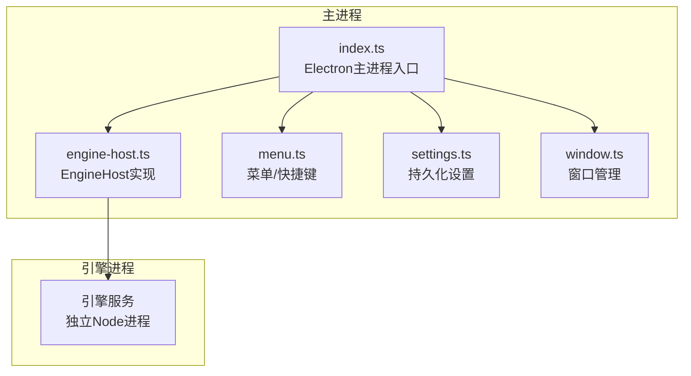
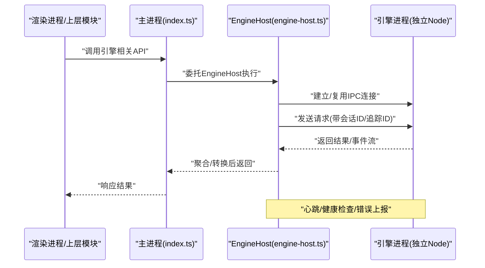
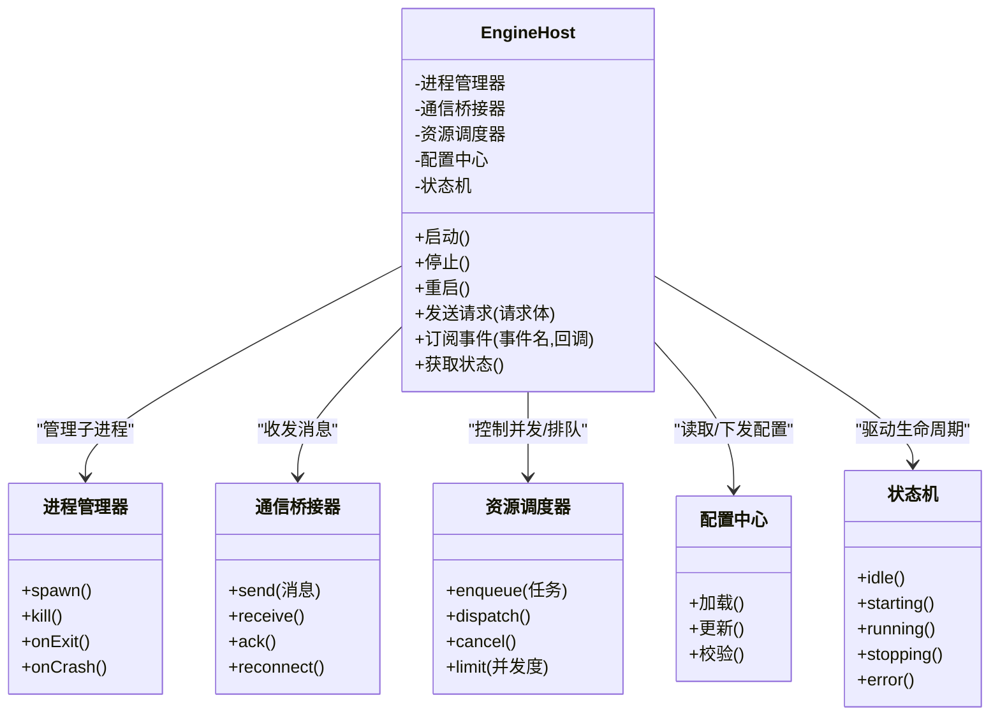
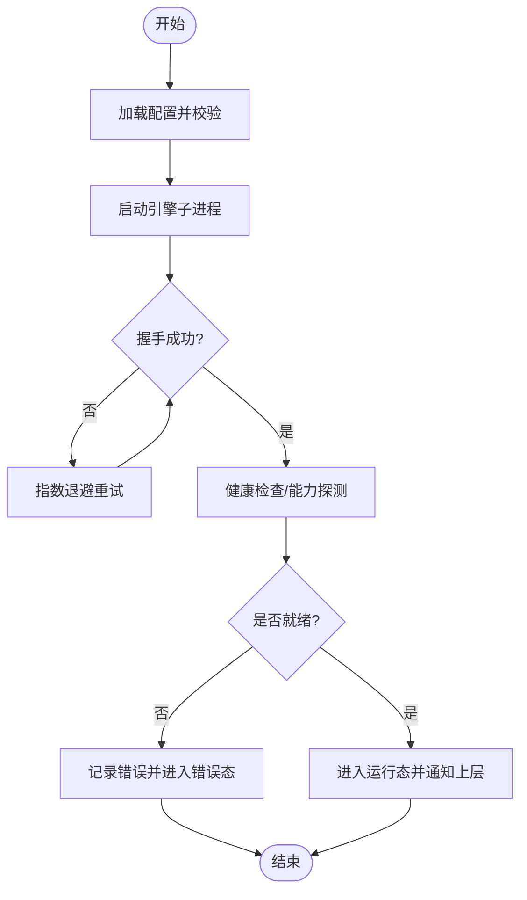
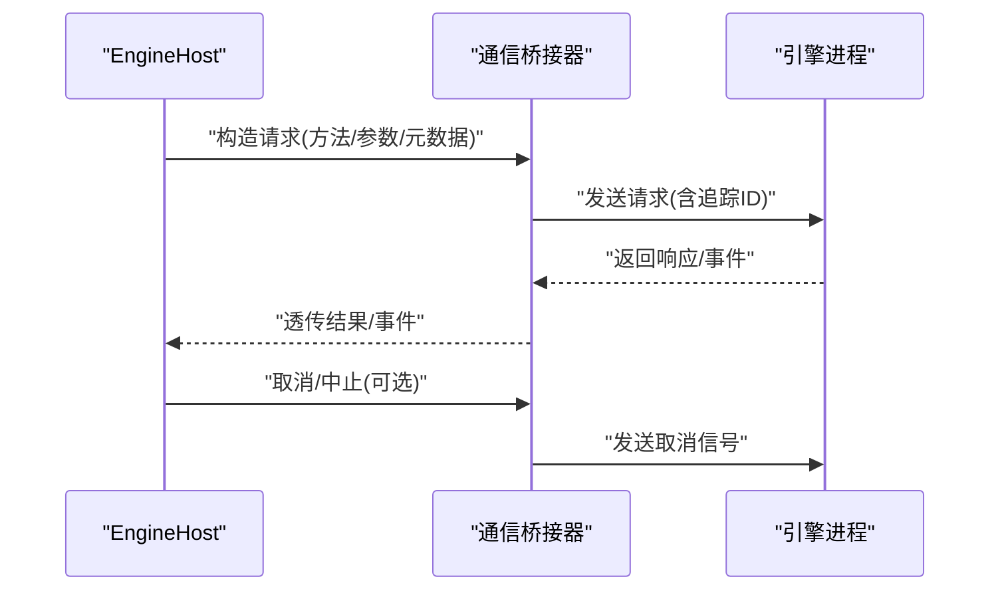
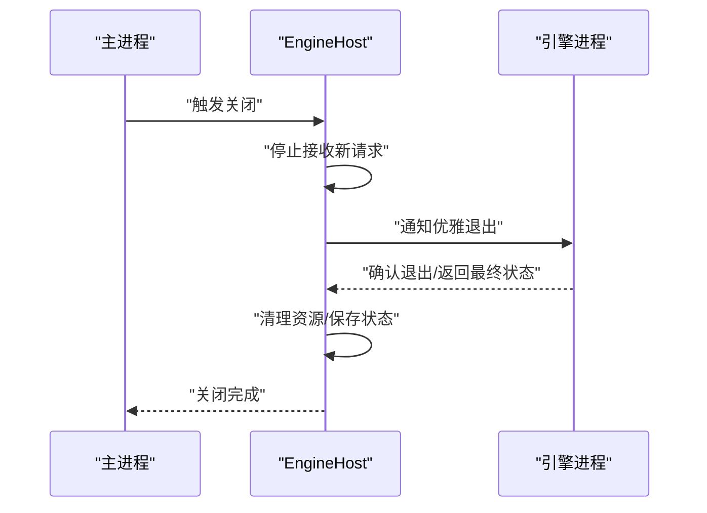
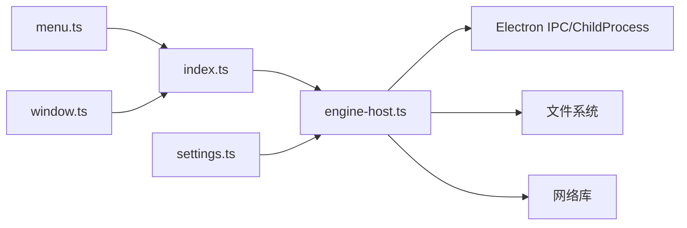

# 引擎主机（Engine Host）

<cite>
**本文引用的文件**   
- [engine-host.ts](file://app/main/engine-host.ts)
- [index.ts](file://app/main/index.ts)
- [menu.ts](file://app/main/menu.ts)
- [settings.ts](file://app/main/settings.ts)
- [window.ts](file://app/main/window.ts)
- [package.json](file://app/package.json)
</cite>

## 目录
1. [简介](#简介)
2. [项目结构](#项目结构)
3. [核心组件](#核心组件)
4. [架构总览](#架构总览)
5. [详细组件分析](#详细组件分析)
6. [依赖关系分析](#依赖关系分析)
7. [性能考量](#性能考量)
8. [故障排查指南](#故障排查指南)
9. [结论](#结论)
10. [附录](#附录)

## 简介
本文件面向KCoder的“引擎主机”子系统，聚焦主进程中的EngineHost类。文档围绕以下目标展开：
- 解释EngineHost的核心职责：AI引擎生命周期管理、进程间通信桥接与资源调度。
- 说明引擎启动流程、初始化配置、错误处理与优雅关闭。
- 阐述主进程与引擎进程的通信协议：消息格式、事件监听与异常处理策略。
- 提供扩展引擎功能与管理外部资源的实践指引（以代码片段路径形式给出）。

## 项目结构
KCoder采用Electron多进程架构：主进程负责应用外壳与资源编排，渲染进程承载UI，引擎作为独立子进程运行AI能力。与“引擎主机”直接相关的文件位于app/main目录，其中engine-host.ts是EngineHost的实现入口；index.ts为Electron主进程入口；其他文件提供菜单、设置与窗口等宿主能力。

图表来源
- [index.ts](file://app/main/index.ts)
- [engine-host.ts](file://app/main/engine-host.ts)
- [menu.ts](file://app/main/menu.ts)
- [settings.ts](file://app/main/settings.ts)
- [window.ts](file://app/main/window.ts)

章节来源
- [index.ts](file://app/main/index.ts)
- [engine-host.ts](file://app/main/engine-host.ts)
- [menu.ts](file://app/main/menu.ts)
- [settings.ts](file://app/main/settings.ts)
- [window.ts](file://app/main/window.ts)

## 核心组件
- EngineHost
  - 职责：封装AI引擎的生命周期（创建、启动、重启、销毁）、与引擎子进程的通信桥接、以及对外暴露的统一API。
  - 关键能力：
    - 进程管理：启动/停止引擎子进程，监控退出码与崩溃恢复。
    - 通信桥接：在主进程与引擎进程之间转发请求/响应与事件流，维护会话上下文。
    - 资源调度：限制并发任务数、队列化长耗时操作、按优先级调度。
    - 配置注入：从settings读取模型、工具、能力开关等配置并下发至引擎。
    - 错误处理：捕获网络/序列化/超时/权限等异常，进行降级与重试。
    - 优雅关闭：等待在途任务完成或超时强制终止，清理临时资源。

章节来源
- [engine-host.ts](file://app/main/engine-host.ts)

## 架构总览
下图展示主进程与引擎进程的交互边界与数据流向。EngineHost作为“主机”，向上为上层模块（如菜单、设置、窗口）提供统一接口，向下通过IPC通道与引擎进程通信。

图表来源
- [index.ts](file://app/main/index.ts)
- [engine-host.ts](file://app/main/engine-host.ts)

## 详细组件分析

### EngineHost 类设计
EngineHost将“进程管理”“通信桥接”“资源调度”“配置与状态”解耦为内部协作对象，便于测试与扩展。

图表来源
- [engine-host.ts](file://app/main/engine-host.ts)

章节来源
- [engine-host.ts](file://app/main/engine-host.ts)

### 引擎启动流程
EngineHost的启动流程包含配置校验、进程创建、握手与健康检查、就绪通知等阶段。

图表来源
- [engine-host.ts](file://app/main/engine-host.ts)

章节来源
- [engine-host.ts](file://app/main/engine-host.ts)

### 进程间通信协议
EngineHost与引擎进程之间的通信遵循“请求-响应+事件流”的混合模式，保证可靠与可扩展。

- 消息类型
  - 请求：包含方法名、参数、会话ID、追踪ID、超时时间。
  - 响应：包含结果、错误码、错误信息、耗时统计。
  - 事件：包含事件名、负载、序列号、来源标识。
- 可靠性机制
  - 心跳：周期性ping/pong检测链路存活。
  - 重连：断线自动重连，带指数退避与最大重试次数。
  - 幂等：对可重试请求使用追踪ID去重。
- 背压与限流
  - 基于资源调度器的并发上限与队列长度保护。
  - 大响应分块传输与流式事件推送。

图表来源
- [engine-host.ts](file://app/main/engine-host.ts)

章节来源
- [engine-host.ts](file://app/main/engine-host.ts)

### 错误处理与优雅关闭
- 错误分类
  - 启动期：配置错误、端口占用、权限不足。
  - 运行期：网络异常、序列化失败、超时、引擎崩溃。
  - 关闭期：在途任务未完结、资源未释放。
- 处理策略
  - 启动期：回滚配置、提示用户、记录诊断信息。
  - 运行期：重试/降级、熔断、告警、指标上报。
  - 关闭期：等待在途任务完成或超时强制终止，清理临时文件与句柄。
- 优雅关闭时序

图表来源
- [engine-host.ts](file://app/main/engine-host.ts)

章节来源
- [engine-host.ts](file://app/main/engine-host.ts)

### 扩展引擎功能与管理外部资源
- 新增引擎能力
  - 在引擎侧注册新的工具/技能，并在EngineHost中声明对应的请求映射与权限策略。
  - 参考路径：[engine-host.ts](file://app/main/engine-host.ts)
- 接入外部系统
  - 通过配置中心注入外部凭据与端点，由通信桥接器在请求头中携带安全令牌。
  - 参考路径：[settings.ts](file://app/main/settings.ts)、[engine-host.ts](file://app/main/engine-host.ts)
- 资源配额与隔离
  - 使用资源调度器为不同租户/会话分配CPU/内存/并发配额。
  - 参考路径：[engine-host.ts](file://app/main/engine-host.ts)
- 示例片段路径
  - 启动与停止：[engine-host.ts](file://app/main/engine-host.ts)
  - 发送请求与事件订阅：[engine-host.ts](file://app/main/engine-host.ts)
  - 配置加载与校验：[settings.ts](file://app/main/settings.ts)
  - 主进程集成入口：[index.ts](file://app/main/index.ts)

章节来源
- [engine-host.ts](file://app/main/engine-host.ts)
- [settings.ts](file://app/main/settings.ts)
- [index.ts](file://app/main/index.ts)

## 依赖关系分析
- 内部依赖
  - index.ts 作为Electron主进程入口，初始化EngineHost并将其挂载到全局上下文，供渲染进程通过预加载脚本访问。
  - menu.ts、window.ts、settings.ts 分别提供菜单/窗口/设置能力，EngineHost依赖settings.ts提供的配置源。
- 外部依赖
  - Electron IPC/ChildProcess用于跨进程通信与子进程管理。
  - Node.js文件系统与网络库用于配置读写与远程调用。
  - 日志与遥测库用于错误追踪与指标采集。

图表来源
- [index.ts](file://app/main/index.ts)
- [engine-host.ts](file://app/main/engine-host.ts)
- [menu.ts](file://app/main/menu.ts)
- [window.ts](file://app/main/window.ts)
- [settings.ts](file://app/main/settings.ts)

章节来源
- [index.ts](file://app/main/index.ts)
- [engine-host.ts](file://app/main/engine-host.ts)
- [menu.ts](file://app/main/menu.ts)
- [window.ts](file://app/main/window.ts)
- [settings.ts](file://app/main/settings.ts)

## 性能考量
- 并发控制
  - 通过资源调度器限制同时运行的引擎任务数量，避免OOM与CPU抖动。
- 背压与批处理
  - 对高频小消息进行合并与节流，降低IPC开销。
- 缓存与复用
  - 复用已建立的IPC连接与会话上下文，减少握手成本。
- 观测性
  - 记录关键路径耗时、错误率与队列长度，结合指标面板定位瓶颈。

## 故障排查指南
- 常见问题
  - 引擎无法启动：检查配置项、端口占用、权限与磁盘空间。
  - 频繁重连：关注网络稳定性与远端服务可用性。
  - 任务堆积：调整并发上限与队列长度，评估下游处理能力。
- 定位手段
  - 查看EngineHost日志与指标，核对握手与健康检查状态。
  - 启用调试模式，输出IPC消息轨迹与错误堆栈。
  - 使用最小复现用例隔离问题域（仅开启必要能力）。
- 恢复策略
  - 自动重启：在错误计数阈值内尝试重启引擎。
  - 降级模式：禁用非核心能力，保留基础对话与代码补全。
  - 快速回滚：恢复到上一稳定版本配置。

章节来源
- [engine-host.ts](file://app/main/engine-host.ts)

## 结论
EngineHost作为KCoder的主机层，承担AI引擎的全生命周期管理与跨进程通信桥接，并通过资源调度与错误处理保障系统的稳定性与可扩展性。遵循本文档的设计与最佳实践，可在不侵入引擎内核的前提下，灵活扩展能力、管理外部资源并提升整体可靠性。

## 附录
- 术语
  - 引擎进程：独立于主进程的Node进程，承载AI推理与工具执行。
  - 会话：一次用户交互的上下文，贯穿请求与事件流。
  - 追踪ID：用于端到端排障的唯一标识。
- 参考路径
  - 主进程入口：[index.ts](file://app/main/index.ts)
  - 引擎主机实现：[engine-host.ts](file://app/main/engine-host.ts)
  - 设置与配置：[settings.ts](file://app/main/settings.ts)
  - 菜单与窗口：[menu.ts](file://app/main/menu.ts)、[window.ts](file://app/main/window.ts)
  - 应用包信息：[package.json](file://app/package.json)