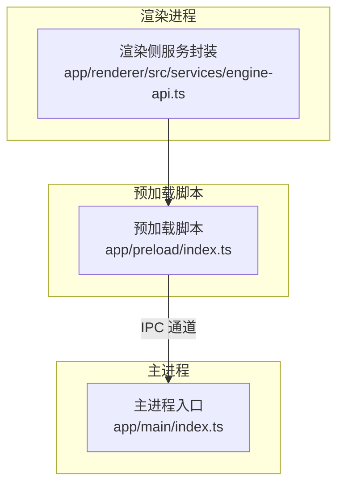
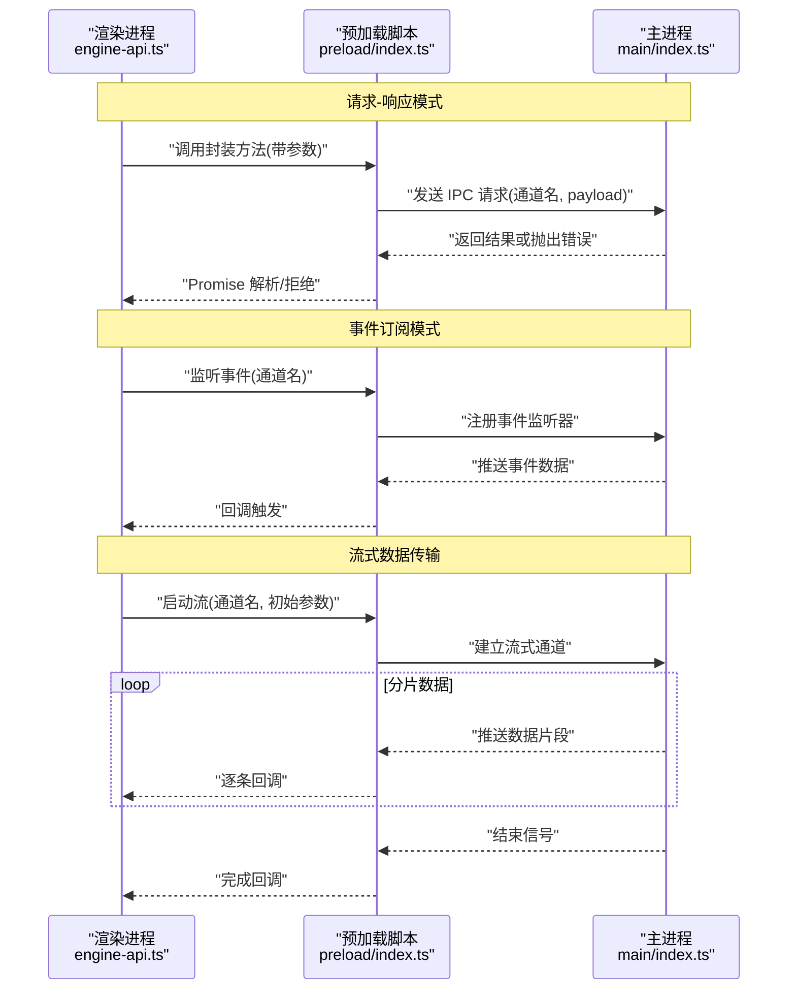
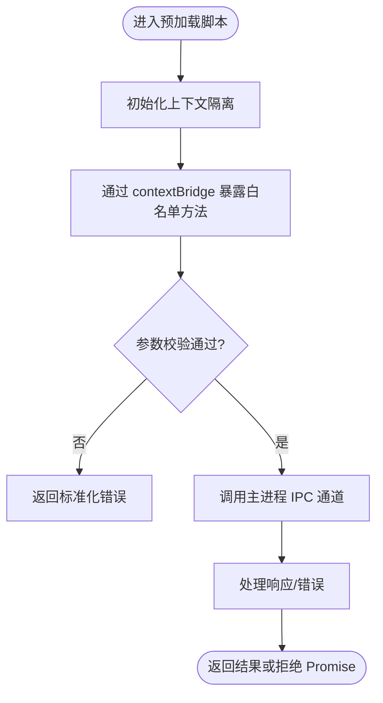
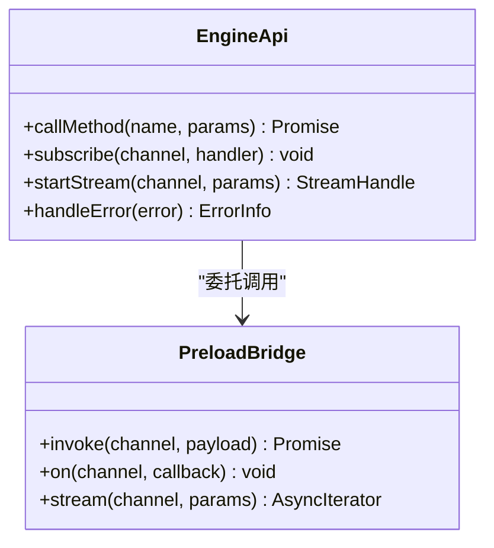
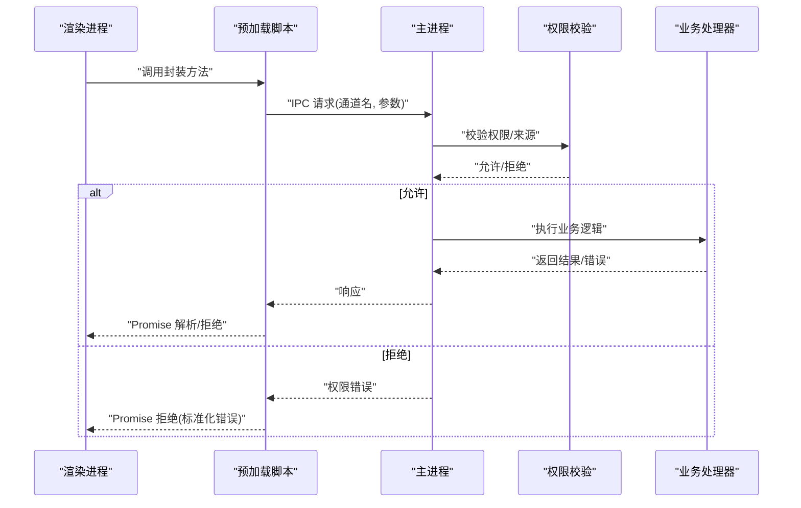
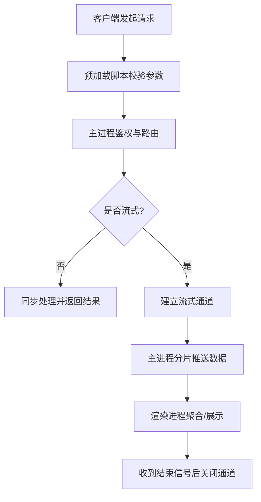
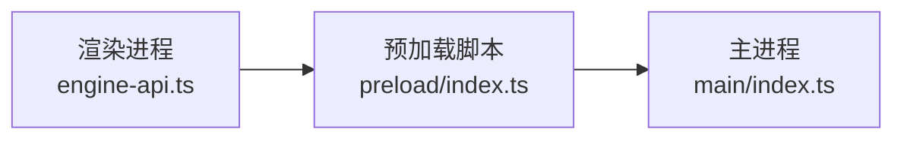

# 进程间通信（IPC）

<cite>
**本文引用的文件**   
- [app/main/index.ts](file://app/main/index.ts)
- [app/preload/index.ts](file://app/preload/index.ts)
- [app/renderer/src/services/engine-api.ts](file://app/renderer/src/services/engine-api.ts)
</cite>

## 目录
1. [简介](#简介)
2. [项目结构](#项目结构)
3. [核心组件](#核心组件)
4. [架构总览](#架构总览)
5. [详细组件分析](#详细组件分析)
6. [依赖关系分析](#依赖关系分析)
7. [性能考虑](#性能考虑)
8. [故障排查指南](#故障排查指南)
9. [结论](#结论)
10. [附录](#附录)

## 简介
本文件聚焦于KCoder的进程间通信（IPC）体系，围绕Electron主进程与渲染进程之间的安全通信展开。文档涵盖：
- 预加载脚本的安全隔离策略与API暴露模式
- 消息传递协议设计：请求-响应、事件订阅、流式数据传输
- 安全性考量：权限控制、输入验证、错误边界
- 实现示例路径：如何在渲染进程中发起安全调用，以及如何在主进程注册自定义IPC处理器

## 项目结构
KCoder采用典型的Electron三进程模型：
- 主进程：负责应用生命周期、窗口管理、系统能力访问与业务编排
- 预加载脚本：作为受信任桥接层，仅向渲染进程暴露最小必要API
- 渲染进程：UI与交互逻辑，通过预加载脚本提供的受限接口与主进程通信

**图表来源**
- [app/main/index.ts](file://app/main/index.ts)
- [app/preload/index.ts](file://app/preload/index.ts)
- [app/renderer/src/services/engine-api.ts](file://app/renderer/src/services/engine-api.ts)

**章节来源**
- [app/main/index.ts](file://app/main/index.ts)
- [app/preload/index.ts](file://app/preload/index.ts)
- [app/renderer/src/services/engine-api.ts](file://app/renderer/src/services/engine-api.ts)

## 核心组件
- 主进程入口：初始化应用、窗口、菜单等，并集中注册IPC处理器，对外暴露能力边界
- 预加载脚本：在严格沙箱环境下运行，使用contextBridge将有限方法暴露给渲染进程
- 渲染侧服务：对IPC进行统一封装，提供类型化、可组合的调用方式，屏蔽底层细节

职责划分原则：
- 渲染进程不直接访问Node/Electron原生模块
- 所有敏感操作必须经预加载脚本转发到主进程
- 预加载脚本只暴露白名单方法，参数需校验

**章节来源**
- [app/main/index.ts](file://app/main/index.ts)
- [app/preload/index.ts](file://app/preload/index.ts)
- [app/renderer/src/services/engine-api.ts](file://app/renderer/src/services/engine-api.ts)

## 架构总览
下图展示了从渲染进程到主进程的典型调用链路，包括请求-响应、事件订阅与流式传输三种模式。

**图表来源**
- [app/main/index.ts](file://app/main/index.ts)
- [app/preload/index.ts](file://app/preload/index.ts)
- [app/renderer/src/services/engine-api.ts](file://app/renderer/src/services/engine-api.ts)

## 详细组件分析

### 预加载脚本：安全隔离与API暴露
- 安全隔离策略
  - 启用上下文隔离与沙箱，避免渲染进程直接访问Node/Electron
  - 仅通过contextBridge暴露白名单方法，方法签名明确、参数严格校验
- API暴露模式
  - 以“方法即通道”的方式映射到主进程IPC通道
  - 为每个方法定义清晰的入参/出参契约，便于类型推断与校验
- 错误处理
  - 将主进程的错误转换为统一的Promise拒绝对象，包含错误码与消息
  - 对网络/序列化异常进行兜底包装，防止崩溃泄露

**图表来源**
- [app/preload/index.ts](file://app/preload/index.ts)

**章节来源**
- [app/preload/index.ts](file://app/preload/index.ts)

### 渲染进程：服务封装与调用约定
- 统一封装
  - 将IPC调用封装为异步函数，支持Promise与回调两种风格
  - 提供重试、超时、取消等通用能力（如需要）
- 类型与契约
  - 为每个方法定义输入输出类型，确保前后端一致
  - 对枚举、状态码等进行约束，减少运行时错误
- 错误边界
  - 捕获并转换底层错误，向上层提供可读的错误信息
  - 记录关键日志，便于问题定位

**图表来源**
- [app/renderer/src/services/engine-api.ts](file://app/renderer/src/services/engine-api.ts)
- [app/preload/index.ts](file://app/preload/index.ts)

**章节来源**
- [app/renderer/src/services/engine-api.ts](file://app/renderer/src/services/engine-api.ts)

### 主进程：IPC处理器与权限控制
- 处理器注册
  - 集中注册IPC处理器，按通道名路由到具体业务逻辑
  - 对处理器进行鉴权与限流，防止滥用
- 权限控制
  - 基于角色/会话/来源窗口的细粒度授权
  - 对敏感操作增加二次确认或审计日志
- 输入验证与错误边界
  - 对所有入参进行白名单校验与长度限制
  - 统一错误码与错误消息格式，避免泄露内部细节

**图表来源**
- [app/main/index.ts](file://app/main/index.ts)
- [app/preload/index.ts](file://app/preload/index.ts)
- [app/renderer/src/services/engine-api.ts](file://app/renderer/src/services/engine-api.ts)

**章节来源**
- [app/main/index.ts](file://app/main/index.ts)

### 协议设计：请求-响应、事件订阅、流式传输
- 请求-响应模式
  - 通道命名规范：模块.功能.动作（例如：engine.run）
  - 载荷结构：{ id, method, params, meta }，id用于关联请求与响应
  - 超时与重试：客户端侧配置，服务端侧幂等性保障
- 事件订阅模式
  - 单向推送：主进程主动推送事件到渲染进程
  - 事件去重与节流：避免高频事件导致UI卡顿
- 流式数据传输
  - 分片传输：大文件或长任务分块推送
  - 背压控制：根据渲染进程消费速度调整发送速率
  - 终止语义：明确的开始、数据、结束信号

**图表来源**
- [app/preload/index.ts](file://app/preload/index.ts)
- [app/main/index.ts](file://app/main/index.ts)
- [app/renderer/src/services/engine-api.ts](file://app/renderer/src/services/engine-api.ts)

**章节来源**
- [app/preload/index.ts](file://app/preload/index.ts)
- [app/main/index.ts](file://app/main/index.ts)
- [app/renderer/src/services/engine-api.ts](file://app/renderer/src/services/engine-api.ts)

## 依赖关系分析
- 耦合与内聚
  - 渲染侧服务与预加载脚本强耦合（API契约），但彼此职责清晰
  - 主进程集中管理IPC处理器，提高内聚性与可维护性
- 外部依赖
  - Electron IPC机制作为底层通道
  - 可选：序列化库、校验库、日志库等
- 循环依赖
  - 通过分层与接口抽象避免循环引用

**图表来源**
- [app/renderer/src/services/engine-api.ts](file://app/renderer/src/services/engine-api.ts)
- [app/preload/index.ts](file://app/preload/index.ts)
- [app/main/index.ts](file://app/main/index.ts)

**章节来源**
- [app/renderer/src/services/engine-api.ts](file://app/renderer/src/services/engine-api.ts)
- [app/preload/index.ts](file://app/preload/index.ts)
- [app/main/index.ts](file://app/main/index.ts)

## 性能考虑
- 批量与合并：将多次小请求合并为一次批量调用，降低IPC开销
- 背压与节流：对高频事件进行节流，对大数据流实施背压控制
- 缓存与去抖：对热点数据在渲染侧做短期缓存，减少重复请求
- 资源释放：及时关闭流式通道与事件监听，避免内存泄漏

[本节为通用指导，无需特定文件来源]

## 故障排查指南
- 常见问题
  - 通道未注册：检查主进程是否正确注册对应IPC处理器
  - 权限拒绝：确认当前会话/角色的权限配置
  - 参数校验失败：核对入参结构与类型，关注长度与枚举值
  - 流式中断：检查网络/序列化异常与终止信号是否送达
- 诊断建议
  - 在预加载脚本与主进程添加结构化日志，记录通道名、参数摘要、耗时与错误码
  - 使用唯一请求ID追踪跨进程调用链
  - 对关键路径编写端到端测试，覆盖成功、失败与边界场景

**章节来源**
- [app/preload/index.ts](file://app/preload/index.ts)
- [app/main/index.ts](file://app/main/index.ts)
- [app/renderer/src/services/engine-api.ts](file://app/renderer/src/services/engine-api.ts)

## 结论
KCoder的IPC体系以“最小暴露、严格校验、集中治理”为核心原则，通过预加载脚本实现安全隔离，结合主进程的权限控制与错误边界，构建出稳定可靠的跨进程通信基础。在此基础上，渲染进程的服务封装进一步提升了易用性与可维护性。

[本节为总结性内容，无需特定文件来源]

## 附录
- 最佳实践清单
  - 始终在预加载脚本中执行参数校验与白名单过滤
  - 为每个IPC通道定义清晰的契约与错误码
  - 对敏感操作增加审计日志与二次确认
  - 为流式传输提供明确的开始/数据/结束语义
  - 在渲染侧实现超时、重试与取消等通用能力
- 参考实现路径
  - 预加载脚本API暴露：[app/preload/index.ts](file://app/preload/index.ts)
  - 渲染侧服务封装：[app/renderer/src/services/engine-api.ts](file://app/renderer/src/services/engine-api.ts)
  - 主进程IPC处理器注册：[app/main/index.ts](file://app/main/index.ts)